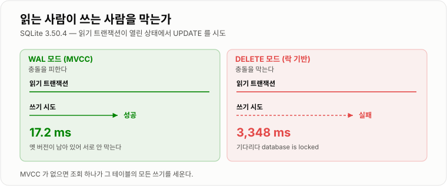
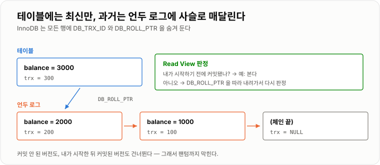
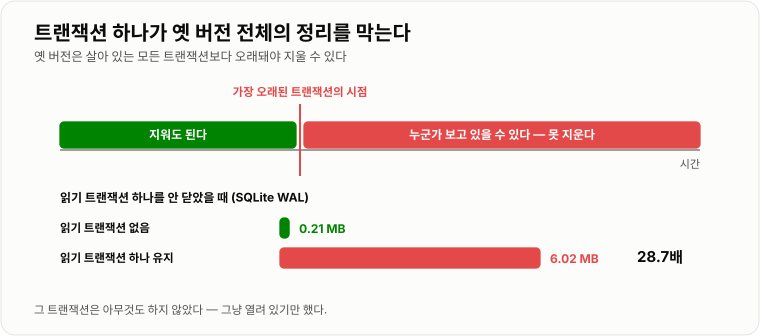

# MVCC

> **MVCC는 "데이터를 덮어쓰지 않고 새 버전을 쌓는" 전략이다. 덮어쓰지 않으니 읽는 사람은 옛 버전을 계속 볼 수 있고, 그래서 읽기가 쓰기를 막지 않는다. 대신 옛 버전을 언제 버릴지가 새로운 문제가 된다.**

---

## 1. 핵심 요약

**MVCC는 덮어쓰지 않고 버전을 쌓아 읽기와 쓰기가 서로를 비켜 가게 만든 장치이고, 그 대가로 "옛 버전을 언제 버릴까"라는 문제를 떠안았다 — 그래서 MVCC 환경의 성능 사고는 거의 언제나 닫히지 않은 트랜잭션 하나에서 시작한다.**

### 한눈에 보기

* MVCC(Multi-Version Concurrency Control)는 **하나의 행에 여러 시점의 값을 함께 두는** 동시성 제어 방식이다.
* 핵심 효과는 하나다. **읽기가 쓰기를 막지 않고, 쓰기가 읽기를 막지 않는다.**
* 실측으로 확인했다. 읽기 트랜잭션이 열린 상태에서 쓰기를 시도하면 **MVCC는 17.2 ms에 성공**했고, 락 기반은 **3,348 ms를 기다리다 실패**했다(`database is locked`).
* **스냅숏은 시점을 통째로 고정한다.** 읽는 도중 남이 `2000`으로 커밋해도 내 트랜잭션은 계속 `1000`을 봤고, 내가 커밋한 뒤 다시 읽으니 `2000`이 보였다.
* 행 단위가 아니라 **시점 자체를 고정**하기 때문에 **팬텀 리드까지 자동으로 막힌다.** MVCC 엔진의 `REPEATABLE READ`가 표준 표보다 강한 이유다.
* `READ COMMITTED`와 `REPEATABLE READ`의 차이는 **스냅숏을 언제 뜨느냐** 하나뿐이다. 문장마다 뜨면 RC, 트랜잭션 시작 시 한 번 뜨면 RR이다.
* **MVCC는 읽기만 해결한다.** 쓰기끼리는 여전히 락으로 부딪히고, **갱신 손실도 그대로 발생한다.**
* **비용은 옛 버전 보관이다.** 오래된 읽기 트랜잭션 하나를 안 닫았더니 저장 공간이 **0.21 MB → 6.02 MB(28.7배)** 로 늘었다.
* InnoDB에서 이 비용은 **언두 테이블스페이스 팽창과 `History list length` 상승**으로 나타난다. 원인은 거의 항상 **닫히지 않은 트랜잭션 하나**다.
* MVCC 엔진에서는 **"읽기니까 트랜잭션을 안 닫아도 괜찮다"가 가장 위험한 생각**이다. 읽기 트랜잭션이 쓰기 쪽 청소를 막는다.

> 이 노트의 수치는 **SQLite 3.50.4(WAL 모드 = 실제 MVCC, DELETE 모드 = 락 기반)** 와 **H2 1.4.200(MVStore)**, **JDK 17.0.12**에서 직접 측정한 것이다. 버전 체인·스냅숏·옛 버전 정리라는 구조는 MySQL InnoDB·PostgreSQL·Oracle에서 동일하게 성립한다. **엔진마다 다른 부분(옛 버전을 어디에 두는가, 정리 주체가 누구인가)은 본문에서 따로 표시했다.**

### 무엇을 해결하는가

#### 해결하려는 문제

동시성을 락만으로 제어하면 아주 단순한 규칙이 나온다.

```text
읽을 때는 공유 락(S)  — 여럿이 동시에 읽을 수 있다
쓸 때는 배타 락(X)    — 혼자만 쓸 수 있고, 읽는 사람도 막는다
```

이 규칙은 정확하지만 **치명적인 부작용**이 있다.

```text
관리자가 월간 리포트를 뽑는다  (10초짜리 조회)
   ↓
그동안 그 테이블에 대한 모든 주문 INSERT / UPDATE 가 멈춘다
   ↓
서비스가 10초간 정지한다
```

**조회 하나가 서비스를 세운다.** 그리고 대부분의 서비스는 읽기가 쓰기보다 압도적으로 많다. 락 기반에서는 읽기가 늘어날수록 쓰기가 죽는다.

이 문제를 SQLite로 직접 재현했다. 읽기 트랜잭션을 열어 둔 채 다른 커넥션에서 쓰기를 시도한 결과다.

```text
읽기 트랜잭션이 열린 상태에서 UPDATE 를 시도

  WAL 모드 (MVCC)        쓰기 성공        17.2 ms
  DELETE 모드 (락 기반)   쓰기 차단     3,348.1 ms  →  "database is locked"
```

**락 기반에서는 3.3초를 기다리다 결국 실패했다.** 읽는 사람이 쓰는 사람을 완전히 막은 것이다.



*MVCC에서는 쓰는 사람이 자기 일을 끝냈고, 락 기반에서는 일을 아예 못 했다.*

#### 이 개념이 없을 때

락 기반에서 이 문제를 피하려면 개발자가 직접 우회해야 한다.

```java
// 방법 1 — 격리 수준을 낮춘다. 정확성을 포기하는 것이다
@Transactional(isolation = Isolation.READ_UNCOMMITTED)
public Report buildMonthlyReport() {
    // 커밋되지 않은 값, 롤백될 값이 리포트에 섞여 들어간다
    return new Report(orderRepository.sumAmount(), orderRepository.count());
}

// 방법 2 — 리포트용 테이블을 따로 복사해 둔다
public Report buildMonthlyReport() {
    // 새벽 배치로 orders → orders_snapshot 복사
    // 저장 공간이 두 배가 되고, 데이터가 하루 낡는다
    return new Report(snapshotRepository.sumAmount(), snapshotRepository.count());
}

// 방법 3 — 조회를 잘게 쪼갠다
public Report buildMonthlyReport() {
    long sum = 0;
    for (int day = 1; day <= 31; day++) {
        sum += orderRepository.sumAmountByDay(day);   // 락을 짧게 여러 번 잡는다
    }
    // 그런데 이러면 각 조회 사이에 데이터가 바뀐다. 합계가 어느 시점 것인지 알 수 없다
    return new Report(sum, orderRepository.count());
}
```

**셋 다 무언가를 포기한다.** 정확성을 포기하거나, 저장 공간과 신선도를 포기하거나, 시점 일관성을 포기한다.

MVCC는 이 셋 중 아무것도 포기하지 않는다. **읽는 사람에게는 자기가 시작한 시점의 세상을 보여주고, 쓰는 사람은 그와 무관하게 새 버전을 쌓게 두면 된다.**

```java
@Transactional(readOnly = true)
public Report buildMonthlyReport() {
    long sum = orderRepository.sumAmount();
    long count = orderRepository.count();
    // 두 집계가 같은 시점을 본다. 그동안 INSERT 는 아무 방해 없이 진행된다
    return new Report(sum, count);
}
```

---

## 2. 동작 원리

### 핵심 구성 요소

| 개념 | 설명 | 중요한 이유 |
| --- | --- | --- |
| **버전 (Version)** | 한 행의 특정 시점 값 | 덮어쓰지 않으니 여러 개가 공존한다. |
| **버전 체인** | 같은 행의 버전들을 최신 → 과거로 연결한 목록 | 옛 값을 찾아가는 경로다. |
| **스냅숏 (Snapshot)** | 특정 시점의 DB 전체 모습 | **시점을 통째로 고정**하는 것이 핵심이다. |
| **Read View** | 스냅숏을 판정하기 위한 트랜잭션 ID 정보 묶음 | "이 버전이 내게 보이는가"를 결정한다. |
| **트랜잭션 ID** | 트랜잭션마다 증가하며 붙는 번호 | 버전의 나이를 비교하는 기준이다. |
| **언두 로그 (Undo Log)** | 변경 전 값을 담아 둔 기록 | **롤백에도 쓰이고 옛 버전 제공에도 쓰인다.** |
| **일관된 읽기 (Consistent Read)** | 스냅숏을 보는 읽기. 락을 안 잡는다 | 평범한 `SELECT`가 여기 해당한다. |
| **현재 읽기 (Current Read)** | 최신 데이터를 보는 읽기. 락을 잡는다 | `SELECT ... FOR UPDATE`, `UPDATE`, `DELETE`. |
| **퍼지 (Purge)** | 아무도 안 보는 옛 버전을 지우는 작업 | 이게 밀리면 저장 공간이 부푼다. |
| **History list length** | 아직 정리 못 한 옛 버전의 양 | **긴 트랜잭션을 잡아내는 지표.** |

#### MVCC를 한 문장으로

```text
락 기반          "네가 읽는 동안 아무도 못 바꾼다"        → 쓰기가 막힌다
MVCC            "네가 읽는 동안 남이 바꿔도 넌 옛것을 본다"  → 아무도 안 막힌다
```

**차이는 "충돌을 막는가"와 "충돌을 피하는가"다.** MVCC는 충돌 자체를 없앤다. 읽는 사람과 쓰는 사람이 애초에 서로 다른 데이터를 보기 때문이다.

### 내부 동작 과정

#### 행 하나에 숨어 있는 것

InnoDB의 모든 행에는 사용자가 만들지 않은 컬럼이 두 개 더 있다.

```text
사용자가 보는 행                    실제로 저장된 행
┌────┬─────────┐                ┌────┬─────────┬───────────┬─────────────┐
│ id │ balance │                │ id │ balance │ DB_TRX_ID │ DB_ROLL_PTR │
├────┼─────────┤                ├────┼─────────┼───────────┼─────────────┤
│ 1  │  1000   │                │ 1  │  1000   │    100    │   0x...     │
└────┴─────────┘                └────┴─────────┴───────────┴─────────────┘
                                              ↑            ↑
                                    이 값을 만든        이전 버전이
                                    트랜잭션 번호       있는 곳
```

* **`DB_TRX_ID`** — 이 버전을 마지막으로 건드린 트랜잭션의 번호
* **`DB_ROLL_PTR`** — 언두 로그에 있는 **이전 버전**을 가리키는 포인터

#### 버전 체인이 만들어지는 과정

```text
초기 상태 (트랜잭션 100 이 만듦)

  테이블:  [ balance=1000, trx=100, ptr=NULL ]


트랜잭션 200 이 UPDATE balance=2000 (커밋 전)

  테이블:  [ balance=2000, trx=200, ptr ]───┐
                                            ↓
  언두:                              [ balance=1000, trx=100, ptr=NULL ]


트랜잭션 300 이 UPDATE balance=3000

  테이블:  [ balance=3000, trx=300, ptr ]───┐
                                            ↓
  언두:                              [ balance=2000, trx=200, ptr ]───┐
                                                                      ↓
                                     [ balance=1000, trx=100, ptr=NULL ]
```

**테이블에는 항상 최신 버전만 있고, 과거는 언두 로그에 사슬로 매달려 있다.** 옛 값을 읽어야 하는 트랜잭션은 이 사슬을 따라 내려가서 자기에게 맞는 버전을 찾는다.

> **엔진마다 옛 버전을 두는 곳이 다르다.** InnoDB·Oracle은 **언두 영역에 따로** 두고 테이블에는 최신만 남긴다. PostgreSQL은 **테이블 안에 옛 버전을 그대로** 두고 나중에 `VACUUM`으로 지운다. 그래서 PostgreSQL은 테이블 자체가 부풀고(bloat) `VACUUM`이 중요한 반면, InnoDB는 언두 테이블스페이스가 부푼다. **현상은 다르지만 원인은 같다 — 아무도 안 보는 옛 버전이 안 지워진 것이다.**

#### Read View — 어느 버전이 내게 보이는가

트랜잭션이 스냅숏을 뜬다는 것은 **그 순간 살아 있는 트랜잭션 목록을 찍어 두는 것**이다.

```text
Read View 를 뜨는 순간 기록하는 것

  m_ids        지금 실행 중인(커밋 안 된) 트랜잭션 번호 목록
  min_trx_id   그중 가장 작은 번호
  max_trx_id   다음에 배정될 번호
  creator      나 자신의 번호
```

버전 하나를 만났을 때의 판정 규칙은 단순하다.

```text
버전의 DB_TRX_ID 를 보고

  1) 내 번호와 같다          → 보인다  (내가 바꾼 것)
  2) min_trx_id 보다 작다    → 보인다  (내가 시작하기 전에 이미 커밋됨)
  3) max_trx_id 보다 크거나 같다 → 안 보인다 (내가 시작한 뒤에 시작된 트랜잭션)
  4) m_ids 안에 있다         → 안 보인다 (아직 커밋 안 됨)
  5) 그 외                  → 보인다  (내가 시작하기 전에 커밋됨)

  안 보이면 → DB_ROLL_PTR 을 따라 이전 버전으로 내려가서 다시 판정
```

**"커밋 안 된 것은 안 보인다"와 "내가 시작한 뒤 커밋된 것도 안 보인다"** 두 가지가 전부다. 앞의 것이 Dirty Read를 막고, 뒤의 것이 Non-repeatable Read와 Phantom Read를 막는다.



*안 보이는 버전을 만나면 `DB_ROLL_PTR`을 따라 내려가 다시 판정한다.*

#### 스냅숏을 언제 뜨는가 — RC와 RR의 유일한 차이

```text
READ COMMITTED — 문장마다 Read View 를 새로 뜬다

  BEGIN
    SELECT ... ← Read View #1  (여기까지 커밋된 것을 봄)
       [ 남이 커밋 ]
    SELECT ... ← Read View #2  (방금 커밋된 것도 보임)   ← 값이 달라진다
  COMMIT


REPEATABLE READ — 첫 읽기에서 한 번만 뜨고 끝까지 쓴다

  BEGIN
    SELECT ... ← Read View #1  (여기까지 커밋된 것을 봄)
       [ 남이 커밋 ]
    SELECT ... ← Read View #1 그대로  (안 보임)          ← 값이 고정된다
  COMMIT
```

**구현 차이가 이것 하나뿐이다.** 그래서 MVCC 엔진에서 RC와 RR은 읽기 성능이 사실상 같다. 둘 다 스냅숏을 읽을 뿐이고, 스냅숏을 몇 번 뜨느냐만 다르다.

#### 실측 — 스냅숏이 정말 시점을 고정하는가

SQLite WAL 모드에서 커넥션 두 개로 확인했다.

```text
A: BEGIN
A: SELECT balance → 1000
B:                    BEGIN → UPDATE balance=2000 → COMMIT   (성공)
A: SELECT balance → 1000        ← 남이 커밋했는데도 그대로다
A: COMMIT
A: SELECT balance → 2000        ← 트랜잭션을 닫으니 새 값이 보인다
```

같은 시나리오를 락 기반(DELETE 모드)으로 돌리면 결과가 완전히 다르다.

```text
A: BEGIN
A: SELECT balance → 1000
B:                    BEGIN → UPDATE → 실패 ("database is locked")
A: SELECT balance → 1000
A: COMMIT
A: SELECT balance → 1000        ← B 의 쓰기 자체가 없던 일이 됐다
```

**MVCC에서는 B가 자기 일을 끝냈고, 락 기반에서는 B가 일을 못 했다.** 이것이 처리량의 차이로 직결된다.

#### 팬텀 리드가 자동으로 막히는 이유

MVCC는 **행 단위로 막는 것이 아니라 시점 자체를 고정**한다. 그래서 "없던 행이 생기는" 팬텀도 그냥 안 보인다.

```text
락 기반의 발상                     MVCC 의 발상
──────────────────────────       ──────────────────────────
읽은 행들을 잠근다                 시작 시점의 스냅숏을 본다
  → 그 행들은 안 바뀐다             → 그 이후 커밋된 건 값이든 행이든 안 보인다
  → 그런데 새 행이 끼어들 수 있다    → 새 행도 "그 이후 커밋"이므로 안 보인다
  → 팬텀 발생                      → 팬텀 없음
```

H2에서 실제로 확인했다.

```text
격리 수준            Non-repeatable Read     Phantom Read
──────────────────────────────────────────────────────────
READ COMMITTED      발생 (1000 → 2000)      발생 (3행 → 4행)
REPEATABLE READ     차단 (1000 → 1000)      차단 (3행 → 3행)
```

**표준 SQL 표에서는 RR이 팬텀을 허용한다고 되어 있지만, 스냅숏 방식에서는 막힌다.** MySQL InnoDB도 같다.

> **다만 InnoDB에는 예외가 있다.** `SELECT ... FOR UPDATE`나 `UPDATE`는 스냅숏이 아니라 **최신 데이터를 본다**(현재 읽기). 스냅숏을 쓰면 이미 사라진 행을 잠그는 일이 생기기 때문이다. 이때는 팬텀이 다시 문제가 되므로 InnoDB는 **갭 락(next-key lock)** 으로 그 구간에 `INSERT` 자체를 막는다. **일관된 읽기는 스냅숏으로, 현재 읽기는 갭 락으로 — 두 가지 다른 방법으로 같은 결과를 낸다.**

#### 일관된 읽기 vs 현재 읽기

같은 트랜잭션 안에서도 문장에 따라 보는 것이 다르다. 처음 보면 반드시 헷갈리는 부분이다.

```sql
-- 트랜잭션 시작 시점에 balance = 1000, 이후 남이 2000 으로 커밋했다고 하자

START TRANSACTION;

SELECT balance FROM account WHERE id = 1;              -- 1000  (일관된 읽기, 스냅숏)
SELECT balance FROM account WHERE id = 1 FOR UPDATE;   -- 2000  (현재 읽기, 최신)
UPDATE account SET balance = balance + 100 ...;        -- 2100 이 된다 (현재 읽기 기준)
SELECT balance FROM account WHERE id = 1;              -- 2100  (내가 바꿨으니 보인다)

COMMIT;
```

**같은 트랜잭션에서 같은 행을 읽었는데 1000과 2000이 나온다.** `FOR UPDATE`가 붙는 순간 스냅숏을 버리고 최신을 보기 때문이다. 재고 차감 로직에서 이 차이를 모르면 엉뚱한 값으로 계산하게 된다.

#### 옛 버전은 언제 지우는가 — 그리고 왜 안 지워지는가

버전은 무한정 쌓일 수 없다. **아무도 안 보는 버전**은 지워야 한다.

```text
"아무도 안 본다" = 살아 있는 모든 트랜잭션의 스냅숏보다 오래됐다

  가장 오래된 트랜잭션의 시점
           │
   ────────┼──────────────────────────→ 시간
           │
  지워도 됨 │ 누군가 보고 있을 수 있음
```

**그래서 오래 살아 있는 트랜잭션 하나가 그 시점 이후의 모든 옛 버전을 붙잡는다.** 트랜잭션이 무엇을 하는지는 상관없다. 그냥 열려 있기만 해도 그렇다.



*가장 오래된 스냅숏이 정리 가능한 경계선을 붙든다. 트랜잭션 하나가 전체 청소를 막는다.*

---

## 3. 특징과 비교

| 구분          | 내용                                       |
| ----------- | ---------------------------------------- |
| **장점**      | 읽기가 쓰기를 막지 않아 긴 조회가 서비스를 세우지 않는다. 락 없이 일관된 시점을 얻고, 시점을 고정하므로 팬텀까지 막힌다. |
| **단점**      | 옛 버전 보관 공간이 든다(실측 28.7배). 정리가 밀리면 언두 팽창·bloat·`ORA-01555`로 나타나고, 핫 로우에서 버전 체인 탐색이 느려진다. |
| **적합한 상황**  | 조회만 하는 트랜잭션. 여러 집계의 시점을 맞춰야 할 때 `REPEATABLE READ`. |
| **주의할 상황**  | **읽기 전용 트랜잭션도 오래 열려 있으면 똑같이 위험하다.** 재고·잔액을 스냅숏으로 읽고 판단해서 쓰는 것 — 현재 읽기나 원자적 `UPDATE`로 간다. |

### 성능 특성

#### 읽기가 쓰기를 막는가

SQLite 3.50.4, 읽기 트랜잭션을 연 상태에서 다른 커넥션이 `UPDATE`를 시도.

```text
방식                       결과            소요
────────────────────────────────────────────────────────
WAL 모드 (MVCC)            쓰기 성공         17.2 ms
DELETE 모드 (락 기반)       쓰기 차단      3,348.1 ms  → 실패
```

**락 기반은 `busy_timeout` 3초를 전부 소진하고 실패했다.** 읽기가 조금만 길어도 쓰기가 통째로 죽는다는 뜻이다.

#### 옛 버전 보관 비용 — MVCC가 지불하는 값

20,000행에 30회 전체 갱신 + 매번 체크포인트를 돌린 뒤 저장 공간을 쟀다.

```text
조건                            저장 공간
─────────────────────────────────────────────
오래된 읽기 트랜잭션 없음          0.21 MB
오래된 읽기 트랜잭션 하나 유지      6.02 MB      28.7배
```

**읽기 트랜잭션 하나를 안 닫았을 뿐인데 28.7배가 됐다.** 그 트랜잭션은 아무것도 하지 않고 그냥 열려 있기만 했다.

이것이 운영에서 나타나는 모습은 이렇다.

| 엔진 | 증상 | 확인 방법 |
| --- | --- | --- |
| **MySQL InnoDB** | 언두 테이블스페이스 팽창, 조회 지연 | `SHOW ENGINE INNODB STATUS`의 `History list length` |
| **PostgreSQL** | 테이블 bloat, 인덱스 비대화 | `pg_stat_user_tables`의 `n_dead_tup` |
| **Oracle** | `ORA-01555: snapshot too old` | 언두 테이블스페이스 사용률 |

**Oracle의 `ORA-01555`가 특히 흥미롭다.** 옛 버전이 이미 지워졌는데 오래된 트랜잭션이 그걸 읽으려 해서 나는 오류다. **MVCC의 비용을 가장 노골적으로 보여주는 에러 메시지**다.

#### 격리 수준별 읽기 비용

MVCC 엔진에서 `READ COMMITTED`와 `REPEATABLE READ`는 **읽기 성능 차이가 사실상 없다.**

```text
READ COMMITTED     문장마다 Read View 생성 (가볍다)  + 버전 체인 탐색
REPEATABLE READ    Read View 한 번만 생성            + 버전 체인 탐색
```

**차이는 Read View 생성 횟수뿐이고, 이건 매우 싸다.** 진짜 비용은 둘 다 공통으로 지불하는 **버전 체인 탐색**이다.

#### 버전 체인이 길어지면 읽기가 느려진다

```text
같은 행을 100번 갱신하는 동안 오래된 트랜잭션이 열려 있으면

  최신 버전 조회       버전 1개만 보면 됨          빠름
  오래된 스냅숏 조회    버전 100개를 따라 내려감    느림
```

**핫 로우(같은 행을 계속 갱신하는 경우)에서 이 비용이 크다.** 조회수 카운터처럼 초당 수백 번 갱신되는 행이 대표적이다. 그래서 조회수 같은 것은 DB가 아니라 Redis에서 세는 것이 좋다.

#### MVCC가 해결하지 못하는 것

| 문제 | MVCC로 해결되나 | 이유 |
| --- | --- | --- |
| 읽기가 쓰기를 막음 | **해결** | 실측 17.2 ms vs 3,348 ms |
| 쓰기가 읽기를 막음 | **해결** | 읽는 사람은 옛 버전을 본다 |
| Dirty Read | **해결** | 커밋 안 된 버전은 안 보인다 |
| Non-repeatable Read | **해결** (RR) | 스냅숏 고정 |
| Phantom Read | **해결** (RR, 일관된 읽기) | 시점 자체를 고정 |
| **쓰기끼리의 충돌** | **해결 안 됨** | 최신 버전은 하나뿐이라 락이 필요하다 |
| **갱신 손실** | **해결 안 됨** | 실측에서 RR·SERIALIZABLE 모두 발생 |
| **데드락** | **해결 안 됨** | 쓰기 락은 여전히 존재한다 |

**MVCC는 "읽기와 쓰기" 사이의 충돌만 없앤다.** "쓰기와 쓰기"는 그대로 남는다. 최신 버전은 결국 하나뿐이고 그것을 고칠 권리는 한 명만 가질 수 있기 때문이다.

### 장점과 단점

#### 장점

| 장점 | 근거 |
| --- | --- |
| **읽기가 쓰기를 막지 않는다** | 실측 17.2 ms 성공 vs 3,348 ms 후 실패. MVCC의 존재 이유다. |
| **긴 조회가 서비스를 세우지 않는다** | 리포트·통계가 트래픽과 무관하게 돌아간다. |
| **일관된 시점을 락 없이 얻는다** | 여러 집계의 시점을 맞추는 데 잠금이 필요 없다. |
| **팬텀까지 자동으로 막힌다** | 행이 아니라 시점을 고정하기 때문. 실측 확인. |
| **롤백 인프라를 재사용한다** | 언두 로그는 어차피 원자성 때문에 필요했다. |
| **읽기 부하가 늘어도 쓰기가 안 죽는다** | 읽기 비중이 큰 서비스에 특히 유리하다. |

#### 단점

| 단점 | 근거 |
| --- | --- |
| **옛 버전 보관 공간이 든다** | 실측 28.7배. 긴 트랜잭션 하나면 충분하다. |
| **정리 작업이 밀리면 성능이 무너진다** | InnoDB 언두 팽창, PostgreSQL bloat, Oracle `ORA-01555`. |
| **버전 체인 탐색 비용이 있다** | 핫 로우에서 옛 스냅숏 조회가 느려진다. |
| **쓰기 충돌은 그대로다** | 락과 데드락은 여전히 존재한다. |
| **갱신 손실을 못 막는다** | 실측에서 RR·SERIALIZABLE 모두 발생. |
| **읽는 값이 "지금"이 아니다** | 스냅숏은 정의상 과거다. 재고 검사에 그대로 쓰면 안 된다. |
| **일관된 읽기와 현재 읽기가 섞인다** | 같은 트랜잭션에서 1000과 2000이 나온다. 헷갈리기 쉽다. |

### 어떤 상황에서 고르는가

#### MVCC를 의식해야 하는 순간

```text
이 트랜잭션이 하는 일은 무엇인가?
   │
   ├─ 조회만 한다
   │     → 스냅숏으로 충분하다. readOnly = true 로 두고 짧게 끝낸다.
   │       여러 집계의 시점을 맞춰야 하면 REPEATABLE READ.
   │
   └─ 읽고 판단해서 쓴다
         │
         ├─ 읽은 값이 낡아도 되는가?
         │     → 그렇다면 그냥 SELECT (일관된 읽기)
         │
         └─ 반드시 최신이어야 하는가? (재고·잔액·수량)
               → SELECT ... FOR UPDATE (현재 읽기) 또는 원자적 UPDATE
               → 스냅숏을 믿으면 안 되는 지점이다
```

#### 트랜잭션 길이 기준

| 트랜잭션 유지 시간 | 판정 | 조치 |
| --- | --- | --- |
| ~ 100 ms | 정상 | 없음 |
| 100 ms ~ 1초 | 주의 | 외부 호출·파일 처리가 섞여 있는지 확인 |
| 1초 ~ 10초 | 위험 | 트랜잭션 범위를 쪼갠다 |
| 10초 이상 | **사고** | 옛 버전이 계속 쌓인다. 알람을 건다 |

**읽기 전용이라고 예외가 아니다.** 실측에서 공간을 28.7배로 만든 것은 아무것도 안 하는 읽기 트랜잭션이었다.

#### 언제 스냅숏을 벗어나야 하는가

| 상황 | 스냅숏으로 충분? | 이유 |
| --- | --- | --- |
| 상품 목록 조회 | **충분** | 몇 밀리초 낡아도 문제없다 |
| 주문 내역 조회 | **충분** | 남이 바꿀 데이터가 아니다 |
| 월간 통계 | **충분하고 오히려 유리** | 시점 일관성이 필요하다 |
| **재고 차감** | **부족** | 낡은 값으로 판단하면 초과 판매 |
| **잔액 출금** | **부족** | 낡은 값으로 판단하면 마이너스 잔액 |
| **쿠폰 발급 수량** | **부족** | 낡은 값으로 판단하면 초과 발급 |

**규칙은 하나다. 읽은 값으로 "된다/안 된다"를 판단해서 쓰기까지 한다면 스냅숏을 믿으면 안 된다.**

### 비슷한 기술과 비교

#### MVCC vs 락 기반 동시성 제어

| 기준 | MVCC | 락 기반 |
| --- | --- | --- |
| 기본 발상 | **충돌을 피한다** (다른 버전을 본다) | **충돌을 막는다** (기다리게 한다) |
| 읽기가 쓰기를 | **안 막는다** | 막는다 |
| 쓰기가 읽기를 | **안 막는다** | 막는다 |
| 쓰기가 쓰기를 | 막는다 | 막는다 |
| 실측 (읽는 중 쓰기) | **17.2 ms 성공** | 3,348 ms 후 실패 |
| 비용 | **저장 공간** (실측 28.7배) | **대기 시간** |
| 읽는 값 | 과거 시점 | 현재 |
| 대표 엔진 | InnoDB, PostgreSQL, Oracle | SQL Server 기본, SQLite 롤백 저널 |

#### 일관된 읽기 vs 현재 읽기

| 기준 | 일관된 읽기 (Consistent Read) | 현재 읽기 (Current Read) |
| --- | --- | --- |
| 보는 것 | **스냅숏** (과거) | **최신** (현재) |
| 락 | 안 잡는다 | **잡는다** |
| 문장 | 평범한 `SELECT` | `SELECT ... FOR UPDATE`, `UPDATE`, `DELETE`, `INSERT ... SELECT` |
| 다른 트랜잭션 | 안 막는다 | 막는다 |
| 팬텀 방지 방법 | 스냅숏 | **갭 락** |
| 쓸 곳 | 조회, 리포트 | 재고·잔액 검사 후 갱신 |

#### RC vs RR — MVCC 관점

| 기준 | READ COMMITTED | REPEATABLE READ |
| --- | --- | --- |
| Read View 생성 | **문장마다** | **트랜잭션 첫 읽기에 한 번** |
| 같은 행 두 번 읽기 | 값이 바뀔 수 있다 | 고정된다 |
| 팬텀 (일관된 읽기) | 발생 | **차단** |
| 읽기 성능 | 사실상 같다 | 사실상 같다 |
| 옛 버전 보관 부담 | **작다** (스냅숏이 계속 갱신됨) | **크다** (시작 시점을 끝까지 붙듦) |
| 기본값인 DB | PostgreSQL, Oracle, SQL Server | **MySQL** |

**RR이 옛 버전을 더 오래 붙잡는다는 점이 실무에서 중요하다.** MySQL에서 긴 트랜잭션의 해악이 큰 이유 중 하나다.

#### InnoDB vs PostgreSQL — 옛 버전을 어디에 두는가

| 기준 | InnoDB | PostgreSQL |
| --- | --- | --- |
| 옛 버전 위치 | **언두 테이블스페이스** (별도) | **테이블 안** (같은 페이지 근처) |
| 테이블의 최신 버전 | 항상 최신만 | 옛 버전과 섞여 있다 |
| 정리 주체 | **퍼지 스레드** (자동) | **`VACUUM`** (autovacuum) |
| 부푸는 곳 | 언두 테이블스페이스 | **테이블과 인덱스** |
| 옛 버전 읽기 비용 | 언두 체인 탐색 | 페이지 안에 있어 상대적으로 저렴 |
| 최신 읽기 비용 | 저렴 | 죽은 튜플을 건너뛰어야 해서 bloat에 취약 |

#### MVCC vs 읽기 복제본

| 기준 | MVCC | 읽기 복제본 |
| --- | --- | --- |
| 해결하는 문제 | **읽기와 쓰기의 충돌** | **읽기 처리량 부족** |
| 데이터 신선도 | 트랜잭션 시작 시점 | 복제 지연만큼 과거 |
| 서버 대수 | 1대 | 2대 이상 |
| 쓰기 부하 분산 | 안 됨 | 안 됨 |
| 함께 쓰나 | **함께 쓴다** | **함께 쓴다** |

**둘은 대체재가 아니다.** MVCC는 한 서버 안에서 읽기와 쓰기가 안 부딪히게 하고, 복제본은 읽기 물량 자체를 나눈다.

---

## 4. 실무 주의사항

### 백엔드 실무 적용

#### 긴 트랜잭션을 상시 감시한다

```sql
-- MySQL: 60초 이상 살아 있는 트랜잭션
SELECT trx_id,
       trx_state,
       trx_started,
       TIMESTAMPDIFF(SECOND, trx_started, NOW()) AS running_sec,
       trx_rows_locked,
       trx_rows_modified,
       trx_query
  FROM information_schema.innodb_trx
 WHERE TIMESTAMPDIFF(SECOND, trx_started, NOW()) > 60
 ORDER BY trx_started;
```

```sql
-- 옛 버전이 얼마나 밀렸는지
SHOW ENGINE INNODB STATUS;
-- 출력에서 "History list length" 를 찾는다
```

**`History list length`가 수십만 이상에서 계속 오르면 어딘가 트랜잭션이 안 닫히고 있다.** 실측에서 확인한 28.7배 공간 증가의 운영판이다. 이 값을 모니터링 지표로 잡고 알람을 거는 것이 가장 실용적인 대응이다.

```sql
-- PostgreSQL: 오래된 트랜잭션과 죽은 튜플
SELECT pid, state, now() - xact_start AS duration, query
  FROM pg_stat_activity
 WHERE xact_start IS NOT NULL
 ORDER BY xact_start;

SELECT relname, n_live_tup, n_dead_tup, last_autovacuum
  FROM pg_stat_user_tables
 ORDER BY n_dead_tup DESC
 LIMIT 20;
```

#### `readOnly = true`를 습관으로 만든다

```java
@Service
@Transactional(readOnly = true)          // 클래스 기본값을 읽기 전용으로
public class OrderQueryService {

    private final OrderRepository orderRepository;

    public OrderQueryService(OrderRepository orderRepository) {
        this.orderRepository = orderRepository;
    }

    public List<OrderResponse> findByUser(long userId) {
        return orderRepository.findByUserId(userId);
    }

    @Transactional                        // 쓰기 메서드에만 따로 붙인다
    public void cancel(long orderId) {
        orderRepository.findById(orderId).orElseThrow().cancel();
    }
}
```

`readOnly = true`가 하는 일은 셋이다.

* JPA 영속성 컨텍스트가 **변경 감지용 스냅숏을 안 뜬다.** 메모리와 CPU를 아낀다.
* **읽기 복제본으로 라우팅할 힌트**가 된다.
* 실수로 쓰기가 들어가면 예외로 잡힌다.

**단, MVCC 관점에서 `readOnly = true`가 옛 버전 보관 부담을 줄여 주지는 않는다.** 읽기 전용이든 아니든 스냅숏은 유지되기 때문이다. 트랜잭션을 짧게 만드는 것이 유일한 해법이다.

#### 배치는 스냅숏을 오래 붙들지 않게 쪼갠다

```java
@Service
public class OrderMigrationBatch {

    private static final int CHUNK = 1000;

    private final OrderRepository orderRepository;
    private final MigrationService migrationService;

    public OrderMigrationBatch(OrderRepository orderRepository,
                               MigrationService migrationService) {
        this.orderRepository = orderRepository;
        this.migrationService = migrationService;
    }

    public void run() {
        long lastId = 0;
        while (true) {
            // 커서 방식으로 읽는다. 각 조회가 별개의 짧은 트랜잭션이다
            List<Long> ids = orderRepository.findIdsAfter(lastId, CHUNK);
            if (ids.isEmpty()) {
                break;
            }
            migrationService.migrate(ids);          // 여기도 별개의 짧은 트랜잭션
            lastId = ids.get(ids.size() - 1);
        }
    }
}
```

**트랜잭션이 수천 개로 나뉘지만 각각이 짧다.** 시점 일관성은 깨지지만 마이그레이션에서는 대개 문제가 되지 않는다. 반대로 트랜잭션 하나로 100만 건을 훑으면 그 시간 내내 옛 버전이 전부 살아남는다.

#### 재고·잔액은 스냅숏을 믿지 않는다

```java
// 방법 1 — 원자적 UPDATE (가장 단순하고 빠르다)
@Transactional
public void decreaseStock(long itemId) {
    int affected = stockRepository.decreaseIfEnough(itemId);
    if (affected == 0) {
        throw new OutOfStockException(itemId);
    }
}
```

```java
public interface StockRepository extends JpaRepository<Stock, Long> {

    @Modifying
    @Query("UPDATE Stock s SET s.qty = s.qty - 1 WHERE s.id = :id AND s.qty > 0")
    int decreaseIfEnough(@Param("id") long id);
}
```

```java
// 방법 2 — 중간에 복잡한 검증이 필요하면 현재 읽기로 잠근다
@Transactional
public void decreaseWithValidation(long itemId, long userId) {
    Stock stock = stockRepository.findByIdForUpdate(itemId).orElseThrow();  // 최신 + 락

    if (stock.getQty() <= 0) {
        throw new OutOfStockException(itemId);
    }
    if (purchaseHistoryRepository.countToday(userId, itemId) >= 3) {
        throw new PurchaseLimitException(userId);
    }
    stock.decrease();
}
```

**방법 1을 쓸 수 있으면 언제나 방법 1이 낫다.** 락을 잡는 구간이 없어서 경합에 강하다. 검증이 SQL로 표현되지 않을 때만 방법 2로 간다.

#### 핫 로우를 DB 밖으로 뺀다

```java
// 나쁜 예 — 조회수를 DB 에서 센다. 버전 체인이 끝없이 길어진다
@Transactional
public void increaseViewCount(long postId) {
    postRepository.increaseViewCount(postId);     // 초당 수백 번 같은 행을 갱신
}

// 좋은 예 — Redis 에서 세고 주기적으로 반영한다
public void increaseViewCount(long postId) {
    redisTemplate.opsForValue().increment("view:" + postId);
}

@Scheduled(fixedDelay = 60_000)
@Transactional
public void flushViewCounts() {
    // 1분에 한 번 DB 에 반영 → 버전 체인이 짧게 유지된다
    viewCountFlusher.flush();
}
```

**같은 행을 초당 수백 번 갱신하면 버전 체인이 길어져 그 행의 조회 전체가 느려진다.** 정확성이 조금 덜 중요한 카운터는 DB 밖에서 처리하는 것이 MVCC 관점에서도 옳다.

### 자주 하는 오해

| 오해 | 사실 |
| --- | --- |
| "MVCC를 쓰면 락이 필요 없다" | **쓰기끼리는 여전히 락으로 부딪힌다.** MVCC는 읽기-쓰기 충돌만 없앤다. |
| "MVCC가 갱신 손실을 막아 준다" | 안 막는다. 실측에서 `REPEATABLE READ`·`SERIALIZABLE` 모두 재고가 98이 아니라 99가 됐다. |
| "스냅숏을 읽으니 항상 정확한 값이다" | 스냅숏은 **정의상 과거**다. 재고 검사에 그대로 쓰면 초과 판매가 난다. |
| "읽기 전용 트랜잭션은 오래 열어 둬도 괜찮다" | **가장 위험한 오해.** 실측에서 공간을 28.7배로 만든 것이 바로 그 트랜잭션이다. |
| "`REPEATABLE READ`는 팬텀을 못 막는다" | **MVCC 엔진에서는 막는다.** 표준의 "허용"과 엔진의 "발생"은 다르다. 실측 확인. |
| "같은 트랜잭션에서 같은 행을 읽으면 항상 같은 값이다" | `FOR UPDATE`를 붙이면 스냅숏을 벗어나 최신을 본다. 1000과 2000이 같이 나올 수 있다. |
| "격리 수준을 올리면 MVCC 부담이 커진다" | **읽기 성능은 사실상 같다.** 커지는 것은 옛 버전 보관 기간이다. |
| "옛 버전은 커밋하면 바로 지워진다" | **살아 있는 모든 트랜잭션보다 오래돼야** 지운다. 하나만 붙잡고 있어도 못 지운다. |
| "PostgreSQL은 언두 로그가 없으니 MVCC가 아니다" | MVCC 맞다. **옛 버전을 테이블 안에 둘 뿐**이다. 그래서 `VACUUM`이 필요하다. |
| "MVCC와 읽기 복제본은 같은 문제를 푼다" | 다르다. MVCC는 **충돌**을, 복제본은 **처리량**을 다룬다. |
| "버전이 쌓여도 조회 속도는 그대로다" | 버전 체인을 따라 내려가야 한다. **핫 로우에서 눈에 띄게 느려진다.** |

---

## 5. 예제

### 스냅숏을 확인하는 코드

```java
public void observeSnapshot(DataSource dataSource) throws SQLException {
    Connection reader = dataSource.getConnection();
    Connection writer = dataSource.getConnection();
    try {
        reader.setAutoCommit(false);
        reader.setTransactionIsolation(Connection.TRANSACTION_REPEATABLE_READ);

        System.out.println("읽기 1 = " + readBalance(reader));      // 1000

        writer.setAutoCommit(false);
        PreparedStatement update = writer.prepareStatement(
                "UPDATE account SET balance = 2000 WHERE id = 1");
        update.executeUpdate();
        writer.commit();                                            // 남이 커밋했다

        System.out.println("읽기 2 = " + readBalance(reader));      // 1000 (스냅숏)

        reader.commit();                                            // 트랜잭션을 닫으면
        System.out.println("읽기 3 = " + readBalance(reader));      // 2000 (새 스냅숏)
    } finally {
        reader.close();
        writer.close();
    }
}

private int readBalance(Connection conn) throws SQLException {
    PreparedStatement select = conn.prepareStatement(
            "SELECT balance FROM account WHERE id = 1");
    ResultSet rs = select.executeQuery();
    rs.next();
    return rs.getInt("balance");
}
```

**주목할 점은 `writer.commit()`이 아무 대기 없이 끝난다는 것이다.** 락 기반이었다면 `reader`가 커밋할 때까지 막혔을 것이다.

### 일관된 읽기와 현재 읽기를 구분하는 코드

```java
// 잘못된 재고 차감 — 스냅숏(낡은 값)으로 계산한다
@Transactional
public void decreaseWrong(long itemId) {
    Stock stock = stockRepository.findById(itemId).orElseThrow();   // 일관된 읽기
    if (stock.getQty() <= 0) {
        throw new IllegalStateException("재고 없음");
    }
    stock.setQty(stock.getQty() - 1);                               // 낡은 값 기준
}
```

```java
// 올바른 재고 차감 — 현재 읽기로 최신 값을 잠그고 본다
@Transactional
public void decreaseCorrect(long itemId) {
    Stock stock = stockRepository.findByIdForUpdate(itemId).orElseThrow();  // 현재 읽기
    if (stock.getQty() <= 0) {
        throw new IllegalStateException("재고 없음");
    }
    stock.setQty(stock.getQty() - 1);
}
```

```java
public interface StockRepository extends JpaRepository<Stock, Long> {

    @Lock(LockModeType.PESSIMISTIC_WRITE)
    @Query("SELECT s FROM Stock s WHERE s.id = :id")
    Optional<Stock> findByIdForUpdate(@Param("id") long id);
}
```

**`@Lock(PESSIMISTIC_WRITE)`이 `SELECT ... FOR UPDATE`로 번역되면서 스냅숏이 아닌 최신 값을 본다.** 이 한 줄이 MVCC의 스냅숏을 의도적으로 벗어나는 스위치다.

### 리포트 조회 — MVCC가 빛나는 지점

```java
@Transactional(readOnly = true, isolation = Isolation.REPEATABLE_READ)
public MonthlyReport buildReport(long shopId, YearMonth month) {
    long orderCount = orderRepository.countByShopAndMonth(shopId, month);
    long itemCount = orderItemRepository.countByShopAndMonth(shopId, month);
    long totalAmount = orderRepository.sumAmountByShopAndMonth(shopId, month);

    // 세 집계가 모두 같은 스냅숏을 본다.
    // 그동안 신규 주문 INSERT 는 아무 방해 없이 진행된다.
    return new MonthlyReport(orderCount, itemCount, totalAmount);
}
```

**여기서 `REPEATABLE READ`가 하는 일은 세 집계의 시점을 맞추는 것뿐이다.** 락은 하나도 잡지 않는다. 락 기반 DB에서 같은 보장을 얻으려면 세 테이블을 전부 잠가야 했다.

### 긴 트랜잭션을 만드는 나쁜 코드

```java
// 나쁜 예 — 트랜잭션이 파일 처리 시간만큼 열려 있다
@Transactional
public void exportOrders(long shopId, Path output) throws IOException {
    List<Order> orders = orderRepository.findByShopId(shopId);   // 스냅숏이 여기서 잡힌다

    try (BufferedWriter writer = Files.newBufferedWriter(output)) {
        for (int i = 0; i < orders.size(); i++) {
            writer.write(orders.get(i).toCsvLine());             // 100만 건이면 수 분
            writer.newLine();
        }
    }
    // 이 메서드가 끝날 때까지 그 시점 이후의 모든 옛 버전이 정리되지 못한다
}
```

```java
// 좋은 예 — 데이터를 먼저 짧게 읽고, 파일 처리는 트랜잭션 밖에서 한다
public void exportOrders(long shopId, Path output) throws IOException {
    List<OrderCsvRow> rows = orderQueryService.loadRows(shopId);   // 트랜잭션은 여기서 끝

    try (BufferedWriter writer = Files.newBufferedWriter(output)) {
        for (int i = 0; i < rows.size(); i++) {
            writer.write(rows.get(i).toLine());
            writer.newLine();
        }
    }
}
```

**데이터가 너무 커서 한 번에 못 읽으면 커서 페이지네이션으로 나눠 읽는다.** 트랜잭션 여러 개로 나뉘어 시점 일관성은 깨지지만, 익스포트 용도에서는 대개 허용 가능한 거래다.

---

## 6. 면접 정리

### 자주 나오는 질문

#### 기본 질문

1. **MVCC가 무엇인가요?**

    * 핵심 키워드: 여러 버전 공존, 덮어쓰지 않음, 읽기와 쓰기가 서로를 막지 않음

2. **MVCC는 어떤 문제를 해결하려고 나왔나요?**

    * 핵심 키워드: 락 기반에서 읽기가 쓰기를 막음, 긴 조회가 서비스를 세움, 실측 3,348 ms 후 실패

3. **읽기와 쓰기를 동시에 처리할 수 있는 이유가 무엇인가요?**

    * 핵심 키워드: 쓰는 사람은 새 버전을 만들고 읽는 사람은 옛 버전을 봄, 서로 다른 데이터를 봄

4. **스냅숏이 무엇인가요?**

    * 핵심 키워드: 특정 시점의 DB 전체 모습, Read View, 실행 중 트랜잭션 목록

5. **버전 체인은 어떻게 만들어지나요?**

    * 핵심 키워드: `DB_TRX_ID`, `DB_ROLL_PTR`, 언두 로그, 테이블에는 최신만

6. **`READ COMMITTED`와 `REPEATABLE READ`는 MVCC 관점에서 무엇이 다른가요?**

    * 핵심 키워드: Read View를 문장마다 vs 트랜잭션 시작 시 한 번, 그것 하나뿐

7. **일관된 읽기와 현재 읽기의 차이는 무엇인가요?**

    * 핵심 키워드: 스냅숏 vs 최신, 락 안 잡음 vs 잡음, `SELECT` vs `SELECT ... FOR UPDATE`

8. **옛 버전은 언제 지워지나요?**

    * 핵심 키워드: 살아 있는 모든 트랜잭션보다 오래됐을 때, 퍼지 스레드, `VACUUM`

#### 꼬리 질문

1. **MVCC를 쓰면 락이 필요 없나요?**

    * 핵심 키워드: **쓰기끼리는 여전히 락**, 최신 버전은 하나뿐, 데드락도 그대로

2. **MVCC가 갱신 손실을 막아 주나요?**

    * 핵심 키워드: **안 막는다**, 실측 RR·SERIALIZABLE 모두 99, 원자적 `UPDATE`나 락 필요

3. **`REPEATABLE READ`에서 팬텀이 왜 막히나요? 표준에는 허용이라고 되어 있는데요.**

    * 핵심 키워드: 행이 아니라 시점을 고정, 새 행도 "시작 이후 커밋"이라 안 보임, 실측 3행 → 3행

4. **그런데 `SELECT ... FOR UPDATE`는 왜 최신을 보나요?**

    * 핵심 키워드: 이미 사라진 행을 잠글 수 없음, 현재 읽기, 팬텀은 갭 락으로 별도 차단

5. **오래 실행되는 트랜잭션이 왜 문제가 되나요?**

    * 핵심 키워드: 그 시점 이후 옛 버전을 전부 붙잡음, 실측 28.7배, `History list length`

6. **읽기 전용 트랜잭션도 문제가 되나요?**

    * 핵심 키워드: **된다**, 실측에서 공간을 28.7배로 만든 것이 아무것도 안 하는 읽기 트랜잭션

7. **`History list length`가 계속 오르면 무엇을 확인해야 하나요?**

    * 핵심 키워드: `information_schema.innodb_trx`, 안 닫힌 트랜잭션, 외부 호출이 섞인 긴 트랜잭션

8. **PostgreSQL은 언두 로그가 없는데 MVCC인가요?**

    * 핵심 키워드: MVCC 맞음, 옛 버전을 테이블 안에 둠, 그래서 bloat와 `VACUUM`

9. **Oracle의 `ORA-01555`는 왜 나나요?**

    * 핵심 키워드: 필요한 옛 버전이 이미 정리됨, 긴 트랜잭션 + 언두 부족, MVCC 비용의 노골적 표현

10. **조회수처럼 초당 수백 번 갱신되는 행은 왜 문제인가요?**

    * 핵심 키워드: 버전 체인이 길어져 조회가 느려짐, 핫 로우, Redis로 빼고 주기 반영

11. **MVCC와 읽기 복제본 중 무엇을 먼저 도입해야 하나요?**

    * 핵심 키워드: 다른 문제, MVCC는 충돌 / 복제본은 처리량, 함께 씀

### 30초 답변

> MVCC는 **데이터를 덮어쓰지 않고 새 버전을 쌓는 동시성 제어 방식**입니다. 목적은 하나입니다. **읽기가 쓰기를 막지 않게 하는 것**입니다.

#### 이어서 더 물으면

락만으로 제어하면 읽을 때 공유 락을 잡아야 해서, **관리자가 10초짜리 리포트를 뽑는 동안 그 테이블의 모든 쓰기가 멈춥니다.** SQLite로 직접 비교해 봤는데, 읽기 트랜잭션이 열린 상태에서 쓰기를 시도하면 **MVCC 모드는 17.2 ms에 성공**했고 **락 모드는 3,348 ms를 기다리다 "database is locked"로 실패**했습니다.

동작 원리는 이렇습니다. InnoDB의 모든 행에는 `DB_TRX_ID`와 `DB_ROLL_PTR`이 숨어 있습니다. 값을 바꾸면 **테이블에는 최신 버전을 쓰고 이전 값은 언두 로그로 밀어 넣어 사슬로 연결**합니다. 트랜잭션은 시작할 때 **그 순간 실행 중인 트랜잭션 목록(Read View)** 을 찍어 두고, 버전을 만날 때마다 "이건 내가 시작하기 전에 커밋된 것인가"를 판정해서 아니면 사슬을 따라 이전 버전으로 내려갑니다. 그래서 **커밋 안 된 값도 안 보이고, 내가 시작한 뒤 커밋된 값도 안 보입니다.**

여기서 나오는 결론이 두 가지입니다. **첫째, `READ COMMITTED`와 `REPEATABLE READ`의 차이는 Read View를 언제 뜨느냐 하나뿐입니다.** 문장마다 뜨면 RC, 트랜잭션 시작 시 한 번 뜨면 RR입니다. 그래서 MVCC 엔진에서 두 수준의 읽기 성능은 사실상 같습니다. **둘째, 행이 아니라 시점 자체를 고정하기 때문에 팬텀 리드까지 자동으로 막힙니다.** H2로 확인해 보니 `REPEATABLE READ`에서 행 수가 3행 → 3행으로 고정됐습니다. 표준 SQL 표와 다른 결과인데, MySQL InnoDB도 같은 이유로 그렇습니다.

**대가는 옛 버전 보관입니다.** 옛 버전은 살아 있는 모든 트랜잭션보다 오래돼야 지울 수 있어서, **트랜잭션 하나만 안 닫혀 있어도 그 시점 이후 전부가 살아남습니다.** 실측으로 재 보니 아무것도 안 하는 읽기 트랜잭션 하나를 유지했을 때 저장 공간이 **0.21 MB에서 6.02 MB로 28.7배** 늘었습니다. InnoDB에서 `History list length`가 치솟고 언두 테이블스페이스가 부푸는 현상, PostgreSQL의 테이블 bloat, Oracle의 `ORA-01555`가 전부 같은 원인입니다. 그래서 실무에서는 **읽기 전용이라도 트랜잭션을 짧게** 유지하고, `information_schema.innodb_trx`와 `History list length`에 알람을 겁니다.

마지막으로 **MVCC가 해결하지 않는 것**을 아는 게 중요합니다. MVCC는 읽기-쓰기 충돌만 없앱니다. **쓰기끼리는 여전히 락으로 부딪히고 갱신 손실도 그대로 발생합니다.** 그래서 재고나 잔액처럼 읽은 값으로 판단해서 쓰는 로직은 스냅숏을 믿으면 안 되고, `UPDATE ... WHERE qty > 0` 같은 원자적 갱신이나 `SELECT ... FOR UPDATE` 같은 현재 읽기로 가야 합니다.

#### 답변 구조

1. **정의** — 하나의 행에 여러 시점의 값을 함께 두어, 읽는 트랜잭션에게 자신이 시작한 시점의 버전을 보여주는 동시성 제어 방식이다. 목적은 읽기와 쓰기가 서로를 막지 않게 하는 것이다
2. **내부 원리** — 모든 행에 `DB_TRX_ID`와 `DB_ROLL_PTR`이 있고, 갱신 시 이전 값을 언두 로그로 밀어 버전 체인을 만든다. 트랜잭션은 Read View(실행 중인 트랜잭션 목록)를 찍어 두고 버전마다 가시성을 판정하며, 안 보이면 체인을 따라 내려간다. Read View를 문장마다 뜨면 `READ COMMITTED`, 트랜잭션 시작 시 한 번 뜨면 `REPEATABLE READ`다
3. **복잡도**
    * 읽는 중 쓰기: MVCC 17.2 ms 성공 vs 락 기반 3,348 ms 후 실패
    * 스냅숏 고정: 남이 2000으로 커밋해도 1000을 계속 읽고, 커밋 후 다시 읽으면 2000
    * 팬텀 차단: `REPEATABLE READ`에서 3행 → 3행 (표준 표와 다름)
    * 옛 버전 보관: 오래된 읽기 트랜잭션 하나로 0.21 MB → 6.02 MB (28.7배)
    * RC와 RR의 읽기 성능 차이: 사실상 없음 (Read View 생성 횟수만 다름)
4. **장점** — 읽기가 쓰기를 막지 않아 긴 조회가 서비스를 세우지 않는다. 락 없이 일관된 시점을 얻어 여러 집계의 시점을 맞출 수 있고, 시점을 고정하므로 팬텀까지 막힌다. 언두 로그는 원자성 때문에 어차피 필요했던 것이라 인프라를 재사용한다
5. **단점** — 옛 버전 보관 공간이 들고(실측 28.7배), 정리가 밀리면 언두 팽창·bloat·`ORA-01555`로 나타난다. 버전 체인 탐색 비용이 있어 핫 로우에서 느려지고, 쓰기 충돌·데드락·갱신 손실은 그대로 남는다. 읽는 값이 정의상 과거라 재고 검사에 그대로 쓰면 안 된다
6. **사용 기준** — 조회만 하면 스냅숏으로 충분하고 여러 집계의 시점을 맞춰야 하면 `REPEATABLE READ`를 쓴다. 읽은 값으로 "된다/안 된다"를 판단해서 쓰기까지 한다면 스냅숏을 믿지 말고 현재 읽기나 원자적 `UPDATE`로 간다. 트랜잭션은 읽기 전용이라도 1초를 넘기지 않게 관리한다
7. **대안과 비교** — 락 기반은 충돌을 막고 MVCC는 충돌을 피한다. 비용이 대기 시간에서 저장 공간으로 옮겨간 것이다. 읽기 처리량 자체가 부족하면 MVCC가 아니라 읽기 복제본이 답이고 둘은 함께 쓴다. 쓰기 충돌은 낙관적 락·비관적 락으로 따로 다룬다. 핫 로우 카운터는 Redis로 뺀다
8. **실무 적용 사례** — `information_schema.innodb_trx`로 60초 이상 트랜잭션을 감시하고 `History list length`에 알람을 건다. 조회 서비스는 클래스 단위로 `readOnly = true`를 걸고, 익스포트·마이그레이션은 커서 방식으로 잘라 트랜잭션을 짧게 유지한다. 재고 차감은 `UPDATE ... WHERE qty > 0`으로 원자화하고, 복잡한 검증이 필요할 때만 `@Lock(PESSIMISTIC_WRITE)`으로 현재 읽기를 쓴다. 조회수 같은 핫 로우는 Redis에서 세고 주기적으로 반영한다

### 핵심 키워드

`버전 (Version)` · `버전 체인` · `스냅숏 (Snapshot)` · `Read View` · `트랜잭션 ID` · `언두 로그 (Undo Log)` · `일관된 읽기 (Consistent Read)` · `현재 읽기 (Current Read)` · `퍼지 (Purge)` · `History list length`

### 이어서 볼 주제

* **ACID와 격리 수준** — MVCC가 격리성을 구현하는 한 가지 방법임을 확인한다. 이 노트가 "어떻게"라면 그 노트는 "무엇을"이다.
* **낙관적 락 · 비관적 락** — MVCC가 해결하지 못한 쓰기-쓰기 충돌을 다루는 방법이다.
* **InnoDB 언두 로그 구조** — 언두 세그먼트, 롤백 세그먼트, 언두 테이블스페이스 분리(MySQL 8.0). 퍼지 스레드가 실제로 하는 일.
* **InnoDB 락 종류** — 레코드 락, 갭 락, 넥스트 키 락. 현재 읽기가 팬텀을 막는 원리다.
* **PostgreSQL `VACUUM`과 autovacuum 튜닝** — 같은 문제를 다른 방식으로 푸는 엔진을 보면 MVCC의 본질이 선명해진다.
* **`SHOW ENGINE INNODB STATUS` 읽는 법** — `History list length`, 트랜잭션 목록, 최근 데드락을 실제 출력에서 찾아본다.
* **PostgreSQL의 SSI** — 스냅숏 격리 위에 직렬화 가능을 얹은 방식. 스냅숏만으로 부족한 지점(write skew)을 이해할 수 있다.
* **Write Skew** — 스냅숏 격리가 못 막는 대표적 이상 현상. MVCC의 이론적 한계다.

### 최종 체크리스트

* [ ] MVCC가 **"충돌을 막는 것"이 아니라 "충돌을 피하는 것"** 이라고 설명할 수 있다.
* [ ] MVCC의 핵심 효과가 **읽기와 쓰기가 서로를 막지 않는 것**임을 수치로 설명할 수 있다.
* [ ] `DB_TRX_ID`와 `DB_ROLL_PTR`이 무엇이고 버전 체인이 어떻게 만들어지는지 그릴 수 있다.
* [ ] Read View의 가시성 판정 규칙을 설명할 수 있다.
* [ ] **RC와 RR의 차이가 Read View 생성 시점 하나뿐**임을 설명할 수 있다.
* [ ] MVCC 엔진에서 **RR이 팬텀까지 막는 이유**를 "행이 아니라 시점을 고정한다"로 설명할 수 있다.
* [ ] 일관된 읽기와 현재 읽기를 구분하고, 같은 트랜잭션에서 다른 값이 나올 수 있음을 설명할 수 있다.
* [ ] 옛 버전이 **살아 있는 모든 트랜잭션보다 오래돼야** 지워진다는 규칙을 안다.
* [ ] 긴 트랜잭션이 만드는 비용을 **28.7배**라는 수치와 함께 설명할 수 있다.
* [ ] **읽기 전용 트랜잭션도 똑같이 위험하다**는 것을 안다.
* [ ] `History list length`가 무엇이고 왜 감시해야 하는지 안다.
* [ ] InnoDB와 PostgreSQL이 옛 버전을 어디에 두는지, 그 결과 무엇이 부푸는지 비교할 수 있다.
* [ ] **MVCC가 갱신 손실과 쓰기 충돌을 해결하지 않는다**는 것을 안다.
* [ ] 재고·잔액 로직에서 스냅숏을 믿으면 안 되는 이유를 설명할 수 있다.
* [ ] 핫 로우가 버전 체인을 길게 만들어 조회를 느리게 한다는 것을 안다.
