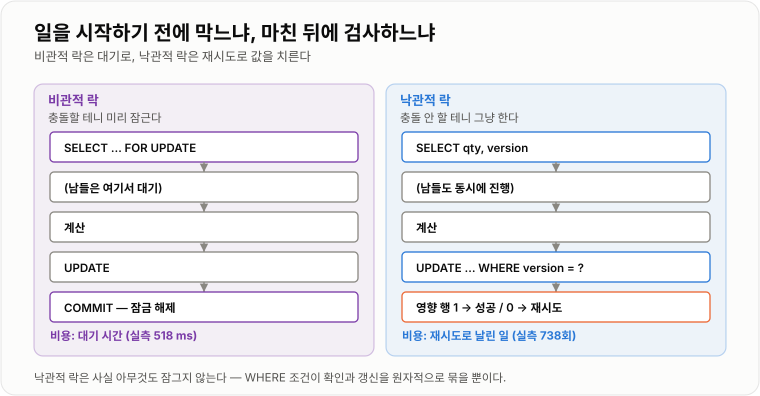
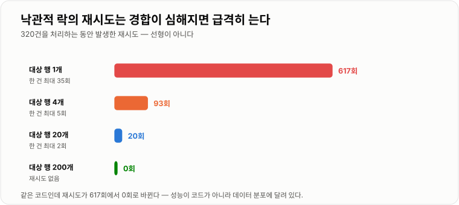
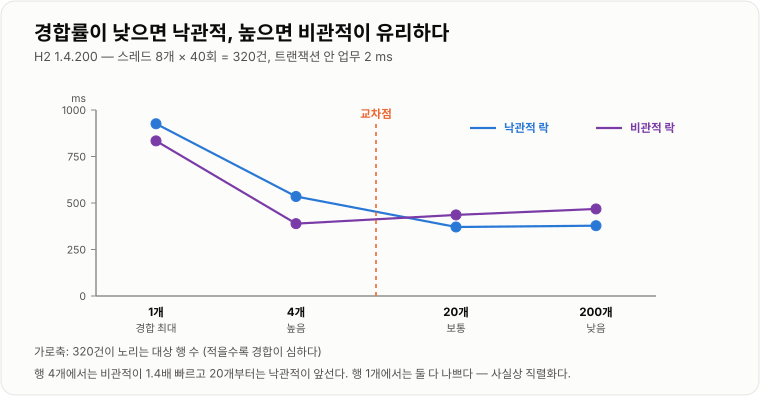

# 낙관적 락 · 비관적 락

> **격리 수준으로는 갱신 손실을 막지 못한다. 남은 선택지는 두 개다 — 충돌이 날 것 같으니 미리 잠그거나(비관적), 충돌은 드물 테니 나중에 확인하거나(낙관적). 어느 쪽이 유리한지는 취향이 아니라 충돌률이 정한다.**

---

## 1. 핵심 요약

**비관적 락은 대기로 값을 치르고 낙관적 락은 재시도로 값을 치르는데, 어느 쪽이 싼지는 충돌률이 정한다 — 그리고 그보다 먼저 물어야 할 것은 "이 검증을 `UPDATE` 한 문장으로 쓸 수 없나"이며, 쓸 수 있다면 락은 애초에 필요 없다.**

### 한눈에 보기

* 둘 다 **갱신 손실(Lost Update)** 을 막는 방법이다. 격리 수준으로는 안 막히기 때문에 필요하다.
* **비관적 락**은 읽을 때 미리 잠근다(`SELECT ... FOR UPDATE`). **낙관적 락**은 잠그지 않고 쓸 때 버전을 확인한다.
* **낙관적 락은 사실 락이 아니다.** 아무것도 잠그지 않는다. "충돌 감지 + 재시도"라고 부르는 편이 정확하다.
* 락을 안 걸면 데이터가 깨진다. 실측에서 같은 행에 320건을 동시 처리하니 **264건(82.5%)이 유실**됐다.
* **낙관적 락의 비용은 재시도다.** 같은 행 경합에서 320건을 처리하는 데 **재시도가 452~738회** 발생했고, 한 건이 **최대 35번**까지 재시도했다.
* **경합이 낮으면 낙관적, 높으면 비관적이 유리하다.** 실측 교차점은 **대상 행 4~20개 사이**에 있었다.
* 대상 행 200개(경합 거의 없음)에서는 **재시도가 0회**였고 낙관적이 약간 빨랐다(378 ms 대 468 ms).
* 대상 행 4개(경합 높음)에서는 **비관적이 1.4배 빨랐다**(389 ms 대 535 ms). 재시도로 날린 일이 그만큼이다.
* 비관적 락은 **실제로 대기시킨다.** A가 500 ms 잡고 있으면 B는 **518 ms 뒤에** 락을 얻었다.
* 비관적 락은 **데드락을 만든다.** 두 트랜잭션이 락을 반대 순서로 잡자 엔진이 감지하고 롤백시켰다.
* **셋 다 필요 없는 경우가 많다.** `UPDATE stock SET qty = qty - 1 WHERE qty > 0` 한 문장이면 락도 재시도도 없이 정확하다.

> 이 노트의 수치는 **H2 1.4.200(MVStore, 인메모리)** 과 **JDK 17.0.12**에서 스레드 8개로 3회씩 측정한 것이다. 인메모리라 절대 시간은 실제 DB보다 훨씬 짧고 **회차별로 ±30% 정도 흔들린다.** 그래서 아래에서는 **유실 건수·재시도 횟수처럼 안정적인 지표를 중심으로** 읽고, 시간은 범위로 표시했다. **경합률에 따라 우열이 뒤집힌다는 결론은 3회 모두 동일했다.**

### 무엇을 해결하는가

#### 해결하려는 문제

[ACID와 격리 수준](../ACID-격리수준/ACID-격리수준.md)에서 확인한 사실 하나가 출발점이다. **격리 수준을 최고로 올려도 갱신 손실은 막히지 않는다.**

```text
재고 100에서 두 트랜잭션이 각각 1씩 뺀다 (기대값 98)

  READ COMMITTED      →  99
  REPEATABLE READ     →  99
  SERIALIZABLE        →  99
```

이유는 단순하다.

```text
A: SELECT qty → 100
B: SELECT qty → 100
A: UPDATE qty = 99   COMMIT
B: UPDATE qty = 99   COMMIT      ← "99로 만들어라"는 요청 자체에는 아무 모순이 없다
```

**DB는 B가 100을 읽고 계산했다는 사실을 모른다.** B가 보낸 것은 "99로 바꿔라"라는 명령뿐이다. 격리 수준은 **읽기가 무엇을 보는가**를 정할 뿐, **읽은 값이 아직 유효한가**를 확인해 주지 않는다.

실제로 얼마나 심각한지 재 봤다. 스레드 8개가 같은 행에 320번 재고를 차감했다.

```text
락 없음, 같은 행 320건 동시 처리

  기대: 320 감소
  실제: 56 감소          →  264건(82.5%)이 사라졌다
```

**요청 5건 중 4건이 증발했다.** 재고라면 초과 판매, 쿠폰이라면 초과 발급, 잔액이라면 사고다.

#### 이 개념이 없을 때

락이라는 개념 없이 이 문제를 풀려고 하면 이런 코드가 나온다.

```java
// 시도 1 — 애플리케이션에서 잠근다
public synchronized void decreaseStock(long itemId) {
    Stock stock = stockRepository.findById(itemId).orElseThrow();
    if (stock.getQty() <= 0) {
        throw new OutOfStockException(itemId);
    }
    stock.setQty(stock.getQty() - 1);
    stockRepository.save(stock);
}
```

**서버가 1대일 때만 동작한다.** 2대로 늘리는 순간 각 JVM이 따로 잠그므로 아무 의미가 없다. 그리고 상품이 10만 개여도 **모든 상품이 하나의 락을 두고 줄을 선다.** 서로 관계없는 주문끼리 서로를 막는다.

```java
// 시도 2 — 상품별로 락을 나눈다
private final ConcurrentHashMap<Long, Object> locks = new ConcurrentHashMap<Long, Object>();

public void decreaseStock(long itemId) {
    Object lock = locks.computeIfAbsent(itemId, new Function<Long, Object>() {
        @Override
        public Object apply(Long key) {
            return new Object();
        }
    });
    synchronized (lock) {
        // ...
    }
}
```

**여전히 서버 1대 제한이 있고, 이제 락 객체가 영원히 쌓인다.** 언제 지울지 알 수 없다. 상품이 100만 개면 락 객체도 100만 개다.

```java
// 시도 3 — 결과를 확인하고 직접 되돌린다
public void decreaseStock(long itemId) {
    Stock before = stockRepository.findById(itemId).orElseThrow();
    stockRepository.updateQty(itemId, before.getQty() - 1);

    Stock after = stockRepository.findById(itemId).orElseThrow();
    if (after.getQty() != before.getQty() - 1) {
        // 남이 끼어들었다. 그런데 여기서 무엇을 되돌려야 하지?
        // 되돌리는 사이에 또 남이 끼어들면?
    }
}
```

**확인과 되돌림 사이에 또 틈이 생긴다.** 이 방식으로는 절대 닫히지 않는다.

**필요한 것은 "확인과 갱신이 원자적으로 일어나는 장치"다.** DB는 두 가지 방법으로 그것을 제공한다. 미리 잠그거나(비관적), `WHERE` 절에 확인 조건을 넣거나(낙관적).

---

## 2. 동작 원리

### 핵심 구성 요소

| 개념 | 설명 | 중요한 이유 |
| --- | --- | --- |
| **갱신 손실 (Lost Update)** | 두 갱신 중 하나가 조용히 사라진다 | 격리 수준으로 안 막힌다. 이 노트의 출발점이다. |
| **비관적 락** | "충돌할 것이다"라고 보고 **미리 잠근다** | 대기가 생기지만 재시도가 없다. |
| **낙관적 락** | "충돌 안 할 것이다"라고 보고 **나중에 확인한다** | 대기가 없지만 실패 시 재시도해야 한다. |
| **`SELECT ... FOR UPDATE`** | 읽으면서 배타 락을 건다 | 비관적 락의 표준 구현이다. |
| **버전 컬럼** | 갱신할 때마다 1씩 오르는 정수 | 낙관적 락의 충돌 감지 수단이다. |
| **영향받은 행 수** | `UPDATE`가 실제로 바꾼 행의 개수 | **0이면 충돌**이라는 신호다. |
| **충돌률** | 같은 데이터를 동시에 노리는 비율 | **두 방식의 우열을 정하는 유일한 변수.** |
| **재시도** | 충돌 시 처음부터 다시 하는 것 | 낙관적 락의 비용이다. |
| **락 대기 (Lock Wait)** | 남이 잡은 락이 풀리기를 기다림 | 비관적 락의 비용이다. |
| **락 타임아웃** | 기다리다 포기하는 시간 | MySQL 기본 50초. **너무 길다.** |
| **데드락** | 서로가 서로를 기다려 영원히 멈춤 | 비관적 락에서만 생긴다. |
| **`@Version`** | JPA의 낙관적 락 애너테이션 | 필드 하나로 버전 관리를 자동화한다. |

#### 두 방식을 한 그림으로

```text
비관적 락                              낙관적 락
──────────────────────────────       ──────────────────────────────
"충돌할 테니 미리 잠근다"                "충돌 안 할 테니 그냥 한다"

  SELECT ... FOR UPDATE   ← 잠금        SELECT qty, version
       │                                     │
  (남들은 여기서 대기)                    (남들도 동시에 진행)
       │                                     │
  계산                                   계산
       │                                     │
  UPDATE                                UPDATE ... WHERE version = ?
       │                                     │
  COMMIT              ← 잠금 해제        영향 행 = 1  → 성공
                                        영향 행 = 0  → 충돌! 처음부터 다시

비용: 대기 시간                        비용: 재시도로 날린 일
```

**핵심 차이는 "일을 시작하기 전에 막느냐, 일을 마친 뒤에 검사하느냐"다.** 그래서 충돌이 드물면 낙관적이 이기고(검사만 하고 끝), 충돌이 잦으면 비관적이 이긴다(날리는 일이 없음).



*비관적 락은 대기로, 낙관적 락은 재시도로 값을 치른다. 낙관적 락은 아무것도 잠그지 않는다.*

### 내부 동작 과정

#### 비관적 락 — 미리 잠근다

```sql
START TRANSACTION;

SELECT qty FROM stock WHERE id = 1 FOR UPDATE;   -- ← 여기서 이 행에 배타 락
                                                  --    다른 트랜잭션은 대기한다
-- ... 검증, 계산 ...

UPDATE stock SET qty = qty - 1 WHERE id = 1;

COMMIT;                                           -- ← 여기서 락 해제
```

**락은 `COMMIT` 또는 `ROLLBACK`까지 유지된다.** 트랜잭션이 길면 그만큼 남들이 오래 기다린다.

시간 순으로 보면 이렇다.

```text
A: ──[FOR UPDATE 획득]── 계산 ── UPDATE ── COMMIT ──
                                                    │
B: ──[FOR UPDATE 시도]─────대기────────────────────[획득]── 계산 ── UPDATE ── COMMIT ──
```

실측으로 확인했다. A가 락을 500 ms 잡고 있는 동안 B가 획득을 시도했다.

```text
A 가 500 ms 동안 락 보유
B 는 518 ms 뒤에 락을 획득
```

**정확히 A가 놓은 직후에 얻었다.** 대기가 실제로 일어난다는 뜻이다.

#### 낙관적 락 — 나중에 확인한다

```sql
-- 1) 잠그지 않고 읽는다
SELECT qty, version FROM stock WHERE id = 1;      -- qty=100, version=5

-- 2) 계산한다 (이 사이 남이 바꿀 수 있다)

-- 3) 읽은 버전이 그대로일 때만 쓴다
UPDATE stock
   SET qty = 99, version = 6
 WHERE id = 1
   AND version = 5;                               -- ← 이 조건이 전부다

-- 4) 영향받은 행 수를 본다
--    1 이면 성공, 0 이면 그 사이 남이 바꿨다는 뜻 → 처음부터 다시
```

**`WHERE version = 5`가 "확인"과 "갱신"을 하나의 원자적 연산으로 묶는다.** DB가 그 행을 갱신하는 순간 조건을 평가하므로 사이에 끼어들 틈이 없다.

실측으로 충돌 감지를 확인했다.

```text
A: SELECT → qty=100, version=0
B: SELECT → qty=100, version=0
A: UPDATE ... WHERE version=0   →  영향 행 1   성공
B: UPDATE ... WHERE version=0   →  영향 행 0   충돌 감지!

최종 qty = 99  (B 는 재시도해야 한다)
```

**락 없이 돌렸을 때와 결과 숫자는 같지만(99), 결정적 차이가 있다.** 락이 없으면 **B가 실패했다는 사실을 아무도 모른다.** 낙관적 락은 **영향 행 0으로 알려 준다.** 알면 재시도할 수 있다.

#### 왜 버전 컬럼이 필요한가

"값이 그대로인지 확인하면 되지 않나?"라고 생각하기 쉽다.

```sql
UPDATE stock SET qty = 99 WHERE id = 1 AND qty = 100;   -- 버전 없이 값으로 확인
```

**ABA 문제 때문에 안 된다.**

```text
A: SELECT qty → 100
B: qty 100 → 99 로 변경, 커밋
C: qty  99 → 100 으로 변경 (반품), 커밋
A: UPDATE ... WHERE qty = 100   →  성공한다!
```

**값은 100으로 돌아왔지만 그 사이 두 번의 갱신이 있었다.** A는 자기가 읽은 그 100이 아닌 다른 100을 보고 갱신한다. 버전은 **되돌아가지 않고 항상 증가**하므로 이 문제가 없다.

#### 재시도 폭풍 — 낙관적 락의 실패 모드

경합이 심해지면 낙관적 락은 이렇게 무너진다.

```text
행 하나에 8개 스레드가 동시에 달려들면

  8개가 동시에 읽는다 (전부 version=5)
  1개만 성공한다      (version=6)
  7개가 실패한다      → 전부 재시도
  다시 7개가 동시에 읽는다 (전부 version=6)
  1개만 성공한다
  6개가 실패한다      → 전부 재시도
  ...
```

**성공 한 건당 실패가 여러 건 쌓인다.** 실측 결과다.

```text
같은 행에 320건 처리 (3회 실행)

  재시도 총 횟수     452 ~ 738 회      성공 320건의 1.4 ~ 2.3 배
  한 건의 최대 재시도  23 ~ 35 회
```

**한 요청이 35번까지 재시도했다.** 운이 나쁜 요청은 계속 밀린다. 이걸 **기아(starvation)** 라고 한다.

반대로 경합이 없으면 재시도가 아예 안 일어난다.

```text
대상 행 200개에 320건 처리

  재시도 총 횟수     0 ~ 1 회
```

**같은 코드인데 재시도가 738회에서 0회로 바뀐다.** 낙관적 락의 성능이 코드가 아니라 **데이터 분포**에 달려 있다는 뜻이다.



*재시도는 경합에 선형으로 늘지 않는다. 한 건의 최대 재시도가 35회라는 점이 p99를 무너뜨린다.*

#### 데드락 — 비관적 락의 실패 모드

두 트랜잭션이 락을 **반대 순서로** 잡으면 서로를 영원히 기다린다.

```text
T1: 계좌 1 잠금 ──── 계좌 2 잠금 시도 ──→ T2 가 갖고 있어 대기
T2: 계좌 2 잠금 ──── 계좌 1 잠금 시도 ──→ T1 이 갖고 있어 대기

               서로 기다린다. 영원히.
```

실측에서 H2가 이 상황을 감지했다.

```text
T1: Deadlock detected. The current transaction was rolled back.
T2: Deadlock detected. The current transaction was rolled back.
```

**DB가 감지해서 롤백시킨다.** 무한 대기로 남지는 않는다. 다만 **애플리케이션은 이 예외를 받아 재시도해야 한다.**

> **엔진마다 처리가 다르다.** MySQL InnoDB는 데드락을 감지하면 **되돌리기 비용이 작은 쪽 하나만** 희생시키고 나머지는 진행시킨다. 실측한 H2는 양쪽 모두 롤백된 것으로 보고했다. **어느 쪽이든 애플리케이션은 데드락 예외를 재시도 대상으로 처리해야 한다.**

예방법은 하나뿐이다.

```java
// 나쁜 예 — 호출 순서에 따라 락 순서가 달라진다
public void transfer(long fromId, long toId, int amount) {
    Account from = accountRepository.findByIdForUpdate(fromId);
    Account to = accountRepository.findByIdForUpdate(toId);
    // transfer(1, 2) 와 transfer(2, 1) 이 동시에 오면 데드락
}

// 좋은 예 — 항상 ID 오름차순으로 잠근다
public void transfer(long fromId, long toId, int amount) {
    long first = Math.min(fromId, toId);
    long second = Math.max(fromId, toId);

    accountRepository.findByIdForUpdate(first);
    accountRepository.findByIdForUpdate(second);
    // 모든 트랜잭션이 같은 순서로 잡으므로 순환이 생기지 않는다

    Account from = accountRepository.findById(fromId).orElseThrow();
    Account to = accountRepository.findById(toId).orElseThrow();
    from.withdraw(amount);
    to.deposit(amount);
}
```

**락 순서를 전역적으로 통일하면 데드락은 구조적으로 불가능해진다.** 순환이 만들어질 수 없기 때문이다.



*경합이 낮으면 낙관적이, 높으면 비관적이 유리하다. 실측 교차점은 대상 행 4~20개 사이였다.*

---

## 3. 특징과 비교

| 구분          | 내용                                       |
| ----------- | ---------------------------------------- |
| **장점**      | 비관적 락은 충돌해도 일을 다시 하지 않고 경합이 심할 때 예측 가능하다. 낙관적 락은 아무것도 잠그지 않아 대기·데드락이 없고 경합이 낮을 때 가장 빠르다. |
| **단점**      | 비관적 락은 대기와 데드락을 만들고 인덱스가 없으면 의도보다 넓게 잠근다. 낙관적 락은 충돌 시 한 일을 통째로 버리고 경합이 높으면 재시도가 폭발한다(실측 738회). |
| **적합한 상황**  | 인기 상품 재고·계좌 이체처럼 충돌이 잦으면 비관적, 게시글·회원 정보처럼 드물면 낙관적. 화면 편집처럼 요청 여러 개에 걸치면 낙관적만 가능하다. |
| **주의할 상황**  | 락보다 먼저 원자적 `UPDATE ... WHERE qty > 0`으로 되는지 확인한다. 락 타임아웃 기본값(InnoDB 50초)은 사용자 요청에 너무 길다 — 1~3초로 줄인다. |

### 성능 특성

#### 실험 설계

```text
H2 1.4.200 (인메모리), 스레드 8개 × 40회 = 320건
트랜잭션 안에 업무 처리 2 ms
대상 행 수를 바꿔 경합률을 조절 (행이 적을수록 경합이 심하다)
각 조건 3회 실행
```

#### 정확성 — 락이 없으면 데이터가 깨진다

```text
대상 행     유실 건수 (320건 중)          유실률
──────────────────────────────────────────────────
     1      242 ~ 279 건                 76 ~ 87 %
     4       96 ~ 150 건                 30 ~ 47 %
    20       38 ~  49 건                 12 ~ 15 %
   200        0 ~   3 건                  0 ~  1 %
```

**경합이 거의 없어 보이는 200행 조건에서도 유실이 나왔다.** "우리 서비스는 동시 요청이 별로 없으니 괜찮다"가 통하지 않는다는 뜻이다.

낙관적 락과 비관적 락은 **모든 조건에서 유실 0건**이었다.

#### 재시도 횟수 — 낙관적 락의 비용

```text
대상 행     재시도 총 횟수      한 건의 최대 재시도
─────────────────────────────────────────────────
     1      452 ~ 738 회        23 ~ 35 회
     4       76 ~  98 회         5 회
    20       18 ~  21 회         1 ~ 2 회
   200        0 ~   1 회         0 ~ 1 회
```

**경합이 심해지면 재시도가 폭발적으로 는다.** 대상 행이 200개에서 1개로 줄 때 재시도는 0회에서 738회가 됐다. **선형이 아니라 급격하다.**

한 건의 최대 재시도가 35회라는 것도 중요하다. **평균이 괜찮아도 특정 요청은 극단적으로 느려진다.** p99 응답 시간이 무너지는 전형적인 패턴이다.

#### 처리 시간 — 우열이 뒤집힌다

```text
대상 행     낙관적 락           비관적 락          유리한 쪽
──────────────────────────────────────────────────────────────
     1      875 ~ 968 ms      828 ~ 1019 ms     비슷 (둘 다 나쁨)
     4      527 ~ 568 ms      357 ~  405 ms     비관적 (약 1.4배)
    20      346 ~ 390 ms      406 ~  517 ms     낙관적 (약 1.2배)
   200      359 ~ 445 ms      374 ~  491 ms     낙관적 (근소)
```

**교차점이 대상 행 4~20개 사이에 있다.**

* **경합이 심할 때**(행 4개): 비관적이 1.4배 빠르다. 낙관적은 재시도로 같은 일을 여러 번 하기 때문이다.
* **경합이 낮을 때**(행 20개 이상): 낙관적이 빠르다. 락 획득·해제 비용조차 안 내기 때문이다.
* **극단적 경합**(행 1개): 둘 다 나쁘다. 어차피 한 번에 하나씩만 처리되므로 **직렬화가 성능 상한**이 된다.

> 시간 수치는 인메모리 H2 기준이라 회차별로 ±30% 흔들린다. **절대값보다 "경합률에 따라 우열이 뒤집힌다"는 방향이 결론이다.** 실제 디스크 기반 DB에서는 락 대기 시간이 더 커져 교차점이 경합이 낮은 쪽으로 이동한다.

#### 극단적 경합에서는 둘 다 답이 아니다

행 1개 조건에서 낙관적·비관적 모두 800~1,000 ms가 걸렸다. **320건을 사실상 한 줄로 세워 처리했기 때문이다.**

```text
선착순 쿠폰 10만 명이 한 행을 노리면
  → 비관적: 10만 명이 줄을 선다. 뒷사람은 타임아웃
  → 낙관적: 재시도 폭풍. 성공률이 바닥
  → 원자적 UPDATE: 그나마 낫지만 여전히 한 행에 직렬화
```

**이 지점에서는 DB 락이 아니라 설계를 바꿔야 한다.** 재고를 여러 행으로 쪼개거나(재고 분할), Redis 원자 연산으로 선착순을 먼저 거르거나, 큐로 요청을 직렬화한다.

#### 정리

| 지표 | 락 없음 | 낙관적 락 | 비관적 락 |
| --- | --- | --- | --- |
| **정확성** | **깨진다** (최대 87% 유실) | 정확 | 정확 |
| 경합 낮음 | 가장 빠름 | **빠름** | 약간 느림 |
| 경합 높음 | 가장 빠름 | 느림 (재시도) | **빠름** |
| 극단적 경합 | — | 재시도 폭풍 (최대 35회) | 대기 행렬 |
| 실패 모드 | 조용한 데이터 손상 | 재시도 기아 | 데드락 · 타임아웃 |
| 대기 | 없음 | 없음 | **있다** (실측 518 ms) |

### 장점과 단점

#### 비관적 락

| 장점 | 단점 |
| --- | --- |
| 충돌해도 **일을 다시 안 한다** | **대기가 생긴다** (실측 518 ms) |
| 경합이 심할 때 예측 가능하다 | **데드락이 생긴다** |
| 재시도 코드가 필요 없다 | 락 타임아웃 기본값이 위험하다 (MySQL 50초) |
| 처리 순서가 대체로 공정하다 | 트랜잭션이 길면 남들이 그만큼 기다린다 |
| 구현이 단순하다 (`FOR UPDATE` 한 줄) | 인덱스가 없으면 **의도보다 넓게 잠근다** |

#### 낙관적 락

| 장점 | 단점 |
| --- | --- |
| **아무것도 잠그지 않는다** | 충돌 시 **한 일을 통째로 버린다** |
| 경합이 낮으면 가장 빠르다 | 경합이 높으면 재시도가 폭발한다 (실측 738회) |
| 데드락이 원천적으로 없다 | **재시도 코드를 직접 짜야 한다** |
| 락 대기가 없어 커넥션 점유가 짧다 | 특정 요청이 계속 밀릴 수 있다 (실측 최대 35회) |
| 사용자 화면 편집 충돌에도 쓸 수 있다 | 버전 컬럼이 스키마에 필요하다 |
| 여러 요청 사이에 걸쳐 적용 가능하다 | 재시도를 트랜잭션 밖에서 해야 한다 (자주 틀림) |

#### 인덱스 없는 비관적 락의 함정

```sql
-- status 에 인덱스가 없으면
SELECT * FROM orders WHERE status = 'PENDING' FOR UPDATE;
```

InnoDB의 락은 **인덱스 레코드에 걸린다.** 인덱스가 없으면 전체를 훑으면서 **지나간 모든 행을 잠근다.** 조건에 맞지 않는 행까지 포함이다.

**"주문 3건을 잠그려다 테이블 전체가 멈추는" 사고가 여기서 나온다.** 비관적 락을 쓸 조건 컬럼에는 반드시 인덱스가 있어야 한다.

### 어떤 상황에서 고르는가

#### 결정 트리

```text
읽고 판단해서 쓰는가?
   │
   ├─ 아니오 → 락이 필요 없다
   │
   └─ 예
       │
       ├─ 검증을 SQL 한 문장으로 쓸 수 있는가?
       │      → 예: UPDATE ... WHERE qty > 0        ★ 가장 좋다
       │             락도 재시도도 없이 정확하다
       │
       └─ 아니오 (복잡한 검증, 여러 테이블, 외부 확인)
              │
              ├─ 충돌이 자주 일어나는가?
              │
              │   자주 (인기 상품 재고, 선착순, 핫 로우)
              │      → 비관적 락
              │         실측: 경합 높을 때 1.4배 빠름
              │
              │   드물게 (일반 주문, 회원 정보, 게시글 수정)
              │      → 낙관적 락
              │         실측: 재시도 0~1회, 락 비용 안 냄
              │
              └─ 요청 여러 개에 걸쳐 있는가? (화면을 열어 두고 편집)
                     → 낙관적 락만 가능
                        비관적 락은 트랜잭션을 그만큼 열어 둘 수 없다
```

#### 상황별 선택

| 상황 | 선택 | 이유 |
| --- | --- | --- |
| 재고 차감 (단순) | **원자적 `UPDATE`** | 락 없이 정확하고 가장 빠르다 |
| 재고 차감 + 복잡한 검증 | **비관적 락** | 인기 상품은 경합이 심하다 |
| 선착순 쿠폰 | **DB 락 아님** | 극단적 경합. Redis·큐로 앞단에서 거른다 |
| 계좌 이체 | **비관적 락** | 정확성이 절대적. 순서 통일로 데드락 예방 |
| 게시글 수정 | **낙관적 락** | 같은 글을 동시에 고칠 일이 드물다 |
| 회원 정보 수정 | **낙관적 락** | 본인만 고친다. 충돌이 거의 없다 |
| 관리자 화면 편집 | **낙관적 락** | 화면을 열어 둔 채 트랜잭션을 유지할 수 없다 |
| 배치 집계 갱신 | **비관적 락** | 정해진 순서로 처리하면 대기가 없다 |
| 여러 서버 · 여러 DB | **분산 락** | DB 락은 한 DB 안에서만 유효하다 |

#### 락 타임아웃 기준

```text
MySQL innodb_lock_wait_timeout 기본값 = 50초   ← 웹 요청에는 절대 부적합

권장
  사용자 요청     1 ~ 3 초    그 전에 스레드 풀이 마른다
  배치            10 ~ 30 초  기다릴 여유가 있다
```

```java
@Lock(LockModeType.PESSIMISTIC_WRITE)
@QueryHints({ @QueryHint(name = "javax.persistence.lock.timeout", value = "3000") })
Optional<Stock> findByIdForUpdate(@Param("id") long id);
```

#### 재시도 횟수 기준

| 최대 재시도 | 적합한 상황 |
| --- | --- |
| 3회 | 일반적인 사용자 요청. 실패하면 사용자에게 알린다 |
| 5~10회 | 경합이 있지만 반드시 성공해야 하는 처리 |
| 무제한 | **금지.** 재시도 폭풍이 서비스를 죽인다 |

**항상 지수 백오프와 지터를 함께 쓴다.** 실측 최대 35회 재시도는 백오프 없이 즉시 재시도한 결과다.

### 비슷한 기술과 비교

#### 낙관적 락 vs 비관적 락

| 기준 | 낙관적 락 | 비관적 락 |
| --- | --- | --- |
| 가정 | 충돌이 **드물다** | 충돌이 **잦다** |
| 시점 | **쓸 때** 확인 | **읽을 때** 잠금 |
| 방식 | 버전 조건부 `UPDATE` | `SELECT ... FOR UPDATE` |
| 실제로 잠그나 | **안 잠근다** | 잠근다 |
| 충돌 시 | 실패 → **재시도** | **대기** → 순서대로 처리 |
| 비용 | 날린 일 (실측 738회 재시도) | 대기 시간 (실측 518 ms) |
| 데드락 | **없다** | **있다** |
| 경합 낮을 때 | **유리** | 약간 손해 |
| 경합 높을 때 | 불리 | **유리** (실측 1.4배) |
| 요청 여러 개에 걸쳐 | **가능** | 불가능 |
| 필요한 것 | 버전 컬럼 + 재시도 코드 | 인덱스 + 락 타임아웃 + 락 순서 규칙 |

#### 락 없음 vs 원자적 `UPDATE` vs 락

| 기준 | 락 없음 | 원자적 `UPDATE` | 낙관적/비관적 락 |
| --- | --- | --- | --- |
| 정확성 | **깨진다** | 정확 | 정확 |
| 실측 유실 | 최대 87% | 0 | 0 |
| 성능 | 가장 빠름 | **거의 같음** | 락/재시도 비용 |
| 검증 표현력 | — | **SQL로 되는 것만** | 자유롭다 |
| 코드 복잡도 | 낮음 | **낮음** | 높음 |

**원자적 `UPDATE`로 되는 일에 락을 쓰는 것이 가장 흔한 과잉 설계다.** 정확성은 같은데 느리고 복잡하다.

#### DB 락 vs 분산 락

| 기준 | DB 락 | 분산 락 (Redis 등) |
| --- | --- | --- |
| 범위 | **DB 한 대 안** | 여러 서버·여러 저장소 |
| 보호 대상 | DB의 행 | **임의의 작업** (외부 API 호출 등) |
| 자동 해제 | 트랜잭션 종료 시 | **TTL** (만료되면 위험) |
| 장애 시 | DB가 정리한다 | **락을 쥔 채 죽으면 문제** |
| 정확성 | 강하다 | TTL·클럭 문제로 약할 수 있다 |
| 언제 | 한 DB 안의 데이터 정합성 | DB를 넘는 작업의 중복 실행 방지 |

**한 DB 안의 데이터라면 분산 락이 아니라 DB 락이다.** 분산 락은 더 약한 보장을 더 비싸게 사는 것이다.

#### 낙관적 락 vs CAS (`AtomicInteger`)

| 기준 | 낙관적 락 | CAS |
| --- | --- | --- |
| 범위 | **DB 행** | **메모리 변수** |
| 비교 대상 | 버전 컬럼 | 값 자체 |
| ABA 문제 | **없다** (버전은 증가만) | **있다** (`AtomicStampedReference` 필요) |
| 실패 시 | 재시도 | 재시도 |
| 서버 여러 대 | 동작한다 | **동작하지 않는다** |

**발상이 완전히 같다.** "잠그지 말고, 바꿀 때 원래 값이 그대로인지 확인하고, 아니면 다시 한다." 낙관적 락은 CAS를 DB 행에 적용한 것이다.

#### `PESSIMISTIC_READ` vs `PESSIMISTIC_WRITE`

| 기준 | `PESSIMISTIC_READ` | `PESSIMISTIC_WRITE` |
| --- | --- | --- |
| SQL | `LOCK IN SHARE MODE` | `FOR UPDATE` |
| 남의 읽기 | **허용** | 차단 |
| 남의 쓰기 | 차단 | 차단 |
| 데드락 위험 | **더 높다** (공유 락끼리 겹친 뒤 승격 시 순환) | 상대적으로 낮다 |
| 실무 | 거의 안 쓴다 | **대부분 이것** |

**`PESSIMISTIC_READ`는 데드락을 만들기 쉽다.** 여러 트랜잭션이 공유 락을 잡은 뒤 각자 배타 락으로 올리려 하면 서로를 기다린다. 특별한 이유가 없으면 `PESSIMISTIC_WRITE`를 쓴다.

---

## 4. 실무 주의사항

### 백엔드 실무 적용

#### 재고 차감 — 3단계 사다리

```java
// 1단계 — SQL 한 문장으로 되면 여기서 끝낸다
@Transactional
public void decrease(long itemId, int count) {
    int affected = stockRepository.decreaseIfEnough(itemId, count);
    if (affected == 0) {
        throw new OutOfStockException(itemId);
    }
}
```

```java
// 2단계 — 검증이 복잡하면 비관적 락
@Transactional
public void decreaseWithLimit(long itemId, long userId) {
    Stock stock = stockRepository.findByIdForUpdate(itemId).orElseThrow();

    if (stock.getQty() <= 0) {
        throw new OutOfStockException(itemId);
    }
    if (historyRepository.countToday(userId, itemId) >= 3) {
        throw new PurchaseLimitException(userId);
    }
    stock.decrease();
    historyRepository.save(new PurchaseHistory(userId, itemId));
}
```

```java
// 3단계 — 극단적 경합이면 DB 앞에서 거른다
public void decreaseHotItem(long itemId, long userId) {
    Long remaining = redisTemplate.opsForValue().decrement("stock:" + itemId);
    if (remaining == null || remaining < 0) {
        redisTemplate.opsForValue().increment("stock:" + itemId);   // 되돌린다
        throw new OutOfStockException(itemId);
    }
    // 여기 도달한 요청만 DB 로 보낸다. 경합이 이미 걸러졌다
    orderQueue.publish(new OrderMessage(itemId, userId));
}
```

**실측에서 행 1개 경합은 낙관적·비관적 모두 800~1,000 ms였다.** DB 락으로 해결할 수 있는 문제가 아니라는 뜻이다. 3단계는 그 경우다.

#### 계좌 이체 — 락 순서를 코드로 강제한다

```java
@Service
public class TransferService {

    private final AccountRepository accountRepository;

    public TransferService(AccountRepository accountRepository) {
        this.accountRepository = accountRepository;
    }

    @Transactional
    public void transfer(long fromId, long toId, long amount) {
        if (fromId == toId) {
            throw new IllegalArgumentException("같은 계좌");
        }

        // 항상 작은 ID 부터 잠근다 — 이 규칙 하나로 데드락이 불가능해진다
        long firstId = Math.min(fromId, toId);
        long secondId = Math.max(fromId, toId);

        accountRepository.findByIdForUpdate(firstId).orElseThrow();
        accountRepository.findByIdForUpdate(secondId).orElseThrow();

        Account from = accountRepository.findById(fromId).orElseThrow();
        Account to = accountRepository.findById(toId).orElseThrow();

        from.withdraw(amount);
        to.deposit(amount);
    }
}
```

**주석이 아니라 코드로 강제하는 것이 중요하다.** "락은 ID 오름차순으로 잡읍시다"라는 컨벤션은 반드시 깨진다.

#### 화면 편집 충돌 — 낙관적 락만 가능한 영역

```java
@RestController
public class ArticleController {

    private final ArticleService articleService;

    public ArticleController(ArticleService articleService) {
        this.articleService = articleService;
    }

    @GetMapping("/articles/{id}/edit")
    public ArticleEditForm edit(@PathVariable long id) {
        Article article = articleService.find(id);
        // version 을 화면으로 함께 내려보낸다
        return new ArticleEditForm(article.getId(), article.getTitle(),
                article.getContent(), article.getVersion());
    }

    @PutMapping("/articles/{id}")
    public void update(@PathVariable long id, @RequestBody ArticleUpdateRequest request) {
        try {
            // 화면이 들고 있던 version 을 그대로 돌려받아 검증한다
            articleService.update(id, request.getTitle(),
                    request.getContent(), request.getVersion());
        } catch (ObjectOptimisticLockingFailureException e) {
            throw new ConflictException("다른 사용자가 먼저 수정했습니다. 새로고침 후 다시 시도해 주세요.");
        }
    }
}
```

**사용자가 편집 화면을 30분 열어 둘 수 있다.** 그 시간 동안 DB 트랜잭션을 유지하는 것은 불가능하므로 비관적 락은 후보가 아니다. 낙관적 락은 버전을 화면까지 왕복시키면 되므로 **요청 여러 개에 걸쳐 적용된다.**

#### 데드락과 락 대기를 모니터링한다

```sql
-- MySQL: 최근 데드락 정보
SHOW ENGINE INNODB STATUS;   -- 출력의 "LATEST DETECTED DEADLOCK" 절

-- 현재 락을 기다리는 트랜잭션 (MySQL 8.0)
SELECT r.trx_id           AS waiting_trx,
       r.trx_query        AS waiting_query,
       b.trx_id           AS blocking_trx,
       b.trx_query        AS blocking_query,
       TIMESTAMPDIFF(SECOND, r.trx_wait_started, NOW()) AS wait_sec
  FROM performance_schema.data_lock_waits w
  JOIN information_schema.innodb_trx r ON r.trx_id = w.requesting_engine_transaction_id
  JOIN information_schema.innodb_trx b ON b.trx_id = w.blocking_engine_transaction_id;
```

```sql
-- 데드락 발생 횟수를 지표로 잡는다
SHOW GLOBAL STATUS LIKE 'Innodb_deadlocks';
```

**데드락은 0이어야 정상이 아니다.** 어느 정도는 나올 수 있고 재시도로 흡수하면 된다. **감시할 것은 절대값이 아니라 증가 추세**다.

#### 재시도 지표를 남긴다

```java
@Service
public class StockFacade {

    private static final int MAX_ATTEMPTS = 5;

    private final StockService stockService;
    private final MeterRegistry meterRegistry;

    public StockFacade(StockService stockService, MeterRegistry meterRegistry) {
        this.stockService = stockService;
        this.meterRegistry = meterRegistry;
    }

    public void decrease(long itemId) {
        for (int attempt = 1; attempt <= MAX_ATTEMPTS; attempt++) {
            try {
                stockService.decrease(itemId);
                meterRegistry.counter("stock.decrease.attempts",
                        "result", "success").increment(attempt);
                return;
            } catch (ObjectOptimisticLockingFailureException e) {
                meterRegistry.counter("stock.decrease.conflict").increment();
                if (attempt == MAX_ATTEMPTS) {
                    meterRegistry.counter("stock.decrease.attempts",
                            "result", "exhausted").increment();
                    throw new ConflictException("잠시 후 다시 시도해 주세요", e);
                }
                sleepWithBackoff(attempt);
            }
        }
    }

    private void sleepWithBackoff(int attempt) {
        long base = 20L * attempt;
        long jitter = ThreadLocalRandom.current().nextLong(base);
        try {
            Thread.sleep(base + jitter);
        } catch (InterruptedException e) {
            Thread.currentThread().interrupt();
            throw new IllegalStateException(e);
        }
    }
}
```

**"평균 재시도 횟수"와 "재시도 소진 비율"을 지표로 걸어 두면 낙관적 락에서 비관적 락으로 넘어갈 시점을 데이터로 판단할 수 있다.** 실측에서 본 대로 재시도는 경합이 심해질 때 급격히 늘기 때문에 좋은 조기 경보다.

#### 트랜잭션 안에 외부 호출을 넣지 않는다 — 락을 쓸 때는 더 치명적이다

```java
// 나쁜 예 — 락을 잡은 채 외부 API 를 3초 기다린다
@Transactional
public void purchase(long itemId, long userId, CardInfo card) {
    Stock stock = stockRepository.findByIdForUpdate(itemId).orElseThrow();  // 락 획득
    stock.decrease();
    paymentClient.pay(card, stock.getPrice());     // ← 3초. 그동안 모두 대기
}
```

실측에서 A가 락을 500 ms 잡으니 B가 518 ms를 기다렸다. **3초를 잡으면 뒤에 100명이 줄을 서고, `innodb_lock_wait_timeout` 기본값 50초에 걸리기 전에 커넥션 풀이 먼저 마른다.**

### 자주 하는 오해

| 오해 | 사실 |
| --- | --- |
| "낙관적 락도 락이니까 뭔가 잠근다" | **아무것도 잠그지 않는다.** `WHERE version = ?` 조건이 전부다. |
| "낙관적 락이 항상 더 빠르다" | 경합에 따라 뒤집힌다. 실측에서 경합이 높을 때 **비관적이 1.4배 빨랐다.** |
| "비관적 락은 느리니까 쓰면 안 된다" | 경합이 심하면 오히려 빠르다. 재시도로 날리는 일이 없기 때문이다. |
| "격리 수준을 올리면 락이 필요 없다" | 갱신 손실은 `SERIALIZABLE`에서도 발생한다. 실측으로 확인했다. |
| "`@Version`만 붙이면 끝난다" | **재시도 코드가 없으면 사용자에게 그냥 에러가 나간다.** 절반만 한 것이다. |
| "재시도는 `@Transactional` 메서드 안에서 하면 된다" | 안 된다. 트랜잭션이 이미 롤백 표시가 붙었고 영속성 컨텍스트에 낡은 엔티티가 남는다. **트랜잭션 밖에서 새 트랜잭션으로** 해야 한다. |
| "재시도 횟수는 넉넉히 무제한으로" | 재시도 폭풍이 서비스를 죽인다. 실측 최대 35회가 그 조짐이다. |
| "버전 대신 값이 그대로인지 확인해도 된다" | **ABA 문제**가 생긴다. 99로 갔다 100으로 돌아오면 못 잡는다. |
| "`FOR UPDATE`는 그 행만 잠근다" | **인덱스가 없으면 훑고 지나간 모든 행을 잠근다.** 테이블이 멈출 수 있다. |
| "데드락은 코드가 잘못돼서 생긴다" | 락 순서만 통일하면 구조적으로 사라진다. **순서가 코드로 강제되지 않은 것**이 원인이다. |
| "선착순 쿠폰은 비관적 락으로 하면 된다" | 실측에서 단일 행 경합은 둘 다 800~1,000 ms였다. **DB 락의 문제가 아니라 설계의 문제다.** |
| "락을 걸었으니 서버가 여러 대여도 안전하다" | DB 락은 그 DB 안에서만 유효하다. 맞다. 하지만 `synchronized`는 그렇지 않다. **둘을 헷갈리면 안 된다.** |
| "락이 없어도 요청이 적으면 괜찮다" | 실측에서 경합이 가장 낮은 조건(200행)에서도 유실이 나왔다. |

---

## 5. 예제

### 방법 0 — 락이 필요 없는 경우가 먼저다

```java
public interface StockRepository extends JpaRepository<Stock, Long> {

    @Modifying(clearAutomatically = true)
    @Query("UPDATE Stock s SET s.qty = s.qty - :count "
         + "WHERE s.id = :id AND s.qty >= :count")
    int decreaseIfEnough(@Param("id") long id, @Param("count") int count);
}
```

```java
@Transactional
public void decrease(long itemId, int count) {
    int affected = stockRepository.decreaseIfEnough(itemId, count);
    if (affected == 0) {
        throw new OutOfStockException(itemId);
    }
}
```

**락도 재시도도 없다.** DB가 그 행을 갱신하는 순간 `qty >= count`를 평가하므로 원자적이다. 실측에서 이 방식은 정확히 기대값을 만들었다.

**검증이 SQL로 표현되는 한, 이것이 언제나 최선이다.** 락은 이걸로 안 될 때 꺼내는 도구다.

### 비관적 락 — JPA

```java
public interface StockRepository extends JpaRepository<Stock, Long> {

    @Lock(LockModeType.PESSIMISTIC_WRITE)
    @QueryHints({
        @QueryHint(name = "javax.persistence.lock.timeout", value = "3000")
    })
    @Query("SELECT s FROM Stock s WHERE s.id = :id")
    Optional<Stock> findByIdForUpdate(@Param("id") long id);
}
```

```java
@Service
public class StockService {

    private final StockRepository stockRepository;
    private final PurchaseHistoryRepository historyRepository;

    public StockService(StockRepository stockRepository,
                        PurchaseHistoryRepository historyRepository) {
        this.stockRepository = stockRepository;
        this.historyRepository = historyRepository;
    }

    @Transactional
    public void decrease(long itemId, long userId) {
        Stock stock = stockRepository.findByIdForUpdate(itemId)
                .orElseThrow(new Supplier<RuntimeException>() {
                    @Override
                    public RuntimeException get() {
                        return new IllegalArgumentException("상품 없음");
                    }
                });

        if (stock.getQty() <= 0) {
            throw new OutOfStockException(itemId);
        }
        if (historyRepository.countToday(userId, itemId) >= 3) {
            throw new PurchaseLimitException(userId);   // SQL 한 문장으로 못 쓰는 검증
        }
        stock.decrease();
    }
}
```

**`javax.persistence.lock.timeout`을 반드시 지정한다.** MySQL의 `innodb_lock_wait_timeout` 기본값은 **50초**인데, 웹 요청이 50초를 기다리면 그 전에 스레드 풀과 커넥션 풀이 먼저 마른다.

| 락 모드 | SQL | 의미 |
| --- | --- | --- |
| `PESSIMISTIC_READ` | `SELECT ... LOCK IN SHARE MODE` | 남의 읽기는 허용, 쓰기는 차단 |
| `PESSIMISTIC_WRITE` | `SELECT ... FOR UPDATE` | 읽기·쓰기 모두 차단 |
| `PESSIMISTIC_FORCE_INCREMENT` | `FOR UPDATE` + 버전 증가 | 비관적 락에 버전도 올린다 |

### 낙관적 락 — JPA `@Version`

```java
@Entity
public class Stock {

    @Id
    @GeneratedValue(strategy = GenerationType.IDENTITY)
    private Long id;

    private int qty;

    @Version                       // 이 한 줄이 전부다
    private Long version;

    protected Stock() {
    }

    public void decrease() {
        if (qty <= 0) {
            throw new OutOfStockException(id);
        }
        this.qty = qty - 1;
    }

    public int getQty() {
        return qty;
    }
}
```

`@Version`을 붙이면 JPA가 `UPDATE`에 조건을 자동으로 붙인다.

```sql
UPDATE stock
   SET qty = ?, version = ?
 WHERE id = ?
   AND version = ?          -- ← JPA 가 붙인다
```

영향받은 행이 0이면 `OptimisticLockException`(Spring에서는 `ObjectOptimisticLockingFailureException`)이 발생한다.

### 재시도 — 반드시 트랜잭션 밖에서

**여기가 가장 자주 틀리는 지점이다.**

```java
// 나쁜 예 — 트랜잭션 안에서 재시도한다
@Transactional
public void decreaseWrong(long itemId) {
    for (int i = 0; i < 3; i++) {
        try {
            Stock stock = stockRepository.findById(itemId).orElseThrow();
            stock.decrease();
            return;
        } catch (ObjectOptimisticLockingFailureException e) {
            // 소용없다.
            // 1) 예외가 난 시점에 트랜잭션은 이미 롤백 표시가 붙었다
            // 2) 영속성 컨텍스트에 낡은 엔티티가 그대로 남아 다시 읽어도 같은 값이다
        }
    }
}
```

```java
// 좋은 예 — 트랜잭션을 새로 열어서 재시도한다
@Service
public class StockFacade {

    private static final int MAX_ATTEMPTS = 5;

    private final StockService stockService;      // 다른 빈이라 프록시를 거친다

    public StockFacade(StockService stockService) {
        this.stockService = stockService;
    }

    public void decrease(long itemId) {
        for (int attempt = 1; attempt <= MAX_ATTEMPTS; attempt++) {
            try {
                stockService.decrease(itemId);    // 여기서 트랜잭션이 시작되고 끝난다
                return;
            } catch (ObjectOptimisticLockingFailureException e) {
                if (attempt == MAX_ATTEMPTS) {
                    throw new ConflictException("잠시 후 다시 시도해 주세요", e);
                }
                sleepWithBackoff(attempt);
            }
        }
    }

    private void sleepWithBackoff(int attempt) {
        long base = 20L * attempt;                        // 20, 40, 60, 80 ms
        long jitter = ThreadLocalRandom.current().nextLong(base);
        try {
            Thread.sleep(base + jitter);
        } catch (InterruptedException e) {
            Thread.currentThread().interrupt();
            throw new IllegalStateException(e);
        }
    }
}
```

**지터(무작위 지연)가 중요하다.** 없으면 실패한 요청들이 똑같은 간격으로 다시 몰려와 재시도 폭풍이 반복된다. 실측에서 최대 35회 재시도가 나온 것이 이 현상이다.

`@Retryable`을 쓰면 더 간단하다.

```java
@Service
public class StockFacade {

    private final StockService stockService;

    public StockFacade(StockService stockService) {
        this.stockService = stockService;
    }

    @Retryable(
        retryFor = ObjectOptimisticLockingFailureException.class,
        maxAttempts = 5,
        backoff = @Backoff(delay = 20, multiplier = 2, random = true)
    )
    public void decrease(long itemId) {
        stockService.decrease(itemId);
    }

    @Recover
    public void recover(ObjectOptimisticLockingFailureException e, long itemId) {
        throw new ConflictException("잠시 후 다시 시도해 주세요", e);
    }
}
```

### 순수 JDBC로 본 낙관적 락

프레임워크를 걷어내면 이렇게 단순하다.

```java
public boolean tryDecrease(Connection conn, long itemId) throws SQLException {
    PreparedStatement select = conn.prepareStatement(
            "SELECT qty, version FROM stock WHERE id = ?");
    select.setLong(1, itemId);
    ResultSet rs = select.executeQuery();
    rs.next();
    int qty = rs.getInt("qty");
    int version = rs.getInt("version");

    if (qty <= 0) {
        return true;                       // 재고 없음. 재시도해도 소용없다
    }

    PreparedStatement update = conn.prepareStatement(
            "UPDATE stock SET qty = ?, version = ? WHERE id = ? AND version = ?");
    update.setInt(1, qty - 1);
    update.setInt(2, version + 1);
    update.setLong(3, itemId);
    update.setInt(4, version);

    return update.executeUpdate() == 1;     // 0 이면 충돌 → 호출자가 재시도
}
```

---

## 6. 면접 정리

### 자주 나오는 질문

#### 기본 질문

1. **낙관적 락과 비관적 락의 차이는 무엇인가요?**

    * 핵심 키워드: 읽을 때 잠금 vs 쓸 때 확인, 대기 vs 재시도, 충돌이 잦다는 가정 vs 드물다는 가정

2. **왜 락이 필요한가요? 격리 수준으로는 안 되나요?**

    * 핵심 키워드: 갱신 손실, 실측 `SERIALIZABLE`에서도 99, 읽은 값이 유효한지는 확인해 주지 않음

3. **낙관적 락은 어떻게 충돌을 감지하나요?**

    * 핵심 키워드: 버전 컬럼, `WHERE version = ?`, **영향받은 행 수 0**

4. **비관적 락은 어떻게 구현하나요?**

    * 핵심 키워드: `SELECT ... FOR UPDATE`, `@Lock(PESSIMISTIC_WRITE)`, 커밋까지 락 유지

5. **버전 대신 값 자체를 비교하면 안 되나요?**

    * 핵심 키워드: **ABA 문제**, 99로 갔다 100으로 돌아오면 못 잡음, 버전은 증가만 함

6. **어떤 기준으로 둘 중 하나를 고르나요?**

    * 핵심 키워드: **충돌률**, 실측 교차점 대상 행 4~20개, 인기 상품은 비관적 / 게시글은 낙관적

7. **JPA에서 낙관적 락은 어떻게 쓰나요?**

    * 핵심 키워드: `@Version`, `OptimisticLockException`, 재시도 코드는 직접 짜야 함

8. **데드락은 왜 생기고 어떻게 막나요?**

    * 핵심 키워드: 락을 반대 순서로 잡음, **락 순서 통일**, `Math.min`/`Math.max`로 코드에 강제

#### 꼬리 질문

1. **낙관적 락이 항상 더 빠르지 않나요?**

    * 핵심 키워드: 경합에 따라 뒤집힘, 실측 대상 행 4개에서 **비관적이 1.4배 빠름**, 재시도로 날린 일

2. **낙관적 락에서 재시도는 어디에 짜야 하나요?**

    * 핵심 키워드: **트랜잭션 밖에서 새 트랜잭션으로**, 롤백 표시·영속성 컨텍스트 오염, 별도 빈으로 분리

3. **재시도 횟수와 간격은 어떻게 정하나요?**

    * 핵심 키워드: 3~5회, **지수 백오프 + 지터**, 무제한 금지, 실측 최대 35회가 백오프 없는 결과

4. **`@Version`만 붙이면 되는 것 아닌가요?**

    * 핵심 키워드: 감지만 하고 처리는 안 함, 재시도가 없으면 사용자에게 그냥 에러

5. **선착순 쿠폰 10만 명은 어떻게 처리하나요?**

    * 핵심 키워드: **DB 락으로 못 푼다**, 실측 단일 행 경합 800~1,000 ms, Redis 원자 연산·큐·재고 분할

6. **`SELECT ... FOR UPDATE`가 테이블 전체를 잠갔습니다. 왜일까요?**

    * 핵심 키워드: **인덱스 없음**, InnoDB 락은 인덱스 레코드에 걸림, 훑고 지나간 행 전부 잠금

7. **락 타임아웃은 얼마로 설정해야 하나요?**

    * 핵심 키워드: MySQL 기본 **50초는 웹에 부적합**, 사용자 요청 1~3초, 그 전에 스레드·커넥션 풀이 마름

8. **락을 잡은 채 외부 API를 호출하면 어떻게 되나요?**

    * 핵심 키워드: 응답 시간만큼 뒤가 대기(실측 518 ms 확인), 커넥션 풀 고갈, 트랜잭션 밖으로 빼기

9. **`PESSIMISTIC_READ`와 `PESSIMISTIC_WRITE`는 언제 나눠 쓰나요?**

    * 핵심 키워드: 공유 락 vs 배타 락, **`PESSIMISTIC_READ`가 데드락에 더 취약**, 실무는 대부분 WRITE

10. **낙관적 락과 `AtomicInteger`의 CAS는 어떤 관계인가요?**

    * 핵심 키워드: 발상이 같음, 잠그지 말고 바꿀 때 확인, 버전이라 ABA 없음, 서버 여러 대에서도 동작

11. **DB 락이 있는데 분산 락이 왜 필요한가요?**

    * 핵심 키워드: DB 한 대 안 vs 임의의 작업, 외부 API 중복 실행 방지, TTL 때문에 보장이 오히려 약함

12. **락 없이 처리했는데 지금까지 문제가 없었습니다. 괜찮은 것 아닌가요?**

    * 핵심 키워드: 실측에서 경합이 가장 낮은 조건에서도 유실 발생, **조용히 깨져서 안 보일 뿐**

### 30초 답변

> 낙관적 락과 비관적 락은 둘 다 **갱신 손실을 막는 방법**입니다. 왜 필요한지부터 말씀드리면, **격리 수준으로는 갱신 손실이 안 막히기 때문**입니다. 재고 100에서 두 트랜잭션이 각각 1씩 빼는 상황을 `READ COMMITTED`, `REPEATABLE READ`, `SERIALIZABLE`에서 전부 돌려 봤는데 **셋 다 98이 아니라 99가 나왔습니다.** 애플리케이션이 100을 읽고 99를 계산해서 "99로 만들어라"라고 쓰기 때문에 DB 입장에서는 아무 모순이 없습니다.

#### 이어서 더 물으면

**비관적 락은 읽을 때 미리 잠그는 방식**입니다. `SELECT ... FOR UPDATE`로 배타 락을 걸면 다른 트랜잭션은 커밋까지 대기합니다. 실측으로 확인해 보면 A가 락을 500 ms 잡고 있을 때 B는 518 ms 뒤에 획득했습니다. **낙관적 락은 잠그지 않고 쓸 때 확인하는 방식**입니다. 버전 컬럼을 두고 `UPDATE ... WHERE version = 5`처럼 조건을 붙여서, **영향받은 행이 0이면 그 사이 남이 바꿨다**고 판단합니다. 사실 아무것도 잠그지 않기 때문에 "락"이라는 이름이 오해를 부르는 면이 있습니다.

**어느 쪽이 유리한지는 충돌률이 정합니다.** 스레드 8개로 320건을 처리하면서 대상 행 수를 바꿔 경합률을 조절해 봤습니다. 락을 아예 안 걸면 같은 행 경합에서 **320건 중 264건(82.5%)이 유실**됐습니다. 낙관적·비관적은 모든 조건에서 정확했고요. 그런데 **비용의 성격이 달랐습니다.** 같은 행 경합에서 낙관적 락은 **재시도가 452~738회** 발생했고 한 건이 **최대 35번**까지 재시도했습니다. 대상 행이 200개일 때는 **재시도가 0회**였고요. 시간으로 보면 **대상 행 4개에서는 비관적이 1.4배 빨랐고, 20개부터는 낙관적이 빨랐습니다.** 교차점이 그 사이에 있는 겁니다.

그래서 판단 기준은 단순합니다. **인기 상품 재고나 선착순처럼 같은 행에 몰리면 비관적 락, 게시글 수정이나 회원 정보처럼 충돌이 드물면 낙관적 락**입니다. 그리고 **화면을 열어 두고 편집하는 경우는 낙관적 락만 가능합니다.** 30분 동안 DB 트랜잭션을 유지할 수는 없으니까요.

실무에서 조심할 부분이 세 가지 있습니다. **첫째, 대부분의 경우 락 자체가 필요 없습니다.** `UPDATE stock SET qty = qty - 1 WHERE qty > 0` 한 문장이면 락도 재시도도 없이 정확합니다. 검증이 SQL로 표현되는 한 이게 최선이고, 락은 그게 안 될 때 꺼내는 도구입니다. **둘째, 낙관적 락의 재시도는 반드시 트랜잭션 밖에서 새 트랜잭션으로 해야 합니다.** 트랜잭션 안에서 재시도하면 이미 롤백 표시가 붙었고 영속성 컨텍스트에 낡은 엔티티가 남아 있어서 소용이 없습니다. 그리고 **지수 백오프와 지터**를 꼭 넣어야 합니다. 실측에서 최대 35회 재시도가 나온 게 즉시 재시도한 결과였습니다. **셋째, 비관적 락은 락 순서를 코드로 강제해서 데드락을 예방합니다.** 계좌 이체라면 항상 작은 ID부터 잠그는 식입니다. 컨벤션으로 두면 반드시 깨집니다. 그리고 `innodb_lock_wait_timeout` 기본값이 50초라 웹 요청에는 반드시 1~3초로 낮춰야 합니다.

마지막으로 **극단적 경합에서는 둘 다 답이 아니라는 점**이 중요합니다. 대상 행 하나에 몰린 조건에서 낙관적·비관적 모두 800~1,000 ms가 나왔습니다. 사실상 한 줄로 세워 처리한 겁니다. 선착순 쿠폰 같은 경우는 **DB 락이 아니라 Redis 원자 연산으로 앞단에서 거르거나 큐로 직렬화하는 설계 변경**이 답입니다.

#### 답변 구조

1. **정의** — 둘 다 갱신 손실을 막는 방법이다. 비관적 락은 읽을 때 미리 잠그고(`SELECT ... FOR UPDATE`), 낙관적 락은 잠그지 않고 쓸 때 버전을 확인한다(`UPDATE ... WHERE version = ?`). 낙관적 락은 실제로는 아무것도 잠그지 않는다
2. **내부 원리** — 비관적 락은 배타 락을 커밋까지 유지해 다른 트랜잭션을 대기시킨다. 낙관적 락은 `WHERE` 조건이 확인과 갱신을 원자적으로 묶고, 영향받은 행 수가 0이면 충돌로 판단한다. 값 대신 버전을 쓰는 이유는 ABA 문제 때문이다
3. **복잡도**
    * 락 없음: 같은 행 320건에서 264건(82.5%) 유실. 경합이 가장 낮은 조건에서도 유실 발생
    * 낙관적 재시도: 같은 행 452~738회(최대 35회) → 대상 행 200개에서 0~1회
    * 처리 시간 교차점: 대상 행 4개는 비관적 1.4배 우세, 20개부터 낙관적 우세
    * 락 대기: A가 500 ms 보유 시 B는 518 ms 뒤 획득
    * 극단적 경합(행 1개): 두 방식 모두 800~1,000 ms — 사실상 직렬화
    * 데드락: 반대 순서로 잡으면 엔진이 감지하고 롤백
4. **장점** — 비관적 락은 충돌해도 일을 다시 안 하고, 경합이 심할 때 예측 가능하며, 재시도 코드가 필요 없다. 낙관적 락은 아무것도 잠그지 않아 대기와 데드락이 없고, 경합이 낮을 때 가장 빠르며, 요청 여러 개에 걸친 편집 충돌에도 쓸 수 있다
5. **단점** — 비관적 락은 대기와 데드락을 만들고, 락 타임아웃 기본값이 위험하며, 인덱스가 없으면 의도보다 넓게 잠근다. 낙관적 락은 충돌 시 한 일을 통째로 버리고, 경합이 높으면 재시도가 폭발하며(실측 738회), 특정 요청이 계속 밀린다(실측 35회)
6. **사용 기준** — 먼저 원자적 `UPDATE`로 되는지 본다. 안 되면 충돌률로 고른다. 인기 상품 재고·계좌 이체처럼 잦으면 비관적, 게시글·회원 정보처럼 드물면 낙관적이다. 화면 편집처럼 요청 여러 개에 걸치면 낙관적만 가능하다. 락 타임아웃은 사용자 요청 1~3초, 재시도는 3~5회로 제한한다
7. **대안과 비교** — `UPDATE ... WHERE qty > 0` 원자적 갱신이 정확성은 같으면서 가장 빠르고 단순하다. 극단적 경합은 DB 락으로 풀 수 없으므로 Redis 원자 연산·큐·재고 분할로 설계를 바꾼다. DB를 넘는 작업은 분산 락이지만 TTL 때문에 보장이 약하므로 한 DB 안이면 DB 락이 낫다. 발상 자체는 `AtomicInteger`의 CAS와 같고, 버전을 쓰므로 ABA 문제가 없다는 점만 다르다
8. **실무 적용 사례** — 재고는 원자적 `UPDATE` → 비관적 락 → Redis 선차단의 3단계 사다리로 접근한다. 계좌 이체는 `Math.min`/`Math.max`로 락 순서를 코드에 강제해 데드락을 구조적으로 없앤다. 편집 화면은 버전을 응답으로 내려보내고 저장 시 되돌려받아 검증한 뒤 충돌이면 새로고침을 안내한다. 재시도는 별도 파사드 빈에서 지수 백오프+지터로 감싸고, 평균 재시도 횟수와 소진 비율을 지표로 걸어 낙관적에서 비관적으로 넘어갈 시점을 데이터로 판단한다. `Innodb_deadlocks` 증가 추세와 `data_lock_waits`를 함께 감시한다

### 핵심 키워드

`갱신 손실 (Lost Update)` · `비관적 락` · `낙관적 락` · `SELECT ... FOR UPDATE` · `버전 컬럼` · `영향받은 행 수` · `충돌률` · `재시도` · `락 대기 (Lock Wait)` · `락 타임아웃` · `데드락` · `@Version`

### 이어서 볼 주제

* **ACID와 격리 수준** — 이 노트의 출발점인 "갱신 손실은 격리 수준으로 안 막힌다"를 실측으로 확인한 곳이다.
* **MVCC** — 낙관적 락이 왜 읽기에서 락을 안 잡아도 되는지, 그리고 MVCC가 왜 쓰기 충돌은 해결 못 하는지 이해할 수 있다.
* **InnoDB 락 종류** — 레코드 락, 갭 락, 넥스트 키 락, 인텐션 락. `FOR UPDATE`가 실제로 무엇을 잠그는지 정확히 알 수 있다.
* **분산 락과 멱등성** — DB를 넘는 범위의 중복 실행 제어. Redisson, 락 TTL, 워치독.
* **`SHOW ENGINE INNODB STATUS` 읽는 법** — `LATEST DETECTED DEADLOCK` 절에서 어느 트랜잭션이 어떤 락을 기다렸는지 읽어 본다.
* **Spring Retry** — `@Retryable`, `@Recover`, 백오프 정책. 재시도를 선언적으로 다루는 방법.
* **Write Skew** — 두 트랜잭션이 각자 다른 행을 고쳐서 전체 제약을 깨는 현상. 낙관적 락으로도 잡히지 않는다.
* **재고 분할 (Segmented Counter)** — 하나의 재고를 N개 행으로 쪼개 경합을 1/N로 줄이는 기법. 실측에서 본 "대상 행 수" 실험이 그대로 이 아이디어다.

### 최종 체크리스트

* [ ] **격리 수준으로 갱신 손실이 안 막히는 이유**를 설명할 수 있다.
* [ ] 락을 안 걸었을 때 얼마나 깨지는지 수치로 말할 수 있다 (실측 82.5% 유실).
* [ ] **낙관적 락이 실제로는 아무것도 잠그지 않는다**는 것을 설명할 수 있다.
* [ ] `WHERE version = ?`이 확인과 갱신을 원자적으로 묶는다는 것을 설명할 수 있다.
* [ ] **영향받은 행 수 0**이 충돌 신호라는 것을 안다.
* [ ] 값 대신 버전을 쓰는 이유를 **ABA 문제**로 설명할 수 있다.
* [ ] 두 방식의 비용이 각각 **재시도**와 **대기**임을 수치로 설명할 수 있다.
* [ ] **경합률에 따라 우열이 뒤집힌다**는 것과 실측 교차점을 말할 수 있다.
* [ ] 낙관적 락에서 재시도 폭풍과 기아가 왜 생기는지 설명할 수 있다 (실측 최대 35회).
* [ ] **재시도를 트랜잭션 밖에서 해야 하는 두 가지 이유**를 댈 수 있다.
* [ ] 지수 백오프와 지터가 왜 필요한지 설명할 수 있다.
* [ ] 데드락을 **락 순서 통일**로 구조적으로 없앨 수 있다는 것을 안다.
* [ ] 락 순서를 컨벤션이 아니라 코드로 강제하는 방법을 안다.
* [ ] `innodb_lock_wait_timeout` 기본값이 웹 요청에 부적합한 이유를 안다.
* [ ] **인덱스 없는 `FOR UPDATE`가 넓게 잠근다**는 것을 안다.
* [ ] 락보다 **원자적 `UPDATE`가 먼저**라는 것을 안다.
* [ ] **극단적 경합은 DB 락으로 풀 수 없다**는 것과 대안을 말할 수 있다.
* [ ] 화면 편집 충돌에 낙관적 락만 가능한 이유를 설명할 수 있다.
