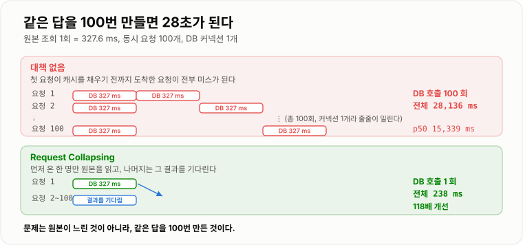
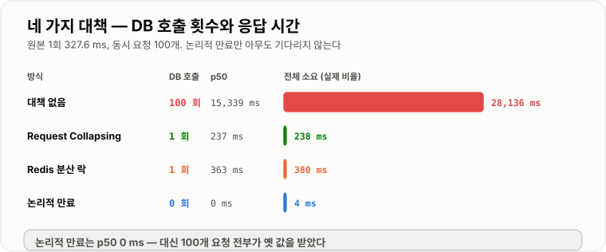
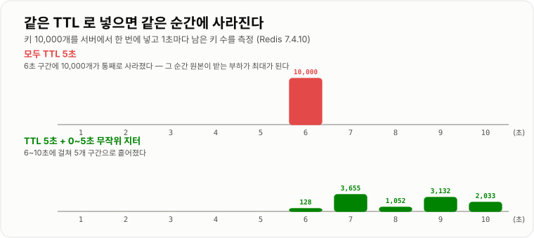

# Cache Stampede와 Request Collapsing

> **캐시는 있을 때가 아니라 비는 순간에 서비스를 죽인다. 인기 키 하나가 만료되면 그 키를 보던 모든 요청이 동시에 원본으로 달려가고, 실측에서 100개 요청이 327 ms짜리 쿼리를 100번 실행해 응답이 28초가 됐다.**

---

## 1. 핵심 요약

**Cache Stampede는 "캐시가 비었다"는 사실을 여러 요청이 동시에 알아차려서 생긴다. 그래서 대책은 전부 하나로 모인다 — 원본을 읽는 사람을 한 명으로 줄이거나, 아예 아무도 안 기다리게 만들거나.**

### 한눈에 보기

* **Cache Stampede(캐시 스탬피드)** 는 캐시가 비는 순간 그 키를 보던 요청들이 **한꺼번에 원본으로 몰리는** 현상이다. Thundering Herd, Dog-piling이라고도 한다.
* 무서운 점은 **"평소에 잘 돌아가던 시스템"에서 갑자기 터진다**는 것이다. 히트율 99%로 잘 돌던 서비스가 키 하나가 만료되는 그 순간 100% 미스가 된다.
* 실측했다. 원본 조회가 **327.6 ms**인 상황에서 요청 100개가 동시에 미스를 맞으면, **DB 호출 100회 · 전체 28,136 ms · p50 15,339 ms · 최대 28,135 ms**였다.
* **같은 답을 100번 만들었다.** 99번은 순수한 낭비이고, 그 낭비가 커넥션 풀을 마르게 해서 무관한 API까지 죽인다.
* **Request Collapsing**(요청 병합, single-flight)을 넣자 **DB 호출 1회 · 전체 238 ms · p50 237 ms**가 됐다. **DB 호출 100분의 1, 응답 118배 개선.**
* 서버가 여러 대면 JVM 안의 락으로는 부족하다. **Redis 분산 락**으로 하면 **DB 호출 1회 · 380 ms**였다. 대기하던 요청들이 락을 잡으려 **1,059회 재시도**했다.
* **논리적 만료**(값은 안 지우고 옛 값을 주면서 뒤에서 갱신)는 성격이 다르다. **DB 호출 0회(백그라운드로 밀림) · 전체 4 ms · p50 0 ms**로, **아무도 기다리지 않았다.** 대신 100개 요청 전부가 옛 값을 받았다.
* **키를 한꺼번에 넣으면 한꺼번에 만료된다.** 10,000개 키를 같은 TTL로 넣었더니 **6초 구간에 10,000개가 통째로** 만료됐다. TTL에 0~5초 지터를 주자 **6~10초에 걸쳐 128 / 3,655 / 1,052 / 3,132 / 2,033개로 흩어졌다.**
* 이름이 비슷한 세 가지를 구분해야 한다. **Stampede(있던 키가 만료돼 몰림)**, **Penetration(없는 키를 계속 조회)**, **Avalanche(대량의 키가 동시에 사라짐)** 는 원인도 대책도 다르다.

> 이 노트의 수치는 **Redis 7.4.10 (docker `redis:7.4-alpine`)**, **H2 2.2.224 파일 모드**, **JDK 21.0.11**에서 직접 측정했다. 원본 조회는 인덱스를 못 타는 `LIKE` 조건으로 주문 30만 건을 매번 전체 스캔하게 만들었고(1회 327.6 ms), **DB 커넥션은 1개라 원본 조회가 직렬화된다.** 이것은 임의의 제약이 아니라 **스탬피드가 실제로 만들어 내는 상황**이다 — 요청이 몰려 커넥션 풀이 마르면 결국 순서대로 처리된다.

### 무엇을 해결하는가

#### 해결하려는 문제

인기 상품의 집계 데이터를 5분 TTL로 캐시하고 있다. 평소에는 완벽하게 돌아간다.

```text
초당 1,000 요청,  히트율 99.97%
   → DB 는 5분에 한 번만 일한다
```

그런데 5분마다 이런 일이 벌어진다.

```text
t=0.000s   캐시 만료
t=0.001s   요청 A: 미스 → DB 조회 시작 (327 ms 걸림)
t=0.002s   요청 B: 미스 → DB 조회 시작    ← A 가 아직 안 끝나서 캐시가 비어 있다
t=0.003s   요청 C: 미스 → DB 조회 시작
   ...
t=0.100s   요청 100: 미스 → DB 조회 시작
t=0.327s   요청 A 완료, 캐시에 저장 ← 이미 늦었다. 99개가 이미 DB 로 갔다
```

**핵심은 "A가 캐시를 채우기 전까지 모두가 미스"라는 것이다.** 원본 조회가 327 ms면 그 327 ms 동안 들어온 모든 요청이 각자 DB로 간다.

실측 결과다.

```text
요청 100개가 동시에 미스를 맞았을 때 (원본 1회 = 327.6 ms)

  DB 호출        100 회
  전체 소요       28,136 ms
  p50 응답        15,339 ms
  최대 응답       28,135 ms
```

**28초.** 원본 조회 자체는 0.3초인데, 100명이 줄을 서면서 마지막 사람은 28초를 기다렸다.



*문제는 원본이 느린 것이 아니라, 같은 답을 100번 만든 것이다.*

#### 이 개념이 없을 때

이 문제를 모르고 대응하면 대개 이렇게 흘러간다.

```java
// 시도 1 — TTL 을 늘린다
//   만료 간격만 늘어날 뿐, 만료되는 그 순간의 폭발은 똑같다

// 시도 2 — DB 커넥션 풀을 늘린다
@Bean
public DataSource dataSource() {
    HikariConfig config = new HikariConfig();
    config.setMaximumPoolSize(200);        // 10 → 200
    return new HikariDataSource(config);
}
//   DB 가 동시에 200개 무거운 쿼리를 받게 된다. 더 나빠질 수도 있다

// 시도 3 — 스케줄러로 미리 채운다
@Scheduled(fixedDelay = 240_000)           // TTL 5분보다 짧게
public void warmUp() {
    cache.put("report", loadFromDb());
}
//   유효한 대책이지만, 캐시 서버 재시작이나 배포로 캐시가 통째로 비면 무력하다
//   그리고 키가 수만 개면 전부 미리 채울 수 없다

// 시도 4 — 그냥 캐시를 뺀다
//   원본 부하가 히트율만큼 그대로 늘어난다. 근본 해결이 아니다
```

**제대로 된 해법은 "동시에 원본을 읽는 사람의 수"를 줄이는 것뿐이다.**

```java
// Request Collapsing — 한 명만 읽고 나머지는 그 결과를 기다린다
private final ConcurrentHashMap<String, CompletableFuture<String>> inflight =
        new ConcurrentHashMap<String, CompletableFuture<String>>();

public String get(String key) throws Exception {
    String cached = cache.get(key);
    if (cached != null) {
        return cached;
    }

    CompletableFuture<String> mine = new CompletableFuture<String>();
    CompletableFuture<String> winner = inflight.putIfAbsent(key, mine);
    if (winner != null) {
        return winner.get();                 // 진행 중인 조회의 결과를 기다린다
    }
    try {
        String loaded = loadFromOrigin(key);  // 나만 원본을 읽는다
        cache.put(key, loaded);
        mine.complete(loaded);
        return loaded;
    } catch (Exception e) {
        mine.completeExceptionally(e);
        throw e;
    } finally {
        inflight.remove(key);
    }
}
```

실측으로 **DB 호출 100회 → 1회, 전체 28,136 ms → 238 ms**가 됐다.

---

## 2. 동작 원리

### 핵심 구성 요소

| 용어 | 뜻 | 중요한 이유 |
| --- | --- | --- |
| **Cache Stampede** | 캐시가 비는 순간 요청이 원본으로 몰림 | 이 노트의 주제 |
| **Request Collapsing** | 같은 키의 동시 요청을 하나로 합침 | 서버 1대 안에서의 기본 대책 |
| **single-flight** | 위와 같은 말 (Go 진영 용어) | 라이브러리 이름으로 자주 보인다 |
| **분산 락** | 여러 서버 중 한 명만 원본을 읽게 함 | 서버가 여러 대일 때 필요 |
| **논리적 만료** | 값은 두고 "만료 시각"만 값 안에 적어 둠 | **아무도 기다리지 않게 한다** |
| **stale-while-revalidate** | 갱신하는 동안 옛 값을 내주는 방식 | 논리적 만료의 다른 이름 |
| **확률적 조기 갱신** | 만료가 가까울수록 확률적으로 미리 갱신 | 락 없이 몰림을 줄인다 (XFetch) |
| **TTL 지터** | TTL에 무작위 값을 더함 | **동시 만료를 흩뿌린다** |
| **캐시 워밍** | 미리 채워 두는 것 | 배포·재시작 대비 |
| **Cache Penetration** | **없는** 키를 계속 조회 | 스탬피드와 원인이 다르다 |
| **Cache Avalanche** | 대량의 키가 동시에 사라짐 | 스탬피드의 대규모판 |

### 내부 동작 과정

#### 스탬피드가 생기는 세 가지 경로

```text
1) 인기 키 하나가 만료              가장 흔하다
      TTL 도달 → 그 키를 보던 요청 전부가 미스

2) 많은 키가 동시에 만료 (Avalanche)
      배치로 한꺼번에 넣은 키들이 같은 TTL 을 가짐
      → 실측: 10,000개 키가 6초 구간에 통째로 만료

3) 캐시가 통째로 비어 있음
      Redis 재시작, 장애 조치(failover), 배포 시 캐시 초기화
      → 히트율이 순간 0% 가 된다
```

**세 번째가 가장 위험하다.** 키 하나가 아니라 전부가 미스이므로 DB가 평소의 수십~수백 배 요청을 받는다.

#### 왜 "동시에" 몰리는가 — 창의 길이

```text
캐시 만료
   │
   │◀────────── 원본 조회 시간 (327.6 ms) ──────────▶│
   │                                                      │
   └─ 이 구간에 도착한 모든 요청이 미스다 ─────────────────┘
      초당 300 요청이면 → 약 100개가 동시에 DB 로 간다
```

**창의 길이 = 원본 조회 시간이다.** 그래서 **원본이 느릴수록 스탬피드가 심해진다.** 캐시를 붙인 이유가 원본이 느려서였으니, **캐시가 필요한 곳일수록 스탬피드도 심하다.**

```text
동시 미스 개수 ≈ 초당 요청 수 × 원본 조회 시간

  초당 300 요청 × 0.33초 =  99개
  초당 1,000 요청 × 1초  = 1,000개
```

#### 대책 1 — Request Collapsing (서버 1대)

```text
대책 없음                         Request Collapsing

  요청1 ──▶ DB (327ms)              요청1 ──▶ DB (327ms) ──▶ 캐시 저장
  요청2 ──▶ DB (327ms)              요청2 ──▶ 요청1의 결과를 기다림 ──┐
  요청3 ──▶ DB (327ms)              요청3 ──▶ 요청1의 결과를 기다림 ──┤
   ...                               ...                              │
  요청100 ─▶ DB (327ms)             요청100 ▶ 요청1의 결과를 기다림 ──┘
                                                                      │
  DB 호출 100회                     DB 호출 1회                        │
  전체 28,136 ms                    전체 238 ms  ◀────────────────────┘
```

핵심은 `putIfAbsent` 한 줄이다.

```text
inflight 맵에 "지금 이 키를 읽고 있는 사람"의 약속(Future)을 넣는다

  putIfAbsent 가 null 을 반환 → 내가 먼저다 → 내가 원본을 읽는다
  putIfAbsent 가 값을 반환    → 남이 먼저다 → 그 약속이 완료되길 기다린다
```

**`putIfAbsent`가 원자적이라 "먼저 온 한 명"이 정확히 한 명으로 정해진다.**

#### 대책 2 — 분산 락 (서버 여러 대)

Request Collapsing은 **JVM 하나 안에서만** 통한다. 서버가 10대면 각 서버에서 1명씩, 총 10명이 원본을 읽는다.

```text
서버 3대, 각 서버에서 Request Collapsing 적용

  서버 A: 100개 요청 → DB 1회
  서버 B: 100개 요청 → DB 1회      전체 DB 3회
  서버 C: 100개 요청 → DB 1회
```

3회면 100회보다 훨씬 낫다. **대부분의 서비스는 여기서 멈춰도 충분하다.** 그래도 부족하면 분산 락을 쓴다.

```text
락을 잡으려 시도 (SET NX PX)
   │
   ├─ 성공 → 원본을 읽고 캐시에 넣고 락 해제
   │
   └─ 실패 → 잠깐 쉬고(20 ms) 캐시를 다시 본다
              캐시에 값이 생겼으면 그것을 쓴다
```

실측 결과다.

```text
DB 호출    1 회
전체 소요  380 ms
p50        363 ms
락 획득 실패 후 재시도  1,059 회
```

**재시도가 1,059회라는 점이 이 방식의 비용이다.** 99개 요청이 20 ms마다 캐시를 다시 확인하며 기다렸다. Request Collapsing(238 ms)보다 느린 이유도 이 폴링 간격 때문이다.

#### 대책 3 — 논리적 만료 (아무도 안 기다리게 한다)

지금까지의 대책은 전부 **"한 명은 어쨌든 기다린다"** 였다. 논리적 만료는 발상이 다르다.

```text
캐시에 값과 함께 "논리적 만료 시각"을 같이 저장한다
Redis 의 TTL 은 걸지 않거나 아주 길게 잡는다

  { "value": {...}, "expireAt": 1785820000000 }

읽을 때
   │
   ├─ expireAt 이 아직 안 지났다 → 그대로 반환
   │
   └─ expireAt 이 지났다
        ├─ 값은 일단 그대로 반환한다 (옛 값)        ← 아무도 안 기다린다
        └─ 한 명만 백그라운드에서 갱신을 시작한다
```

실측 결과다.

```text
DB 호출         0 회 (백그라운드 스레드로 밀림)
전체 소요       4 ms
p50 응답        0 ms
최대 응답       1 ms
옛 값을 받은 요청  100 개
```

**p50이 0 ms다.** 100개 요청 전부가 즉시 응답받았다. 대신 **전부 옛 값을 받았다.**



*논리적 만료만 유일하게 아무도 기다리지 않는다. 대가는 옛 값을 준다는 것이다.*

**이 맞바꿈이 논리적 만료의 전부다.** 통계·랭킹처럼 몇 초 낡아도 되는 데이터에는 최고의 선택이고, 방금 바뀐 값이 즉시 보여야 하는 데이터에는 쓸 수 없다.

#### 대책 4 — 확률적 조기 갱신 (XFetch)

락 없이 몰림을 줄이는 방법이다. **만료가 가까울수록 갱신할 확률을 높인다.**

```text
남은 TTL 이 많을 때   → 거의 갱신 안 한다
남은 TTL 이 적을 때   → 확률적으로 미리 갱신한다

  갱신 여부:  now - delta * beta * ln(random()) >= expiry
              (delta = 지난번 원본 조회에 걸린 시간)
```

**원본 조회가 오래 걸리는 키일수록 더 일찍 갱신을 시작한다**는 것이 핵심이다. 실제로 스탬피드가 심한 키가 정확히 그런 키다.

이 방식의 장점은 **락도 대기도 없다**는 것이다. 단점은 확률이라 **보장이 없다**는 것이다.

#### 대책 5 — TTL 지터 (동시 만료를 막는다)

키를 배치로 넣으면 TTL도 함께 만료된다. 실측으로 확인했다.

```text
10,000개 키를 서버에서 한 번에 넣고 1초마다 남은 키 수를 셌다

[모두 TTL 5초]
   1~5초 뒤   10,000 개 그대로
   6초 뒤          0 개    ← 10,000개가 통째로 사라졌다

[TTL 5초 + 0~5초 무작위 지터]
   6초 뒤       9,872 개   (만료   128)
   7초 뒤       6,217 개   (만료 3,655)
   8초 뒤       5,165 개   (만료 1,052)
   9초 뒤       2,033 개   (만료 3,132)
  10초 뒤           0 개   (만료 2,033)
```



*고정 TTL은 한 지점에 만료가 몰린다. 지터를 주면 5초에 걸쳐 흩어진다.*

**코드는 한 줄이다.**

```java
// 나쁜 예 — 배치로 넣은 키가 전부 같은 시각에 만료된다
redis.opsForValue().set(key, value, Duration.ofMinutes(10));

// 좋은 예 — 10분 ± 10% 지터
long base = Duration.ofMinutes(10).toSeconds();
long jitter = ThreadLocalRandom.current().nextLong(-base / 10, base / 10 + 1);
redis.opsForValue().set(key, value, Duration.ofSeconds(base + jitter));
```

> **위 실측에서 만료 개수가 매초 고르지 않고 128 → 3,655 → 1,052 처럼 들쭉날쭉한 것은 Redis의 만료 방식 때문이다.** Redis는 TTL이 지났다고 즉시 지우지 않고, **100 ms마다 TTL이 걸린 키 중 20개를 무작위로 뽑아 검사**하는 표본 방식(능동 만료)과 **접근할 때 지우는 방식**(게으른 만료)을 병행한다. 그래서 `DBSIZE` 감소는 실제 만료 시각을 정확히 따라가지 않는다. **중요한 것은 분포다 — 고정 TTL은 한 구간에 전부, 지터는 5개 구간에 나뉘어 사라졌다.**

#### 스탬피드와 헷갈리는 두 가지

```text
Cache Stampede (캐시 스탬피드)
   원인:  있던 키가 만료돼서 요청이 몰린다
   대책:  Request Collapsing, 분산 락, 논리적 만료

Cache Penetration (캐시 관통)
   원인:  애초에 없는 키를 계속 조회한다 (캐시에도 없고 DB 에도 없다)
          존재하지 않는 ID 로 공격받으면 매 요청이 DB 로 간다
   대책:  "없음"을 짧은 TTL 로 캐시한다, 블룸 필터로 앞에서 거른다

Cache Avalanche (캐시 사태)
   원인:  대량의 키가 동시에 사라진다 (동시 만료, Redis 재시작·장애 조치)
   대책:  TTL 지터, 캐시 워밍, 다계층 캐시, 원본 앞에 서킷 브레이커
```

**셋의 대책이 서로 안 통한다.** Request Collapsing은 관통을 못 막고(키가 다 다르므로), 블룸 필터는 스탬피드를 못 막는다.

---

## 3. 특징과 비교

| 구분          | 내용 |
| ----------- | -- |
| **장점**      | 대책 하나로 원본 부하가 극적으로 줄어든다. 실측에서 Request Collapsing이 **DB 호출 100회 → 1회**, 전체 소요 **28,136 ms → 238 ms(118배)** 였다. 논리적 만료는 **p50 응답 0 ms**로 대기 자체를 없앤다. |
| **단점**      | 어떤 대책도 공짜가 아니다. Request Collapsing은 서버 1대 안에서만 통하고, 분산 락은 폴링 비용이 들며(재시도 1,059회) 락 자체가 새로운 장애 지점이 된다. 논리적 만료는 **옛 값을 준다**(100개 요청 전부). |
| **적합한 상황**  | 조회가 비싸고(수백 ms 이상) 인기 키가 몰려 있는 캐시. 배치로 대량의 키를 채우는 경우(TTL 지터). 배포·재시작으로 캐시가 통째로 비는 환경(캐시 워밍). |
| **주의할 상황**  | 키가 매번 달라 재사용되지 않는 캐시에는 Request Collapsing이 무의미하다. 방금 쓴 값이 즉시 보여야 하는 데이터에는 논리적 만료를 쓸 수 없다. 분산 락은 락 자체가 실패했을 때의 경로를 반드시 준비해야 한다. |

### 성능 특성

#### 네 가지 대책 실측 비교

원본 조회 1회 = **327.6 ms**, 동시 요청 100개, DB 커넥션 1개.

```text
방식                    DB 호출    전체 소요    p50 응답    최대 응답
──────────────────────────────────────────────────────────────────
대책 없음                 100 회   28,136 ms   15,339 ms   28,135 ms
Request Collapsing          1 회      238 ms      237 ms      238 ms
Redis 분산 락               1 회      380 ms      363 ms      379 ms
논리적 만료                 0 회        4 ms        0 ms        1 ms
```

| 방식 | DB 호출 | 전체 소요 | 개선 배수 | 대가 |
| --- | --- | --- | --- | --- |
| 대책 없음 | 100회 | 28,136 ms | — | — |
| **Request Collapsing** | **1회** | **238 ms** | **118배** | 서버 1대 안에서만 통함 |
| **Redis 분산 락** | **1회** | 380 ms | **74배** | 재시도 1,059회, 락이 장애 지점 |
| **논리적 만료** | 0회 | **4 ms** | **7,034배** | **모두가 옛 값을 받음** |

**Request Collapsing이 분산 락보다 빠른 이유**는 대기 방식의 차이다. Collapsing은 `Future`가 완료되면 **즉시 깨어나고**, 분산 락 방식은 20 ms마다 캐시를 다시 확인하는 **폴링**이라 그만큼 늦어진다.

#### 응답 시간의 분포

```text
대책 없음         p50 15,339 ms  ~  최대 28,135 ms
                  → 절반이 15초 이상 기다렸다. 사실상 전멸이다

Request Collapsing p50 237 ms  ~  최대 238 ms
                  → 거의 전원이 똑같이 237 ms 를 기다렸다 (원본 1회분)

논리적 만료        p50 0 ms  ~  최대 1 ms
                  → 아무도 안 기다렸다
```

**Request Collapsing에서 p50과 최대가 거의 같다는 점이 중요하다.** 모두가 "원본 조회 1회분"만 기다리기 때문이다. 대기 시간이 예측 가능해진다.

#### TTL 지터의 효과

```text
              1초  2초  3초  4초  5초    6초     7초     8초    9초   10초
고정 TTL 5초    0    0    0    0    0   10,000     0      0      0      0
지터 0~5초      0    0    0    0    0      128  3,655  1,052  3,132  2,033
```

**고정 TTL은 만료가 한 점에 모인다.** 그 순간 원본이 받는 부하가 최대치가 된다.

### 장점과 단점

#### 장점

| 장점 | 근거 |
| --- | --- |
| **원본 호출이 요청 수와 무관해진다** | 실측 100회 → 1회. 트래픽이 10배 늘어도 원본 호출은 그대로 1회다 |
| **응답 시간이 예측 가능해진다** | Request Collapsing p50 237 ms, 최대 238 ms (거의 동일) |
| **대기를 아예 없앨 수도 있다** | 논리적 만료 p50 0 ms |
| **커넥션 풀 고갈을 막는다** | 원본을 읽는 사람이 1명이라 커넥션도 1개만 쓴다 |
| **코드 변경 범위가 작다** | 캐시 조회 유틸 한 곳만 고치면 된다 |
| **TTL 지터는 한 줄이다** | 실측으로 만료가 1개 구간 → 5개 구간으로 분산됐다 |

#### 단점

| 단점 | 근거 |
| --- | --- |
| **Request Collapsing은 서버 1대 범위다** | 서버 10대면 원본 호출도 10회 |
| **분산 락은 폴링 비용이 있다** | 실측 재시도 1,059회, Collapsing보다 60% 느림 |
| **분산 락 자체가 장애 지점이다** | Redis가 죽으면 락도 못 잡는다. 우회 경로가 필요하다 |
| **논리적 만료는 옛 값을 준다** | 실측 100개 요청 전부가 옛 값 |
| **논리적 만료는 첫 진입을 못 막는다** | 캐시가 아예 비어 있으면 옛 값이 없다 |
| **확률적 갱신은 보장이 없다** | 운이 나쁘면 여전히 몰린다 |
| **모든 대책이 "그 키가 인기일 때"만 의미 있다** | 키가 다 다르면 합칠 대상이 없다 |

### 어떤 상황에서 고르는가

#### 대책 선택 흐름도

```text
캐시 미스일 때 원본 조회가 비싼가? (수십 ms 이상)
   │
  아니오 → 아무것도 안 해도 된다
   │
  예
   │
   ▼
방금 갱신된 값이 즉시 보여야 하는가?
   │
   ├─ 아니오 (몇 초 낡아도 됨)
   │     → 논리적 만료 (stale-while-revalidate)
   │        실측 p50 0 ms. 아무도 안 기다린다
   │
   └─ 예 (반드시 최신)
         │
         ▼
      서버가 몇 대인가?
         │
         ├─ 1대 (또는 원본 호출이 서버 수만큼이어도 괜찮다)
         │     → Request Collapsing
         │        실측 DB 1회, 238 ms
         │
         └─ 여러 대이고 원본 호출을 반드시 1회로 줄여야 한다
               → Request Collapsing + Redis 분산 락
                  실측 DB 1회, 380 ms
                  락 획득 실패 시의 우회 경로를 반드시 만든다

   ─────────────────────────────────────────────
   위와 별개로 항상 함께 적용한다
     · TTL 지터 (동시 만료 방지)
     · 배포·재시작 시 캐시 워밍
     · "없음" 캐시 또는 블룸 필터 (캐시 관통 방지)
```

#### 상황별 판단

| 상황 | 대책 | 이유 |
| --- | --- | --- |
| 인기 상품 상세 (조회 50 ms) | Request Collapsing | 서버별 1회면 충분하다 |
| 메인 화면 통계 (조회 700 ms) | 논리적 만료 | 몇 초 낡아도 되고, 대기가 치명적이다 |
| 실시간 랭킹 (조회 300 ms) | 논리적 만료 | 같은 이유 |
| 외부 API 응답 (호출 요금 있음) | 분산 락 | 호출 1회로 줄이는 것 자체가 목적이다 |
| 사용자별 마이페이지 | **불필요** | 키가 전부 달라 합칠 대상이 없다 |
| 배치로 채우는 대량 키 | **TTL 지터 필수** | 실측 10,000개가 한꺼번에 만료됐다 |
| 배포로 캐시가 비는 환경 | 캐시 워밍 + 논리적 만료 | 히트율이 순간 0%가 된다 |

### 비슷한 기술과 비교

#### 네 가지 대책 비교

| 기준 | Request Collapsing | 분산 락 | 논리적 만료 | 확률적 조기 갱신 |
| --- | --- | --- | --- | --- |
| 원본 호출 | **서버당 1회** | **전체 1회** | 0회 (백그라운드) | 확률적으로 1회 |
| 대기하는 사람 | 전원 (1회분) | 전원 (1회분 + 폴링) | **없음** | 없음 |
| 실측 전체 소요 | **238 ms** | 380 ms | **4 ms** | — |
| 실측 p50 | 237 ms | 363 ms | **0 ms** | — |
| 최신 값 보장 | **된다** | **된다** | **안 된다** | 대체로 된다 |
| 구현 난이도 | 낮다 | 보통 | 보통 | 높다 |
| 새 장애 지점 | 없다 | **락 저장소** | 없다 | 없다 |
| 첫 진입(값이 아예 없음) | 막아 준다 | 막아 준다 | **못 막는다** | 못 막는다 |

**논리적 만료는 첫 진입을 못 막는다는 점이 중요하다.** 옛 값이 있어야 옛 값을 줄 수 있기 때문이다. 그래서 실무에서는 **논리적 만료 + Request Collapsing**을 함께 쓴다. 값이 아예 없을 때만 Collapsing이 동작한다.

#### 스탬피드 · 관통 · 사태

| 기준 | Cache Stampede | Cache Penetration | Cache Avalanche |
| --- | --- | --- | --- |
| 한국어 | 캐시 스탬피드 | 캐시 관통 | 캐시 사태 |
| 원인 | **있던 키가 만료** | **애초에 없는 키** | **대량의 키가 동시에 사라짐** |
| 원본에 가는 요청 | 같은 키 수백 개 | **다 다른 키** | 전체 키 |
| 악의적 공격 가능성 | 낮다 | **높다** (없는 ID 반복 조회) | 낮다 |
| 대책 | Collapsing, 분산 락, 논리적 만료 | **"없음" 캐시, 블룸 필터** | **TTL 지터, 워밍, 서킷 브레이커** |
| 실측 근거 | DB 100회 → 1회 | — | 10,000키 동시 만료 → 5구간 분산 |

#### Request Collapsing vs 배치 조회(`MGET`)

| 기준 | Request Collapsing | 배치 조회 |
| --- | --- | --- |
| 합치는 대상 | **같은 키의 동시 요청** | **서로 다른 키의 동시 요청** |
| 목적 | 원본 호출 횟수 줄이기 | 왕복 횟수 줄이기 |
| 결과 | 원본 1회 | 왕복 1회 |
| 함께 쓰나 | **함께 쓴다** | 함께 쓴다 |

**둘을 헷갈리면 안 된다.** Collapsing은 "같은 답을 여러 번 만들지 않기", 배치는 "여러 답을 한 번에 가져오기"다.

---

## 4. 실무 주의사항

### 백엔드 실무 적용

#### Spring · Java — Request Collapsing 유틸

```java
@Component
public class CollapsingCache {

    private final StringRedisTemplate redis;
    private final ConcurrentHashMap<String, CompletableFuture<String>> inflight =
            new ConcurrentHashMap<String, CompletableFuture<String>>();

    public CollapsingCache(StringRedisTemplate redis) {
        this.redis = redis;
    }

    public String get(String key, Duration ttl, Supplier<String> loader) {
        String cached = redis.opsForValue().get(key);
        if (cached != null) {
            return cached;
        }

        CompletableFuture<String> mine = new CompletableFuture<String>();
        CompletableFuture<String> winner = inflight.putIfAbsent(key, mine);

        if (winner != null) {
            try {
                return winner.get(5, TimeUnit.SECONDS);      // 반드시 타임아웃을 건다
            } catch (TimeoutException e) {
                return loader.get();                          // 앞사람이 늦으면 직접 읽는다
            } catch (Exception e) {
                throw new IllegalStateException(e);
            }
        }

        try {
            String loaded = loader.get();
            redis.opsForValue().set(key, loaded, ttl);
            mine.complete(loaded);
            return loaded;
        } catch (RuntimeException e) {
            mine.completeExceptionally(e);
            throw e;
        } finally {
            inflight.remove(key);
        }
    }
}
```

주의할 점이 셋이다.

* **`winner.get()`에 반드시 타임아웃을 건다.** 앞사람이 멈추면 나머지 전부가 함께 멈춘다.
* **`finally`에서 반드시 `inflight`를 제거한다.** 안 그러면 그 키는 영원히 "진행 중"으로 남는다.
* **예외도 `completeExceptionally`로 전달한다.** 안 그러면 대기자들이 타임아웃까지 기다린다.

#### Redis 분산 락으로 원본 호출을 전체 1회로

```java
@Component
public class LockingCache {

    private static final String UNLOCK_SCRIPT =
            "if redis.call('get', KEYS[1]) == ARGV[1] then return redis.call('del', KEYS[1]) else return 0 end";

    private final StringRedisTemplate redis;

    public LockingCache(StringRedisTemplate redis) {
        this.redis = redis;
    }

    public String get(String key, Duration ttl, Supplier<String> loader) throws InterruptedException {
        String lockKey = "lock:" + key;

        for (int attempt = 0; attempt < 50; attempt++) {
            String cached = redis.opsForValue().get(key);
            if (cached != null) {
                return cached;
            }

            String token = UUID.randomUUID().toString();
            Boolean acquired = redis.opsForValue()
                    .setIfAbsent(lockKey, token, Duration.ofSeconds(10));

            if (Boolean.TRUE.equals(acquired)) {
                try {
                    String loaded = loader.get();
                    redis.opsForValue().set(key, loaded, ttl);
                    return loaded;
                } finally {
                    redis.execute(new DefaultRedisScript<Long>(UNLOCK_SCRIPT, Long.class),
                                  Collections.singletonList(lockKey), token);
                }
            }
            Thread.sleep(20);                       // 실측: 이 폴링이 1,059회 발생했다
        }
        return loader.get();                         // 끝내 못 잡으면 직접 읽는다 (안전 경로)
    }
}
```

**마지막 줄이 가장 중요하다.** 락을 못 잡았다고 예외를 던지면, Redis 장애 시 서비스 전체가 멈춘다. **락은 최적화이지 정확성 장치가 아니므로, 실패하면 그냥 원본을 읽는다.**

#### 논리적 만료 — 대기를 없앤다

```java
@Component
public class LogicalExpiryCache {

    private final StringRedisTemplate redis;
    private final ObjectMapper mapper;
    private final ExecutorService refresher = Executors.newFixedThreadPool(4);
    private final ConcurrentHashMap<String, Boolean> refreshing =
            new ConcurrentHashMap<String, Boolean>();

    public LogicalExpiryCache(StringRedisTemplate redis, ObjectMapper mapper) {
        this.redis = redis;
        this.mapper = mapper;
    }

    public String get(final String key, final Duration logicalTtl, final Supplier<String> loader) {
        String raw = redis.opsForValue().get(key);
        if (raw == null) {
            String loaded = loader.get();            // 첫 진입은 어쩔 수 없이 기다린다
            store(key, loaded, logicalTtl);
            return loaded;
        }

        Entry entry = parse(raw);
        if (System.currentTimeMillis() <= entry.expireAt) {
            return entry.value;                       // 아직 유효하다
        }

        // 만료됐지만 값은 그대로 준다. 한 명만 뒤에서 갱신한다
        if (refreshing.putIfAbsent(key, Boolean.TRUE) == null) {
            refresher.submit(new Runnable() {
                @Override
                public void run() {
                    try {
                        store(key, loader.get(), logicalTtl);
                    } catch (RuntimeException e) {
                        log.warn("캐시 백그라운드 갱신 실패. key={}", key, e);
                    } finally {
                        refreshing.remove(key);
                    }
                }
            });
        }
        return entry.value;                           // 실측: 여기서 p50 0 ms 가 나왔다
    }

    private void store(String key, String value, Duration logicalTtl) {
        Entry entry = new Entry(value, System.currentTimeMillis() + logicalTtl.toMillis());
        // Redis TTL 은 논리적 TTL 보다 넉넉하게 — 값이 사라지면 옛 값을 줄 수 없다
        redis.opsForValue().set(key, write(entry), logicalTtl.multipliedBy(4));
    }

    static class Entry {
        final String value;
        final long expireAt;

        Entry(String value, long expireAt) {
            this.value = value;
            this.expireAt = expireAt;
        }
    }
}
```

**`store`의 마지막 줄이 논리적 만료의 함정이다.** Redis TTL이 논리적 TTL보다 짧으면 값이 진짜로 사라져서 옛 값을 줄 수 없게 된다. **물리 TTL을 논리 TTL의 몇 배로 넉넉히 잡는다.**

#### TTL 지터를 기본으로 만든다

```java
@Component
public class CacheTtl {

    private static final double JITTER_RATIO = 0.2;      // ±20%

    public Duration withJitter(Duration base) {
        long seconds = base.getSeconds();
        long spread = (long) (seconds * JITTER_RATIO);
        long jitter = ThreadLocalRandom.current().nextLong(-spread, spread + 1);
        return Duration.ofSeconds(seconds + jitter);
    }
}
```

**개별 호출에서 지터를 기억해 쓰기를 기대하면 반드시 빠뜨린다.** 캐시 저장 유틸에 넣어 기본 동작으로 만든다.

#### 캐시 워밍 — 배포와 재시작에 대비한다

```java
@Component
public class CacheWarmer implements ApplicationListener<ApplicationReadyEvent> {

    private final ReportService reportService;
    private final CategoryService categoryService;

    public CacheWarmer(ReportService reportService, CategoryService categoryService) {
        this.reportService = reportService;
        this.categoryService = categoryService;
    }

    @Override
    public void onApplicationEvent(ApplicationReadyEvent event) {
        // 트래픽을 받기 전에 인기 키를 미리 채운다
        categoryService.findAll();
        reportService.mainReport();
    }

    /** TTL 보다 짧은 주기로 미리 갱신해 만료 자체를 안 만나게 한다 */
    @Scheduled(fixedDelay = 4 * 60 * 1000)      // TTL 5분
    public void refresh() {
        reportService.refreshMainReport();
    }
}
```

**"항상 유효한 상태로 미리 갱신"이 가장 확실한 대책이다.** 다만 키가 수만 개면 전부 미리 채울 수 없으므로, **상위 몇 개 인기 키에만** 적용한다.

#### 원본 앞에 서킷 브레이커를 둔다

```java
@Service
public class ReportService {

    @CircuitBreaker(name = "reportDb", fallbackMethod = "fallback")
    public Report load() {
        return reportRepository.aggregate();
    }

    private Report fallback(Throwable t) {
        log.warn("원본 조회 실패, 기본값으로 응답한다", t);
        return Report.empty();                    // 빈 값이라도 응답한다
    }
}
```

**스탬피드로 DB가 무너지기 시작하면 요청을 더 보내는 것이 상황을 악화시킨다.** 서킷 브레이커가 열리면 원본 호출을 끊고 기본값이나 옛 값으로 응답한다.

### 자주 하는 오해

| 잘못된 이해 | 올바른 이해 |
| --- | --- |
| "히트율 99%면 DB 부하는 걱정 없다" | 만료되는 그 순간은 **100% 미스**다. 실측 100개 요청이 DB를 100번 쳤다. |
| "TTL을 늘리면 스탬피드가 줄어든다" | 만료 **간격**만 늘어난다. 만료되는 순간의 폭발은 똑같다. |
| "커넥션 풀을 늘리면 해결된다" | DB가 동시에 200개 무거운 쿼리를 받게 된다. **더 나빠질 수 있다.** |
| "원본이 빠르면 스탬피드가 없다" | 창의 길이 = 원본 조회 시간이라 줄긴 하지만, **초당 요청이 많으면 여전히 몰린다.** |
| "Request Collapsing이면 원본 호출이 1회다" | **서버당 1회**다. 서버 10대면 10회다. |
| "분산 락을 쓰면 완벽하다" | 락 저장소가 **새로운 장애 지점**이다. 실패 시 원본을 직접 읽는 경로가 있어야 한다. |
| "분산 락이 Request Collapsing보다 항상 낫다" | 실측에서 **더 느렸다**(380 ms vs 238 ms). 폴링 대기 때문이다. |
| "논리적 만료면 아무 문제 없다" | **모두가 옛 값을 받는다**(100/100). 그리고 **첫 진입은 못 막는다.** |
| "논리적 만료는 Redis TTL을 안 걸어도 된다" | 걸어야 한다. 다만 **논리 TTL보다 훨씬 길게** 잡는다. 안 그러면 옛 값이 사라진다. |
| "TTL 지터는 있으면 좋은 정도다" | 실측 10,000개 키가 **6초 구간에 통째로** 만료됐다. 배치로 채우는 캐시에는 필수다. |
| "스탬피드와 캐시 관통은 같은 문제다" | 다르다. 스탬피드는 **있던 키**, 관통은 **없는 키**다. 대책이 서로 안 통한다. |
| "캐시 서버를 재시작해도 캐시만 잠깐 안 될 뿐이다" | 히트율이 **0%**가 된다. 히트율 99%였다면 DB 요청이 100배가 된다. |
| "인기 키만 조심하면 된다" | 배포·재시작에서는 **모든 키**가 동시에 비는 Avalanche가 된다. |

---

## 5. 예제

### 대책 없는 코드와 그 결과

```java
// 스탬피드가 그대로 일어나는 전형적인 코드
public Report getReport() {
    String cached = redis.opsForValue().get("report");
    if (cached != null) {
        return deserialize(cached);
    }
    Report report = reportRepository.aggregate();          // 실측 327.6 ms
    redis.opsForValue().set("report", serialize(report), Duration.ofMinutes(5));
    return report;
}
```

```text
요청 100개가 동시에 미스 → DB 호출 100회, 전체 28,136 ms, p50 15,339 ms
```

### Request Collapsing을 얹은 코드

```java
private final CollapsingCache cache;      // 앞 절의 유틸

public Report getReport() {
    String json = cache.get("report", Duration.ofMinutes(5), new Supplier<String>() {
        @Override
        public String get() {
            return serialize(reportRepository.aggregate());
        }
    });
    return deserialize(json);
}
```

```text
같은 조건 → DB 호출 1회, 전체 238 ms, p50 237 ms      118배 개선
```

### 논리적 만료를 얹은 코드

```java
private final LogicalExpiryCache cache;

public Report getReport() {
    String json = cache.get("report", Duration.ofMinutes(5), new Supplier<String>() {
        @Override
        public String get() {
            return serialize(reportRepository.aggregate());
        }
    });
    return deserialize(json);
}
```

```text
같은 조건 → DB 호출 0회(백그라운드), 전체 4 ms, p50 0 ms
             단, 100개 요청 모두 옛 값을 받았다
```

### 확률적 조기 갱신 (XFetch)

```java
public String getWithEarlyRefresh(String key, Duration ttl, Supplier<String> loader) {
    String raw = redis.opsForValue().get(key);
    if (raw == null) {
        return loadAndStore(key, ttl, loader);
    }

    Entry entry = parse(raw);
    long now = System.currentTimeMillis();

    // delta = 지난번 원본 조회에 걸린 시간. 오래 걸리는 키일수록 더 일찍 갱신한다
    double beta = 1.0;
    double gap = entry.deltaMs * beta * -Math.log(ThreadLocalRandom.current().nextDouble());

    if (now + gap >= entry.expireAt) {
        return loadAndStore(key, ttl, loader);      // 확률적으로 미리 갱신
    }
    return entry.value;
}

private String loadAndStore(String key, Duration ttl, Supplier<String> loader) {
    long start = System.currentTimeMillis();
    String value = loader.get();
    long delta = System.currentTimeMillis() - start;

    Entry entry = new Entry(value, System.currentTimeMillis() + ttl.toMillis(), delta);
    redis.opsForValue().set(key, write(entry), ttl.multipliedBy(2));
    return value;
}
```

**`delta`(지난번 조회 소요 시간)를 저장해 두는 것이 이 방식의 핵심이다.** 원본이 느린 키일수록 갱신을 더 일찍 시작하므로, 정확히 위험한 키가 먼저 보호된다.

### 실전 조합 — 세 가지를 겹쳐 쓴다

```java
@Component
public class SafeCache {

    private final LogicalExpiryCache logical;
    private final CollapsingCache collapsing;
    private final CacheTtl ttlPolicy;

    public SafeCache(LogicalExpiryCache logical, CollapsingCache collapsing, CacheTtl ttlPolicy) {
        this.logical = logical;
        this.collapsing = collapsing;
        this.ttlPolicy = ttlPolicy;
    }

    public String get(String key, Duration baseTtl, Supplier<String> loader) {
        Duration ttl = ttlPolicy.withJitter(baseTtl);       // 1) 동시 만료 방지

        String raw = redis.opsForValue().get(key);
        if (raw == null) {
            // 2) 값이 아예 없을 때(첫 진입·캐시 초기화)는 Collapsing 이 막는다
            return collapsing.get(key, ttl, loader);
        }
        // 3) 값이 있으면 논리적 만료로 아무도 안 기다리게 한다
        return logical.get(key, ttl, loader);
    }
}
```

**논리적 만료는 첫 진입을 못 막고, Collapsing은 대기를 못 없앤다.** 둘을 겹치면 서로의 빈틈을 메운다.

---

## 6. 면접 정리

### 자주 나오는 질문

#### 기본 질문

1. **Cache Stampede가 무엇인가요?**

    * 핵심 키워드: 캐시가 비는 순간 요청이 원본으로 몰림, Thundering Herd, 실측 100개 요청 → DB 100회

2. **왜 여러 요청이 동시에 원본으로 가나요?**

    * 핵심 키워드: 첫 요청이 캐시를 **채우기 전까지** 모두 미스, 창의 길이 = 원본 조회 시간(327.6 ms)

3. **Request Collapsing이 무엇인가요?**

    * 핵심 키워드: 같은 키의 동시 요청을 하나로 합침, `putIfAbsent` + `CompletableFuture`, 실측 DB 1회 / 238 ms

4. **분산 락은 언제 필요한가요?**

    * 핵심 키워드: 서버가 여러 대라 JVM 락으로 부족할 때, `SET NX PX`, 실측 DB 1회 / 380 ms

5. **논리적 만료가 무엇인가요?**

    * 핵심 키워드: 값 안에 만료 시각을 넣고 옛 값을 주면서 뒤에서 갱신, 실측 **p50 0 ms**, 대가는 옛 값

6. **TTL 지터를 왜 주나요?**

    * 핵심 키워드: 배치로 넣은 키가 동시 만료, 실측 10,000키가 6초 구간에 통째로 → 지터 시 5구간 분산

7. **캐시 스탬피드와 캐시 관통의 차이는요?**

    * 핵심 키워드: 스탬피드는 **있던 키**, 관통은 **없는 키**, 대책이 서로 안 통함

8. **TTL을 늘리면 해결되나요?**

    * 핵심 키워드: 아니다. **만료 간격만** 늘어나고 만료 순간의 폭발은 동일

#### 꼬리 질문

1. **Request Collapsing과 분산 락 중 무엇이 더 빠른가요?**

    * 핵심 키워드: 실측 Collapsing 238 ms vs 분산 락 380 ms, **폴링 대기**(재시도 1,059회) 때문

2. **분산 락을 못 잡으면 어떻게 하나요?**

    * 핵심 키워드: 예외를 던지면 안 됨, **락은 최적화이지 정확성 장치가 아님**, 원본을 직접 읽는 우회 경로

3. **논리적 만료의 단점은 무엇인가요?**

    * 핵심 키워드: 모두가 **옛 값**을 받음(100/100), **첫 진입을 못 막음**, 물리 TTL 관리 필요

4. **논리적 만료에서 Redis TTL은 어떻게 잡나요?**

    * 핵심 키워드: 논리 TTL보다 **훨씬 길게**, 값이 사라지면 옛 값을 줄 수 없다

5. **`Future`를 기다릴 때 주의할 점은요?**

    * 핵심 키워드: **타임아웃 필수**, 앞사람이 멈추면 전원 멈춤, 예외도 `completeExceptionally`로 전달

6. **확률적 조기 갱신은 어떤 원리인가요?**

    * 핵심 키워드: 만료가 가까울수록 확률↑, **지난번 조회 시간(delta)에 비례** → 위험한 키가 먼저 보호됨

7. **캐시 서버를 재시작하면 어떤 일이 벌어지나요?**

    * 핵심 키워드: 히트율 **0%**, Avalanche, DB 요청이 히트율의 역수만큼, 캐시 워밍·서킷 브레이커

8. **커넥션 풀을 늘리면 되지 않나요?**

    * 핵심 키워드: DB가 동시에 무거운 쿼리 수백 개를 받게 됨, **더 나빠질 수 있음**

9. **스탬피드가 안 생기는 캐시도 있나요?**

    * 핵심 키워드: 키가 전부 다른 캐시(사용자별), 원본이 충분히 빠른 캐시

10. **실무에서는 무엇을 조합해 쓰나요?**

    * 핵심 키워드: **논리적 만료 + Collapsing + TTL 지터 + 캐시 워밍**, 서로의 빈틈을 메움

### 30초 답변

> Cache Stampede는 **캐시가 비는 순간 그 키를 보던 요청이 한꺼번에 원본으로 몰리는 현상**입니다. 첫 요청이 캐시를 채우기 전까지는 뒤따르는 요청이 전부 미스이기 때문입니다. 실측해 보니 327 ms짜리 쿼리에 요청 100개가 몰려 **DB를 100번 치고 응답이 28초**가 됐습니다. **Request Collapsing으로 한 명만 원본을 읽게 하니 DB 호출 1회, 238 ms**가 됐습니다.

### 핵심 키워드

`Cache Stampede` · `Thundering Herd` · `Request Collapsing` · `single-flight` · `분산 락` · `논리적 만료` · `stale-while-revalidate` · `확률적 조기 갱신(XFetch)` · `TTL 지터` · `캐시 워밍` · `Cache Penetration` · `Cache Avalanche`

### 이어서 볼 주제

* **캐시 전략과 정합성** — 이 노트의 전제가 되는 캐시 기본기. 히트율이 왜 급격히 무너지는지 그 노트에 수치가 있다.
* **분산 락과 멱등성** — 여기서 쓴 `SET NX PX`와 Lua 해제가 왜 그렇게 생겼는지 자세히 다룬다.
* **Redis 자료구조와 활용** — TTL의 만료 방식(게으른 만료·능동 만료)이 왜 표본 기반인지.
* **ThreadPool과 Deadlock** — Request Collapsing에서 `Future`를 기다리다 스레드 풀이 마르는 사고를 이해할 수 있다.
* **서킷 브레이커와 벌크헤드** — 원본이 무너지기 시작했을 때 요청을 끊는 장치.
* **Connection Pool과 쿼리 튜닝** — 스탬피드가 실제로 서비스를 죽이는 경로가 커넥션 풀 고갈이다.
