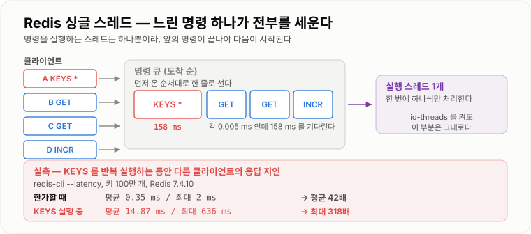
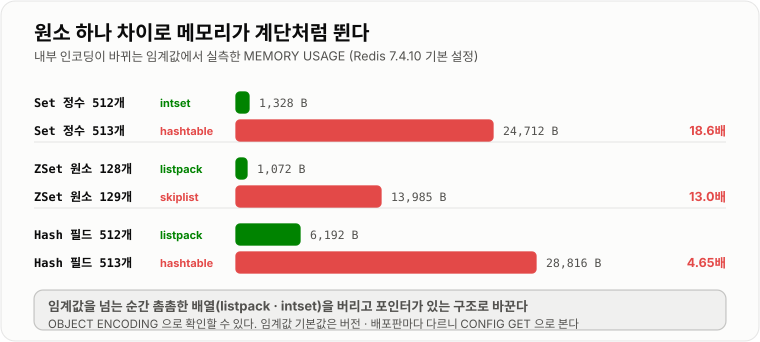
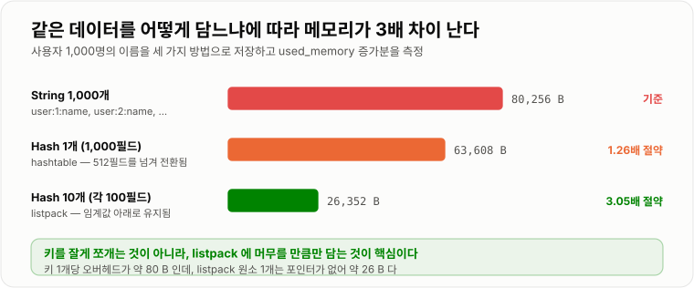

# Redis 자료구조와 활용

> **Redis가 빠른 이유는 "메모리에 있어서"가 아니라 자료구조를 서버 안에 두어 왕복을 없앴기 때문이다. 그 자료구조를 잘못 고르면 명령 하나가 158 ms를 잡아먹고, Redis는 싱글 스레드라 그동안 나머지 전부가 멈춘다.**

---

## 1. 핵심 요약

**Redis는 "값을 담아 두는 통"이 아니라 서버 안에서 자료구조를 대신 굴려 주는 자료구조 서버다. 그래서 자료구조를 고르는 일이 곧 성능을 고르는 일이고, 싱글 스레드라 잘못 고른 대가를 모든 클라이언트가 함께 치른다.**

### 한눈에 보기

* Redis는 **자료구조 서버(data structure server)** 다. `String` 말고도 `Hash`·`List`·`Set`·`Sorted Set` 같은 자료구조를 **서버가 직접 들고 연산까지 해 준다.**
* **이것이 Memcached와의 결정적 차이다.** Memcached라면 "랭킹 100명"을 얻으려고 전체를 내려받아 애플리케이션에서 정렬해야 한다. Redis는 `ZREVRANGE key 0 99` 한 번이고, 실측 **6.0 µs**다.
* 실측 처리량은 단순 명령 기준 **초당 11만~14만 건**이다(50 클라이언트). `GET` 128,866 rps, `INCR` 132,626 rps, `ZADD` 128,041 rps.
* **Redis는 명령을 한 번에 하나씩 처리한다(싱글 스레드).** 그래서 느린 명령 하나가 전체를 멈춘다. 100만 키에서 `KEYS` 를 돌렸더니 다른 클라이언트의 `GET` 지연이 **평균 0.35 ms → 14.87 ms(42배), 최댓값 2 ms → 636 ms(318배)** 로 뛰었다.
* 명령의 **복잡도가 곧 지연**이다. 서버가 직접 잰 값으로 `GET` 5.2 µs, `ZRANK` 4.4 µs인 반면 `HGETALL`(10만 필드) **54 ms**, `KEYS`(100만 키) **158 ms**다. `GET` 대비 각각 1만 배, 3만 배다.
* **같은 데이터라도 담는 그릇에 따라 메모리가 3배 차이 난다.** 1,000개의 사용자 이름을 String 1,000개로 담으면 80,256 B, 100개씩 Hash 10개로 나눠 담으면 **26,352 B(3.05배 절약)** 였다.
* 이 절약은 **작은 자료구조를 배열처럼 촘촘히 담는 내부 인코딩(listpack·intset)** 덕분이다. 임계값을 한 개라도 넘기면 인코딩이 바뀌면서 메모리가 급증한다. 실측으로 zset은 128개(1,072 B) → 129개(**13,985 B, 13배**), 정수 Set은 512개(1,328 B) → 513개(**24,712 B, 18.6배**)였다.
* **파이프라이닝은 코드 한 줄로 얻는 가장 큰 성능 개선이다.** 같은 `SET` 10만 건이 파이프라인 없이 15,015 rps, 16개씩 묶으면 229,358 rps(**15.3배**), 100개씩 묶으면 714,286 rps(**47.6배**)였다.
* **기본 `maxmemory-policy`는 `noeviction`이다.** 메모리가 차면 오래된 키를 지우는 게 아니라 **쓰기 명령이 통째로 실패한다.** 캐시로 쓸 거면 반드시 바꿔야 한다.

> 이 노트의 수치는 **Redis 7.4.10 (docker `redis:7.4-alpine`, WSL2)** 과 **JDK 21.0.11**에서 직접 측정했다. 명령 소요 시간은 Redis 서버가 직접 기록하는 `INFO commandstats`의 `usec_per_call`이고, 처리량은 컨테이너 안에서 실행한 `redis-benchmark` 값이다. **인코딩 임계값은 설정 파일 없이 띄웠을 때의 기본값이라 배포판·버전에 따라 다를 수 있어, 본문에 "실무에서는 `CONFIG GET`으로 직접 확인한다"를 함께 적었다.**

### 무엇을 해결하는가

#### 해결하려는 문제

실시간 랭킹판을 만든다고 하자. 점수는 계속 바뀌고, 화면에는 상위 10명과 "내 등수"를 보여줘야 한다.

관계형 DB만 있으면 이렇게 된다.

```sql
-- 상위 10명
SELECT user_id, score FROM ranking ORDER BY score DESC LIMIT 10;

-- 내 등수 — 나보다 점수가 높은 사람을 전부 센다
SELECT COUNT(*) + 1 FROM ranking WHERE score > (SELECT score FROM ranking WHERE user_id = 777);
```

**두 번째 쿼리가 문제다.** 내 등수를 알려면 나보다 높은 사람을 전부 세야 한다. 10만 명이면 10만 행을 센다. 그리고 점수는 초당 수천 번 바뀌므로, 그때마다 인덱스가 갱신되고 그때마다 이 집계가 다시 돌아야 한다.

Redis에는 이 일을 하는 자료구조가 이미 있다.

```text
ZADD ranking 1500 user:777          점수 갱신
ZREVRANGE ranking 0 9 WITHSCORES    상위 10명   실측 6.0 us
ZREVRANK ranking user:777           내 등수     실측 4.4 us
```

**"내 등수"가 4.4 µs다.** Sorted Set이 원소마다 하위 노드 개수를 들고 있어서, 세지 않고 건너뛰며 계산하기 때문이다(자세한 것은 [2. 동작 원리](#2)에서 본다).

#### 이 개념이 없을 때

Redis가 없거나, 있어도 `String`만 쓰면 이런 코드를 직접 써야 한다.

```java
// Redis 를 단순 캐시(String)로만 쓸 때 — 랭킹 상위 10명
public List<Rank> top10() {
    String json = redis.opsForValue().get("ranking");   // 10만 명 전체를 통째로 받는다
    List<Rank> all = parse(json);                        // 파싱 비용
    Collections.sort(all, new ScoreDesc());              // 애플리케이션에서 정렬
    return all.subList(0, 10);
}

// 점수 하나를 바꾸려면
public void updateScore(long userId, int score) {
    String json = redis.opsForValue().get("ranking");   // 전체를 받아서
    List<Rank> all = parse(json);
    for (int i = 0; i < all.size(); i++) {              // 찾아서
        if (all.get(i).getUserId() == userId) {
            all.get(i).setScore(score);
        }
    }
    redis.opsForValue().set("ranking", toJson(all));    // 전체를 다시 쓴다
}
```

문제가 세 개다.

1. **네트워크로 10만 명을 통째로 나른다.** 값이 1 MB면 매 요청마다 1 MB를 왕복한다.
2. **정렬을 애플리케이션이 한다.** 서버 CPU를 쓰고, 요청마다 반복한다.
3. **갱신에 경쟁 조건이 있다.** 두 서버가 동시에 `get → 수정 → set` 하면 한쪽 갱신이 사라진다.

`Sorted Set`을 쓰면 셋 다 사라진다. **네트워크로는 명령 한 줄만 가고, 정렬은 서버가 유지하고 있으며, `ZADD`는 원자적이다.**

```java
// Sorted Set 을 쓸 때
public void updateScore(long userId, int score) {
    redis.opsForZSet().add("ranking", "user:" + userId, score);   // 명령 한 줄, 원자적
}

public Set<ZSetOperations.TypedTuple<String>> top10() {
    return redis.opsForZSet().reverseRangeWithScores("ranking", 0, 9);
}
```

**Redis를 "빠른 캐시"로만 이해하면 이 차이를 놓친다.** Redis의 값어치는 속도가 아니라 **서버 쪽에 자료구조가 있다는 것**이다.

---

## 2. 동작 원리

### 핵심 구성 요소

#### 자료구조 다섯 가지와 확장형

| 자료구조 | 담는 것 | 대표 명령 | 전형적인 용도 |
| --- | --- | --- | --- |
| **String** | 바이트 문자열 (최대 512 MB) | `SET` `GET` `INCR` `SETNX` | 캐시 값, 카운터, 분산 락 |
| **Hash** | 필드 → 값 (한 겹 맵) | `HSET` `HGET` `HINCRBY` | 객체 한 건, 메모리 절약용 버킷 |
| **List** | 순서 있는 목록 (양끝 삽입/삭제) | `LPUSH` `RPOP` `BLPOP` `LRANGE` | 간단한 큐, 최근 목록 |
| **Set** | 중복 없는 모음 (순서 없음) | `SADD` `SISMEMBER` `SINTER` | 태그, 좋아요, 집합 연산 |
| **Sorted Set** | 점수로 정렬된 모음 | `ZADD` `ZREVRANGE` `ZRANK` | 랭킹, 시간순 인덱스, 지연 큐 |
| **Bitmap** | String 위의 비트 배열 | `SETBIT` `BITCOUNT` | 출석 체크, 대규모 플래그 |
| **HyperLogLog** | 카디널리티 추정치 | `PFADD` `PFCOUNT` | 순 방문자 수 (오차 0.81%) |
| **Stream** | 추가 전용 로그 + 소비자 그룹 | `XADD` `XREADGROUP` `XACK` | 메시지 큐, 이벤트 로그 |
| **Geo** | 좌표 (Sorted Set 위에 구현) | `GEOADD` `GEOSEARCH` | 주변 검색 |

**앞의 다섯 개가 기본이고 뒤의 네 개는 그 위에 얹은 것이다.** Geo는 실제로 Sorted Set이고(`TYPE` 을 찍어 보면 `zset`이 나온다), Bitmap과 HyperLogLog는 String이다.

#### 값 하나가 저장되는 모습

```text
키 공간 (dict)                     값 객체 (robj)
┌──────────────────┐              ┌─────────────────────────────┐
│ "user:1"  ───────┼─────────────▶│ type = OBJ_HASH             │
│ "ranking" ───────┼──────┐       │ encoding = listpack         │  ← 같은 타입도
│ "stock:1" ───────┼───┐  │       │ lru / refcount              │     인코딩은 다르다
└──────────────────┘   │  │       │ ptr ──▶ 실제 자료구조        │
                       │  │       └─────────────────────────────┘
만료 시각 (expires)     │  │
┌──────────────────┐   │  │
│ "user:1" → 1712… │   │  │        TTL 이 걸린 키만 이 사전에 따로 들어간다
└──────────────────┘   │  │
```

**타입(`type`)과 인코딩(`encoding`)은 다르다.** 사용자가 보는 것은 타입이고, 메모리와 속도를 결정하는 것은 인코딩이다. 이 구분이 이 노트에서 가장 중요한 지점이다.

### 내부 동작 과정

#### 왜 빠른가 — 세 가지 이유

```text
1) 메모리에 있다        디스크 탐색이 없다
2) 싱글 스레드다        락도 없고 컨텍스트 스위칭도 없다
3) 자료구조가 서버에 있다  왕복 한 번으로 계산까지 끝난다   ← 이게 가장 크다
```

세 번째가 핵심이다. 앞의 랭킹 예에서 봤듯 **"데이터를 가져와서 계산"이 "계산 결과만 받기"로 바뀐다.** 나르는 양이 1 MB에서 수십 바이트가 된다.

두 번째는 장점이자 최대 약점이다. 명령을 한 번에 하나씩 처리하니 `INCR` 같은 것이 저절로 원자적이지만, **느린 명령 하나가 뒤에 줄 선 전부를 세운다.**



*명령은 큐에 줄을 서고 한 번에 하나씩 처리된다. 앞의 명령이 158 ms 걸리면 뒤의 모두가 158 ms를 기다린다.*

> **"Redis 7부터 멀티 스레드 아닌가요?"** 절반만 맞다. `io-threads` 는 **소켓 읽기/쓰기**만 여러 스레드로 나눈다(실측 기본값은 `1`, 즉 꺼져 있다). **명령을 실제로 실행하는 부분은 여전히 스레드 하나다.** 그래서 `KEYS`가 막는 문제는 io-threads를 켜도 그대로다.

#### 내부 인코딩 — 같은 타입, 다른 구조

Redis는 **작을 때는 배열처럼 촘촘하게, 커지면 진짜 자료구조로** 바꿔 담는다.

```text
       작을 때 (메모리 절약형)           크면 (속도 우선형)
Hash   listpack   연속된 바이트 배열  →   hashtable   해시 테이블
Set    intset     정렬된 정수 배열    →   hashtable
       listpack   연속된 바이트 배열  →   hashtable
ZSet   listpack   연속된 바이트 배열  →   skiplist + hashtable
List   listpack   연속된 바이트 배열  →   quicklist   listpack 들의 연결 리스트
String int / embstr / raw
```

listpack은 **원소를 한 줄로 이어 붙인 바이트 배열**이다. 포인터가 없어 메모리를 아끼지만, 원소를 찾으려면 앞에서부터 훑어야 해서 **O(N)** 이다. 원소가 적을 때는 그게 더 빠르고(캐시 지역성), 많아지면 손해라 임계값에서 바꾼다.

실측한 임계값과 그 순간의 메모리 변화다.

```text
Hash   필드 512개  listpack     6,192 B
       필드 513개  hashtable   28,816 B     4.65배

Set    정수 512개  intset       1,328 B
       정수 513개  hashtable   24,712 B    18.6배   ← 가장 극적이다
       문자열 128개 listpack
       문자열 129개 hashtable

ZSet   원소 128개  listpack     1,072 B
       원소 129개  skiplist    13,985 B    13.0배
```



*임계값을 넘는 순간 메모리가 계단처럼 뛴다. Set은 18.6배, ZSet은 13배였다.*

임계값은 설정으로 바꿀 수 있고, **기본값은 배포판과 버전에 따라 다르다.** 실측한 컨테이너의 기본값은 이랬다.

| 설정 | 실측 기본값 | 뜻 |
| --- | --- | --- |
| `hash-max-listpack-entries` | **512** | 필드 수가 이보다 크면 hashtable |
| `hash-max-listpack-value` | **64** | 값 길이가 이보다 크면 hashtable |
| `set-max-intset-entries` | **512** | 정수 원소가 이보다 많으면 intset 탈출 |
| `set-max-listpack-entries` | **128** | 문자열 원소가 이보다 많으면 hashtable |
| `zset-max-listpack-entries` | **128** | 원소가 이보다 많으면 skiplist |
| `zset-max-listpack-value` | **64** | 값 길이가 이보다 크면 skiplist |
| `list-max-listpack-size` | **-2** | **개수가 아니라 크기 기준. 노드 하나가 8 KB** |

**마지막 줄이 함정이다.** List만 유일하게 개수가 아니라 **크기** 기준이다. 실측에서 원소 200개짜리 리스트는 여전히 `listpack`이었고(1,328 B), 100 바이트짜리 원소 100개(= 약 10 KB)를 넣자 그제서야 `quicklist`가 됐다. **"128개 넘으면 quicklist"는 틀렸다.**

값 길이 임계값도 정확히 확인했다.

```text
Hash 값 64 바이트  →  listpack
Hash 값 65 바이트  →  hashtable      "64를 초과하면" 이지 "64 이상"이 아니다
```

String의 인코딩도 셋이다.

```text
SET k 12345                      int      정수로 저장 (8바이트)          48 B
SET k "hello"                    embstr   44바이트 이하 — 헤더와 붙여 한 번에 할당   64 B
SET k "<45바이트 이상>"            raw      헤더와 데이터를 따로 할당
```

**44 바이트가 경계다.** UUID 문자열(36자)은 `embstr`, JSON을 통째로 넣으면 `raw`다.

#### Sorted Set이 "내 등수"를 4.4 µs에 답하는 방법

Sorted Set은 **자료구조 두 개를 동시에 유지**한다.

```text
Sorted Set (skiplist 인코딩)

  hashtable   member → score      "user:777 의 점수는?"  O(1)
  skiplist    score 순 정렬       "점수 순 10명"          O(log N + M)
```

스킵 리스트는 정렬된 연결 리스트에 **건너뛰는 층**을 얹은 구조다.

```text
레벨 3   [1] ─────────────────────────────▶ [16]
레벨 2   [1] ───────────▶ [7] ────────────▶ [16]
레벨 1   [1] ──▶ [3] ──▶ [7] ──▶ [11] ────▶ [16]
레벨 0   [1] ▶ [2] ▶ [3] ▶ [5] ▶ [7] ▶ [9] ▶ [11] ▶ [13] ▶ [16]

  11 을 찾을 때: 레벨 3 에서 1 → (16 은 너무 큼) → 레벨 2 에서 7 → 레벨 1 에서 11
  단계마다 후보가 반으로 줄어 O(log N)
```

여기에 Redis는 **각 링크에 "이 링크가 몇 칸을 건너뛰는지(span)"를 함께 저장**한다. 그래서 `ZRANK`는 세는 게 아니라 **건너뛴 칸 수를 더하기만 하면 된다.**

```text
ZRANK 는 경로를 따라가며 span 을 더한다
   레벨 3 에서 1칸 + 레벨 2 에서 3칸 + 레벨 1 에서 2칸 = 6등

DB 로 같은 것을 하려면  SELECT COUNT(*) WHERE score > 내점수   → 전부 센다
```

**실측 `ZRANK` 4.4 µs.** 10만 원소짜리 zset에서 잰 값이다.

#### 명령의 복잡도가 곧 지연이다 — 실측

Redis 서버가 스스로 기록하는 값(`INFO commandstats`)이다. 네트워크가 빠진 순수 처리 시간이다.

| 명령 | 대상 크기 | 복잡도 | 실측 |
| --- | --- | --- | --- |
| `GET` | 키 1개 | O(1) | **5.2 µs** |
| `ZRANK` | 10만 원소 | O(log N) | **4.4 µs** |
| `ZREVRANGE 0 9` | 10만 원소 중 10개 | O(log N + M) | **6.0 µs** |
| `HGET` | 10만 필드 중 1개 | O(1) | **9.6 µs** |
| `LRANGE 0 99` | 10만 원소 중 100개 | O(S + N) | **19 µs** |
| `SCAN` 1회 | `COUNT 1000` | O(1) 분할 | **427.6 µs** |
| `ZRANGE 0 -1` | 10만 원소 전부 | O(N) | **18,964 µs (19 ms)** |
| `LRANGE 0 -1` | 10만 원소 전부 | O(N) | **22,525 µs (22.5 ms)** |
| `HGETALL` | 10만 필드 전부 | O(N) | **54,277 µs (54 ms)** |
| `KEYS 'k:1*'` | 100만 키 | O(N) | **158,204 µs (158 ms)** |

**`GET` 5.2 µs와 `KEYS` 158 ms 사이에는 30,424배가 있다.** 그리고 Redis는 싱글 스레드라 이 158 ms 동안 다른 클라이언트는 아무것도 못 한다.

#### 느린 명령 하나가 전체를 세운다 — 실측

`redis-cli --latency`로 응답 지연을 재면서, 동시에 `KEYS '*'`를 반복 실행했다.

```text
                       최소     최대      평균
한가할 때               0 ms     2 ms    0.35 ms
KEYS 를 도는 동안       0 ms   636 ms   14.87 ms      최댓값 318배 / 평균 42배
KEYS 를 멈춘 뒤         0 ms     1 ms    0.33 ms      바로 회복
```

**최댓값 636 ms.** 캐시를 보러 간 요청이 0.6초를 기다린 것이다. 이런 요청이 쌓이면 애플리케이션의 커넥션 풀이 마르고, 그때부터는 Redis와 무관한 API까지 함께 죽는다.

느린 명령은 `SLOWLOG`에 자동으로 남는다.

```text
SLOWLOG GET 5

  1785818936   258,886 us   KEYS   k:1*         ← 259 ms
  1785818936    17,046 us   LRANGE biglist 0 -1 ← 17 ms
```

#### `KEYS` 대신 `SCAN`

`SCAN`은 **커서를 들고 조금씩 나눠서 훑는다.** 한 번 호출이 실측 427.6 µs로 끝나므로 그 사이에 다른 명령이 처리된다.

```text
KEYS 'k:1*'    ┌──────────────── 158 ms 통째로 점유 ────────────────┐

SCAN 0 COUNT 1000   ┌0.4ms┐   다른 명령   ┌0.4ms┐   다른 명령   ┌0.4ms┐ ...
```

대신 대가가 있다. **`SCAN`은 같은 키를 두 번 돌려줄 수 있고, 순회 도중 추가된 키는 나올 수도 안 나올 수도 있다.** 순회 시작 전부터 끝까지 계속 있던 키는 반드시 한 번은 나온다는 것만 보장한다. 그래서 결과를 `Set`으로 받아 중복을 없애는 습관이 필요하다.

#### 파이프라이닝 — 왕복을 줄인다

명령 하나마다 네트워크를 왕복하면, 실제 처리 시간(µs)보다 왕복 시간(ms)이 훨씬 크다.

```text
파이프라인 없음                     파이프라인 (16개 묶음)
  요청 → 응답 → 요청 → 응답 ...       요청×16 → 응답×16
  왕복 10만 번                        왕복 6,250 번
```

같은 `SET` 10만 건, 클라이언트 1개로 실측했다.

```text
파이프라인 없음      15,015 rps    (p50 0.047 ms)
-P 16              229,358 rps    15.3배
-P 100             714,286 rps    47.6배
```

**코드 구조를 바꾸지 않고 얻는 개선 폭으로는 가장 크다.** 반복문 안에서 Redis를 부르고 있다면 거의 항상 파이프라인으로 묶을 수 있다.

#### 만료(TTL)는 어떻게 지워지는가

Redis는 TTL이 지났다고 즉시 지우지 않는다. 두 가지를 병행한다.

```text
1) 게으른 만료 (lazy)     그 키에 접근할 때 "어? 만료됐네" 하고 그때 지운다
2) 능동 만료 (active)     100 ms 마다 TTL 이 걸린 키 중 20개를 무작위로 뽑아 검사
                          그중 25% 넘게 만료돼 있으면 즉시 한 번 더 반복
```

**둘 다 없으면 아무도 안 읽는 만료 키가 영원히 메모리를 차지한다.** 그래서 능동 만료가 필요하고, 능동 만료는 표본 검사라 **만료 직후에 메모리가 곧바로 줄지 않는다.**

---

## 3. 특징과 비교

| 구분          | 내용 |
| ----------- | -- |
| **장점**      | 자료구조 연산을 서버가 대신해 왕복과 애플리케이션 CPU를 함께 줄인다. 단순 명령이 초당 11만~14만 건(`GET` 128,866 rps)이고 `ZRANK` 같은 계산도 4.4 µs다. 싱글 스레드라 `INCR`·`SETNX`가 별도 장치 없이 원자적이다. |
| **단점**      | 명령 하나가 전체를 막는다(`KEYS` 실행 중 다른 요청 지연 최대 636 ms, 평균 42배). 인코딩 임계값을 넘기면 메모리가 계단처럼 뛴다(Set 18.6배, ZSet 13배). 데이터가 전부 메모리라 용량이 비싸고, 기본 `maxmemory-policy`가 `noeviction`이라 메모리가 차면 쓰기가 실패한다. |
| **적합한 상황**  | 랭킹·카운터·세션·중복 제거처럼 **자료구조 연산이 필요한 데이터**, 그리고 원본이 따로 있어 잃어도 되는 캐시. 키 하나가 다루는 원소가 수천 개 이하로 유지되는 경우. |
| **주의할 상황**  | 한 키에 원소가 수만 개 쌓이는 구조(빅 키). `KEYS`·`HGETALL`·`LRANGE 0 -1`처럼 O(N) 명령을 상시 호출하는 코드. 잃으면 안 되는 원본 데이터를 Redis에만 두는 것. |

### 성능 특성

#### 명령별 처리량 (redis-benchmark, 10만 요청, 클라이언트 50)

```text
LPUSH      146,843 rps      p50 0.183 ms
ZPOPMIN    139,665 rps      p50 0.183 ms
HSET       138,122 rps      p50 0.183 ms
LPOP       135,685 rps      p50 0.183 ms
SADD       135,135 rps      p50 0.183 ms
INCR       132,626 rps      p50 0.183 ms
GET        128,866 rps      p50 0.191 ms
ZADD       128,041 rps      p50 0.183 ms
RPUSH      118,906 rps      p50 0.199 ms
SET        117,925 rps      p50 0.199 ms
```

**명령 종류에 따른 차이가 크지 않다(최대 1.24배).** 자료구조가 복잡하다고 눈에 띄게 느려지지 않는다는 뜻이다. **차이를 만드는 것은 명령 종류가 아니라 다루는 원소 개수다.**

#### 원소 개수가 늘면 어떻게 되는가

```text
같은 ZSET(10만 원소)에서

  ZREVRANGE 0 9    10개만 읽음        6.0 us
  ZRANGE 0 -1      10만 개 전부 읽음  18,964 us      3,161배

같은 HASH(10만 필드)에서

  HGET             1개만 읽음         9.6 us
  HGETALL          10만 개 전부 읽음  54,277 us      5,654배
```

**"필요한 만큼만 읽는다"가 Redis 성능의 거의 전부다.**

#### 메모리 — 같은 데이터를 어떻게 담느냐

사용자 1,000명의 이름을 세 가지 방법으로 담고 `used_memory` 증가분을 쟀다.

```text
String 1,000개  (user:1:name, user:2:name, ...)     80,256 B
Hash 1개        (필드 1,000개, hashtable 인코딩)     63,608 B     1.26배 절약
Hash 10개       (각 100필드, listpack 인코딩)        26,352 B     3.05배 절약
```



*Hash로 바꾸는 것만으로는 1.26배지만, listpack에 머무르도록 나눠 담으면 3.05배가 된다.*

**중간이 제일 나쁘지 않고, 오히려 "나눠 담기"가 압도적이다.** 필드를 1,000개 넣으면 `hash-max-listpack-entries` 512를 넘겨 `hashtable`로 바뀌기 때문이다. **listpack에 머무르도록 잘라 담는 것**이 핵심이다.

이유는 오버헤드에 있다.

```text
String 1개당      키 문자열 + robj 헤더 + 만료 사전 자리 + dict 엔트리 ≈ 80 B
listpack 원소 1개  길이 + 데이터 (포인터 없음)                        ≈ 26 B
```

#### 인코딩 전환 지점의 메모리 급증

```text
자료구조     임계 직전            임계 직후             배수
Set(정수)    512개    1,328 B     513개  24,712 B      18.6배
ZSet         128개    1,072 B     129개  13,985 B      13.0배
Hash         512필드  6,192 B     513필드 28,816 B      4.65배
```

**원소 하나 차이로 메모리가 13~18배 뛴다.** "왜 갑자기 메모리가 늘었지?"의 대부분이 이것이다.

### 장점과 단점

#### 장점

| 장점 | 근거 |
| --- | --- |
| **자료구조 연산을 서버가 해 준다** | 10만 명 랭킹에서 "내 등수"가 `ZRANK` 4.4 µs. DB의 `COUNT(*)`는 전부 센다. |
| **왕복량이 줄어든다** | 전체를 받아 정렬하는 대신 결과 10건만 받는다. |
| **단순 명령이 매우 빠르다** | `GET` 128,866 rps, 서버 처리 5.2 µs. |
| **원자성이 공짜다** | 싱글 스레드라 `INCR`·`SETNX`·`ZADD`가 별도 락 없이 원자적이다. |
| **파이프라이닝 이득이 크다** | 15,015 → 714,286 rps (47.6배). |
| **TTL이 자료구조에 내장돼 있다** | 캐시·세션·락 만료를 애플리케이션이 관리하지 않아도 된다. |
| **작을 때는 메모리도 아낀다** | listpack 인코딩. Hash 10개로 나눠 담아 3.05배 절약. |

#### 단점

| 단점 | 근거 |
| --- | --- |
| **명령 하나가 전체를 막는다** | `KEYS` 실행 중 다른 요청 지연 평균 42배, 최대 636 ms. |
| **O(N) 명령이 곳곳에 있다** | `HGETALL` 54 ms, `LRANGE 0 -1` 22.5 ms. 무심코 쓰기 쉽다. |
| **인코딩 전환에서 메모리가 급증한다** | Set 18.6배, ZSet 13.0배. |
| **키 하나당 오버헤드가 크다** | String 1개당 약 80 B. 작은 값 수백만 개는 비효율적이다. |
| **메모리가 곧 용량 한계다** | 디스크처럼 늘릴 수 없고 비싸다. |
| **기본이 `noeviction`이다** | 실측 확인. 메모리가 차면 쓰기가 `OOM command not allowed` 로 실패한다. |
| **영속성이 기본 목적이 아니다** | RDB는 스냅숏 간격만큼, AOF도 `everysec`면 최대 1초를 잃는다. |

### 어떤 상황에서 고르는가

#### 자료구조 선택 흐름도

```text
무엇을 저장하는가?
   │
   ├─ 값 하나 (문자열·JSON·숫자)
   │     ├─ 숫자를 세기만 한다        → String + INCR
   │     └─ 통째로 읽고 쓴다          → String
   │
   ├─ 객체 한 건의 여러 필드
   │     ├─ 일부 필드만 읽고 쓴다      → Hash        (HGET / HSET)
   │     └─ 늘 통째로 쓴다            → String(JSON) (직렬화 한 번이 더 싸다)
   │
   ├─ 여러 건의 모음
   │     ├─ 순서가 있고 양끝만 다룬다   → List        (LPUSH / RPOP)
   │     ├─ 중복을 없애야 한다         → Set         (SADD / SISMEMBER)
   │     ├─ 점수·시간으로 정렬해야 한다 → Sorted Set  (ZADD / ZRANGE)
   │     └─ 소비자 그룹·재처리가 필요하다 → Stream    (XADD / XREADGROUP)
   │
   └─ 개수만 알면 된다
         ├─ 정확해야 한다             → Set 의 SCARD
         ├─ 0.81% 오차를 허용한다      → HyperLogLog (메모리 12 KB 고정)
         └─ 사용자별 on/off 플래그     → Bitmap      (SETBIT / BITCOUNT)
```

#### 한 키에 얼마나 담아도 되는가

| 한 키의 원소 수 | 판정 | 근거와 조치 |
| --- | --- | --- |
| ~ 128개 | **가장 좋다** | listpack 인코딩 유지. 메모리 최소. |
| 128 ~ 512개 | 좋다 | Hash는 아직 listpack, ZSet은 skiplist로 전환됨. |
| 512 ~ 5,000개 | 보통 | 전체 조회만 안 하면 문제없다. |
| 5,000 ~ 10,000개 | 주의 | `HGETALL`·`LRANGE 0 -1` 금지. 부분 조회만. |
| **10,000개 초과** | **빅 키** | 전체 조회 시 수십 ms 블로킹. **키를 쪼갠다.** |

**"빅 키"의 기준은 개수가 아니라 "전체를 훑는 명령이 얼마나 걸리느냐"다.** 실측에서 10만 원소 전체 조회가 19~54 ms였다.

#### Redis에 두면 안 되는 것

| 데이터 | Redis에 둬도 되나 | 이유 |
| --- | --- | --- |
| 조회 캐시 | **적합** | 잃어도 DB에서 다시 만든다 |
| 세션 | 적합 | 잃으면 재로그인. 감수 가능 |
| 랭킹·카운터 | 적합 | 자료구조 이득이 크다. 주기적으로 DB에 반영 |
| 분산 락 | 조건부 | 상호 배제가 "성능 최적화"일 때만 |
| **주문·결제 원본** | **부적합** | 최대 1초 유실 가능. DB가 원본이어야 한다 |
| **대용량 파일·이미지** | **부적합** | 메모리가 비싸다. 오브젝트 스토리지로 |
| **복잡한 조회(조인·범위 검색)** | **부적합** | Redis에 쿼리 엔진이 없다 |

### 비슷한 기술과 비교

#### Redis vs Memcached

| 기준 | Redis | Memcached |
| --- | --- | --- |
| 값의 형태 | **9가지 자료구조** | 바이트 문자열만 |
| 서버 쪽 연산 | **있다** (`ZRANK`, `SINTER`, `INCR`) | 거의 없다 (`incr` 정도) |
| 스레드 모델 | **명령 실행은 싱글 스레드** | **멀티 스레드** |
| 단순 GET/SET 처리량 | 128,866 rps (실측) | 멀티코어에서 더 높을 수 있다 |
| 영속성 | RDB / AOF | 없다 |
| 복제·클러스터 | 있다 | 없다 (클라이언트 샤딩) |
| 메모리 효율 | 인코딩 최적화 있음 | 슬랩 할당으로 단순 문자열엔 유리 |
| 고르는 기준 | **자료구조 연산이 필요하거나 영속성·복제가 필요할 때** | **단순 문자열 캐시를 여러 코어로 최대한 밀어낼 때** |

**"Redis가 항상 낫다"는 말은 정확하지 않다.** 단순 String 캐시만 필요하고 코어가 많다면 Memcached가 코어를 다 쓴다. 다만 실무 요구사항은 대개 자료구조와 TTL과 복제를 함께 요구한다.

#### Redis vs 관계형 DB

| 기준 | Redis | RDB |
| --- | --- | --- |
| 저장 위치 | 메모리 | 디스크 (+ 버퍼 풀) |
| 단건 조회 | **5.2 µs** (실측) | 수십 µs ~ 수 ms |
| 복잡한 조회 | 못 한다 | 조인·범위·집계 |
| 트랜잭션 | `MULTI`(롤백 없음) | 완전한 ACID |
| 원본 자격 | 없다 | **있다** |
| 관계 | **캐시·보조 인덱스** | **원본** |

#### String vs Hash — 객체 하나를 담을 때

| 기준 | String(JSON) | Hash |
| --- | --- | --- |
| 필드 1개 읽기 | 전체를 받아 파싱 | **`HGET` 으로 그 필드만** |
| 필드 1개 쓰기 | 읽고 → 고치고 → 통째로 쓰기 (경쟁 조건) | **`HSET` 원자적** |
| 숫자 필드 증가 | 불가 (읽고 고쳐 쓰기) | **`HINCRBY` 원자적** |
| 전체를 늘 함께 쓸 때 | **유리** (직렬화 한 번) | 필드마다 오버헤드 |
| TTL | 키 단위 | **필드별 TTL 없음** (키 전체만) |
| 메모리 | 값 하나 | listpack이면 더 적을 수도 |

**필드별 TTL이 없다는 점이 실무에서 자주 발목을 잡는다.** "장바구니 항목마다 만료"는 Hash로 못 하고 키를 나눠야 한다.

#### Set vs Bitmap vs HyperLogLog — "몇 명인가"를 셀 때

| 기준 | Set | Bitmap | HyperLogLog |
| --- | --- | --- | --- |
| 정확도 | **정확** | **정확** | 추정 (표준 오차 0.81%) |
| 개별 원소 확인 | **`SISMEMBER` O(1)** | `GETBIT` O(1) | **불가능** |
| 메모리 (100만 명) | 수십 MB | **125 KB** (연속 ID일 때) | **12 KB 고정** |
| 원소가 정수 ID여야 하나 | 아니오 | **예 (비트 위치)** | 아니오 |
| 합집합 | `SUNION` | `BITOP OR` | **`PFMERGE`** |
| 쓸 곳 | 좋아요 누른 사람 목록 | 출석 체크, 기능 플래그 | 일간 순 방문자 수 |

**"순 방문자 수"만 필요한데 Set을 쓰면 메모리를 수천 배 낭비한다.** 반대로 "이 사람이 봤나?"를 물어야 하면 HyperLogLog는 못 쓴다.

#### List vs Stream — 큐로 쓸 때

| 기준 | List (`LPUSH`/`BRPOP`) | Stream (`XADD`/`XREADGROUP`) |
| --- | --- | --- |
| 소비 후 메시지 | **사라진다** | **남는다** (`XACK` 로 확인) |
| 소비자 그룹 | 없다 (먼저 잡는 놈이 임자) | **있다** |
| 처리 실패 시 재처리 | **불가능** (이미 사라짐) | **가능** (`XPENDING`/`XCLAIM`) |
| 여러 소비자에게 같은 메시지 | 불가능 | **가능** (그룹을 나눈다) |
| 메모리 | 소비하면 줄어든다 | **`MAXLEN` 으로 잘라야 한다** |
| 고르는 기준 | 유실돼도 되는 가벼운 작업 | **한 건도 잃으면 안 되는 작업** |

**List로 만든 큐는 "소비자가 꺼낸 직후 죽으면 그 메시지는 사라진다".** 이 한 줄이 List 큐를 쓸지 말지를 결정한다.

---

## 4. 실무 주의사항

### 백엔드 실무 적용

#### Spring · Java — 자료구조별 기본형

```java
@Service
public class RankingService {

    private final StringRedisTemplate redis;

    public RankingService(StringRedisTemplate redis) {
        this.redis = redis;
    }

    /** 점수 갱신 — 원자적이라 락이 필요 없다 */
    public void addScore(long userId, double delta) {
        redis.opsForZSet().incrementScore("ranking:2026-08", "user:" + userId, delta);
    }

    /** 상위 10명 — 실측 6.0 us */
    public Set<ZSetOperations.TypedTuple<String>> top10() {
        return redis.opsForZSet().reverseRangeWithScores("ranking:2026-08", 0, 9);
    }

    /** 내 등수 — 실측 4.4 us. DB 의 COUNT(*) 와 비교된다 */
    public Long myRank(long userId) {
        Long rank = redis.opsForZSet().reverseRank("ranking:2026-08", "user:" + userId);
        return rank == null ? null : rank + 1;
    }
}
```

#### 반복문 안의 Redis 호출은 파이프라인으로 묶는다

```java
// 나쁜 예 — 1,000번 왕복한다
public Map<Long, String> loadNamesSlow(List<Long> userIds) {
    Map<Long, String> result = new LinkedHashMap<Long, String>();
    for (int i = 0; i < userIds.size(); i++) {
        Long id = userIds.get(i);
        result.put(id, redis.opsForValue().get("user:" + id + ":name"));
    }
    return result;
}
```

```java
// 좋은 예 1 — MGET 으로 한 번에 (실측 기준 왕복 1,000회 → 1회)
public Map<Long, String> loadNamesFast(List<Long> userIds) {
    List<String> keys = new ArrayList<String>();
    for (int i = 0; i < userIds.size(); i++) {
        keys.add("user:" + userIds.get(i) + ":name");
    }
    List<String> values = redis.opsForValue().multiGet(keys);

    Map<Long, String> result = new LinkedHashMap<Long, String>();
    for (int i = 0; i < userIds.size(); i++) {
        result.put(userIds.get(i), values.get(i));
    }
    return result;
}
```

```java
// 좋은 예 2 — 명령 종류가 섞여 있으면 파이프라인
public void bumpAll(final List<Long> userIds) {
    redis.executePipelined(new RedisCallback<Object>() {
        @Override
        public Object doInRedis(RedisConnection conn) {
            StringRedisConnection c = (StringRedisConnection) conn;
            for (int i = 0; i < userIds.size(); i++) {
                long id = userIds.get(i);
                c.incr("view:" + id);
                c.expire("view:" + id, 3600);
            }
            return null;                 // 파이프라인에서는 반환값을 여기서 쓰지 않는다
        }
    });
}
```

**실측 15,015 rps → 229,358 rps(16개 묶음).** 반복문 안에 Redis 호출이 있으면 거의 항상 개선 여지가 있다.

#### `KEYS`를 금지하고 `SCAN`으로 바꾼다

```java
// 절대 쓰면 안 되는 코드 — 실측 158 ms 동안 Redis 전체가 멈춘다
public Set<String> findSessionsBad() {
    return redis.keys("session:*");
}
```

```java
// SCAN — 한 번에 조금씩 훑는다. 실측 1회 427.6 us
public Set<String> findSessions() {
    Set<String> found = new HashSet<String>();          // SCAN 은 중복을 줄 수 있다
    ScanOptions options = ScanOptions.scanOptions().match("session:*").count(500).build();

    RedisConnection conn = redis.getConnectionFactory().getConnection();
    try {
        Cursor<byte[]> cursor = conn.scan(options);
        while (cursor.hasNext()) {
            found.add(new String(cursor.next(), StandardCharsets.UTF_8));
        }
    } finally {
        conn.close();
    }
    return found;
}
```

**운영 환경에서는 아예 명령을 막는 것이 안전하다.**

```text
# redis.conf — 위험한 명령의 이름을 지운다
rename-command KEYS ""
rename-command FLUSHALL ""
rename-command FLUSHDB ""
rename-command CONFIG ""
```

#### 메모리 정책을 반드시 정한다

실측한 기본값은 이랬다.

```text
maxmemory        0            제한 없음 (서버 메모리를 다 쓸 때까지)
maxmemory-policy noeviction   가득 차면 쓰기 명령이 실패한다
```

**캐시로 쓰면서 이 기본값을 그대로 두면, 메모리가 차는 순간 캐시 갱신이 전부 실패한다.**

```text
maxmemory 4gb
maxmemory-policy allkeys-lru      캐시 용도 — 오래 안 쓴 키부터 버린다
# maxmemory-policy volatile-ttl   TTL 있는 키만 버리고 싶을 때
```

| 정책 | 버리는 대상 | 쓸 곳 |
| --- | --- | --- |
| `noeviction` | 안 버림. 쓰기 실패 | **기본값.** 원본 저장소로 쓸 때만 |
| `allkeys-lru` | 전체 중 오래 안 쓴 것 | **순수 캐시** |
| `allkeys-lfu` | 전체 중 덜 쓰인 것 | 인기 편차가 큰 캐시 |
| `volatile-lru` | TTL 있는 것 중 오래 안 쓴 것 | 캐시와 영구 데이터가 섞여 있을 때 |
| `volatile-ttl` | TTL이 얼마 안 남은 것 | 위와 같으나 만료 임박 우선 |

#### 빅 키를 찾아내고 쪼갠다

```bash
# 운영 중에도 안전한 표본 조사 (SCAN 기반)
redis-cli --bigkeys

# 메모리를 실제로 재 본다
redis-cli MEMORY USAGE some:key
redis-cli OBJECT ENCODING some:key
```

빅 키를 쪼개는 전형적인 방법이다.

```java
// 나쁜 예 — 한 키에 사용자 100만 명
//   SADD active:users user:1 ... user:1000000
//   SMEMBERS active:users  → 수백 ms 블로킹

// 좋은 예 — 해시로 버킷을 나눈다
public String bucketKey(long userId) {
    return "active:users:" + (userId % 100);        // 100개로 분산
}
```

**실측한 메모리 절약도 같은 원리다.** 1,000개를 Hash 하나에 넣으면 63,608 B(hashtable), 10개로 나누면 26,352 B(listpack)였다.

#### 조회수 같은 카운터는 Redis에서 세고 주기적으로 반영한다

```java
@Service
public class ViewCountService {

    private final StringRedisTemplate redis;
    private final PostRepository postRepository;

    public ViewCountService(StringRedisTemplate redis, PostRepository postRepository) {
        this.redis = redis;
        this.postRepository = postRepository;
    }

    public void increase(long postId) {
        redis.opsForHash().increment("view:pending", String.valueOf(postId), 1);
    }

    /** 1분마다 DB 에 반영한다 — DB 의 같은 행을 초당 수백 번 갱신하지 않기 위해서다 */
    @Scheduled(fixedDelay = 60_000)
    public void flush() {
        Map<Object, Object> pending = redis.opsForHash().entries("view:pending");
        redis.delete("view:pending");
        Iterator<Map.Entry<Object, Object>> it = pending.entrySet().iterator();
        while (it.hasNext()) {
            Map.Entry<Object, Object> e = it.next();
            postRepository.addViewCount(Long.parseLong((String) e.getKey()),
                                        Long.parseLong((String) e.getValue()));
        }
    }
}
```

**`view:pending` 이 빅 키가 되지 않게 1분마다 비운다는 점이 중요하다.** 여기서 `HGETALL`을 쓰는 것은, 그 시점의 필드 수가 수천 개 수준으로 유지되기 때문이다.

#### 키 이름 규칙을 정한다

```text
서비스:엔티티:식별자:속성

  order:12345                  주문 한 건
  order:12345:items            그 주문의 항목
  ranking:2026-08              월별 랭킹
  session:abc123               세션
  lock:stock:777               분산 락
  idem:req-uuid                멱등성 키
```

**키에 날짜나 버전을 넣어 두면 통째로 버리기 쉽다.** `ranking:2026-08` 처럼 두면 월이 바뀔 때 옛 키에 TTL만 걸면 된다.

### 자주 하는 오해

| 잘못된 이해 | 올바른 이해 |
| --- | --- |
| "Redis는 메모리에 있어서 빠르다" | 그것도 있지만 **자료구조가 서버에 있어 왕복과 계산을 없앤 것**이 더 크다. 10만 명 랭킹의 "내 등수"가 4.4 µs다. |
| "Redis는 빠르니까 아무 명령이나 써도 된다" | `GET` 5.2 µs, `KEYS` 158,204 µs. **3만 배 차이**다. |
| "느린 명령은 그 요청만 느리다" | **싱글 스레드라 전부가 느려진다.** 실측 다른 요청 지연 최대 636 ms. |
| "Redis 7은 멀티 스레드라 괜찮다" | `io-threads`는 **소켓 입출력만** 나눈다(실측 기본값 1). **명령 실행은 여전히 스레드 하나**다. |
| "List는 원소 128개가 넘으면 quicklist가 된다" | List만 **개수가 아니라 크기(`list-max-listpack-size -2` = 8 KB) 기준**이다. 실측에서 200개도 listpack이었다. |
| "hash-max-listpack-entries 기본값은 128이다" | 실측 컨테이너 기본값은 **512**였다. **버전·배포판마다 다르니 `CONFIG GET`으로 확인해야 한다.** |
| "원소를 하나 더 넣는다고 메모리가 크게 변하진 않는다" | 임계값을 넘는 그 하나에서 **Set 18.6배, ZSet 13배**로 뛴다. |
| "메모리가 차면 오래된 키가 자동으로 지워진다" | 기본 정책이 **`noeviction`**이라 **쓰기가 실패**한다. 실측 확인. |
| "TTL이 지나면 즉시 메모리가 회수된다" | 게으른 만료 + 표본 기반 능동 만료라 **바로 줄지 않는다.** |
| "MULTI는 트랜잭션이니 실패하면 롤백된다" | **롤백이 없다.** 중간 명령이 실패해도 나머지는 그대로 실행된다. |
| "Redis에 넣으면 데이터는 안전하다" | RDB는 스냅숏 간격만큼, AOF `everysec`도 최대 1초를 잃는다. **원본은 DB에 둔다.** |
| "Set으로 순 방문자 수를 세면 된다" | 100만 명이면 수십 MB다. 개별 확인이 필요 없으면 **HyperLogLog 12 KB**로 충분하다. |
| "List로 큐를 만들면 메시지가 안전하다" | 소비자가 꺼낸 직후 죽으면 **그 메시지는 사라진다.** 재처리가 필요하면 Stream이다. |

---

## 5. 예제

### 자료구조 확인하기 — 인코딩이 언제 바뀌는지 직접 본다

```text
127.0.0.1:6379> RPUSH mylist a b c
(integer) 3
127.0.0.1:6379> OBJECT ENCODING mylist
"listpack"
127.0.0.1:6379> MEMORY USAGE mylist
(integer) 80

127.0.0.1:6379> ZADD z 1 a 2 b
(integer) 2
127.0.0.1:6379> OBJECT ENCODING z
"listpack"
                                       원소를 129개로 늘리면
127.0.0.1:6379> OBJECT ENCODING z
"skiplist"
127.0.0.1:6379> MEMORY USAGE z
(integer) 13985                        1,072 B 였던 것이 13배가 됐다
```

### 랭킹 — Sorted Set

```java
public class RankingExample {

    private final StringRedisTemplate redis;

    public RankingExample(StringRedisTemplate redis) {
        this.redis = redis;
    }

    public void record(long userId, double score) {
        redis.opsForZSet().add("ranking", "user:" + userId, score);
    }

    /** 상위 N명 — O(log N + M) */
    public List<String> top(int n) {
        Set<String> members = redis.opsForZSet().reverseRange("ranking", 0, n - 1);
        return new ArrayList<String>(members);
    }

    /** 내 등수와 내 주변 사람 — DB로는 매우 비싼 조회다 */
    public List<String> around(long userId, int radius) {
        Long rank = redis.opsForZSet().reverseRank("ranking", "user:" + userId);
        if (rank == null) {
            return Collections.emptyList();
        }
        long from = Math.max(0, rank - radius);
        long to = rank + radius;
        return new ArrayList<String>(redis.opsForZSet().reverseRange("ranking", from, to));
    }
}
```

### 중복 없는 조회수 — Set과 HyperLogLog

```java
public class UniqueViewExample {

    private final StringRedisTemplate redis;

    public UniqueViewExample(StringRedisTemplate redis) {
        this.redis = redis;
    }

    /** 정확해야 하고 "이 사람이 봤나"도 물어야 할 때 — Set */
    public boolean viewExact(long postId, long userId) {
        Long added = redis.opsForSet().add("viewers:" + postId, String.valueOf(userId));
        redis.expire("viewers:" + postId, Duration.ofDays(1));
        return added != null && added == 1;      // 처음 본 사람인가
    }

    public Long exactCount(long postId) {
        return redis.opsForSet().size("viewers:" + postId);
    }

    /** 개수만 필요할 때 — HyperLogLog. 100만 명이어도 12 KB */
    public void viewApprox(long postId, long userId) {
        redis.opsForHyperLogLog().add("uv:" + postId, String.valueOf(userId));
    }

    public Long approxCount(long postId) {
        return redis.opsForHyperLogLog().size("uv:" + postId);   // 표준 오차 0.81%
    }
}
```

### 최근 본 상품 — List로 길이를 제한한다

```java
public void addRecentlyViewed(long userId, long productId) {
    String key = "recent:" + userId;
    redis.opsForList().leftPush(key, String.valueOf(productId));
    redis.opsForList().trim(key, 0, 19);          // 항상 20개만 유지 — 빅 키를 막는다
    redis.expire(key, Duration.ofDays(30));
}

public List<String> recentlyViewed(long userId) {
    return redis.opsForList().range("recent:" + userId, 0, 19);   // 0 -1 을 쓰지 않는다
}
```

**`trim` 한 줄이 빅 키를 막는다.** 이것이 없으면 활동적인 사용자의 키가 수만 개까지 자란다.

### 파이프라인으로 묶기

```java
public Map<String, String> loadAll(final List<String> keys) {
    List<Object> values = redis.executePipelined(new RedisCallback<Object>() {
        @Override
        public Object doInRedis(RedisConnection conn) {
            StringRedisConnection c = (StringRedisConnection) conn;
            for (int i = 0; i < keys.size(); i++) {
                c.get(keys.get(i));
            }
            return null;
        }
    });

    Map<String, String> result = new LinkedHashMap<String, String>();
    for (int i = 0; i < keys.size(); i++) {
        result.put(keys.get(i), (String) values.get(i));
    }
    return result;
}
```

---

## 6. 면접 정리

### 자주 나오는 질문

#### 기본 질문

1. **Redis가 무엇이고 왜 쓰나요?**

    * 핵심 키워드: 인메모리 **자료구조 서버**, 서버 쪽 연산으로 왕복 제거, 캐시·랭킹·세션·락

2. **Redis가 빠른 이유는 무엇인가요?**

    * 핵심 키워드: 메모리, 싱글 스레드(락·컨텍스트 스위칭 없음), **자료구조가 서버에 있어 나르는 양이 줄어듦**

3. **Redis의 자료구조를 설명해 주세요.**

    * 핵심 키워드: String·Hash·List·Set·Sorted Set, 확장형 Bitmap·HyperLogLog·Stream·Geo

4. **Sorted Set은 내부적으로 어떻게 되어 있나요?**

    * 핵심 키워드: skiplist + hashtable 동시 유지, span으로 `ZRANK` O(log N), 실측 4.4 µs

5. **Redis는 싱글 스레드인데 왜 빠른가요? 단점은 없나요?**

    * 핵심 키워드: 병목이 CPU가 아니라 네트워크·메모리, 단점은 **느린 명령이 전체를 막는 것**(실측 최대 636 ms)

6. **`KEYS`를 쓰면 안 되는 이유는요?**

    * 핵심 키워드: O(N), 실측 100만 키에서 158 ms, 그동안 전부 대기, `SCAN`으로 대체

7. **파이프라이닝이 무엇인가요?**

    * 핵심 키워드: 왕복 횟수 감소, 실측 15,015 → 714,286 rps(47.6배), 원자성은 보장 안 함

8. **TTL은 어떻게 동작하나요?**

    * 핵심 키워드: 게으른 만료 + 능동 만료(100 ms마다 20개 표본), 즉시 회수되지 않음

#### 꼬리 질문

1. **같은 데이터를 String으로 담을 때와 Hash로 담을 때 무엇이 다른가요?**

    * 핵심 키워드: 부분 읽기/쓰기, `HINCRBY` 원자성, 필드별 TTL 없음, 실측 메모리 80,256 B vs 26,352 B

2. **Redis 메모리가 갑자기 늘었습니다. 무엇을 확인하나요?**

    * 핵심 키워드: `--bigkeys`, `OBJECT ENCODING`, **인코딩 전환**(Set 18.6배·ZSet 13배), 빅 키

3. **listpack이 무엇이고 왜 쓰나요?**

    * 핵심 키워드: 포인터 없는 연속 바이트 배열, 작을 때 메모리·캐시 지역성 유리, 크면 O(N)이라 전환

4. **List는 원소가 몇 개 넘으면 quicklist가 되나요?**

    * 핵심 키워드: **개수 기준이 아니다**, `list-max-listpack-size -2` = 노드당 8 KB, 실측 200개도 listpack

5. **Redis 메모리가 가득 차면 어떻게 되나요?**

    * 핵심 키워드: 기본 `noeviction` → **쓰기 실패**, 캐시라면 `allkeys-lru`로 바꿔야 함

6. **`MULTI`는 트랜잭션인가요?**

    * 핵심 키워드: 원자적 실행은 맞지만 **롤백 없음**, 검증은 `WATCH` 또는 Lua로

7. **순 방문자 수를 세야 합니다. 무엇을 쓰나요?**

    * 핵심 키워드: 정확·개별 확인 필요하면 Set, 개수만 필요하면 **HyperLogLog 12 KB / 오차 0.81%**

8. **Redis를 큐로 쓰려면 List와 Stream 중 무엇을 쓰나요?**

    * 핵심 키워드: 유실 허용이면 List, **재처리·소비자 그룹이 필요하면 Stream**(`XACK`/`XPENDING`)

9. **Redis 7의 `io-threads`를 켜면 `KEYS` 문제가 해결되나요?**

    * 핵심 키워드: **아니다**, 소켓 입출력만 분리, 명령 실행은 여전히 싱글 스레드

10. **Redis를 원본 저장소로 써도 되나요?**

    * 핵심 키워드: RDB 스냅숏 간격 유실, AOF `everysec`도 최대 1초, 원본은 DB

11. **빅 키를 어떻게 찾고 어떻게 고치나요?**

    * 핵심 키워드: `--bigkeys`, `MEMORY USAGE`, 해시 버킷으로 분할, `LTRIM`으로 길이 제한

### 30초 답변

> Redis는 **인메모리 자료구조 서버**입니다. 단순한 키-값 저장소와 달리 `Sorted Set`·`Hash` 같은 자료구조를 **서버가 직접 들고 연산까지 해 줍니다.** 그래서 10만 명 랭킹에서 "내 등수"가 실측 **4.4 µs**로 나옵니다. 대신 **명령 실행이 싱글 스레드**라, 느린 명령 하나가 전체를 막습니다.

#### 이어서 더 물으면

**"빠르다"의 이유를 정확히 말하는 게 중요합니다.** 메모리에 있어서만이 아니라, **자료구조가 서버 쪽에 있어서 나르는 양과 계산을 없앤 것**이 더 큽니다. 랭킹을 String으로만 다루면 10만 명을 통째로 받아 애플리케이션에서 정렬해야 하는데, `ZREVRANGE`를 쓰면 결과 10건만 받습니다. 실측으로 상위 10명이 6.0 µs, 내 등수가 4.4 µs였습니다. Sorted Set이 skiplist와 hashtable을 함께 유지하고, 각 링크에 몇 칸을 건너뛰는지(span)를 적어 두기 때문에 등수를 **세지 않고 더해서** 구합니다.

**단점은 싱글 스레드에서 나옵니다.** 명령을 한 번에 하나씩 처리하니 `INCR`·`SETNX`가 공짜로 원자적인 대신, 느린 명령이 전체를 세웁니다. 서버가 직접 잰 값으로 `GET`이 5.2 µs인데 100만 키에서 `KEYS`는 **158 ms**였습니다. 3만 배입니다. 실제로 `KEYS`를 반복하는 동안 다른 클라이언트의 응답 지연을 재 보니 **평균 0.35 ms → 14.87 ms, 최댓값 2 ms → 636 ms**로 뛰었습니다. 그래서 운영에서는 `KEYS`·`FLUSHALL`을 `rename-command`로 아예 막고 `SCAN`을 씁니다. `HGETALL`(10만 필드 54 ms), `LRANGE 0 -1`(22.5 ms)도 같은 이유로 위험합니다.

**메모리에서는 내부 인코딩을 아는 게 실무에서 큽니다.** Redis는 작을 때 `listpack`·`intset` 같은 촘촘한 배열로 담다가, 임계값을 넘으면 해시 테이블이나 스킵 리스트로 바꿉니다. 실측해 보니 정수 Set이 512개일 때 1,328 B였는데 513개가 되자 24,712 B로 **18.6배**, ZSet은 128개에서 129개가 될 때 **13배**가 됐습니다. 이 성질을 이용해서, 사용자 이름 1,000건을 String 1,000개로 담으면 80,256 B인데 100개씩 Hash 10개로 나눠 담으면 **26,352 B로 3.05배** 절약됐습니다.

**설정에서 가장 조심할 것은 `maxmemory-policy`입니다.** 기본값이 `noeviction`이라, 캐시로 쓰면서 그대로 두면 메모리가 차는 순간 오래된 키를 버리는 게 아니라 **쓰기 명령이 전부 실패**합니다. 캐시 용도라면 `allkeys-lru`로 바꿔야 합니다.

**성능을 손쉽게 올리는 방법은 파이프라이닝입니다.** 같은 `SET` 10만 건이 파이프라인 없이 15,015 rps였는데 16개씩 묶으니 229,358 rps, 100개씩 묶으니 714,286 rps로 **47.6배**가 됐습니다. 반복문 안에서 Redis를 호출하고 있다면 `MGET`이나 파이프라인으로 묶을 수 있는지 먼저 봅니다.

#### 답변 구조

1. **정의** — 인메모리 자료구조 서버. String·Hash·List·Set·Sorted Set과 Bitmap·HyperLogLog·Stream·Geo를 서버가 직접 들고 연산까지 제공한다. 단순 캐시가 아니라 "서버 쪽 자료구조"가 본질이다
2. **내부 원리** — 명령 실행은 싱글 스레드 이벤트 루프라 한 번에 하나씩 처리되고, 그래서 `INCR`·`SETNX`가 원자적이다. 값은 타입과 인코딩으로 나뉘어, 작을 때는 `listpack`·`intset` 같은 연속 배열로 담다가 임계값을 넘으면 `hashtable`·`skiplist`·`quicklist`로 바꾼다. Sorted Set은 skiplist와 hashtable을 동시에 유지하고 링크마다 span을 적어 둬 `ZRANK`가 O(log N)이다. TTL은 게으른 만료와 표본 기반 능동 만료를 병행한다
3. **복잡도**
    * `GET` 5.2 µs / `ZRANK`(10만) 4.4 µs / `ZREVRANGE 0 9` 6.0 µs / `HGET` 9.6 µs
    * `ZRANGE 0 -1`(10만) 19 ms / `LRANGE 0 -1`(10만) 22.5 ms / `HGETALL`(10만) 54 ms
    * `KEYS`(100만 키) **158 ms** — `GET`의 30,424배. `SCAN` 1회는 427.6 µs
    * 처리량 `GET` 128,866 rps · `INCR` 132,626 rps · `ZADD` 128,041 rps (50 클라이언트)
    * 파이프라이닝 15,015 → 229,358(×16) → 714,286 rps(×100)
    * 인코딩 전환 메모리 급증: Set 512→513개 18.6배, ZSet 128→129개 13.0배, Hash 512→513필드 4.65배
4. **장점** — 자료구조 연산을 서버가 대신해 왕복량과 애플리케이션 CPU를 함께 줄인다. 단순 명령이 초당 11만~14만 건이고, 싱글 스레드 덕에 원자성이 공짜다. TTL이 내장돼 캐시·세션·락 만료를 직접 관리하지 않아도 되고, 작은 자료구조는 listpack으로 메모리까지 아낀다
5. **단점** — 명령 하나가 전체를 막아 O(N) 명령 하나로 서비스 전체 지연이 튄다(최대 636 ms). 인코딩 임계값에서 메모리가 계단처럼 뛰고, 키 하나당 오버헤드가 약 80 B라 작은 값 수백만 개에는 비효율적이다. 메모리가 곧 용량 한계이며 기본 정책이 `noeviction`이라 설정을 안 바꾸면 가득 찼을 때 쓰기가 실패한다. 영속성이 완전하지 않아 원본 저장소로는 부적합하다
6. **사용 기준** — 랭킹·카운터·세션·중복 제거처럼 자료구조 연산이 필요한 데이터와, 원본이 따로 있어 잃어도 되는 캐시에 쓴다. 키 하나의 원소를 수천 개 이하로 유지하고, 10,000개를 넘으면 해시 버킷이나 `LTRIM`으로 쪼갠다. 정확도가 필요 없으면 HyperLogLog, 개별 확인이 필요하면 Set을 고른다
7. **대안과 비교** — Memcached는 멀티 스레드라 단순 문자열 캐시를 여러 코어로 밀어내는 데 유리하지만 자료구조·영속성·복제가 없다. 관계형 DB는 조인·범위 검색과 완전한 ACID를 주지만 단건 조회가 느리고, Redis는 그 앞단의 캐시·보조 인덱스 역할이다. 큐로 쓸 때 List는 소비 후 사라져 재처리가 안 되므로 유실이 곤란하면 Stream을 쓴다
8. **실무 적용 사례** — 랭킹은 `ZADD`/`ZREVRANGE`/`ZREVRANK`로 옮겨 DB의 `COUNT(*)` 집계를 없앤다. 조회수는 Redis에서 세고 1분마다 DB에 반영해 DB 핫 로우를 피한다. 반복문 안의 Redis 호출은 `MGET`·파이프라인으로 묶고, `KEYS`·`FLUSHALL`은 `rename-command`로 막는다. `maxmemory`와 `allkeys-lru`를 명시하고, `--bigkeys`로 빅 키를 상시 감시하며 `LTRIM`과 해시 버킷으로 크기를 제한한다

### 핵심 키워드

`자료구조 서버` · `싱글 스레드 이벤트 루프` · `listpack` · `intset` · `quicklist` · `skiplist` · `OBJECT ENCODING` · `빅 키` · `KEYS vs SCAN` · `파이프라이닝` · `maxmemory-policy` · `HyperLogLog`

### 이어서 볼 주제

* **캐시 전략과 정합성** — 이 자료구조들을 실제 캐시로 쓸 때의 읽기·쓰기 패턴과 정합성 문제를 다룬다.
* **Cache Stampede와 Request Collapsing** — 캐시가 비는 순간 원본이 받는 충격과 그 대응.
* **분산 락과 멱등성** — `SET NX PX`와 Lua를 이용한 상호 배제. 이 노트의 원자성이 실제로 쓰이는 자리다.
* **Redis 영속성 (RDB · AOF)** — 무엇을 언제 잃는지, `fork` 로 인한 지연은 왜 생기는지.
* **Redis Cluster와 Sentinel** — 샤딩과 장애 조치. 해시 슬롯과 멀티 키 명령의 제약.
* **메시지 큐와 Redis Stream** — 소비자 그룹, `XPENDING`, 재처리 설계.
* **MVCC** — DB의 핫 로우 문제가 왜 카운터를 Redis로 빼는 이유가 되는지 이어서 볼 수 있다.

### 최종 체크리스트

* [ ] Redis가 빠른 이유를 **"자료구조가 서버에 있다"** 로 설명할 수 있다.
* [ ] 자료구조 다섯 가지와 각각의 대표 용도를 말할 수 있다.
* [ ] **타입과 인코딩의 차이**를 설명하고 `OBJECT ENCODING`으로 확인할 수 있다.
* [ ] listpack이 무엇이고 왜 작을 때만 쓰는지 설명할 수 있다.
* [ ] 인코딩 전환에서 메모리가 뛰는 것을 **Set 18.6배 / ZSet 13배**로 설명할 수 있다.
* [ ] **List만 개수가 아니라 크기 기준**이라는 것을 안다.
* [ ] Sorted Set이 skiplist + hashtable이고 `ZRANK`가 O(log N)인 이유를 설명할 수 있다.
* [ ] `KEYS`가 위험한 이유를 **158 ms / 다른 요청 최대 636 ms**로 설명할 수 있다.
* [ ] `SCAN`의 보장(중복 가능, 처음부터 끝까지 있던 키는 반드시 나옴)을 안다.
* [ ] 파이프라이닝의 효과를 **15,015 → 714,286 rps**로 말할 수 있다.
* [ ] 기본 `maxmemory-policy`가 **`noeviction`** 이고 왜 바꿔야 하는지 안다.
* [ ] 빅 키를 찾는 방법(`--bigkeys`, `MEMORY USAGE`)과 쪼개는 방법을 안다.
* [ ] Set / Bitmap / HyperLogLog를 언제 각각 고르는지 설명할 수 있다.
* [ ] List 큐와 Stream의 차이를 **재처리 가능 여부**로 설명할 수 있다.
* [ ] Redis를 원본 저장소로 쓰면 안 되는 이유를 말할 수 있다.
