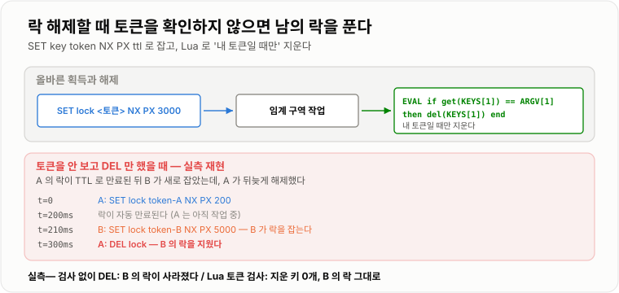
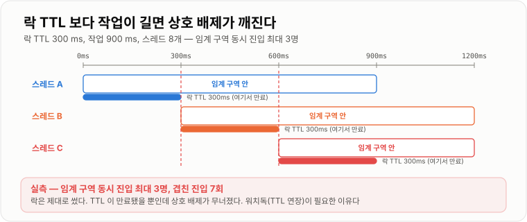
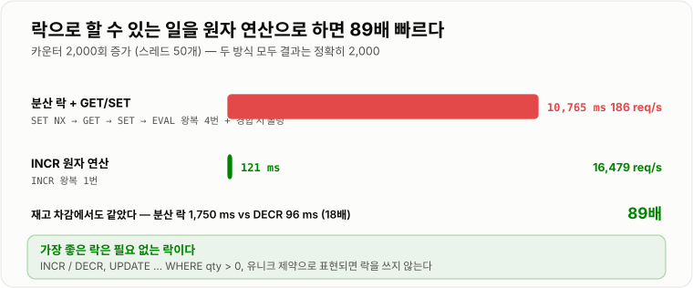

# 분산 락과 멱등성

> **분산 락은 "여러 서버에서 한 명만 들어가게" 만드는 장치지만, 완벽한 상호 배제를 주지는 못한다. 실측에서 락 TTL이 작업 시간보다 짧자 임계 구역에 3명이 동시에 들어갔다. 그래서 진짜 안전장치는 락이 아니라 "두 번 실행돼도 결과가 같게" 만드는 멱등성이다.**

---

## 1. 핵심 요약

**분산 락은 확률적으로 충돌을 줄이는 장치이고, 멱등성은 충돌이 일어나도 결과를 지키는 장치다. 둘은 대체재가 아니라 층이 다르며, 락만 믿는 설계는 실측에서 실제로 깨졌다.**

### 한눈에 보기

* 서버가 한 대면 `synchronized`로 충분하다. **서버가 두 대가 되는 순간 무력해진다.** JVM 밖에서는 아무 효력이 없기 때문이다.
* 실측했다. 재고 100개에 요청 200개가 동시에 들어오면, **락 없이는 200개가 팔려 초과 판매 100개**가 났다. `synchronized`(같은 JVM)와 **Redis 분산 락은 둘 다 정확히 100개**였다.
* Redis 분산 락의 핵심은 **`SET key token NX PX ttl`** 한 줄이다. `NX`가 "없을 때만 쓰기"라 원자적으로 한 명만 성공한다.
* **해제할 때 `DEL`만 하면 남의 락을 푼다.** 실측으로 재현했다. A의 락이 만료돼 B가 새로 잡은 뒤 A가 뒤늦게 `DEL`을 부르자 **B의 락이 사라졌다.** Lua로 토큰을 검사하니 **지운 키 0개, B의 락은 그대로**였다.
* **락 TTL보다 작업이 길어지면 상호 배제가 깨진다.** TTL 300 ms에 작업 900 ms로 실측하니 **임계 구역에 최대 3명이 동시에** 들어갔고, 겹친 진입이 7회였다.
* **그래서 분산 락은 "정확성 장치"가 아니라 "성능 최적화 장치"로 봐야 한다.** 정확성은 DB 제약이나 멱등성이 지킨다.
* 락은 비싸다. 같은 카운터를 2,000번 올릴 때 **분산 락 방식은 186 req/s(10,765 ms)**, **`INCR` 원자 연산은 16,479 req/s(121 ms)** 로 **89배** 차이였다. 재고 차감도 분산 락 1,750 ms vs `DECR` 96 ms였다.
* **락을 안 쓸 수 있으면 안 쓰는 것이 언제나 낫다.** `INCR`/`DECR` 같은 원자 연산, `UPDATE ... WHERE qty > 0` 같은 조건부 갱신, 유니크 제약이 먼저다.
* **멱등성(idempotency)** 은 "같은 요청을 여러 번 보내도 결과가 한 번 보낸 것과 같다"는 성질이다. 네트워크 타임아웃과 재시도가 있는 한 **중복 요청은 반드시 온다.**
* 실측했다. 같은 결제 요청이 200번 중복으로 들어왔을 때 **보호 없이는 200번 처리**됐고, **멱등성 키(`SET NX`)를 두자 1번만 처리되고 199번이 차단**됐다.

> 이 노트의 수치는 **Redis 7.4.10 (docker `redis:7.4-alpine`)** 과 **JDK 21.0.11**에서 직접 측정했다. 락 경합 테스트는 스레드 200개, 처리량 비교는 스레드 50개로 요청 2,000건을 처리한 값이다. **Redis 왕복에 Docker 포트 포워딩 비용이 포함돼 있어 절대값보다 배수를 보는 것이 맞다.**

### 무엇을 해결하는가

#### 해결하려는 문제

재고 100개짜리 상품에 200명이 동시에 주문한다. 코드는 이렇게 생겼다.

```java
public void order(long itemId) {
    int qty = stockRepository.findQty(itemId);      // 1. 읽는다
    if (qty > 0) {                                   // 2. 검사한다
        stockRepository.setQty(itemId, qty - 1);     // 3. 쓴다
    }
}
```

**"읽고 → 검사하고 → 쓴다"** 사이에 남이 끼어들 수 있다.

```text
스레드 A: 재고 읽음 = 1
스레드 B: 재고 읽음 = 1        ← A 가 아직 안 썼다
스레드 A: 1 > 0 이므로 판매, 재고 0 으로 씀
스레드 B: 1 > 0 이므로 판매, 재고 0 으로 씀    ← 둘 다 팔렸다
```

실측 결과다.

```text
재고 100개, 동시 요청 200개, 락 없음

  판매        200 개
  남은 재고    97
  초과 판매   100 개
```

**초과 판매 100개.** 게다가 남은 재고가 97로 남았다. 서로의 쓰기를 덮어썼기 때문에 숫자 자체가 엉망이 됐다.

#### 이 개념이 없을 때

서버가 한 대라면 `synchronized`로 막힌다.

```java
private final Object lock = new Object();

public void order(long itemId) {
    synchronized (lock) {
        int qty = stockRepository.findQty(itemId);
        if (qty > 0) {
            stockRepository.setQty(itemId, qty - 1);
        }
    }
}
```

실측에서 **판매 100개, 초과 판매 0개**로 정확했다.

**그런데 서버를 2대로 늘리는 순간 무너진다.**

```text
서버 A 의 lock 객체        서버 B 의 lock 객체
      │                          │
   서로 아무 관계가 없다 ─────────┘

  서버 A 에서 1명, 서버 B 에서 1명 → 동시에 임계 구역에 들어간다
```

**JVM 안의 락은 JVM 밖을 모른다.** `ReentrantLock`도, `synchronized`도, `AtomicInteger`도 전부 같다. 그래서 **모든 서버가 함께 보는 곳에 락을 둬야 한다.** 그것이 분산 락이다.

```java
// Redis 분산 락 — 모든 서버가 같은 Redis 를 본다
public void order(long itemId) {
    String token = UUID.randomUUID().toString();
    if (redis.opsForValue().setIfAbsent("lock:stock:" + itemId, token, Duration.ofSeconds(3))) {
        try {
            int qty = stockRepository.findQty(itemId);
            if (qty > 0) {
                stockRepository.setQty(itemId, qty - 1);
            }
        } finally {
            unlockSafely("lock:stock:" + itemId, token);
        }
    }
}
```

실측에서 **판매 100개, 초과 판매 0개**였다. 다만 **1,750 ms가 걸렸고 락 획득 재시도가 31,221회** 발생했다.

---

## 2. 동작 원리

### 핵심 구성 요소

| 용어 | 뜻 | 왜 중요한가 |
| --- | --- | --- |
| **상호 배제 (Mutual Exclusion)** | 한 번에 한 명만 임계 구역에 | 락의 존재 이유 |
| **`SET NX`** | 키가 없을 때만 쓴다 | **원자적으로 한 명만 성공**시키는 장치 |
| **`PX` / `EX`** | 키의 수명(ms / 초) | **없으면 데드락**. 락을 든 채 죽으면 영원히 잠긴다 |
| **토큰 (락 소유자 식별자)** | 내가 잡은 락인지 확인하는 값 | **없으면 남의 락을 푼다** (실측 재현) |
| **Lua 스크립트** | Redis가 원자적으로 실행하는 코드 | "검사 후 삭제"를 한 덩어리로 |
| **워치독 (Watchdog)** | 작업이 길어지면 TTL을 연장 | TTL 만료로 인한 붕괴를 막는다 |
| **Redlock** | 여러 Redis 노드에 락을 거는 알고리즘 | 안전성 논쟁이 있다 |
| **펜싱 토큰 (Fencing Token)** | 단조 증가하는 락 번호 | **락이 깨져도 뒤늦은 쓰기를 막는다** |
| **멱등성 (Idempotency)** | 여러 번 해도 결과가 한 번과 같음 | **락보다 근본적인 안전장치** |
| **멱등성 키** | 요청을 식별하는 고유 값 | 중복 요청을 걸러내는 기준 |

### 내부 동작 과정

#### `SET NX PX` — 락을 잡는 한 줄

```text
SET lock:stock:1 <토큰> NX PX 3000

  NX      키가 없을 때만 쓴다  → 이미 있으면 실패(nil 반환)
  PX 3000 3초 뒤 자동 삭제     → 락을 든 채 죽어도 3초 뒤 풀린다
  <토큰>  누가 잡았는지 기록    → 해제할 때 확인용
```

**Redis가 싱글 스레드라 이 명령 전체가 원자적이다.** 100명이 동시에 보내도 정확히 한 명만 `OK`를 받는다.

```text
과거에는 두 명령으로 했다 — 하면 안 되는 방식

  SETNX lock:stock:1 token     락 획득
  EXPIRE lock:stock:1 3        TTL 설정
          ↑
   이 사이에 프로세스가 죽으면 TTL 없는 락이 남는다 → 영구 데드락
```

**`SET ... NX PX`는 이 두 가지를 한 명령으로 합친 것이다.** Redis 2.6.12부터 지원한다.

#### 해제 — `DEL`만 하면 안 되는 이유

```text
잘못된 해제

  A: SET lock token-A NX PX 200      A 가 락 획득 (TTL 0.2초)
  ...  A 의 작업이 0.3초 걸린다
  (0.2초)  락이 자동 만료됨
  B: SET lock token-B NX PX 5000     B 가 락 획득
  A: DEL lock                        A 가 작업을 끝내고 해제 → B 의 락을 지웠다!
  C: SET lock token-C NX PX 5000     C 도 락 획득 → B 와 C 가 동시에 임계 구역에
```

실측으로 그대로 재현됐다.

```text
검사 없이 DEL  →  B 의 락이 남아 있는가?  아니오 — B 의 락을 A 가 풀어 버렸다
Lua 로 토큰 검사 →  지운 키 0개, B 의 락 = B    (건드리지 않았다)
```

올바른 해제는 **"내 토큰일 때만 지운다"** 를 원자적으로 해야 한다.

```lua
if redis.call('get', KEYS[1]) == ARGV[1] then
    return redis.call('del', KEYS[1])
else
    return 0
end
```

**왜 Lua여야 하는가.** 애플리케이션에서 `GET` → 비교 → `DEL`로 하면, 비교와 `DEL` 사이에 락이 만료되고 남이 잡을 수 있다. **Redis는 Lua 스크립트를 다른 명령이 끼어들 수 없게 통째로 실행한다.**



*토큰 검사 없이 `DEL`을 부르면 이미 만료된 내 락 대신 남의 락을 지운다.*

#### TTL이 만료되면 상호 배제가 깨진다

토큰을 제대로 써도 **TTL 자체가 만료되면** 문제가 남는다.

```text
A: 락 획득 (TTL 300ms)
A: 작업 시작 ... (900ms 걸린다)
(300ms) 락 자동 만료
B: 락 획득          ← A 가 아직 임계 구역 안에 있다!
B: 작업 시작
(600ms) 락 또 만료
C: 락 획득          ← 이제 셋이 함께 있다
```

실측 결과다.

```text
락 TTL 300 ms, 작업 900 ms, 스레드 8개

  임계 구역에 동시에 들어간 최대 인원   3 명
  겹친 진입                            7 회
```

**락을 제대로 썼는데도 3명이 동시에 들어갔다.** 이것이 분산 락의 근본적 한계다.



*TTL이 만료되는 순간 두 번째 사람이 들어오고, 첫 번째 사람은 그 사실을 모른다.*

#### 대책 1 — 워치독 (TTL 연장)

작업이 끝나지 않았으면 백그라운드에서 TTL을 계속 늘린다.

```text
락 획득 (TTL 30초)
   │
   ├─ 10초마다 백그라운드 스레드가 TTL 을 30초로 되돌린다
   │
   └─ 작업 끝 → 워치독 중단 → 락 해제
```

**Redisson의 기본 동작이 이것이다.** `leaseTime`을 지정하지 않으면 30초 TTL에 10초마다 갱신한다.

**그래도 완벽하지 않다.** 프로세스가 GC로 20초 멈추면 워치독도 함께 멈춘다. 그 사이 TTL이 만료되고 남이 락을 잡는다.

#### 대책 2 — 펜싱 토큰 (진짜 해법)

**"락이 깨질 수 있다"를 전제로, 뒤늦은 쓰기를 자원 쪽에서 거부하게 만든다.**

```text
락을 줄 때마다 번호를 하나씩 올려서 함께 준다

  A 가 락 획득 → 토큰 33
  A 가 멈춤(GC)
  락 만료
  B 가 락 획득 → 토큰 34
  B 가 저장소에 쓴다 (토큰 34)  → 저장소가 "마지막 토큰 = 34" 로 기록
  A 가 깨어나 쓴다 (토큰 33)    → 저장소가 거부한다 (33 < 34)
```

**자원(DB, 파일 시스템)이 토큰을 검사해야 성립한다.** 그래서 임의의 외부 시스템에는 적용하기 어렵다. DB라면 버전 컬럼으로 흉내 낼 수 있고, 이것이 곧 [낙관적 락](../../07-트랜잭션-데이터접근/낙관적-비관적-락/낙관적-비관적-락.md)이다.

#### Redlock — 여러 노드에 락을 건다

Redis 한 대가 죽으면 락도 사라진다. Redlock은 **독립적인 Redis 노드 N대(보통 5대)의 과반에 락을 잡으면 획득**으로 본다.

```text
5개 노드에 순서대로 SET NX PX 시도
   3개 이상 성공 && 걸린 시간 < TTL   →  획득
   그 외                              →  전부 해제하고 실패
```

**이 알고리즘에는 유명한 논쟁이 있다.** Martin Kleppmann은 "**시계가 튀거나 프로세스가 멈추면 안전성이 깨진다. 정확성이 필요하면 펜싱 토큰을 써야 한다**"고 비판했고, Redis 저자 antirez는 "그 가정이라면 어떤 락도 안전하지 않다"고 반박했다.

**실무적 결론은 이렇다.**

```text
락이 깨져도 손해가 "성능"뿐이라면   →  단일 Redis + SET NX PX 로 충분하다
락이 깨지면 "돈이 잘못 나간다"면    →  락을 신뢰하지 말고 DB 제약·멱등성으로 막는다
```

#### 대책 3 — 애초에 락을 안 쓴다

가장 좋은 락은 **필요 없는 락**이다.

```text
읽고-검사하고-쓰기          →   한 번의 원자 연산으로

  GET stock → 검사 → SET        DECR stock  (음수면 되돌린다)
  SELECT → 검사 → UPDATE        UPDATE ... SET qty = qty - 1 WHERE qty > 0
```

실측한 성능 차이다.

```text
재고 100개, 동시 요청 200개

  Redis 분산 락 (SET NX + GET/SET + Lua 해제)   1,750 ms   재시도 31,221회
  DECR 원자 연산 (음수면 INCR 로 복구)             96 ms   재시도 없음
                                                          18배 빠름
```

카운터를 2,000번 올리는 작업으로도 재 봤다.

```text
분산 락 + GET/SET      10,765 ms       186 req/s
INCR 원자 연산            121 ms    16,479 req/s      89배 빠름
```



*같은 결과를 얻는데 락 방식은 왕복이 4번(획득·읽기·쓰기·해제), 원자 연산은 1번이다.*

**차이의 원인은 단순하다.** 락 방식은 명령을 4번 왕복하고(획득 → `GET` → `SET` → 해제), 경합하면 폴링까지 한다. 원자 연산은 왕복 한 번이다.

#### 멱등성 — 락이 깨져도 결과를 지킨다

**분산 락으로도 못 막는 것이 있다.** 클라이언트의 재시도다.

```text
클라이언트 → 결제 요청 → 서버가 처리 완료 → 응답이 네트워크에서 유실
클라이언트 → (타임아웃) 재시도 → 서버가 또 처리     → 이중 결제
```

**서버 입장에서는 두 요청이 완전히 다른 시각에 도착한 별개의 요청이다.** 락으로는 절대 막을 수 없다.

멱등성은 **요청마다 고유한 키를 붙여** 해결한다.

```text
클라이언트가 요청마다 Idempotency-Key 를 만들어 보낸다 (재시도 시 같은 키)

서버:
   SET idem:<키> "처리중" NX EX 86400
      성공 → 내가 처음이다. 실제 처리를 한다
      실패 → 이미 처리됐거나 처리 중이다. 기존 결과를 돌려준다
```

실측 결과다.

```text
같은 결제 요청이 200번 중복으로 들어왔을 때

  보호 없음          결제 처리 200 회
  멱등성 키(SET NX)  결제 처리   1 회,  중복 차단 199 회,  최종 카운터 1
```

#### 락과 멱등성은 층이 다르다

```text
분산 락      "동시에 두 명이 들어오지 못하게"      → 동시성 문제
멱등성       "같은 일이 두 번 일어나도 괜찮게"     → 중복 문제

  락은 시간이 겹칠 때만 유효하다
  멱등성은 시간이 겹치지 않아도 유효하다   ← 재시도는 시간이 안 겹친다
```

**락이 깨져도 멱등성이 있으면 결과가 지켜진다.** 그래서 **돈이 오가는 곳에서는 멱등성이 필수이고 락은 선택**이다.

---

## 3. 특징과 비교

| 구분          | 내용 |
| ----------- | -- |
| **장점**      | 여러 서버에 걸친 상호 배제를 얻는다. 실측에서 락 없이는 초과 판매 100개였던 것이 분산 락으로 0개가 됐다. `SET NX PX` 한 줄로 구현되고 TTL 덕에 락을 든 채 죽어도 자동으로 풀린다. 멱등성을 함께 두면 중복 요청 200회가 1회 처리로 줄어든다(실측 199회 차단). |
| **단점**      | **상호 배제를 완전히 보장하지 못한다.** TTL이 작업보다 짧으면 실측에서 임계 구역에 3명이 동시에 들어갔다. 해제 시 토큰을 안 보면 남의 락을 푼다. 비용도 크다 — 분산 락 186 req/s vs `INCR` 16,479 req/s(89배), 재고 차감 1,750 ms vs 96 ms(18배). 락 저장소가 새로운 단일 장애점이 된다. |
| **적합한 상황**  | 여러 서버가 같은 자원을 다루고, **락이 깨졌을 때의 손해가 "중복 작업" 정도인 경우**. 배치 중복 실행 방지, 캐시 갱신 1회로 제한, 외부 API 호출 횟수 제한. |
| **주의할 상황**  | **락이 깨지면 돈이 잘못 나가는 경우.** 이때는 락을 신뢰하지 말고 DB 유니크 제약·조건부 `UPDATE`·멱등성 키로 막아야 한다. 원자 연산으로 표현 가능한 작업(카운터·재고 차감)에 락을 쓰는 것도 89배 손해다. |

### 성능 특성

#### 재고 차감 — 방식별 정확성과 소요 시간 (실측)

재고 100개, 동시 요청 200개.

```text
방식                        판매    남은 재고   초과 판매    소요
──────────────────────────────────────────────────────────────
락 없음                     200 개      97       100 개       —
synchronized (서버 1대)     100 개       0         0 개       —
Redis 분산 락               100 개       0         0 개    1,750 ms   재시도 31,221회
DECR 원자 연산              100 개       0         0 개       96 ms   재시도 없음
```

**`synchronized`가 정확한 것은 "테스트가 한 JVM 안에서 돌았기 때문"이다.** 서버가 2대면 이 결과는 무너진다.

#### 처리량 — 락 vs 원자 연산 (실측)

카운터를 2,000번 올린다. 스레드 50개.

```text
방식                       소요        처리량        결과
────────────────────────────────────────────────────────
분산 락 + GET/SET       10,765 ms      186 req/s     2000  (정확)
INCR 원자 연산             121 ms   16,479 req/s     2000  (정확)
                                        89배
```

**둘 다 결과는 정확하다.** 차이는 오직 비용이다.

```text
분산 락 방식의 왕복        원자 연산의 왕복
  1. SET NX (락 획득)        1. INCR
  2. GET
  3. SET
  4. EVAL (락 해제)
  + 경합 시 폴링
```

#### 락 TTL이 짧을 때 무슨 일이 벌어지는가 (실측)

```text
락 TTL 300 ms, 작업 900 ms, 스레드 8개

  임계 구역 동시 진입 최대   3 명
  겹친 진입                  7 회
```

**"락을 썼는데 왜 중복이 나죠?"의 가장 흔한 원인이다.**

#### 멱등성 키의 효과 (실측)

```text
같은 결제 요청 200회 중복

  보호 없음            처리 200 회
  멱등성 키 (SET NX)   처리   1 회 / 차단 199 회 / 최종 카운터 1
```

### 장점과 단점

#### 장점

| 장점 | 근거 |
| --- | --- |
| **여러 서버에 걸친 상호 배제** | 실측 초과 판매 100개 → 0개 |
| **구현이 한 줄이다** | `SET key token NX PX ttl` |
| **락을 든 채 죽어도 풀린다** | TTL이 자동 해제한다 |
| **락 저장소가 이미 있다** | 캐시로 쓰던 Redis를 그대로 쓴다 |
| **멱등성과 함께 쓰면 강력하다** | 중복 200회 → 1회 처리 |
| **원자 연산으로 안 되는 복잡한 검증도 감싼다** | 여러 테이블·외부 호출이 섞인 임계 구역 |

#### 단점

| 단점 | 근거 |
| --- | --- |
| **상호 배제를 완전히 보장 못 한다** | 실측 TTL 만료로 동시 진입 3명 |
| **해제 시 토큰을 안 보면 남의 락을 푼다** | 실측 재현 |
| **비싸다** | 186 req/s vs 16,479 req/s (89배) |
| **경합하면 폴링이 폭증한다** | 실측 재시도 31,221회 |
| **락 저장소가 새 장애점이다** | Redis가 죽으면 락을 못 잡는다 |
| **TTL 산정이 어렵다** | 짧으면 깨지고, 길면 장애 시 오래 잠긴다 |
| **재시도로 인한 중복은 못 막는다** | 시간이 안 겹치는 요청이라 락의 범위 밖 |

### 어떤 상황에서 고르는가

#### 무엇을 쓸지 정하는 순서

```text
1) 원자 연산 하나로 표현할 수 있는가?
      INCR / DECR / SETNX / UPDATE ... WHERE qty > 0
      → 예: 이걸 쓴다.  실측 89배 빠르고 락 관리도 없다
      → 아니오 ↓

2) 한 DB 안에서 끝나는 일인가?
      → 예: DB 락을 쓴다
             비관적 락(SELECT ... FOR UPDATE) 또는 낙관적 락(버전 컬럼)
             트랜잭션과 생명주기가 같아 안전하다
      → 아니오 (여러 자원·외부 API·여러 DB) ↓

3) 락이 깨지면 무엇을 잃는가?
      ├─ 중복 작업 정도 (배치 두 번 돌기, 캐시 두 번 갱신)
      │     → Redis 분산 락으로 충분하다
      │
      └─ 돈·정합성 (이중 결제, 재고 마이너스)
            → 락을 "정확성 장치"로 쓰지 않는다
               DB 유니크 제약 + 멱등성 키 + 조건부 UPDATE 로 막는다
               분산 락은 그 위에 성능 최적화로만 얹는다
```

#### 상황별 판단

| 상황 | 권장 | 이유 |
| --- | --- | --- |
| 조회수·좋아요 카운터 | **`INCR`** | 원자 연산으로 끝난다 |
| 재고 차감 (단순) | **`UPDATE ... WHERE qty > 0`** 또는 `DECR` | 실측 18~89배 빠르다 |
| 재고 차감 (복잡한 검증) | 비관적 락 또는 분산 락 | 검증이 SQL로 표현이 안 될 때 |
| 선착순 쿠폰 | `DECR` + 멱등성 키 | 원자 연산 + 중복 방지 |
| 배치 중복 실행 방지 | **분산 락** | 깨져도 손해가 작다. 전형적인 용도 |
| 캐시 갱신 1회 제한 | **분산 락** | 깨져도 원본을 한 번 더 읽을 뿐 |
| 외부 API 호출 제한 | 분산 락 + 멱등성 키 | 호출 자체가 비싸다 |
| **결제 승인** | **멱등성 키 필수** | 락으로는 재시도를 못 막는다 |
| **주문 생성** | **유니크 제약 + 멱등성 키** | DB가 최종 방어선이어야 한다 |

#### TTL을 얼마로 잡는가

| 기준 | 값 | 근거 |
| --- | --- | --- |
| 작업 최대 소요 시간의 **3배 이상** | — | 실측에서 TTL < 작업 시간이면 3명이 동시 진입했다 |
| 워치독을 쓰면 짧게 | 30초 + 10초마다 갱신 | Redisson 기본값 |
| 너무 길면 장애 시 오래 잠긴다 | 1분 이내 권장 | 락을 든 채 죽으면 그만큼 막힌다 |
| **작업 시간을 모르면 워치독** | — | 추정이 안 되면 연장이 답이다 |

### 비슷한 기술과 비교

#### 분산 락 구현 비교

| 기준 | Redis (`SET NX PX`) | Redisson | DB 네임드 락 | ZooKeeper |
| --- | --- | --- | --- | --- |
| 성능 | **빠르다** | 빠르다 | 보통 | 느리다 |
| 워치독(자동 연장) | 직접 구현 | **내장** | 세션 유지 | **세션 기반** |
| 대기 방식 | **폴링** (실측 31,221회) | **Pub/Sub 알림** | DB 대기 | **워치 알림** |
| 재진입 | 직접 구현 | **지원** | 지원 | 지원 |
| 안전성 | 약하다 (TTL 의존) | 약하다 (같은 이유) | 보통 | **강하다** (합의 기반) |
| 운영 부담 | **작다** (이미 있다) | 작다 | 작다 | **크다** |
| 쓸 곳 | 대부분의 경우 | **실무 1순위** | DB만 있을 때 | 정확성이 극도로 중요할 때 |

**실무에서는 Redisson이 사실상 표준이다.** 폴링 대신 Pub/Sub으로 깨어나 CPU를 덜 쓰고, 워치독과 재진입이 내장돼 있다.

#### 분산 락 vs DB 락 vs 원자 연산

| 기준 | Redis 분산 락 | DB 비관적 락 | 원자 연산 |
| --- | --- | --- | --- |
| 범위 | **여러 DB·외부 자원** | 그 DB 안 | 그 키/행 하나 |
| 실측 소요 (재고 200요청) | 1,750 ms | — | **96 ms** |
| 실측 처리량 (카운터) | 186 req/s | — | **16,479 req/s** |
| 트랜잭션 연동 | **안 된다** (별개) | **된다** | 해당 없음 |
| 락 유실 가능성 | **있다** (TTL) | 없다 (세션 유지) | 해당 없음 |
| 복잡한 검증 | **가능** | **가능** | 어렵다 |
| 첫 번째 선택 | 3순위 | 2순위 | **1순위** |

**"트랜잭션과 연동되지 않는다"가 분산 락의 함정이다.** 락을 풀었는데 트랜잭션이 아직 커밋 전이면, 다음 사람이 락을 잡고 옛 데이터를 읽는다.

```text
잘못된 순서                            올바른 순서
  락 획득                                락 획득
  트랜잭션 시작                          트랜잭션 시작
  작업                                   작업
  락 해제      ← 아직 커밋 전!           트랜잭션 커밋
  트랜잭션 커밋                          락 해제
```

#### 멱등성 구현 방법 비교

| 기준 | Redis `SET NX` | DB 유니크 제약 | 상태 머신 |
| --- | --- | --- | --- |
| 저장 위치 | Redis | **DB (원본)** | DB |
| 유실 가능성 | **있다** (Redis 재시작·축출) | **없다** | 없다 |
| 속도 | **빠르다** | 보통 | 보통 |
| 결과 재사용 | 값에 담아 둘 수 있다 | 조회해야 한다 | 조회해야 한다 |
| 만료 관리 | **TTL 내장** | 직접 정리해야 한다 | 직접 |
| 최종 방어선 | **아니다** | **맞다** | 맞다 |

**돈이 오가면 DB 유니크 제약이 최종 방어선이어야 한다.** Redis는 앞단에서 빠르게 걸러 주는 역할이다.

```sql
-- 최종 방어선: 같은 멱등성 키로는 한 건만 들어간다
CREATE TABLE payment (
    id           BIGINT PRIMARY KEY,
    order_id     BIGINT NOT NULL,
    idem_key     VARCHAR(64) NOT NULL,
    amount       INT NOT NULL,
    CONSTRAINT uk_payment_idem UNIQUE (idem_key)
);
```

#### HTTP 메서드의 멱등성

| 메서드 | 멱등인가 | 안전한가(safe) | 비고 |
| --- | --- | --- | --- |
| `GET` | **예** | **예** | 조회만 한다 |
| `HEAD` | 예 | 예 | 〃 |
| `PUT` | **예** | 아니오 | 전체 교체라 여러 번 해도 같다 |
| `DELETE` | **예** | 아니오 | 두 번째는 "이미 없음"이라 결과가 같다 |
| `POST` | **아니오** | 아니오 | **매번 새 자원을 만든다 → 멱등성 키가 필요** |
| `PATCH` | **아니오** | 아니오 | `qty = qty + 1` 같은 부분 갱신은 누적된다 |

**`POST`와 `PATCH`가 멱등하지 않다는 점이 실무의 출발점이다.** 결제·주문 생성이 대부분 `POST`다.

---

## 4. 실무 주의사항

### 백엔드 실무 적용

#### 직접 구현할 때의 최소 형태

```java
@Component
public class RedisLock {

    private static final String UNLOCK =
            "if redis.call('get', KEYS[1]) == ARGV[1] then return redis.call('del', KEYS[1]) else return 0 end";

    private final StringRedisTemplate redis;
    private final DefaultRedisScript<Long> unlockScript;

    public RedisLock(StringRedisTemplate redis) {
        this.redis = redis;
        this.unlockScript = new DefaultRedisScript<Long>(UNLOCK, Long.class);
    }

    /** 락을 잡으면 토큰을 반환하고, 못 잡으면 null 을 반환한다 */
    public String tryLock(String key, Duration ttl) {
        String token = UUID.randomUUID().toString();
        Boolean ok = redis.opsForValue().setIfAbsent(key, token, ttl);
        return Boolean.TRUE.equals(ok) ? token : null;
    }

    /** 반드시 토큰을 검사하고 지운다 — DEL 만 하면 남의 락을 푼다 */
    public boolean unlock(String key, String token) {
        Long deleted = redis.execute(unlockScript, Collections.singletonList(key), token);
        return deleted != null && deleted > 0;
    }
}
```

```java
@Service
public class CouponService {

    private final RedisLock lock;
    private final CouponRepository couponRepository;

    public CouponService(RedisLock lock, CouponRepository couponRepository) {
        this.lock = lock;
        this.couponRepository = couponRepository;
    }

    public void issue(long couponId, long userId) {
        String key = "lock:coupon:" + couponId;
        String token = lock.tryLock(key, Duration.ofSeconds(3));
        if (token == null) {
            throw new LockNotAcquiredException(couponId);
        }
        try {
            couponRepository.issue(couponId, userId);
        } finally {
            lock.unlock(key, token);          // 반드시 finally 에서
        }
    }
}
```

#### 실무 1순위는 Redisson이다

```java
@Service
public class StockService {

    private final RedissonClient redisson;
    private final StockRepository stockRepository;

    public StockService(RedissonClient redisson, StockRepository stockRepository) {
        this.redisson = redisson;
        this.stockRepository = stockRepository;
    }

    public void decrease(long itemId) throws InterruptedException {
        RLock lock = redisson.getLock("lock:stock:" + itemId);

        // waitTime 5초 동안 획득 시도, leaseTime 을 안 주면 워치독이 30초 TTL 을 자동 연장한다
        boolean acquired = lock.tryLock(5, TimeUnit.SECONDS);
        if (!acquired) {
            throw new LockNotAcquiredException(itemId);
        }
        try {
            stockRepository.decrease(itemId);
        } finally {
            if (lock.isHeldByCurrentThread()) {
                lock.unlock();
            }
        }
    }
}
```

Redisson이 직접 구현보다 나은 점이다.

* **폴링이 아니라 Pub/Sub으로 깨어난다.** 실측에서 직접 구현은 재시도가 31,221회였다.
* **워치독이 TTL을 자동 연장**해 실측에서 본 "동시 진입 3명"을 막는다.
* **재진입(reentrant)** 을 지원한다. 같은 스레드가 중첩 호출해도 데드락이 안 난다.
* `isHeldByCurrentThread()` 검사로 **남의 락 해제를 막는다.**

#### 트랜잭션과 락의 순서를 반드시 지킨다

```java
// 잘못된 코드 — 락이 트랜잭션 커밋보다 먼저 풀린다
@Transactional
public void decreaseWrong(long itemId) {
    RLock lock = redisson.getLock("lock:stock:" + itemId);
    lock.lock();
    try {
        stockRepository.decrease(itemId);
    } finally {
        lock.unlock();          // 여기서 풀리지만 커밋은 메서드가 끝날 때 일어난다
    }
    // ← 다음 사람이 이미 락을 잡고 아직 커밋 안 된 옛 재고를 읽는다
}
```

```java
// 올바른 코드 — 락 안에서 트랜잭션을 완전히 끝낸다
@Service
public class StockFacade {

    private final RedissonClient redisson;
    private final StockService stockService;      // 이 안에 @Transactional 이 있다

    public StockFacade(RedissonClient redisson, StockService stockService) {
        this.redisson = redisson;
        this.stockService = stockService;
    }

    public void decrease(long itemId) throws InterruptedException {
        RLock lock = redisson.getLock("lock:stock:" + itemId);
        if (!lock.tryLock(5, TimeUnit.SECONDS)) {
            throw new LockNotAcquiredException(itemId);
        }
        try {
            stockService.decrease(itemId);        // 여기서 트랜잭션이 시작하고 커밋까지 끝난다
        } finally {
            if (lock.isHeldByCurrentThread()) {
                lock.unlock();
            }
        }
    }
}
```

**"락 → 트랜잭션 → 커밋 → 락 해제" 순서를 만들려면 락을 트랜잭션 바깥(파사드)에 둬야 한다.**

#### 멱등성 키 — 결제의 실제 형태

```java
@RestController
public class PaymentController {

    private final PaymentService paymentService;

    public PaymentController(PaymentService paymentService) {
        this.paymentService = paymentService;
    }

    @PostMapping("/payments")
    public ResponseEntity<PaymentResponse> pay(
            @RequestHeader("Idempotency-Key") String idemKey,
            @RequestBody PaymentRequest request) {
        return ResponseEntity.ok(paymentService.pay(idemKey, request));
    }
}
```

```java
@Service
public class PaymentService {

    private static final Duration IDEM_TTL = Duration.ofHours(24);

    private final StringRedisTemplate redis;
    private final PaymentRepository paymentRepository;
    private final ObjectMapper mapper;

    public PaymentService(StringRedisTemplate redis,
                          PaymentRepository paymentRepository,
                          ObjectMapper mapper) {
        this.redis = redis;
        this.paymentRepository = paymentRepository;
        this.mapper = mapper;
    }

    public PaymentResponse pay(String idemKey, PaymentRequest request) {
        String key = "idem:pay:" + idemKey;

        // 1) 내가 처음인가? SET NX 가 원자적으로 결정한다
        Boolean first = redis.opsForValue().setIfAbsent(key, "IN_PROGRESS", IDEM_TTL);

        if (!Boolean.TRUE.equals(first)) {
            String stored = redis.opsForValue().get(key);
            if (stored == null || "IN_PROGRESS".equals(stored)) {
                // 앞 요청이 아직 처리 중이다. 재시도하라고 알린다
                throw new DuplicateInProgressException(idemKey);
            }
            return read(stored);                       // 2) 이미 처리됨 — 같은 응답을 돌려준다
        }

        try {
            PaymentResponse response = doPay(request);  // 3) 실제 처리
            redis.opsForValue().set(key, write(response), IDEM_TTL);
            return response;
        } catch (RuntimeException e) {
            redis.delete(key);                          // 4) 실패하면 키를 지워 재시도를 허용한다
            throw e;
        }
    }

    @Transactional
    protected PaymentResponse doPay(PaymentRequest request) {
        // 최종 방어선 — 유니크 제약이 걸려 있어 중복이면 DataIntegrityViolationException
        Payment payment = paymentRepository.save(Payment.of(request));
        return PaymentResponse.of(payment);
    }
}
```

네 가지가 핵심이다.

* **`SET NX`가 "내가 처음인가"를 원자적으로 결정한다.** 실측에서 200개 중 1개만 통과했다.
* **이미 처리된 요청에는 같은 응답을 돌려준다.** 오류를 주면 클라이언트가 또 재시도한다.
* **실패하면 키를 지운다.** 안 지우면 재시도가 영원히 막힌다.
* **DB 유니크 제약이 최종 방어선이다.** Redis가 재시작되거나 키가 축출돼도 DB가 막는다.

#### 락 없이 푸는 쪽을 먼저 본다

```java
// 재고 차감 — 락이 필요 없다
public interface StockRepository extends JpaRepository<Stock, Long> {

    @Modifying
    @Query("UPDATE Stock s SET s.qty = s.qty - 1 WHERE s.id = :id AND s.qty > 0")
    int decreaseIfEnough(@Param("id") long id);
}
```

```java
@Transactional
public void decrease(long itemId) {
    if (stockRepository.decreaseIfEnough(itemId) == 0) {
        throw new OutOfStockException(itemId);
    }
}
```

```java
// 선착순 쿠폰 — Redis 원자 연산으로 수량을 관리한다 (실측 96 ms vs 락 1,750 ms)
public boolean issueCoupon(long couponId, long userId) {
    // 1) 이미 받은 사람인가 — SET NX 로 중복 방지
    Boolean firstTime = redis.opsForValue()
            .setIfAbsent("coupon:issued:" + couponId + ":" + userId, "1", Duration.ofDays(30));
    if (!Boolean.TRUE.equals(firstTime)) {
        return false;
    }

    // 2) 수량 차감 — DECR 은 원자적이다
    Long left = redis.opsForValue().decrement("coupon:stock:" + couponId);
    if (left == null || left < 0) {
        redis.opsForValue().increment("coupon:stock:" + couponId);           // 초과분 복구
        redis.delete("coupon:issued:" + couponId + ":" + userId);            // 발급 기록도 취소
        return false;
    }
    return true;
}
```

#### 락을 못 잡았을 때의 동작을 정한다

```java
public void refreshCache(String key) {
    String token = lock.tryLock("lock:" + key, Duration.ofSeconds(10));
    if (token == null) {
        // 캐시 갱신 — 남이 하고 있으니 그냥 넘어간다
        log.debug("다른 서버가 갱신 중이다. key={}", key);
        return;
    }
    try {
        cache.put(key, loadFromDb(key));
    } finally {
        lock.unlock("lock:" + key, token);
    }
}
```

```java
public void issueCoupon(long couponId, long userId) {
    String token = lock.tryLock("lock:coupon:" + couponId, Duration.ofSeconds(3));
    if (token == null) {
        // 쿠폰 발급 — 사용자에게 결과를 줘야 하므로 예외로 알린다
        throw new TooManyRequestsException("잠시 후 다시 시도해 주세요");
    }
    // ...
}
```

**"못 잡으면 어떻게 할 것인가"를 정하지 않은 락은 반드시 사고를 낸다.** 무한 대기하면 스레드 풀이 마르고, 그냥 진행하면 락이 무의미해진다.

#### 락 획득 실패와 보유 시간을 지표로 잡는다

```java
@Component
public class LockMetrics {

    private final Counter acquired;
    private final Counter failed;
    private final Timer holdTime;

    public LockMetrics(MeterRegistry registry) {
        this.acquired = Counter.builder("lock.acquire").tag("result", "ok").register(registry);
        this.failed = Counter.builder("lock.acquire").tag("result", "fail").register(registry);
        this.holdTime = Timer.builder("lock.hold").register(registry);
    }
}
```

**보유 시간이 TTL에 근접하면 경보를 울려야 한다.** 실측에서 TTL을 넘긴 순간 임계 구역에 3명이 들어갔다.

### 자주 하는 오해

| 잘못된 이해 | 올바른 이해 |
| --- | --- |
| "`synchronized`로 재고를 막았으니 안전하다" | **서버가 2대가 되면 무력**하다. JVM 밖을 모른다. |
| "분산 락을 쓰면 상호 배제가 보장된다" | 실측에서 TTL이 작업보다 짧자 **3명이 동시에** 들어갔다. |
| "락 해제는 `DEL`이면 된다" | 만료 뒤 남이 잡은 락을 지운다. **실측 재현.** Lua로 토큰을 검사한다. |
| "`GET`으로 확인하고 `DEL`하면 되지 않나" | 확인과 삭제 **사이에** 만료·재획득이 일어난다. Lua여야 원자적이다. |
| "`SETNX` 후 `EXPIRE`를 쓰면 된다" | 그 사이에 죽으면 **TTL 없는 락**이 남아 영구 데드락. `SET ... NX PX` 한 줄로 한다. |
| "TTL을 길게 잡으면 안전하다" | 락을 든 채 죽으면 **그만큼 오래 잠긴다.** 워치독이 답이다. |
| "워치독을 쓰면 완벽하다" | GC로 프로세스가 멈추면 **워치독도 함께 멈춘다.** |
| "Redlock을 쓰면 정확성이 보장된다" | 시계·정지에 대한 유명한 반박이 있다. **정확성이 필요하면 펜싱 토큰이나 DB 제약이다.** |
| "분산 락이 있으면 이중 결제가 안 난다" | **재시도는 시간이 안 겹쳐** 락의 범위 밖이다. 멱등성 키가 필요하다. |
| "멱등성 키를 Redis에만 두면 된다" | Redis 재시작·축출로 사라진다. **DB 유니크 제약이 최종 방어선**이다. |
| "중복 요청에는 오류를 주면 된다" | 오류를 주면 클라이언트가 **또 재시도**한다. **같은 응답**을 돌려줘야 한다. |
| "락을 쓰면 성능이 조금 떨어진다" | 실측 **89배**(186 vs 16,479 req/s)다. "조금"이 아니다. |
| "`@Transactional` 메서드 안에서 락을 걸면 된다" | 락이 **커밋보다 먼저 풀린다.** 락을 트랜잭션 바깥에 둔다. |
| "`POST`도 여러 번 호출하면 알아서 하나만 만들어진다" | `POST`는 **멱등하지 않다.** 그래서 `Idempotency-Key`가 필요하다. |

---

## 5. 예제

### 락 없이 재고를 깎는 코드와 그 결과

```java
public void orderWithoutLock(long itemId) {
    long qty = Long.parseLong(redis.opsForValue().get("stock:" + itemId));
    if (qty > 0) {
        // 검증·계산 시간 — 이 사이에 남이 끼어든다
        validate(itemId);
        redis.opsForValue().set("stock:" + itemId, String.valueOf(qty - 1));
    }
}
```

```text
재고 100, 동시 요청 200  →  판매 200개, 남은 재고 97, 초과 판매 100개
```

### 원자 연산으로 바꾼 코드 (1순위)

```java
public boolean orderWithAtomic(long itemId) {
    Long left = redis.opsForValue().decrement("stock:" + itemId);
    if (left == null || left < 0) {
        redis.opsForValue().increment("stock:" + itemId);     // 초과분은 되돌린다
        return false;
    }
    return true;
}
```

```text
재고 100, 동시 요청 200  →  판매 100개, 남은 재고 0, 초과 판매 0개, 96 ms
```

**`DECR` 한 번으로 "읽고-검사하고-쓰기"가 사라졌다.** 남이 끼어들 틈이 없다.

### 분산 락을 써야 할 때 (복잡한 검증이 섞일 때)

```java
public void orderWithLock(long itemId, long userId) {
    String key = "lock:stock:" + itemId;
    String token = redisLock.tryLock(key, Duration.ofSeconds(3));
    if (token == null) {
        throw new TooManyRequestsException("잠시 후 다시 시도해 주세요");
    }
    try {
        long qty = Long.parseLong(redis.opsForValue().get("stock:" + itemId));
        if (qty <= 0) {
            throw new OutOfStockException(itemId);
        }
        if (purchaseHistoryRepository.countToday(userId, itemId) >= 3) {   // SQL 로 표현이 안 되는 검증
            throw new PurchaseLimitException(userId);
        }
        redis.opsForValue().set("stock:" + itemId, String.valueOf(qty - 1));
    } finally {
        redisLock.unlock(key, token);
    }
}
```

```text
재고 100, 동시 요청 200  →  판매 100개, 초과 판매 0개, 1,750 ms, 재시도 31,221회
```

### 락 TTL이 짧을 때 깨지는 것을 재현하는 코드

```java
public void runWithShortTtl() throws InterruptedException {
    String token = UUID.randomUUID().toString();
    if (redis.opsForValue().setIfAbsent("lock:job", token, Duration.ofMillis(300))) {
        int inside = concurrentCount.incrementAndGet();
        if (inside > 1) {
            log.error("임계 구역에 {}명이 동시에 들어왔다!", inside);
        }
        Thread.sleep(900);                       // TTL(300ms)보다 긴 작업
        concurrentCount.decrementAndGet();
        redisLock.unlock("lock:job", token);
    }
}
```

```text
실측 (스레드 8개)  →  동시 진입 최대 3명, 겹친 진입 7회
```

### 멱등성 — 중복 요청을 막는 최소 코드

```java
public PaymentResponse pay(String idemKey, PaymentRequest request) {
    String key = "idem:pay:" + idemKey;

    if (!Boolean.TRUE.equals(redis.opsForValue().setIfAbsent(key, "IN_PROGRESS", Duration.ofHours(24)))) {
        String stored = redis.opsForValue().get(key);
        if ("IN_PROGRESS".equals(stored)) {
            throw new DuplicateInProgressException(idemKey);
        }
        return read(stored);                      // 같은 응답을 돌려준다
    }

    try {
        PaymentResponse response = doPay(request);
        redis.opsForValue().set(key, write(response), Duration.ofHours(24));
        return response;
    } catch (RuntimeException e) {
        redis.delete(key);                         // 실패하면 재시도를 허용한다
        throw e;
    }
}
```

```text
같은 요청 200회 중복  →  처리 1회, 차단 199회, 최종 카운터 1
```

### 최종 방어선 — DB 유니크 제약

```java
@Entity
@Table(name = "payment",
       uniqueConstraints = @UniqueConstraint(name = "uk_payment_idem", columnNames = "idem_key"))
public class Payment {

    @Id
    @GeneratedValue(strategy = GenerationType.IDENTITY)
    private Long id;

    @Column(name = "idem_key", nullable = false, length = 64)
    private String idemKey;

    @Column(nullable = false)
    private Integer amount;

    protected Payment() {
    }
}
```

```java
@Transactional
public PaymentResponse doPay(String idemKey, PaymentRequest request) {
    try {
        Payment payment = paymentRepository.save(Payment.of(idemKey, request));
        return PaymentResponse.of(payment);
    } catch (DataIntegrityViolationException e) {
        // Redis 가 뚫려도 DB 가 막는다. 기존 결과를 찾아 돌려준다
        Payment existing = paymentRepository.findByIdemKey(idemKey).orElseThrow();
        return PaymentResponse.of(existing);
    }
}
```

**Redis는 빠르게 걸러 주는 앞단이고, DB 유니크 제약이 최종 방어선이다.** 이 두 층이 있으면 락이 깨져도 이중 결제가 나지 않는다.

---

## 6. 면접 정리

### 자주 나오는 질문

#### 기본 질문

1. **분산 락이 왜 필요한가요?**

    * 핵심 키워드: `synchronized`는 JVM 안에서만 유효, 서버 2대면 무력, 실측 초과 판매 100개

2. **Redis로 분산 락을 어떻게 구현하나요?**

    * 핵심 키워드: `SET key token NX PX ttl`, `NX`가 원자적으로 한 명만 성공시킴

3. **왜 `SETNX` + `EXPIRE`가 아니라 `SET NX PX`인가요?**

    * 핵심 키워드: 두 명령 사이에 죽으면 **TTL 없는 락**이 남아 영구 데드락

4. **락 해제는 어떻게 하나요?**

    * 핵심 키워드: **Lua로 토큰 검사 후 삭제**, `DEL`만 하면 남의 락을 푼다(실측 재현)

5. **왜 Lua여야 하나요? `GET` 후 `DEL`은 안 되나요?**

    * 핵심 키워드: 확인과 삭제 사이에 만료·재획득 가능, Lua는 **다른 명령이 못 끼어든다**

6. **락 TTL은 어떻게 정하나요?**

    * 핵심 키워드: 작업 최대 시간의 3배 이상, 모르면 **워치독**, 실측 TTL < 작업 시간이면 동시 진입 3명

7. **멱등성이 무엇인가요?**

    * 핵심 키워드: 여러 번 실행해도 결과가 한 번과 같음, `POST`는 멱등하지 않음, `Idempotency-Key`

8. **분산 락과 멱등성은 무엇이 다른가요?**

    * 핵심 키워드: 락은 **시간이 겹칠 때**, 멱등성은 **시간이 안 겹쳐도**, 재시도는 락의 범위 밖

#### 꼬리 질문

1. **분산 락으로 상호 배제가 완전히 보장되나요?**

    * 핵심 키워드: **아니다**, 실측 TTL 만료로 동시 진입 3명, 겹친 진입 7회

2. **워치독은 무엇이고 한계는요?**

    * 핵심 키워드: 백그라운드에서 TTL 연장(Redisson 30초/10초), **GC로 멈추면 워치독도 멈춘다**

3. **Redlock은 무엇이고 왜 논쟁이 있나요?**

    * 핵심 키워드: N개 노드 과반 획득, Kleppmann의 시계·정지 비판, **정확성이 필요하면 펜싱 토큰**

4. **펜싱 토큰이 무엇인가요?**

    * 핵심 키워드: 단조 증가하는 락 번호, 자원 쪽이 옛 토큰의 쓰기를 거부, 낙관적 락의 버전 컬럼과 같은 발상

5. **분산 락 대신 무엇을 쓸 수 있나요?**

    * 핵심 키워드: 원자 연산(`INCR`/`DECR`), 조건부 `UPDATE ... WHERE qty > 0`, DB 락, 유니크 제약

6. **락과 원자 연산의 성능 차이가 얼마나 되나요?**

    * 핵심 키워드: 실측 **186 req/s vs 16,479 req/s (89배)**, 재고 차감 1,750 ms vs 96 ms

7. **`@Transactional` 안에서 락을 잡으면 무슨 문제가 있나요?**

    * 핵심 키워드: **락이 커밋보다 먼저 풀림** → 다음 사람이 옛 데이터를 읽음, 락을 트랜잭션 바깥에

8. **락을 못 잡으면 어떻게 해야 하나요?**

    * 핵심 키워드: 용도별로 다르다 — 캐시 갱신은 넘어가고, 사용자 요청은 429로 알린다. **무한 대기 금지**

9. **멱등성 키를 Redis에만 두면 되나요?**

    * 핵심 키워드: 재시작·축출로 사라짐, **DB 유니크 제약이 최종 방어선**

10. **중복 요청에 오류를 주면 안 되나요?**

    * 핵심 키워드: 클라이언트가 **또 재시도**한다. 저장해 둔 **같은 응답**을 돌려준다

11. **Redisson을 왜 쓰나요?**

    * 핵심 키워드: Pub/Sub 대기(폴링 31,221회 회피), 워치독 내장, 재진입, `isHeldByCurrentThread`

12. **선착순 쿠폰은 어떻게 구현하나요?**

    * 핵심 키워드: `SET NX`로 중복 발급 차단 + `DECR`로 수량 관리, 락 없이 96 ms

### 30초 답변

> 분산 락은 **여러 서버가 같은 자원을 동시에 건드리지 못하게** 하는 장치입니다. Redis에서는 `SET key token NX PX ttl` 한 줄로 잡고, 해제할 때는 **Lua로 내 토큰인지 확인한 뒤 지웁니다.** 그런데 **락 TTL이 작업보다 짧으면 상호 배제가 깨집니다.** 실측에서 임계 구역에 3명이 동시에 들어갔습니다. 그래서 돈이 걸린 곳에서는 락을 믿지 않고 **멱등성 키와 DB 유니크 제약**으로 막습니다.

#### 이어서 더 물으면

**먼저 왜 분산 락이 필요한지부터 봅니다.** 재고 100개에 요청 200개를 넣어 보니 락 없이는 **200개가 팔려 초과 판매 100개**가 났습니다. `synchronized`를 걸면 정확히 100개가 됩니다. **문제는 서버를 2대로 늘리는 순간 `synchronized`가 무력해진다는 것입니다.** JVM 안의 락은 JVM 밖을 모릅니다.

**구현에서 놓치기 쉬운 게 두 가지 있습니다.** 하나는 `SETNX` 후 `EXPIRE`를 따로 부르면 그 사이에 죽었을 때 **TTL 없는 락**이 남아 영구 데드락이 된다는 것입니다. 그래서 `SET ... NX PX`로 한 명령에 합칩니다. 다른 하나는 해제입니다. 그냥 `DEL`을 부르면 **이미 만료된 내 락이 아니라 남이 새로 잡은 락을 지웁니다.** 실제로 재현해 봤는데, A의 락이 만료되고 B가 잡은 뒤 A가 `DEL`하자 B의 락이 사라졌습니다. Lua로 `get`이 내 토큰일 때만 `del`하게 하니 지운 키가 0개였습니다. **Lua여야 하는 이유는 확인과 삭제 사이에 아무도 끼어들지 못하게 하려는 것입니다.**

**토큰을 제대로 써도 남는 문제가 TTL입니다.** TTL 300 ms에 작업을 900 ms로 두고 재 봤더니 **임계 구역 동시 진입 최대 3명, 겹친 진입 7회**가 나왔습니다. 대책은 워치독으로 TTL을 계속 연장하는 것이고 Redisson이 기본으로 해 줍니다. 다만 **GC로 프로세스가 멈추면 워치독도 함께 멈추기 때문에** 완벽하지 않습니다. 진짜 해법은 펜싱 토큰입니다. 락을 줄 때마다 번호를 올려 주고, 자원 쪽이 더 작은 번호의 쓰기를 거부하는 방식인데, DB에서는 버전 컬럼을 쓰는 낙관적 락이 같은 발상입니다.

**그래서 저는 분산 락을 "정확성 장치"가 아니라 "성능 최적화 장치"로 봅니다.** 락이 깨져도 손해가 중복 작업 정도면 Redis 락으로 충분하고, 돈이 잘못 나가는 일이면 **DB 유니크 제약과 조건부 `UPDATE`, 그리고 멱등성 키**로 막습니다.

**멱등성은 락과 층이 다릅니다.** 클라이언트가 타임아웃으로 재시도하면 두 요청은 시간이 안 겹치므로 **락으로는 절대 못 막습니다.** 요청마다 `Idempotency-Key`를 받아 `SET NX`로 "내가 처음인가"를 원자적으로 판정하면 됩니다. 같은 요청 200회를 보내 봤는데, 보호 없이는 200번 처리됐고 멱등성 키를 두자 **1번만 처리되고 199번이 차단**됐습니다. 중요한 건 중복 요청에 오류를 주면 안 된다는 것입니다. 오류를 주면 또 재시도하니까 **저장해 둔 같은 응답을 돌려줘야** 합니다.

**마지막으로 비용을 꼭 봅니다.** 카운터를 2,000번 올리는 작업에서 분산 락 방식이 **186 req/s**, `INCR` 원자 연산이 **16,479 req/s**로 **89배** 차이였습니다. 재고 차감도 락 1,750 ms vs `DECR` 96 ms였습니다. 락 방식은 획득·읽기·쓰기·해제로 왕복이 4번이고 경합하면 폴링까지 합니다. **그래서 원자 연산이나 조건부 `UPDATE`로 표현할 수 있으면 락을 쓰지 않습니다.**

#### 답변 구조

1. **정의** — 여러 프로세스·서버가 공유하는 저장소에 락을 두어, 한 번에 한 명만 임계 구역에 들어가게 하는 장치다. 멱등성은 같은 요청을 여러 번 처리해도 결과가 한 번과 같아지는 성질로, 락이 못 막는 재시도 중복을 막는다
2. **내부 원리** — Redis는 `SET key token NX PX ttl` 한 명령으로 잡는다. `NX`가 원자적으로 한 명만 성공시키고 `PX`가 프로세스 사망 시의 영구 데드락을 막는다. 해제는 Lua로 `get`이 내 토큰일 때만 `del`해야 한다. TTL이 작업보다 짧으면 상호 배제가 깨지므로 워치독으로 연장하거나, 근본적으로는 단조 증가하는 펜싱 토큰을 자원 쪽에서 검사하게 한다. 멱등성은 `SET NX`로 요청 키를 선점하고 DB 유니크 제약을 최종 방어선으로 둔다
3. **복잡도**
    * 재고 100 / 요청 200 — 락 없음 **초과 판매 100개**, 분산 락 0개(1,750 ms, 재시도 31,221회), `DECR` 0개(**96 ms**)
    * 카운터 2,000회 — 분산 락 **186 req/s**(10,765 ms) vs `INCR` **16,479 req/s**(121 ms) → **89배**
    * TTL 300 ms / 작업 900 ms — 임계 구역 **동시 진입 3명**, 겹친 진입 7회
    * 토큰 미검사 `DEL` — 남의 락 삭제됨. Lua 검사 시 지운 키 0개
    * 중복 요청 200회 — 보호 없음 200회 처리, 멱등성 키 **1회 처리 / 199회 차단**
4. **장점** — 여러 서버에 걸친 상호 배제를 `SET NX PX` 한 줄로 얻는다. TTL 덕에 락을 든 채 죽어도 자동으로 풀리고, 캐시로 쓰던 Redis를 그대로 재사용한다. 원자 연산으로 표현할 수 없는 복잡한 검증 구간도 통째로 감쌀 수 있고, 멱등성과 함께 쓰면 중복 요청까지 막힌다
5. **단점** — 상호 배제를 완전히 보장하지 못한다(실측 동시 진입 3명). 해제 시 토큰을 검사하지 않으면 남의 락을 풀고, 경합하면 폴링이 폭증한다(실측 31,221회). 원자 연산 대비 89배 느리며 락 저장소가 새로운 단일 장애점이 된다. TTL 산정이 어렵고, 트랜잭션과 생명주기가 달라 커밋 전에 락이 풀리는 사고가 나기 쉽다. 재시도로 인한 중복은 애초에 락의 범위 밖이다
6. **사용 기준** — 원자 연산 하나로 표현되면 그것을 쓰고(1순위), 한 DB 안에서 끝나면 DB 락을 쓰고(2순위), 여러 자원·외부 API가 얽히면 분산 락을 쓴다(3순위). 락이 깨졌을 때의 손해가 중복 작업 정도면 Redis 락으로 충분하고, 돈·정합성이 걸리면 락을 정확성 장치로 쓰지 않고 DB 제약과 멱등성으로 막는다. TTL은 작업 최대 시간의 3배 이상 또는 워치독
7. **대안과 비교** — Redisson은 폴링 대신 Pub/Sub으로 대기하고 워치독·재진입이 내장돼 실무 1순위다. ZooKeeper는 합의 기반이라 안전성이 높지만 운영 부담이 크다. DB 비관적 락은 트랜잭션과 생명주기가 같아 안전하지만 한 DB 안에서만 유효하다. 멱등성 구현은 Redis `SET NX`가 빠른 앞단이고 DB 유니크 제약이 최종 방어선이며, 둘을 함께 쓴다
8. **실무 적용 사례** — 선착순 쿠폰은 `SET NX`로 중복 발급을 막고 `DECR`로 수량을 관리해 락 없이 처리한다(실측 96 ms). 재고 차감은 `UPDATE ... WHERE qty > 0`으로 원자화하고, 오늘 구매 횟수 제한처럼 SQL로 표현이 안 되는 검증이 섞일 때만 Redisson 락을 쓴다. 락은 `@Transactional` 바깥의 파사드에 두어 커밋이 끝난 뒤 해제하고, `isHeldByCurrentThread()`를 확인한다. 결제는 `Idempotency-Key` 헤더를 받아 `SET NX`로 선점하고 처리 결과를 저장해 재요청에 같은 응답을 돌려주며, `payment` 테이블의 유니크 제약을 최종 방어선으로 둔다. 락 획득 실패율과 보유 시간을 지표화해 보유 시간이 TTL에 근접하면 알람을 건다

### 핵심 키워드

`상호 배제` · `SET NX PX` · `토큰 검사` · `Lua 원자 실행` · `워치독` · `펜싱 토큰` · `Redlock` · `Redisson` · `멱등성` · `Idempotency-Key` · `유니크 제약` · `원자 연산`

### 이어서 볼 주제

* **낙관적 락 · 비관적 락** — DB 안에서 같은 문제를 푸는 방법. 펜싱 토큰과 버전 컬럼이 같은 발상임을 확인할 수 있다.
* **Redis 자료구조와 활용** — `SET NX`·`DECR`·Lua가 왜 원자적인지, 싱글 스레드 모델과 함께 본다.
* **Cache Stampede와 Request Collapsing** — 분산 락의 가장 흔한 실전 용도 중 하나.
* **메시지 중복 · 재시도 · Outbox** — 멱등성이 메시징에서 왜 필수인지.
* **선착순 쿠폰 시스템** — 이 노트의 내용이 그대로 설계 문제로 나온다.
* **주문 · 결제 시스템** — 멱등성 키와 유니크 제약이 실제로 쓰이는 자리.
* **ACID와 격리 수준** — 분산 락이 트랜잭션과 생명주기가 다르다는 것의 의미.

### 최종 체크리스트

* [ ] `synchronized`가 **서버 2대에서 무력한 이유**를 설명할 수 있다.
* [ ] `SET key token NX PX ttl`의 각 옵션이 무엇을 막는지 말할 수 있다.
* [ ] `SETNX` + `EXPIRE`가 왜 위험한지 안다.
* [ ] 해제할 때 **토큰을 검사해야 하는 이유**를 실측 사례로 설명할 수 있다.
* [ ] **왜 Lua여야 하는지**(확인과 삭제 사이의 틈) 설명할 수 있다.
* [ ] TTL이 작업보다 짧으면 벌어지는 일을 **동시 진입 3명**으로 설명할 수 있다.
* [ ] 워치독의 동작과 **GC 앞에서의 한계**를 안다.
* [ ] 펜싱 토큰이 무엇이고 왜 근본적인 해법인지 안다.
* [ ] Redlock 논쟁의 요지를 한 문장으로 말할 수 있다.
* [ ] 분산 락과 원자 연산의 성능 차이를 **89배**로 말할 수 있다.
* [ ] 락보다 먼저 검토해야 할 대안 세 가지를 말할 수 있다.
* [ ] `@Transactional` 안에서 락을 잡으면 안 되는 이유를 안다.
* [ ] **락을 못 잡았을 때의 동작**을 용도별로 정할 수 있다.
* [ ] 멱등성의 정의와 `POST`가 멱등하지 않은 이유를 안다.
* [ ] **락으로 재시도 중복을 못 막는 이유**를 "시간이 안 겹친다"로 설명할 수 있다.
* [ ] 멱등성 키 구현에서 실패 시 키를 지워야 하는 이유를 안다.
* [ ] 중복 요청에 **같은 응답**을 돌려줘야 하는 이유를 안다.
* [ ] **DB 유니크 제약이 최종 방어선**이어야 하는 이유를 안다.
