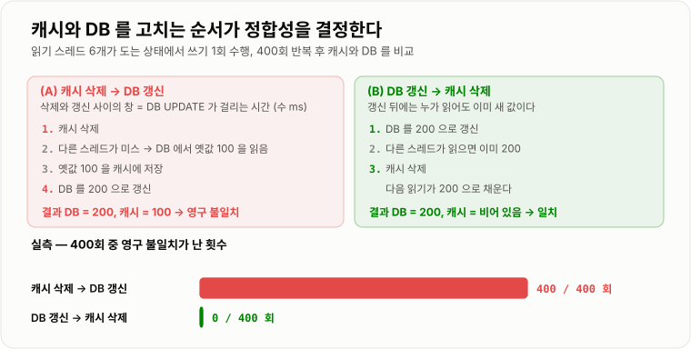
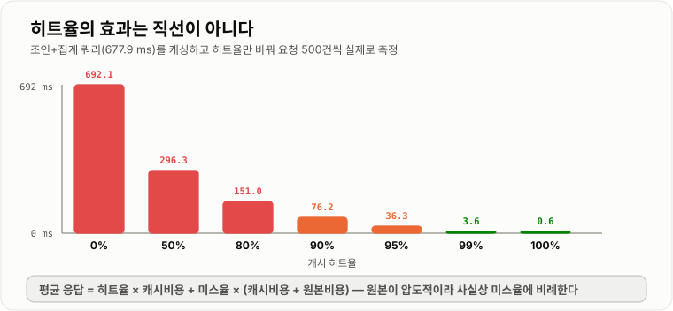

# 캐시 전략과 정합성

> **캐시는 "느린 것을 빠르게" 만드는 장치가 아니라 "같은 답을 두 곳에 두는" 장치다. 두 곳에 두는 순간 둘이 달라질 수 있고, 캐시 설계의 거의 전부는 그 어긋남을 어디까지 허용할지 정하는 일이다.**

---

## 1. 핵심 요약

**캐시는 원본과 사본을 함께 두는 대가로 속도를 얻는다. 그래서 "얼마나 빨라지는가"는 히트율이 정하고, "얼마나 위험한가"는 원본과 사본을 갱신하는 순서가 정한다.**

### 한눈에 보기

* 캐시는 **같은 답을 더 가까운 곳에 하나 더 두는 것**이다. 원본은 그대로 있고, 사본이 하나 생긴다. **문제도 전부 여기서 나온다.**
* 실측한 조회 지연 차이다. 프로세스 안 로컬 캐시 **0.149 µs**, Redis **540 µs**, DB 단건 PK 조회 **54.3 µs**, DB 조인+집계(주문 30만 건) **677.9 ms**.
* **여기서 중요한 것은 "DB가 느리다"가 아니다.** DB 단건 조회(54.3 µs)는 오히려 원격 Redis(540 µs)보다 빨랐다. **캐시가 값어치를 하는 곳은 단건 조회가 아니라 무거운 계산과 원격 호출이다.** 조인+집계 677.9 ms는 Redis보다 1,254배 느렸다.
* **히트율의 효과는 직선이 아니다.** 같은 워크로드에서 평균 응답이 히트율 80%일 때 151 ms, 90%일 때 76 ms, **95%일 때 36 ms, 99%일 때 3.6 ms**였다. 80 → 90은 2배 좋아지는데 **95 → 99는 10배** 좋아진다.
* 뒤집으면 **히트율이 조금만 떨어져도 응답이 급격히 나빠진다.** 99%에서 95%로 4%p만 떨어져도 3.6 ms가 36 ms가 됐다.
* **읽기 전략은 Cache-Aside가 사실상 표준이다.** 애플리케이션이 캐시를 먼저 보고, 없으면 원본에서 읽어 캐시에 넣는다.
* **쓰기에서 갈린다.** 캐시를 지울 것인가 갱신할 것인가, 그리고 **원본과 캐시 중 무엇을 먼저 건드릴 것인가**가 정합성을 결정한다.
* 실측으로 확인했다. 동시 부하에서 **"캐시 삭제 → DB 갱신" 순서는 400회 중 400회 영구 불일치**가 났고, **"DB 갱신 → 캐시 삭제" 순서는 400회 중 0회**였다.
* **순서를 바꾸는 것만으로 대부분의 불일치가 사라진다.** 코드 두 줄의 순서다.
* TTL은 정합성의 마지막 안전망이다. 다만 공짜가 아니다. 실측에서 TTL을 걸면 키당 메모리가 **82.3 B → 117.2 B(+42.4%)** 로 늘었다.
* **Redis의 기본 `maxmemory-policy`는 `noeviction`이다.** 캐시로 쓰면서 그대로 두면 메모리가 차는 순간 오래된 키를 버리는 게 아니라 **캐시 갱신이 통째로 실패한다.**

> 이 노트의 수치는 **Redis 7.4.10 (docker `redis:7.4-alpine`)**, **H2 2.2.224 파일 모드**, **JDK 21.0.11**에서 직접 측정했다. Redis 왕복 540 µs에는 **Windows 호스트에서 Docker 포트 포워딩을 거치는 비용이 포함**돼 있다. Redis 서버가 직접 잰 `GET` 처리 시간은 5.2 µs이고, 컨테이너 안에서 잰 왕복은 66 µs다. **실제 서비스에서 같은 가용 영역의 Redis 왕복이 대략 0.2~1 ms이므로 540 µs는 현실적인 범위 안에 있다.**

### 무엇을 해결하는가

#### 해결하려는 문제

상품 목록 화면이 있다. 화면 하나를 그리려면 이런 쿼리가 돈다.

```sql
SELECT u.grade, COUNT(*), SUM(o.amount)
  FROM orders o JOIN users u ON u.id = o.user_id
 WHERE o.status = 'PAID' AND o.amount > 1000
 GROUP BY u.grade;
```

주문 30만 건에서 이 쿼리를 실측하니 **677.9 ms**였다. 그리고 이 화면은 **모든 사용자에게 똑같은 결과**를 보여준다.

```text
초당 100명이 이 화면을 본다
   ↓
같은 쿼리가 초당 100번 돈다
   ↓
매번 30만 건을 다시 훑는다
   ↓
DB CPU 가 100% 가 되고, 커넥션 풀이 마르고, 무관한 API 까지 느려진다
```

**같은 답을 100번 다시 계산하고 있다.** 캐시는 그 답을 한 번만 만들고 나머지 99번은 꺼내 쓰자는 것이다.

#### 이 개념이 없을 때

캐시 없이 이 문제를 풀려면 이런 선택지밖에 없다.

```java
// 방법 1 — 인덱스와 쿼리 튜닝. 가장 먼저 해야 하지만 한계가 있다
//   집계 자체가 30만 건을 봐야 하는 일이면 인덱스로 없앨 수 없다

// 방법 2 — 집계 결과를 테이블에 미리 넣어 둔다 (요약 테이블)
@Scheduled(cron = "0 */5 * * * *")
public void refreshSummary() {
    summaryRepository.deleteAll();
    summaryRepository.insertFromOrders();     // 5분마다 다시 만든다
}
// → 결국 캐시다. 다만 저장소가 DB 라서 조회가 여전히 DB 를 친다

// 방법 3 — DB 를 증설한다
//   읽기 복제본을 늘린다. 돈이 들고, 같은 계산을 여러 서버가 반복하는 것은 그대로다

// 방법 4 — 애플리케이션 메모리에 담아 둔다
private static Map<String, Report> cache = new HashMap<>();   // 서버마다 따로 논다
//   서버가 3대면 캐시도 3벌이고, 만료도 3벌이고, 갱신하면 3벌이 따로 낡는다
```

**방법 2와 4는 이미 캐시다.** 다만 손으로 만든 캐시라서 만료·축출·정합성을 전부 직접 처리해야 한다.

Redis 같은 캐시 저장소를 쓰면 이 셋이 딸려 온다.

```java
@Cacheable(value = "gradeReport", key = "#minAmount")
public List<GradeReport> report(int minAmount) {
    return orderRepository.aggregateByGrade(minAmount);   // 미스일 때만 실행된다
}
```

* **만료(TTL)** 가 저장소에 내장돼 있다.
* **축출(eviction)** 정책이 있어 메모리가 차면 알아서 버린다.
* **서버가 몇 대든 캐시는 한 벌**이다.

---

## 2. 동작 원리

### 핵심 구성 요소

| 용어 | 뜻 | 왜 중요한가 |
| --- | --- | --- |
| **히트 / 미스** | 캐시에 있음 / 없음 | 성능의 거의 전부를 결정한다 |
| **히트율** | 히트 ÷ 전체 요청 | 실측에서 95%와 99%가 **10배** 차이였다 |
| **원본 (Origin)** | 진짜 데이터가 있는 곳 (DB, 외부 API) | 캐시가 틀리면 여기가 기준이다 |
| **TTL** | 캐시 값의 수명 | **정합성의 마지막 안전망** |
| **무효화 (Invalidation)** | 캐시 값을 지우는 것 | 갱신보다 안전하다 |
| **축출 (Eviction)** | 메모리가 차서 밀어내는 것 | TTL과 다르다. **수명이 남아도 밀려난다** |
| **stale (낡은 값)** | 원본과 다른 캐시 값 | 잠깐 낡는 것과 **영원히 낡는 것**은 완전히 다르다 |
| **캐시 계층** | 로컬 캐시 / 분산 캐시 | 속도와 일관성의 맞바꿈 |
| **Cache-Aside** | 애플리케이션이 캐시를 직접 다루는 방식 | **사실상 표준** |
| **Cache Stampede** | 캐시가 비는 순간 요청이 원본으로 몰리는 현상 | 별도 노트에서 다룬다 |

### 내부 동작 과정

#### 읽기 전략 — Cache-Aside가 하는 일

```text
읽기 요청
   │
   ▼
캐시에 있나? ──── 있다(히트) ────▶ 그대로 반환                      실측 540 us
   │
  없다(미스)
   │
   ▼
원본에서 읽는다                                                   실측 677.9 ms
   │
   ▼
캐시에 넣는다 (TTL 과 함께)
   │
   ▼
반환
```

**"애플리케이션이 캐시를 직접 다룬다"가 Cache-Aside의 정의다.** 캐시가 죽어도 원본을 직접 읽으면 되므로 서비스가 계속 돌아간다. 대신 이 코드를 개발자가 매번 써야 한다(그래서 Spring은 `@Cacheable`로 감싼다).

#### 읽기 전략 세 가지 비교

```text
Cache-Aside (Look-Aside)          Read-Through
  앱 → 캐시 (미스)                  앱 → 캐시
  앱 → DB                                 캐시 → DB   (캐시가 알아서 읽어 온다)
  앱 → 캐시에 저장                        캐시가 저장
  ────────────────────────          ────────────────────────
  캐시가 죽어도 서비스 가능           캐시가 죽으면 조회 자체가 막힌다
  코드를 직접 써야 한다               코드가 단순하다 (라이브러리·캐시가 처리)
```

**Redis는 Read-Through를 스스로 지원하지 않는다.** Spring의 `@Cacheable`은 겉보기엔 Read-Through처럼 보이지만, 실제로는 프록시가 Cache-Aside 코드를 대신 써 주는 것이다.

#### 쓰기 전략 — 여기가 진짜 갈림길이다

```text
Write-Through          쓸 때 캐시와 DB 를 함께 쓴다 (동기)
   앱 → 캐시 → DB       캐시가 항상 최신. 대신 쓰기가 느려진다

Write-Around           쓸 때는 DB 만. 캐시는 건드리지 않는다
   앱 → DB              캐시는 TTL 로만 갱신된다. 낡은 값을 TTL 만큼 본다

Write-Back (Write-Behind)  쓸 때 캐시만. DB 는 나중에 몰아서
   앱 → 캐시 ⇢ (나중에) DB   쓰기가 매우 빠르다. 대신 장애 시 유실된다

무효화 (Invalidate)     쓸 때 DB 에 쓰고 캐시는 지운다
   앱 → DB, 캐시 삭제    다음 읽기가 새로 채운다.  ← 실무에서 가장 많이 쓴다
```

**실무에서 가장 흔한 조합은 "Cache-Aside 읽기 + 무효화 쓰기"다.** 이유는 다음 절에서 실측으로 확인한다.

#### 왜 "갱신"이 아니라 "삭제"인가

캐시를 새 값으로 갱신(`SET`)하면 될 것 같지만, 삭제(`DEL`)가 더 안전하다.

```text
갱신 방식 — 두 쓰기가 동시에 오면 순서가 뒤집힐 수 있다

  스레드 A: DB 를 100 으로 갱신
  스레드 B: DB 를 200 으로 갱신
  스레드 B: 캐시를 200 으로 갱신
  스레드 A: 캐시를 100 으로 갱신    ← 뒤늦게 도착. 캐시에 100 이 남는다

  DB = 200, 캐시 = 100  →  영구 불일치


삭제 방식 — 순서가 뒤집혀도 결과가 같다

  스레드 A: DB 를 100 으로 갱신, 캐시 삭제
  스레드 B: DB 를 200 으로 갱신, 캐시 삭제
  → 캐시는 비어 있고, 다음 읽기가 DB 에서 200 을 읽어 온다
```

**삭제는 순서를 타지 않는다(멱등적이다).** 그리고 안 읽힐 값을 미리 계산하는 낭비도 없앤다.

#### 순서 — 실측으로 확인한 것

같은 "삭제 방식"이라도 **DB를 먼저 고칠지, 캐시를 먼저 지울지**에 따라 결과가 완전히 달랐다.

먼저 결정적으로 재현했다.

```text
(A) 캐시 삭제 → DB 갱신,  그 사이에 다른 스레드가 읽으면

    1. 캐시 삭제
    2. [다른 스레드] 미스 → DB 에서 옛값 100 을 읽음
    3. [다른 스레드] 캐시에 100 저장
    4. DB 를 200 으로 갱신
    결과: DB = 200, 캐시 = 100      영구 불일치


(B) DB 갱신 → 캐시 삭제,  그 사이에 다른 스레드가 읽으면

    1. DB 를 200 으로 갱신
    2. [다른 스레드] 읽으면 이미 200
    3. 캐시 삭제
    결과: DB = 200, 캐시 = 비어 있음  다음 읽기가 200 을 채운다
```

**(A)의 창은 "DB `UPDATE`가 걸리는 시간"이다.** 수 밀리초짜리 창이 매 쓰기마다 열린다. 그동안 읽기가 하나라도 들어오면 옛 값이 박제된다.

이 차이를 실제 동시 부하에서 400회씩 측정했다.

```text
읽기 스레드 6개가 계속 도는 상태에서 쓰기를 한 번 수행하고,
모두 멈춘 뒤 캐시 값이 DB 와 다른지 확인 — 400회 반복

  캐시 삭제 → DB 갱신    400 / 400 회 불일치      (100%)
  DB 갱신 → 캐시 삭제      0 / 400 회 불일치      (0%)
```



*순서를 바꾸는 것만으로 400/400이 0/400이 됐다. 코드 두 줄의 순서다.*

#### (B)도 완벽하지는 않다

`DB 갱신 → 캐시 삭제`도 깨지는 인터리빙이 있다. 다만 **창이 훨씬 좁다.**

```text
(B') 읽기가 쓰기보다 먼저 시작한 경우

  1. [읽기] 캐시 미스 → DB 에서 100 을 읽음
  2. [쓰기] DB 를 200 으로 갱신
  3. [쓰기] 캐시 삭제 (비어 있어 아무 효과 없음)
  4. [읽기] 뒤늦게 캐시에 100 저장
  결과: DB = 200, 캐시 = 100      영구 불일치
```

**이 창은 "읽기 스레드가 DB에서 읽은 뒤 캐시에 넣기까지의 간격"이다.** 보통 수십 µs이고, 그 짧은 사이에 쓰기 전체가 통째로 끼어들어야 한다. 실측에서 400회 중 0회가 나온 이유다.

**완전히 없애려면 TTL이나 지연 이중 삭제가 필요하다.** 다만 대부분의 서비스는 이 확률을 TTL로 덮는 선택을 한다.

```text
지연 이중 삭제 (delayed double delete)

  DB 갱신 → 캐시 삭제 → (0.5초 뒤) 캐시 한 번 더 삭제
                          ↑ 그 사이에 누가 옛 값을 넣었어도 지워진다
```

#### TTL이 하는 진짜 역할

TTL은 "오래된 값을 버리는 장치"이기도 하지만, 실무에서 더 중요한 역할은 **버그의 수명을 제한하는 것**이다.

```text
TTL 이 없으면          잘못 들어간 값이 영원히 남는다
TTL 이 5분이면         어떤 실수를 해도 5분 뒤에는 저절로 고쳐진다
```

**"무효화 로직에 구멍이 있어도 TTL이 덮는다."** 그래서 정합성이 중요한 캐시일수록 TTL을 짧게 잡는다.

TTL은 공짜가 아니다. 실측한 메모리 비용이다.

```text
10만 개 키를 Redis 에 넣고 used_memory 증가분을 측정

  TTL 없이           8,233,200 B     키당  82.3 B
  TTL 300초          11,720,144 B     키당 117.2 B     +42.4%
```

**TTL이 걸린 키는 별도 사전(`expires`)에 한 번 더 등록되기 때문이다.**

#### 캐시 계층 — 로컬과 분산

```text
              속도            일관성            용량
로컬 캐시   0.149 us        서버마다 다르다     JVM 힙
(Caffeine)          → 최대 TTL 만큼 어긋남

분산 캐시   540 us          모든 서버가 같다    Redis 메모리
(Redis)
```

**로컬 캐시는 3,600배 빠르지만 서버마다 따로 논다.** 서버가 3대면 사본이 3벌이고, 하나를 무효화해도 나머지 2벌은 그대로다.

다계층 캐시는 둘을 겹쳐 쓴다.

```text
요청 → L1 로컬 캐시 (0.149 us, TTL 10초)
         └ 미스 → L2 Redis (540 us, TTL 5분)
                    └ 미스 → DB (677.9 ms)
```

**L1의 TTL을 아주 짧게 잡는 것이 요령이다.** 10초짜리 TTL이면 서버 간 어긋남도 최대 10초로 묶인다. 그러면서 대부분의 요청은 0.149 µs에 끝난다.

#### 축출 — TTL과 다르다

```text
TTL     "수명이 다해서" 사라진다      내가 정한 것
축출    "자리가 없어서" 밀려난다      내가 정하지 않은 것
```

실측한 Redis 기본 설정이다.

```text
maxmemory        0            제한 없음
maxmemory-policy noeviction   가득 차면 쓰기 명령이 실패한다
```

**기본값이 `noeviction`이라는 점이 중요하다.** 캐시로 쓰면서 이대로 두면, 메모리가 차는 순간 오래된 키를 버리는 게 아니라 새 값을 넣는 것 자체가 실패한다.

```text
maxmemory 4gb
maxmemory-policy allkeys-lru    캐시라면 이것
```

---

## 3. 특징과 비교

| 구분          | 내용 |
| ----------- | -- |
| **장점**      | 무거운 계산을 한 번만 하고 재사용한다. 실측에서 조인+집계 677.9 ms가 캐시 히트 540 µs가 됐고, 히트율 99%에서 평균 응답이 692 ms → 3.6 ms(194배)로 줄었다. 원본 부하를 히트율만큼 덜어내 DB 증설을 미룰 수 있다. |
| **단점**      | 원본과 사본이 어긋난다. 갱신 순서를 잘못 잡으면 **영구 불일치가 100% 발생**했다(400/400). 메모리 비용이 들고(TTL 포함 키당 117.2 B), 히트율이 떨어지면 캐시 왕복이 순수 낭비가 되며, 캐시가 비는 순간 원본이 몰매를 맞는다. |
| **적합한 상황**  | **읽기가 압도적으로 많고, 계산이 무겁고, 잠깐 낡아도 되는 데이터.** 상품 목록·통계·랭킹·설정값·외부 API 응답. 같은 답을 여러 사용자가 공유할수록 이득이 커진다. |
| **주의할 상황**  | **읽은 값으로 "된다/안 된다"를 판단해 쓰기까지 하는 로직**(재고·잔액·한도). 사용자마다 값이 달라 재사용되지 않는 데이터. 원본 조회가 이미 충분히 빠른 단건 PK 조회(54.3 µs로 Redis 왕복보다 빨랐다). |

### 성능 특성

#### 어디서 읽느냐에 따른 지연

```text
로컬 캐시 (프로세스 안 HashMap)       0.149 us
Redis GET (TCP 왕복 포함)           540.422 us      로컬 대비 3,637배
DB 단건 PK 조회                      54.301 us      Redis 대비 0.10배  ← Redis 보다 빠르다
DB 조인+집계 (주문 30만 건)         677,904 us      Redis 대비 1,254배
```

**세 번째 줄이 이 노트에서 가장 중요한 수치다.** 단건 PK 조회는 Redis 왕복보다 빨랐다. **"DB보다 Redis가 빠르다"는 무조건 참이 아니다.**

```text
캐시가 이득인 경우      원본 비용 > 캐시 왕복 비용
   조인·집계 677.9 ms  vs  0.54 ms      →  1,254배 이득
   외부 API 200 ms     vs  0.54 ms      →   370배 이득

캐시가 손해인 경우      원본 비용 < 캐시 왕복 비용
   단건 PK 0.054 ms   vs  0.54 ms      →  10배 손해
```

#### 히트율이 평균 응답에 미치는 영향

조인+집계 쿼리(677.9 ms)를 캐싱하고, 히트율만 바꿔 가며 500건씩 실제로 섞어 측정했다.

```text
히트율     평균 응답        히트율 0% 대비
  0%      692.059 ms          1.0배
 50%      296.336 ms          2.3배
 80%      150.987 ms          4.6배
 90%       76.233 ms          9.1배
 95%       36.252 ms         19.1배
 99%        3.562 ms        194.3배
100%        0.605 ms      1,143.5배
```



*90%에서 95%로 올리는 것보다 95%에서 99%로 올리는 것이 훨씬 큰 이득이다. 미스가 전부를 지배하기 때문이다.*

**왜 직선이 아닌가.** 평균 응답은 `히트율 × 캐시비용 + 미스율 × (캐시비용 + 원본비용)`이고, 원본 비용이 압도적으로 크므로 **평균은 사실상 미스율에 비례한다.** 미스율이 5%에서 1%로 줄면 5분의 1이 된다.

여기서 실무적으로 중요한 결론이 나온다.

```text
히트율 99% → 95%   4%p 만 떨어져도 응답이 3.6 ms → 36 ms (10배)
```

**히트율은 성능 지표가 아니라 장애 지표다.** 캐시 서버를 재시작하거나 배포로 캐시가 비면 히트율이 0%가 되고, 그 순간 응답이 692 ms가 된다. 이것이 [Cache Stampede](../Cache-Stampede/Cache-Stampede.md)의 출발점이다.

#### 정합성 — 순서에 따른 불일치 발생률

```text
읽기 스레드 6개가 도는 상태에서 쓰기 1회, 400회 반복

  캐시 삭제 → DB 갱신     400 / 400 회 영구 불일치    100%
  DB 갱신 → 캐시 삭제       0 / 400 회 영구 불일치      0%
```

#### TTL의 메모리 비용

```text
키 10만 개, Redis 7.4.10

  TTL 없음      8,233,200 B     키당  82.3 B
  TTL 300초    11,720,144 B     키당 117.2 B     +42.4%
```

### 장점과 단점

#### 장점

| 장점 | 근거 |
| --- | --- |
| **무거운 계산을 한 번만 한다** | 677.9 ms 쿼리가 캐시 히트 540 µs가 된다 (1,254배) |
| **원본 부하가 히트율만큼 줄어든다** | 히트율 95%면 DB 요청이 20분의 1이 된다 |
| **응답 시간의 꼬리가 짧아진다** | 히트율 99%에서 평균 3.6 ms (0%일 때 692 ms) |
| **DB 증설을 미룰 수 있다** | 읽기 부하를 메모리로 흡수한다 |
| **TTL·축출이 저장소에 내장돼 있다** | 직접 만든 `HashMap` 캐시가 늘 겪는 문제를 안 겪는다 |
| **서버가 몇 대든 사본은 한 벌** | 분산 캐시일 때. 로컬 캐시는 서버 수만큼 사본이 생긴다 |

#### 단점

| 단점 | 근거 |
| --- | --- |
| **원본과 어긋난다** | 갱신 순서를 잘못 잡으면 실측 100% 불일치 |
| **어긋남이 영구적일 수 있다** | 잘못 채워진 값은 TTL이 없으면 영원히 남는다 |
| **미스일 때는 오히려 느리다** | 캐시 왕복(540 µs)이 그냥 추가된다 |
| **원본이 빠르면 손해다** | 단건 PK 54.3 µs < Redis 왕복 540 µs |
| **메모리 비용이 든다** | 키당 82.3 B, TTL 포함 117.2 B |
| **히트율이 떨어지면 급격히 나빠진다** | 99% → 95%에서 3.6 ms → 36 ms |
| **캐시가 비는 순간이 위험하다** | 요청이 전부 원본으로 몰린다 (별도 노트) |
| **디버깅이 어려워진다** | "그 서버만 이상해요"의 상당수가 로컬 캐시다 |

### 어떤 상황에서 고르는가

#### 캐시를 붙일지 판단하는 순서

```text
1) 이 조회가 정말 느린가?
      아니오 → 캐시를 붙이지 않는다 (단건 PK 54 µs는 캐시가 손해다)
      예 ↓

2) 인덱스·쿼리로 먼저 고칠 수 있는가?
      예 → 그것부터 한다. 캐시는 느린 쿼리를 감출 뿐 없애지 않는다
      아니오 ↓

3) 같은 답을 여러 요청이 공유하는가?
      아니오 → 이득이 작다 (사용자별 데이터는 히트율이 안 오른다)
      예 ↓

4) 잠깐 낡아도 되는가?
      아니오 → 캐시하지 않거나, 쓰기 시 반드시 무효화하고 TTL을 아주 짧게
      예 ↓

5) 캐시한다.  전략: Cache-Aside 읽기 + "DB 갱신 → 캐시 삭제" 쓰기 + TTL
```

#### 데이터별 판단

| 데이터 | 캐시 | TTL | 이유 |
| --- | --- | --- | --- |
| 상품 목록·상세 | **적합** | 5~10분 | 모두가 같은 값을 본다. 잠깐 낡아도 된다 |
| 카테고리·설정값 | **매우 적합** | 1시간+ | 거의 안 바뀌고 모두가 읽는다 |
| 통계·리포트 | **매우 적합** | 5~30분 | 계산이 무겁고 실시간일 필요가 없다 |
| 외부 API 응답 | **적합** | API 정책에 맞춰 | 호출 비용·요금이 크다 |
| 세션 | 적합 | 30분 | 캐시가 아니라 저장소로 쓰는 경우 |
| 사용자별 마이페이지 | 조건부 | 1~5분 | 재사용이 안 돼 히트율이 안 오른다 |
| **재고 수량** | **부적합** | — | 읽은 값으로 판단해 쓰기까지 한다 |
| **잔액·포인트** | **부적합** | — | 같은 이유. 원자적 갱신으로 처리한다 |
| **결제 상태** | **부적합** | — | 낡은 값이 곧 사고다 |

**규칙은 하나다. "읽은 값으로 된다/안 된다를 판단해서 쓰기까지 한다면 캐시를 믿으면 안 된다."** 이것은 [MVCC](../../07-트랜잭션-데이터접근/MVCC/MVCC.md)에서 스냅숏을 믿으면 안 되는 이유와 정확히 같다.

#### TTL을 얼마로 잡는가

| 기준 | TTL | 근거 |
| --- | --- | --- |
| 원본이 바뀌는 주기보다 짧게 | — | 안 그러면 늘 낡은 값을 본다 |
| 무효화 로직이 있으면 길게 | 10분~1시간 | TTL은 안전망 역할만 |
| 무효화 로직이 없으면 짧게 | 10초~1분 | TTL이 유일한 갱신 수단이다 |
| 정합성이 중요할수록 짧게 | 5~30초 | 어긋남의 최대 지속 시간이다 |
| 키가 많으면 지터를 준다 | 기본값 ± 10~20% | 동시 만료를 피한다 (별도 노트) |

### 비슷한 기술과 비교

#### 읽기 전략 — Cache-Aside vs Read-Through

| 기준 | Cache-Aside | Read-Through |
| --- | --- | --- |
| 미스 처리 주체 | **애플리케이션** | **캐시(라이브러리)** |
| 캐시 장애 시 | **원본을 직접 읽어 계속 동작** | 조회 경로가 막힐 수 있다 |
| 코드량 | 많다 (`@Cacheable`로 감춘다) | 적다 |
| 캐시할 형태 선택 | **자유롭다** | 캐시 계층에 맞춰야 한다 |
| Redis 지원 | **사실상 이것만** | Redis 자체 기능은 없다 |

#### 쓰기 전략 비교

| 기준 | Write-Through | Write-Around | Write-Back | **무효화(삭제)** |
| --- | --- | --- | --- | --- |
| 쓸 때 하는 일 | 캐시 + DB 동기 | DB만 | 캐시만 (DB는 나중) | DB + 캐시 삭제 |
| 쓰기 지연 | **느리다** | 빠르다 | **가장 빠르다** | 빠르다 |
| 쓰기 직후 읽기 | **히트** | 미스(또는 낡은 값) | 히트 | 미스 |
| 유실 위험 | 없다 | 없다 | **있다 (미반영분)** | 없다 |
| 안 읽힐 값 계산 | **한다 (낭비)** | 안 한다 | 한다 | 안 한다 |
| 두 쓰기의 순서 뒤집힘 | **취약** | 해당 없음 | 취약 | **안전 (멱등)** |
| 실무 빈도 | 보통 | 보통 | 드물다 | **가장 흔하다** |

**Write-Back은 쓰기가 극단적으로 많고 유실을 감수할 수 있을 때만 쓴다.** 조회수 카운터가 대표적이다.

#### 캐시 계층 — 로컬 vs 분산

| 기준 | 로컬 캐시 (Caffeine) | 분산 캐시 (Redis) |
| --- | --- | --- |
| 조회 지연 | **0.149 µs** | 540 µs |
| 네트워크 | 없다 | 있다 |
| 서버 간 일관성 | **없다 (사본이 서버 수만큼)** | **있다 (한 벌)** |
| 무효화 | 어렵다 (전파가 필요) | 쉽다 (`DEL` 한 번) |
| 용량 | JVM 힙 (GC 영향) | Redis 메모리 |
| 재시작 시 | 사라진다 | 남는다 |
| 쓸 곳 | **거의 안 바뀌는 소량 데이터** | **공유해야 하는 대부분** |

**로컬 캐시의 무효화가 어렵다는 점이 핵심이다.** Pub/Sub으로 전파하거나, 아예 TTL을 짧게 잡아 어긋남의 상한을 정하는 쪽이 단순하다.

#### 캐시 vs 읽기 복제본 vs 요약 테이블

| 기준 | 캐시 | 읽기 복제본 | 요약 테이블 |
| --- | --- | --- | --- |
| 해결하는 문제 | **같은 계산의 반복** | **읽기 물량** | **집계 비용** |
| 신선도 | TTL만큼 과거 | 복제 지연만큼 과거 | 배치 주기만큼 과거 |
| 저장 위치 | 메모리 | 디스크(다른 서버) | 디스크(같은 DB) |
| 조회 지연 | **540 µs** | DB와 같은 수준 | DB와 같은 수준 |
| 복잡한 조회 | 못 한다 | **된다** | **된다** |
| 함께 쓰나 | **함께 쓴다** | 함께 쓴다 | 함께 쓴다 |

**셋은 대체재가 아니다.** 캐시는 "같은 답의 재계산"을, 복제본은 "읽기 물량"을, 요약 테이블은 "집계 자체의 비용"을 줄인다.

---

## 4. 실무 주의사항

### 백엔드 실무 적용

#### Spring · Java — 순서를 지키는 무효화

```java
@Service
public class ProductService {

    private final ProductRepository productRepository;
    private final StringRedisTemplate redis;

    public ProductService(ProductRepository productRepository, StringRedisTemplate redis) {
        this.productRepository = productRepository;
        this.redis = redis;
    }

    /** 읽기 — Cache-Aside */
    public Product find(long id) {
        String key = "product:" + id;
        String cached = redis.opsForValue().get(key);
        if (cached != null) {
            return deserialize(cached);
        }
        Product product = productRepository.findById(id).orElseThrow();
        redis.opsForValue().set(key, serialize(product), Duration.ofMinutes(10));
        return product;
    }

    /** 쓰기 — DB 를 먼저 고치고 캐시를 지운다. 순서가 중요하다 */
    @Transactional
    public void updatePrice(long id, int price) {
        productRepository.updatePrice(id, price);         // 1. DB 먼저
        redis.delete("product:" + id);                     // 2. 캐시 삭제
    }
}
```

**반대로 쓰면(캐시 삭제 → DB 갱신) 실측에서 400회 중 400회 불일치가 났다.**

#### 트랜잭션 커밋 뒤에 무효화한다

위 코드에는 함정이 하나 더 있다. **`@Transactional` 안에서 캐시를 지우면, 커밋 전에 지워진다.**

```text
트랜잭션 안에서 캐시 삭제

  1. DB UPDATE (아직 커밋 전 — 남에게 안 보인다)
  2. 캐시 삭제
  3. [다른 요청] 미스 → DB 에서 읽는데 아직 옛 값!  → 옛 값을 캐시에 저장
  4. 커밋
  결과: DB 는 새 값, 캐시는 옛 값        영구 불일치

  게다가 롤백되면 멀쩡한 캐시만 날린 셈이 된다
```

```java
@Service
public class ProductService {

    /** 커밋이 끝난 뒤에 캐시를 지운다 */
    @Transactional
    public void updatePrice(long id, int price) {
        productRepository.updatePrice(id, price);
        TransactionSynchronizationManager.registerSynchronization(
                new TransactionSynchronization() {
                    @Override
                    public void afterCommit() {
                        redis.delete("product:" + id);
                    }
                });
    }
}
```

Spring 이벤트를 쓰면 더 읽기 좋다.

```java
@Transactional
public void updatePrice(long id, int price) {
    productRepository.updatePrice(id, price);
    eventPublisher.publishEvent(new PriceChanged(id));
}

@Component
public class CacheInvalidator {

    private final StringRedisTemplate redis;

    public CacheInvalidator(StringRedisTemplate redis) {
        this.redis = redis;
    }

    @TransactionalEventListener(phase = TransactionPhase.AFTER_COMMIT)
    public void on(PriceChanged event) {
        redis.delete("product:" + event.getProductId());
    }
}
```

#### `@Cacheable`을 쓸 때의 주의점

```java
@Service
public class ReportService {

    @Cacheable(value = "gradeReport", key = "#minAmount")
    public List<GradeReport> report(int minAmount) {
        return orderRepository.aggregateByGrade(minAmount);
    }

    @CacheEvict(value = "gradeReport", allEntries = true)
    public void onOrderChanged() {
        // 주문이 바뀌면 집계 캐시를 통째로 비운다
    }
}
```

주의할 것이 셋이다.

* **`@Cacheable`은 같은 클래스 안에서 호출하면 동작하지 않는다.** 프록시를 거치지 않기 때문이다. `this.report(...)`는 캐시를 타지 않는다.
* **TTL은 애너테이션이 아니라 `CacheManager` 설정에 둔다.**
* **`@CacheEvict(beforeInvocation = false)`가 기본이라 메서드가 성공한 뒤에 지운다.** 예외가 나면 안 지워진다. 이것이 대개는 맞다.

```java
@Bean
public CacheManager cacheManager(RedisConnectionFactory factory) {
    RedisCacheConfiguration base = RedisCacheConfiguration.defaultCacheConfig()
            .entryTtl(Duration.ofMinutes(10))
            .disableCachingNullValues();          // null 캐싱 여부는 신중히 정한다

    Map<String, RedisCacheConfiguration> perCache = new HashMap<String, RedisCacheConfiguration>();
    perCache.put("gradeReport", base.entryTtl(Duration.ofMinutes(5)));
    perCache.put("category", base.entryTtl(Duration.ofHours(1)));

    return RedisCacheManager.builder(factory)
            .cacheDefaults(base)
            .withInitialCacheConfigurations(perCache)
            .build();
}
```

> **`disableCachingNullValues()`는 양날의 검이다.** 없는 데이터를 캐시하지 않으면 메모리를 아끼지만, **없는 키를 계속 조회하는 요청이 매번 DB로 간다**(캐시 관통, Cache Penetration). 존재하지 않는 ID로 공격받으면 그대로 DB 부하가 된다. 이때는 **짧은 TTL(30초~1분)로 "없음"을 캐시**하거나 블룸 필터를 앞에 둔다.

#### 캐시 장애가 서비스 장애가 되지 않게 한다

```java
public Product find(long id) {
    String key = "product:" + id;
    try {
        String cached = redis.opsForValue().get(key);
        if (cached != null) {
            return deserialize(cached);
        }
    } catch (RuntimeException e) {
        log.warn("캐시 조회 실패, 원본으로 넘어간다. key={}", key, e);   // 삼키고 계속 간다
    }

    Product product = productRepository.findById(id).orElseThrow();
    try {
        redis.opsForValue().set(key, serialize(product), Duration.ofMinutes(10));
    } catch (RuntimeException e) {
        log.warn("캐시 저장 실패. key={}", key, e);
    }
    return product;
}
```

**Cache-Aside의 가장 큰 장점이 이것이다.** 캐시가 죽어도 원본을 직접 읽으면 된다. 다만 그 순간 DB 부하가 히트율만큼 늘어나므로(히트율 95%면 20배) **DB가 견딜 수 있는지 미리 계산해 둬야 한다.**

#### 히트율을 지표로 잡는다

```java
@Component
public class CacheMetrics {

    private final MeterRegistry registry;
    private final Counter hit;
    private final Counter miss;

    public CacheMetrics(MeterRegistry registry) {
        this.registry = registry;
        this.hit = Counter.builder("cache.access").tag("result", "hit").register(registry);
        this.miss = Counter.builder("cache.access").tag("result", "miss").register(registry);
    }

    public void recordHit() {
        hit.increment();
    }

    public void recordMiss() {
        miss.increment();
    }
}
```

```bash
# Redis 전체 히트율
redis-cli INFO stats | grep keyspace
#   keyspace_hits, keyspace_misses → hits / (hits + misses)
```

**실측에서 95%와 99%가 10배 차이였다.** 히트율은 "높으면 좋은 것"이 아니라 **떨어지면 즉시 알아야 하는 값**이다. 90% 밑으로 떨어지면 알람을 건다.

#### 메모리 정책을 반드시 설정한다

```text
# 실측한 기본값 — 캐시로 쓰면 안 되는 설정이다
maxmemory        0
maxmemory-policy noeviction

# 캐시로 쓸 때
maxmemory 4gb
maxmemory-policy allkeys-lru
```

**`noeviction`인 채로 메모리가 차면 `OOM command not allowed when used memory > 'maxmemory'` 가 뜬다.** 조회는 되는데 캐시 갱신만 전부 실패하므로, 증상이 "캐시가 안 먹는다"로 나타나 원인을 찾기 어렵다.

### 자주 하는 오해

| 잘못된 이해 | 올바른 이해 |
| --- | --- |
| "캐시를 붙이면 무조건 빨라진다" | 원본이 캐시 왕복보다 빠르면 **손해**다. 실측 단건 PK 54.3 µs vs Redis 540 µs. |
| "DB보다 Redis가 항상 빠르다" | 위와 같다. **네트워크 왕복이 있는 캐시는 인메모리 DB 조회보다 느릴 수 있다.** |
| "캐시를 지우고 DB를 고치면 안전하다" | 정반대다. 실측에서 그 순서가 **400회 중 400회 불일치**였다. |
| "DB를 고치고 캐시를 지우면 완벽하다" | 훨씬 낫지만 완벽하지 않다. 읽기가 먼저 시작한 경우(B')에 여전히 깨진다. **TTL이 최종 안전망이다.** |
| "캐시는 갱신(SET)하는 게 효율적이다" | 두 쓰기의 순서가 뒤집히면 옛 값이 박제된다. **삭제는 멱등이라 안전하다.** |
| "`@Transactional` 안에서 캐시를 지우면 된다" | **커밋 전에 지워져** 다른 요청이 옛 값을 다시 채운다. `AFTER_COMMIT`에 지운다. |
| "히트율 90%면 충분하다" | 실측 90% → 76 ms, 99% → 3.6 ms. **21배 차이**다. |
| "히트율은 성능 지표다" | **장애 지표에 가깝다.** 99%에서 95%로 4%p만 떨어져도 10배 느려진다. |
| "TTL만 걸면 정합성은 해결된다" | TTL은 **어긋남의 최대 지속 시간**을 정할 뿐이다. 그 시간 동안은 틀린 값을 준다. |
| "TTL은 공짜다" | 실측 키당 82.3 B → 117.2 B (**+42.4%**). |
| "메모리가 차면 오래된 키가 알아서 지워진다" | 기본 정책이 **`noeviction`**이라 **쓰기가 실패**한다. |
| "없는 데이터는 캐시하면 안 된다" | 그러면 **캐시 관통**이 생긴다. 짧은 TTL로 "없음"을 캐시하는 편이 나을 때가 많다. |
| "로컬 캐시가 Redis보다 나으니 다 로컬로" | 서버마다 사본이 따로 논다. **무효화가 전파되지 않는다.** |
| "캐시가 죽으면 캐시만 안 된다" | 히트율 95%였다면 **DB 요청이 20배**가 된다. 캐시 장애가 DB 장애로 번진다. |

---

## 5. 예제

### 순서를 지키는 Cache-Aside 전체 코드

```java
@Service
public class ArticleService {

    private static final Duration TTL = Duration.ofMinutes(10);

    private final ArticleRepository articleRepository;
    private final StringRedisTemplate redis;
    private final ObjectMapper mapper;

    public ArticleService(ArticleRepository articleRepository,
                          StringRedisTemplate redis,
                          ObjectMapper mapper) {
        this.articleRepository = articleRepository;
        this.redis = redis;
        this.mapper = mapper;
    }

    public Article find(long id) {
        String key = key(id);
        String cached = redis.opsForValue().get(key);
        if (cached != null) {
            return read(cached);
        }

        Article article = articleRepository.findById(id).orElseThrow();
        redis.opsForValue().set(key, write(article), TTL);
        return article;
    }

    @Transactional
    public void updateTitle(long id, String title) {
        Article article = articleRepository.findById(id).orElseThrow();
        article.changeTitle(title);
        // 캐시 삭제는 커밋 뒤에 (아래 리스너)
    }

    private String key(long id) {
        return "article:" + id;
    }

    private Article read(String json) {
        try {
            return mapper.readValue(json, Article.class);
        } catch (IOException e) {
            throw new IllegalStateException(e);
        }
    }

    private String write(Article article) {
        try {
            return mapper.writeValueAsString(article);
        } catch (IOException e) {
            throw new IllegalStateException(e);
        }
    }
}
```

### 지연 이중 삭제 — (B') 인터리빙까지 막고 싶을 때

```java
@Component
public class ArticleCacheInvalidator {

    private final StringRedisTemplate redis;
    private final TaskScheduler scheduler;

    public ArticleCacheInvalidator(StringRedisTemplate redis, TaskScheduler scheduler) {
        this.redis = redis;
        this.scheduler = scheduler;
    }

    @TransactionalEventListener(phase = TransactionPhase.AFTER_COMMIT)
    public void on(ArticleChanged event) {
        final String key = "article:" + event.getArticleId();
        redis.delete(key);                                    // 1차 삭제

        scheduler.schedule(new Runnable() {                    // 2차 삭제
            @Override
            public void run() {
                redis.delete(key);
            }
        }, Instant.now().plusMillis(500));
    }
}
```

**두 번째 삭제가 (B') 창에서 들어간 옛 값을 걷어낸다.** 대가는 0.5초 동안 미스가 한 번 더 생기는 것이다. 정합성이 중요한 소수의 키에만 쓴다.

### 다계층 캐시 — L1은 짧게, L2는 길게

```java
@Service
public class CategoryService {

    private final Cache<Long, Category> local;        // Caffeine
    private final StringRedisTemplate redis;
    private final CategoryRepository categoryRepository;

    public CategoryService(StringRedisTemplate redis, CategoryRepository categoryRepository) {
        this.redis = redis;
        this.categoryRepository = categoryRepository;
        this.local = Caffeine.newBuilder()
                .maximumSize(10_000)
                .expireAfterWrite(Duration.ofSeconds(10))     // 서버 간 어긋남의 상한
                .build();
    }

    public Category find(long id) {
        Category hit = local.getIfPresent(id);                // L1  실측 0.149 us
        if (hit != null) {
            return hit;
        }

        String cached = redis.opsForValue().get("category:" + id);   // L2  실측 540 us
        if (cached != null) {
            Category category = deserialize(cached);
            local.put(id, category);
            return category;
        }

        Category category = categoryRepository.findById(id).orElseThrow();   // 원본
        redis.opsForValue().set("category:" + id, serialize(category), Duration.ofHours(1));
        local.put(id, category);
        return category;
    }
}
```

**L1 TTL 10초가 이 설계의 핵심이다.** 다른 서버가 무효화해도 이 서버는 최대 10초 동안 옛 값을 본다. **그 10초를 감수할 수 있는 데이터에만 L1을 붙인다.**

### 캐시하면 안 되는 로직 — 재고 검사

```java
// 잘못된 예 — 캐시된 재고로 판단한다
public void order(long itemId) {
    Integer qty = (Integer) redis.opsForValue().get("stock:" + itemId);   // 낡은 값일 수 있다
    if (qty != null && qty > 0) {
        orderRepository.save(new Order(itemId));       // 실제로는 재고가 0일 수 있다
    }
}
```

```java
// 올바른 예 — 원자적 갱신으로 원본에서 판단한다
@Transactional
public void order(long itemId) {
    int affected = stockRepository.decreaseIfEnough(itemId);   // UPDATE ... WHERE qty > 0
    if (affected == 0) {
        throw new OutOfStockException(itemId);
    }
    orderRepository.save(new Order(itemId));
}
```

**"보여주기용 재고"는 캐시해도 되고, "판단용 재고"는 캐시하면 안 된다.** 화면에 "재고 3개 남음"을 캐시로 보여주는 것은 괜찮다. 그 값으로 주문을 승인하면 안 된다.

---

## 6. 면접 정리

### 자주 나오는 질문

#### 기본 질문

1. **캐시가 무엇이고 왜 쓰나요?**

    * 핵심 키워드: 같은 답을 더 가까운 곳에 하나 더 둠, 반복 계산 제거, 실측 677.9 ms → 540 µs

2. **Cache-Aside가 무엇인가요?**

    * 핵심 키워드: 앱이 캐시를 직접 다룸, 미스면 원본 읽고 캐시에 저장, **캐시가 죽어도 동작**

3. **쓰기 전략에는 무엇이 있나요?**

    * 핵심 키워드: Write-Through / Write-Around / Write-Back / **무효화(삭제)**, 실무는 무효화가 가장 흔함

4. **캐시를 갱신하지 않고 삭제하는 이유는요?**

    * 핵심 키워드: 삭제는 **멱등**이라 두 쓰기의 순서가 뒤집혀도 안전, 안 읽힐 값 계산 낭비 제거

5. **DB와 캐시 중 무엇을 먼저 고쳐야 하나요?**

    * 핵심 키워드: **DB 먼저 → 캐시 삭제**, 실측 반대 순서는 400회 중 400회 불일치

6. **TTL은 왜 거나요?**

    * 핵심 키워드: 어긋남의 **최대 지속 시간**을 정함, 무효화 로직의 구멍을 덮는 안전망

7. **히트율이 왜 중요한가요?**

    * 핵심 키워드: 평균 응답이 미스율에 비례, 실측 90% 76 ms vs 99% 3.6 ms(21배)

8. **로컬 캐시와 분산 캐시의 차이는요?**

    * 핵심 키워드: 0.149 µs vs 540 µs, **서버마다 사본 vs 한 벌**, 무효화 전파의 난이도

#### 꼬리 질문

1. **캐시를 붙였는데 오히려 느려졌습니다. 왜일까요?**

    * 핵심 키워드: 원본이 이미 빠름(단건 PK 54.3 µs < Redis 540 µs), 히트율이 낮음, 직렬화 비용

2. **"캐시 삭제 → DB 갱신" 순서가 왜 위험한가요?**

    * 핵심 키워드: 삭제와 갱신 **사이의 창**에 읽기가 들어와 옛 값을 박제, 창의 길이가 DB 갱신 시간

3. **"DB 갱신 → 캐시 삭제"는 완벽한가요?**

    * 핵심 키워드: 아니다. 읽기가 **더 먼저 시작**하면 여전히 깨짐, 창이 훨씬 좁음, TTL·지연 이중 삭제

4. **`@Transactional` 안에서 캐시를 지우면 어떤 문제가 있나요?**

    * 핵심 키워드: **커밋 전에 지워짐** → 다른 요청이 옛 값을 채움, 롤백 시 멀쩡한 캐시만 날림, `AFTER_COMMIT`

5. **캐시 관통(Cache Penetration)이 무엇인가요?**

    * 핵심 키워드: 없는 키를 계속 조회 → 매번 DB, "없음"을 짧은 TTL로 캐시하거나 블룸 필터

6. **Redis 메모리가 가득 차면 캐시는 어떻게 되나요?**

    * 핵심 키워드: 기본 `noeviction` → **쓰기 실패**, 캐시면 `allkeys-lru`로 바꿔야 함

7. **캐시 서버가 죽으면 어떻게 되나요?**

    * 핵심 키워드: Cache-Aside면 원본으로 계속 동작, 단 **DB 부하가 히트율의 역수만큼**(95%면 20배)

8. **로컬 캐시를 무효화하려면 어떻게 하나요?**

    * 핵심 키워드: Redis Pub/Sub 전파, 또는 **TTL을 아주 짧게 잡아 상한을 정함**

9. **어떤 데이터는 캐시하면 안 되나요?**

    * 핵심 키워드: 읽은 값으로 판단해 쓰기까지 하는 것(재고·잔액·한도), 사용자별로 재사용 안 되는 것

10. **캐시를 지웠는데 왜 여전히 옛 값이 보이나요?**

    * 핵심 키워드: 로컬 캐시(L1) 잔존, 트랜잭션 커밋 전 삭제, 키 규칙 불일치, 읽기 복제본 지연

### 30초 답변

> 캐시는 **같은 답을 더 가까운 곳에 하나 더 두는 것**입니다. 그래서 얻는 것은 속도고, 치르는 값은 **원본과 사본이 어긋날 수 있다는 것**입니다. 실무에서는 **Cache-Aside로 읽고, 쓸 때는 DB를 먼저 고친 뒤 캐시를 삭제**합니다. 순서를 반대로 하면 실측에서 **400회 중 400회 영구 불일치**가 났습니다.

#### 이어서 더 물으면

**먼저 캐시가 이득인지부터 봐야 합니다.** 조인+집계 쿼리를 재 보니 677.9 ms였고 Redis 왕복은 540 µs라 1,254배 이득이었습니다. 그런데 **단건 PK 조회는 54.3 µs로 Redis 왕복보다 오히려 10배 빨랐습니다.** 그래서 "DB가 느리니까 캐시"가 아니라 **"이 계산이 캐시 왕복보다 비싼가"** 로 판단합니다.

**효과는 히트율이 정합니다.** 같은 워크로드에서 히트율만 바꿔 재 봤는데, 평균 응답이 80%에서 151 ms, 90%에서 76 ms, 95%에서 36 ms, **99%에서 3.6 ms**였습니다. 직선이 아닌 이유는 평균 응답이 사실상 미스율에 비례하기 때문입니다. 뒤집어 말하면 **99%에서 95%로 4%p만 떨어져도 10배 느려지므로**, 히트율은 성능 지표라기보다 장애 지표에 가깝고 저는 90% 밑으로 떨어지면 알람을 겁니다.

**정합성은 순서 문제입니다.** 캐시를 먼저 지우고 DB를 고치면, 그 사이에 읽기가 들어와 **옛 값을 캐시에 박제**합니다. 창의 길이가 DB `UPDATE` 시간이라 꽤 넓습니다. 실제로 읽기 스레드 6개를 돌리며 400회 실험했더니 **400회 전부 불일치**했습니다. 반대로 DB를 먼저 고치고 캐시를 지우면 같은 조건에서 **0회**였습니다. 다만 이 순서도 완벽하진 않아서, **읽기가 쓰기보다 먼저 시작한 경우**에는 여전히 깨집니다. 창이 수십 µs로 훨씬 좁을 뿐입니다. 그래서 **TTL을 최종 안전망**으로 두고, 특별히 중요한 키에만 지연 이중 삭제를 씁니다.

**Spring에서 실수하기 쉬운 지점이 두 개 있습니다.** 하나는 `@Transactional` 안에서 캐시를 지우는 것입니다. 커밋 전에 지워지니 다른 요청이 아직 옛 값인 DB를 읽어 캐시를 다시 채웁니다. `@TransactionalEventListener(AFTER_COMMIT)`으로 미뤄야 합니다. 다른 하나는 `@Cacheable`을 같은 클래스 안에서 호출하면 프록시를 안 거쳐 캐시가 아예 동작하지 않는다는 점입니다.

**운영에서는 Redis의 `maxmemory-policy`를 꼭 확인합니다.** 기본값이 `noeviction`이라 캐시로 쓰면서 그대로 두면, 메모리가 차는 순간 오래된 키를 버리는 게 아니라 **캐시 저장이 전부 실패**합니다. 캐시 용도면 `allkeys-lru`로 바꿉니다. 그리고 **캐시 장애가 DB 장애로 번지지 않는지** 미리 계산해 둡니다. 히트율 95%에서 캐시가 죽으면 DB 요청이 20배가 됩니다.

### 핵심 키워드

`Cache-Aside` · `Read-Through` · `Write-Through` · `Write-Back` · `무효화(Invalidation)` · `히트율` · `TTL` · `축출(Eviction)` · `maxmemory-policy` · `캐시 관통` · `지연 이중 삭제` · `다계층 캐시`

### 이어서 볼 주제

* **Cache Stampede와 Request Collapsing** — 캐시가 비는 순간 요청이 원본으로 몰리는 문제. 이 노트의 "히트율이 0%가 되는 순간"이 그 주제다.
* **Redis 자료구조와 활용** — 캐시 값을 어떤 자료구조로 담을지, 그에 따라 메모리와 속도가 어떻게 달라지는지.
* **분산 락과 멱등성** — 캐시 갱신을 한 명만 하도록 만드는 장치.
* **MVCC** — "읽은 값으로 판단해 쓰면 안 된다"는 규칙이 DB 스냅숏에서도 똑같이 성립한다.
* **Connection Pool과 쿼리 튜닝** — 캐시를 붙이기 전에 먼저 해야 하는 일.
* **Caffeine과 로컬 캐시 설계** — `expireAfterWrite`와 `expireAfterAccess`의 차이, 크기 기반 축출.
* **블룸 필터** — 캐시 관통을 막는 또 다른 방법.
