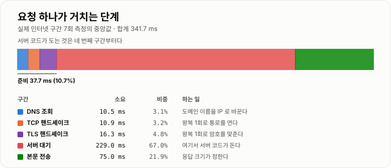
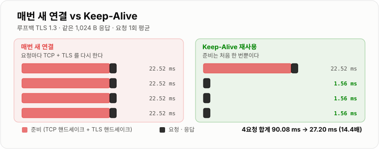
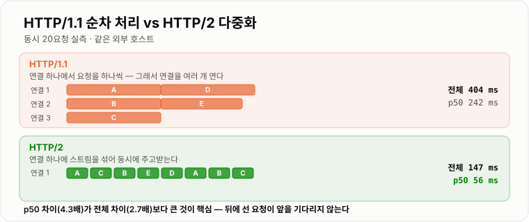

# HTTP · TCP 네트워크

> **요청 하나가 느린 이유는 대개 "서버가 느려서"가 아니라 "말을 걸기까지가 오래 걸려서"다. 실측에서 TLS 핸드셰이크 한 번이 16.31 ms였고, 그 연결을 재사용하자 요청 1회 비용이 22.52 ms에서 1.56 ms로 14.4배 줄었다.**

---

## 1. 핵심 요약

**HTTP는 TCP 위에 얹힌 약속이고, TCP는 "말을 걸 준비"에 왕복을 쓴다. 그래서 응답 시간은 서버가 일한 시간이 아니라 준비 + 왕복 + 서버 시간 + 전송 시간의 합이며, 최적화는 대부분 "준비를 다시 하지 않는 것"이다.**

### 한눈에 보기

* HTTP 요청 하나는 **서버에 닿기 전에 세 번 준비**한다. **이름을 찾고(DNS) · 연결을 맺고(TCP) · 암호를 맞춘다(TLS).** 이 셋은 서버 코드가 한 줄도 실행되기 전의 비용이다.
* 실제 인터넷 구간을 7회 측정한 중앙값이다. **DNS 10.5 ms · TCP 10.9 ms · TLS 16.3 ms · 서버 대기 229 ms · 본문 전송 75 ms**, 합계 약 353 ms.
* **TCP 연결은 3-way handshake라 왕복이 1번, TLS 1.3은 왕복이 1번 더 필요하다.** 그래서 준비 비용은 대역폭이 아니라 **RTT(왕복 시간)에 비례**한다. 서버를 아무리 빠르게 만들어도 줄지 않는다.
* 루프백에서 TLS를 통제해 재 봤다. **전체 핸드셰이크만 평균 16.31 ms**, 연결부터 응답까지 **22.52 ms**였다. 같은 연결을 재사용하면 요청 1회가 **1.56 ms**로 **14.4배** 빨라졌다.
* 암호화가 없는 평문 HTTP에서도 재사용은 이득이다. 1,024 B 응답 200회를 받는 데 **매번 새 연결 426.2 ms(요청당 2,131 µs)**, **Keep-Alive 230.2 ms(요청당 1,151 µs)** 로 **1.9배** 차이였다.
* **두 실측의 차이가 핵심을 말해 준다.** 평문에서 1.9배, TLS에서 14.4배다. **연결을 새로 맺는 비용의 대부분은 TCP가 아니라 TLS**다.
* **요청 헤더는 생각보다 크다.** 최소한의 요청이 42 B인데 실제 브라우저 요청은 **686 B(16.3배)** 였다. 응답 본문이 1,024 B라면 **헤더만 본문의 67%** 다. 그리고 이 헤더는 **매 요청마다 다시 간다.**
* **HTTP/2는 이 문제를 연결 하나로 푼다.** 동시 20요청을 재 보니 HTTP/1.1이 전체 404 ms · p50 242 ms, **HTTP/2가 전체 147 ms · p50 56 ms**였다. 전체 **2.7배**, p50은 **4.3배** 차이다.
* HTTP/1.1이 느린 이유는 **한 연결에서 요청을 하나씩 처리(head-of-line blocking)** 하기 때문이고, 브라우저는 이를 연결을 6개쯤 여는 것으로 우회한다. HTTP/2는 **연결 하나에 스트림을 여러 개** 얹는다.
* **타임아웃은 하나가 아니다.** 연결 타임아웃 · 읽기 타임아웃 · 전체 타임아웃은 각각 다른 사고를 막는다. 특히 **읽기 타임아웃이 없으면 스레드가 영원히 붙잡힌다.**

> 이 노트의 수치는 **JDK 17.0.12 (HotSpot) · Windows 11**에서 직접 측정했다. TLS와 Keep-Alive 비교는 **127.0.0.1 루프백**에서 쟀고, 단계별 분해는 **외부 공개 사이트(`www.cloudflare.com`)에 7회 요청**한 값의 중앙값이다. **루프백은 RTT가 사실상 0이므로 왕복 횟수가 만드는 비용이 과소평가된다.** 즉 실제 네트워크에서는 재사용의 이득이 여기서 잰 것보다 크다.

### 무엇을 해결하는가

#### 해결하려는 문제

주문 API가 하나 있다. 서버에서 재 보면 이 API의 처리 시간은 **3 ms**다. 그런데 클라이언트에서 재면 **300 ms**가 나온다.

```text
서버 로그         "처리 3 ms"
클라이언트 체감    300 ms
                  ↑ 이 297 ms 는 어디로 갔는가
```

서버 코드를 아무리 들여다봐도 답이 없다. **297 ms는 서버가 일한 시간이 아니라 서버에 닿기까지의 시간**이기 때문이다.

#### 이 개념이 없을 때

"느리다"는 신고를 받았을 때, 요청이 어떤 단계를 거치는지 모르면 이렇게 헤맨다.

```java
// 1. 쿼리를 튜닝한다 → 3 ms 가 2 ms 가 됐다. 체감은 그대로다
// 2. 서버를 늘린다   → CPU 는 놀고 있었다. 돈만 썼다
// 3. 캐시를 붙인다   → 3 ms 가 0.5 ms 가 됐다. 체감은 그대로다
```

단계를 나눠 재면 답이 바로 나온다. `curl`은 각 단계의 누적 시각을 알려준다.

```bash
curl -o /dev/null -w \
  "dns=%{time_namelookup} tcp=%{time_connect} tls=%{time_appconnect} ttfb=%{time_starttransfer} total=%{time_total}\n" \
  https://api.example.com/orders
```

이 값들은 **누적**이라 빼서 봐야 한다.

```text
DNS        = time_namelookup
TCP        = time_connect      - time_namelookup
TLS        = time_appconnect   - time_connect
서버 대기   = time_starttransfer - time_appconnect
본문 전송   = time_total        - time_starttransfer
```

실제로 이렇게 나눠 재니 **서버 대기 229 ms**가 압도적이었고, 준비 비용(DNS+TCP+TLS)이 **37.7 ms**였다. 어디를 고쳐야 하는지가 분명해진다.

---

## 2. 동작 원리

### 핵심 구성 요소

| 계층 | 하는 일 | 실패하면 보이는 증상 |
| --- | --- | --- |
| **DNS** | 도메인 이름 → IP 주소 | 이름을 못 찾음, 첫 요청만 유독 느림 |
| **TCP** | 신뢰할 수 있는 바이트 통로를 만든다 | connection refused, connect timeout |
| **TLS** | 그 통로를 암호화하고 상대를 확인한다 | 인증서 오류, handshake failure |
| **HTTP** | 그 통로 위에서 요청/응답을 주고받는다 | 4xx · 5xx 상태 코드 |

**아래 계층이 끝나야 위 계층이 시작된다.** 그래서 HTTP 응답이 느릴 때 원인이 HTTP에 없을 수 있다.

### 내부 동작 과정

#### 요청 하나가 거치는 단계



*준비(DNS·TCP·TLS)에 37.7 ms를 쓰고 나서야 서버가 일을 시작한다.*

```text
① DNS 조회          10.5 ms   "api.example.com 은 어느 IP 인가"
② TCP 3-way         10.9 ms   SYN → SYN+ACK → ACK      (왕복 1회)
③ TLS 핸드셰이크    16.3 ms   ClientHello → ... → Finished  (TLS 1.3 은 왕복 1회)
④ 요청 전송 + 서버  229.0 ms   여기서 비로소 서버 코드가 돈다
⑤ 본문 전송         75.0 ms   응답 크기와 대역폭이 정한다
                    ───────
                    341.7 ms
```

#### TCP는 왜 왕복이 필요한가

TCP는 **"서로가 서로의 말을 들을 수 있다"는 것을 확인하고 나서** 데이터를 보낸다.

```text
클라이언트                          서버
    │  ── SYN (내 번호 x) ──────────▶ │   "말 걸어도 되나요"
    │  ◀─ SYN+ACK (내 번호 y, x+1) ── │   "네, 저도 준비됐어요"
    │  ── ACK (y+1) ────────────────▶ │   "확인했어요"
    │                                 │
    │  ── 여기서부터 데이터 ─────────▶ │
```

**세 번 오가지만 실제로 기다리는 것은 왕복 1번(RTT)** 이다. 마지막 ACK는 데이터와 함께 보낼 수 있기 때문이다. 그래서 **RTT가 50 ms인 서버라면 연결을 맺는 데만 50 ms**가 든다. 서버 성능과 무관하다.

#### TLS는 여기에 왕복을 더한다

```text
TLS 1.2   ClientHello → ServerHello → ... → Finished     왕복 2회
TLS 1.3   ClientHello → ServerHello+Finished → Finished  왕복 1회   ← 절반으로 줄었다
```

실측 환경은 **TLS 1.3 / TLS_AES_256_GCM_SHA384**였다. 루프백(RTT ≈ 0)에서 핸드셰이크만 **16.31 ms**가 걸렸는데, **왕복이 공짜인 곳에서 이만큼 걸렸다는 것은 이 시간이 CPU 비용**이라는 뜻이다. RSA 2048 서명 검증과 키 교환 연산이다.

**그래서 TLS 핸드셰이크 비용은 두 종류다.**

```text
CPU 비용    키 교환·서명 검증        실측 16.31 ms (루프백, RTT 0)
왕복 비용    RTT × 왕복 횟수         실제 네트워크에서 여기에 더해진다
```

실제 인터넷 구간에서 TLS 단계가 **16.3 ms**로 비슷하게 나온 것은 상대 서버의 CPU가 더 빠르고 RTT가 짧았기 때문이다. **RTT가 큰 해외 리전이라면 이 값이 훨씬 커진다.**

#### 그래서 연결을 재사용한다 (Keep-Alive)

**HTTP/1.1부터는 연결을 기본으로 유지한다.** 요청이 끝나도 TCP 연결을 닫지 않고 다음 요청에 다시 쓴다.



*준비를 한 번만 하면 요청 1회 비용이 22.52 ms에서 1.56 ms가 된다.*

```text
매번 새 연결                        Keep-Alive
  [TCP][TLS][요청]  22.52 ms          [TCP][TLS][요청]  22.52 ms
  [TCP][TLS][요청]  22.52 ms                    [요청]   1.56 ms
  [TCP][TLS][요청]  22.52 ms                    [요청]   1.56 ms
  [TCP][TLS][요청]  22.52 ms                    [요청]   1.56 ms
  ─────────────────────────           ──────────────────────────
  4요청           90.08 ms            4요청            27.20 ms
```

**두 번째 요청부터 준비 비용이 0이 된다.** 실측에서 재사용은 요청당 **1.56 ms**로, 매번 새로 맺는 **22.52 ms**보다 **14.4배** 빨랐다.

평문 HTTP에서도 같은 실험을 했다. 1,024 B 응답을 200번 받는 데 **매번 새 연결 426.2 ms vs Keep-Alive 230.2 ms(1.9배)** 였다. **TLS가 없으면 이득이 1.9배, 있으면 14.4배** — 새 연결 비용의 대부분이 TLS라는 뜻이다.

> **세션 재개(session resumption)를 재 봤지만 루프백에서는 이득이 나타나지 않았다.** 전체 핸드셰이크 16.31 ms, 세션 재개 17.24 ms로 오히려 비슷하거나 느렸다. 세션 재개가 아끼는 것은 **왕복과 인증서 검증**인데, 루프백은 왕복이 공짜라 아낄 것이 없었기 때문이다. **RTT가 큰 실제 네트워크에서는 재개가 왕복을 줄여 이득이 난다.** 측정 환경이 결론을 뒤집을 수 있다는 좋은 예다.

#### 헤더는 매 요청마다 다시 간다

```text
최소한의 요청          42 B
실제 브라우저 요청     686 B      16.3 배
                                 ↑ User-Agent · Accept-* · Referer · Authorization · Cookie
```

응답 본문이 1,024 B라면 **요청 헤더만 본문의 67%** 다. 그리고 이 686 B는 **압축도 안 되고 매번 똑같이** 간다. HTTP/2가 헤더 압축(HPACK)을 넣은 이유가 이것이다.

#### HTTP/1.1의 한계와 HTTP/2

HTTP/1.1은 **연결 하나에서 요청을 하나씩** 처리한다. 앞 요청의 응답이 끝나야 다음 요청이 나간다.



*HTTP/2는 연결 하나에 스트림을 여러 개 얹어 동시에 주고받는다.*

```text
HTTP/1.1   연결1 [── 요청A ──][── 요청B ──]      앞이 끝나야 뒤가 간다
           연결2 [── 요청C ──]                   그래서 브라우저는 연결을 6개쯤 연다
           ...

HTTP/2     연결1 [A][C][B][A][B][C]              하나의 연결에 스트림을 섞어 보낸다
```

동시 20요청 실측이다.

```text
              전체      p50      최대
HTTP/1.1     404 ms   242 ms   378 ms
HTTP/2       147 ms    56 ms    84 ms
             2.7배     4.3배     4.5배
```

**p50 차이가 전체 차이보다 큰 것이 핵심이다.** HTTP/1.1에서는 뒤에 줄 선 요청이 앞 요청을 기다리느라 개별 응답이 느려진다. HTTP/2는 모두가 거의 동시에 출발한다.

---

## 3. 특징과 비교

| 구분          | 내용 |
| ----------- | -- |
| **장점**      | 연결을 재사용하면 준비 비용이 사라진다. 실측에서 요청 1회가 22.52 ms → 1.56 ms(**14.4배**)가 됐다. HTTP/2는 연결 하나로 동시 요청을 처리해 동시 20요청 p50이 242 ms → 56 ms(**4.3배**)로 줄었다. 단계별로 나눠 재면 병목이 서버인지 네트워크인지 바로 갈린다. |
| **단점**      | 준비 비용은 **RTT에 비례**해서 서버를 아무리 빠르게 해도 줄지 않는다. 연결을 유지하면 서버가 소켓과 메모리를 계속 붙잡고, 헤더는 압축 없이 매 요청 반복된다(실측 686 B). TLS는 CPU도 쓴다(루프백 핸드셰이크 16.31 ms). 타임아웃을 안 걸면 느린 상대 하나가 스레드를 영원히 점유한다. |
| **적합한 상황**  | 같은 호스트에 요청을 반복하는 모든 경우 — 서버 간 API 호출, 외부 결제·인증 연동, 크롤러. **연결 풀을 쓰는 HTTP 클라이언트**가 사실상 필수다. 응답이 빠를수록(수 ms) 재사용의 상대적 이득이 커진다. |
| **주의할 상황**  | 상대가 유휴 연결을 먼저 끊는 경우(로드밸런서 idle timeout) — 재사용하려다 끊긴 연결을 잡아 간헐적 실패가 난다. 연결 풀 크기를 스레드 수보다 작게 잡으면 대기가 생긴다. 요청이 드문드문 한 번씩만 가는 경우엔 재사용할 기회 자체가 없다. |

### 성능 특성

#### 단계별 소요 (실제 인터넷, 7회 중앙값)

```text
DNS 조회          10.5 ms      3.0 %
TCP 핸드셰이크    10.9 ms      3.1 %
TLS 핸드셰이크    16.3 ms      4.6 %
서버 대기        229.0 ms     64.9 %      ← 여기가 압도적이다
본문 전송         75.0 ms     21.2 %
                 ────────
                 341.7 ms
```

**준비 비용은 전체의 10.7%였다.** 이 워크로드에서는 서버 시간이 지배적이므로, **연결 재사용보다 서버를 고치는 것이 먼저**다. 반대로 서버가 3 ms인 API라면 준비 비용 37.7 ms가 전체의 92%가 된다.

**이것이 "재사용의 이득은 응답이 빠를수록 크다"의 의미다.**

```text
서버가 3 ms 인 API      준비 37.7 ms + 서버 3 ms  = 40.7 ms  →  재사용 시 3 ms  (13.6배)
서버가 229 ms 인 API    준비 37.7 ms + 서버 229 ms = 266.7 ms →  재사용 시 229 ms (1.2배)
```

#### 연결 재사용 (루프백, 통제된 측정)

```text
                                  요청 1회 평균
평문 HTTP   매번 새 연결            2,131 us
평문 HTTP   Keep-Alive              1,151 us      1.9 배
TLS 1.3     매번 새 연결 (전체 HS)  22.52 ms
TLS 1.3     매번 새 연결 (세션 재개) 25.65 ms      루프백에서는 이득 없음
TLS 1.3     Keep-Alive               1.56 ms      14.4 배
```

TCP 연결을 맺고 닫는 것만 따로 재면 루프백에서 **1,197 µs**였다.

#### 동시 요청 처리 (외부 호스트, 동시 20요청)

```text
              전체 소요    p50      최대
HTTP/1.1       404 ms    242 ms   378 ms
HTTP/2         147 ms     56 ms    84 ms
비율            2.7배      4.3배    4.5배
```

#### 요청 헤더 크기

```text
최소한의 요청 (GET + Host)                     42 B
실제 브라우저 요청 (UA·Accept·Cookie·Bearer)   686 B      16.3 배
응답 본문이 1,024 B 일 때 헤더가 차지하는 비중    67 %
```

### 장점과 단점

#### 장점

* **준비를 한 번만 한다.** 연결 재사용으로 요청당 21 ms를 없앴다(22.52 → 1.56 ms).
* **단계별 계측이 쉽다.** `curl -w` 한 줄로 병목이 DNS인지 TLS인지 서버인지 갈린다. 추측할 필요가 없다.
* **HTTP/2는 코드를 안 바꿔도 된다.** 프로토콜 협상(ALPN)으로 자동으로 정해진다. 실측에서도 클라이언트가 버전만 지정하자 알아서 HTTP/2로 붙었다.

#### 단점

* **RTT는 돈으로 못 산다.** 서울-미국 왕복이 180 ms라면 TCP+TLS만 최소 360 ms다. 리전을 옮기거나 CDN을 쓰는 것 외에 방법이 없다.
* **연결 유지에도 비용이 든다.** 서버는 유휴 연결마다 소켓과 버퍼를 잡고 있다. 그래서 로드밸런서와 서버는 유휴 연결을 일정 시간 뒤 끊는다.
* **끊긴 연결을 재사용하려는 경쟁 상태가 있다.** 서버가 막 끊은 연결을 클라이언트가 모르고 재사용하면 요청이 실패한다. 간헐적인 `Connection reset`의 흔한 원인이다.
* **TLS는 CPU를 쓴다.** 루프백 실측 핸드셰이크 16.31 ms는 전부 계산 비용이었다.

### 어떤 상황에서 고르는가

#### 느리다는 신고를 받았을 때의 순서

```text
1. 단계별로 나눠 잰다 (curl -w)
      ↓
2. 서버 대기(TTFB)가 지배적인가?
      예 → 서버 문제다. 쿼리·캐시·스레드 풀을 본다  (06·08 노트)
      아니오 ↓
3. 준비 비용(DNS+TCP+TLS)이 지배적인가?
      예 → 연결을 재사용하고 있는가부터 확인한다
      아니오 ↓
4. 본문 전송이 지배적인가?
      예 → 응답이 큰 것이다. 압축·페이지네이션·필드 선택을 본다
```

#### 타임아웃을 어디에 거는가

| 타임아웃 | 막는 사고 | 없으면 |
| --- | --- | --- |
| **연결 타임아웃** | 상대 서버가 죽어 응답이 없음 | 커넥션 대기가 쌓인다 |
| **읽기 타임아웃** | 연결은 됐는데 응답을 안 줌 | **스레드가 영원히 붙잡힌다** |
| **전체 타임아웃** | 조금씩 응답하며 끝나지 않음 | 느린 상대가 자원을 잠식한다 |

**가장 위험한 것은 읽기 타임아웃이 없는 경우다.** 연결은 정상이라 오류도 안 나고, 스레드만 조용히 하나씩 사라진다. 스레드 풀이 마르면 그때서야 전체 장애로 드러난다.

### 비슷한 기술과 비교

#### HTTP/1.1 vs HTTP/2 vs HTTP/3

| 기준 | HTTP/1.1 | HTTP/2 | HTTP/3 |
| --- | --- | --- | --- |
| 전송 계층 | TCP | TCP | **UDP (QUIC)** |
| 동시 요청 | 연결당 1개 (연결을 여러 개) | **연결 1개에 스트림 다중화** | 스트림 다중화 |
| 헤더 | 평문, 매번 반복 (실측 686 B) | **HPACK 압축** | QPACK 압축 |
| 패킷 유실 시 | 그 연결만 막힌다 | **모든 스트림이 함께 막힌다** (TCP HOL) | **스트림별로 독립** |
| 연결 수립 | TCP + TLS | TCP + TLS | **QUIC이 한 번에** |
| 실측 (동시 20요청) | 404 ms / p50 242 ms | **147 ms / p50 56 ms** | — |

**HTTP/2에도 head-of-line blocking이 남아 있다.** 애플리케이션 계층에서는 없앴지만 TCP 계층에는 그대로라, 패킷 하나가 유실되면 그 연결의 모든 스트림이 멈춘다. HTTP/3가 UDP로 간 이유다.

#### Keep-Alive vs 연결 풀

| 기준 | Keep-Alive | 연결 풀 |
| --- | --- | --- |
| 무엇인가 | **프로토콜의 약속** (연결을 닫지 말자) | **클라이언트의 구현** (연결을 보관하자) |
| 누가 하는가 | 서버와 클라이언트가 합의 | 클라이언트 라이브러리 |
| 동시 요청 | 한 연결로는 순차 | **여러 연결을 동시에** |
| 설정 항목 | idle timeout, max requests | 최대 연결 수, 대기 시간 |

**둘은 대체재가 아니라 함께 쓰는 것이다.** Keep-Alive가 "연결을 살려 두자"이고, 연결 풀이 "살아 있는 연결을 모아 두고 빌려주자"다.

#### TCP vs UDP

| 기준 | TCP | UDP |
| --- | --- | --- |
| 연결 | **3-way handshake 필요** | 없다 |
| 순서 보장 | **있다** | 없다 |
| 유실 재전송 | **있다** | 없다 |
| 첫 바이트까지 | 왕복 1회 이상 | **0회** |
| 쓰는 곳 | HTTP/1.1·HTTP/2, DB 연결 | DNS, 실시간 스트리밍, **QUIC(HTTP/3)** |

---

## 4. 실무 주의사항

### 백엔드 실무 적용

#### Spring · Java — 연결을 재사용하는 클라이언트를 쓴다

가장 흔한 사고는 **요청마다 클라이언트를 새로 만드는 것**이다.

```java
// 나쁜 예 — 요청마다 새 클라이언트 = 매번 새 연결 = 매번 TLS 핸드셰이크
public Payment call(Long orderId) {
    RestTemplate rt = new RestTemplate();          // ← 여기가 문제다
    return rt.getForObject(url + orderId, Payment.class);
}
```

실측대로라면 이 코드는 요청마다 **약 21 ms**를 버린다. 초당 100건이면 초당 2.1초어치를 버리는 셈이다.

```java
// 좋은 예 — 클라이언트를 Bean 으로 한 번만 만들고 연결 풀을 붙인다
@Configuration
public class HttpClientConfig {

    @Bean
    public RestClient paymentClient() {
        PoolingHttpClientConnectionManager pool = new PoolingHttpClientConnectionManager();
        pool.setMaxTotal(100);                   // 전체 연결 수
        pool.setDefaultMaxPerRoute(50);          // 호스트 하나당 연결 수

        RequestConfig req = RequestConfig.custom()
                .setConnectTimeout(Timeout.ofSeconds(2))              // 연결 타임아웃
                .setResponseTimeout(Timeout.ofSeconds(3))             // 읽기 타임아웃
                .setConnectionRequestTimeout(Timeout.ofSeconds(1))    // 풀에서 빌리는 대기
                .build();

        CloseableHttpClient client = HttpClients.custom()
                .setConnectionManager(pool)
                .setDefaultRequestConfig(req)
                .evictIdleConnections(TimeValue.ofSeconds(30))        // 상대보다 먼저 정리한다
                .build();

        return RestClient.builder()
                .requestFactory(new HttpComponentsClientHttpRequestFactory(client))
                .baseUrl("https://pay.example.com")
                .build();
    }
}
```

**타임아웃 세 개를 모두 걸어야 한다.** 특히 `connectionRequestTimeout`이 없으면 풀이 고갈됐을 때 스레드가 무한정 대기한다. [ThreadPool과 Deadlock](../../04-동시성/ThreadPool-Deadlock/ThreadPool-Deadlock.md)에서 본 것과 같은 고갈이 여기서도 일어난다.

#### 유휴 연결 타임아웃을 상대보다 짧게 잡는다

간헐적인 `Connection reset by peer`의 전형적인 원인이다.

```text
로드밸런서 idle timeout   60 초
내 연결 풀 idle timeout   무제한        ← 문제

t=60s   LB 가 조용히 연결을 끊는다
t=61s   내 풀은 그 연결이 살아 있다고 믿고 요청을 보낸다
        → Connection reset. 재시도하면 성공한다. 그래서 "가끔 실패"로 보인다
```

**내 쪽 유휴 타임아웃을 상대보다 짧게** 잡으면(예: 30초) 내가 먼저 정리하므로 이 경쟁이 없어진다.

#### 재시도는 멱등한 요청에만 건다

연결이 끊겨 실패했을 때, **요청이 서버에 도달했는지 아닌지 클라이언트는 모른다.**

```text
요청 전송 → (응답 없음) → 타임아웃
              ↑
    서버가 못 받았을 수도, 처리하고 응답만 못 줬을 수도 있다
```

`GET`·`PUT`·`DELETE`는 다시 보내도 결과가 같지만 **`POST`는 두 번 처리될 수 있다.** 재시도가 필요하면 멱등성 키를 함께 보낸다. 자세한 것은 [분산 락과 멱등성](../../08-캐시-Redis/분산락-멱등성/분산락-멱등성.md)에 있다.

#### 압축은 켜되 작은 응답에는 끄자

본문 전송이 전체의 21.2%였다. JSON은 압축이 잘 든다(다음 노트 실측 기준 **21,996 B → 2,277 B, 9.7배**). 다만 **수백 바이트짜리 응답은 압축 비용이 이득보다 크므로** 임계값을 둔다.

```yaml
server:
  compression:
    enabled: true
    mime-types: application/json,text/html,text/plain
    min-response-size: 2KB      # 이보다 작으면 압축하지 않는다
```

### 자주 하는 오해

| 잘못된 이해 | 올바른 이해 |
| --- | --- |
| "API가 느리면 서버가 느린 것이다" | 실측에서 준비 비용만 **37.7 ms**였다. 서버가 3 ms여도 체감은 40 ms다. |
| "서버를 늘리면 응답이 빨라진다" | 늘어나는 것은 **처리량**이지 한 건의 지연이 아니다. RTT는 그대로다. |
| "HTTPS는 느리니까 내부 통신은 HTTP로" | 느린 것은 **핸드셰이크**지 전송이 아니다. 연결을 재사용하면 차이가 거의 없다. |
| "Keep-Alive는 HTTP/2부터 생겼다" | **HTTP/1.1의 기본값**이다. HTTP/1.0에서는 `Connection: keep-alive`를 명시해야 했다. |
| "연결 재사용은 미미한 최적화다" | 실측 **14.4배**(TLS 기준)다. 응답이 빠른 API일수록 비중이 커진다. |
| "TLS 핸드셰이크 비용은 네트워크 비용이다" | **CPU 비용이기도 하다.** RTT가 0인 루프백에서도 16.31 ms가 걸렸다. |
| "세션 재개를 켜면 항상 빨라진다" | 실측 루프백에서는 **이득이 없었다**(16.31 vs 17.24 ms). 아끼는 것이 왕복이라 RTT가 커야 효과가 난다. |
| "HTTP/2를 쓰면 head-of-line blocking이 없다" | 애플리케이션 계층에서만 없앴다. **TCP 계층에는 남아** 패킷 유실 시 전체 스트림이 멈춘다. |
| "HTTP/2는 연결을 여러 개 열어 빨라진다" | 반대다. **연결 하나에 스트림을 다중화**한다. |
| "헤더는 작으니 신경 안 써도 된다" | 실측 **686 B**로 본문(1,024 B)의 67%였고 **매 요청 반복**된다. |
| "타임아웃은 하나만 걸면 된다" | 연결·읽기·전체는 서로 다른 사고를 막는다. **읽기 타임아웃이 없으면 스레드가 영원히 묶인다.** |
| "타임아웃이 나면 요청이 처리되지 않은 것이다" | 알 수 없다. **서버가 처리하고 응답만 못 줬을 수도** 있다. 그래서 `POST` 재시도가 위험하다. |
| "가끔 나는 Connection reset은 네트워크 탓" | 대개 **상대의 idle timeout이 내 풀보다 짧아서**다. 내 쪽을 더 짧게 잡으면 사라진다. |

---

## 5. 예제

### 단계별로 나눠 재기

```bash
# 누적 시각을 뽑고 빼서 각 단계를 구한다
curl -s -o /dev/null -w \
  "dns=%{time_namelookup}\ntcp=%{time_connect}\ntls=%{time_appconnect}\nttfb=%{time_starttransfer}\ntotal=%{time_total}\n" \
  https://api.example.com/orders

# 연결이 재사용되는지 확인한다 — num_connects 가 0 이면 재사용된 것이다
curl -s -o /dev/null -o /dev/null -w "connects=%{num_connects}\n" \
  https://api.example.com/a https://api.example.com/b
```

### 연결 재사용 여부를 코드로 확인하기

```java
// 같은 클라이언트로 두 번 호출하면 두 번째는 핸드셰이크가 없다
HttpClient client = HttpClient.newBuilder()
        .version(HttpClient.Version.HTTP_2)
        .connectTimeout(Duration.ofSeconds(2))
        .build();

HttpRequest req = HttpRequest.newBuilder(URI.create("https://api.example.com/orders"))
        .timeout(Duration.ofSeconds(3))          // 읽기 타임아웃
        .GET()
        .build();

long t1 = System.nanoTime();
client.send(req, HttpResponse.BodyHandlers.discarding());
long first = System.nanoTime() - t1;

long t2 = System.nanoTime();
client.send(req, HttpResponse.BodyHandlers.discarding());
long second = System.nanoTime() - t2;

System.out.printf("첫 요청 %.1f ms / 두 번째 %.1f ms%n", first / 1e6, second / 1e6);
// 두 번째가 훨씬 빠르면 연결이 재사용되고 있는 것이다
```

### 타임아웃 세 개를 모두 거는 설정

```java
// 연결 · 읽기 · 풀 대기를 각각 건다. 하나라도 빠지면 그 경로로 스레드가 샌다
RequestConfig config = RequestConfig.custom()
        .setConnectTimeout(Timeout.ofSeconds(2))            // 연결이 안 맺어질 때
        .setResponseTimeout(Timeout.ofSeconds(3))           // 응답을 안 줄 때
        .setConnectionRequestTimeout(Timeout.ofSeconds(1))  // 풀이 고갈됐을 때
        .build();
```

### 재시도는 멱등한 요청에만

```java
// GET·PUT·DELETE 만 재시도한다. POST 는 중복 처리 위험이 있어 제외한다
private static final Set<String> IDEMPOTENT = Set.of("GET", "PUT", "DELETE", "HEAD");

public HttpResponse<byte[]> callWithRetry(HttpRequest req) throws Exception {
    int attempts = IDEMPOTENT.contains(req.method()) ? 3 : 1;
    IOException last = null;
    for (int i = 0; i < attempts; i++) {
        try {
            return client.send(req, HttpResponse.BodyHandlers.ofByteArray());
        } catch (IOException e) {
            last = e;
            Thread.sleep(100L * (1L << i));       // 지수 백오프
        }
    }
    throw last;
}
```

---

## 6. 면접 정리

### 자주 나오는 질문

#### 기본 질문

1. **브라우저에 주소를 치고 화면이 뜨기까지 무슨 일이 일어나는가?**

    * 핵심 키워드: DNS 조회 · TCP 3-way handshake · TLS 핸드셰이크 · HTTP 요청/응답 · 렌더링

2. **TCP 3-way handshake는 왜 세 번 주고받는가?**

    * 핵심 키워드: 양방향 확인 · 순서 번호 동기화 · 실제 대기는 왕복 1회

3. **Keep-Alive는 무엇이고 왜 쓰는가?**

    * 핵심 키워드: 연결 재사용 · 준비 비용 제거 · HTTP/1.1 기본값 · 실측 14.4배

4. **HTTP/1.1과 HTTP/2의 차이는 무엇인가?**

    * 핵심 키워드: 스트림 다중화 · head-of-line blocking · HPACK 헤더 압축 · ALPN

5. **타임아웃은 어디에 몇 개를 걸어야 하는가?**

    * 핵심 키워드: 연결 · 읽기 · 풀 대기 · 스레드 고갈

#### 꼬리 질문

1. **서버 로그에는 3 ms인데 클라이언트는 300 ms라고 한다. 어떻게 좁히겠는가?**

    * 핵심 키워드: `curl -w` 단계 분해 · TTFB · 준비 비용 · 네트워크 구간

2. **HTTPS가 HTTP보다 느린가?**

    * 핵심 키워드: 핸드셰이크 비용 · 연결 재사용 시 차이 소멸 · CPU 비용 16.31 ms

3. **연결을 재사용하는데도 가끔 Connection reset이 난다. 왜인가?**

    * 핵심 키워드: 상대의 idle timeout · 끊긴 연결 재사용 경쟁 · 내 쪽을 더 짧게

4. **HTTP/2를 쓰면 head-of-line blocking이 완전히 사라지는가?**

    * 핵심 키워드: 애플리케이션 계층만 해결 · TCP 계층에 잔존 · HTTP/3와 QUIC

5. **타임아웃이 났을 때 재시도해도 되는가?**

    * 핵심 키워드: 처리 여부 불명 · 멱등성 · POST 위험 · 멱등성 키

### 30초 답변

> HTTP 요청은 서버에 닿기 전에 **DNS · TCP · TLS** 세 단계를 거칩니다. 실측해 보니 이 준비에만 **37.7 ms**가 들었고, 서버 코드는 그 뒤에야 돕니다. 그래서 가장 큰 최적화는 **연결을 재사용하는 것**입니다. 같은 연결을 다시 쓰자 요청 1회가 **22.52 ms에서 1.56 ms로 14.4배** 빨라졌습니다.

#### 이어서 더 물으면

**먼저 단계를 나눠 재는 것부터 합니다.** `curl -w`로 누적 시각을 뽑아 빼면 DNS·TCP·TLS·서버 대기·본문 전송이 각각 나옵니다. 실제로 재 보니 중앙값이 **DNS 10.5 ms, TCP 10.9 ms, TLS 16.3 ms, 서버 대기 229 ms, 전송 75 ms**였습니다. 이 워크로드에서는 **서버 대기가 65%** 라 네트워크를 만질 게 아니라 서버를 고쳐야 한다는 결론이 나옵니다. 반대로 서버가 3 ms인 API였다면 준비 비용 37.7 ms가 전체의 92%가 됩니다. **어디를 고칠지는 재봐야 압니다.**

**준비 비용이 큰 이유는 왕복 때문입니다.** TCP는 3-way handshake로 왕복 1번, TLS 1.3은 왕복이 1번 더 듭니다. **RTT에 비례하는 비용이라 서버를 아무리 빠르게 만들어도 줄지 않습니다.** 그래서 대책은 "빠르게"가 아니라 "다시 하지 않기"입니다.

**연결 재사용 효과를 통제해서 재 봤습니다.** 루프백에 TLS 서버를 띄우고 같은 1,024 B 응답을 받았는데, 매번 새 연결이 **22.52 ms**, Keep-Alive가 **1.56 ms**로 **14.4배** 차이였습니다. 평문 HTTP로 같은 실험을 하면 1.9배밖에 안 났는데, 이 차이가 **새 연결 비용의 대부분이 TLS**라는 걸 보여줍니다. 실무에서 가장 흔한 실수가 요청마다 `new RestTemplate()`을 만드는 것이고, 그러면 이 21 ms를 매번 버립니다.

**흥미로운 반례도 하나 있었습니다.** TLS 세션 재개를 켜고 재 봤는데 **루프백에서는 이득이 없었습니다**(16.31 vs 17.24 ms). 세션 재개가 아끼는 건 왕복과 인증서 검증인데, 루프백은 왕복이 공짜라 아낄 게 없었던 겁니다. **측정 환경이 결론을 뒤집을 수 있다**는 걸 배웠습니다.

**동시 요청에서는 HTTP/2가 큽니다.** 동시 20요청을 재니 HTTP/1.1이 전체 404 ms · p50 242 ms, HTTP/2가 전체 147 ms · **p50 56 ms**였습니다. p50 차이가 전체 차이보다 큰 게 핵심인데, HTTP/1.1은 연결당 요청을 하나씩 처리해서 뒤에 선 요청이 앞을 기다리기 때문입니다. 다만 **HTTP/2도 TCP 계층의 head-of-line blocking은 남아 있어서**, 패킷이 유실되면 그 연결의 모든 스트림이 멈춥니다. HTTP/3가 UDP 기반 QUIC으로 간 이유입니다.

**운영에서는 타임아웃 세 개를 반드시 다 겁니다.** 연결·읽기·풀 대기입니다. 특히 **읽기 타임아웃이 없으면 오류도 안 나면서 스레드만 조용히 묶입니다.** 그리고 유휴 연결 타임아웃은 로드밸런서보다 짧게 잡습니다. 상대가 먼저 끊은 연결을 재사용하려다 나는 게 간헐적 `Connection reset`입니다.

#### 답변 구조

1. **정의** — HTTP는 TCP 위에 얹힌 요청/응답 약속이고, 요청 하나의 응답 시간은 준비(DNS·TCP·TLS) + 왕복 + 서버 처리 + 본문 전송의 합이다. 서버가 일한 시간은 그중 일부다
2. **내부 원리** — TCP는 3-way handshake로 양쪽이 서로를 확인한 뒤 데이터를 보내므로 왕복 1회가 필요하고, TLS는 여기에 왕복을 더한다(1.2는 2회, 1.3은 1회). 준비 비용은 RTT에 비례하므로 서버 성능과 무관하다. HTTP/1.1은 연결당 요청을 순차 처리해 앞 요청이 뒤를 막고, HTTP/2는 연결 하나에 스트림을 다중화하고 HPACK으로 헤더를 압축한다
3. **복잡도**
    * 단계별 중앙값(실제 인터넷) — DNS 10.5 ms · TCP 10.9 ms · TLS 16.3 ms · 서버 대기 229 ms · 전송 75 ms
    * 연결 재사용(TLS, 루프백) — 매번 새 연결 **22.52 ms** vs Keep-Alive **1.56 ms** = **14.4배**
    * 연결 재사용(평문 HTTP) — 2,131 µs vs 1,151 µs = 1.9배 → 차액의 대부분이 TLS
    * TLS 핸드셰이크만 16.31 ms (RTT 0인 루프백이므로 순수 CPU 비용)
    * 동시 20요청 — HTTP/1.1 404 ms / p50 242 ms vs HTTP/2 **147 ms / p50 56 ms**
    * 요청 헤더 — 최소 42 B vs 실제 브라우저 686 B (16.3배, 본문 1,024 B의 67%)
4. **장점** — 연결 재사용으로 준비 비용을 없애 요청당 21 ms를 줄인다. 단계별 계측이 쉬워 병목이 서버인지 네트워크인지 추측 없이 갈린다. HTTP/2는 ALPN으로 자동 협상되어 코드 변경 없이 동시 요청 지연을 4.3배 줄인다
5. **단점** — RTT에 비례하는 비용은 서버를 개선해도 줄지 않는다. 연결을 유지하면 서버가 소켓·버퍼를 계속 점유하고, 상대가 먼저 끊으면 간헐적 실패가 난다. 헤더는 HTTP/1.1에서 압축 없이 매 요청 반복되고(686 B), TLS는 CPU도 쓴다(16.31 ms). 타임아웃이 없으면 스레드가 무한정 묶인다
6. **사용 기준** — 같은 호스트에 요청을 반복하면 무조건 연결 풀을 쓴다. 응답이 빠른 API일수록 재사용의 상대적 이득이 크다(서버 3 ms면 13.6배, 229 ms면 1.2배). 준비 비용이 지배적인지 서버 시간이 지배적인지 먼저 재고, 서버가 지배적이면 네트워크가 아니라 서버를 고친다
7. **대안과 비교** — Keep-Alive는 프로토콜의 약속이고 연결 풀은 클라이언트 구현이라 대체재가 아니라 함께 쓴다. HTTP/2는 다중화로 HTTP/1.1의 순차 처리를 없애지만 TCP 계층 HOL은 남아, 그것까지 없애려면 UDP 기반 HTTP/3다. UDP는 연결 수립이 없어 첫 바이트가 빠르지만 순서·재전송을 직접 처리해야 한다
8. **실무 적용 사례** — `RestClient`·`WebClient`를 Bean으로 한 번만 만들고 `PoolingHttpClientConnectionManager`를 붙인다. 연결·읽기·풀 대기 타임아웃 세 개를 모두 걸고, 유휴 연결 타임아웃을 로드밸런서보다 짧게 잡아 끊긴 연결 재사용을 막는다. 재시도는 `GET`·`PUT`·`DELETE`에만 지수 백오프로 걸고 `POST`는 멱등성 키가 있을 때만 재시도한다. 응답 압축은 켜되 `min-response-size`로 작은 응답은 제외한다

### 핵심 키워드

`3-way handshake` · `RTT` · `Keep-Alive` · `연결 풀` · `TLS 핸드셰이크` · `세션 재개` · `TTFB` · `head-of-line blocking` · `스트림 다중화` · `HPACK` · `ALPN` · `읽기 타임아웃` · `idle timeout`

### 이어서 볼 주제

* **REST와 API 설계** — 이 통로 위에 무엇을 어떤 규칙으로 실어 보낼지.
* **쿠키 · 세션 · JWT** — 매 요청에 실려 가는 헤더의 정체와 그 크기 비용.
* **ThreadPool과 Deadlock** — 읽기 타임아웃이 없을 때 스레드가 어떻게 마르는지.
* **Connection Pool과 쿼리 튜닝** — 같은 "풀" 개념이 DB 쪽에서 어떻게 쓰이는지.
* **캐시 전략과 정합성** — 서버 대기(TTFB)가 지배적일 때 손대는 곳.

### 최종 체크리스트

* [ ] 요청 하나가 거치는 다섯 단계를 순서대로 말할 수 있다.
* [ ] 준비 비용이 **RTT에 비례**해서 서버 개선으로 줄지 않는 이유를 설명할 수 있다.
* [ ] TCP 3-way handshake가 왜 세 번인지, 실제 대기는 왕복 몇 번인지 안다.
* [ ] 연결 재사용의 이득을 수치로 말할 수 있다(22.52 → 1.56 ms, 14.4배).
* [ ] 평문 1.9배와 TLS 14.4배의 차이가 무엇을 뜻하는지 설명할 수 있다.
* [ ] 세션 재개가 루프백에서 이득이 없었던 이유를 말할 수 있다.
* [ ] HTTP/1.1의 head-of-line blocking과 HTTP/2의 다중화를 그림으로 그릴 수 있다.
* [ ] HTTP/2에도 남아 있는 HOL이 어느 계층의 것인지 안다.
* [ ] 타임아웃 세 종류가 각각 무엇을 막는지 구분할 수 있다.
* [ ] 간헐적 `Connection reset`의 흔한 원인과 대책을 안다.
* [ ] 타임아웃 뒤 재시도가 위험한 요청과 안전한 요청을 구분할 수 있다.
