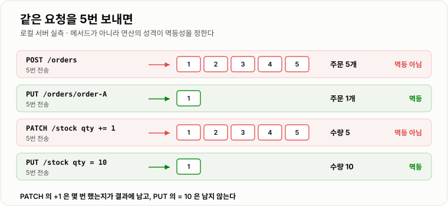
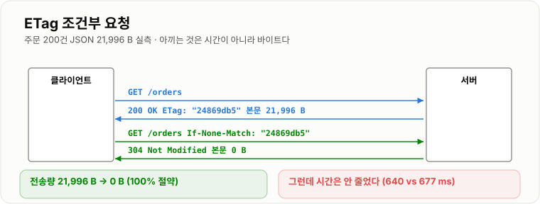

# REST와 API 설계

> **REST의 규칙은 취향이 아니라 계약이다. `PUT`이 멱등하다는 약속 덕분에 클라이언트가 마음 놓고 재시도할 수 있고, 그 약속을 어긴 API는 네트워크가 한 번 흔들릴 때마다 데이터를 하나씩 더 만든다. 실측에서 같은 요청 5번에 `POST`는 주문 5개를, `PUT`은 1개를 만들었다.**

---

## 1. 핵심 요약

**REST는 "자원을 URL로 가리키고, 무엇을 할지는 메서드로 말한다"는 규약이다. 이 규약의 값어치는 이름이 예뻐지는 것이 아니라, 클라이언트·프록시·캐시가 요청을 열어 보지 않고도 안전하게 재시도하고 캐싱할 수 있다는 데 있다.**

### 한눈에 보기

* REST의 핵심은 **자원(명사)은 URL에, 행위(동사)는 HTTP 메서드에** 둔다는 것이다. `/getOrder?id=1`이 아니라 `GET /orders/1`이다.
* **왜 이렇게 하는가**가 더 중요하다. 메서드에 의미를 실어 두면 **중간 장치들이 본문을 몰라도 판단**할 수 있다. `GET`이니까 캐시해도 되고, `PUT`이니까 재시도해도 된다.
* **멱등성(idempotent)** 은 "같은 요청을 여러 번 보내도 결과가 한 번 보낸 것과 같다"는 성질이다. 네트워크에 타임아웃이 있는 한 **중복 요청은 반드시 온다.**
* 실측했다. 같은 요청을 **5번씩** 보냈더니 **`POST /orders`는 주문 5개**를 만들었고, **`PUT /orders/order-A`는 1개**만 만들었다.
* `PATCH`도 갈린다. **`PATCH`로 수량을 1씩 더하면 5번에 5가 되고**(멱등하지 않다), **`PUT`으로 수량을 10으로 지정하면 5번을 해도 10**이다(멱등하다). **메서드가 아니라 연산의 성격이 정한다.**
* **안전(safe)과 멱등은 다르다.** `GET`은 서버 상태를 바꾸지 않아 안전하고, `DELETE`는 상태를 바꾸지만 여러 번 해도 결과가 같아 멱등하다.
* **조건부 요청은 "안 바뀌었으면 보내지 마세요"다.** `ETag`를 받아 `If-None-Match`로 되물으면 서버가 **304**를 준다. 실측에서 본문이 **21,996 B → 0 B(100% 절약)** 가 됐다.
* 다만 **루프백에서 시간을 재니 이득이 없었다.** 100회 반복에서 전체 응답 640 ms, 304 응답 677 ms로 오히려 비슷했다. **조건부 요청이 아끼는 것은 시간이 아니라 바이트**이기 때문이다. 대역폭이 좁은 모바일에서 의미가 있다.
* 같은 이유로 **압축은 확실한 이득이다.** 같은 JSON이 **21,996 B → 2,277 B(9.7배, 90% 절약)** 였다.
* **상태 코드는 클라이언트를 위한 분기다.** 4xx는 "네가 고쳐라", 5xx는 "내가 잘못했다, 재시도해도 된다"는 뜻이라 **재시도 여부가 여기서 갈린다.**
* 버저닝의 목적은 **"고치는 자유"가 아니라 "안 고쳐도 되는 자유"** 다. 기존 클라이언트가 안 깨지게 두고 새 클라이언트만 옮기려고 버전을 나눈다.

> 이 노트의 수치는 **JDK 17.0.12 (HotSpot) · Windows 11**에서 직접 측정했다. 로컬 HTTP 서버(`com.sun.net.httpserver`)를 띄우고 **127.0.0.1 루프백**으로 요청했다. 응답 JSON은 주문 200건짜리 **21,996 B**다. **루프백은 대역폭이 사실상 무한이라, 바이트를 아끼는 최적화가 시간으로 드러나지 않는다는 점을 감안해서 읽어야 한다.**

### 무엇을 해결하는가

#### 해결하려는 문제

결제 API가 있다. 클라이언트가 요청을 보냈는데 **3초 뒤 타임아웃**이 났다.

```text
클라이언트  ── POST /payments ──▶  서버
            ◀── (응답 없음) ───
            타임아웃!
```

여기서 클라이언트는 **알 수 없는 것이 하나 있다.**

```text
경우 1   서버가 요청을 못 받았다        → 다시 보내야 한다
경우 2   서버가 결제하고 응답만 못 줬다  → 다시 보내면 이중 결제다
```

**둘을 구분할 방법이 없다.** 그런데 `POST`는 멱등하지 않으므로 재시도하면 경우 2에서 사고가 난다. 실제로 실측에서 `POST`를 5번 보내니 주문이 **5개** 만들어졌다.

#### 이 개념이 없을 때

메서드에 의미를 싣지 않고 전부 `POST`로 만들면 이런 API가 된다.

```java
// 전부 POST 로 만든 API — 겉보기엔 잘 돌아간다
POST /api/getOrder      { "id": 1 }
POST /api/updateOrder   { "id": 1, "status": "PAID" }
POST /api/deleteOrder   { "id": 1 }
```

돌아가긴 한다. 하지만 **바깥에서 아무것도 판단할 수 없게 된다.**

```text
캐시     "getOrder 를 캐시해도 되나?"  → 모른다. POST 니까 캐시 못 한다
재시도   "실패했는데 다시 보내도 되나?" → 모른다. 본문을 열어 봐야 안다
모니터링 "이 API 는 읽기인가 쓰기인가?" → 모른다. 전부 POST 다
방화벽   "읽기 전용 권한만 주고 싶다"   → 못 준다. 메서드가 다 같다
```

메서드에 의미를 실으면 이 판단이 **본문을 열지 않고** 가능해진다.

```java
GET    /orders/1        // 캐시해도 된다. 재시도해도 된다
PUT    /orders/1        // 재시도해도 된다 (멱등)
DELETE /orders/1        // 재시도해도 된다 (멱등)
POST   /orders          // 재시도하면 위험하다
```

**이것이 REST가 주는 실질적 이득이다.** URL이 예뻐지는 것은 부수 효과다.

---

## 2. 동작 원리

### 핵심 구성 요소

| 요소 | 무엇을 정하는가 | 예 |
| --- | --- | --- |
| **자원(URL)** | 무엇에 대한 요청인가 | `/orders/1/items` |
| **메서드** | 그 자원에 무엇을 하는가 | `GET` · `POST` · `PUT` · `PATCH` · `DELETE` |
| **상태 코드** | 결과가 어떤 종류인가 | `200` · `201` · `400` · `404` · `409` · `500` |
| **표현(본문)** | 자원을 어떤 형식으로 주고받는가 | JSON, `Content-Type` |
| **헤더** | 부가 조건과 메타데이터 | `ETag` · `If-None-Match` · `Idempotency-Key` |

### 내부 동작 과정

#### 메서드의 두 가지 성질



*같은 요청 5번에 POST는 5개를 만들고 PUT은 1개를 만든다.*

메서드는 두 축으로 갈린다.

```text
안전(safe)     서버의 상태를 바꾸지 않는가
멱등(idempotent) 여러 번 해도 결과가 한 번과 같은가

            안전    멱등
GET          O      O      읽기만 한다
HEAD         O      O      본문 없는 GET
PUT          X      O      통째로 교체하므로 몇 번을 해도 같다
DELETE       X      O      두 번째는 "이미 없음"이라 결과가 같다
POST         X      X      매번 새로 만든다          ← 재시도 위험
PATCH        X      X*     부분 갱신. 연산에 따라 다르다  ← 재시도 위험
```

**안전하면 반드시 멱등이지만, 멱등하다고 안전한 것은 아니다.** `DELETE`는 상태를 바꾸므로 안전하지 않지만 멱등하다.

#### 실측으로 확인한 멱등성

같은 요청을 **5번씩** 보내고 서버 상태를 확인했다.

```text
POST  /orders           5번  →  주문 5개    [order-1, order-2, order-3, order-4, order-5]
PUT   /orders/order-A   5번  →  주문 1개    [order-A]
PATCH /stock  (qty += 1) 5번 →  수량 5
PUT   /stock  (qty  = 10) 5번 →  수량 10
```

**`PATCH`와 `PUT`을 비교한 마지막 두 줄이 핵심이다.**

```text
qty += 1    "현재 값에 더해라"    →  몇 번 했는지가 결과에 남는다  → 멱등하지 않다
qty  = 10   "값을 10 으로 해라"   →  몇 번 하든 10               → 멱등하다
```

**메서드 이름이 아니라 연산의 성격이 멱등성을 정한다.** `PATCH`로도 `{"qty": 10}`처럼 절대값을 지정하면 멱등해진다. 반대로 `PUT`으로 상대값 연산을 구현하면 멱등성이 깨진다.

#### 멱등하지 않은 요청을 안전하게 만들려면

`POST`를 멱등하게 만들 수는 없다. 대신 **"이 요청이 그 요청과 같은 것인가"를 판별할 열쇠**를 클라이언트가 준다.

```text
클라이언트                                서버
  Idempotency-Key: 7f3a-...   ──────▶   이 키를 본 적 있나?
                                          없다 → 처리하고 결과를 키와 함께 저장
                                          있다 → 처리하지 않고 저장된 결과를 그대로 반환
```

**중복 요청에 오류를 주면 안 된다.** 오류를 주면 클라이언트가 또 재시도한다. **저장해 둔 같은 응답**을 돌려줘야 한다. 구현은 [분산 락과 멱등성](../../08-캐시-Redis/분산락-멱등성/분산락-멱등성.md)에 실측과 함께 있다.

#### 조건부 요청 — 안 바뀌었으면 보내지 마세요



*두 번째 요청은 본문 없이 304만 돌아와 21,996 B를 통째로 아낀다.*

```text
① 첫 요청
   GET /orders
   ◀── 200 OK  ETag: "24869db5"   본문 21,996 B

② 다시 필요할 때
   GET /orders   If-None-Match: "24869db5"
   ◀── 304 Not Modified            본문 0 B
```

실측에서 정확히 이렇게 나왔다. 본문이 **21,996 B → 0 B**, **100% 절약**이다.

**그런데 시간은 줄지 않았다.** 100회 반복에서 전체 응답 **640 ms**, 304 응답 **677 ms**로 오히려 비슷했다.

```text
루프백은 대역폭이 사실상 무한하다
   → 21,996 B 를 보내는 데 드는 시간이 거의 0 이다
   → 아낄 시간 자체가 없었다
```

**조건부 요청이 아끼는 것은 시간이 아니라 바이트다.** 모바일 네트워크나 종량제 회선, 또는 응답이 수 MB인 경우에 의미가 있다. **루프백에서 재면 이득이 안 보인다는 사실 자체가 중요한 교훈이다.**

#### 압축은 어디서나 이득이다

같은 JSON을 gzip으로 압축했다.

```text
원본    21,996 B
gzip     2,277 B      9.7 배 축소, 90 % 절약
```

JSON은 키 이름이 반복되고 공백이 많아 압축률이 매우 좋다. **조건부 요청과 달리 압축은 "보내야 하는 경우"에도 이득**이라 기본으로 켠다.

#### 상태 코드는 클라이언트의 분기문이다

```text
2xx  성공
     200 OK           일반 성공
     201 Created      만들었다. Location 헤더에 새 자원 주소를 담는다
     204 No Content   성공했고 돌려줄 본문이 없다 (DELETE 응답에 흔하다)

3xx  방향 지시
     304 Not Modified 안 바뀌었다. 갖고 있는 걸 써라

4xx  요청이 잘못됐다 — 그대로 다시 보내면 또 실패한다
     400 Bad Request  형식이 틀렸다
     401 Unauthorized 누구인지 모르겠다        ← 인증
     403 Forbidden    누군지 알지만 권한이 없다 ← 인가
     404 Not Found    그런 자원이 없다
     409 Conflict     지금 상태와 충돌한다 (중복 생성, 버전 충돌)
     422              형식은 맞는데 내용이 규칙에 안 맞다

5xx  서버가 잘못했다 — 재시도할 가치가 있다
     500 Internal Server Error
     502 Bad Gateway / 503 Service Unavailable / 504 Gateway Timeout
```

**4xx와 5xx를 나누는 실질적 이유는 재시도다.** 클라이언트 라이브러리와 로드밸런서는 이 숫자만 보고 재시도 여부를 정한다. **서버 오류를 400으로 내려보내면 재시도되어야 할 요청이 재시도되지 않는다.**

---

## 3. 특징과 비교

| 구분          | 내용 |
| ----------- | -- |
| **장점**      | 메서드에 의미가 있어 **본문을 열지 않고도** 캐시·재시도·권한을 판단할 수 있다. 멱등한 메서드는 실측대로 5번을 보내도 자원이 1개만 생겨 네트워크 실패에 강하다. 조건부 요청으로 전송량을 21,996 B → 0 B(100%), 압축으로 2,277 B(90%)까지 줄일 수 있다. 규약이 표준이라 도구·프록시·문서가 그대로 붙는다. |
| **단점**      | 자원 모델에 안 맞는 행위(결제 승인, 검색, 일괄 처리)를 억지로 명사로 바꾸면 오히려 어색해진다. 화면 하나에 여러 자원이 필요하면 요청이 여러 번 나간다(N+1 요청). 멱등성은 **규약일 뿐 강제되지 않아** 서버가 어기면 클라이언트가 당한다. `PATCH`는 표준이 느슨해 구현마다 다르다. |
| **적합한 상황**  | 자원이 명확하고 CRUD 성격이 강한 공개·내부 API. 여러 클라이언트(웹·앱·외부 파트너)가 오래 쓸 API. 캐시와 프록시를 적극적으로 활용해야 하는 읽기 중심 서비스. |
| **주의할 상황**  | 화면 단위로 데이터를 조립해야 해서 요청이 과도하게 늘어나는 경우(GraphQL·BFF를 고려). 실시간 양방향 통신(WebSocket). 자원이 아니라 절차가 본질인 도메인(워크플로·배치). 재시도가 잦은 결제·주문에서 **멱등성 키 없이 `POST`만 쓰는 경우**. |

### 성능 특성

#### 같은 요청 5번의 결과 (실측)

```text
메서드                        보낸 횟수    최종 상태        멱등
POST  /orders                    5      주문 5개 생성      X
PUT   /orders/order-A            5      주문 1개           O
PATCH /stock  (qty += 1)         5      수량 5             X
PUT   /stock  (qty  = 10)        5      수량 10            O
```

#### 전송량 (주문 200건 JSON 기준)

```text
방식                          크기        절약
원본 그대로                21,996 B         —
gzip 압축                   2,277 B       90 %      9.7 배 축소
304 Not Modified                0 B      100 %      본문을 아예 안 보낸다
```

#### 조건부 요청의 시간 이득 (루프백 100회)

```text
전체 응답 100회    640 ms
304 응답 100회     677 ms      0.9 배 — 이득 없음
```

**바이트를 아끼는 최적화는 대역폭이 좁을 때만 시간으로 나타난다.** 루프백에서는 21,996 B를 보내는 비용이 거의 0이라 아낄 것이 없었다.

### 장점과 단점

#### 장점

* **재시도 판단이 자동화된다.** 멱등한 메서드는 클라이언트·프록시가 알아서 재시도한다. 실측대로 `PUT`은 5번을 보내도 자원이 1개다.
* **캐시가 공짜로 붙는다.** `GET`은 안전하다는 약속이 있어 브라우저·CDN·프록시가 캐시할 수 있다.
* **에러 처리가 표준화된다.** 4xx/5xx 구분만으로 재시도·알람·서킷 브레이커가 갈린다.
* **전송량을 줄이는 표준 수단이 있다.** `ETag`와 압축은 서버 설정만으로 켤 수 있다.

#### 단점

* **멱등성은 강제되지 않는다.** `PUT`으로 구현했다고 자동으로 멱등해지지 않는다. 서버가 상대값 연산을 하면 그대로 깨진다.
* **행위 중심 도메인과 안 맞는다.** "결제를 승인한다"를 자원으로 표현하려면 `POST /payments/{id}/approval` 같은 억지가 생긴다.
* **요청 수가 늘어난다.** 주문 상세 화면에 주문·상품·배송이 필요하면 요청이 3번이다.
* **`PATCH`는 표준이 약하다.** JSON Merge Patch인지 JSON Patch인지 합의해야 하고, 멱등성도 구현에 달렸다.

### 어떤 상황에서 고르는가

#### 메서드 고르는 순서

```text
상태를 바꾸는가?
  아니오 → GET  (본문이 필요 없으면 HEAD)
  예 ↓

자원 전체를 지정한 값으로 만드는가?
  예 → PUT     (멱등. 재시도 안전)
  아니오 ↓

자원을 없애는가?
  예 → DELETE  (멱등)
  아니오 ↓

일부만 바꾸는가?
  예 → PATCH   (절대값 지정이면 멱등, 상대값이면 아니다)
  아니오 ↓

새로 만드는가?
  예 → POST    (멱등하지 않다 → 재시도가 필요하면 Idempotency-Key 를 함께)
```

#### 상태 코드 고르는 기준

| 상황 | 코드 | 이유 |
| --- | --- | --- |
| 자원을 만들었다 | **201** + `Location` | 클라이언트가 새 주소를 알아야 한다 |
| 지웠고 돌려줄 게 없다 | **204** | 본문 없음을 명시 |
| 인증이 안 됐다 | **401** | 누구인지 모른다 |
| 인증은 됐는데 권한이 없다 | **403** | 누군지 알지만 안 된다 |
| 이미 있는 것을 또 만들려 한다 | **409** | 상태 충돌 — 재시도해도 소용없다 |
| 형식은 맞는데 값이 규칙 위반 | **422** | 400과 구분하면 클라이언트가 처리하기 쉽다 |
| 내 서버가 터졌다 | **5xx** | **재시도해도 된다는 신호** |

### 비슷한 기술과 비교

#### REST vs GraphQL vs gRPC

| 기준 | REST | GraphQL | gRPC |
| --- | --- | --- | --- |
| 자원 조회 | 엔드포인트마다 고정 | **클라이언트가 필드 선택** | 메서드 호출 |
| 요청 수 | 자원마다 1번 (N+1 요청) | **1번에 조립** | 메서드마다 1번 |
| 캐시 | **HTTP 캐시 그대로** | 어렵다 (대부분 POST) | 어렵다 |
| 스키마 | 문서(OpenAPI) | **타입 시스템 내장** | **protobuf 강제** |
| 전송 | HTTP/1.1·2 | HTTP | **HTTP/2 필수** |
| 쓸 곳 | 공개 API, 표준 CRUD | 화면마다 필요한 데이터가 다를 때 | **내부 서비스 간 통신** |

**REST의 최대 강점은 HTTP 캐시를 그냥 쓸 수 있다는 것이다.** GraphQL은 대부분 `POST`라 이 이점을 잃는다.

#### PUT vs PATCH

| 기준 | PUT | PATCH |
| --- | --- | --- |
| 의미 | **전체 교체** | 일부 변경 |
| 안 보낸 필드 | **비워진다(또는 기본값)** | 그대로 둔다 |
| 멱등 | **항상** | **연산에 따라 다르다** |
| 실측 | 5번 → 수량 10 | 5번(+1) → 수량 5 |
| 표준 | 명확 | 느슨 (Merge Patch / JSON Patch) |

**`PUT`으로 일부 필드만 보내면 나머지가 지워지는 사고가 흔하다.** 부분 변경이 필요하면 `PATCH`를 쓰되, **절대값을 지정해 멱등하게** 만든다.

#### 버저닝 방식

| 기준 | URL 경로 (`/v1/orders`) | 헤더 (`Accept: ...v1+json`) | 쿼리 (`?version=1`) |
| --- | --- | --- | --- |
| 눈에 보이나 | **잘 보인다** | 안 보인다 | 보인다 |
| 캐시 | **URL이 달라 자연스럽다** | `Vary` 필요 | URL이 다르다 |
| 라우팅 | **쉽다** | 어렵다 | 보통 |
| 실무 빈도 | **가장 흔하다** | 보통 | 드물다 |

---

## 4. 실무 주의사항

### 백엔드 실무 적용

#### 하위 호환을 깨는 것과 안 깨는 것

버전을 올리는 진짜 이유는 **기존 클라이언트를 안 깨뜨리기 위해서**다. 무엇이 깨뜨리는 변경인지 알아야 한다.

```text
안 깨진다 (그냥 배포해도 된다)
  · 응답에 필드를 추가한다
  · 선택적(optional) 요청 필드를 추가한다
  · 새 엔드포인트를 만든다

깨진다 (버전을 올리거나 유예 기간이 필요하다)
  · 응답에서 필드를 뺀다 / 이름을 바꾼다
  · 필드의 타입을 바꾼다 (숫자 → 문자열)
  · 필수 요청 필드를 추가한다
  · 상태 코드의 의미를 바꾼다
  · 기본 정렬 순서나 페이지 크기를 바꾼다     ← 놓치기 쉽다
```

**"필드 추가는 안전하다"는 클라이언트가 모르는 필드를 무시할 때만 참이다.** 엄격한 역직렬화 설정을 쓰는 클라이언트는 필드 추가에도 깨진다.

#### 에러 응답을 표준화한다

에러 형식이 엔드포인트마다 다르면 클라이언트가 분기를 못 짠다.

```java
// 모든 에러가 같은 모양으로 나가게 한다
public record ErrorResponse(
        String code,        // 기계가 분기할 값 — "ORDER_NOT_FOUND"
        String message,     // 사람이 읽을 설명
        String traceId,     // 로그와 연결할 값
        List<FieldError> errors) { }   // 검증 실패 시 필드별 사유

@RestControllerAdvice
public class ApiExceptionHandler {

    @ExceptionHandler(OrderNotFoundException.class)
    public ResponseEntity<ErrorResponse> handleNotFound(OrderNotFoundException e) {
        return ResponseEntity.status(HttpStatus.NOT_FOUND)
                .body(new ErrorResponse("ORDER_NOT_FOUND", "주문을 찾을 수 없습니다",
                        MDC.get("traceId"), List.of()));
    }

    @ExceptionHandler(Exception.class)
    public ResponseEntity<ErrorResponse> handleUnexpected(Exception e) {
        log.error("처리하지 못한 예외", e);          // 자세한 내용은 로그에만
        return ResponseEntity.status(HttpStatus.INTERNAL_SERVER_ERROR)
                .body(new ErrorResponse("INTERNAL_ERROR", "일시적인 오류입니다",
                        MDC.get("traceId"), List.of()));   // 클라이언트에는 감춘다
    }
}
```

**스택 트레이스나 SQL을 응답에 담으면 안 된다.** 공격자에게 내부 구조를 알려주는 셈이다. `traceId`만 주고 자세한 것은 로그에서 찾는다.

#### `code`를 주는 이유

```java
// 나쁜 예 — 클라이언트가 메시지 문자열을 비교하게 된다
if (response.message().equals("주문을 찾을 수 없습니다")) { ... }   // 문구만 바뀌어도 깨진다

// 좋은 예 — 기계가 읽을 코드로 분기한다
if (response.code().equals("ORDER_NOT_FOUND")) { ... }
```

#### 조건부 요청과 압축을 켠다

```java
// ETag 는 필터 하나로 켤 수 있다 (본문 해시로 ETag 를 만들어 준다)
@Bean
public ShallowEtagHeaderFilter shallowEtagHeaderFilter() {
    return new ShallowEtagHeaderFilter();
}
```

> **`ShallowEtagHeaderFilter`는 대역폭만 아끼고 서버 부하는 못 줄인다.** 응답을 **다 만든 뒤** 해시를 내서 비교하기 때문이다. 실측에서 304 응답이 200 응답보다 빠르지 않았던 것과 같은 이유다. 서버 부하까지 줄이려면 **마지막 수정 시각이나 버전을 먼저 조회해서** 본문을 만들기 전에 304를 반환해야 한다.

```java
// 본문을 만들기 전에 304 로 끝내는 방식
@GetMapping("/orders")
public ResponseEntity<List<OrderResponse>> list(WebRequest request) {
    long lastModified = orderService.lastModifiedAt();      // 가벼운 조회
    if (request.checkNotModified(lastModified)) {
        return null;                                        // 304 로 끝난다. 본문을 안 만든다
    }
    return ResponseEntity.ok(orderService.findAll());        // 여기서야 무거운 조회
}
```

#### 페이지네이션은 규약을 하나로 정한다

```json
{
  "content": [ ... ],
  "page": { "size": 20, "number": 3, "totalElements": 512, "totalPages": 26 },
  "links": { "next": "/orders?cursor=eyJpZCI6MTIzfQ" }
}
```

대용량에서 `offset`이 왜 느려지는지와 커서 방식은 [조인과 페이지네이션](../../06-데이터베이스/조인-페이지네이션/조인-페이지네이션.md)에 실측과 함께 있다.

#### 도구의 제약도 알아 둔다

측정 코드를 짜다 실제로 막혔던 부분이다.

```java
// java.net.HttpURLConnection 은 PATCH 를 거부한다
//   java.net.ProtocolException: Invalid HTTP method: PATCH
// java.net.http.HttpClient 를 쓰면 된다
HttpRequest.newBuilder(uri).method("PATCH", BodyPublishers.ofString(body)).build();
```

**`PATCH`를 지원하지 않는 클라이언트·프록시가 아직 있다.** 외부 파트너용 API라면 이 점을 고려해야 한다.

### 자주 하는 오해

| 잘못된 이해 | 올바른 이해 |
| --- | --- |
| "REST는 URL을 예쁘게 짓는 규칙이다" | 목적은 **중간 장치가 본문을 안 보고 판단하게** 하는 것이다. URL은 그 결과다. |
| "멱등하면 안전한 것이다" | 다르다. `DELETE`는 상태를 **바꾸지만** 멱등하다. 안전한 것은 `GET`·`HEAD`다. |
| "`PUT`을 쓰면 자동으로 멱등해진다" | 서버 구현이 정한다. 상대값 연산을 하면 `PUT`이어도 깨진다. |
| "`PATCH`는 멱등하지 않다" | **연산에 따라 다르다.** 실측에서 `+1`은 5번에 5가 됐지만, 절대값 지정이면 멱등하다. |
| "타임아웃이 나면 요청이 처리 안 된 것이다" | 알 수 없다. **처리하고 응답만 못 줬을 수도** 있다. 그래서 `POST` 재시도가 위험하다. |
| "`POST`도 멱등하게 만들 수 있다" | 메서드 자체는 못 만든다. **`Idempotency-Key`로 서버가 중복을 판별**하는 것이다. |
| "중복 요청에는 409를 주면 된다" | 오류를 주면 클라이언트가 **또 재시도**한다. **저장된 같은 응답**을 줘야 한다. |
| "에러는 전부 400이면 된다" | 4xx는 "다시 보내도 소용없음", 5xx는 "재시도 가치 있음"이다. **재시도가 여기서 갈린다.** |
| "401과 403은 비슷하다" | 401은 **인증**(누군지 모름), 403은 **인가**(누군지 알지만 권한 없음)다. |
| "`ETag`를 켜면 서버가 빨라진다" | **대역폭만 아낀다.** 실측 100회에서 304가 오히려 677 ms(전체 640 ms)로 느렸다. |
| "조건부 요청은 언제나 이득이다" | 아끼는 것이 **바이트**라 대역폭이 좁을 때만 시간으로 나타난다. |
| "응답 필드 추가는 항상 안전하다" | 클라이언트가 **모르는 필드를 무시할 때만** 참이다. 엄격한 역직렬화는 깨진다. |
| "정렬 순서 바꾸는 건 사소한 변경이다" | 페이지네이션과 얽혀 **깨지는 변경**이다. |
| "에러 메시지에 원인을 자세히 담아야 친절하다" | 스택 트레이스·SQL은 **공격 정보**다. `code`와 `traceId`만 준다. |

---

## 5. 예제

### 멱등성 실험 — 같은 요청 5번

```java
// POST 5번 → 자원 5개. PUT 5번 → 자원 1개
for (int i = 0; i < 5; i++) send("/orders", "POST");
// → [order-1, order-2, order-3, order-4, order-5]

for (int i = 0; i < 5; i++) send("/orders/order-A", "PUT");
// → [order-A]                     몇 번을 보내도 하나다

for (int i = 0; i < 5; i++) send("/stock", "PATCH");   // qty += 1
// → 수량 5                        멱등하지 않다

for (int i = 0; i < 5; i++) send("/stock", "PUT");     // qty = 10
// → 수량 10                       멱등하다
```

### 멱등성 키로 `POST` 재시도를 안전하게

```java
@PostMapping("/payments")
public ResponseEntity<PaymentResponse> pay(
        @RequestHeader("Idempotency-Key") String key,
        @RequestBody PaymentRequest request) {

    // 이미 처리한 키면 저장해 둔 응답을 그대로 돌려준다 (오류가 아니라 같은 응답)
    Optional<PaymentResponse> done = idempotencyStore.find(key);
    if (done.isPresent()) {
        return ResponseEntity.ok(done.get());
    }

    PaymentResponse response = paymentService.pay(request);
    idempotencyStore.save(key, response, Duration.ofHours(24));
    return ResponseEntity.status(HttpStatus.CREATED).body(response);
}
```

### 자원과 메서드로 표현하기

```text
잘못된 예                              고친 예
POST /api/getOrderList          →     GET    /orders?status=PAID&page=2
POST /api/createOrder           →     POST   /orders                     201 + Location
POST /api/updateOrderStatus     →     PATCH  /orders/1        {"status":"PAID"}
POST /api/deleteOrder           →     DELETE /orders/1                   204
POST /api/getOrderItems         →     GET    /orders/1/items
```

### 상태 코드를 제대로 돌려주기

```java
@PostMapping("/orders")
public ResponseEntity<OrderResponse> create(@RequestBody @Valid OrderRequest req) {
    Order order = orderService.create(req);
    URI location = URI.create("/orders/" + order.getId());
    return ResponseEntity.created(location).body(OrderResponse.from(order));   // 201 + Location
}

@DeleteMapping("/orders/{id}")
public ResponseEntity<Void> delete(@PathVariable Long id) {
    orderService.delete(id);
    return ResponseEntity.noContent().build();      // 204 — 본문 없음
}
```

---

## 6. 면접 정리

### 자주 나오는 질문

#### 기본 질문

1. **REST란 무엇이고 왜 쓰는가?**

    * 핵심 키워드: 자원과 행위 분리 · 메서드에 의미 · 중간 장치가 판단 가능 · 캐시와 재시도

2. **멱등성이란 무엇이고 어떤 메서드가 멱등한가?**

    * 핵심 키워드: 여러 번 = 한 번 · `GET`/`PUT`/`DELETE` 멱등 · `POST` 아님 · 실측 5개 vs 1개

3. **`PUT`과 `PATCH`는 어떻게 다른가?**

    * 핵심 키워드: 전체 교체 vs 부분 변경 · 안 보낸 필드 · 절대값이면 `PATCH`도 멱등

4. **401과 403의 차이는 무엇인가?**

    * 핵심 키워드: 인증 vs 인가 · 누구인지 모름 vs 권한 없음

5. **4xx와 5xx를 나누는 실질적인 이유는?**

    * 핵심 키워드: 재시도 여부 · 클라이언트 잘못 vs 서버 잘못 · 서킷 브레이커

#### 꼬리 질문

1. **결제 API에서 타임아웃이 났다. 재시도해도 되는가?**

    * 핵심 키워드: 처리 여부 불명 · `POST` 비멱등 · `Idempotency-Key` · 같은 응답 반환

2. **`PATCH`는 멱등한가?**

    * 핵심 키워드: 연산에 따라 다르다 · `+1`은 아님(실측 5) · 절대값 지정은 멱등

3. **`ETag`를 켜면 서버가 빨라지는가?**

    * 핵심 키워드: 대역폭만 절약 · 실측 304가 더 느림 · `ShallowEtag`는 본문을 다 만든다

4. **API 버전을 언제 올려야 하는가?**

    * 핵심 키워드: 깨는 변경 판별 · 필드 삭제·타입 변경·필수 필드 추가 · 정렬 변경

5. **REST 대신 GraphQL이나 gRPC를 고르는 기준은?**

    * 핵심 키워드: 화면별 필드 선택 · HTTP 캐시 상실 · 내부 통신과 protobuf

### 30초 답변

> REST는 **자원을 URL로 가리키고 행위는 HTTP 메서드로 표현**하는 규약입니다. 핵심 이득은 URL이 예뻐지는 게 아니라, **중간 장치가 본문을 열지 않고도 캐시·재시도를 판단**할 수 있다는 것입니다. 특히 **멱등성**이 중요한데, 실측에서 같은 요청 5번에 `POST`는 주문을 **5개**, `PUT`은 **1개** 만들었습니다. 그래서 `POST` 재시도에는 **멱등성 키**가 필요합니다.

#### 이어서 더 물으면

**멱등성이 왜 실무 문제인지부터 말씀드리면**, 네트워크에 타임아웃이 있는 한 클라이언트는 **요청이 서버에 도달했는지 알 수 없습니다.** 응답을 못 받았을 때 서버가 못 받은 건지, 처리하고 응답만 못 준 건지 구분이 안 됩니다. 그래서 재시도가 필요한데, 멱등하지 않으면 그 재시도가 이중 결제가 됩니다.

**메서드 이름이 아니라 연산의 성격이 멱등성을 정합니다.** 실측에서 `PATCH`로 수량을 `+1` 하니 5번에 5가 됐고, `PUT`으로 `= 10`을 하니 5번을 해도 10이었습니다. 그러니까 **`PATCH`도 절대값을 지정하면 멱등**하고, **`PUT`으로 상대값 연산을 구현하면 멱등성이 깨집니다.** `POST`는 메서드 자체를 멱등하게 만들 수 없어서 `Idempotency-Key`를 받아 서버가 중복을 판별합니다. 이때 **중복 요청에 오류를 주면 안 되고 저장해 둔 같은 응답을 돌려줘야** 합니다. 오류를 주면 클라이언트가 또 재시도하니까요.

**상태 코드는 클라이언트의 분기문입니다.** 4xx는 "그대로 다시 보내면 또 실패한다", 5xx는 "내 잘못이니 재시도할 가치가 있다"는 뜻입니다. 그래서 서버 오류를 400으로 내리면 재시도되어야 할 요청이 재시도되지 않습니다. 401과 403도 자주 헷갈리는데 **401은 인증(누군지 모름), 403은 인가(누군지 알지만 권한 없음)** 입니다.

**전송량 쪽에서 배운 게 하나 있습니다.** 주문 200건 JSON 21,996 B에 `ETag`를 붙여 조건부 요청을 하니 본문이 **0 B로 100% 절약**됐습니다. 그런데 **시간은 안 줄었습니다.** 100회 반복에서 전체 응답이 640 ms, 304 응답이 677 ms로 오히려 비슷했어요. 루프백은 대역폭이 무한이라 21,996 B 보내는 비용이 거의 0이었던 겁니다. **조건부 요청이 아끼는 건 시간이 아니라 바이트**라는 걸 확인했습니다. 반면 gzip은 같은 JSON을 **2,277 B로 9.7배** 줄여서, 이건 어디서나 이득이라 기본으로 켭니다.

**그리고 `ShallowEtagHeaderFilter`는 서버 부하를 못 줄입니다.** 응답을 다 만든 뒤 해시를 내서 비교하기 때문입니다. 서버 부하까지 줄이려면 마지막 수정 시각을 먼저 조회해서 **본문을 만들기 전에** 304로 끝내야 합니다.

**버저닝은 "고치는 자유"가 아니라 "안 고쳐도 되는 자유"를 위한 것입니다.** 필드 추가는 대개 안전하지만 필드 삭제·타입 변경·필수 필드 추가는 깨는 변경입니다. 놓치기 쉬운 게 **기본 정렬 순서 변경**인데, 페이지네이션과 얽혀서 조용히 깨집니다.

#### 답변 구조

1. **정의** — 자원을 URL로 식별하고 그 자원에 할 일을 HTTP 메서드로 표현하는 규약이다. 목적은 이름을 예쁘게 하는 것이 아니라, 클라이언트·프록시·캐시가 본문을 열지 않고도 캐시·재시도·권한을 판단할 수 있게 하는 것이다
2. **내부 원리** — 메서드는 안전(상태를 안 바꿈)과 멱등(여러 번 = 한 번)이라는 두 성질로 갈린다. `GET`·`HEAD`는 안전하고 멱등, `PUT`·`DELETE`는 안전하지 않지만 멱등, `POST`는 둘 다 아니다. `PATCH`는 연산이 절대값이면 멱등, 상대값이면 아니다. 조건부 요청은 `ETag`를 `If-None-Match`로 되물어 304로 본문을 생략하고, 상태 코드의 4xx/5xx 구분이 재시도 여부를 결정한다
3. **복잡도**
    * 같은 요청 5번 — `POST` 주문 **5개** / `PUT` **1개** / `PATCH(+1)` 수량 **5** / `PUT(=10)` 수량 **10**
    * 전송량 — 원본 21,996 B / gzip **2,277 B(9.7배, 90% 절약)** / 304 **0 B(100%)**
    * 조건부 요청 시간(루프백 100회) — 전체 응답 640 ms vs 304 응답 677 ms → **시간 이득 없음**
4. **장점** — 멱등한 메서드는 네트워크 실패에 강해 클라이언트·프록시가 자동으로 재시도할 수 있다. `GET`이 안전하다는 약속 덕에 브라우저·CDN 캐시가 그대로 붙는다. 4xx/5xx만으로 재시도·알람·서킷 브레이커가 갈리고, `ETag`와 압축은 설정만으로 전송량을 90~100% 줄인다
5. **단점** — 멱등성은 규약일 뿐 강제되지 않아 서버가 어기면 클라이언트가 당한다. 자원 모델에 안 맞는 행위형 도메인에서는 어색해지고, 화면 하나에 자원이 여럿이면 요청 수가 늘어난다. `PATCH`는 표준이 느슨해 구현마다 다르고, 일부 클라이언트는 `PATCH` 자체를 지원하지 않는다
6. **사용 기준** — 자원이 명확하고 여러 클라이언트가 오래 쓸 API에 적합하다. 상태를 안 바꾸면 `GET`, 전체를 지정 값으로 만들면 `PUT`, 없애면 `DELETE`, 일부만 바꾸면 `PATCH`(절대값으로), 새로 만들면 `POST`를 쓰되 재시도가 필요하면 `Idempotency-Key`를 함께 받는다
7. **대안과 비교** — GraphQL은 화면별로 필요한 필드만 골라 요청 수를 줄이지만 대부분 `POST`라 HTTP 캐시를 잃는다. gRPC는 protobuf와 HTTP/2로 내부 서비스 간 통신에 유리하지만 브라우저 지원과 캐시가 약하다. REST의 최대 강점은 표준 HTTP 캐시와 도구 생태계를 그대로 쓸 수 있다는 점이다
8. **실무 적용 사례** — `@RestControllerAdvice`로 `code`·`message`·`traceId`를 담은 단일 에러 형식을 강제하고, 스택 트레이스와 SQL은 로그에만 남긴다. 결제·주문 생성은 `Idempotency-Key`를 받아 24시간 보관하고 재요청에 같은 응답을 반환한다. 조건부 요청은 `ShallowEtagHeaderFilter` 대신 `checkNotModified`로 본문 생성 전에 304를 반환해 서버 부하까지 줄이고, 압축은 `min-response-size`를 두고 켠다. 버전은 URL 경로(`/v1`)로 나누고 깨는 변경 목록을 릴리스 노트로 관리한다

### 핵심 키워드

`자원과 행위 분리` · `안전(safe)` · `멱등성(idempotent)` · `Idempotency-Key` · `PUT vs PATCH` · `201 Created` · `409 Conflict` · `401 vs 403` · `ETag` · `If-None-Match` · `304 Not Modified` · `하위 호환` · `URL 버저닝`

### 이어서 볼 주제

* **HTTP · TCP 네트워크** — 이 규약이 실려 가는 통로와 재시도가 왜 필요한지.
* **분산 락과 멱등성** — 멱등성 키를 실제로 어떻게 구현하는지, 실측과 함께.
* **쿠키 · 세션 · JWT** — API 요청에 신원을 어떻게 싣는지.
* **조인과 페이지네이션** — 목록 API의 커서 방식과 `offset`이 느려지는 이유.
* **Spring Boot와 예외 처리** — `@RestControllerAdvice`로 에러 응답을 표준화하는 방법.

### 최종 체크리스트

* [ ] REST의 목적을 "중간 장치가 본문 없이 판단하게 하는 것"으로 설명할 수 있다.
* [ ] 안전(safe)과 멱등(idempotent)을 구분하고 각각의 예를 들 수 있다.
* [ ] 같은 요청 5번의 실측 결과(`POST` 5개 / `PUT` 1개)를 말할 수 있다.
* [ ] `PATCH`의 멱등성이 **연산에 따라 갈린다**는 것을 예로 설명할 수 있다.
* [ ] `POST` 재시도를 안전하게 만드는 방법과 "같은 응답을 돌려줘야 하는 이유"를 안다.
* [ ] 4xx와 5xx를 나누는 실질적 이유가 재시도라는 것을 설명할 수 있다.
* [ ] 401과 403을 구분할 수 있다.
* [ ] `ETag`가 아끼는 것이 시간이 아니라 바이트라는 것을 실측으로 설명할 수 있다.
* [ ] `ShallowEtagHeaderFilter`가 서버 부하를 못 줄이는 이유를 안다.
* [ ] 하위 호환을 깨는 변경과 안 깨는 변경을 구분할 수 있다.
