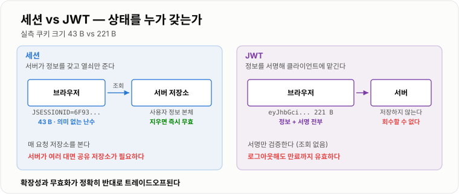
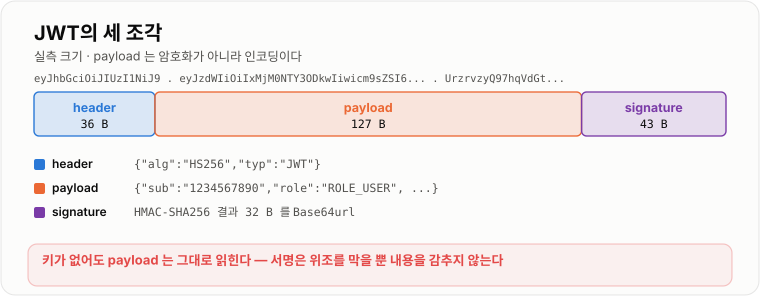

# 쿠키 · 세션 · JWT

> **HTTP는 매 요청을 초면처럼 대하므로, 신원은 요청마다 다시 증명해야 한다. 세션은 "표를 맡아 두고 번호표만 주는" 방식이고 JWT는 "위조 못 하는 신분증을 손에 쥐여 주는" 방식이다. 실측에서 번호표는 43 B, 신분증은 221 B였고, 신분증은 한 번 발급하면 회수할 방법이 없다.**

---

## 1. 핵심 요약

**HTTP는 상태가 없다(stateless). 그래서 "이 요청이 누구의 것인가"를 매번 다시 밝혀야 하고, 그 방법이 세션과 토큰이다. 둘의 차이는 상태를 서버가 갖느냐 클라이언트가 갖느냐이고, 거기서 확장성과 무효화가 정반대로 갈린다.**

### 한눈에 보기

* HTTP는 요청마다 독립이라 **서버는 방금 로그인한 사람도 다음 요청에서 알아보지 못한다.** 그래서 신원을 담은 무언가를 **매 요청에 실어 보낸다.**
* **쿠키는 그 "실어 보내는 수단"** 이지 인증 방식이 아니다. 세션 ID도 JWT도 쿠키에 담을 수 있다. 자주 헷갈리는 지점이다.
* **세션**은 서버가 사용자 정보를 들고 있고 클라이언트에는 **열쇠(세션 ID)만** 준다. 실측에서 톰캣 형식 세션 쿠키는 **43 B**였다(`JSESSIONID=` + 32자리 16진수).
* **JWT**는 사용자 정보를 **토큰 자체에 담고 서명**해서 클라이언트가 들고 다닌다. 같은 정보를 담은 JWT 쿠키는 **221 B로 세션 ID의 5.1배**였다.
* JWT는 `header.payload.signature` 세 조각이다. 실측 구성은 **header 36 B · payload 127 B · signature 43 B**였다.
* **payload는 암호화가 아니라 Base64url 인코딩일 뿐이다.** 키 없이 디코딩하니 `{"sub":"1234567890","name":"Hong Gildong","role":"ROLE_USER",...}`가 그대로 읽혔다. **서명은 "위조를 막을 뿐 내용을 감추지 않는다."**
* 크기 차이는 매 요청 누적된다. 요청 **100만 건 기준 169.8 MB**를 더 보낸다(요청당 178 B 차이).
* **서명 알고리즘 선택이 성능을 크게 가른다.** HS256 서명이 **2.48 µs(초당 402,606회)**, RS256 서명이 **2,258.3 µs(초당 442회)** 로 **909배** 차이였다.
* 다만 **RS256은 검증이 서명보다 훨씬 싸다.** 검증 **96.2 µs(초당 10,400회)** 로 서명의 23분의 1이다. **서명은 인증 서버 한 곳에서만, 검증은 모든 서비스에서** 일어나므로 이 비대칭이 실무에서 중요하다.
* **JWT의 진짜 약점은 크기가 아니라 무효화다.** 서버가 상태를 안 갖는다는 것은 **"로그아웃시킬 방법이 없다"** 는 뜻이기도 하다. 만료 전까지 그 토큰은 계속 유효하다.
* 그래서 실무는 **짧은 Access Token + 긴 Refresh Token**으로 절충한다. 무효화가 필요한 지점을 Refresh 한 곳으로 몰아 놓는 것이다.
* **쿠키 속성 세 개가 보안의 대부분을 결정한다.** `HttpOnly`(자바스크립트 차단) · `Secure`(HTTPS 전용) · `SameSite`(교차 사이트 전송 제어)다.

> 이 노트의 수치는 **JDK 17.0.12 (HotSpot) · Windows 11**에서 직접 측정했다. JWT는 표준 라이브러리(`javax.crypto.Mac`, `java.security.Signature`)로 직접 만들어 쟀고, RSA 키는 **2048비트**다. 크기는 `role`·`iat`·`exp`를 담은 현실적인 payload 기준이라 **클레임을 더 넣으면 더 커진다.**

### 무엇을 해결하는가

#### 해결하려는 문제

로그인 API를 만들었다. 아이디와 비밀번호를 확인하고 "로그인 성공"을 응답했다. 그런데 바로 다음 요청에서 문제가 생긴다.

```text
POST /login          →  "성공! 홍길동님 환영합니다"
GET  /orders/mine    →  "당신이 누구죠?"
```

**HTTP는 두 요청을 아무 관계 없는 남남으로 본다.** TCP 연결을 재사용하더라도 마찬가지다. 연결은 통로일 뿐 신원이 아니다.

#### 이 개념이 없을 때

신원을 실어 보낼 표준 수단이 없으면 이렇게 된다.

```java
// 방법 1 — 매 요청에 아이디·비밀번호를 다시 보낸다
GET /orders/mine?id=hong&password=1234
//   URL 에 비밀번호가 남는다. 로그·브라우저 기록·Referer 에 전부 찍힌다

// 방법 2 — 요청마다 사용자 정보를 직접 보낸다
GET /orders/mine?userId=1234&role=ADMIN
//   클라이언트가 role=ADMIN 으로 고쳐 보내면 그대로 관리자가 된다

// 방법 3 — IP 로 사람을 구분한다
//   같은 회사·같은 공유기의 사용자가 전부 한 사람이 된다
```

**세 방법 모두 "클라이언트가 보낸 값을 믿는다"는 같은 결함**을 갖는다. 필요한 것은 **클라이언트가 고칠 수 없는 신원 증표**다.

방법은 둘뿐이다.

```text
① 서버가 기억한다        클라이언트에겐 의미 없는 열쇠만 준다        → 세션
② 위조를 못 하게 만든다   내용은 보여도 고치면 서명이 깨지게 한다     → 토큰(JWT)
```

---

## 2. 동작 원리

### 핵심 구성 요소

| 요소 | 하는 일 | 어디에 있나 |
| --- | --- | --- |
| **쿠키** | 값을 저장하고 매 요청에 자동으로 붙인다 | 브라우저 |
| **세션 ID** | 서버의 세션 저장소를 가리키는 열쇠 | 쿠키에 담긴다 |
| **세션 저장소** | 사용자 정보 본체 | 서버 메모리 · Redis · DB |
| **JWT** | 사용자 정보 + 서명을 담은 문자열 자체 | 쿠키 또는 `Authorization` 헤더 |
| **서명 키** | 위조를 막는 열쇠 | 서버만 안다 |

### 내부 동작 과정

#### 세션 방식 — 서버가 기억한다



*세션은 서버가 정보를 들고 열쇠만 주고, JWT는 정보를 통째로 클라이언트에 맡긴다.*

```text
① 로그인
   POST /login  {id, pw}
   서버: 확인 → 세션 저장소에 {sessionId → 사용자 정보} 저장
   ◀── Set-Cookie: JSESSIONID=6F93932ED88F0CE47A68955F21FD9039

② 이후 모든 요청
   GET /orders/mine
   Cookie: JSESSIONID=6F93932ED88F0CE47A68955F21FD9039
   서버: 저장소에서 이 ID 로 사용자 정보를 찾는다 → 홍길동이구나
```

**세션 ID는 아무 의미가 없는 난수다.** 실측한 쿠키는 43 B였다.

```text
JSESSIONID=6F93932ED88F0CE47A68955F21FD9039
           └──── 128비트 난수를 16진수로 ────┘
```

의미가 없다는 것이 **장점**이다. 훔쳐도 정보가 없고, 서버에서 그 항목을 지우면 **즉시 무효**가 된다.

#### JWT 방식 — 클라이언트가 들고 다닌다

```text
① 로그인
   POST /login  {id, pw}
   서버: 확인 → 사용자 정보를 담아 서명한 토큰을 만든다 (저장하지 않는다)
   ◀── access_token=eyJhbGciOiJIUzI1NiIsInR5cCI6IkpXVCJ9.eyJzdWIiOi...

② 이후 모든 요청
   Authorization: Bearer eyJhbGciOi...
   서버: 서명만 검증한다 → 통과하면 payload 의 내용을 믿는다  (저장소 조회 없음)
```

**서버가 아무것도 저장하지 않는다는 것이 JWT의 전부**다. 좋은 점도 나쁜 점도 여기서 나온다.

#### JWT의 세 조각



*payload는 암호화가 아니라 인코딩이라 키 없이 그대로 읽힌다.*

```text
eyJhbGciOiJIUzI1NiIsInR5cCI6IkpXVCJ9 . eyJzdWIiOiIxMjM0NTY3ODkwIi... . UrzrvzyQ97hqVdGtMRAlHKuRhhbQYjbyt4Bzw7qwfFA
└────────── header 36 B ──────────┘   └───── payload 127 B ─────┘   └──────── signature 43 B ────────┘
```

실측 구성이다. 합쳐서 쿠키 이름까지 **221 B**였다.

**payload를 키 없이 디코딩한 결과다.**

```json
{"sub":"1234567890","name":"Hong Gildong","role":"ROLE_USER","iat":1700000000,"exp":1700003600}
```

**그대로 읽힌다.** Base64url은 암호화가 아니라 **인코딩**이기 때문이다.

```text
서명이 보장하는 것        내용이 바뀌지 않았다 (무결성)
서명이 보장하지 않는 것    내용을 남이 못 본다 (기밀성)
```

**그래서 JWT에 비밀번호·주민번호·내부 식별자를 담으면 안 된다.** 감추고 싶으면 JWE로 암호화하거나, 애초에 담지 않는다.

#### 서명과 검증 — HS256과 RS256

```text
HS256 (대칭)     하나의 비밀 키로 서명하고 같은 키로 검증한다
                 → 검증하는 쪽도 서명할 수 있다 = 토큰을 위조할 수 있다

RS256 (비대칭)   개인 키로 서명하고 공개 키로 검증한다
                 → 검증만 하는 서비스에는 공개 키만 주면 된다
```

실측한 성능이다.

```text
HS256 서명     2.48 us/회       초당 402,606 회
RS256 서명  2,258.3 us/회       초당     442 회      HS256 대비 909 배 느리다
RS256 검증     96.2 us/회       초당  10,400 회      RS256 서명의 1/23
```

**RS256의 서명과 검증이 23배나 차이 난다는 점이 설계에 중요하다.**

```text
인증 서버 1대       로그인할 때만 서명한다        → 초당 442 회면 대개 충분하다
서비스 서버 N대     매 요청마다 검증한다          → 초당 10,400 회 × N 대
```

**서명은 드물고 검증은 잦다.** RS256의 비싼 쪽이 드문 쪽이라 실무에서 감당이 된다. 그래도 HS256 검증보다는 훨씬 비싸므로, **단일 서비스라면 HS256이 합리적**이다.

#### 크기 비용은 매 요청 누적된다

```text
세션 ID 쿠키    43 B
JWT 쿠키       221 B      5.1 배, 요청당 178 B 더

요청 100만 건    169.8 MB 추가 전송
```

여기에 **클레임을 더 담으면 계속 커진다.** 권한 목록을 통째로 넣는 설계는 쉽게 1 KB를 넘고, 그러면 [HTTP 헤더](../HTTP-TCP-네트워크/HTTP-TCP-네트워크.md)에서 본 헤더 비대화가 그대로 나타난다.

#### JWT의 근본 문제 — 무효화

**서버가 상태를 안 갖는다는 것은 취소할 방법이 없다는 뜻이다.**

```text
세션    로그아웃 → 저장소에서 그 세션을 지운다 → 즉시 무효
JWT     로그아웃 → 클라이언트가 토큰을 버린다  → 서버는 모른다
                   훔쳐 간 사람은 만료까지 계속 쓸 수 있다
```

대응은 셋 중 하나다.

```text
① 만료를 짧게 잡는다        피해 시간을 줄인다. 근본 해결은 아니다
② 블랙리스트를 둔다          무효화한 토큰을 저장소에 기록한다
                            → 매 요청 저장소를 조회하게 되어 JWT 의 장점이 사라진다
③ Access + Refresh 로 나눈다  실무의 표준 절충안
```

#### Access Token과 Refresh Token

```text
Access Token    짧다 (5~30분)   API 호출에 쓴다        서버 조회 없음
Refresh Token   길다 (1~14일)   재발급에만 쓴다        서버에 저장한다 → 취소 가능

동작
  ① Access 로 API 를 부른다
  ② 만료되면 401
  ③ Refresh 로 새 Access 를 받는다   ← 이때만 서버 저장소를 본다
  ④ 로그아웃하면 Refresh 를 지운다   → 최대 Access 수명만큼 뒤에 완전히 차단된다
```

**무효화가 필요한 지점을 Refresh 한 곳으로 몰아넣은 설계다.** 매 요청 조회는 피하면서 취소 능력은 되찾는다. 대신 **Access 수명만큼의 빈틈은 남는다.** 그래서 Access를 짧게 잡는다.

#### 쿠키 속성이 보안을 정한다

```text
Set-Cookie: JSESSIONID=abc123; HttpOnly; Secure; SameSite=Lax; Path=/; Max-Age=1800
```

| 속성 | 무엇을 막는가 | 없으면 |
| --- | --- | --- |
| **HttpOnly** | 자바스크립트의 `document.cookie` 접근 | XSS로 세션을 통째로 훔쳐 간다 |
| **Secure** | HTTP(평문) 전송 | 중간에서 쿠키를 그대로 읽는다 |
| **SameSite** | 다른 사이트에서 시작된 요청에 쿠키 첨부 | CSRF에 노출된다 |
| **Path·Domain** | 전송 범위 | 필요 없는 곳까지 쿠키가 간다 |
| **Max-Age·Expires** | 수명 | 브라우저를 닫아도 남는다 |

`SameSite` 값은 셋이다.

```text
Strict   외부 사이트에서 온 요청에는 절대 안 붙는다 (외부 링크로 들어오면 로그아웃 상태로 보인다)
Lax      최상위 내비게이션(GET)에만 붙는다          ← 요즘 브라우저 기본값
None     항상 붙는다. 대신 Secure 필수             ← 크로스 사이트 API 를 쓸 때
```

**`SameSite=Lax`가 기본값이 되면서 단순 CSRF는 상당 부분 막혔다.** 자세한 것은 [인증 · 인가 · CORS · CSRF](../인증인가-CORS-CSRF/인증인가-CORS-CSRF.md)에서 다룬다.

---

## 3. 특징과 비교

| 구분          | 내용 |
| ----------- | -- |
| **장점**      | 세션은 서버가 상태를 쥐고 있어 **즉시 무효화**할 수 있고 쿠키가 작다(**43 B**). JWT는 저장소 조회 없이 서명 검증만으로 인증이 끝나 **서버 간 공유가 필요 없고**(HS256 검증 2.48 µs), 서비스가 여러 개여도 각자 검증한다. 쿠키 속성(`HttpOnly`·`Secure`·`SameSite`) 세 개로 주요 위협을 크게 줄인다. |
| **단점**      | 세션은 서버가 상태를 가져 **여러 대일 때 공유 저장소가 필요**하고 그것이 단일 장애점이 된다. JWT는 **무효화가 안 되고**(로그아웃해도 만료까지 유효) 크기가 **5.1배(221 B vs 43 B)** 라 요청 100만 건에 **169.8 MB**를 더 쓴다. payload는 **암호화가 아니라** 그대로 읽히고, RS256 서명은 **HS256의 909배** 느리다. |
| **적합한 상황**  | 세션 — 서버 대수가 적고 **즉시 로그아웃·강제 탈퇴가 중요한** 서비스(관리자 콘솔, 금융). JWT — 서비스가 여러 개로 나뉘어 **인증 정보를 공유하기 곤란한** 구조(MSA), 모바일·외부 파트너 API, 짧은 수명의 Access Token. |
| **주의할 상황**  | JWT를 **긴 만료로 단독 사용**하는 경우 — 탈취 시 회수할 방법이 없다. JWT에 **민감 정보나 권한 전체를 담는** 경우 — 노출되고 커진다. 세션을 **서버 메모리에만** 두고 여러 대로 늘리는 경우 — 요청마다 로그인 상태가 달라진다. **블랙리스트를 매 요청 조회**하는 JWT — 세션의 단점만 갖고 장점을 잃는다. |

### 성능 특성

#### 크기

```text
세션 ID 쿠키                 43 B      JSESSIONID= + 32자리 16진수
JWT 쿠키                    221 B      5.1 배
  header                     36 B      {"alg":"HS256","typ":"JWT"}
  payload                   127 B      sub · name · role · iat · exp
  signature                  43 B      HMAC-SHA256 → 32 B → Base64url
요청당 차이                  178 B
요청 100만 건 누적          169.8 MB
```

#### 서명·검증 (RSA 2048)

```text
알고리즘         연산     1회 소요        초당
HS256           서명      2.48 us      402,606 회
RS256           서명   2,258.3 us          442 회      HS256 서명 대비 909 배
RS256           검증      96.2 us       10,400 회      RS256 서명의 1/23
```

**서명은 인증 서버에서 드물게, 검증은 모든 서비스에서 자주 일어난다.** RS256의 비싼 쪽이 드문 쪽이라는 것이 이 조합이 쓰이는 이유다.

### 장점과 단점

#### 장점

* **세션은 즉시 끊을 수 있다.** 계정 도용 신고가 들어오면 저장소에서 지우는 것으로 끝난다.
* **세션 쿠키는 작고 정보가 없다.** 43 B이고 훔쳐도 그 안에서 얻을 정보가 없다.
* **JWT는 조회가 없다.** 검증이 HS256 기준 2.48 µs다. DB나 Redis를 거치지 않는다.
* **JWT는 서비스 간 공유가 쉽다.** 공개 키만 나눠 주면 각 서비스가 스스로 검증한다.

#### 단점

* **세션은 공유 저장소가 필요하다.** 서버가 여러 대면 메모리 세션은 못 쓴다. Redis를 쓰면 그것이 단일 장애점이 된다.
* **JWT는 회수가 안 된다.** 이것이 가장 큰 약점이고, 대부분의 JWT 사고가 여기서 나온다.
* **JWT는 크다.** 5.1배이고 클레임을 더하면 계속 커진다.
* **JWT는 내용이 보인다.** 실측에서 payload가 키 없이 그대로 읽혔다.
* **RS256은 서명이 비싸다.** 초당 442회는 로그인 폭주 시 병목이 될 수 있다.

### 어떤 상황에서 고르는가

```text
즉시 로그아웃·강제 탈퇴가 반드시 필요한가?
  예 → 세션 (또는 Refresh Token 을 서버에 저장)
  아니오 ↓

서비스가 여러 개로 나뉘어 있고 인증 저장소를 공유하기 어려운가?
  예 → JWT (짧은 Access + 서버 저장 Refresh)
  아니오 ↓

브라우저 단일 서비스인가?
  예 → 세션이 가장 단순하다. 기본값으로 삼는다
```

**"MSA니까 무조건 JWT"는 성급하다.** 서비스가 몇 개 안 되고 이미 Redis가 있다면 세션을 공유하는 편이 단순하고 안전하다.

### 비슷한 기술과 비교

#### 세션 vs JWT

| 기준 | 세션 | JWT |
| --- | --- | --- |
| 상태를 누가 갖나 | **서버** | **클라이언트** |
| 쿠키 크기 | **43 B** | 221 B (5.1배) |
| 요청당 저장소 조회 | **있다** | **없다** |
| 즉시 무효화 | **된다** | **안 된다** |
| 서버 확장 | 공유 저장소 필요 | **필요 없다** |
| 내용 노출 | 없다 (의미 없는 난수) | **그대로 읽힌다** |
| 서버 장애 시 | 저장소가 죽으면 전원 로그아웃 | 계속 동작한다 |
| 주로 쓰는 곳 | 브라우저 단일 서비스 | MSA · 모바일 · 외부 API |

#### HS256 vs RS256

| 기준 | HS256 (대칭) | RS256 (비대칭) |
| --- | --- | --- |
| 키 | 하나의 비밀 키 | 개인 키 + 공개 키 |
| 서명 실측 | **2.48 µs** | 2,258.3 µs (**909배**) |
| 검증 실측 | 2.48 µs | 96.2 µs |
| 검증자가 위조 가능한가 | **가능하다** (같은 키) | **불가능하다** (공개 키뿐) |
| 키 배포 | 모든 검증자에게 비밀 키를 줘야 한다 | **공개 키만 주면 된다** |
| 쓸 곳 | **단일 서비스** | **여러 서비스 · 외부 공개** |

**HS256의 진짜 문제는 성능이 아니라 신뢰 범위다.** 검증하려면 서명 키가 필요한데, 그 키를 받은 서비스는 토큰을 만들어 낼 수도 있다.

#### 토큰을 어디에 담을까

| 기준 | 쿠키 | `Authorization` 헤더 |
| --- | --- | --- |
| 자동 전송 | **브라우저가 알아서** | 코드가 직접 붙인다 |
| XSS | `HttpOnly`면 **자바스크립트가 못 읽는다** | 저장 위치(localStorage)가 읽힌다 |
| CSRF | **노출된다** (자동 전송이라) | **거의 없다** (자동으로 안 붙는다) |
| 크로스 도메인 | `SameSite=None; Secure` 필요 | 자유롭다 |
| 모바일 앱 | 불편하다 | **자연스럽다** |

**쿠키는 CSRF에, 헤더+localStorage는 XSS에 약하다.** 브라우저라면 **`HttpOnly` 쿠키 + CSRF 토큰** 조합이 가장 무난하다.

---

## 4. 실무 주의사항

### 백엔드 실무 적용

#### 서버가 여러 대가 되는 순간 메모리 세션은 깨진다

```text
사용자 → 로드밸런서 → 서버 A 에서 로그인 (서버 A 메모리에 세션 저장)
       → 다음 요청이 서버 B 로 감 → "누구세요?"
```

해결책은 셋이다.

```text
① Sticky Session   같은 사용자를 같은 서버로 보낸다
                   → 그 서버가 죽으면 세션이 통째로 사라진다. 배포할 때마다 로그아웃된다
② 세션 클러스터링   서버끼리 세션을 복제한다
                   → 서버 수에 따라 복제 비용이 제곱으로 는다
③ 외부 저장소      Redis 같은 공유 저장소에 둔다        ← 사실상 표준
```

```java
// Spring Session — 의존성과 설정 몇 줄로 세션 저장소를 Redis 로 옮긴다
@EnableRedisHttpSession(maxInactiveIntervalInSeconds = 1800)
public class SessionConfig { }
```

```yaml
spring:
  session:
    store-type: redis
  data:
    redis:
      host: redis.internal
server:
  servlet:
    session:
      cookie:
        http-only: true
        secure: true
        same-site: lax
```

#### 로그인 성공 시 세션 ID를 반드시 새로 발급한다

**세션 고정(Session Fixation) 공격**을 막는 처리다.

```text
① 공격자가 사이트에 접속해 세션 ID 를 하나 받는다 (abc123)
② 피해자에게 그 ID 를 심는다 (링크·XSS 등)
③ 피해자가 그 ID 로 로그인한다
④ 서버가 ID 를 그대로 두고 인증 상태만 올리면
   → 공격자가 갖고 있던 abc123 이 그대로 로그인된 세션이 된다
```

```java
// Spring Security 기본값이 newSession 이라 대개 자동으로 막힌다.
// 직접 구현할 때는 반드시 재발급한다
public void onLoginSuccess(HttpServletRequest request, User user) {
    HttpSession old = request.getSession(false);
    if (old != null) old.invalidate();          // 기존 세션을 버리고
    HttpSession fresh = request.getSession(true);   // 새 ID 를 발급한다
    fresh.setAttribute("userId", user.getId());
}
```

#### JWT에 담을 것과 담지 말 것

```java
// 나쁜 예 — 노출되고, 커지고, 낡는다
{
  "sub": "1234",
  "password": "...",              // 절대 안 된다. 그대로 읽힌다
  "ssn": "900101-1234567",        // 개인정보. Base64 는 암호화가 아니다
  "permissions": [ ... 200개 ... ] // 토큰이 수 KB 가 된다
}

// 좋은 예 — 작고, 노출돼도 되고, 자주 안 바뀌는 것만
{
  "sub": "1234",
  "role": "ROLE_USER",
  "iat": 1700000000,
  "exp": 1700001800                // 30분
}
```

**"권한이 바뀌어도 토큰은 안 바뀐다"는 점도 중요하다.** 관리자 권한을 회수해도 이미 발급된 토큰에는 `ROLE_ADMIN`이 남아 있다. 만료될 때까지 그대로다.

#### 로그아웃을 실제로 동작하게 만들기

```java
@PostMapping("/logout")
public ResponseEntity<Void> logout(@CookieValue("refresh_token") String refreshToken,
                                   HttpServletResponse response) {
    // 1. Refresh Token 을 서버에서 지운다 → 더 이상 재발급이 안 된다
    refreshTokenStore.delete(refreshToken);

    // 2. 쿠키를 만료시킨다 (같은 속성으로 덮어써야 지워진다)
    ResponseCookie expired = ResponseCookie.from("refresh_token", "")
            .httpOnly(true).secure(true).sameSite("Lax").path("/").maxAge(0).build();
    response.addHeader(HttpHeaders.SET_COOKIE, expired.toString());

    // 3. Access Token 은 못 지운다 — 만료(예: 15분)까지는 유효하다
    //    그래서 Access 수명을 짧게 잡는 것이 곧 보안 설정이다
    return ResponseEntity.noContent().build();
}
```

#### Refresh Token 회전(rotation)

Refresh Token이 탈취되면 공격자가 계속 Access를 발급받을 수 있다. **재발급 때마다 Refresh도 새로 주고 옛것을 폐기**하면 탈취를 감지할 수 있다.

```text
정상    Refresh#1 로 재발급 → Refresh#2 발급, #1 폐기
탈취    공격자가 #1 로 재발급 시도 → 이미 폐기된 토큰이 쓰였다
        → "탈취됐다"고 판단하고 그 사용자의 토큰 전부를 무효화한다
```

#### 쿠키는 지울 때도 속성을 맞춰야 한다

```java
// 흔한 사고 — Path 나 Domain 이 다르면 지워지지 않는다
// 만들 때: Path=/; Domain=.example.com
// 지울 때: Path=/  만 주면  →  안 지워진다
```

### 자주 하는 오해

| 잘못된 이해 | 올바른 이해 |
| --- | --- |
| "쿠키와 세션은 다른 인증 방식이다" | 쿠키는 **운반 수단**이다. 세션 ID도 JWT도 쿠키에 담긴다. |
| "JWT는 암호화되어 있어 안전하다" | **인코딩일 뿐이다.** 실측에서 키 없이 payload가 그대로 읽혔다. |
| "서명이 있으니 내용을 감출 수 있다" | 서명은 **무결성**만 보장한다. 기밀성은 JWE의 몫이다. |
| "JWT는 상태가 없어 로그아웃도 잘 된다" | **로그아웃이 가장 어려운 부분**이다. 만료 전까지 계속 유효하다. |
| "블랙리스트를 두면 JWT의 무효화 문제가 해결된다" | 매 요청 저장소를 조회하게 되어 **JWT의 장점이 사라진다.** 세션과 다를 게 없어진다. |
| "JWT가 세션보다 빠르다" | 조회는 없지만 **크기가 5.1배**다. 요청 100만 건에 169.8 MB를 더 쓴다. |
| "HS256이 RS256보다 안전하다" | 성능은 **909배** 빠르지만, 검증자가 서명 키를 갖게 되어 **위조가 가능**해진다. |
| "RS256은 느려서 못 쓴다" | 느린 것은 **서명(초당 442회)** 이고 검증은 초당 10,400회다. 서명은 드물게 일어난다. |
| "권한을 토큰에 담으면 조회가 없어 좋다" | 권한을 회수해도 **토큰에는 남는다.** 만료까지 그대로다. |
| "메모리 세션도 서버를 늘리면 알아서 공유된다" | 안 된다. Sticky Session·클러스터링·외부 저장소 중 하나를 골라야 한다. |
| "Sticky Session이면 충분하다" | 그 서버가 죽거나 **배포할 때마다 로그아웃**된다. |
| "로그인해도 세션 ID는 그대로 둬도 된다" | **세션 고정 공격**에 노출된다. 로그인 시 반드시 재발급한다. |
| "`HttpOnly`면 XSS로부터 안전하다" | 쿠키 탈취는 막지만 **XSS 자체는 그대로**다. 공격자는 사용자 대신 요청을 보낼 수 있다. |
| "`SameSite=Lax`면 CSRF는 신경 안 써도 된다" | 상당 부분 막히지만 **`GET`으로 상태를 바꾸는 API**나 `SameSite=None`이 필요한 구조에서는 여전히 위험하다. |
| "쿠키는 이름만 같으면 지워진다" | `Path`·`Domain`까지 **같아야** 지워진다. |

---

## 5. 예제

### JWT를 직접 만들어 보기 (라이브러리 없이)

```java
// 실측에 쓴 코드 — JWT 가 특별한 형식이 아니라는 것을 보여 준다
Base64.Encoder B64 = Base64.getUrlEncoder().withoutPadding();

String header  = "{\"alg\":\"HS256\",\"typ\":\"JWT\"}";
String payload = "{\"sub\":\"1234567890\",\"role\":\"ROLE_USER\",\"exp\":1700003600}";

String h = B64.encodeToString(header.getBytes(StandardCharsets.UTF_8));
String p = B64.encodeToString(payload.getBytes(StandardCharsets.UTF_8));

Mac hmac = Mac.getInstance("HmacSHA256");
hmac.init(new SecretKeySpec(secret, "HmacSHA256"));
String sig = B64.encodeToString(hmac.doFinal((h + "." + p).getBytes(StandardCharsets.US_ASCII)));

String token = h + "." + p + "." + sig;
```

### payload가 감춰지지 않는다는 것을 확인하기

```java
// 서명 키가 전혀 없어도 내용은 읽힌다
String payloadPart = token.split("\\.")[1];
String decoded = new String(Base64.getUrlDecoder().decode(payloadPart), StandardCharsets.UTF_8);
System.out.println(decoded);
// {"sub":"1234567890","role":"ROLE_USER","exp":1700003600}
```

### 검증 — 서명뿐 아니라 만료도 본다

```java
public Claims verify(String token) {
    String[] parts = token.split("\\.");
    if (parts.length != 3) throw new InvalidTokenException("형식이 아니다");

    // 1. 서명 검증 — 타이밍 공격을 피해 상수 시간 비교를 쓴다
    byte[] expected = hmac.doFinal((parts[0] + "." + parts[1]).getBytes(US_ASCII));
    byte[] actual = Base64.getUrlDecoder().decode(parts[2]);
    if (!MessageDigest.isEqual(expected, actual)) {
        throw new InvalidTokenException("서명이 맞지 않는다");
    }

    // 2. 만료 검증 — 서명이 맞아도 만료된 토큰은 거부한다
    Claims claims = parse(parts[1]);
    if (claims.exp() < Instant.now().getEpochSecond()) {
        throw new ExpiredTokenException("만료됐다");
    }

    // 3. alg 를 신뢰하지 않는다 — 헤더의 alg 를 그대로 쓰면 "alg: none" 공격에 당한다
    if (!"HS256".equals(claims.alg())) {
        throw new InvalidTokenException("허용하지 않는 알고리즘");
    }
    return claims;
}
```

> **`alg: none` 공격** — 공격자가 헤더의 `alg`를 `none`으로 바꾸고 서명을 지운 토큰을 보낸다. 라이브러리가 헤더의 `alg`를 그대로 믿으면 **서명 검증을 건너뛴다.** 검증할 알고리즘은 **서버가 정해 놓고** 써야 한다.

### 안전한 쿠키 설정

```java
ResponseCookie cookie = ResponseCookie.from("refresh_token", token)
        .httpOnly(true)          // 자바스크립트가 못 읽는다
        .secure(true)            // HTTPS 에서만 전송
        .sameSite("Lax")         // 교차 사이트 요청에는 안 붙는다
        .path("/auth")           // 필요한 경로에만 보낸다
        .maxAge(Duration.ofDays(14))
        .build();
response.addHeader(HttpHeaders.SET_COOKIE, cookie.toString());
```

---

## 6. 면접 정리

### 자주 나오는 질문

#### 기본 질문

1. **HTTP가 stateless인데 로그인 상태는 어떻게 유지하는가?**

    * 핵심 키워드: 매 요청 신원 증명 · 쿠키는 운반 수단 · 세션 ID · 토큰

2. **세션과 JWT의 차이는 무엇인가?**

    * 핵심 키워드: 상태를 누가 갖나 · 저장소 조회 · 무효화 가능 여부 · 크기 43 B vs 221 B

3. **JWT는 어떻게 구성되어 있는가?**

    * 핵심 키워드: header · payload · signature · Base64url · 서명은 무결성만

4. **쿠키의 `HttpOnly`·`Secure`·`SameSite`는 각각 무엇을 막는가?**

    * 핵심 키워드: XSS 탈취 · 평문 전송 · CSRF

5. **서버가 여러 대일 때 세션을 어떻게 공유하는가?**

    * 핵심 키워드: Sticky Session · 클러스터링 · Redis 외부 저장소

#### 꼬리 질문

1. **JWT로 로그아웃을 구현하려면 어떻게 하는가?**

    * 핵심 키워드: 서버가 모른다 · 짧은 Access · Refresh 삭제 · 블랙리스트의 대가

2. **JWT에 개인정보를 담아도 되는가?**

    * 핵심 키워드: Base64url은 인코딩 · 키 없이 디코딩됨 · JWE

3. **HS256과 RS256은 어떤 기준으로 고르는가?**

    * 핵심 키워드: 대칭 vs 비대칭 · 검증자가 위조 가능 · 909배 · 검증은 싸다

4. **토큰을 쿠키에 담을지 헤더에 담을지 어떻게 정하는가?**

    * 핵심 키워드: `HttpOnly`와 XSS · 자동 전송과 CSRF · 모바일

5. **로그인 시 세션 ID를 새로 발급해야 하는 이유는?**

    * 핵심 키워드: 세션 고정 공격 · 미리 심어 둔 ID · `invalidate` 후 재발급

### 30초 답변

> HTTP는 상태가 없어서 **매 요청마다 신원을 다시 밝혀야** 합니다. 방법은 두 가지인데, **세션**은 서버가 정보를 갖고 클라이언트에 열쇠만 주고, **JWT**는 정보를 서명해서 클라이언트가 들고 다닙니다. 실측하면 쿠키가 **43 B 대 221 B**로 5.1배 차이 나고, 더 중요한 차이는 **세션은 즉시 무효화되지만 JWT는 만료 전까지 회수할 수 없다**는 것입니다.

### 핵심 키워드

`stateless` · `쿠키는 운반 수단` · `세션 ID` · `세션 저장소` · `Sticky Session` · `세션 고정 공격` · `JWT` · `Base64url` · `무결성 vs 기밀성` · `HS256 / RS256` · `Access / Refresh Token` · `토큰 회전` · `alg: none` · `HttpOnly` · `Secure` · `SameSite`

### 이어서 볼 주제

* **인증 · 인가 · CORS · CSRF** — 이 신원 증표를 실제로 검사하는 필터 체인과 교차 사이트 공격.
* **HTTP · TCP 네트워크** — 매 요청 실려 가는 헤더 크기가 왜 비용인지.
* **REST와 API 설계** — 401과 403을 어떻게 나눠 응답할지.
* **Redis 자료구조와 활용** — 세션 저장소와 Refresh Token 저장소로서의 Redis.
* **캐시 전략과 정합성** — 세션 저장소가 죽었을 때의 파급과 대비.
