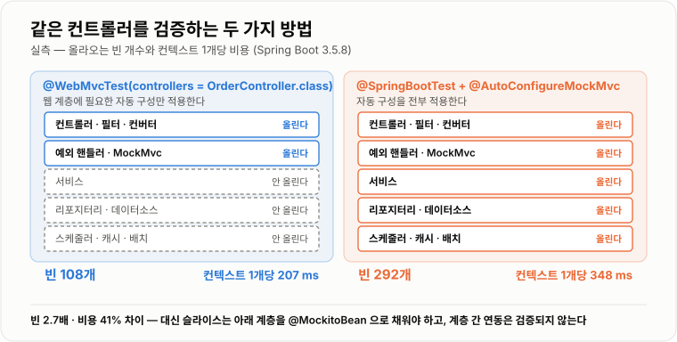
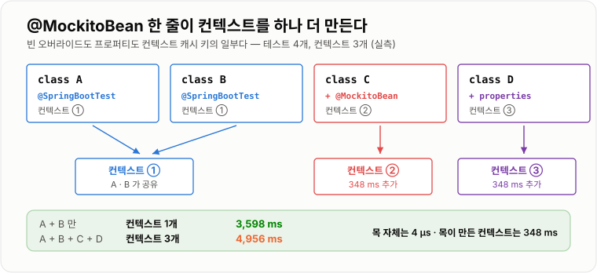

# Mock · Spring Test · Testcontainers

> **가짜를 쓰는 이유는 빠르기 때문이 아니다. 실측에서 Mockito 목 호출은 4,331 ns로 손으로 만든 페이크(7.0 ns)의 621배였다. 가짜의 값어치는 속도가 아니라 "아직 없는 것·부르기 곤란한 것·재현하기 어려운 것"을 다룰 수 있다는 데 있고, 진짜가 필요한 순간에는 Testcontainers로 진짜를 띄우는 편이 낫다.**

---

## 1. 핵심 요약

**테스트에서 협력 객체를 다루는 방법은 세 가지다 — 손으로 가짜를 만들거나(페이크), 라이브러리로 가짜를 찍어 내거나(Mockito), 진짜를 컨테이너로 띄우거나(Testcontainers). 어느 쪽이 옳은지는 "무엇을 검증하려는가"가 정하고, 스프링에서는 여기에 "컨텍스트를 얼마나 띄울 것인가"라는 축이 하나 더 붙는다.**

### 한눈에 보기

* **목(mock)은 공짜가 아니다.** 실측에서 스텁 호출 한 번이 **4,331 ns**였고, 같은 일을 하는 **손으로 만든 페이크는 7.0 ns · 실제 구현은 3.6 ns**였다. **621배**다.
* 이 비용이 어디서 오는지 세 가지 가설을 세워 전부 확인해 봤는데 **셋 다 아니었다.** 누적 호출 수와 무관했고(1천 회든 40만 회든 3.5~4.5 µs), 스택 깊이와도 무관했으며(0~300 프레임에서 차이 없음), 인라인 목 메이커 탓도 아니었다(서브클래스 방식도 3,825 ns). **프록시 호출 한 번의 고정 비용**으로 보는 것이 정확하다.
* 그래도 **테스트에서는 문제가 안 된다.** 테스트 하나가 목을 몇 번 부르겠는가. 4 µs는 **테스트 250,000번 호출해야 1초**다. 문제가 되는 곳은 따로 있다.
* **목은 호출을 전부 기록한다.** 실측에서 호출 **1회당 301 B**를 붙들고 있었고, **100만 회 부르니 힙 287 MB**를 먹었다. 반복문 안에서 목을 부르는 테스트는 실제로 `OutOfMemoryError`를 냈다 — 이 노트를 쓰다가 겪었다.
* **`mock()` 첫 호출은 1,011 ms다.** 바이트코드를 만들어 붙이기 때문이고, 두 번째부터는 **100.6 µs**다. `when().thenReturn()`이 **105.9 µs**, `verify()`가 **36.4 µs**다.
* **스프링 테스트의 진짜 비용은 목이 아니라 컨텍스트다.** `@SpringBootTest`는 빈 **292개**, `@WebMvcTest` 슬라이스는 **108개**로 **2.7배** 차이였고, 컨텍스트 하나를 만드는 값이 **348 ms vs 207 ms(41% 절감)** 였다.
* **`@MockitoBean` 한 줄이 컨텍스트를 하나 더 만든다.** 목 오버라이드는 **캐시 키의 일부**이기 때문이다. 실측에서 테스트 4개 중 설정이 같은 둘은 컨텍스트를 공유했지만, `@MockitoBean`을 붙인 하나와 프로퍼티 한 줄이 다른 하나가 각각 새 컨텍스트를 만들어 **컨텍스트가 3개**가 됐다(3,598 ms → 4,956 ms).
* **Testcontainers는 진짜 DB·Redis·Kafka를 도커로 띄워 테스트한다.** H2 같은 대체품이 만드는 "테스트는 통과하는데 운영에서 깨지는" 문제를 없앤다.
* **다만 이 환경에는 도커가 없어 Testcontainers는 실측하지 못했다.** 이 노트에서 Testcontainers 관련 수치는 제시하지 않는다.

> 이 노트의 수치는 **JDK 17.0.12 (HotSpot) · Windows 11 · 6코어**에서 직접 측정했다. **Mockito 5.17.0 · Spring 6.2.14 · Spring Boot 3.5.8 · JUnit 5.12.2**를 썼다. 각 측정은 워밍업 뒤 7~9회 반복의 **중앙값**이고, 컨텍스트 측정은 **깨끗한 JVM에서 그룹마다 따로** 돌렸다.

### 무엇을 해결하는가

#### 해결하려는 문제

주문 서비스가 결제 게이트웨이를 부른다고 하자.

```java
class OrderService {
    private final PaymentGateway gateway;      // 외부 결제사 API

    void place(Order order) {
        PaymentResult r = gateway.pay(order.amount());
        if (r.isFailed()) throw new PaymentFailedException();
        repo.save(order);
    }
}
```

"결제가 실패하면 주문이 저장되지 않는다"를 테스트하고 싶다. 그런데 진짜 결제사를 부르면 이렇게 된다.

```text
① 실제로 돈이 나간다
② 결제사가 점검 중이면 테스트가 깨진다        내 코드는 멀쩡한데
③ "실패" 상황을 만들 수가 없다               일부러 실패시킬 방법이 없다
④ 느리다                                    네트워크 왕복
```

**③이 핵심이다.** 실패·타임아웃·잔액 부족 같은 경로는 **진짜로는 재현할 방법이 없다.** 테스트에서 확인해야 할 것이 대부분 그런 경로인데도 그렇다.

#### 이 개념이 없을 때

가짜를 만들 방법이 없으면 코드를 이렇게 비틀게 된다.

```java
// 방법 1 — 테스트용 플래그를 코드에 심는다
void place(Order order) {
    if (TEST_MODE) { /* 결제를 건너뛴다 */ }    // 운영 코드에 테스트 분기가 남는다
}

// 방법 2 — 결제사 응답을 흉내 내는 서버를 따로 띄운다
//   관리할 것이 하나 더 늘고, 그 서버가 진짜와 달라지면 테스트는 거짓말을 한다

// 방법 3 — 그냥 테스트하지 않는다
//   실패 경로가 검증 없이 운영에 나간다. 가장 흔한 선택이다
```

필요한 것은 **"이 인터페이스는 이렇게 응답한다고 치자"** 를 테스트 안에서 선언하는 수단이다.

```java
// 목이 하는 일은 이 한 줄이다
given(gateway.pay(30000)).willThrow(new PaymentTimeoutException());
```

그리고 정반대 문제도 있다. **가짜로 다 채워 놓으면 진짜로 도는지 알 수 없다.**

```java
// H2 로 테스트하고 MySQL 로 운영할 때
@Test void 주문을_조회한다() {
    // H2 에서는 통과한다
    // MySQL 에서는 예약어 충돌, 함수 이름 차이, 정렬 규칙 차이로 깨진다
}
```

**이 두 방향의 요구를 동시에 만족시킬 수는 없다.** 그래서 도구가 여러 개이고, 각각 다른 지점을 맡는다.

```text
페이크 · 목          "부르기 곤란한 것"을 대신한다
슬라이스 테스트       "필요한 계층만" 진짜로 띄운다
Testcontainers      "진짜와 달라서 생기는 문제"를 없앤다
```

---

## 2. 동작 원리

### 핵심 구성 요소

| 요소 | 하는 일 | 실측 비용 |
| --- | --- | --- |
| **페이크** | 손으로 만든 단순 구현 | 호출 **7.0 ns** |
| **Mockito 목** | 인터페이스를 구현한 프록시를 만들어 준다 | 호출 **4,331 ns** |
| **`@MockitoBean`** | 컨텍스트의 빈을 목으로 갈아 끼운다 | **컨텍스트가 하나 더 생긴다** |
| **`MockMvc`** | 서블릿 컨테이너 없이 요청을 흉내 낸다 | 톰캣을 안 띄운다 |
| **슬라이스(`@WebMvcTest` 등)** | 계층 하나에 필요한 빈만 올린다 | 컨텍스트당 **207 ms** |
| **`@SpringBootTest`** | 자동 구성을 전부 적용한다 | 컨텍스트당 **348 ms** |
| **Testcontainers** | 진짜 미들웨어를 도커로 띄운다 | (이 환경에서 미측정) |

### 내부 동작 과정

#### Mockito가 목을 만드는 방법

`mock(OrderRepository.class)`를 부르면 Mockito는 **그 인터페이스를 구현한 클래스를 실행 중에 만들어 낸다.**

```text
mock(Repo.class)
  → Byte Buddy 가 Repo 를 구현한 클래스를 바이트코드로 생성한다
  → 모든 메서드는 "Mockito 에게 물어보는" 코드로 채워진다
  → 그 클래스의 인스턴스를 돌려준다
```

그래서 **첫 호출이 유난히 비싸다.**

```text
mock() 최초         1,011 ms      바이트코드 생성 + 클래스 로딩
mock() 이후           100.6 us     같은 클래스를 재사용한다
when().thenReturn()   105.9 us
verify()               36.4 us
```

목의 메서드를 부르면 이런 일이 일어난다.

```text
repo.findById(1)
  ① 호출을 Invocation 객체로 만든다        (인자·메서드·호출 위치)
  ② 기록해 둔다                            ← verify() 를 위해 필요하다
  ③ 등록된 스텁 중 인자가 맞는 것을 찾는다
  ④ 있으면 그 값을, 없으면 기본값(null·0·false)을 돌려준다
```

**②가 목의 정체성이자 대가다.** 호출을 기록해 두기 때문에 나중에 `verify(repo).save(any())`로 물어볼 수 있고, 동시에 **모든 호출이 메모리에 쌓인다.**

#### 목 호출이 4 µs인 이유 — 세 가지 가설을 확인해 봤다

같은 인터페이스를 세 방식으로 구현해 호출 비용을 쟀다.

```text
실제 구현 (HashMap 조회)         3.6 ns
손으로 만든 페이크                7.0 ns
Mockito 목                    4,331.0 ns        페이크의 621 배
```

**4 µs는 프록시 호출치고도 크다.** 어디서 오는지 궁금해서 세 가지를 확인했다.

```text
가설 ① 기록이 쌓여서 점점 느려진다
   → 아니다. 누적 호출 1천 회에서 4,864 ns, 40만 회에서 3,555 ns.
      오히려 비슷하거나 줄었다. 누적량과 무관하다.

가설 ② 호출 위치(스택 트레이스)를 캡처하느라 비싸다
   → 아니다. 스택 깊이를 0 · 20 · 60 · 140 · 300 프레임으로 바꿔 재도
      3,890~4,794 ns 로 경향이 없었다. 깊이에 비례하지 않는다.

가설 ③ Mockito 5 의 기본값인 인라인 목 메이커가 느린 것이다
   → 거의 아니다. mock-maker-subclass 로 바꿔도 3,825 ns 로 12% 만 줄었다.
      stubOnly() 로 기록을 꺼도 3,579 ns 로 17% 였다.
```

**세 가설이 다 빗나갔다.** 남는 결론은 **"프록시 한 번을 지나가는 고정 비용이 그만큼"** 이라는 것이다. 원인을 모른 채로 수치만 갖는 것이 불편하지만, **모르는 것을 안다고 쓰는 것보다는 낫다.**

그리고 실무적으로는 이 4 µs가 문제가 아니다.

```text
테스트 하나가 목을 10번 부른다면      40 us
테스트 2,000개면                     80 ms

→ 무시할 수 있다. 앞 노트의 컨텍스트 로드 265 ms 하나보다도 작다
```

#### 정말 문제가 되는 것 — 목은 호출을 전부 기억한다

목을 반복문 안에서 부르면 기록이 계속 쌓인다. 실제로 재 봤다.

```text
호출 1,000,000 회 → 힙 287 MB 사용
호출 1회당                301 B
```

이 노트를 쓰면서 **처음에 200만 번 반복하는 벤치마크를 돌렸다가 `OutOfMemoryError`를 냈다.** 목은 "임시 객체"처럼 보이지만 **호출 이력을 붙들고 있는 컬렉션**이기도 하다.

```java
// 위험 — 목이 100만 개의 호출 기록을 쥔다
@Test void 대량_처리를_검증한다() {
    OrderRepository repo = mock(OrderRepository.class);
    for (int i = 0; i < 1_000_000; i++) {
        service.process(i);       // 내부에서 repo 를 부른다
    }
}

// 대안 ① 손으로 만든 페이크를 쓴다 (기록하지 않는다)
// 대안 ② mock(Repo.class, withSettings().stubOnly())   ← verify() 를 포기하는 대신 기록 안 함
```

#### 스프링 테스트 — 진짜 비용은 컨텍스트에 있다

목이 4 µs인 데 반해, 컨텍스트는 수백 ms다. **스프링 테스트에서 아껴야 할 것은 목이 아니라 컨텍스트다.**



*같은 컨트롤러를 검증하는데 한쪽은 빈 108개, 다른 쪽은 292개를 만든다.*

같은 컨트롤러 검증을 두 방식으로 만들어 빈 개수와 시간을 쟀다.

```text
                                        빈 개수    컨텍스트 1개당
@SpringBootTest + @AutoConfigureMockMvc    292        348 ms
@WebMvcTest (컨트롤러 1개)                  108        207 ms

                                          2.7 배     41% 절감
```

컨텍스트 1개당 값은 이렇게 뽑았다.

```text
전체:    컨텍스트 1개 3,682 ms → 6개 5,423 ms   → (5,423-3,682)/5 = 348 ms
슬라이스: 컨텍스트 1개 3,085 ms → 6개 4,119 ms   → (4,119-3,085)/5 = 207 ms
```

슬라이스가 하는 일은 단순하다. **필요 없는 자동 구성을 아예 적용하지 않는 것**이다.

```text
@SpringBootTest    전부 올린다        컨트롤러 · 서비스 · 리포지터리 · 데이터소스 · 스케줄러 …
@WebMvcTest        웹 계층만          컨트롤러 · 필터 · 컨버터 · 예외 핸들러 · MockMvc
@DataJpaTest       영속 계층만        엔티티 · 리포지터리 · 내장 DB · 트랜잭션
@JsonTest          직렬화만           ObjectMapper · 직렬화기
```

슬라이스는 **웹 계층 아래를 비워 두므로**, 서비스는 목으로 채워 넣어야 한다. 그게 `@MockitoBean`이다.

#### `@MockitoBean` 한 줄이 컨텍스트를 하나 더 만든다

빈을 목으로 갈아 끼우면 **그 컨텍스트는 다른 컨텍스트가 된다.** 당연하다 — 안에 든 빈이 다르니까. 문제는 이것이 **캐시 키에 들어간다**는 점이다.



*테스트는 4개인데 컨텍스트가 3개다. 애너테이션 한 줄이 348 ms를 만든다.*

```java
@SpringBootTest                       class A { @Test void t() {} }
@SpringBootTest                       class B { @Test void t() {} }   // A 와 같은 컨텍스트
@SpringBootTest                       class C { @MockitoBean OrderService svc; ... }
@SpringBootTest(properties = "app.feature=on")  class D { ... }
```

실제로 돌려 보면 이렇다.

```text
A + B 만            → 컨텍스트 1개   3,598 ms
A + B + C + D       → 컨텍스트 3개   4,956 ms

테스트는 4개인데 컨텍스트가 3개다
```

**`@MockitoBean` 한 줄과 프로퍼티 한 줄이 각각 컨텍스트를 하나씩 더 만들었다.** 목이 비싼 게 아니라 **목을 주입한 컨텍스트가 따로 만들어지는 것**이 비싸다.

```text
목의 직접 비용        4 us
목이 만든 컨텍스트     348 ms        87,000 배
```

#### MockMvc — 톰캣 없이 웹 계층을 부른다

`MockMvc`는 **HTTP를 실제로 주고받지 않는다.** 서블릿 요청·응답 객체를 만들어 `DispatcherServlet`에 직접 밀어 넣는다.

```text
실제 요청       클라이언트 → TCP → 톰캣 → DispatcherServlet → 컨트롤러
MockMvc                          MockHttpServletRequest → DispatcherServlet → 컨트롤러
                                 └ 네트워크도 톰캣도 없다 ┘
```

덕분에 빠르고 안정적이지만 **못 보는 것도 있다.**

```text
확인된다      URL 매핑 · 파라미터 바인딩 · 검증 · 직렬화 · 예외 처리 · 시큐리티 필터
확인 안 된다   실제 커넥션 · HTTP/2 · 압축 · 톰캣 설정 · 타임아웃 · 포트 바인딩
```

진짜 서버까지 봐야 하면 `@SpringBootTest(webEnvironment = RANDOM_PORT)`로 톰캣을 띄우고 `TestRestTemplate`으로 실제 요청을 보낸다. **그만큼 비싸진다**(앞 노트 265 ms).

#### Testcontainers — 진짜를 띄운다

대체품으로 테스트하면 **대체품에서만 통과하는 코드**가 나온다.

```sql
-- H2 에서는 통과하고 MySQL 에서는 깨지는 예
SELECT rank FROM member;               -- MySQL 8 에서 rank 는 예약어다
SELECT GROUP_CONCAT(name) FROM ...;    -- 함수 지원 범위가 다르다
ORDER BY name;                         -- 정렬 규칙(collation)이 다르다
```

Testcontainers는 **테스트가 시작될 때 도커 컨테이너를 띄우고 끝나면 지운다.**

```text
① 테스트 시작 → MySQL 8.0 컨테이너 기동
② JDBC URL·계정을 스프링 프로퍼티에 동적으로 주입
③ 테스트 실행 (진짜 MySQL 이다)
④ 테스트 종료 → 컨테이너 정리
```

대가는 **기동 시간**이다. 컨테이너를 띄우는 데 수 초가 걸리므로, 클래스마다 새로 띄우면 통합 테스트가 감당이 안 된다. 그래서 **컨테이너를 `static`으로 잡아 JVM 하나에서 재사용**하는 것이 기본 패턴이다.

!!! warning "이 노트에서 Testcontainers 수치를 제시하지 않는 이유"

    측정 환경에 **도커가 설치되어 있지 않아** Testcontainers는 실제로 돌려 보지 못했다.
    다른 항목처럼 직접 잰 값이 아니므로, 기동 시간 같은 수치는 **적지 않았다.**
    동작 방식과 설계상의 맞바꿈만 정리한다.

---

## 3. 특징과 비교

| 구분          | 내용 |
| ----------- | -- |
| **장점**      | 목은 **재현하기 어려운 경로**(타임아웃·실패·잔액 부족)를 한 줄로 만들 수 있고, 아직 구현되지 않은 협력 객체를 대신한다. 슬라이스 테스트는 필요한 계층만 올려 컨텍스트 값을 **348 → 207 ms(41%)** 로 줄이고 빈을 **292 → 108개**로 낮춘다. `MockMvc`는 톰캣 없이 URL 매핑·바인딩·검증·직렬화·예외 처리를 전부 확인한다. Testcontainers는 **운영과 같은 미들웨어**로 테스트해 대체품 때문에 생기는 거짓 통과를 없앤다. |
| **단점**      | 목 호출은 **4,331 ns**로 페이크(7.0 ns)의 **621배**이고, **호출 1회당 301 B**를 기록해 반복문에서 쓰면 **100만 회에 287 MB**를 먹는다. `@MockitoBean`은 **캐시 키를 바꿔 컨텍스트를 하나 더** 만든다(348 ms). 목을 많이 쓰면 테스트가 구현에 붙어 리팩터링마다 깨진다. `MockMvc`는 **실제 서버 동작을 못 본다.** Testcontainers는 **도커가 필요**하고 기동 시간을 낸다. |
| **적합한 상황**  | 목 — 외부 API·메일·결제처럼 **부르면 안 되거나 실패를 만들 수 없는** 협력자, "호출했는지"가 요구사항인 경우. 슬라이스 — 컨트롤러의 매핑·검증만, 리포지터리의 쿼리만 볼 때. `MockMvc` — 웹 계층 대부분의 검증. Testcontainers — **DB 종류에 의존하는 쿼리**, Redis·Kafka 연동, 운영 재현이 중요한 통합 테스트. |
| **주의할 상황**  | **반복문 안에서 목을 부르는 경우** — 기록이 쌓여 OOM이 난다. **클래스마다 `@MockitoBean` 조합이 다른 경우** — 컨텍스트가 조합 수만큼 생긴다. **목으로만 채운 테스트** — 전부 통과하는데 실제로는 안 돈다. **`MockMvc`로 톰캣 설정을 검증하려는 경우** — 애초에 안 보인다. **컨테이너를 클래스마다 새로 띄우는 경우** — 기동 시간이 테스트 시간의 대부분이 된다. |

### 성능 특성

#### Mockito (워밍업 뒤 7~9회 중앙값)

```text
mock() 최초                     1,011 ms      바이트코드 생성
mock() 이후                       100.6 us
when(...).thenReturn(...)         105.9 us
verify(...)                        36.4 us

호출 1회
  실제 구현 (HashMap)                3.6 ns
  손으로 만든 페이크                   7.0 ns
  Mockito 목                     4,331.0 ns     페이크의 621 배
  목 + stubOnly()                3,579.0 ns     -17%
  목 + mock-maker-subclass       3,825.0 ns     -12%

호출 기록                          301 B/회      100만 회 → 힙 287 MB
```

#### 스프링 테스트 컨텍스트

```text
                                        빈 개수   컨텍스트 1개당
@SpringBootTest + @AutoConfigureMockMvc    292      348 ms
@WebMvcTest (컨트롤러 1개)                  108      207 ms
                                          2.7배     41% 절감

캐시 키 실험 (테스트 4개)
  설정이 같은 2개만                    컨텍스트 1개   3,598 ms
  + @MockitoBean 1개 + 프로퍼티 1개    컨텍스트 3개   4,956 ms
```

### 장점과 단점

#### 장점

* **목은 만들 수 없는 상황을 만든다.** "결제사가 타임아웃을 낸다"를 한 줄로 재현한다. 이건 속도와 무관한, 대체 불가능한 값어치다.
* **`verify()`로 "불렀는지"를 검증할 수 있다.** 알림 발송처럼 결과를 확인할 방법이 없는 부수 효과에 필요하다.
* **슬라이스는 컨텍스트를 실제로 41% 싸게 만든다.** 빈이 292 → 108개로 줄어드니 당연한 결과다.
* **`MockMvc`는 웹 계층의 거의 전부를 커버한다.** 매핑·바인딩·검증·직렬화·예외·시큐리티를 톰캣 없이 본다.
* **Testcontainers는 "H2에서만 되는 코드"를 원천 차단한다.** 예약어·함수·정렬 규칙 차이가 테스트 단계에서 드러난다.

#### 단점

* **목은 호출을 기억한다.** 301 B/회는 작아 보이지만 100만 회면 287 MB다. 실제로 OOM을 냈다.
* **목이 늘면 테스트가 구현을 따라간다.** 내부 호출 순서까지 검증해 두면 동작이 같아도 리팩터링에 깨진다.
* **`@MockitoBean`은 컨텍스트를 늘린다.** 목 자체(4 µs)보다 **87,000배** 비싼 부수 효과다.
* **슬라이스는 계층 간 결합을 못 본다.** 컨트롤러가 서비스를 잘못 부르는 것은 목으로 가려진다.
* **Testcontainers는 도커 의존이다.** CI에 도커가 없으면 통째로 못 돌린다.

### 어떤 상황에서 고르는가

```text
협력 객체를 어떻게 채울까?

  스스로 간단히 만들 수 있는가? (저장소·계산기)
    예 → 손으로 만든 페이크.  가장 싸고 가장 안 깨진다
    아니오 ↓

  "불렀는지" 자체가 요구사항인가? (알림·이벤트 발행)
    예 → 목 + verify()
    아니오 ↓

  실패·타임아웃 같은 재현 불가 경로를 만들어야 하는가?
    예 → 목 + given().willThrow()
    아니오 ↓

  DB 종류에 따라 결과가 달라지는가? (예약어·함수·정렬)
    예 → Testcontainers 로 진짜를 띄운다
```

컨텍스트는 이렇게 고른다.

```text
컨트롤러의 매핑·검증·직렬화만          → @WebMvcTest + @MockitoBean
리포지터리의 쿼리만                    → @DataJpaTest
여러 계층이 실제로 맞물리는지           → @SpringBootTest
톰캣·포트·타임아웃까지                 → @SpringBootTest(webEnvironment = RANDOM_PORT)
```

### 비슷한 기술과 비교

#### 페이크 vs 목

| 기준 | 손으로 만든 페이크 | Mockito 목 |
| --- | --- | --- |
| **호출 1회 실측** | **7.0 ns** | 4,331 ns (**621배**) |
| **만드는 비용** | 클래스 하나 작성 | `mock()` 100.6 µs |
| **메모리** | 필요한 것만 | 호출당 **301 B 누적** |
| **재현 불가 경로** | 직접 구현해야 한다 | **한 줄로 만든다** |
| **호출 검증** | 직접 세어야 한다 | **`verify()`** |
| **구현 변경에** | **둔감하다** | 민감하다 |
| **여러 테스트 공유** | **쉽다** | 테스트마다 설정 |
| **쓸 곳** | 저장소·계산 등 **동작이 있는** 협력자 | 외부 연동·부수 효과 |

**"목이 기본"이 아니다.** 저장소처럼 동작을 흉내 낼 수 있는 것은 페이크가 낫다. 한 번 만들어 두면 모든 테스트가 함께 쓰고, 훨씬 안 깨진다.

#### 슬라이스 vs 전체 컨텍스트

| 기준 | `@WebMvcTest` | `@SpringBootTest` |
| --- | --- | --- |
| **빈 개수 실측** | **108개** | 292개 (2.7배) |
| **컨텍스트 1개당** | **207 ms** | 348 ms |
| **올라오는 것** | 컨트롤러·필터·컨버터 | 전부 |
| **아래 계층** | 목으로 채운다 | 진짜 |
| **잡는 결함** | 매핑·바인딩·검증·직렬화 | 계층 간 연동까지 |
| **못 잡는 결함** | 서비스·리포지터리 연동 | (거의 다 잡는다) |
| **쓸 곳** | 컨트롤러 검증 대부분 | 핵심 시나리오 |

#### `MockMvc` vs `TestRestTemplate`

| 기준 | `MockMvc` | `TestRestTemplate` (RANDOM_PORT) |
| --- | --- | --- |
| **톰캣** | **안 띄운다** | 띄운다 |
| **네트워크** | 없다 | 실제 TCP |
| **컨텍스트 비용** | 슬라이스면 207 ms | **265 ms + 톰캣** |
| **확인되는 것** | 매핑·바인딩·검증·직렬화·필터 | **+ 실제 HTTP·타임아웃·압축** |
| **쓸 곳** | 웹 계층 검증 대부분 | 서버 설정까지 볼 때 |

#### 대체품 vs Testcontainers

| 기준 | H2 같은 대체품 | Testcontainers |
| --- | --- | --- |
| **기동** | 빠르다(내장) | 컨테이너 기동 시간 |
| **의존성** | 없다 | **도커 필요** |
| **운영과 같은가** | **아니다** (예약어·함수·정렬) | **같다** |
| **거짓 통과** | 생긴다 | 거의 없다 |
| **CI** | 어디서나 | 도커 있는 환경만 |
| **쓸 곳** | 단순 CRUD 검증 | **DB 특성에 의존하는 쿼리** |

---

## 4. 실무 주의사항

### 백엔드 실무 적용

#### 목 대신 페이크를 먼저 고려한다

```java
// 목 — 테스트마다 스텁을 다시 설정한다
@Test void 주문을_조회한다() {
    OrderRepository repo = mock(OrderRepository.class);
    given(repo.findById(1L)).willReturn(new Order(1, 30000, "VIP"));
    // 저장 후 조회 같은 흐름을 테스트하려면 스텁을 더 붙여야 한다
}

// 페이크 — 한 번 만들어 두면 모든 테스트가 자연스럽게 쓴다
class FakeOrderRepository implements OrderRepository {
    private final Map<Long, Order> store = new HashMap<>();
    public Order findById(long id) { return store.get(id); }
    public void save(Order o)      { store.put(o.id(), o); }
}

@Test void 저장한_주문을_조회한다() {
    FakeOrderRepository repo = new FakeOrderRepository();
    repo.save(new Order(1, 30000, "VIP"));      // 저장이 실제로 동작한다
    assertEquals(30000, repo.findById(1).amount());
}
```

**페이크는 "저장하면 조회된다"는 관계까지 지켜 준다.** 목은 그 관계를 테스트가 직접 흉내 내야 한다.

#### 상호작용이 아니라 결과를 검증한다

```java
// 구현에 붙은 테스트 — 리팩터링하면 깨진다
@Test void 주문을_생성한다() {
    svc.place(order);
    verify(repo).findById(1L);          // 조회를 몇 번 했는지가 요구사항인가?
    verify(policy).discount(any());     // 정책을 불렀는지가 요구사항인가?
    verify(repo).save(any());
}

// 결과에 붙은 테스트 — 어떻게 구했든 결과가 맞으면 통과한다
@Test void VIP_주문은_할인된_금액으로_저장된다() {
    svc.place(order);
    assertEquals(27000, repo.findById(1L).payable());
}
```

**`verify()`를 써야 할 때는 결과로 확인할 방법이 없을 때뿐이다.**

```java
// 이럴 때는 verify 가 맞다 — 메일 발송은 결과를 확인할 방법이 없다
@Test void 결제가_실패하면_알림을_보낸다() {
    given(gateway.pay(anyInt())).willThrow(new PaymentFailedException());

    assertThrows(PaymentFailedException.class, () -> svc.place(order));

    verify(notifier).notifyFailure(order.id());     // 이건 진짜 요구사항이다
}
```

#### `@MockitoBean` 조합을 통일한다

```java
// 나쁜 예 — 조합이 다 달라서 컨텍스트가 클래스 수만큼 생긴다
@SpringBootTest class A { @MockitoBean PaymentGateway g; }
@SpringBootTest class B { @MockitoBean NotificationSender n; }
@SpringBootTest class C { @MockitoBean PaymentGateway g; @MockitoBean NotificationSender n; }
// 컨텍스트 3개 = 1,044 ms 추가

// 좋은 예 — 외부 연동은 한곳에서 한꺼번에 목으로 만든다
@SpringBootTest
@ActiveProfiles("test")
public abstract class IntegrationTestBase {
    @MockitoBean protected PaymentGateway gateway;
    @MockitoBean protected NotificationSender notifier;
}
// 하위 클래스가 몇 개든 컨텍스트는 1개
```

#### 슬라이스에는 필요한 컨트롤러만 지정한다

```java
// controllers 를 안 주면 모든 컨트롤러가 올라오고,
// 그들이 의존하는 빈을 전부 @MockitoBean 으로 채워야 한다
@WebMvcTest
class OrderControllerTest { }

// 하나만 지정하면 컨텍스트가 작아지고 채울 목도 적어진다
@WebMvcTest(controllers = OrderController.class)
class OrderControllerTest {
    @Autowired MockMvc mvc;
    @MockitoBean OrderService svc;
}
```

#### 반복 호출이 많은 테스트에는 목을 쓰지 않는다

```java
// 100만 회 → 힙 287 MB → OutOfMemoryError
OrderRepository repo = mock(OrderRepository.class);

// 대안 ① 페이크
OrderRepository repo = new FakeOrderRepository();

// 대안 ② 기록을 포기한다 (verify 불가, 17% 빨라짐)
OrderRepository repo = mock(OrderRepository.class, withSettings().stubOnly());

// 대안 ③ 테스트마다 새 목을 만든다 (@BeforeEach 에서)
```

#### Testcontainers는 컨테이너를 재사용한다

```java
@SpringBootTest
@Testcontainers
abstract class ContainerTestBase {

    // static 이라 JVM 하나에서 한 번만 뜨고, 모든 하위 클래스가 공유한다.
    // 클래스마다 띄우면 기동 시간이 테스트 시간의 대부분이 된다.
    @Container
    static final MySQLContainer<?> MYSQL = new MySQLContainer<>("mysql:8.0");

    @DynamicPropertySource
    static void props(DynamicPropertyRegistry registry) {
        registry.add("spring.datasource.url", MYSQL::getJdbcUrl);
        registry.add("spring.datasource.username", MYSQL::getUsername);
        registry.add("spring.datasource.password", MYSQL::getPassword);
    }
}
```

**컨테이너를 공유하면 데이터도 공유된다.** 테스트마다 `@Transactional`로 롤백하거나 테이블을 비워야 한다.

### 자주 하는 오해

| 잘못된 이해 | 올바른 이해 |
| --- | --- |
| "목은 가벼우니 마음껏 써도 된다" | 호출 **4,331 ns**로 페이크의 **621배**이고, **호출당 301 B**를 기록해 쌓는다. |
| "목을 쓰면 테스트가 빨라진다" | 목 자체는 페이크보다 **느리다.** 목의 값어치는 속도가 아니라 **재현 불가 경로를 만드는 것**이다. |
| "`@MockitoBean`은 목 하나 만드는 비용이다" | **컨텍스트를 하나 더 만든다.** 목 4 µs vs 컨텍스트 348 ms로 **87,000배**다. |
| "테스트가 느린 건 목 때문이다" | 거의 항상 **컨텍스트 때문**이다. 목 2,000번이 8 ms, 컨텍스트 한 번이 348 ms다. |
| "슬라이스도 결국 스프링을 띄우니 비슷하다" | 빈이 **292 → 108개**, 컨텍스트가 **348 → 207 ms**로 41% 싸다. |
| "`@WebMvcTest`면 서비스도 같이 올라온다" | **안 올라온다.** 그래서 `@MockitoBean`으로 채워야 한다. |
| "`MockMvc`로 통합 테스트를 다 할 수 있다" | 톰캣을 안 띄우므로 **실제 커넥션·타임아웃·압축·포트 설정은 못 본다.** |
| "`verify()`는 많을수록 꼼꼼한 테스트다" | 구현에 붙어 **리팩터링마다 깨진다.** 결과로 확인할 수 없을 때만 쓴다. |
| "H2로 테스트하면 MySQL도 문제없다" | 예약어(`rank`)·함수 지원·정렬 규칙이 달라 **H2에서만 통과하는 코드**가 생긴다. |
| "Testcontainers는 느려서 못 쓴다" | 컨테이너를 `static`으로 **재사용하면** 기동은 JVM당 한 번이다. |
| "`mock()`은 항상 100 µs쯤 걸린다" | **첫 호출은 1,011 ms**다. 바이트코드를 생성하기 때문이다. |
| "목이 느린 건 인라인 목 메이커 때문이다" | 서브클래스 방식으로 바꿔도 **12%만** 줄었다(4,331 → 3,825 ns). |

---

## 5. 예제

### 재현할 수 없는 경로를 목으로 만든다

```java
@Test
void 결제가_타임아웃되면_주문이_저장되지_않는다() {
    PaymentGateway gateway = mock(PaymentGateway.class);
    given(gateway.pay(30000)).willThrow(new PaymentTimeoutException());

    FakeOrderRepository repo = new FakeOrderRepository();   // 저장소는 페이크
    OrderService svc = new OrderService(gateway, repo);

    assertThrows(PaymentTimeoutException.class,
                 () -> svc.place(new Order(1, 30000, "VIP")));

    assertNull(repo.findById(1));      // 결과로 확인한다
}
```

**목과 페이크를 섞어 쓰는 것이 실무의 기본형**이다. 재현 불가한 것만 목으로, 동작을 흉내 낼 수 있는 것은 페이크로 둔다.

### 슬라이스 테스트

```java
@WebMvcTest(controllers = OrderController.class)
class OrderControllerTest {

    @Autowired MockMvc mvc;
    @MockitoBean OrderService svc;          // 아래 계층은 목으로 채운다

    @Test
    void 주문을_조회하면_JSON으로_응답한다() throws Exception {
        given(svc.find(7L)).willReturn(new OrderResponse(7L, 27000));

        mvc.perform(get("/orders/7"))
           .andExpect(status().isOk())
           .andExpect(jsonPath("$.id").value(7))
           .andExpect(jsonPath("$.payable").value(27000));
    }

    @Test
    void 없는_주문을_조회하면_404를_응답한다() throws Exception {
        given(svc.find(999L)).willThrow(new OrderNotFoundException(999L));

        mvc.perform(get("/orders/999"))
           .andExpect(status().isNotFound());      // 예외 핸들러까지 확인된다
    }
}
```

여기서 검증되는 것은 **URL 매핑·경로 변수 변환·JSON 직렬화·예외 핸들러**다. 서비스 로직은 목이라 전혀 검증되지 않는다 — 그건 서비스의 단위 테스트가 할 일이다.

### 컨텍스트를 하나로 모으는 기반 클래스

```java
@SpringBootTest
@ActiveProfiles("test")
public abstract class IntegrationTestBase {

    // 외부 연동은 여기서 한 번에 목으로 만든다.
    // 하위 클래스가 각자 @MockitoBean 을 붙이면 그만큼 컨텍스트가 늘어난다.
    @MockitoBean protected PaymentGateway gateway;
    @MockitoBean protected NotificationSender notifier;
}
```

### `verify()`가 맞는 경우

```java
@Test
void 결제가_실패하면_실패_알림을_보낸다() {
    given(gateway.pay(anyInt())).willThrow(new PaymentFailedException());

    assertThrows(PaymentFailedException.class, () -> svc.place(order));

    // 알림 발송은 결과로 확인할 방법이 없다 — 이럴 때만 verify 를 쓴다
    verify(notifier).notifyFailure(order.id());
    verifyNoMoreInteractions(notifier);      // 중복 발송이 없는지도 요구사항이라면
}
```

### 목이 기록을 쌓지 않게 한다

```java
// 호출이 아주 많은 테스트에서는 기록을 끈다 (verify 는 못 쓴다)
OrderRepository repo = mock(OrderRepository.class, withSettings().stubOnly());
given(repo.findById(anyLong())).willReturn(new Order(1, 30000, "VIP"));

for (int i = 0; i < 1_000_000; i++) {
    svc.process(i);          // 호출 기록이 쌓이지 않는다
}
```

### Testcontainers로 진짜 MySQL을 쓴다

```java
@SpringBootTest
@Testcontainers
class OrderRepositoryTest extends ContainerTestBase {

    @Autowired OrderRepository repo;

    @Test
    void 예약어를_컬럼명으로_쓴_쿼리가_동작한다() {
        // H2 에서는 통과하지만 MySQL 8 에서 rank 는 예약어라 깨진다.
        // 진짜 MySQL 로 테스트해야만 드러난다.
        repo.save(new Member(1L, "홍길동", 3));
        assertEquals(3, repo.findById(1L).orElseThrow().rank());
    }
}
```

---

## 6. 면접 정리

### 자주 나오는 질문

#### 기본 질문

1. **테스트에서 목(mock)을 쓰는 이유는 무엇인가?**

    * 핵심 키워드: 재현 불가 경로 · 부르면 안 되는 외부 · 아직 없는 구현 · 속도가 이유가 아니다

2. **스텁·페이크·목의 차이는 무엇인가?**

    * 핵심 키워드: 값만 돌려줌 · 간단히 진짜처럼 동작 · 호출 기록과 검증

3. **`@WebMvcTest`와 `@SpringBootTest`는 무엇이 다른가?**

    * 핵심 키워드: 빈 108개 vs 292개 · 207 ms vs 348 ms · 웹 계층만 vs 전부

4. **`MockMvc`는 어떻게 동작하는가?**

    * 핵심 키워드: 톰캣 없음 · `MockHttpServletRequest` · `DispatcherServlet` 직접 호출

5. **Testcontainers는 무엇을 해결하는가?**

    * 핵심 키워드: 대체품과 운영의 차이 · 예약어·함수·정렬 · 도커로 진짜 띄우기

#### 꼬리 질문

1. **`@MockitoBean`을 붙이면 왜 테스트가 느려지는가?**

    * 핵심 키워드: 캐시 키의 일부 · 컨텍스트가 하나 더 · 348 ms · 목 자체는 4 µs

2. **목을 과하게 쓰면 어떤 문제가 생기는가?**

    * 핵심 키워드: 구현에 붙는 테스트 · 리팩터링마다 깨짐 · 가짜끼리는 늘 맞는다 · 호출 기록 301 B

3. **`verify()`는 언제 써야 하는가?**

    * 핵심 키워드: 결과로 확인 불가한 부수 효과 · 알림·이벤트 · 그 외에는 상태 검증

4. **슬라이스 테스트가 못 잡는 결함은 무엇인가?**

    * 핵심 키워드: 아래 계층이 목 · 서비스·리포지터리 연동 · 실제 쿼리

5. **Testcontainers를 쓸 때 성능을 어떻게 관리하는가?**

    * 핵심 키워드: `static` 컨테이너 재사용 · 기반 클래스 · 데이터 정리(롤백·truncate)

### 30초 답변

> 목의 값어치는 **속도가 아니라 재현성**입니다. 실측하면 목 호출이 **4,331 ns**로 손으로 만든 페이크(**7.0 ns**)의 **621배**라 오히려 느립니다. 그런데도 쓰는 이유는 **결제 타임아웃 같은 경로를 한 줄로 만들 수 있기 때문**입니다. 그리고 스프링 테스트에서 진짜 비용은 목이 아니라 **컨텍스트**입니다 — `@WebMvcTest`가 빈 **108개 · 207 ms**, `@SpringBootTest`가 **292개 · 348 ms**였습니다.

#### 이어서 더 물으면

**가장 자주 오해받는 게 `@MockitoBean`의 비용입니다.** 목 객체 하나 만드는 값이라고 생각하기 쉬운데, **빈 오버라이드가 컨텍스트 캐시 키의 일부**라서 **컨텍스트가 하나 더 생깁니다.** 실제로 테스트 4개를 돌렸더니, 설정이 같은 둘은 컨텍스트를 공유했지만 `@MockitoBean`을 붙인 하나와 프로퍼티 한 줄이 다른 하나가 각각 새 컨텍스트를 만들어서 **컨텍스트가 3개**가 됐고 3,598 ms에서 4,956 ms가 됐습니다. **목 자체는 4 µs인데 그게 만든 컨텍스트는 348 ms**라 8만 배가 넘습니다. 그래서 실무에서는 외부 연동 목을 **기반 클래스 한 곳에 모아** 조합을 통일합니다.

**목의 진짜 위험은 성능이 아니라 메모리입니다.** 목은 `verify()`를 위해 **호출을 전부 기록**하는데, 실측하니 **호출 1회당 301 B**였습니다. 100만 번 부르면 힙 **287 MB**입니다. 이 노트를 쓰다가 실제로 200만 회 반복하는 벤치마크에서 `OutOfMemoryError`를 냈습니다. 반복이 많으면 페이크를 쓰거나 `stubOnly()`로 기록을 꺼야 합니다.

**목이 왜 4 µs나 되는지 궁금해서 세 가지를 확인해 봤는데 전부 아니었습니다.** 호출 기록이 쌓여서 느려지는 게 아니었고(1천 회나 40만 회나 비슷), 스택 트레이스 캡처 때문도 아니었으며(깊이 0~300 프레임에서 차이 없음), Mockito 5 기본값인 인라인 목 메이커 탓도 아니었습니다(서브클래스로 바꿔도 12%만 감소). **프록시를 지나가는 고정 비용**으로 보는 게 맞고, 원인을 모르는 채로 수치만 남겨 두는 편이 틀린 설명을 붙이는 것보다 낫다고 봤습니다.

**설계 관점에서는 "목이 기본"이 아니라는 게 중요합니다.** 저장소처럼 동작을 흉내 낼 수 있는 것은 `HashMap` 기반 페이크가 훨씬 낫습니다. 한 번 만들어 두면 모든 테스트가 쓰고, **"저장하면 조회된다"는 관계까지 지켜 주며**, 구현을 바꿔도 안 깨집니다. `verify()`는 **결과로 확인할 방법이 없을 때**, 그러니까 알림 발송이나 이벤트 발행 같은 부수 효과에만 씁니다. 내부 호출 순서까지 검증해 두면 동작이 같아도 리팩터링마다 테스트가 깨집니다.

**반대쪽 극단이 Testcontainers입니다.** 가짜로만 채우면 "다 통과하는데 운영에서 깨지는" 상황이 생기는데, 특히 DB가 그렇습니다. H2에서는 되고 MySQL 8에서는 `rank`가 예약어라 깨지거나, 함수 지원 범위나 정렬 규칙이 달라 결과가 바뀝니다. Testcontainers는 도커로 **운영과 같은 이미지**를 띄워 이 차이를 없앱니다. 대신 컨테이너를 클래스마다 띄우면 감당이 안 되므로 **`static`으로 잡아 JVM 하나에서 재사용**하는 게 기본 패턴이고, 그러면 데이터가 공유되니 롤백이나 정리를 함께 설계해야 합니다. 다만 **이번 측정 환경에는 도커가 없어서 Testcontainers 수치는 재지 못했고**, 그래서 기동 시간 같은 숫자는 적지 않았습니다.

### 핵심 키워드

`테스트 대역` · `스텁 / 페이크 / 목` · `Mockito` · `Byte Buddy 프록시` · `호출 기록` · `stubOnly` · `verify` · `상태 검증 vs 행위 검증` · `@MockitoBean` · `컨텍스트 캐시 키` · `슬라이스 테스트` · `@WebMvcTest` · `@DataJpaTest` · `MockMvc` · `TestRestTemplate` · `Testcontainers` · `@DynamicPropertySource`

### 이어서 볼 주제

* **단위 테스트와 통합 테스트** — 컨텍스트 로드 비용과 캐시가 왜 전부인지.
* **로그 · 메트릭 · 트레이싱** — 테스트로 못 잡은 것을 운영에서 알아채는 방법.
* **장애 분석과 성능 개선** — 목으로 가려진 실제 연동에서 나는 문제들.
* **IoC · DI와 Bean** — 빈 오버라이드가 컨텍스트를 왜 다른 것으로 만드는지.
* **JDBC · MyBatis · JPA** — Testcontainers가 잡아 주는 DB 방언 차이.
