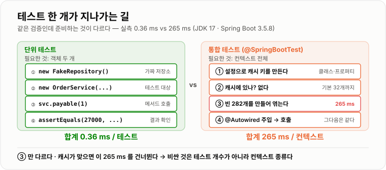
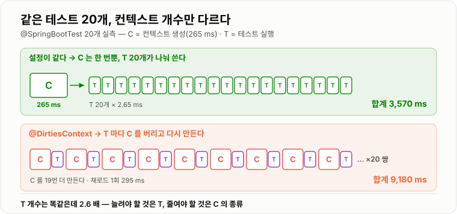

# 단위 테스트와 통합 테스트

> **테스트를 나누는 기준은 "무엇을 검증하는가"가 아니라 "무엇을 준비해야 하는가"다. 실측에서 순수 단위 테스트는 한 개당 0.36 ms였고, 스프링 컨텍스트를 새로 띄우는 테스트는 한 번에 265 ms였다. 730배 차이가 테스트 전략의 거의 전부를 결정한다.**

---

## 1. 핵심 요약

**단위 테스트는 객체 하나를 `new`로 만들어 메서드를 부르는 테스트고, 통합 테스트는 여러 구성요소를 실제로 엮어 놓고 확인하는 테스트다. 둘의 차이는 "얼마나 진짜인가"와 "얼마나 빠른가"의 맞바꿈이며, 이 맞바꿈의 크기는 추측이 아니라 잴 수 있는 수치다.**

### 한눈에 보기

* **단위 테스트(unit test)** 는 테스트 대상 객체를 직접 만들어 부르고, **협력 객체는 가짜로 채운다.** 준비할 것이 없으니 빠르다.
* **통합 테스트(integration test)** 는 스프링 컨텍스트·DB·웹 서버처럼 **실제 인프라를 띄워 놓고** 확인한다. 진짜에 가깝지만 준비 비용을 낸다.
* 실측에서 **순수 단위 테스트 한 개는 0.36 ms**였다(2,000개 1,180 ms, 500개 645 ms에서 기울기로 계산). JUnit 자체를 띄우는 고정 비용이 **약 350 ms** 따로 있다.
* **스프링 컨텍스트를 한 번 띄우는 비용**은 크기에 정비례했다. 빈 9개짜리 **7.0 ms**, 자동 구성이 붙은 `@SpringBootTest`(빈 173개) **170 ms**, 내장 톰캣까지 띄우면(빈 282개) **265 ms**였다.
* **가장 중요한 수치는 이 둘의 비율이다.** 단위 테스트 한 개 **0.36 ms** vs 컨텍스트 한 번 **265 ms** → **736배**. 테스트를 어디에 둘지는 이 숫자가 정한다.
* **그런데 "통합 테스트가 느리다"는 말은 절반만 맞다.** 컨텍스트는 **캐시되기 때문**이다. `@SpringBootTest` 20개를 돌렸을 때 **컨텍스트를 공유하면 3,570 ms**, `@DirtiesContext`로 매번 버리면 **9,180 ms**로 **2.6배**였다.
* 즉 **비싼 것은 통합 테스트의 개수가 아니라 컨텍스트의 개수**다. 컨텍스트 하나를 100개 테스트가 나눠 쓰면 한 개당 부담은 2.65 ms로 떨어진다.
* **컨텍스트 캐시는 무한하지 않다.** 스프링의 기본 상한은 **32개**(`spring.test.context.cache.maxSize`)이고, 넘으면 오래된 것부터 버려져 **다시 로드된다.**
* **처음 한 번은 유난히 비싸다.** 빈 9개짜리 컨텍스트가 최초 **511~670 ms**, 그 뒤로는 **7.0 ms**였다. **73~86배** 차이인데, 이 대부분은 컨텍스트가 아니라 **스프링 클래스를 처음 읽어 들이는 비용**이다.
* **그래서 테스트 하나만 돌려 보고 "느리다/빠르다"를 판단하면 거의 틀린다.** 첫 실행에는 JVM 기동(약 235 ms) + 클래스 로딩이 전부 섞여 있다.

> 이 노트의 수치는 **JDK 17.0.12 (HotSpot) · Windows 11 · 6코어**에서 직접 측정했다. **JUnit 5.12.2 · Spring 6.2.14 · Spring Boot 3.5.8**을 썼고, 각 측정은 **깨끗한 JVM에서 따로** 돌렸다. 한 JVM에 여러 그룹을 몰아넣으면 앞 그룹이 클래스를 미리 읽어 뒤 그룹이 부당하게 빨라진다 — 실제로 처음에 그렇게 재서 잘못된 값이 나왔고, 그것 자체가 이 노트의 교훈 하나다.

### 무엇을 해결하는가

#### 해결하려는 문제

주문 금액에서 등급별 할인을 빼는 로직을 만들었다고 하자.

```java
class OrderService {
    private final OrderRepository repo;
    private final DiscountPolicy policy;

    int payable(long id) {
        Order o = repo.findById(id);
        return o.amount - policy.discount(o);
    }
}
```

여기서 확인하고 싶은 것은 **"VIP가 3만 원을 사면 2만 7천 원을 낸다"** 한 줄이다. 그런데 이걸 확인하려고 서버를 띄우고, DB를 켜고, 브라우저로 주문을 넣어 보고 있다면 뭔가 잘못된 것이다.

```text
확인하고 싶은 것    할인 계산 한 줄
실제로 준비한 것    톰캣 + 스프링 컨텍스트 + DB + 테스트 데이터
```

#### 이 개념이 없을 때

테스트를 나누지 않으면 **모든 테스트가 가장 비싼 테스트의 비용을 낸다.**

```java
// 모든 테스트를 @SpringBootTest 로만 쓴다면
@SpringBootTest
class 전부통합테스트 {
    @Autowired OrderService svc;

    @Test void VIP는_10퍼센트_할인받는다() { ... }   // 할인 계산 한 줄 확인하려고
    @Test void 일반등급은_할인이_없다()     { ... }   // 컨텍스트를 통째로 띄운다
    @Test void 할인은_5천원을_넘지_않는다()  { ... }
}
```

셋 다 스프링이 전혀 필요 없는 계산 검증인데, **컨텍스트가 없으면 한 줄도 못 돌린다.** 그리고 여기서 진짜 문제가 시작된다.

```text
① 느려진다        테스트가 300개면 손대기 싫은 속도가 된다
② 안 돌리게 된다   느리면 커밋 전에 안 돌린다. 안 돌리는 테스트는 없는 것과 같다
③ 원인을 못 짚는다  실패했을 때 "할인 계산이 틀렸다"인지 "DB 설정이 틀렸다"인지 모른다
```

**③이 가장 비싸다.** 테스트의 값어치는 "깨졌다"를 알려 주는 데 있는 게 아니라 **"어디가 깨졌는지"** 를 알려 주는 데 있다. 20개 구성요소를 한꺼번에 엮은 테스트가 실패하면 후보가 20개다.

반대로 단위 테스트만 쓰면 다른 함정에 빠진다.

```java
// 전부 가짜로 채운 테스트 — 다 통과하는데 서비스는 안 돈다
@Test void 주문을_저장한다() {
    OrderRepository repo = mock(OrderRepository.class);
    OrderService svc = new OrderService(repo, new DiscountPolicy());
    svc.place(order);
    verify(repo).save(any());       // "save 를 불렀다"만 확인했다
}
```

이 테스트는 **`save`가 실제로 저장에 성공하는지는 전혀 모른다.** 컬럼 길이가 모자라도, 제약 조건에 걸려도, 트랜잭션이 안 걸려 있어도 통과한다. **가짜끼리는 언제나 사이가 좋다.**

```text
단위 테스트만    빠르지만 "진짜 되는지"를 모른다
통합 테스트만    확실하지만 느리고 원인을 못 짚는다

→ 둘 다 필요하고, 비율을 정해야 한다
```

---

## 2. 동작 원리

### 핵심 구성 요소

| 요소 | 하는 일 | 비용 |
| --- | --- | --- |
| **JUnit 엔진** | 테스트 클래스를 찾아 메서드를 실행한다 | 고정 약 350 ms |
| **테스트 대상(SUT)** | 검증하려는 객체 | `new` 한 번 |
| **테스트 대역(test double)** | 협력 객체를 대신하는 가짜 | 직접 만들면 사실상 0 |
| **ApplicationContext** | 스프링이 빈을 만들어 엮어 놓은 것 | 빈 수에 비례, 7~265 ms |
| **TestContext 캐시** | 같은 설정의 컨텍스트를 재사용한다 | 기본 32개까지 보관 |

### 내부 동작 과정

#### 테스트 한 개가 실제로 지나가는 길



*단위 테스트는 객체 두 개만 만들면 되고, 통합 테스트는 컨텍스트 전체를 준비해야 한다.*

단위 테스트는 이게 전부다.

```text
① 객체를 만든다        new OrderService(new FakeRepository(), new DiscountPolicy())
② 메서드를 부른다      svc.payable(1)
③ 결과를 확인한다      assertEquals(27000, ...)

→ 실측 0.36 ms
```

통합 테스트는 앞에 준비 단계가 붙는다.

```text
① 설정을 읽는다              @SpringBootTest 의 클래스·프로퍼티로 캐시 키를 만든다
② 캐시를 본다                같은 키가 있으면 그걸 쓴다  ← 여기가 핵심
③ 없으면 컨텍스트를 만든다     빈 스캔 → 자동 구성 판정 → 빈 생성 → 의존성 주입
④ 테스트 객체에 주입한다       @Autowired 필드를 채운다
⑤ 메서드를 부른다

→ ③ 이 실측 170~265 ms
```

**②에서 갈린다.** 캐시가 맞으면 통합 테스트도 단위 테스트만큼 싸지고, 캐시가 빗나가면 매번 200 ms 넘게 낸다.

#### 컨텍스트 로드 비용은 빈 개수를 따라간다

세 종류의 컨텍스트를 각각 21번 만들어 보고, **첫 번째와 그 이후를 따로** 쟀다.

```text
컨텍스트 종류                        빈 개수    최초 로드      이후(중앙값)
순수 @Configuration                    9       511~670 ms      7.0 ms
@SpringBootTest (web=NONE)           173        약 1,400 ms    170.0 ms
@SpringBootTest (내장 톰캣)           282        약 1,040 ms    265.0 ms

                                              이후 로드 기준   →  24배 / 38배
```

두 가지를 읽어야 한다.

**첫째, 빈이 많아질수록 비싸진다.** 9개 → 173개 → 282개로 늘면서 7.0 → 170 → 265 ms가 됐다. `@SpringBootTest`가 비싼 이유는 마법이 아니라 **자동 구성이 빈을 173개나 만들기 때문**이다.

**둘째, 최초와 이후가 73~86배 차이 난다.** 빈 9개짜리가 처음엔 511~670 ms인데 두 번째부터 7.0 ms다. 컨텍스트가 갑자기 가벼워진 게 아니라, **첫 번째가 스프링 클래스 수천 개를 읽어 들이는 값을 대신 치른 것**이다.

```text
최초 로드 = 클래스 로딩 + JIT 워밍업 + 컨텍스트 생성
이후 로드 =                          컨텍스트 생성
```

!!! warning "여기서 실제로 틀렸다"

    처음에는 네 그룹(단위·스프링·설정다름·`@DirtiesContext`)을 **한 JVM에서 이어서** 쟀다.
    그랬더니 "설정이 다른 컨텍스트 5개"가 "컨텍스트 1개"보다 **빠르게** 나왔다.
    앞 그룹이 스프링 클래스를 전부 읽어 놓은 덕을 뒤 그룹이 본 것이다.

    **그룹마다 JVM을 새로 띄우고 나서야** 제대로 된 값이 나왔다.
    측정 순서가 결론을 뒤집을 수 있다.

#### 컨텍스트 캐시 — 통합 테스트를 살리는 장치

스프링 TestContext 프레임워크는 **컨텍스트를 테스트 클래스마다 만들지 않는다.** 설정에서 키를 뽑아 **같은 키면 재사용**한다.

```text
캐시 키를 이루는 것
  @ContextConfiguration 의 classes / locations
  활성 프로파일 (@ActiveProfiles)
  프로퍼티 (@SpringBootTest(properties=...), @TestPropertySource)
  컨텍스트 초기화기 (ContextInitializer)
  웹 환경 종류 (MOCK / RANDOM_PORT / NONE)
  빈 오버라이드 (@MockitoBean 등)
```

이 중 **하나라도 다르면 다른 컨텍스트**다. 효과를 재 봤다.

```text
@SpringBootTest 테스트 20개를 돌릴 때

컨텍스트를 공유하면 (클래스 5개가 같은 설정)        3,570 ms
@DirtiesContext 로 매번 버리면 (컨텍스트 20개)     9,180 ms

                                                  2.6 배
재로드 1회 값 = (9,180 - 3,570) / 19 ≈ 295 ms
```

**295 ms는 앞에서 잰 톰캣 컨텍스트 로드 265 ms와 거의 같다.** 캐시가 하는 일이 정확히 "이 265 ms를 안 내는 것"이라는 뜻이다.



*테스트 개수는 똑같다. 달라진 것은 컨텍스트를 몇 번 만들었느냐뿐이다.*

#### 캐시가 무너지는 두 가지

**① 캐시 상한을 넘을 때.** 기본값은 **32개**다.

```java
// 실제로 확인한 값 — org.springframework.test.context.cache.ContextCacheUtils
ContextCacheUtils.retrieveMaxCacheSize();   // 32
```

설정이 서로 다른 컨텍스트가 33개가 되는 순간, **가장 오래 안 쓴 것부터 버려진다.** 그리고 그 설정을 쓰는 테스트가 다시 나오면 265 ms를 다시 낸다. 테스트 클래스마다 `properties`를 조금씩 다르게 주는 습관이 이 사고를 만든다.

**② `@DirtiesContext`를 붙일 때.** 컨텍스트를 "더럽혀졌다"고 표시해 캐시에서 내린다.

```java
@DirtiesContext(classMode = DirtiesContext.ClassMode.AFTER_EACH_TEST_METHOD)
// → 테스트 메서드마다 265 ms 씩 더 낸다
```

정말 필요할 때가 있다. 싱글턴 빈의 내부 상태를 테스트가 바꿔 버려서 다음 테스트가 영향을 받는 경우다. 하지만 **대개는 상태를 되돌리는 편이 훨씬 싸다.**

#### 그래서 테스트 피라미드다

같은 검증을 두 방식으로 만들어 개수를 맞추고 쟀다.

```text
테스트 100개
  순수 단위 테스트                    441 ms
  스프링 컨텍스트(빈 9개, 캐시 1회)   1,820 ms      4.1 배

테스트 2,000개
  순수 단위 테스트                  1,180 ms
  스프링 컨텍스트(빈 9개, 캐시 1회)   4,600 ms
```

여기서 **기울기**를 뽑으면 테스트 한 개를 늘릴 때의 값이 나온다.

```text
순수 단위 테스트   (1,180 - 645) / 1,500 = 0.36 ms/개
JUnit 고정 비용                        약 350 ms
JVM 기동                               약 235 ms
```

**단위 테스트는 개수를 늘려도 거의 공짜**라는 뜻이다. 3,000개를 더 써도 1초쯤 늘어난다. 반면 컨텍스트를 하나 더 만들면 그것만으로 265 ms다.

```text
단위 테스트 1개 추가       0.36 ms
컨텍스트 1개 추가        265    ms      736 배
```

**이 736배가 피라미드 모양의 근거다.** "단위 테스트를 많이 쓰자"는 취향이 아니라, 아래쪽이 압도적으로 싸기 때문에 나온 결론이다.

---

## 3. 특징과 비교

| 구분          | 내용 |
| ----------- | -- |
| **장점**      | 단위 테스트는 **한 개당 0.36 ms**로 사실상 공짜라 수천 개를 유지해도 부담이 없고, 실패하면 **의심할 곳이 한 곳**이라 원인을 즉시 짚는다. 통합 테스트는 설정·매핑·트랜잭션처럼 **객체 하나만 봐서는 알 수 없는 결함**을 잡아 준다. 컨텍스트 캐시 덕분에 통합 테스트도 **개수 자체는 싸다**(20개 3,570 ms에서 컨텍스트 값은 한 번뿐). |
| **단점**      | 단위 테스트는 **가짜끼리만 맞으면 통과**하므로 "진짜로 도는지"를 보장하지 못하고, 목을 과하게 쓰면 구현을 조금만 바꿔도 깨진다. 통합 테스트는 **컨텍스트 한 번에 170~265 ms**라 컨텍스트 종류가 늘면 급격히 느려지고, 실패했을 때 후보가 많아 원인 추적이 오래 걸린다. 캐시 상한 **32개**를 넘기면 재로드가 반복된다. |
| **적합한 상황**  | 단위 테스트 — 계산·분기·검증 규칙처럼 **입력과 출력이 분명한 순수 로직**, 경계값과 예외 경로. 통합 테스트 — **매핑과 설정이 관여하는 것**(JPA 쿼리, 트랜잭션 경계, 직렬화, 시큐리티 필터), 그리고 **핵심 시나리오 한두 개**를 끝에서 끝까지. |
| **주의할 상황**  | **모든 테스트를 `@SpringBootTest`로 쓰는 경우** — 계산 한 줄 확인에 컨텍스트를 띄운다. **테스트마다 `properties`를 조금씩 다르게 주는 경우** — 캐시가 전부 빗나가 컨텍스트가 수십 개가 된다. **`@DirtiesContext`를 습관적으로 붙이는 경우** — 메서드마다 295 ms를 더 낸다. **가짜로만 이루어진 테스트** — 다 통과하는데 서비스는 안 돈다. |

### 성능 특성

#### 테스트 실행 (깨끗한 JVM에서 각각 측정)

```text
고정 비용
  JVM 기동                        약 235 ms
  JUnit 엔진 준비                  약 350 ms

테스트 개수별 (순수 단위)
     20개    369 ms
    100개    441 ms
    500개    645 ms
  2,000개  1,180 ms
  → 한 개 추가 비용 0.36 ms

테스트 개수별 (스프링 컨텍스트 1개 공유, 빈 9개)
    100개  1,820 ms      단위 대비 4.1 배
  2,000개  4,600 ms
```

#### 컨텍스트 로드 (각 21회 측정, 3회 반복)

```text
컨텍스트                        빈 개수   최초         이후(중앙값)
순수 @Configuration                9   511~670 ms      7.0 ms
@SpringBootTest (web=NONE)       173   약 1,400 ms   170.0 ms      24 배
@SpringBootTest (내장 톰캣)       282   약 1,040 ms   265.0 ms      38 배

컨텍스트 캐시 기본 상한                                        32 개
```

`@SpringBootTest`(톰캣)의 "최초"가 `web=NONE`보다 **낮게** 나온 것에 주의한다. 앞 측정이 스프링 클래스를 이미 읽어 놓았기 때문이고, **최초 로드에는 컨텍스트 값이 아닌 것이 섞여 있다**는 증거이기도 하다.

#### 캐시 효과

```text
@SpringBootTest 테스트 20개
  컨텍스트 공유       3,570 ms
  @DirtiesContext    9,180 ms      2.6 배
  재로드 1회           295 ms
```

### 장점과 단점

#### 장점

* **단위 테스트는 개수가 공짜에 가깝다.** 0.36 ms라 5,000개를 써도 2초다. 마음껏 경계값을 채울 수 있다.
* **실패 지점이 좁다.** `new OrderService(fake, policy)`로 만든 테스트가 깨졌다면 의심할 곳은 그 두 클래스뿐이다.
* **통합 테스트는 "설정이 맞는가"를 본다.** 엔티티 매핑 오타, 트랜잭션 미적용, 컨버터 누락은 단위 테스트로는 원리상 못 잡는다.
* **캐시 덕분에 통합 테스트의 개수는 싸다.** 비싼 것은 컨텍스트의 **종류**지 테스트의 **개수**가 아니다.

#### 단점

* **단위 테스트는 진짜를 보장하지 않는다.** 가짜 저장소는 언제나 성공한다. 실제 DB의 제약 조건은 아무것도 확인하지 못한다.
* **목이 많아지면 테스트가 구현에 붙는다.** 메서드 호출 순서까지 검증해 두면 리팩터링할 때마다 테스트가 깨진다.
* **컨텍스트 종류가 늘면 급격히 느려진다.** 설정이 조금씩 다른 클래스 30개면 컨텍스트 30개이고, 그것만으로 8초다.
* **캐시 상한 32개가 조용히 문제를 만든다.** 넘어도 오류가 안 나고 그냥 느려지기만 해서 원인을 짐작하기 어렵다.

### 어떤 상황에서 고르는가

```text
스프링이 없어도 검증되는가? (계산·분기·규칙)
  예 → 단위 테스트.  가장 싸고 가장 정확히 짚어 준다
  아니오 ↓

무엇이 필요한가?
  웹 계층만 (요청 매핑·직렬화·검증)      → 슬라이스 (@WebMvcTest)
  영속 계층만 (쿼리·매핑)                → 슬라이스 (@DataJpaTest)
  여러 계층이 실제로 맞물리는지          → @SpringBootTest
  브라우저·외부 시스템까지               → E2E (개수를 아주 적게)
```

**판단 기준 한 줄** — *스프링을 빼도 같은 것을 검증할 수 있다면 빼는 게 낫다.* 남는 건 속도뿐 아니라, 실패했을 때의 명확함이다.

비율의 감각은 이렇다.

```text
단위 테스트     대부분         빠르고 좁다
슬라이스        그다음         계층 하나의 설정까지 본다
@SpringBootTest 핵심 흐름만    비싸지만 진짜에 가깝다
E2E             손에 꼽을 만큼  가장 느리고 가장 잘 깨진다
```

### 비슷한 기술과 비교

#### 단위 테스트 vs 통합 테스트

| 기준 | 단위 테스트 | 통합 테스트 |
| --- | --- | --- |
| **준비하는 것** | 객체 두어 개 (`new`) | 컨텍스트·DB·웹 서버 |
| **한 개당 실측** | **0.36 ms** | 컨텍스트당 170~265 ms |
| **협력 객체** | 가짜(페이크·목) | 진짜 |
| **잡아내는 결함** | 계산·분기·경계값 | 설정·매핑·트랜잭션·연동 |
| **못 잡는 결함** | 설정·매핑·실제 제약 | (거의 다 잡지만 느리다) |
| **실패 시 원인 후보** | **한두 곳** | 여러 곳 |
| **개수를 늘릴 때** | 거의 공짜 | 컨텍스트가 안 늘면 싸다 |
| **깨지는 빈도** | 구현을 바꾸면 깨질 수 있다 | 환경이 바뀌면 깨진다 |

#### 테스트 대역 세 가지

| 기준 | 스텁(stub) | 페이크(fake) | 목(mock) |
| --- | --- | --- | --- |
| **하는 일** | 정해진 값을 돌려준다 | 간단하게 진짜처럼 동작한다 | 호출을 기록하고 검증한다 |
| **예** | `return "order-0";` | `HashMap` 기반 저장소 | `verify(repo).save(any())` |
| **검증 대상** | 결과(상태) | 결과(상태) | **상호작용(행위)** |
| **구현 변경에** | 둔감하다 | 둔감하다 | **민감하다** |
| **쓸 곳** | 값만 필요할 때 | 저장·조회가 오가는 협력 | "호출했는지"가 요구사항일 때 |

**기본은 페이크와 스텁**이고, 목은 **"불렀다는 사실 자체가 요구사항일 때"** 만 쓴다. 알림 발송처럼 결과를 확인할 방법이 없는 경우가 대표적이다.

#### 컨텍스트를 다루는 세 가지 태도

| 기준 | 캐시 재사용 | `@DirtiesContext` | 상태 되돌리기 |
| --- | --- | --- | --- |
| **비용** | **0 ms** | 테스트당 **295 ms** | 몇 µs~ms |
| **격리 수준** | 낮다 (상태가 남는다) | **완전하다** | 충분한 경우가 많다 |
| **언제** | 상태를 안 건드릴 때 | 되돌릴 수 없을 때 | `@Transactional`, `@BeforeEach` 초기화 |
| **주의** | 테스트 순서에 의존하게 될 수 있다 | 습관이 되면 전체가 느려진다 | 되돌릴 것을 빠뜨리기 쉽다 |

---

## 4. 실무 주의사항

### 백엔드 실무 적용

#### 스프링 없이 검증할 수 있게 설계한다

테스트를 빠르게 만드는 가장 확실한 방법은 **테스트 기법이 아니라 설계**다. 의존성을 생성자로 받으면 `new`만으로 테스트가 된다.

```java
// 필드 주입 — 테스트에서 new 로 못 만든다. 컨텍스트가 있어야만 한다
@Service
class OrderService {
    @Autowired private OrderRepository repo;        // 테스트가 채울 방법이 없다
}

// 생성자 주입 — 스프링 없이 그대로 만들 수 있다
@Service
class OrderService {
    private final OrderRepository repo;
    OrderService(OrderRepository repo) { this.repo = repo; }
}

// 그래서 테스트가 이렇게 된다 (0.36 ms)
OrderService svc = new OrderService(new FakeOrderRepository());
```

**생성자 주입을 권하는 이유 중 절반은 테스트 때문**이다.

#### 컨텍스트 종류를 의도적으로 줄인다

캐시는 설정이 **정확히 같을 때만** 맞는다. 그래서 통합 테스트의 설정을 **한 곳에 모아 상속**하는 것이 실무의 표준 대응이다.

```java
// 통합 테스트가 모두 이 하나를 물려받는다 → 컨텍스트도 하나
@SpringBootTest
@ActiveProfiles("test")
public abstract class IntegrationTestBase {
}

class 주문통합테스트 extends IntegrationTestBase { }
class 결제통합테스트 extends IntegrationTestBase { }
class 배송통합테스트 extends IntegrationTestBase { }
```

반대로 이렇게 하면 캐시가 전부 빗나간다.

```java
// 클래스마다 프로퍼티가 한 줄씩 다르다 → 컨텍스트가 클래스 수만큼 생긴다
@SpringBootTest(properties = "app.batch.size=100")   class A { }
@SpringBootTest(properties = "app.batch.size=200")   class B { }
@SpringBootTest(properties = "app.retry.max=3")      class C { }
// 컨텍스트 3개 = 795 ms 추가
```

값이 테스트마다 달라야 한다면 **프로퍼티가 아니라 빈의 메서드 인자로** 받게 바꾸는 편이 낫다.

#### `@DirtiesContext` 대신 상태를 되돌린다

```java
// 비싸다 — 메서드마다 295 ms
@DirtiesContext(classMode = ClassMode.AFTER_EACH_TEST_METHOD)
class 캐시테스트 { ... }

// 싸다 — 더럽힌 것만 되돌린다
class 캐시테스트 {
    @Autowired CacheManager cacheManager;

    @AfterEach
    void 캐시를_비운다() {
        cacheManager.getCacheNames()
                    .forEach(name -> cacheManager.getCache(name).clear());
    }
}
```

DB라면 `@Transactional`이 가장 싼 되돌리기다. 테스트 메서드가 끝날 때 롤백된다.

```java
@SpringBootTest
@Transactional          // 테스트가 끝나면 롤백된다 → 다음 테스트가 깨끗한 DB를 본다
class 주문통합테스트 { ... }
```

!!! warning "`@Transactional` 테스트의 함정"

    테스트 스레드가 트랜잭션을 쥐고 있으므로 **`@Async`나 별도 스레드에서 하는 조회는 그 변경을 못 본다.**
    그리고 커밋이 일어나지 않으니 **커밋 시점에만 터지는 제약 조건 위반을 놓친다.**
    실제 커밋 동작까지 봐야 한다면 `@Transactional` 대신 뒷정리를 직접 한다.

#### 테스트 이름이 문서가 되게 쓴다

```java
// 무엇을 검증하는지 알 수 없다
@Test void test1() { ... }
@Test void payableTest() { ... }

// 실패 목록만 읽어도 스펙이 보인다
@Test void VIP는_주문금액의_10퍼센트를_할인받는다() { ... }
@Test void 할인액은_5천원을_넘지_않는다() { ... }
@Test void 등급이_없으면_할인이_적용되지_않는다() { ... }
```

**테스트가 깨졌을 때 가장 먼저 보이는 것이 이름**이다. 이름만으로 무엇이 깨졌는지 알 수 있으면 스택 트레이스를 안 읽어도 된다.

#### 하나의 테스트는 하나만 검증한다

```java
// 첫 단언에서 실패하면 나머지는 확인조차 안 된다
@Test void 주문을_검증한다() {
    assertEquals(27000, svc.payable(1));
    assertEquals("VIP", svc.grade(1));
    assertEquals(3000, svc.discount(1));
}

// 셋을 나누면, 무엇이 깨졌고 무엇이 멀쩡한지 한눈에 보인다
@Test void VIP_주문의_결제금액은_할인이_적용된다() { ... }
@Test void VIP_주문의_등급을_조회한다()          { ... }
@Test void VIP_주문의_할인액을_계산한다()        { ... }
```

여러 값을 함께 봐야 한다면 `assertAll`로 **전부 확인하고 한꺼번에 보고**하게 한다.

#### 테스트가 순서에 의존하지 않게 한다

컨텍스트가 캐시된다는 것은 **싱글턴 빈이 테스트 사이에 살아 있다**는 뜻이다.

```java
// 위험한 테스트 — 앞 테스트가 남긴 상태에 기댄다
@Test void 두번째_주문은_번호가_2번이다() {
    assertEquals(2, svc.place(order).getSeq());   // 앞 테스트가 1번을 썼다고 가정
}
```

JUnit 5는 실행 순서를 보장하지 않고, IDE와 CI에서 순서가 달라질 수도 있다. **각 테스트는 자기가 필요한 상태를 직접 만든다.**

### 자주 하는 오해

| 잘못된 이해 | 올바른 이해 |
| --- | --- |
| "통합 테스트는 느리니 적게 써야 한다" | 느린 것은 테스트 개수가 아니라 **컨텍스트 종류**다. 20개가 컨텍스트 하나를 나눠 쓰면 한 개당 2.65 ms다. |
| "`@SpringBootTest`를 붙이면 테스트마다 컨텍스트가 뜬다" | **캐시된다.** 설정이 같으면 클래스가 몇 개든 컨텍스트는 하나다. |
| "컨텍스트 캐시는 무제한이다" | 기본 상한이 **32개**다. 넘으면 오래된 것부터 버려지고 재로드된다. |
| "테스트를 한 번 돌려 보면 빠른지 느린지 안다" | 첫 실행에는 **JVM 기동 235 ms + 클래스 로딩**이 섞여 있다. 빈 9개 컨텍스트가 최초 670 ms, 이후 7.0 ms였다. |
| "단위 테스트가 통과하면 기능이 동작한다" | 가짜끼리는 늘 맞는다. **매핑·제약 조건·트랜잭션은 전혀 확인되지 않는다.** |
| "통합 테스트가 있으면 단위 테스트는 없어도 된다" | 통합 테스트는 **어디가 깨졌는지**를 못 알려 준다. 경계값을 채우기에도 너무 비싸다. |
| "`@DirtiesContext`는 안전하니 붙여 두면 좋다" | 메서드마다 **295 ms**를 더 낸다. 20개면 5.6초다. |
| "테스트 대역은 다 목(mock)이다" | 스텁·페이크·목은 다르다. **기본은 페이크·스텁**이고 목은 상호작용 자체가 요구사항일 때만 쓴다. |
| "테스트가 많을수록 좋다" | 같은 것을 여러 층에서 반복 검증하면 **바꿀 때마다 여러 곳이 깨진다.** 층마다 역할이 달라야 한다. |
| "`@Transactional`을 붙이면 통합 테스트가 완벽해진다" | 롤백되므로 **커밋 시점에만 터지는 문제를 놓치고**, 다른 스레드는 그 변경을 못 본다. |
| "컨텍스트 로드가 느린 건 빈이 무거워서다" | 대부분 **빈 개수**다. 9개 7 ms, 173개 170 ms, 282개 265 ms로 거의 비례했다. |

---

## 5. 예제

### 같은 검증을 두 방식으로

```java
// ① 단위 테스트 — 0.36 ms
class OrderServiceTest {

    @Test
    void VIP는_주문금액의_10퍼센트를_할인받는다() {
        FakeOrderRepository repo = new FakeOrderRepository();
        repo.save(new Order(1, 30000, "VIP"));

        OrderService svc = new OrderService(repo, new DiscountPolicy());

        assertEquals(27000, svc.payable(1));
    }
}

// ② 통합 테스트 — 컨텍스트 한 번 265 ms (그 뒤로는 캐시)
@SpringBootTest
class OrderServiceIntegrationTest {

    @Autowired OrderService svc;
    @Autowired OrderRepository repo;

    @Test
    void VIP는_주문금액의_10퍼센트를_할인받는다() {
        repo.save(new Order(1, 30000, "VIP"));
        assertEquals(27000, svc.payable(1));
    }
}
```

**둘 다 있어야 하는 것은 아니다.** 이 검증은 계산이 전부라 ①이면 충분하고, ②는 "리포지터리가 실제로 저장하는지"를 봐야 할 때 쓴다.

### 직접 만든 페이크

```java
// 목보다 단순하고, 여러 테스트가 함께 쓴다
class FakeOrderRepository implements OrderRepository {
    private final Map<Long, Order> store = new HashMap<>();

    @Override public Order findById(long id) { return store.get(id); }
    @Override public void save(Order o)      { store.put(o.id(), o); }
}
```

### 컨텍스트를 하나로 모으는 기반 클래스

```java
@SpringBootTest
@ActiveProfiles("test")
public abstract class IntegrationTestBase {

    @Autowired protected TestEntityManager em;

    // 여기에 공통 설정을 모두 모은다.
    // 하위 클래스가 설정을 추가하면 그 순간 컨텍스트가 하나 더 생긴다.
}
```

### 상태를 되돌려 `@DirtiesContext`를 피한다

```java
class 주문통합테스트 extends IntegrationTestBase {

    @Autowired OrderCounter counter;      // 상태를 가진 싱글턴 빈

    @AfterEach
    void 상태를_되돌린다() {
        counter.reset();                  // 295 ms 대신 몇 µs
    }
}
```

### 경계값은 단위 테스트로 채운다

```java
@ParameterizedTest(name = "{0}원 주문의 결제금액은 {1}원")
@CsvSource({
        "10000, 9000",      // 10% 할인
        "50000, 45000",     // 10% 할인
        "60000, 55000",     // 상한 5,000원에 걸린다
        "100000, 95000"     // 상한 유지
})
void VIP_할인은_5천원을_넘지_않는다(int amount, int expected) {
    FakeOrderRepository repo = new FakeOrderRepository();
    repo.save(new Order(1, amount, "VIP"));
    OrderService svc = new OrderService(repo, new DiscountPolicy());

    assertEquals(expected, svc.payable(1));
}
```

경우가 4개여도 **1.5 ms**다. 통합 테스트로 같은 걸 하면 컨텍스트 값을 낸다.

---

## 6. 면접 정리

### 자주 나오는 질문

#### 기본 질문

1. **단위 테스트와 통합 테스트의 차이는 무엇인가?**

    * 핵심 키워드: 준비하는 것의 차이 · 가짜 협력 객체 vs 실제 인프라 · 속도와 정확함의 맞바꿈

2. **테스트 피라미드는 왜 그런 모양인가?**

    * 핵심 키워드: 단위 0.36 ms vs 컨텍스트 265 ms · 736배 · 실패 지점의 좁음

3. **`@SpringBootTest`는 왜 느린가?**

    * 핵심 키워드: 자동 구성으로 빈 173~282개 · 빈 개수에 비례 · 캐시되면 한 번뿐

4. **테스트 대역에는 어떤 종류가 있는가?**

    * 핵심 키워드: 스텁 · 페이크 · 목 · 상태 검증 vs 행위 검증

5. **통합 테스트에서 테스트끼리 영향을 주지 않게 하려면?**

    * 핵심 키워드: `@Transactional` 롤백 · `@AfterEach` 초기화 · `@DirtiesContext`의 대가

#### 꼬리 질문

1. **스프링 테스트 컨텍스트 캐시는 무엇을 기준으로 재사용하는가?**

    * 핵심 키워드: 설정 클래스 · 프로파일 · 프로퍼티 · 웹 환경 · 빈 오버라이드 · 하나만 달라도 새 컨텍스트

2. **통합 테스트가 갑자기 느려졌다면 무엇을 의심하는가?**

    * 핵심 키워드: 컨텍스트 종류 증가 · 캐시 상한 32개 · `@DirtiesContext` · 프로퍼티 차이

3. **`@DirtiesContext`는 언제 써야 하는가?**

    * 핵심 키워드: 되돌릴 수 없는 상태 변경 · 295 ms · 대안(롤백·초기화)

4. **단위 테스트만으로 잡을 수 없는 결함은 무엇인가?**

    * 핵심 키워드: 엔티티 매핑 · 트랜잭션 경계 · 직렬화 · DB 제약 조건 · 가짜끼리는 늘 맞는다

5. **테스트를 빠르게 만들려면 코드를 어떻게 짜야 하는가?**

    * 핵심 키워드: 생성자 주입 · 순수 로직 분리 · 프레임워크 의존 줄이기

### 30초 답변

> 둘을 가르는 기준은 **무엇을 준비해야 하는가**입니다. 단위 테스트는 객체를 `new`로 만들어 부르는 게 전부라 실측 **한 개당 0.36 ms**였고, 통합 테스트는 스프링 컨텍스트를 띄워야 해서 **한 번에 265 ms**였습니다. **736배** 차이라 검증 가능한 것은 되도록 아래층에서 잡는 게 유리합니다. 다만 **컨텍스트는 캐시되기 때문에**, 비싼 건 통합 테스트의 개수가 아니라 **컨텍스트의 종류**입니다.

#### 이어서 더 물으면

**"통합 테스트는 느리다"를 그대로 믿으면 잘못된 대응을 하게 됩니다.** `@SpringBootTest` 20개를 돌렸을 때 **컨텍스트를 공유하면 3,570 ms**인데 `@DirtiesContext`로 매번 버리면 **9,180 ms**로 **2.6배**가 됐습니다. 차액을 재로드 횟수로 나누면 **1회 약 295 ms**인데, 이게 톰캣 컨텍스트 로드 실측 265 ms와 거의 같습니다. **줄여야 하는 건 테스트 개수가 아니라 컨텍스트 개수**라는 뜻입니다.

**그래서 실무 대응은 설정을 한곳에 모으는 겁니다.** 캐시 키는 설정 클래스·프로파일·프로퍼티·웹 환경·빈 오버라이드로 만들어지는데 **하나라도 다르면 새 컨텍스트**입니다. 클래스마다 `properties`를 한 줄씩 다르게 주면 컨텍스트가 클래스 수만큼 생깁니다. 공통 기반 클래스를 두고 물려받게 하면 컨텍스트가 하나로 모입니다. 그리고 **캐시 상한이 기본 32개**라, 넘으면 오래된 것부터 버려져 재로드가 반복되는데 **오류가 안 나고 느려지기만 해서** 원인을 짚기 어렵습니다.

**컨텍스트 비용 자체는 빈 개수에 거의 비례했습니다.** 빈 9개 **7.0 ms**, 자동 구성이 붙은 `@SpringBootTest` 173개 **170 ms**, 내장 톰캣까지 282개 **265 ms**였습니다. 그래서 웹 계층만 필요하면 슬라이스로 범위를 줄이는 게 바로 효과를 냅니다.

**측정하면서 실제로 한 번 틀렸는데, 그것도 배울 점이었습니다.** 처음엔 여러 그룹을 한 JVM에서 이어 쟀더니 "컨텍스트 5개"가 "컨텍스트 1개"보다 빠르게 나왔습니다. 앞 그룹이 스프링 클래스를 미리 읽어 놓은 덕을 본 거죠. 실제로 **빈 9개 컨텍스트가 최초 670 ms, 이후 7.0 ms로 80배 가까이** 차이 났는데, 그 차이의 대부분이 컨텍스트가 아니라 **클래스 로딩**이었습니다. **그룹마다 JVM을 새로 띄우고 나서야** 제대로 된 값이 나왔습니다.

**반대 방향의 함정도 있습니다.** 전부 목으로 채운 테스트는 `verify(repo).save(any())` 같은 걸 확인하는데, 이건 **"저장을 요청했다"** 지 **"저장에 성공했다"** 가 아닙니다. 컬럼 길이가 모자라도, 제약 조건에 걸려도 통과합니다. **가짜끼리는 언제나 사이가 좋습니다.** 그래서 매핑·트랜잭션·직렬화처럼 설정이 관여하는 것은 반드시 통합 테스트나 슬라이스로 확인해야 합니다.

**테스트를 빠르게 만드는 가장 확실한 방법은 사실 설계입니다.** 필드 주입을 쓰면 컨텍스트 없이는 객체를 만들 수조차 없어서 모든 테스트가 통합 테스트가 됩니다. 생성자 주입이면 `new`만으로 테스트가 되고, 그게 0.36 ms짜리 테스트를 가능하게 합니다.

### 핵심 키워드

`단위 테스트` · `통합 테스트` · `테스트 피라미드` · `테스트 대역` · `스텁 / 페이크 / 목` · `상태 검증 vs 행위 검증` · `ApplicationContext 로드` · `TestContext 캐시` · `캐시 키` · `spring.test.context.cache.maxSize` · `@DirtiesContext` · `@Transactional 롤백` · `생성자 주입` · `슬라이스 테스트`

### 이어서 볼 주제

* **Mock · Spring Test · Testcontainers** — 가짜를 만드는 도구들과 슬라이스로 컨텍스트를 줄이는 방법.
* **로그 · 메트릭 · 트레이싱** — 테스트가 못 잡은 문제를 운영에서 알아채는 방법.
* **장애 분석과 성능 개선** — 통합 테스트에서 잘 드러나지 않는 부하·경합 문제.
* **IoC · DI와 Bean** — 컨텍스트가 무엇을 하느라 170 ms를 쓰는지.
* **AOP · Proxy와 Transactional** — `@Transactional` 테스트가 롤백되는 원리.
