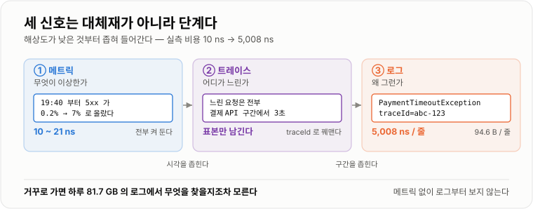
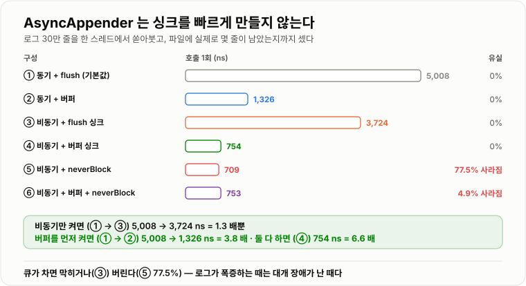

# 로그 · 메트릭 · 트레이싱

> **셋은 같은 것의 세 가지 해상도다. 메트릭이 "무엇이 이상한가"를, 트레이싱이 "어디가 느린가"를, 로그가 "왜 그런가"를 답한다. 실측에서 메트릭 하나 올리는 값은 10 ns, 로그 한 줄은 5,008 ns로 500배였다. 이 차이가 셋의 역할 분담을 정한다.**

---

## 1. 핵심 요약

**운영 중인 서버는 안이 보이지 않는다. 관측 가능성(observability)은 밖에서 나오는 신호만으로 안에서 무슨 일이 벌어지는지 알아낼 수 있게 만드는 일이고, 그 신호가 로그·메트릭·트레이스다. 셋은 담는 정보량과 비용이 크게 달라서, 어느 것에 무엇을 맡길지가 곧 설계다.**

### 한눈에 보기

* **메트릭은 압도적으로 싸다.** `Counter.increment()`가 **10.0 ns**, `Timer.record()`가 **20.7 ns**였다. 요청마다 몇 개씩 올려도 부담이 없다.
* **로그는 그보다 500배 비싸다.** 파일에 한 줄 쓰는 기본 설정이 **5,008 ns**였다. 로그 한 줄이 메트릭 500개 값이다.
* **가장 크게 손해 보는 곳은 "끈 로그"다.** `DEBUG`를 꺼 둔 상태에서 `log.debug("주문 " + order + " 처리")`가 **128.5 ns**였다. **로그는 안 나가는데 문자열은 이미 만들어졌기 때문**이다.
* **`{}` 플레이스홀더를 쓰면 3.4 ns**로 떨어진다. **38배** 차이이고, 고치는 데 드는 노력은 사실상 0이다.
* **`immediateFlush=false`가 비동기보다 효과가 컸다.** 동기 5,008 ns → **1,326 ns(3.8배)**. 로그백 `FileAppender`의 기본값은 `true`라 **매 줄 디스크로 밀어낸다.**
* **`AsyncAppender`는 만병통치가 아니다.** 싱크가 느린 채로 비동기만 켜면 **3,724 ns(1.3배)** 밖에 안 줄었다. 큐가 차면 결국 **싱크 속도로 수렴**하기 때문이다.
* **비동기 + 버퍼를 함께 써야 754 ns(6.6배)** 가 됐다. **비동기는 싱크를 빠르게 만들지 않는다** — 이것이 이 노트에서 가장 중요한 한 줄이다.
* **`neverBlock=true`는 "안 막히는" 대신 로그를 버린다.** 싱크가 느린 상태에서 켰더니 **77.5%가 사라졌다.** 장애를 조사할 때 정작 필요한 로그가 없어진다.
* **로그 1줄은 94.6 B**였다. 초당 1만 줄이면 하루 **81.7 GB**다. 보관 비용과 검색 속도가 여기서 갈린다.
* **트레이싱의 핵심은 `traceId` 전파**이고, MDC는 `ThreadLocal`이라 **스레드가 바뀌면 사라진다.** 실측에서 스레드 풀에 넘긴 작업의 `traceId`가 `null`이었고, 컨텍스트를 복사해 넘겨야 유지됐다. MDC 조작 자체는 **27.4 ns**로 싸다.
* **메트릭에서 조심할 것은 두 가지다.** 매번 `registry`에서 이름으로 찾으면 **91.5 ns로 9배** 비싸지고, **태그 카디널리티**가 10만이면 미터가 10만 개 생겨 힙 **37.5 MB**를 쓴다.

> 이 노트의 수치는 **JDK 17.0.12 (HotSpot) · Windows 11 · 6코어**에서 직접 측정했다. **Logback 1.5.34 · SLF4J 2.0.18 · Micrometer 1.15.12**를 썼고, 로그는 **로컬 SSD의 파일 어펜더**에 30만 줄을 써서 쟀다. 마이크로벤치마크는 워밍업 뒤 7회 반복의 **중앙값**이며, 이 환경의 측정 하한은 약 **4 ns**다(빈 루프 기준).

### 무엇을 해결하는가

#### 해결하려는 문제

새벽에 "결제가 안 된다"는 문의가 들어왔다. 서버에 붙어 보니 프로세스는 살아 있고 CPU도 낮다.

```text
알고 싶은 것                         가진 것
지금 실패율이 얼마인가?               (모름)
언제부터 그런가?                     (모름)
어느 단계에서 느려졌나?               (모름)
그 요청에 무슨 일이 있었나?            (모름)
```

**신호가 없으면 추측만 남는다.** 그리고 추측으로 고친 것은 고쳐졌는지도 알 수 없다.

#### 이 개념이 없을 때

관측 수단이 없으면 이렇게 대응하게 된다.

```java
// 방법 1 — 재현해 본다
//   운영에서만 나는 문제는 대개 재현되지 않는다. 부하·데이터·타이밍이 다르다

// 방법 2 — 일단 재시작한다
//   증상은 사라지고 원인은 남는다. 다음 주에 또 난다

// 방법 3 — 급하게 로그를 넣고 배포한다
//   배포하는 동안 장애는 계속되고, 문제가 그사이 사라지면 다시 못 잡는다
```

셋 다 **"미리 심어 두지 않았다"** 는 하나의 원인에서 나온다. 그래서 평상시에 신호를 남겨 둔다. 다만 **다 남길 수는 없다.**

```text
모든 요청의 모든 값을 로그로 남긴다면
  로그 1줄 94.6 B × 초당 1만 줄 = 하루 81.7 GB
  쓰는 값도 5,008 ns/줄 → 초당 1만 줄이면 CPU 시간 50 ms/초
```

**그래서 세 가지로 나눈다.** 담는 정보량과 비용이 다르기 때문이다.

```text
메트릭    "초당 요청 500건, 오류율 3%"          숫자만. 10 ns. 전부 기록해도 된다
트레이스  "이 요청은 DB 에서 1.2초 썼다"         요청의 구간별 시간. 표본만 남긴다
로그      "주문 1234 저장 중 제약 조건 위반"     자세하다. 5,008 ns. 필요한 것만
```

---

## 2. 동작 원리

### 핵심 구성 요소

| 요소 | 답하는 질문 | 실측 비용 | 보관량 |
| --- | --- | --- | --- |
| **메트릭** | 무엇이 이상한가 | **10~21 ns** | 아주 작다(시계열 숫자) |
| **트레이스** | 어디가 느린가 | 표본에 따라 다름 | 중간(요청당 구간들) |
| **로그** | 왜 그런가 | **5,008 ns/줄** | 크다(**94.6 B/줄**) |
| **SLF4J** | 로깅 API 표준 | — | — |
| **Logback** | 실제로 기록하는 구현 | — | — |
| **MDC** | 요청 단위 꼬리표(`traceId`) | **27.4 ns** | 로그에 붙는다 |
| **Micrometer** | 메트릭 API 표준 | — | — |

### 내부 동작 과정

#### 세 신호가 하나의 장애를 푸는 순서



*해상도가 낮은 것부터 좁혀 들어간다. 순서를 거꾸로 하면 로그 더미에서 헤매게 된다.*

```text
① 메트릭      "19:40 부터 5xx 가 0.2% → 7% 로 올랐다"        언제·얼마나
                ↓ 시각을 좁힌다
② 트레이스     "느린 요청은 전부 결제 API 구간에서 3초"        어디가
                ↓ 구간을 좁힌다
③ 로그        "PaymentTimeoutException, traceId=abc-123"    왜
```

**메트릭 없이 로그부터 보면** 하루 81.7 GB에서 무엇을 찾아야 할지조차 모른다. **로그 없이 메트릭만 보면** 오류율이 올랐다는 사실만 알고 원인을 모른다. **셋은 대체재가 아니라 단계**다.

#### 로그 — 끈 로그가 왜 128.5 ns를 먹는가

가장 흔하고 가장 아까운 낭비다.

```java
log.debug("주문 " + order + " 처리 " + i);
```

`DEBUG`가 꺼져 있으면 로그는 안 나간다. 그런데 **`log.debug(...)`를 부르기 전에 인자가 먼저 평가된다.**

```text
① "주문 " + order + " 처리 " + i     ← 문자열을 만든다 (order.toString() 호출 포함)
② log.debug(그 문자열)                ← 들어와서 "DEBUG 꺼져 있네" 하고 버린다
```

**만들고 버린다.** 실측이다.

```text
log.debug("주문 " + order + " 처리 " + i)     128.5 ns
log.debug("주문 {} 처리 {}", order, i)          3.4 ns      38 배
if (log.isDebugEnabled()) { ... }              3.4 ns      38 배
(비교) 아무것도 안 함                            4.1 ns      ← 측정 하한
```

플레이스홀더와 가드가 **측정 하한과 같다.** 즉 **끈 로그의 비용을 사실상 0으로 만들 수 있다.**

```text
플레이스홀더가 하는 일
  log.debug("주문 {} 처리 {}", order, i)
    → 레벨을 먼저 확인한다
    → 꺼져 있으면 문자열을 만들지 않고 그대로 돌아간다
    → 켜져 있을 때만 order.toString() 을 부르고 {} 를 채운다
```

**인자가 객체 참조뿐이면 만드는 값이 없다.** 그래서 3.4 ns다.

!!! warning "플레이스홀더로도 못 막는 경우"

    ```java
    log.debug("주문 {}", buildExpensiveSummary(order));   // 이건 여전히 평가된다
    ```

    플레이스홀더는 **문자열 연결**을 미룰 뿐이고, **인자로 넘길 값을 계산하는 것**은 못 막는다.
    계산이 비싸면 `if (log.isDebugEnabled())`로 감싸야 한다.

#### 로그 — 켠 로그 한 줄의 값

`INFO`로 파일에 실제로 쓸 때를 여섯 가지 구성으로 쟀다. 한 스레드에서 **30만 줄**을 쏟아붓고, 끝나고 **실제로 파일에 몇 줄이 남았는지**까지 셌다.



*비동기만 켜면 1.3배지만, 버퍼를 먼저 켜면 3.8배다. 그리고 안 막히게 하면 로그가 사라진다.*

```text
구성                                        호출 1회      유실
① 동기 + immediateFlush=true (로그백 기본값)   5,008 ns     0%
② 동기 + immediateFlush=false                1,326 ns     0%      3.8 배
③ 비동기 + 싱크는 flush                       3,724 ns     0%      1.3 배
④ 비동기 + 싱크는 버퍼                          754 ns     0%      6.6 배
⑤ 비동기 + neverBlock=true (싱크는 flush)       709 ns    77.5%
⑥ 비동기 + 버퍼 + neverBlock=true               753 ns     4.9%
```

여기서 읽어야 할 것이 세 가지다.

**첫째, 기본값이 가장 느리다.** `FileAppender`의 `immediateFlush` 기본값은 `true`다. **한 줄 쓸 때마다 OS에 밀어낸다.** 끄면 3.8배 빨라진다. 대가는 **프로세스가 갑자기 죽으면 버퍼에 있던 로그가 사라지는 것**이다.

**둘째, 비동기만으로는 별로 안 빨라진다(③).** 5,008 → 3,724 ns, 겨우 1.3배다. 이유는 단순하다.

```text
비동기가 하는 일     로그 이벤트를 큐에 넣고 바로 돌아온다. 쓰기는 다른 스레드가 한다
비동기가 못 하는 일   싱크(디스크 쓰기)를 빠르게 만드는 것

→ 생산 속도 > 소비 속도 면 큐가 찬다
→ 큐가 차면 넣는 쪽이 막힌다 → 결국 싱크 속도로 수렴한다
```

**"비동기니까 괜찮다"는 큐가 안 찰 때만 맞는 말이다.** 정작 로그가 폭증하는 장애 상황에서는 큐가 반드시 찬다.

**셋째, 안 막히게 하면 로그가 사라진다(⑤).** `neverBlock=true`는 큐가 찼을 때 **기다리지 않고 그 이벤트를 버린다.**

```text
⑤ 비동기 + neverBlock, 싱크는 느림(flush)
   호출은 709 ns 로 가장 빠르다
   그런데 30만 줄 중 67,450 줄만 남았다 → 77.5% 유실
```

**장애 조사에 필요한 로그가 정확히 그 순간에 사라진다.** 로그가 폭증하는 때는 대개 뭔가 잘못됐을 때이기 때문이다. ⑥처럼 **싱크를 먼저 빠르게 만들면** 같은 `neverBlock`이어도 유실이 4.9%로 떨어진다.

```text
정리
  싱크를 먼저 빠르게 한다 (immediateFlush=false)      ← 가장 큰 효과, 부작용 작다
  그다음에 비동기를 얹는다                             ← 순간 폭증을 흡수한다
  neverBlock 은 "로그를 버려도 되는가"를 답한 뒤에      ← 대개 답은 '아니오'다
```

#### 로그 양은 저장 비용이 된다

```text
로그 1줄            94.6 B      (30만 줄에 28,388,890 B)

초당 1,000 줄  →  하루  8.2 GB
초당 10,000 줄 →  하루 81.7 GB
```

**여기에 압축·색인·복제가 곱해진다.** 그래서 로그 레벨과 보존 기간이 비용 문제가 된다.

#### 트레이싱 — `traceId`가 요청을 꿰맨다

요청 하나가 서비스 여러 개를 지나가면, **각 서비스의 로그를 이어 붙일 방법이 필요하다.** 그게 `traceId`다.

```text
요청 하나
  게이트웨이   traceId=abc-123  spanId=1
  주문 서비스   traceId=abc-123  spanId=2  parentId=1     120 ms
  결제 서비스   traceId=abc-123  spanId=3  parentId=2   3,010 ms   ← 여기다
  재고 서비스   traceId=abc-123  spanId=4  parentId=2      40 ms
```

* **trace** — 요청 하나 전체
* **span** — 그 안의 한 구간(서비스 호출, DB 쿼리 등)
* **`traceId`** — 요청 전체에 붙는 같은 값
* **`spanId` · `parentId`** — 구간의 부모·자식 관계

이 값을 로그에 붙이는 장치가 **MDC(Mapped Diagnostic Context)** 다.

```text
로그 패턴에 %X{traceId} 를 넣어 두면
  19:40:12.345 [http-nio-8080-exec-3] INFO  OrderService [abc-123] - 주문 저장 완료
                                                          └ traceId ┘
→ 로그 검색창에 abc-123 만 넣으면 그 요청의 전 서비스 로그가 모인다
```

MDC 조작 자체는 싸다.

```text
MDC.put + remove          27.4 ns
MDC.put + get + remove    30.6 ns
```

#### MDC의 함정 — `ThreadLocal`이라 스레드를 넘지 못한다

MDC는 **스레드마다 따로 있는 저장소**다. 그래서 작업을 다른 스레드에 넘기면 **`traceId`가 사라진다.** 직접 확인했다.

```text
요청 스레드          traceId = abc-123
풀 스레드(그대로)     traceId = null        ← 사라졌다
풀 스레드(복사)       traceId = abc-123     ← 넘겨 주면 유지된다
```

```java
// 잃어버리는 코드
pool.submit(() -> {
    log.info("비동기 처리 시작");     // traceId 가 비어 있다
});

// 넘겨 주는 코드
Map<String, String> ctx = MDC.getCopyOfContextMap();   // 요청 스레드에서 복사
pool.submit(() -> {
    MDC.setContextMap(ctx);                            // 풀 스레드에 심는다
    try {
        log.info("비동기 처리 시작");                    // traceId 가 붙는다
    } finally {
        MDC.clear();                                   // 반드시 지운다
    }
});
```

!!! danger "`finally`에서 지우지 않으면 더 나쁘다"

    스레드 풀은 스레드를 **재사용**한다. MDC를 안 지우면 **다음 요청이 앞 요청의 `traceId`를 달고 로그를 남긴다.**
    없는 것보다 나쁘다 — 조사할 때 엉뚱한 요청을 쫓게 된다.

#### 메트릭 — 왜 이렇게 싼가

메트릭은 **값을 누적할 뿐** 개별 사건을 남기지 않는다.

```text
로그      요청 100만 건 → 100만 줄 (94.6 MB)
메트릭    요청 100만 건 → 숫자 하나 (count=1,000,000)
```

그래서 이렇게 싸다.

```text
Counter.increment()               10.0 ns
Timer.record(1ms)                 20.7 ns
Timer.Sample start + stop         68.4 ns      실제로 시간을 재는 경우
```

**요청당 메트릭 5개를 올려도 100 ns**다. 초당 1만 요청이면 CPU 시간 1 ms/초, 즉 0.1%다. **사실상 공짜라고 봐도 된다.**

대신 **개별 사건을 못 본다.** "오류율 7%"는 알아도 "어떤 주문이 왜 실패했는지"는 모른다. 그래서 로그가 필요하다.

#### 메트릭에서 실제로 비싸지는 두 지점

**① 매번 이름으로 찾을 때.**

```java
// 매 호출마다 이름과 태그로 미터를 조회한다
registry.counter("orders.created", "grade", "VIP").increment();     // 91.5 ns

// 미리 받아 두고 쓴다
private final Counter counter = registry.counter("orders.created", "grade", "VIP");
counter.increment();                                                // 10.0 ns
```

**9배**다. 이름과 태그로 해시를 만들어 맵을 뒤지는 값이다. 10 ns든 91 ns든 작아 보이지만, **버릇이 되면 뜨거운 경로 전체에 퍼진다.**

**② 태그 카디널리티가 클 때.** 이게 진짜 사고다.

```java
// 태그 값이 사용자 수만큼 생긴다
registry.counter("http.requests", "userId", userId).increment();
```

**태그 값의 조합마다 미터가 하나씩 생긴다.** 실측이다.

```text
태그 값 종류      미터 개수      힙 사용        미터 1개당
       10건            10개        21 KB
    1,000건         1,000개       336 KB          344 B
  100,000건       100,000개    37,486 KB          383 B
```

**10만 종이면 37.5 MB다.** 그리고 이건 애플리케이션 쪽만의 이야기다. 이 미터들이 **전부 모니터링 시스템으로 전송되어 시계열로 저장**되므로, 실제 파급은 훨씬 크다.

```text
태그에 넣어도 되는 것    값의 종류가 유한하고 적은 것
                       HTTP 메서드(약 7) · 상태 코드(수십) · 엔드포인트 패턴(수십)

절대 넣으면 안 되는 것   값이 무한히 늘어나는 것
                       userId · orderId · 이메일 · UUID · 원본 URI(/orders/12345)
```

**`/orders/{id}` 처럼 패턴으로 묶어야 한다.** 스프링 부트의 `http.server.requests`가 `uri` 태그에 원본 경로가 아니라 **매핑 패턴**을 넣는 이유가 이것이다.

#### 백분위(percentile)를 켤 때의 값

평균만으로는 느린 요청을 못 본다. 그래서 p95·p99를 본다. 그 비용도 쟀다.

```text
기본 Timer.record()                            23.2 ns
publishPercentiles(0.5, 0.95, 0.99)           135.3 ns      5.8 배
publishPercentileHistogram() (1ms ~ 10s)       36.6 ns      1.6 배
```

**히스토그램 쪽이 오히려 쌌다.** 예상과 반대라 확인해 봤는데, 차이는 **버킷 범위**에 있었다. `publishPercentileHistogram()`에 `minimumExpectedValue`·`maximumExpectedValue`로 **1 ms~10초 범위를 지정**했기 때문에 버킷이 적었고, `publishPercentiles`는 범위를 안 줘서 전 구간을 커버했다.

```text
교훈 — 기대 범위를 좁혀 주면 백분위 비용이 줄어든다
      API 응답 시간이 1 ms~10초 범위라면 그렇게 알려 준다
```

---

## 3. 특징과 비교

| 구분          | 내용 |
| ----------- | -- |
| **장점**      | 메트릭은 **10~21 ns**로 사실상 공짜라 모든 요청에 붙일 수 있고, 시계열로 쌓여 추세와 이상을 즉시 보여 준다. 트레이스는 `traceId`로 **여러 서비스의 로그를 한 요청으로 꿰매** "어느 구간이 느린가"를 바로 답한다. 로그는 **개별 사건의 맥락**(어떤 주문, 어떤 예외)을 담아 원인을 확정한다. 셋을 함께 쓰면 **넓게 발견하고 좁게 확정**하는 흐름이 만들어진다. |
| **단점**      | 로그는 **한 줄에 5,008 ns · 94.6 B**라 초당 1만 줄이면 하루 **81.7 GB**이고, 끈 로그도 문자열을 연결하면 **128.5 ns**를 먹는다. `AsyncAppender`는 큐가 차면 **싱크 속도로 수렴**하거나(1.3배 개선에 그침) `neverBlock`으로 **77.5%를 버린다.** 메트릭은 개별 사건을 못 보고, **태그 카디널리티가 10만이면 힙 37.5 MB**를 쓴다. 트레이싱은 MDC가 `ThreadLocal`이라 **스레드를 넘으면 `traceId`가 사라진다.** |
| **적합한 상황**  | 메트릭 — 요청 수·오류율·지연 시간·큐 길이·풀 사용률처럼 **항상 켜 두고 추세를 봐야 하는 것**, 알림의 근거. 트레이스 — 서비스가 여러 개이거나 **한 요청 안에 외부 호출이 여러 번** 있는 구조. 로그 — 예외와 그 맥락, 중요한 상태 전이, **사후에 재구성해야 하는 사건**. |
| **주의할 상황**  | **뜨거운 반복문 안의 로그** — 한 줄 5,008 ns가 그대로 곱해진다. **문자열 연결로 쓴 `debug` 로그** — 꺼져 있어도 128.5 ns를 낸다. **`neverBlock=true`를 싱크 개선 없이 켜는 경우** — 정작 필요한 로그가 사라진다. **`userId`·`orderId`를 메트릭 태그로 넣는 경우** — 미터가 무한히 늘어난다. **`@Async`·스레드 풀에 MDC를 안 넘기는 경우** — `traceId`가 끊기고, 안 지우면 **앞 요청 것이 남는다.** |

### 성능 특성

#### 로그 (Logback 1.5.34, 파일 어펜더, 30만 줄)

```text
끈 로그 (root=INFO 에서 log.debug)
  문자열 연결                          128.5 ns
  {} 플레이스홀더                        3.4 ns      38 배
  isDebugEnabled 가드                   3.4 ns      38 배
  (측정 하한: 빈 루프 4.1 ns)

켠 로그 1줄                            호출        유실
  동기 + immediateFlush=true (기본)   5,008 ns      0%
  동기 + immediateFlush=false         1,326 ns      0%     3.8 배
  비동기 + flush 싱크                  3,724 ns      0%     1.3 배
  비동기 + 버퍼 싱크                     754 ns      0%     6.6 배
  비동기 + neverBlock + flush 싱크       709 ns   77.5%
  비동기 + neverBlock + 버퍼 싱크         753 ns    4.9%

로그 1줄 크기                            94.6 B
  초당  1,000 줄  →  하루  8.2 GB
  초당 10,000 줄  →  하루 81.7 GB
```

#### 트레이싱 (MDC)

```text
MDC.put + remove                        27.4 ns
MDC.put + get + remove                  30.6 ns
스레드 풀에 그냥 넘기면 traceId          null
getCopyOfContextMap 으로 넘기면          유지된다
```

#### 메트릭 (Micrometer 1.15.12)

```text
Counter.increment()                     10.0 ns
Timer.record()                          20.7 ns
Timer.Sample start + stop               68.4 ns
registry 에서 매번 조회                  91.5 ns      9 배
publishPercentiles(.5,.95,.99)         135.3 ns      5.8 배
publishPercentileHistogram(1ms~10s)     36.6 ns      1.6 배

태그 카디널리티      미터 개수        힙        미터당
        10건           10개      21 KB
     1,000건        1,000개     336 KB       344 B
   100,000건      100,000개  37,486 KB       383 B
```

### 장점과 단점

#### 장점

* **메트릭은 켜 두는 값이 사실상 없다.** 10 ns면 요청당 5개를 올려도 CPU의 0.1%다.
* **메트릭은 알림의 근거가 된다.** "오류율 5% 초과 5분 지속"처럼 숫자로 조건을 쓸 수 있다.
* **`traceId` 하나로 전 서비스 로그가 모인다.** 서비스가 늘어날수록 값어치가 커진다.
* **로그는 유일하게 "왜"를 담는다.** 예외 스택과 그때의 값은 로그에만 있다.
* **로그 비용은 설정으로 크게 줄어든다.** `immediateFlush=false` 한 줄로 3.8배다.

#### 단점

* **로그는 비싸고 커진다.** 5,008 ns·94.6 B가 곱해져 하루 81.7 GB가 된다.
* **끈 로그도 공짜가 아니다.** 문자열 연결이면 128.5 ns를 낸다.
* **비동기는 기대만큼 안 준다.** 싱크가 느리면 1.3배에 그치고, 안 막히게 하면 77.5%를 버린다.
* **메트릭은 개별 사건을 못 본다.** "실패 7%"는 알아도 어느 주문인지는 모른다.
* **태그 카디널리티는 조용히 메모리를 먹는다.** 10만 종에 37.5 MB이고 오류는 안 난다.
* **MDC는 스레드를 넘지 못한다.** 안 넘기면 끊기고, 안 지우면 섞인다.

### 어떤 상황에서 고르는가

```text
이 정보를 항상 켜 두고 봐야 하는가?
  예 → 메트릭 (10 ns). 단, 태그 값의 종류가 유한한지 먼저 확인한다
  아니오 ↓

여러 서비스·여러 외부 호출에 걸친 지연을 봐야 하는가?
  예 → 트레이싱 (traceId 전파 + 표본 추출)
  아니오 ↓

사후에 "그때 무슨 값으로 무슨 일이 있었는지" 재구성해야 하는가?
  예 → 로그 (레벨을 정하고, 플레이스홀더를 쓰고, 싱크를 버퍼링한다)
```

로그 레벨의 기준은 **"누가 언제 보는가"** 로 정한다.

```text
ERROR   사람이 지금 봐야 한다. 알림이 울려도 되는 것만
WARN    지금은 아니지만 쌓이면 문제. 재시도 성공, 폴백 동작
INFO    나중에 흐름을 재구성할 때 필요한 상태 전이. 운영에서 켜 둔다
DEBUG   개발·조사 중에만. 운영에서는 끈다
TRACE   거의 안 쓴다
```

### 비슷한 기술과 비교

#### 로그 vs 메트릭 vs 트레이스

| 기준 | 로그 | 메트릭 | 트레이스 |
| --- | --- | --- | --- |
| **답하는 질문** | 왜 그런가 | 무엇이 이상한가 | 어디가 느린가 |
| **실측 비용** | **5,008 ns/줄** | **10~21 ns** | 표본에 따라 다름 |
| **저장량** | **94.6 B/줄** | 아주 작다 | 중간 |
| **개별 사건** | **보인다** | 안 보인다 | 보인다(표본) |
| **추세** | 보기 어렵다 | **바로 보인다** | 어렵다 |
| **전부 남기나** | 레벨로 거른다 | **전부** | **표본만** |
| **알림 근거로** | 부적합 | **적합** | 부적합 |

#### 로그 어펜더 구성

| 기준 | 동기 + flush(기본) | 동기 + 버퍼 | 비동기 + 버퍼 | 비동기 + neverBlock |
| --- | --- | --- | --- | --- |
| **호출 실측** | 5,008 ns | 1,326 ns | **754 ns** | 709~753 ns |
| **유실** | **0%** | **0%** | **0%** | 4.9~77.5% |
| **급사 시** | 거의 안 잃는다 | 버퍼분을 잃는다 | 버퍼+큐를 잃는다 | 상시 잃는다 |
| **큐가 찰 때** | — | — | **막힌다** | **버린다** |
| **쓸 곳** | 감사 로그 | **기본값으로 권함** | 로그가 많은 서비스 | 로그를 버려도 될 때 |

#### `publishPercentiles` vs `publishPercentileHistogram`

| 기준 | `publishPercentiles` | `publishPercentileHistogram` |
| --- | --- | --- |
| **계산 위치** | 애플리케이션 | 모니터링 서버 |
| **실측(범위 지정 시)** | 135.3 ns | **36.6 ns** |
| **여러 인스턴스 합산** | **안 된다**(백분위는 못 더한다) | **된다** |
| **쓸 곳** | 인스턴스 하나의 값만 볼 때 | **여러 대를 합쳐 볼 때** |

**인스턴스별 p99를 평균 내면 의미 없는 숫자가 나온다.** 여러 대를 운영한다면 히스토그램 쪽이 맞다.

---

## 4. 실무 주의사항

### 백엔드 실무 적용

#### 로그는 플레이스홀더로 쓴다 — 예외는 마지막 인자로

```java
// 나쁜 예 — 끈 로그도 128.5 ns, 예외 스택도 안 남는다
log.debug("주문 " + orderId + " 처리 실패: " + e.getMessage());

// 좋은 예 — 3.4 ns, 스택 트레이스까지 남는다
log.debug("주문 {} 처리 실패", orderId, e);      // 마지막 인자가 Throwable 이면 스택을 찍는다
```

**`e.getMessage()`만 남기면 원인을 못 찾는다.** 어느 줄에서 났는지가 스택에 있다.

#### 로그백 설정 — 싱크를 먼저 빠르게

```xml
<configuration>
  <appender name="FILE" class="ch.qos.logback.core.rolling.RollingFileAppender">
    <file>/var/log/app/app.log</file>

    <!-- 기본값이 true 다. 끄면 실측 5,008 → 1,326 ns (3.8배) -->
    <immediateFlush>false</immediateFlush>

    <rollingPolicy class="ch.qos.logback.core.rolling.SizeAndTimeBasedRollingPolicy">
      <fileNamePattern>/var/log/app/app.%d{yyyy-MM-dd}.%i.log.gz</fileNamePattern>
      <maxFileSize>100MB</maxFileSize>
      <maxHistory>14</maxHistory>          <!-- 하루 81.7 GB 를 생각하면 반드시 건다 -->
      <totalSizeCap>50GB</totalSizeCap>
    </rollingPolicy>

    <encoder>
      <!-- %X{traceId} 로 MDC 값을 로그에 박는다 -->
      <pattern>%d{HH:mm:ss.SSS} [%thread] %-5level %logger{36} [%X{traceId:-}] - %msg%n</pattern>
    </encoder>
  </appender>

  <!-- 그다음에 비동기를 얹는다. 싱크가 느린 채로 이것만 켜면 1.3배뿐이다 -->
  <appender name="ASYNC" class="ch.qos.logback.classic.AsyncAppender">
    <queueSize>8192</queueSize>
    <discardingThreshold>0</discardingThreshold>   <!-- 기본값은 20% 남으면 INFO 이하를 버린다 -->
    <neverBlock>false</neverBlock>                 <!-- true 면 실측 77.5% 유실 -->
    <appender-ref ref="FILE"/>
  </appender>

  <root level="INFO">
    <appender-ref ref="ASYNC"/>
  </root>
</configuration>
```

!!! warning "`discardingThreshold` 기본값을 확인한다"

    로그백 `AsyncAppender`의 기본값은 **20**이다. **큐의 여유가 20% 아래로 떨어지면 `INFO`·`DEBUG`·`TRACE`를 조용히 버린다.**
    유실이 안 되게 하려면 **0으로 명시**해야 한다.

#### MDC를 스레드 경계마다 넘긴다

```java
// 요청마다 traceId 를 심는 필터
@Component
public class TraceIdFilter extends OncePerRequestFilter {

    @Override
    protected void doFilterInternal(HttpServletRequest req, HttpServletResponse res,
                                    FilterChain chain) throws ServletException, IOException {
        String traceId = req.getHeader("X-Trace-Id");
        if (traceId == null) traceId = UUID.randomUUID().toString().substring(0, 8);

        MDC.put("traceId", traceId);
        res.setHeader("X-Trace-Id", traceId);        // 클라이언트도 알게 해 준다
        try {
            chain.doFilter(req, res);
        } finally {
            MDC.clear();                             // 스레드 재사용 때문에 반드시 지운다
        }
    }
}
```

`@Async`를 쓴다면 데코레이터로 한 번에 해결한다.

```java
@Configuration
@EnableAsync
public class AsyncConfig {

    @Bean
    public TaskExecutor taskExecutor() {
        ThreadPoolTaskExecutor executor = new ThreadPoolTaskExecutor();
        executor.setCorePoolSize(8);
        executor.setQueueCapacity(200);
        // 이 한 줄이 MDC 를 넘겨 준다 — 없으면 비동기 로그의 traceId 가 전부 빈다
        executor.setTaskDecorator(new MdcTaskDecorator());
        executor.initialize();
        return executor;
    }
}

public class MdcTaskDecorator implements TaskDecorator {

    @Override
    public Runnable decorate(Runnable runnable) {
        Map<String, String> context = MDC.getCopyOfContextMap();   // 제출한 스레드에서 복사
        return () -> {
            if (context != null) MDC.setContextMap(context);       // 실행 스레드에 심는다
            try {
                runnable.run();
            } finally {
                MDC.clear();                                       // 다음 작업에 안 섞이게
            }
        };
    }
}
```

#### 메트릭은 미리 받아 두고 쓴다

```java
@Service
public class OrderService {

    private final Counter created;
    private final Counter failed;
    private final Timer latency;

    // 생성자에서 한 번만 받아 둔다 (10.0 ns) — 매번 조회하면 91.5 ns (9배)
    public OrderService(MeterRegistry registry) {
        this.created = Counter.builder("orders.created")
                              .description("생성된 주문 수")
                              .register(registry);
        this.failed  = Counter.builder("orders.failed")
                              .register(registry);
        this.latency = Timer.builder("orders.latency")
                            .publishPercentileHistogram()          // 여러 인스턴스 합산 가능
                            .minimumExpectedValue(Duration.ofMillis(1))
                            .maximumExpectedValue(Duration.ofSeconds(10))
                            .register(registry);
    }

    public void place(Order order) {
        Timer.Sample sample = Timer.start();
        try {
            doPlace(order);
            created.increment();
        } catch (Exception e) {
            failed.increment();
            throw e;
        } finally {
            sample.stop(latency);
        }
    }
}
```

#### 태그에 무엇을 넣을지가 가장 중요하다

```java
// 사고 — 미터가 사용자 수만큼 생긴다. 10만 명이면 힙 37.5 MB + 시계열 10만 개
registry.counter("orders.created", "userId", order.userId()).increment();
registry.counter("orders.created", "orderId", String.valueOf(order.id())).increment();

// 안전 — 값의 종류가 유한하다
registry.counter("orders.created",
                 "grade", order.grade(),          // VIP / GOLD / NORMAL — 3종
                 "channel", order.channel())      // WEB / APP / API — 3종
        .increment();                             // 조합 최대 9개
```

**판단 기준은 하나다.** *이 태그 값의 종류가 앞으로도 유한한가?* 아니라면 태그가 아니라 **로그에 넣는다.**

#### 무엇을 로그로 남기고 무엇을 메트릭으로 남기나

```java
public void place(Order order) {
    Timer.Sample sample = Timer.start();
    try {
        paymentGateway.pay(order.amount());
        repository.save(order);

        created.increment();                                    // 메트릭 — 추세
        log.info("주문 생성 완료 orderId={} amount={}",           // 로그 — 사후 재구성
                 order.id(), order.amount());
    } catch (PaymentTimeoutException e) {
        failed.increment();                                     // 메트릭 — 알림의 근거
        log.warn("결제 타임아웃 orderId={} amount={}",             // 로그 — 원인
                 order.id(), order.amount(), e);
        throw e;
    } finally {
        sample.stop(latency);
    }
}
```

```text
메트릭에 남긴 것    "얼마나 자주"     → 대시보드·알림
로그에 남긴 것      "어떤 주문이 왜"   → 조사
```

#### 로그는 뜨거운 경로에서 비싸다

```java
// 나쁜 예 — 항목 10만 개면 5,008 ns × 100,000 = 0.5초
for (OrderItem item : order.items()) {
    log.info("항목 처리 {}", item.id());
}

// 좋은 예 — 요약 한 줄
log.info("주문 {} 항목 {}건 처리 완료", order.id(), order.items().size());
```

### 자주 하는 오해

| 잘못된 이해 | 올바른 이해 |
| --- | --- |
| "`DEBUG`를 꺼 두면 로그 비용은 0이다" | 문자열 연결이면 **128.5 ns**를 낸다. 플레이스홀더를 써야 3.4 ns다. |
| "`isDebugEnabled()` 가드는 요즘 필요 없다" | 인자가 **참조뿐이면** 필요 없다. **계산이 들어가면** 여전히 필요하다. |
| "비동기 어펜더를 켜면 로그가 공짜가 된다" | 싱크가 느리면 **1.3배**(5,008 → 3,724 ns)뿐이다. 큐가 차면 싱크 속도로 수렴한다. |
| "`neverBlock=true`는 성능 옵션이다" | **로그를 버리는 옵션**이다. 실측에서 **77.5%**가 사라졌다. |
| "`AsyncAppender`는 로그를 안 잃는다" | `discardingThreshold` 기본값이 **20**이라 큐 여유가 20% 미만이면 `INFO` 이하를 버린다. |
| "로그를 많이 남길수록 안전하다" | 초당 1만 줄이면 하루 **81.7 GB**다. 많으면 **못 찾는다**는 것이 더 큰 문제다. |
| "메트릭도 많이 쓰면 느려진다" | **10 ns**다. 요청당 5개를 올려도 CPU 0.1%다. 문제는 속도가 아니라 **태그 카디널리티**다. |
| "태그는 자세할수록 좋다" | `userId`를 넣으면 미터가 사용자 수만큼 생긴다. 10만 종에 **힙 37.5 MB**다. |
| "메트릭이 있으면 로그는 줄여도 된다" | 메트릭은 **개별 사건을 못 본다.** "7% 실패"는 알아도 어느 주문인지 모른다. |
| "`traceId`는 프레임워크가 알아서 넘겨 준다" | MDC는 `ThreadLocal`이다. **스레드 풀·`@Async`에서는 직접 넘겨야 한다.** 실측에서 `null`이었다. |
| "MDC는 요청이 끝나면 알아서 지워진다" | 스레드가 **재사용**되므로 안 지우면 **다음 요청에 남는다.** `finally`에서 지운다. |
| "백분위는 애플리케이션에서 계산하는 게 정확하다" | 인스턴스별 백분위는 **합칠 수 없다.** 여러 대면 히스토그램을 보내 서버에서 계산한다. |
| "`publishPercentileHistogram`이 더 무겁다" | 실측은 반대였다(36.6 vs 135.3 ns). **기대 범위를 지정하면** 버킷이 줄어 싸진다. |

---

## 5. 예제

### 로그 — 비용을 0으로 만드는 세 가지 습관

```java
// ① 플레이스홀더 (128.5 → 3.4 ns)
log.debug("주문 {} 처리 {}", order, index);

// ② 예외는 마지막 인자로 (스택 트레이스가 남는다)
log.error("주문 {} 저장 실패", order.id(), e);

// ③ 인자 계산이 비싸면 가드로 감싼다
if (log.isDebugEnabled()) {
    log.debug("주문 상세 {}", buildExpensiveSummary(order));
}
```

### MDC 데코레이터 (스레드 경계를 넘긴다)

```java
public class MdcTaskDecorator implements TaskDecorator {

    @Override
    public Runnable decorate(Runnable runnable) {
        Map<String, String> context = MDC.getCopyOfContextMap();
        return () -> {
            if (context != null) MDC.setContextMap(context);
            try {
                runnable.run();
            } finally {
                MDC.clear();      // 스레드가 재사용되므로 반드시 지운다
            }
        };
    }
}
```

### 메트릭 — 미터를 미리 받아 둔다

```java
private final Counter created;      // 10.0 ns
private final Timer latency;

public OrderService(MeterRegistry registry) {
    this.created = Counter.builder("orders.created")
                          .tag("grade", "unknown")     // 종류가 유한한 태그만
                          .register(registry);
    this.latency = Timer.builder("orders.latency")
                        .publishPercentileHistogram()
                        .minimumExpectedValue(Duration.ofMillis(1))
                        .maximumExpectedValue(Duration.ofSeconds(10))
                        .register(registry);
}
```

### 태그 카디널리티를 막는 방법

```java
// URI 를 그대로 넣으면 주문 개수만큼 미터가 생긴다
String uri = "/orders/" + order.id();                    // 절대 금지

// 패턴으로 묶는다 — 스프링 부트의 http.server.requests 가 하는 방식
String pattern = "/orders/{id}";
registry.counter("http.requests", "uri", pattern, "method", "GET").increment();

// 상세 식별자는 로그로 보낸다
log.info("주문 조회 orderId={}", order.id());
```

### 로그 패턴에 `traceId` 박기

```xml
<pattern>%d{HH:mm:ss.SSS} [%thread] %-5level %logger{36} [%X{traceId:-}] - %msg%n</pattern>
```

```text
19:40:12.345 [http-nio-8080-exec-3] INFO  OrderService [abc-123] - 주문 생성 완료 orderId=1234
19:40:12.351 [task-2]               WARN  PaymentClient [abc-123] - 결제 타임아웃 orderId=1234
                                                        └ 같은 요청이라는 표시 ┘
```

`%X{traceId:-}`의 `:-`는 **값이 없을 때 빈 문자열을 쓰라**는 뜻이다. 안 쓰면 `traceId_IS_UNDEFINED`가 찍힌다.

### 액추에이터로 메트릭 내보내기

```yaml
management:
  endpoints:
    web:
      exposure:
        include: health, metrics, prometheus
  metrics:
    tags:
      application: order-service      # 모든 미터에 붙는 공통 태그
  endpoint:
    health:
      show-details: when-authorized   # 상세는 아무나 못 보게 한다
```

---

## 6. 면접 정리

### 자주 나오는 질문

#### 기본 질문

1. **로그·메트릭·트레이싱은 각각 무엇을 위한 것인가?**

    * 핵심 키워드: 왜 · 무엇이 이상한가 · 어디가 느린가 · 해상도와 비용의 차이

2. **로그 레벨은 어떤 기준으로 나누는가?**

    * 핵심 키워드: 누가 언제 보는가 · ERROR는 알림 · INFO는 사후 재구성 · DEBUG는 운영에서 끔

3. **`log.debug("a " + b)`와 `log.debug("a {}", b)`는 무엇이 다른가?**

    * 핵심 키워드: 인자가 먼저 평가된다 · 128.5 ns vs 3.4 ns · 38배

4. **`traceId`는 왜 필요하고 어떻게 전파하는가?**

    * 핵심 키워드: 여러 서비스의 로그를 꿰맨다 · MDC · 헤더 전달 · `%X{traceId}`

5. **메트릭에서 태그를 정할 때 기준은 무엇인가?**

    * 핵심 키워드: 카디널리티 · 값 종류가 유한한가 · `userId` 금지 · URI 패턴화

#### 꼬리 질문

1. **`AsyncAppender`를 켜면 로그가 항상 빨라지는가?**

    * 핵심 키워드: 싱크 속도로 수렴 · 1.3배뿐 · `immediateFlush=false`가 먼저 · 754 ns

2. **`neverBlock=true`의 대가는 무엇인가?**

    * 핵심 키워드: 유실 77.5% · 장애 때 필요한 로그가 사라짐 · `discardingThreshold` 기본 20

3. **`@Async` 메서드의 로그에 `traceId`가 안 찍히는 이유는?**

    * 핵심 키워드: MDC는 `ThreadLocal` · `getCopyOfContextMap` · `TaskDecorator` · `finally`에서 `clear`

4. **메트릭 태그 카디널리티가 크면 무슨 일이 일어나는가?**

    * 핵심 키워드: 미터가 조합 수만큼 · 10만 종에 힙 37.5 MB · 시계열 폭증 · 오류가 안 남

5. **p99를 여러 인스턴스에서 어떻게 합치는가?**

    * 핵심 키워드: 백분위는 더할 수 없다 · 히스토그램 전송 · 서버에서 계산 · 범위 지정으로 비용 절감

### 30초 답변

> 셋은 **같은 것의 세 가지 해상도**입니다. 메트릭이 "무엇이 이상한가", 트레이싱이 "어디가 느린가", 로그가 "왜 그런가"를 답합니다. 실측하면 **메트릭 하나가 10 ns, 로그 한 줄이 5,008 ns로 500배** 차이라, 메트릭은 전부 켜 두고 로그는 골라서 남기는 게 자연스러운 분담입니다. 조사할 때도 **메트릭으로 시각을 좁히고, 트레이스로 구간을 좁히고, 로그로 원인을 확정**하는 순서로 갑니다.

#### 이어서 더 물으면

**가장 흔한 낭비는 "끈 로그"입니다.** `DEBUG`를 꺼 놨는데도 `log.debug("주문 " + order + " 처리")`는 **문자열을 먼저 만들고 나서** 버려집니다. 실측 **128.5 ns**인데, `{}` 플레이스홀더로 바꾸면 **3.4 ns**로 **38배** 줄어듭니다. 이건 측정 하한(빈 루프 4.1 ns)과 같은 값이라 사실상 공짜가 된 겁니다. 다만 플레이스홀더가 막아 주는 건 **문자열 연결**뿐이라, 인자 계산이 비싸면 여전히 `isDebugEnabled()` 가드가 필요합니다.

**켠 로그에서는 예상과 다른 결과가 나왔습니다.** 로그가 많으면 `AsyncAppender`를 켜라고들 하는데, 실제로 재 보니 **5,008 → 3,724 ns로 1.3배**밖에 안 줄었습니다. 반면 `immediateFlush`를 `false`로 끄는 것만으로 **1,326 ns, 3.8배**가 됐습니다. 이유는 **비동기가 싱크를 빠르게 만들지 않기 때문**입니다. 큐에 넣고 돌아오는 것뿐이라, 생산이 소비보다 빠르면 큐가 차고 결국 싱크 속도로 수렴합니다. **버퍼링을 먼저 하고 비동기를 얹었을 때 754 ns, 6.6배**가 나왔습니다.

**그리고 `neverBlock=true`가 위험합니다.** 큐가 찼을 때 안 기다리고 버리는 옵션인데, 싱크가 느린 상태에서 켜니 30만 줄 중 **77.5%가 사라졌습니다.** 로그가 폭증하는 때는 대개 장애가 난 때라, **정확히 필요한 순간의 로그가 없어집니다.** `discardingThreshold`도 기본값이 20이라 큐 여유가 20% 아래면 `INFO` 이하를 조용히 버리니 0으로 명시하는 게 안전합니다.

**트레이싱에서 실무 사고는 거의 다 MDC에서 납니다.** MDC는 `ThreadLocal`이라 **스레드가 바뀌면 `traceId`가 사라집니다.** 실제로 스레드 풀에 작업을 넘겨 보니 `null`이 찍혔고, `getCopyOfContextMap()`으로 복사해 넘겨야 유지됐습니다. 스프링이면 `TaskDecorator`로 한 번에 해결합니다. 그리고 **`finally`에서 `MDC.clear()`를 빠뜨리면 없는 것보다 나쁩니다** — 스레드가 재사용되니까 다음 요청이 앞 요청의 `traceId`를 달고 로그를 남기고, 조사할 때 엉뚱한 요청을 쫓게 됩니다.

**메트릭은 속도가 문제가 아니라 카디널리티가 문제입니다.** `Counter.increment()`가 10 ns라 요청당 몇 개를 올려도 무시할 수 있습니다. 대신 **태그 값의 조합마다 미터가 하나씩 생기는데**, 태그 값 10만 종을 만들어 보니 미터 10만 개에 힙 **37.5 MB**를 썼습니다. `userId`나 `orderId`를 태그에 넣으면 이렇게 됩니다. 그래서 스프링 부트도 `http.server.requests`의 `uri` 태그에 원본 경로가 아니라 **`/orders/{id}` 같은 매핑 패턴**을 넣습니다. 자잘한 실수로는 **매번 `registry`에서 이름으로 미터를 찾는 것**이 있는데 91.5 ns로 9배 비쌉니다. 생성자에서 한 번 받아 두면 됩니다.

**백분위에서도 예상과 반대 결과가 나왔습니다.** `publishPercentiles`가 135.3 ns, `publishPercentileHistogram`이 36.6 ns로 히스토그램 쪽이 쌌습니다. 히스토그램에 **기대 범위(1 ms~10초)를 지정해 버킷이 줄었기 때문**이었습니다. 게다가 **인스턴스별 백분위는 합칠 수 없어서**, 여러 대를 운영하면 히스토그램을 보내 서버에서 계산하는 게 맞습니다.

#### 답변 구조

1. **정의** — 관측 가능성은 밖에서 나오는 신호만으로 시스템 내부 상태를 알아내는 능력이고, 그 신호가 로그(사건과 맥락)·메트릭(시계열 숫자)·트레이스(요청의 구간별 시간)다. 셋은 대체재가 아니라 해상도가 다른 단계다
2. **내부 원리** — SLF4J는 API, Logback이 구현이며 어펜더가 실제 기록을 담당한다. 플레이스홀더는 레벨을 먼저 확인해 꺼져 있으면 문자열을 만들지 않는다. `AsyncAppender`는 큐에 넣고 돌아오지만 싱크를 빠르게 하진 않아 큐가 차면 막히거나 버린다. MDC는 `ThreadLocal` 맵이라 로그 패턴의 `%X{key}`로 찍히고 스레드를 넘지 못한다. Micrometer는 이름+태그 조합마다 미터를 하나씩 만들어 값을 누적한다
3. **복잡도**
    * 끈 로그 — 문자열 연결 **128.5 ns** vs 플레이스홀더 **3.4 ns** (**38배**, 측정 하한 4.1 ns)
    * 켠 로그 1줄 — 동기+flush **5,008 ns** / 동기+버퍼 **1,326 ns** / 비동기+flush **3,724 ns** / 비동기+버퍼 **754 ns**
    * 유실 — `neverBlock`+느린 싱크 **77.5%**, `neverBlock`+버퍼 **4.9%**
    * 로그 크기 **94.6 B/줄** → 초당 1만 줄이면 하루 **81.7 GB**
    * MDC put+remove **27.4 ns**
    * 메트릭 — `Counter.increment()` **10.0 ns** / `Timer.record()` **20.7 ns** / `Timer.Sample` **68.4 ns**
    * 매번 조회 **91.5 ns**(9배), `publishPercentiles` **135.3 ns**, 히스토그램 **36.6 ns**
    * 태그 10만 종 → 미터 10만 개, 힙 **37.5 MB**(미터당 383 B)
4. **장점** — 메트릭은 10 ns로 사실상 공짜라 전부 켜 둘 수 있고 알림의 근거가 된다. 트레이스는 `traceId`로 여러 서비스의 로그를 한 요청으로 꿰매 느린 구간을 즉시 지목한다. 로그는 유일하게 개별 사건의 맥락과 예외 스택을 담아 원인을 확정한다. 로그 비용은 설정만으로 6.6배까지 줄어든다
5. **단점** — 로그는 한 줄 5,008 ns·94.6 B라 양이 곧 비용이고, 끈 로그도 문자열 연결이면 128.5 ns를 낸다. 비동기는 싱크가 느리면 1.3배에 그치고 안 막히게 하면 77.5%를 버린다. 메트릭은 개별 사건을 못 보고 태그 카디널리티가 크면 조용히 메모리와 시계열을 먹는다. MDC는 스레드를 넘지 못해 안 넘기면 끊기고 안 지우면 섞인다
6. **사용 기준** — 항상 켜 두고 추세를 봐야 하면 메트릭, 여러 서비스·외부 호출의 지연을 봐야 하면 트레이싱, 사후에 재구성해야 하면 로그를 쓴다. 로그 레벨은 "누가 언제 보는가"로 정해 ERROR는 알림, INFO는 흐름 재구성, DEBUG는 운영에서 끈다. 태그는 값 종류가 유한할 때만 쓰고 식별자는 로그로 보낸다
7. **대안과 비교** — 로그 어펜더는 동기+버퍼가 기본으로 무난하고, 로그가 많으면 비동기를 얹되 `neverBlock`은 유실을 감수할 때만 쓴다. 백분위는 인스턴스가 하나면 `publishPercentiles`, 여러 대면 합산이 가능한 `publishPercentileHistogram`을 쓴다. 상세 식별자는 메트릭 태그가 아니라 로그에 넣는다
8. **실무 적용 사례** — `immediateFlush=false` + `AsyncAppender(discardingThreshold=0, neverBlock=false)`로 싱크를 먼저 개선하고, 롤링 정책에 `maxHistory`·`totalSizeCap`을 걸어 하루 81.7 GB를 통제한다. `OncePerRequestFilter`에서 `traceId`를 심고 `finally`에서 `MDC.clear()`하며, `TaskDecorator`로 비동기 경계를 넘긴다. 메트릭은 생성자에서 미터를 받아 두고 태그는 등급·채널처럼 유한한 값만 쓰며, URI는 매핑 패턴으로 묶는다

### 핵심 키워드

`관측 가능성` · `로그 / 메트릭 / 트레이스` · `SLF4J` · `Logback` · `플레이스홀더` · `isDebugEnabled` · `immediateFlush` · `AsyncAppender` · `discardingThreshold` · `neverBlock` · `MDC` · `ThreadLocal` · `traceId / spanId` · `TaskDecorator` · `Micrometer` · `Counter / Timer` · `태그 카디널리티` · `publishPercentileHistogram`

### 이어서 볼 주제

* **장애 분석과 성능 개선** — 여기서 남긴 신호로 실제 장애를 푸는 방법.
* **단위 테스트와 통합 테스트** — 테스트가 못 잡는 것을 운영에서 잡는 이유.
* **ThreadPool과 Deadlock** — MDC가 왜 스레드 경계에서 끊기는지.
* **AOP · Proxy와 Transactional** — 메트릭·로깅을 공통 관심사로 분리하는 방법.
* **Redis 자료구조와 활용** — 카운터를 애플리케이션 밖에 둘 때의 선택지.

### 최종 체크리스트

* [ ] 로그·메트릭·트레이스가 각각 답하는 질문을 구분할 수 있다.
* [ ] 메트릭 10 ns와 로그 5,008 ns의 **500배** 차이가 역할 분담을 정한다는 것을 설명할 수 있다.
* [ ] 끈 로그가 왜 128.5 ns를 먹는지, 플레이스홀더가 어떻게 3.4 ns로 만드는지 안다.
* [ ] 플레이스홀더로도 못 막는 경우(인자 계산)를 알고 대안을 안다.
* [ ] `AsyncAppender`가 **싱크를 빠르게 하지 않는다**는 것을 수치로 설명할 수 있다.
* [ ] `immediateFlush=false`가 왜 비동기보다 효과가 컸는지 설명할 수 있다.
* [ ] `neverBlock=true`와 `discardingThreshold`의 대가(유실)를 안다.
* [ ] 로그 1줄 94.6 B가 하루 81.7 GB가 되는 계산을 할 수 있다.
* [ ] `traceId`·`spanId`·`parentId`의 관계를 설명할 수 있다.
* [ ] MDC가 스레드를 넘지 못하는 이유와 `TaskDecorator` 해법을 안다.
* [ ] `MDC.clear()`를 빠뜨리면 왜 "없는 것보다 나쁜지" 설명할 수 있다.
* [ ] 태그 카디널리티가 왜 위험한지 수치로 말할 수 있다.
* [ ] 여러 인스턴스의 p99를 합칠 수 없는 이유와 해법을 안다.
