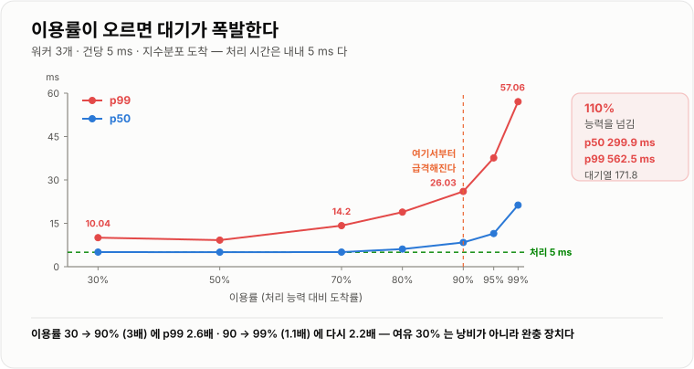
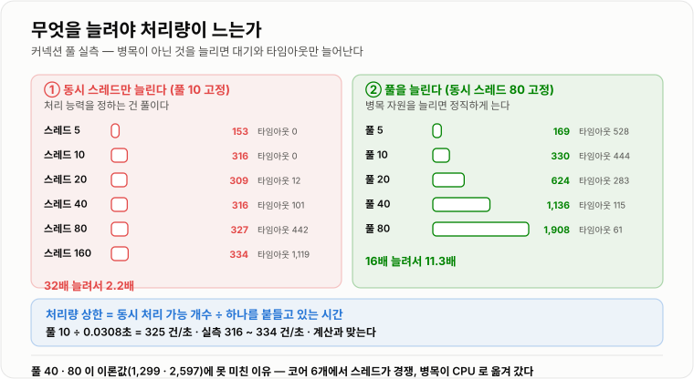

# 장애 분석과 성능 개선

> **"CPU도 안 높은데 응답이 느리다"는 대부분 대기 문제다. 실측에서 처리 시간이 5 ms로 내내 똑같은데도 이용률이 30%에서 99%로 오르자 p99가 10 ms에서 57 ms가 됐고, 100%를 넘기자 562 ms가 됐다. 늘어난 것은 전부 "기다린 시간"이었다.**

---

## 1. 핵심 요약

**장애 분석은 감이 아니라 절차다. 신호로 범위를 좁히고, 자원의 한계를 계산으로 확인하고, 스레드 덤프로 지금 무엇을 기다리는지 본다. 성능 개선도 마찬가지로 "무엇이 한계인가"를 먼저 정하고 그것만 손대는 일이다.**

### 한눈에 보기

* **응답 시간은 "처리 시간 + 기다린 시간"이다.** 그리고 장애 상황에서 커지는 것은 거의 언제나 **기다린 시간**이다.
* 실측에서 워커 3개·건당 5 ms(처리 능력 600건/초) 시스템에 부하를 올렸더니, **처리 시간은 5 ms로 고정인데** p99가 이렇게 변했다.
  **30% 10.0 ms → 70% 14.2 ms → 90% 26.0 ms → 95% 37.6 ms → 99% 57.1 ms → 110% 562.5 ms.**
* **90%를 넘어가면서 급격해진다.** 이용률이 30%→90%로 3배 오르는 동안 p99는 2.6배인데, 90%→99%로 겨우 1.1배 오르는 동안 다시 2.2배가 된다. **선형이 아니다.**
* **100%를 넘으면 무너진다.** 110%에서 p50이 **299.9 ms**(60배), 대기열 길이가 **171.8**이 됐다. 들어오는 속도가 처리 속도보다 빠르면 **대기열은 무한히 자란다.**
* **그래서 "여유 30%"는 낭비가 아니라 설계다.** 이용률 70%까지는 p99가 처리 시간의 3배 안쪽이지만, 95%부터는 손쓸 수 없다.
* **커넥션 풀 고갈도 같은 현상이다.** 풀 10개·보유 30.8 ms인 시스템에 동시 스레드를 **5 → 160개(32배)** 로 늘려 봤더니 **처리량은 153 → 334건/초로 2.2배에서 멈췄고**, 대신 **타임아웃이 0 → 1,119건**이 됐다.
* **처리량의 천장은 계산할 수 있다.** `풀 크기 ÷ 보유 시간 = 10 ÷ 0.0308초 = 325건/초`인데, 실측이 **316~334건/초**로 정확히 맞았다.
* **그러니 스레드를 늘리는 것은 대책이 아니다.** 실측에서 풀 크기를 5 → 80으로 늘렸을 때만 처리량이 **169 → 1,908건/초(11.3배)** 로 늘었다. **병목이 아닌 곳을 늘리면 대기만 늘어난다.**
* **스레드 덤프는 "지금 무엇을 기다리는가"를 그대로 보여 준다.** 데드락은 JVM이 직접 찾아 주고(`findDeadlockedThreads`), 락 경합은 **같은 스택에 `BLOCKED`가 몰리는 모양**으로, 느린 외부 호출은 **`TIMED_WAITING`이 쌓이는 모양**으로 나타난다.
* 실측에서 스레드 12개가 같은 락을 노리자 **11개가 정확히 같은 스택 한 줄에서 `BLOCKED`** 였다. 덤프에서 병목을 찾는 방법이 이것이다.
* **"CPU가 낮다"가 "한가하다"는 뜻이 아니다.** 느린 외부 호출 실험에서 풀 스레드 4개가 전부 `TIMED_WAITING`이었는데 CPU는 0%였다. **바쁜 것과 묶인 것은 다르다.**

> 이 노트의 수치는 **JDK 17.0.12 (HotSpot) · Windows 11 · 6코어**에서 직접 측정했다. 이용률 실험은 **워커 3개 · 건당 5 ms CPU 작업 · 지수분포 도착**으로 6초씩, 커넥션 풀 실험은 **HikariCP 6.3.3**에 가짜 `DataSource`를 물려 5초씩 돌렸다. 커넥션 보유는 `Thread.sleep(20)`으로 지시했지만 **윈도우의 스케줄러 정밀도 때문에 실제로는 30.8 ms**였고, 이 노트의 계산은 **실측된 30.8 ms**를 쓴다.

### 무엇을 해결하는가

#### 해결하려는 문제

"응답이 느리다"는 신고를 받고 서버를 봤다.

```text
CPU          12%          한가해 보인다
메모리        45%          여유 있다
GC           정상          문제없다
DB 슬로우 쿼리  없음         쿼리도 빠르다

그런데 응답은 3초가 걸린다
```

**모든 지표가 정상인데 느리다.** 이게 가장 흔한 장애 모습이고, 여기서 대부분 막힌다.

이유는 단순하다. **위 지표들은 전부 "얼마나 바쁜가"를 재는데, 문제는 "얼마나 기다리는가"에 있다.**

#### 이 개념이 없을 때

대기라는 축이 머릿속에 없으면 이런 대응을 하게 된다.

```text
① 서버를 늘린다
   → 병목이 DB 커넥션이면 서버가 늘수록 커넥션 경쟁만 심해진다. 더 나빠질 수도 있다

② 스레드 풀을 키운다
   → 실측: 동시 스레드 5 → 160 개(32배)에 처리량은 153 → 334 건/초(2.2배)
      늘어난 건 대기 시간과 타임아웃 1,119 건뿐이었다

③ 타임아웃을 늘린다
   → 실패가 느린 성공으로 바뀔 뿐이다. 스레드는 더 오래 묶인다

④ 재시작한다
   → 대기열이 비워져 잠깐 나아진다. 원인은 그대로다
```

**②가 특히 흔하고 특히 나쁘다.** 실측으로 확인해 보면 명확하다.

```text
풀 크기 10 고정, 동시 스레드만 늘림
  스레드   5  → 처리 153 건/초 · 타임아웃     0
  스레드 160  → 처리 334 건/초 · 타임아웃 1,119

풀 크기를 늘림 (동시 스레드 80 고정)
  풀  5  → 처리   169 건/초
  풀 80  → 처리 1,908 건/초        11.3 배
```

**병목인 자원(풀)을 늘렸을 때만 처리량이 늘었다.** 병목이 아닌 것(스레드)을 늘리면 **대기줄만 길어진다.**

필요한 것은 **"어디가 한계인지 계산으로 확인하는 방법"** 과 **"지금 무엇을 기다리는지 보는 방법"** 이다.

---

## 2. 동작 원리

### 핵심 구성 요소

| 요소 | 무엇을 알려 주는가 | 언제 본다 |
| --- | --- | --- |
| **메트릭** | 언제부터 얼마나 이상한가 | 가장 먼저 |
| **이용률(ρ)** | 처리 능력 대비 얼마나 채웠는가 | 대기가 의심될 때 |
| **대기열 길이** | 지금 몇 개가 줄 서 있는가 | 이용률과 함께 |
| **스레드 덤프** | 지금 각 스레드가 무엇을 하는가 | 멈췄거나 느릴 때 |
| **힙 덤프 · GC 로그** | 메모리가 어디로 갔는가 | OOM·긴 정지 |
| **`findDeadlockedThreads`** | 순환 대기가 있는가 | 완전히 멈췄을 때 |

### 내부 동작 과정

#### 이용률이 오르면 왜 갑자기 무너지는가

처리 능력이 정해진 시스템(워커 3개, 건당 5 ms → 600건/초)에 **도착률만 바꿔 가며** 응답 시간을 쟀다. 도착은 실제 트래픽처럼 **불규칙하게(지수분포)** 만들었고, **대기열에서 기다린 시간까지 포함**해 쟀다.



*처리 시간은 5 ms로 내내 같다. 늘어난 것은 전부 기다린 시간이다.*

```text
이용률   요청/초    p50       p95       p99      대기열 길이
  30%      180    5.05 ms   5.63 ms   10.04 ms      1.0
  50%      300    5.03 ms   7.75 ms    9.19 ms      1.1
  70%      420    5.05 ms  10.46 ms   14.20 ms      1.5
  80%      480    6.10 ms  13.78 ms   18.88 ms      2.0
  90%      540    8.39 ms  19.52 ms   26.03 ms      3.5
  95%      570   11.47 ms  28.96 ms   37.62 ms      5.7
  99%      594   21.30 ms  49.31 ms   57.06 ms     11.9
 110%      660  299.94 ms 548.02 ms  562.47 ms    171.8
```

**세 가지를 읽어야 한다.**

**① 처리 시간은 내내 5 ms다.** 코드도, 데이터도, 서버도 그대로다. **바뀐 것은 도착률뿐**이다. 그런데 p99가 10 ms에서 562 ms가 됐다.

**② 곡선이 휘어진다.** 30% → 90%로 이용률이 **3배** 오르는 동안 p99는 **2.6배**다. 그런데 90% → 99%로 **1.1배** 오르는 동안 p99가 다시 **2.2배**가 된다.

```text
이용률이 100% 에 가까워질수록 같은 증가가 훨씬 큰 대기를 만든다
```

왜 그런가. **도착이 불규칙하기 때문**이다. 평균으로는 여유가 있어도, 순간적으로 몰리면 줄이 생긴다. 이용률이 낮으면 그 줄이 다음 여유 구간에 금방 빠지지만, 이용률이 높으면 **빠질 여유가 없어 줄이 남는다.** 그 남은 줄 위에 다음 몰림이 얹힌다.

**③ 100%를 넘으면 다른 세계다.** 110%에서는 p50이 299.9 ms, 대기열이 171.8이다. 이건 "느려진 것"이 아니라 **"쌓이는 것"** 이다.

```text
이용률 < 100%    줄이 생겼다 사라졌다 한다. 평형이 있다
이용률 ≥ 100%    줄이 계속 자란다. 평형이 없다
                 → 시간이 갈수록 나빠진다. 부하가 멈출 때까지
```

**그래서 실무에서 목표 이용률을 70% 안팎으로 잡는다.** 남은 30%는 낭비가 아니라 **불규칙한 도착을 흡수하는 완충 장치**다.

#### 처리량의 천장은 계산할 수 있다

동시에 처리할 수 있는 개수와 하나를 붙들고 있는 시간을 알면 **처리량의 상한이 나온다.**

```text
처리량 상한 = 동시 처리 가능 개수 ÷ 하나를 붙들고 있는 시간
```

커넥션 풀로 확인했다. 풀 10개, 커넥션 보유 시간 실측 **30.8 ms**다.

```text
이론값   10 ÷ 0.0308초 = 325 건/초
```

동시 스레드 수를 바꿔 가며 실제 처리량을 쟀다.

```text
동시 스레드   대기 p50    대기 p95    대기 p99   타임아웃   처리/초
       5     0.01 ms     0.03 ms    15.60 ms        0      153
      10     0.00 ms     0.02 ms    16.96 ms        0      316
      20     0.02 ms   199.68 ms   449.61 ms       12      309
      40     0.03 ms   501.42 ms   513.98 ms      101      316
      80     0.05 ms   513.00 ms   515.33 ms      442      327
     160   367.33 ms   514.70 ms   515.49 ms    1,119      334
```

**처리량이 316 → 334건/초에서 멈춰 있다.** 계산한 325건/초와 거의 같다. 스레드를 10개에서 160개로 **16배** 늘리는 동안 처리량은 **5.7%** 늘었다.

**대신 대기와 실패가 폭증했다.**

```text
스레드  10 →  대기 p99  16.96 ms · 타임아웃     0
스레드 160 →  대기 p99 515.49 ms · 타임아웃 1,119    (connectionTimeout 500 ms 에 걸린 것)
```

**이 표가 "스레드를 늘려도 안 되는 이유"의 전부다.** 처리 능력은 풀이 정하고, 스레드는 **줄 서는 사람 수**만 늘린다.

#### 그럼 무엇을 늘려야 하나



*병목이 아닌 것을 늘리면 대기와 타임아웃만 늘고, 병목을 늘리면 처리량이 정직하게 는다.*

같은 실험을 반대로 했다. 동시 스레드를 80개로 고정하고 **풀 크기만** 바꿨다.

```text
풀 크기   대기 p95    대기 p99   타임아웃   처리/초
     5   514.24 ms  515.50 ms      528      169
    10   513.40 ms  515.07 ms      444      330
    20   502.07 ms  514.37 ms      283      624
    40   253.09 ms  505.54 ms      115    1,136
    80    49.21 ms  362.10 ms       61    1,908
```

**이번에는 처리량이 정직하게 늘었다.** 5 → 80으로 16배 늘렸을 때 169 → 1,908건/초로 **11.3배**다.

이론값(풀÷0.0308)과 비교하면 이렇다.

```text
풀  5 → 이론   162 · 실측   169
풀 10 → 이론   325 · 실측   330
풀 20 → 이론   649 · 실측   624
풀 40 → 이론 1,299 · 실측 1,136
풀 80 → 이론 2,597 · 실측 1,908
```

**풀 40·80에서 이론값에 못 미친다.** 코어가 6개뿐이라 스레드 80개가 CPU를 두고 경쟁하기 때문이다. **즉 병목이 풀에서 CPU로 옮겨 간 것**이고, 이게 성능 개선의 일반적인 모습이다.

```text
병목을 하나 없애면 다음 병목이 드러난다
→ "무한정 좋아지지 않는다"는 뜻이고,
   동시에 "매번 다시 측정해야 한다"는 뜻이다
```

!!! warning "풀을 무작정 키우면 안 되는 이유"

    풀 크기는 **DB가 감당할 수 있는 동시 연결 수**에 묶여 있다. 애플리케이션 서버가 10대인데
    각각 풀을 80으로 잡으면 DB는 동시 연결 **800개**를 받는다. DB 쪽이 먼저 무너진다.
    **풀 크기 × 서버 대수**를 항상 함께 본다.

#### 스레드 덤프 — 지금 무엇을 기다리는가

지표로 범위를 좁혔으면, **그 순간의 스레드 상태**를 본다. 자바 스레드 상태는 이렇게 읽는다.

```text
RUNNABLE        실행 중이거나 실행 가능 (I/O 대기도 여기에 보일 수 있다)
BLOCKED         synchronized 락을 기다린다           ← 락 경합
WAITING         조건을 무기한 기다린다 (wait, join, 락 획득)
TIMED_WAITING   시간 제한을 두고 기다린다 (sleep, 타임아웃 있는 대기)
```

**세 가지 전형적인 모양**을 직접 재현해 봤다.

**① 데드락 — JVM이 직접 찾아 준다**

```text
주문-스레드 [BLOCKED]  기다리는 락: java.lang.Object@cc34f4d  그 락을 쥔 스레드: 재고-스레드
재고-스레드 [BLOCKED]  기다리는 락: java.lang.Object@70177ecd  그 락을 쥔 스레드: 주문-스레드
```

**서로가 서로를 기다린다.** `jstack` 덤프에서는 `Found one Java-level deadlock:` 으로 나온다. 코드로도 확인할 수 있다.

```java
ThreadMXBean mx = ManagementFactory.getThreadMXBean();
long[] ids = mx.findDeadlockedThreads();     // 순환 대기를 JVM 이 직접 찾아 준다
```

**② 락 경합 — 같은 스택에 몰린다**

스레드 12개가 같은 락을 노리게 하고 상태를 세 봤다.

```text
상태 분포: {BLOCKED=11, TIMED_WAITING=1}
같은 지점에 11개: DumpDiag.lambda$contention$2(DumpDiag.java:57)
같은 지점에  1개: java.lang.Thread.sleep(Native Method)
```

**11개가 정확히 같은 줄에서 막혀 있다.** 이게 덤프에서 병목을 찾는 방법이다.

```text
덤프를 읽는 법
  ① 스레드를 상태별로 센다
  ② BLOCKED / WAITING 스레드의 스택 맨 위 줄을 모아 센다
  ③ 같은 줄이 여러 개면 그 줄이 병목이다
```

**③ 느린 외부 호출 — `TIMED_WAITING`이 쌓이고 CPU는 0%**

```text
TIMED_WAITING 인 풀 스레드 4개 (풀 크기 4)
CPU 0%
```

**풀이 통째로 묶였다.** 응답이 없는 외부 API 하나가 서비스 전체를 세우는 전형적인 모습이다.

```text
"CPU 가 낮다" 가 뜻하는 것
  ✗ 한가하다
  ○ CPU 를 쓰는 일을 안 하고 있다 — 기다리는 중일 수 있다
```

**여기서 덤프를 두세 번 뜨는 것이 중요하다.** 한 번만 뜨면 "우연히 그 순간"일 수 있다.

```text
jstack <pid> > dump1.txt      # 5초 간격으로 3번
jstack <pid> > dump2.txt
jstack <pid> > dump3.txt

→ 세 번 다 같은 줄에 있는 스레드 = 진짜 멈춘 것
→ 매번 다른 줄에 있으면 = 그냥 바쁜 것
```

#### 장애 조사의 순서

```text
① 언제부터, 얼마나?          메트릭 — 오류율·지연·처리량의 변곡점을 찾는다
② 무엇이 같이 변했나?         배포·설정 변경·트래픽·외부 의존성
③ 한계에 닿았나?             이용률·풀 사용률·대기열 길이  ← 계산으로 확인한다
④ 지금 무엇을 기다리나?       스레드 덤프 3회
⑤ 왜 그런가?                로그 (traceId 로 좁혀서)
⑥ 메모리 문제인가?           GC 로그 · 힙 덤프
```

**①~③을 건너뛰고 ⑤부터 보면** 하루 수십 GB의 로그에서 헤매게 된다.

#### 성능 개선의 순서

```text
① 목표를 숫자로 정한다        "p99 를 800 ms 아래로" (평균이 아니라 백분위로)
② 지금 값을 잰다             안 재고 고치면 좋아졌는지 알 수 없다
③ 어디에 시간이 쓰이는지 나눈다  구간별 시간 (트레이싱·타이머)
④ 가장 큰 것 하나만 고친다     여러 개를 동시에 고치면 무엇이 효과인지 모른다
⑤ 다시 잰다                  병목은 옮겨 다닌다 (풀 → CPU)
```

**④가 핵심이다.** 전체의 5%인 구간을 2배 빠르게 만들면 전체는 2.5% 좋아진다. **비중이 큰 것부터** 손댄다.

---

## 3. 특징과 비교

| 구분          | 내용 |
| ----------- | -- |
| **장점**      | 이용률·대기열이라는 축을 쓰면 **"CPU가 낮은데 느리다"가 설명된다.** 처리량 상한을 `동시 처리 개수 ÷ 보유 시간`으로 **계산해 예측**할 수 있고(실측 325 vs 316~334건/초로 일치), 스레드 덤프는 **지금 무엇을 기다리는지 그대로** 보여 준다. 데드락은 JVM이 직접 찾아 주고, 락 경합은 **같은 스택에 몰린 `BLOCKED`** 로 즉시 드러난다. |
| **단점**      | 이용률 곡선은 **비선형이라 감이 잘 안 온다** — 90%까지 멀쩡해 보이다가 95%부터 무너진다. 스레드 덤프는 **그 순간의 사진**이라 한 번만 보면 오해하기 쉽고, 뜨는 데 짧은 정지가 생긴다. 병목은 하나를 없애면 **다음으로 옮겨 가므로**(풀 → CPU) 한 번의 개선으로 끝나지 않는다. 힙 덤프는 크고(수 GB) 뜨는 동안 애플리케이션이 멈춘다. |
| **적합한 상황**  | 이용률·대기열 분석 — **CPU·메모리는 정상인데 느린** 모든 경우, 부하가 늘 때 응답이 급격히 나빠지는 경우. 스레드 덤프 — 응답이 아예 없거나 특정 API만 느릴 때, 배포 후 멈췄을 때. 처리량 계산 — **풀 크기·스레드 수·타임아웃을 정할 때**(추측 대신 계산). |
| **주의할 상황**  | **스레드·풀을 먼저 키우는 경우** — 병목이 아니면 대기와 타임아웃만 늘어난다(실측 32배 늘려 2.2배). **타임아웃을 늘리는 경우** — 실패가 느린 성공으로 바뀌고 스레드는 더 오래 묶인다. **풀만 보고 DB를 안 보는 경우** — 서버 10대 × 풀 80이면 DB 연결 800개다. **덤프를 한 번만 뜨는 경우** — 바쁜 것과 멈춘 것을 구분 못 한다. **평균 응답 시간만 보는 경우** — p99가 무너져도 평균은 멀쩡하다. |

### 성능 특성

#### 이용률에 따른 응답 시간 (워커 3 · 건당 5 ms · 지수분포 도착 · 6초)

```text
이용률   요청/초       p50        p95        p99   대기열
  30%      180    5.05 ms    5.63 ms   10.04 ms     1.0
  50%      300    5.03 ms    7.75 ms    9.19 ms     1.1
  70%      420    5.05 ms   10.46 ms   14.20 ms     1.5
  80%      480    6.10 ms   13.78 ms   18.88 ms     2.0
  90%      540    8.39 ms   19.52 ms   26.03 ms     3.5
  95%      570   11.47 ms   28.96 ms   37.62 ms     5.7
  99%      594   21.30 ms   49.31 ms   57.06 ms    11.9
 110%      660  299.94 ms  548.02 ms  562.47 ms   171.8

처리 시간은 내내 5 ms — 늘어난 것은 전부 대기다
```

#### 커넥션 풀 (풀 10 · 보유 실측 30.8 ms · connectionTimeout 500 ms)

```text
동시 스레드   대기 p99   타임아웃   처리/초
       5     15.60 ms        0      153
      10     16.96 ms        0      316
      20    449.61 ms       12      309
      40    513.98 ms      101      316
      80    515.33 ms      442      327
     160    515.49 ms    1,119      334

이론 천장 = 10 ÷ 0.0308초 = 325 건/초   ← 실측과 일치
```

#### 풀 크기를 늘렸을 때 (동시 스레드 80 고정)

```text
풀 크기   처리/초   이론값   타임아웃
     5      169     162       528
    10      330     325       444
    20      624     649       283
    40    1,136   1,299       115
    80    1,908   2,597        61

풀 40·80 이 이론에 못 미치는 이유 = 코어 6개에서 스레드 80개가 경쟁 (병목이 CPU 로 옮겨 갔다)
```

### 장점과 단점

#### 장점

* **원인을 계산으로 확인할 수 있다.** "풀이 부족한 것 같다"가 아니라 `10÷0.0308 = 325건/초`라고 말할 수 있다.
* **덤프는 추측을 없앤다.** 11개 스레드가 같은 줄에 있으면 그 줄이 병목이다. 해석의 여지가 없다.
* **데드락은 JVM이 찾아 준다.** 사람이 순환을 추적할 필요가 없다.
* **이용률 곡선을 알면 용량을 미리 정할 수 있다.** 70% 목표가 왜 필요한지 숫자로 설명된다.

#### 단점

* **곡선이 비선형이라 경고가 늦다.** 90%까지는 지표가 멀쩡해 보인다.
* **덤프는 순간의 사진이다.** 여러 번 떠서 비교하지 않으면 잘못 읽는다.
* **병목이 옮겨 다닌다.** 풀을 늘렸더니 CPU가 병목이 됐다. 개선은 반복 작업이다.
* **덤프·힙 덤프를 뜨는 것 자체가 부하다.** 힙 덤프는 수 GB이고 그동안 멈춘다.
* **재현이 어렵다.** 부하·타이밍·데이터가 맞아야 나는 문제가 대부분이다.

### 어떤 상황에서 고르는가

```text
증상이 무엇인가?

  아예 응답이 없다 (멈췄다)
    → 스레드 덤프 3회.  BLOCKED 가 같은 줄에 몰렸나? 데드락인가?

  느리지만 응답은 온다
    → 이용률·대기열·풀 사용률.  한계에 닿았나?
       닿았으면 → 병목 자원을 늘린다 (그 자원만)
       안 닿았으면 → 구간별 시간을 나눠 본다 (트레이싱)

  간헐적으로 느리다 (p99만 나쁘다)
    → GC 로그 (정지 시간), 이용률의 순간 변동, 외부 호출 타임아웃

  메모리가 계속 는다
    → GC 로그로 Old 영역 추세 → 힙 덤프 → 무엇이 참조를 붙들고 있나
```

### 비슷한 기술과 비교

#### 진단 도구

| 기준 | 스레드 덤프 | 힙 덤프 | GC 로그 | 프로파일러 |
| --- | --- | --- | --- | --- |
| **답하는 것** | 지금 무엇을 기다리나 | 메모리가 어디 갔나 | 정지가 얼마나 긴가 | 어디에 시간을 쓰나 |
| **부하** | 짧은 정지 | **큰 정지 + 수 GB** | 거의 없다(상시) | 있다 |
| **상시 켜기** | 아니오 | 아니오 | **예** | 대개 아니오 |
| **쓸 때** | 멈춤·느림 | OOM·메모리 증가 | 긴 정지·p99 | 최적화 |

#### 대기가 늘 때 무엇을 늘리나

| 기준 | 스레드 수 | 풀 크기 | 서버 대수 |
| --- | --- | --- | --- |
| **처리량 효과** | **거의 없다**(실측 32배에 2.2배) | **크다**(16배에 11.3배) | 크다 |
| **부작용** | 대기·타임아웃 폭증 | **DB 부하 증가** | 커넥션 총량 증가 |
| **한계** | 병목이 아니면 무의미 | DB가 감당하는 만큼 | 공유 자원이 병목이면 무의미 |
| **먼저 확인할 것** | 병목이 스레드인가? | DB 최대 연결 수 | **풀 크기 × 대수** |

#### 평균 vs 백분위

| 기준 | 평균 | p95 · p99 |
| --- | --- | --- |
| **이용률 90%에서(실측)** | — | p50 8.39 ms인데 **p99 26.03 ms** |
| **느린 요청이 보이나** | **가려진다** | **보인다** |
| **사용자 체감** | 대표하지 못한다 | **가깝다** |
| **목표로 삼기** | 부적합 | **적합** |

**p50과 p99가 3배 벌어져도 평균은 크게 안 움직인다.** 목표는 백분위로 잡는다.

---

## 4. 실무 주의사항

### 백엔드 실무 적용

#### 풀 크기와 타임아웃을 계산으로 정한다

```text
필요한 풀 크기 = 목표 처리량 × 커넥션 보유 시간

예) 목표 500 건/초 · 보유 30 ms
    500 × 0.030 = 15 개

여기에 여유를 얹는다 — 이용률 70% 목표라면
    15 ÷ 0.7 ≈ 22 개
```

**그리고 DB 쪽 한계와 대조한다.**

```text
서버 10 대 × 풀 22 = 동시 연결 220 개
MySQL max_connections 가 151(기본값)이면 → 넘는다. 풀을 15로 낮추거나 DB 설정을 올린다
```

```yaml
spring:
  datasource:
    hikari:
      maximum-pool-size: 15
      minimum-idle: 15            # 최대와 같게 두면 늘었다 줄었다 하지 않는다
      connection-timeout: 3000    # 못 받으면 3초 안에 실패한다 (무한 대기 금지)
      max-lifetime: 1740000       # DB 의 wait_timeout 보다 짧게 (29분)
      leak-detection-threshold: 20000   # 20초 넘게 안 돌려주면 스택을 로그로 남긴다
```

!!! warning "`connection-timeout`을 길게 잡지 않는다"

    실측에서 500 ms 타임아웃 덕분에 과부하 상황에서도 **요청이 515 ms 안에 끝났다**(실패로).
    타임아웃이 없거나 길면 그 스레드는 계속 묶이고, **묶인 스레드가 다시 대기를 만든다.**
    **빨리 실패하는 것이 느리게 성공하는 것보다 낫다.**

#### 외부 호출에는 반드시 타임아웃을 건다

실측에서 응답 없는 호출 하나가 **풀 스레드 4개를 전부 `TIMED_WAITING`으로** 만들었다.

```java
@Bean
public RestClient paymentClient() {
    ClientHttpRequestFactorySettings settings = ClientHttpRequestFactorySettings.DEFAULTS
            .withConnectTimeout(Duration.ofSeconds(2))     // 연결까지
            .withReadTimeout(Duration.ofSeconds(3));       // 응답까지 — 이게 없으면 무한정 묶인다

    return RestClient.builder()
            .requestFactory(ClientHttpRequestFactories.get(settings))
            .baseUrl("https://payment.example.com")
            .build();
}
```

**그리고 격벽(bulkhead)을 나눈다.** 외부 호출용 스레드 풀을 따로 두면, 그 API가 죽어도 **나머지 요청은 계속 처리된다.**

```text
공용 풀 하나        결제 API 가 느려지면 → 조회 요청도 같이 막힌다
풀을 나누면         결제 API 가 느려지면 → 결제만 막히고 조회는 산다
```

#### 스레드 덤프를 제대로 뜨는 법

```bash
# 프로세스 확인
jcmd -l

# 스레드 덤프 — 5초 간격으로 3번 (한 번만 뜨면 오해한다)
jcmd <pid> Thread.print > dump1.txt
jcmd <pid> Thread.print > dump2.txt
jcmd <pid> Thread.print > dump3.txt

# 상태별로 세어 본다
grep 'java.lang.Thread.State' dump1.txt | sort | uniq -c
```

읽는 순서는 이렇다.

```text
① "Found one Java-level deadlock" 이 있나?          → 있으면 거기서 끝
② BLOCKED 가 몇 개인가?                             → 많으면 락 경합
③ BLOCKED 스레드들의 스택 맨 위 줄이 같은가?          → 같으면 그 줄이 병목
④ 요청 처리 스레드가 전부 WAITING/TIMED_WAITING 인가? → 외부 호출·DB 대기
⑤ 세 덤프에서 같은 스레드가 같은 줄에 있나?           → 진짜 멈춘 것
```

#### GC 로그는 평소에 켜 둔다

```text
-Xlog:gc*:file=/var/log/app/gc.log:time,uptime,level,tags:filecount=5,filesize=20M
```

**부하가 거의 없고, 문제가 생긴 뒤에는 못 켠다.** 상시 켜 두는 몇 안 되는 진단 수단이다.

```text
GC 로그에서 볼 것
  정지 시간(pause)이 얼마나 긴가            → p99 를 망치는 원인
  Full GC 가 반복되는가                     → 메모리 부족·누수 의심
  GC 후에도 Old 영역이 계속 느는가          → 누수. 힙 덤프로 간다
```

#### OOM에 대비해 힙 덤프를 자동으로 남긴다

```text
-XX:+HeapDumpOnOutOfMemoryError
-XX:HeapDumpPath=/var/log/app/heapdump.hprof
-XX:+ExitOnOutOfMemoryError
```

**OOM은 재현이 거의 불가능하다.** 터진 순간의 힙이 유일한 증거다. 다만 힙 덤프는 **힙 크기만큼 크므로** 디스크 여유를 확인해 둔다.

#### 성능 개선은 한 번에 하나만

```java
// 나쁜 접근 — 무엇이 효과였는지 알 수 없다
// 인덱스 추가 + 캐시 도입 + 풀 확대 + 쿼리 수정을 한 배포에 넣는다

// 좋은 접근
// ① 지금 p99 를 잰다                        1,240 ms
// ② 구간별로 나눈다                          DB 980 ms · 외부 API 180 ms · 나머지 80 ms
// ③ 가장 큰 것 하나를 고친다                  DB 인덱스 추가
// ④ 다시 잰다                               p99 420 ms
// ⑤ 다시 나눈다                             외부 API 180 ms 가 이제 제일 크다 → 다음 대상
```

**병목이 옮겨 다니는 것이 정상이다.** 실측에서도 풀을 늘리자 병목이 CPU로 옮겨 갔다.

#### 부하 테스트는 이용률을 바꿔 가며 한다

```text
나쁜 부하 테스트    "초당 1,000 건에서 잘 버티나?"  → 통과/실패만 나온다
좋은 부하 테스트    도착률을 30% → 50% → 70% → 90% → 100% 로 올려 가며 p99 를 본다
                   → 무너지기 시작하는 지점(변곡점)을 찾는다. 그게 실제 용량이다
```

**실측에서 변곡점은 90% 부근**이었다. 그 지점을 알면 알림 임계값과 증설 기준을 숫자로 정할 수 있다.

### 자주 하는 오해

| 잘못된 이해 | 올바른 이해 |
| --- | --- |
| "CPU가 낮으면 서버는 한가하다" | 기다리는 중일 수 있다. 실측에서 풀 스레드 전부가 `TIMED_WAITING`인데 CPU는 0%였다. |
| "느리면 스레드를 늘리면 된다" | 실측에서 스레드를 **32배** 늘려 처리량은 **2.2배**, 타임아웃은 **0 → 1,119건**이 됐다. |
| "이용률 90%면 아직 여유가 있다" | p99가 이미 처리 시간의 **5.2배**(5 → 26.03 ms)다. 95%부터 급격해진다. |
| "부하가 2배면 응답도 2배쯤 느려진다" | **비선형**이다. 이용률 99% → 110%에서 p99가 57 → 562 ms로 **10배**가 됐다. |
| "이용률 100%가 가장 효율적이다" | 100%를 넘으면 **대기열이 무한히 자란다.** 평형이 없다. |
| "타임아웃을 늘리면 실패가 준다" | 실패가 **느린 성공**으로 바뀌고 스레드는 더 오래 묶인다. 빨리 실패하는 게 낫다. |
| "풀은 크게 잡을수록 좋다" | 서버 10대 × 풀 80이면 DB 연결 **800개**다. DB가 먼저 죽는다. |
| "풀을 늘리면 처리량이 계속 는다" | 실측에서 풀 40·80은 이론값에 못 미쳤다. **병목이 CPU로 옮겨 갔기 때문**이다. |
| "스레드 덤프 한 번이면 충분하다" | **순간의 사진**이다. 3번 떠서 같은 줄에 있어야 진짜 멈춘 것이다. |
| "`BLOCKED`가 있으면 데드락이다" | `BLOCKED`는 락을 기다리는 정상 상태다. **데드락은 순환 대기**이고 JVM이 따로 알려 준다. |
| "평균 응답 시간이 괜찮으면 괜찮다" | 이용률 90%에서 p50 8.39 ms인데 **p99가 26.03 ms**였다. 평균은 꼬리를 가린다. |
| "GC 로그는 문제가 생기면 켜면 된다" | 문제가 **생긴 뒤에는 그때 로그가 없다.** 부하가 거의 없으니 상시 켠다. |
| "병목을 고치면 성능 문제가 끝난다" | 다음 병목이 드러난다. 개선은 **재측정을 포함한 반복**이다. |
| "부하 테스트는 목표치를 넘기는지 보면 된다" | **무너지는 지점(변곡점)** 을 찾아야 용량과 알림 임계값을 정할 수 있다. |

---

## 5. 예제

### 처리량 상한을 계산한다

```java
// 어떤 자원이든 같은 식이다
//   처리량 상한 = 동시 처리 가능 개수 ÷ 하나를 붙들고 있는 시간

int poolSize = 10;
double holdSeconds = 0.0308;                  // 실측한 보유 시간

double maxThroughput = poolSize / holdSeconds;   // 325 건/초

// 반대로, 목표 처리량에서 필요한 풀 크기를 구한다
double targetTps = 500;
int needed = (int) Math.ceil(targetTps * holdSeconds);          // 16
int withHeadroom = (int) Math.ceil(needed / 0.7);               // 23 (이용률 70% 목표)
```

### 데드락 탐지

```java
ThreadMXBean mx = ManagementFactory.getThreadMXBean();
long[] ids = mx.findDeadlockedThreads();

if (ids != null) {
    for (ThreadInfo info : mx.getThreadInfo(ids, true, true)) {
        log.error("데드락: {} [{}] 기다리는 락={} 그 락을 쥔 스레드={}",
                  info.getThreadName(), info.getThreadState(),
                  info.getLockInfo(), info.getLockOwnerName());
        log.error("  맨 위 스택: {}", info.getStackTrace()[0]);
    }
}
```

실제 출력이다.

```text
데드락: 주문-스레드 [BLOCKED] 기다리는 락=java.lang.Object@cc34f4d 그 락을 쥔 스레드=재고-스레드
데드락: 재고-스레드 [BLOCKED] 기다리는 락=java.lang.Object@70177ecd 그 락을 쥔 스레드=주문-스레드
```

### 락 경합을 코드로 찾는다

```java
// BLOCKED 스레드들의 스택 맨 위 줄을 세어 본다 — 같은 줄이 많으면 그게 병목이다
ThreadMXBean mx = ManagementFactory.getThreadMXBean();
Map<String, Integer> hotspots = new HashMap<>();

for (ThreadInfo info : mx.dumpAllThreads(false, false)) {
    if (info.getThreadState() == Thread.State.BLOCKED) {
        StackTraceElement[] st = info.getStackTrace();
        if (st.length > 0) hotspots.merge(st[0].toString(), 1, Integer::sum);
    }
}
hotspots.forEach((line, count) -> log.warn("BLOCKED {}개: {}", count, line));
// BLOCKED 11개: com.example.OrderService.place(OrderService.java:57)
```

### 락을 항상 같은 순서로 잡는다 (데드락 예방)

```java
// 데드락이 나는 코드 — 두 스레드가 반대 순서로 잡는다
void 주문처리(Order o) { synchronized (LOCK_A) { synchronized (LOCK_B) { ... } } }
void 재고처리(Item i) { synchronized (LOCK_B) { synchronized (LOCK_A) { ... } } }

// 순서를 정해 두면 순환이 생기지 않는다
void 주문처리(Order o) { synchronized (LOCK_A) { synchronized (LOCK_B) { ... } } }
void 재고처리(Item i) { synchronized (LOCK_A) { synchronized (LOCK_B) { ... } } }

// 여러 계좌 이체처럼 대상이 동적이면 식별자 순으로 정렬해 잡는다
void 이체(Account from, Account to, int amount) {
    Account first  = from.id() < to.id() ? from : to;
    Account second = from.id() < to.id() ? to   : from;
    synchronized (first) {
        synchronized (second) { /* ... */ }
    }
}
```

### 커넥션 풀 설정

```yaml
spring:
  datasource:
    hikari:
      maximum-pool-size: 15             # 목표 500건/초 × 0.030초 ÷ 0.7
      minimum-idle: 15
      connection-timeout: 3000          # 무한 대기 금지
      max-lifetime: 1740000             # DB wait_timeout 보다 짧게
      leak-detection-threshold: 20000   # 안 돌려주는 코드를 찾아 준다
```

### 진단용 JVM 옵션 (상시 적용)

```text
# GC 로그 — 부하가 거의 없다. 항상 켠다
-Xlog:gc*:file=/var/log/app/gc.log:time,uptime,level,tags:filecount=5,filesize=20M

# OOM 순간의 힙을 남긴다 — 재현이 안 되므로 이게 유일한 증거다
-XX:+HeapDumpOnOutOfMemoryError
-XX:HeapDumpPath=/var/log/app/heapdump.hprof
-XX:+ExitOnOutOfMemoryError
```

### 이용률을 메트릭으로 노출한다

```java
// 풀 사용률을 항상 볼 수 있게 해 둔다 — 한계에 닿았는지 즉시 알 수 있다
Gauge.builder("db.pool.usage", hikariDataSource,
              ds -> (double) ds.getHikariPoolMXBean().getActiveConnections()
                            / ds.getHikariPoolMXBean().getTotalConnections())
     .description("커넥션 풀 사용률 (0.0 ~ 1.0)")
     .register(registry);

// 대기 중인 스레드 수 — 이게 0보다 크면 이미 줄이 서 있다
Gauge.builder("db.pool.pending", hikariDataSource,
              ds -> ds.getHikariPoolMXBean().getThreadsAwaitingConnection())
     .register(registry);
```

---

## 6. 면접 정리

### 자주 나오는 질문

#### 기본 질문

1. **CPU와 메모리는 정상인데 응답이 느리다면 무엇을 의심하는가?**

    * 핵심 키워드: 대기 시간 · 이용률 · 커넥션 풀 · 외부 호출 · 스레드 덤프

2. **장애가 났을 때 어떤 순서로 조사하는가?**

    * 핵심 키워드: 메트릭으로 범위 → 이용률로 한계 확인 → 덤프로 대기 확인 → 로그로 원인

3. **스레드 덤프에서 무엇을 보는가?**

    * 핵심 키워드: 상태 분포 · `BLOCKED`가 같은 스택에 몰림 · 3회 비교 · 데드락 표시

4. **커넥션 풀 크기는 어떻게 정하는가?**

    * 핵심 키워드: 목표 처리량 × 보유 시간 ÷ 목표 이용률 · DB 최대 연결 수 · 서버 대수 곱하기

5. **성능 개선은 어떤 순서로 하는가?**

    * 핵심 키워드: 목표를 백분위로 · 측정 · 구간 분해 · 하나만 고치기 · 재측정

#### 꼬리 질문

1. **이용률이 90%를 넘으면 왜 갑자기 느려지는가?**

    * 핵심 키워드: 도착의 불규칙성 · 여유가 없으면 줄이 안 빠짐 · 비선형 · 100% 넘으면 무한 증가

2. **스레드를 늘리면 왜 처리량이 안 느는가?**

    * 핵심 키워드: 처리 능력은 병목 자원이 정함 · 32배에 2.2배 · 대기와 타임아웃만 증가

3. **타임아웃을 길게 잡으면 안 되는 이유는?**

    * 핵심 키워드: 느린 성공 · 스레드가 더 오래 묶임 · 그 스레드가 다시 대기를 만듦

4. **`BLOCKED`와 데드락은 어떻게 구분하는가?**

    * 핵심 키워드: `BLOCKED`는 정상 대기 · 데드락은 순환 대기 · `findDeadlockedThreads`

5. **평균이 아니라 p99를 보는 이유는?**

    * 핵심 키워드: 꼬리가 가려짐 · 실측 p50 8.39 vs p99 26.03 ms · 사용자 체감

### 30초 답변

> "CPU도 낮은데 느리다"는 거의 **대기 문제**입니다. 실측해 보면 처리 시간이 **5 ms로 내내 똑같은데** 이용률만 30%에서 99%로 올리자 p99가 **10 ms에서 57 ms**가 됐고, **100%를 넘기자 562 ms**가 됐습니다. 늘어난 건 전부 기다린 시간입니다. 그래서 조사는 **메트릭으로 범위를 좁히고, 이용률로 한계에 닿았는지 계산으로 확인하고, 스레드 덤프로 지금 무엇을 기다리는지 보는** 순서로 합니다.

#### 이어서 더 물으면

**가장 중요한 건 이 곡선이 비선형이라는 점입니다.** 이용률이 30%에서 90%로 **3배** 오르는 동안 p99는 2.6배인데, 90%에서 99%로 **1.1배** 오르는 동안 다시 2.2배가 됩니다. 원인은 **도착이 불규칙하기 때문**입니다. 평균으로 여유가 있어도 순간적으로 몰리면 줄이 생기는데, 이용률이 낮으면 다음 여유 구간에 줄이 빠지지만 높으면 빠질 여유가 없어 남고, 그 위에 다음 몰림이 얹힙니다. **100%를 넘으면 평형 자체가 없어서** 부하가 멈출 때까지 계속 나빠집니다. 실측에서 110%일 때 대기열 길이가 171.8이었습니다. **여유 30%는 낭비가 아니라 불규칙한 도착을 흡수하는 완충 장치**입니다.

**두 번째로 중요한 게 "스레드를 늘리는 건 대책이 아니다"입니다.** 커넥션 풀 10개짜리 시스템에서 동시 스레드를 **5에서 160개로 32배** 늘려 봤는데, 처리량은 **153 → 334건/초로 2.2배**에 그쳤고 타임아웃은 **0에서 1,119건**이 됐습니다. 이유는 **처리 능력을 정하는 건 병목 자원**이기 때문입니다. `풀 크기 ÷ 보유 시간`으로 계산하면 `10 ÷ 0.0308초 = 325건/초`인데, 실측이 316~334건/초로 정확히 맞았습니다. 반대로 **풀 크기를 5에서 80으로** 늘렸을 때는 **169 → 1,908건/초로 11.3배**가 됐습니다.

**그런데 여기서 한 가지가 더 나옵니다.** 풀 40·80에서는 실측이 이론값(1,299·2,597)에 못 미쳤는데, **코어가 6개뿐이라 스레드 80개가 CPU를 두고 경쟁**했기 때문입니다. 즉 **병목이 풀에서 CPU로 옮겨 간** 겁니다. 이게 성능 개선의 일반적인 모습이라, 하나를 고치면 반드시 다시 측정해야 합니다.

**풀을 키울 때 실무에서 놓치기 쉬운 게 DB 쪽 한계입니다.** 서버 10대에 각각 풀 80이면 DB는 동시 연결 **800개**를 받습니다. MySQL 기본 `max_connections`가 151이니 애플리케이션이 아니라 DB가 먼저 무너집니다. **풀 크기 × 서버 대수**를 항상 함께 봐야 합니다.

**스레드 덤프는 세 가지 모양을 알면 대부분 읽힙니다.** 데드락은 JVM이 직접 찾아 줘서 `findDeadlockedThreads()`나 덤프의 `Found one Java-level deadlock`으로 바로 나옵니다. 락 경합은 실험해 보니 스레드 12개 중 **11개가 정확히 같은 스택 한 줄에서 `BLOCKED`** 였습니다 — **같은 줄이 여러 개면 그 줄이 병목**입니다. 느린 외부 호출은 풀 스레드가 전부 `TIMED_WAITING`인데 **CPU는 0%** 인 모양으로 나타납니다. 다만 **덤프는 그 순간의 사진**이라 5초 간격으로 3번 떠서 같은 스레드가 같은 줄에 있는지 봐야 합니다. 한 번만 뜨면 "그냥 바쁜 것"과 "멈춘 것"을 구분할 수 없습니다.

**대책 쪽에서는 타임아웃과 격벽이 핵심입니다.** 타임아웃을 늘리는 건 대책이 아니라 **실패를 느린 성공으로 바꾸는 것**이고, 그동안 스레드가 더 오래 묶여서 그 스레드가 다시 대기를 만듭니다. 실측에서도 500 ms 타임아웃 덕에 과부하에서도 요청이 515 ms 안에 끝났습니다. 그리고 외부 호출용 스레드 풀을 분리해 두면 결제 API가 죽어도 조회 요청은 계속 처리됩니다.

**마지막으로 평균이 아니라 백분위를 봅니다.** 이용률 90%에서 p50이 8.39 ms인데 p99가 26.03 ms로 3배 넘게 벌어졌습니다. 평균만 보면 꼬리가 가려집니다. 부하 테스트도 "1,000건/초를 버티나"가 아니라 **도착률을 올려 가며 무너지는 변곡점을 찾는** 방식이어야 알림 임계값과 증설 기준을 숫자로 정할 수 있습니다.

#### 답변 구조

1. **정의** — 장애 분석은 신호로 범위를 좁히고 자원의 한계를 계산으로 확인한 뒤 스레드 상태로 대기를 확인하는 절차다. 응답 시간은 처리 시간과 대기 시간의 합이고, 장애에서 커지는 것은 거의 언제나 대기 시간이다. 성능 개선은 병목을 정하고 그것만 고친 뒤 다시 재는 반복 작업이다
2. **내부 원리** — 도착이 불규칙하면 평균에 여유가 있어도 순간 몰림이 줄을 만든다. 이용률이 낮으면 그 줄이 다음 여유 구간에 빠지지만 높으면 남고, 그 위에 다음 몰림이 얹혀 대기가 비선형으로 커진다. 100%를 넘으면 평형이 없어 대기열이 무한히 자란다. 처리량 상한은 `동시 처리 가능 개수 ÷ 보유 시간`으로 정해지므로 병목이 아닌 자원을 늘리면 대기만 늘어난다. 스레드 덤프는 각 스레드의 상태와 스택을 그대로 보여 주고, JVM은 순환 대기를 직접 탐지한다
3. **복잡도**
    * 이용률별 p99 — 30% **10.0 ms** / 70% **14.2 ms** / 90% **26.0 ms** / 95% **37.6 ms** / 99% **57.1 ms** / 110% **562.5 ms**
    * 처리 시간은 내내 **5 ms** 고정, 110%에서 대기열 **171.8**
    * 처리량 상한 = 풀 10 ÷ 0.0308초 = **325건/초** (실측 316~334)
    * 스레드 5 → 160개(**32배**) 시 처리량 153 → 334건/초(**2.2배**), 타임아웃 0 → **1,119건**
    * 풀 5 → 80개(16배) 시 처리량 169 → **1,908건/초**(11.3배)
    * 락 경합 실험 — 스레드 12개 중 **11개가 같은 스택**에서 `BLOCKED`
4. **장점** — 이용률·대기열이라는 축이 "CPU가 낮은데 느리다"를 설명해 준다. 처리량 상한을 계산으로 예측할 수 있어 풀 크기·타임아웃을 추측이 아니라 숫자로 정한다. 스레드 덤프는 해석의 여지 없이 병목 지점을 지목하고, 데드락은 JVM이 직접 찾아 준다. 변곡점을 알면 알림 임계값과 증설 기준을 정할 수 있다
5. **단점** — 곡선이 비선형이라 90%까지 지표가 멀쩡해 보여 경고가 늦다. 스레드 덤프는 순간의 사진이라 여러 번 비교하지 않으면 오해하고, 힙 덤프는 수 GB이며 뜨는 동안 멈춘다. 병목은 하나를 없애면 다음으로 옮겨 가므로 개선이 한 번에 끝나지 않는다. 부하·타이밍이 맞아야 나는 문제라 재현이 어렵다
6. **사용 기준** — 응답이 아예 없으면 스레드 덤프 3회로 데드락·락 경합을 본다. 느리지만 응답이 오면 이용률·풀 사용률·대기열로 한계에 닿았는지 확인하고, 닿았으면 병목 자원만 늘린다. 간헐적으로 p99만 나쁘면 GC 정지와 외부 호출 타임아웃을 본다. 메모리가 계속 늘면 GC 로그로 Old 추세를 보고 힙 덤프로 간다
7. **대안과 비교** — 스레드를 늘리는 것은 병목이 아니면 효과가 거의 없고(32배에 2.2배), 풀을 늘리는 것은 효과가 크지만 DB 부하가 따라 늘며, 서버를 늘리는 것은 공유 자원이 병목이면 무의미하다. 진단 도구는 GC 로그만 상시 켜고 스레드 덤프는 증상 시, 힙 덤프는 OOM 시에 쓴다. 목표와 알림은 평균이 아니라 p95·p99로 잡는다
8. **실무 적용 사례** — 풀 크기를 `목표 처리량 × 보유 시간 ÷ 0.7`로 계산하고 `풀 × 서버 대수`를 DB의 최대 연결 수와 대조한다. `connection-timeout`을 3초로 짧게 잡아 빨리 실패시키고 `leak-detection-threshold`로 반납 누락을 찾는다. 외부 호출에는 연결·읽기 타임아웃을 걸고 전용 스레드 풀로 격벽을 나눈다. GC 로그와 `HeapDumpOnOutOfMemoryError`를 상시 적용하고, 풀 사용률과 대기 스레드 수를 게이지로 노출해 한계 도달을 즉시 본다

### 핵심 키워드

`대기 시간 vs 처리 시간` · `이용률(ρ)` · `대기열 길이` · `비선형 응답 곡선` · `처리량 상한` · `병목 자원` · `커넥션 풀 고갈` · `connectionTimeout` · `격벽(bulkhead)` · `스레드 덤프` · `BLOCKED / WAITING / TIMED_WAITING` · `findDeadlockedThreads` · `락 순서 고정` · `GC 로그` · `힙 덤프` · `p95 / p99` · `변곡점`

### 이어서 볼 주제

* **로그 · 메트릭 · 트레이싱** — 이 조사를 가능하게 하는 신호를 미리 심는 방법.
* **ThreadPool과 Deadlock** — 풀 크기·큐·거부 정책의 동작과 데드락의 조건.
* **Connection Pool과 쿼리 튜닝** — 풀 설정과 느린 쿼리를 함께 다루는 방법.
* **JVM 메모리와 GC** — GC 로그와 힙 덤프를 읽는 배경 지식.
* **단위 테스트와 통합 테스트** — 테스트로는 잡히지 않는 문제가 왜 부하에서만 나오는지.

### 최종 체크리스트

* [ ] 응답 시간을 **처리 시간 + 대기 시간**으로 나눠 설명할 수 있다.
* [ ] 이용률이 오를 때 p99가 **비선형으로** 커지는 이유를 설명할 수 있다.
* [ ] 이용률 100%를 넘으면 무슨 일이 벌어지는지(평형 없음) 안다.
* [ ] "여유 30%"가 왜 낭비가 아닌지 수치로 말할 수 있다.
* [ ] 처리량 상한을 `동시 처리 개수 ÷ 보유 시간`으로 계산할 수 있다.
* [ ] 스레드를 늘려도 처리량이 안 느는 이유를 실측으로 설명할 수 있다(32배 → 2.2배).
* [ ] 풀 크기를 정할 때 **DB 최대 연결 수 × 서버 대수**를 함께 봐야 함을 안다.
* [ ] 병목이 **옮겨 다닌다**는 것을 예로 설명할 수 있다(풀 → CPU).
* [ ] 스레드 덤프에서 락 경합을 찾는 방법(같은 스택에 몰린 `BLOCKED`)을 안다.
* [ ] `BLOCKED`와 데드락을 구분할 수 있다.
* [ ] 덤프를 3번 떠야 하는 이유를 안다.
* [ ] 타임아웃을 늘리는 것이 왜 대책이 아닌지 설명할 수 있다.
* [ ] 평균 대신 p95·p99를 보는 이유를 실측으로 말할 수 있다.
* [ ] GC 로그를 상시 켜 두는 이유를 안다.
