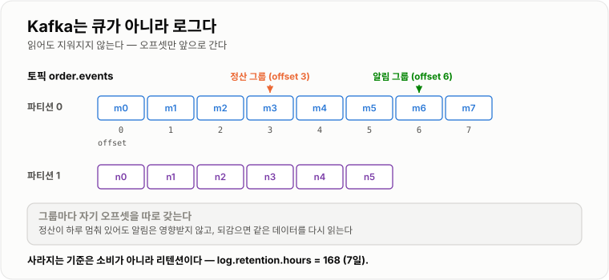
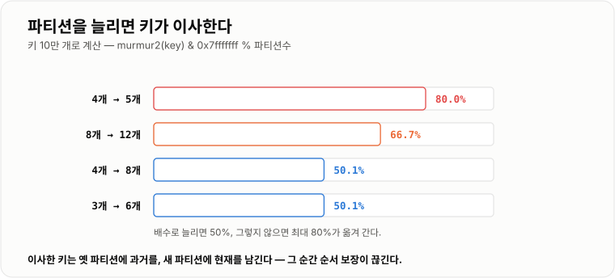
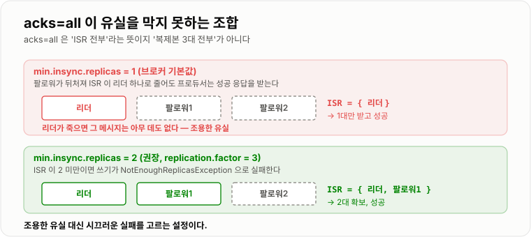

# Kafka 구조와 동작

> **Kafka는 "읽으면 사라지는 큐"가 아니라 "추가만 되는 로그"다. 이 한 가지 차이에서 나머지가 전부 따라 나온다 — 여러 소비자가 같은 데이터를 각자 읽을 수 있고, 과거로 되감을 수 있고, 대신 순서는 파티션 안에서만 지켜지며 파티션을 4개에서 5개로 늘리는 순간 실측 80.0%의 키가 자리를 옮긴다.**

---

## 1. 핵심 요약

**Kafka는 파티션이라는 추가 전용 로그 파일 여러 개에 메시지를 나눠 적고, 컨슈머는 "어디까지 읽었는지"(오프셋)를 스스로 기록하며 읽는다. 병렬성·순서·내구성이 전부 파티션과 복제 설정에서 결정된다.**

### 한눈에 보기

* **메시지를 읽어도 사라지지 않는다.** 컨슈머는 로그의 읽기 위치(**오프셋**)만 앞으로 옮긴다. 그래서 **여러 컨슈머 그룹이 같은 데이터를 각자 처음부터 읽을 수 있고**, 버그를 고친 뒤 오프셋을 되돌려 다시 처리할 수 있다.
* 메시지가 사라지는 기준은 소비가 아니라 **리텐션**이다. 브로커 기본값은 **`log.retention.hours=168` (7일)** 이고 용량 기준(`log.retention.bytes`)은 **`-1`(무제한)** 이다.
* **파티션이 병렬 단위이자 순서 단위다.** 순서는 **파티션 안에서만** 보장되고, 컨슈머 그룹 안에서 **파티션 하나는 컨슈머 하나에만** 배정된다. 그래서 **컨슈머를 파티션 수보다 많이 띄우면 남는 컨슈머는 논다** — 파티션 3개에 컨슈머 5개를 배분하니 **2개가 아무 파티션도 못 받았다.**
* 키가 있는 레코드의 파티션은 **`murmur2(key) & 0x7fffffff % 파티션수`** 로 정해진다. 실측에서 키 10만 개가 파티션 8개에 **최대 편차 +1.53%** 로 고르게 흩어졌고, **같은 키는 언제나 같은 파티션**이었다.
* **파티션 수를 늘리면 기존 키의 자리가 바뀐다.** 실측에서 **4개 → 5개는 80.0%**, 4개 → 8개는 50.1%, 8개 → 12개는 66.7%의 키가 다른 파티션으로 옮겨 갔다. **옮겨 가는 순간 그 키의 순서 보장이 끊긴다.**
* **`acks=all`인데도 유실될 수 있다.** `min.insync.replicas` 기본값이 **1**이라, 복제본이 다 뒤처져 ISR이 리더 하나만 남아도 프로듀서는 성공 응답을 받는다. 그 리더가 죽으면 그대로 사라진다. **`replication.factor=3` + `min.insync.replicas=2`가 한 쌍이다.**
* **프로듀서 기본값이 이미 안전한 쪽으로 맞춰져 있다.** `acks=all`, `enable.idempotence=true`, `retries=2147483647`, `max.in.flight.requests.per.connection=5`가 기본이라 **재시도로 인한 중복과 순서 뒤바뀜을 브로커가 걸러 준다.**
* **`linger.ms` 기본값이 0이 아니라 5다.** Kafka 4.0의 KIP-1030에서 바뀌었다. 즉 기본 설정에서도 **최대 5 ms를 모아 배치로 보낸다.**
* **컨슈머는 두 가지 방식으로 죽은 것으로 판정된다** — 하트비트가 **`session.timeout.ms`(45초)** 동안 없거나, `poll()` 사이 간격이 **`max.poll.interval.ms`(5분)** 를 넘으면 그룹에서 쫓겨나고 리밸런싱이 일어난다.
* **오프셋 자동 커밋이 기본이다** (`enable.auto.commit=true`, 5초 간격). 편하지만 **처리 전에 커밋될 수 있어 유실이 난다.** 정확성이 필요하면 꺼야 한다.

> **버전 기준** — 설정 기본값은 **Apache Kafka 4.3 공식 문서**(producer · consumer · broker configs)에서 확인한 값이다. 파티션 분포·키 이동률·컨슈머 배분 수치는 **Kafka의 `Utils.murmur2`와 `RangeAssignor`·`RoundRobinAssignor`의 배분 규칙을 그대로 옮겨 JDK 21.0.12.1에서 10만 개 키로 계산**한 것이다. **브로커를 띄워 잰 값이 아니라 알고리즘을 재현한 값**이므로, 처리량·지연 같은 성능 수치는 이 노트에 싣지 않았다.

### 무엇을 해결하는가

#### 해결하려는 문제

주문 이벤트를 여러 팀이 쓴다. 알림 팀, 정산 팀, 검색 색인 팀, 데이터 분석 팀이 전부 "주문이 생겼다"를 알아야 한다.

전통적인 큐(읽으면 사라지는 큐)로 하면 이렇게 된다.

```text
주문 서비스 ──▶ 큐 ──▶ 알림 팀이 꺼냄 → 메시지 사라짐
                       ↑
                정산 팀은 못 받는다
```

**소비자마다 큐를 따로 만들어야 한다.** 팀이 늘 때마다 발행 코드를 고쳐야 하고, 새 팀이 **과거 데이터**를 원하면 방법이 없다.

#### 이 개념이 없을 때

큐를 소비자 수만큼 복제하는 방식(팬아웃 익스체인지)으로 풀 수는 있다. 하지만 여전히 못 하는 것이 남는다.

| 못 하는 것 | 왜 문제인가 |
| --- | --- |
| **과거로 되감기** | 정산 로직에 버그가 있었다. 지난 3일치를 다시 처리해야 하는데 메시지가 이미 없다. |
| **나중에 합류** | 새 팀이 생겼다. 지난 데이터를 받을 방법이 없어 DB를 따로 덤프해야 한다. |
| **재처리 검증** | 컨슈머를 고친 뒤 같은 입력으로 결과를 비교하고 싶은데 입력이 사라졌다. |

**Kafka는 "큐"를 "로그 파일"로 바꿔서 이 셋을 한꺼번에 해결한다.** 메시지는 파일에 추가되고, 소비는 그 파일을 어디까지 읽었는지 표시하는 것일 뿐이다.

```text
파티션 0 로그 (추가만 된다)
  offset:  0    1    2    3    4    5    6    7
          [m0][m1][m2][m3][m4][m5][m6][m7]
                     ▲              ▲
                     │              │
            정산 그룹 (offset 3)   알림 그룹 (offset 6)
            느려도 알림에 영향 없음   각자 자기 위치를 기록한다
```

---

## 2. 동작 원리

### 핵심 구성 요소

| 용어 | 뜻 |
| --- | --- |
| **브로커**(broker) | Kafka 서버 한 대. 여러 대가 모여 클러스터를 이룬다 |
| **토픽**(topic) | 메시지의 논리적 분류. `order.created` 같은 이름 |
| **파티션**(partition) | 토픽을 나눈 물리적 로그. **병렬 단위이자 순서 단위** |
| **오프셋**(offset) | 파티션 안에서의 위치 번호. 0부터 1씩 증가 |
| **세그먼트**(segment) | 파티션 로그를 잘라 놓은 파일. 기본 **1 GiB**(`log.segment.bytes=1073741824`) |
| **컨슈머 그룹**(consumer group) | 같은 `group.id`를 쓰는 컨슈머 묶음. **그룹 단위로 오프셋을 갖는다** |
| **리더 / 팔로워** | 파티션 복제본 중 읽기·쓰기를 받는 쪽 / 따라 복사하는 쪽 |
| **ISR**(In-Sync Replicas) | 리더를 충분히 따라잡은 복제본 집합. **`replica.lag.time.max.ms=30000`** 안에 못 따라오면 빠진다 |



*읽어도 지워지지 않기 때문에 그룹마다 자기 오프셋을 따로 들고 같은 로그를 읽는다.*

### 내부 동작 과정

#### 1) 프로듀서가 파티션을 고른다

키가 있으면 **해시로 결정**된다. Kafka의 기본 파티셔너가 쓰는 계산은 이것이다.

```java
// org.apache.kafka.common.utils.Utils 의 murmur2 를 그대로 쓴다
int partition = (murmur2(keyBytes) & 0x7fffffff) % numPartitions;
```

`& 0x7fffffff`는 부호 비트를 지워 **음수를 없애는** 처리다(`Math.abs`를 쓰면 `Integer.MIN_VALUE`에서 음수가 그대로 나온다).

10만 개 키(`user-0` ~ `user-99999`)로 확인한 분포다.

```text
파티션  3개 : 최소 33,200  최대 33,429  이상적 33,333  최대 편차 +0.29%
파티션  4개 : 최소 24,852  최대 25,226  이상적 25,000  최대 편차 +0.90%
파티션  8개 : 최소 12,326  최대 12,691  이상적 12,500  최대 편차 +1.53%
파티션 12개 : 최소  8,209  최대  8,488  이상적  8,333  최대 편차 +1.86%
```

**충분히 고르다.** 그리고 결정적이다 — 같은 키를 1만 번 계산해도 결과가 하나였다.

```text
파티션 8개 기준
  user-42   → 파티션 4   (서로 다른 결과 1가지)
  order-99  → 파티션 2   (서로 다른 결과 1가지)
  결제-7    → 파티션 6   (서로 다른 결과 1가지)
```

**키가 `null`이면 해시를 안 쓴다.** 배치가 찰 때까지 한 파티션에 몰아 보내고 다음 파티션으로 넘어가는 방식(sticky)이라, **키 없는 레코드에는 순서 보장이 없다.**

#### 2) 파티션을 늘리면 기존 키가 이사한다

`% numPartitions`이므로 분모가 바뀌면 결과가 바뀐다. 얼마나 바뀌는지 실제로 계산했다.

```text
 4개 →  5개 : 79,992 / 100,000 개 (80.0%) 가 다른 파티션으로 이동
 4개 →  8개 : 50,137 / 100,000 개 (50.1%) 가 다른 파티션으로 이동
 8개 → 12개 : 66,720 / 100,000 개 (66.7%) 가 다른 파티션으로 이동
 3개 →  6개 : 50,107 / 100,000 개 (50.1%) 가 다른 파티션으로 이동
```



*배수로 늘리면 50%, 그렇지 않으면 최대 80%가 이사한다 — 이사한 키는 옛 파티션에 과거 메시지를, 새 파티션에 새 메시지를 남긴다.*

**왜 이것이 문제인가.** 주문 1234의 이벤트가 지금까지 파티션 2에 쌓여 있었는데, 파티션을 늘린 뒤부터 파티션 4로 간다. 컨슈머 A가 파티션 2를, 컨슈머 B가 파티션 4를 읽으므로 **같은 주문의 `결제완료`(옛 파티션)와 `배송시작`(새 파티션)이 서로 다른 컨슈머에게 동시에 처리된다.** 순서가 깨진다.

그래서 실무 원칙은 이렇다.

* **파티션 수는 처음에 넉넉히 잡는다.** 줄이는 것은 아예 불가능하고, 늘리는 것은 순서를 깬다.
* 꼭 늘려야 하면 **트래픽이 없는 시간에**, 또는 **새 토픽을 만들어 옮긴다.**
* 배수로 늘리면(4→8) 이동률이 그나마 낮다(50.1% vs 80.0%).

#### 3) 컨슈머 그룹이 파티션을 나눠 갖는다

**파티션 하나는 그룹 안에서 컨슈머 하나에만 배정된다.** 이것이 순서 보장의 근거이자 병렬성의 상한이다.

```text
(a) 토픽 2개 × 파티션 3개, 컨슈머 2개

  RangeAssignor        C0 (4개) [A-p0, A-p1, B-p0, B-p1]
                       C1 (2개) [A-p2, B-p2]        ← 2배 편중
  RoundRobinAssignor   C0 (3개) [A-p0, A-p2, B-p1]
                       C1 (3개) [A-p1, B-p0, B-p2]  ← 고르다

(b) 토픽 1개 × 파티션 3개, 컨슈머 5개

  RangeAssignor        C0 [A-p0]  C1 [A-p1]  C2 [A-p2]
                       C3 []  C4 []          ← 2개가 논다
```

**RangeAssignor가 편중되는 이유**는 토픽마다 따로 앞에서부터 잘라 나눠 주기 때문이다. 파티션 수가 컨슈머 수로 나누어떨어지지 않으면 **앞쪽 컨슈머가 매 토픽마다 하나씩 더 받는다.** 토픽이 많을수록 격차가 누적된다.

**컨슈머를 늘려도 파티션 수를 넘으면 아무 효과가 없다.** 처리량을 올리는 방법은 컨슈머 증설이 아니라 **파티션 증설**인데, 그건 위에서 본 순서 문제를 부른다. 그래서 **파티션 수는 "미래의 최대 병렬도"** 로 잡아야 한다.

#### 4) 오프셋은 컨슈머가 커밋한다

Kafka 브로커는 "누가 무엇을 읽었는지" 추적하지 않는다. **컨슈머 그룹이 `__consumer_offsets`라는 내부 토픽에 자기 위치를 적는다.**

기본값이 자동 커밋이다.

```text
enable.auto.commit       = true
auto.commit.interval.ms  = 5000  (5초)
auto.offset.reset        = latest
max.poll.records         = 500
```

**자동 커밋이 위험한 이유**는 커밋 시점이 처리 완료와 무관하기 때문이다. `poll()`로 500건을 받아 200건을 처리한 시점에 5초가 지나 자동 커밋이 일어나고, 그 직후 죽으면 **처리 안 한 300건이 건너뛰어진다.**

`auto.offset.reset=latest`도 함정이다. **오프셋이 없는 새 그룹은 과거를 안 읽고 지금부터 읽는다.** 배포하며 `group.id`를 바꾸면 그 사이 쌓인 메시지를 통째로 건너뛴다. 과거부터 읽으려면 `earliest`로 둬야 한다.

#### 5) 복제와 ISR — `acks=all`의 함정

프로듀서 기본값은 이미 안전한 쪽이다.

```text
acks                                  = all
enable.idempotence                    = true
retries                               = 2147483647
max.in.flight.requests.per.connection = 5
delivery.timeout.ms                   = 120000 (2분)
```

`acks=all`은 **"ISR에 있는 복제본이 전부 받으면 성공"** 이다. 문제는 **ISR의 최소 크기를 브로커가 따로 정한다**는 것이다.

```text
min.insync.replicas = 1     ← 브로커 기본값
```

이 조합이 함정이다.

```text
replication.factor = 3, acks = all, min.insync.replicas = 1  (기본값)

  정상       ISR = {리더, 팔로워1, 팔로워2}  → 3대가 받아야 성공. 안전하다.
  팔로워 지연 ISR = {리더}                    → 리더 혼자 받아도 성공 응답!
             ↓
  리더 장애   그 메시지는 아무 데도 복제되지 않았다 → 유실
```



*`acks=all`은 "ISR 전부"라는 뜻이지 "3대 전부"라는 뜻이 아니다 — ISR이 1이면 1대만 받고 성공이다.*

**올바른 조합은 `replication.factor=3` + `min.insync.replicas=2`** 다. ISR이 2 미만이면 프로듀서 쓰기가 `NotEnoughReplicasException`으로 **실패한다.** 조용한 유실 대신 시끄러운 실패를 고른 것이다.

관련해서 `unclean.leader.election.enable`은 기본이 **`false`** 다. ISR 밖의 뒤처진 복제본을 리더로 승격시키지 않는다 — **가용성보다 정합성을 고른 기본값**이고, 그래서 ISR이 전부 죽으면 그 파티션은 쓰기를 못 받는다.

#### 6) 배치 — `batch.size`와 `linger.ms`

프로듀서는 레코드를 하나씩 보내지 않고 파티션별로 모아 보낸다.

```text
batch.size = 16384 (16 KiB)   ← 이만큼 차면 즉시 보낸다
linger.ms  = 5                ← 안 차도 5 ms 지나면 보낸다
```

**`linger.ms` 기본값은 오랫동안 0이었다.** Kafka 4.0에서 KIP-1030으로 **0 → 5**로 바뀌었다. 작은 요청이 폭주하는 것을 막고 배치 효율을 얻기 위한 절충이다. 즉 **기본 설정만으로도 최대 5 ms의 발행 지연이 들어 있다** — 지연에 민감하면 이 값을 다시 봐야 한다.

#### 7) 컨슈머가 "죽었다"고 판정되는 두 경로

```text
session.timeout.ms    = 45000  (45초)   ← 하트비트가 이만큼 끊기면 제외
heartbeat.interval.ms = 3000   (3초)    ← 백그라운드 스레드가 보내는 주기
max.poll.interval.ms  = 300000 (5분)    ← poll() 사이가 이보다 길면 스스로 탈퇴
```

**두 가지가 나뉘어 있는 이유**는 "프로세스가 살아 있는가"와 "처리가 진행되고 있는가"가 다른 질문이기 때문이다. 하트비트는 별도 스레드가 보내므로, **처리 스레드가 무한 루프에 빠져도 하트비트는 계속 나간다.** `max.poll.interval.ms`가 그 경우를 잡는다.

**실무에서 가장 흔한 리밸런싱 원인이 이것이다.** `max.poll.records=500`인데 건당 처리가 1초라면 한 배치에 500초가 걸려 5분을 넘고, 컨슈머가 그룹에서 빠지고, 리밸런싱이 돌고, 다시 처리하고, 또 빠진다. **해결은 `max.poll.records`를 줄이거나 `max.poll.interval.ms`를 늘리는 것**이다.

---

## 3. 특징과 비교

| 구분 | 내용 |
| ----------- | -- |
| **장점** | 읽어도 지워지지 않아 여러 소비자가 같은 데이터를 각자 읽고 과거로 되감을 수 있다. 파티션 단위 병렬 처리로 수평 확장되고, 순서가 필요한 곳은 키로 파티션을 고정해 지킬 수 있다. 프로듀서 기본값(`acks=all` · 멱등성)이 이미 안전한 쪽이다. |
| **단점** | 파티션 수가 병렬도의 상한이고, 늘리면 실측 최대 80.0%의 키가 이사해 순서가 끊긴다(줄이는 건 불가능). 브로커·복제·리텐션을 운영해야 하고, `min.insync.replicas` 같은 설정을 하나 놓치면 `acks=all`인데도 유실된다. |
| **적합한 상황** | 같은 사건을 여러 시스템이 받아야 할 때, 재처리·되감기가 필요한 이벤트 스트림, 초당 수만 건 이상의 로그·행동 데이터, 키 단위 순서만 지키면 되는 도메인 이벤트. |
| **주의할 상황** | 메시지마다 우선순위나 지연 실행이 필요한 작업 큐, 소비자가 소수이고 즉시 삭제가 자연스러운 단순 작업 분배, 파티션 수를 예측할 수 없는데 전역 순서가 필요한 경우. |

### 성능 특성

수치는 알고리즘을 재현해 계산한 값이다 (브로커 실측이 아니다).

| 항목 | 값 | 의미 |
| --- | --- | --- |
| 키 분포 편차 (파티션 8개, 키 10만) | **+1.53%** | 키가 고르면 파티션 쏠림은 걱정 안 해도 된다 |
| 파티션 4 → 5 증설 시 키 이동 | **80.0%** | 순서 보장이 대부분의 키에서 끊긴다 |
| 파티션 4 → 8 증설 시 키 이동 | **50.1%** | 배수 증설이 그나마 낫다 |
| 컨슈머 5개 / 파티션 3개 | **2개 유휴** | 파티션 수 = 병렬도 상한 |
| RangeAssignor 편중 (토픽 2 × 파티션 3, 컨슈머 2) | **4 대 2** | 토픽이 많을수록 격차가 커진다 |

### 장점과 단점

**장점 — 소비가 발행을 제약하지 않는다.**
전통적 큐에서는 소비자가 늘 때마다 발행 쪽이 바뀐다. Kafka는 발행이 로그에 쓰는 것으로 끝이고, 소비자는 자기 오프셋만 들고 붙었다 떨어졌다 한다. **정산 팀 컨슈머가 하루 멈춰 있어도 알림 팀은 영향받지 않고**, 정산 팀은 복구 후 밀린 곳부터 이어서 읽는다.

**장점 — 재처리가 설계에 들어 있다.**
버그를 고치고 오프셋을 되돌리면 같은 입력으로 다시 돌릴 수 있다. 리텐션이 7일이면 **7일 안의 사고는 되감기로 복구 가능**하다. 이 성질 때문에 Kafka는 메시지 큐보다 "이벤트 저장소"로 쓰인다.

**단점 — 파티션 수가 되돌릴 수 없는 결정이다.**
줄이는 API 자체가 없고(토픽을 다시 만들어야 한다), 늘리면 실측 50~80%의 키가 이사한다. **처음 정할 때 "지금 필요한 병렬도"가 아니라 "앞으로 필요할 최대 병렬도"로** 잡아야 하는 이유다. 다만 파티션이 많으면 브로커의 파일 핸들·메모리·리밸런싱 시간이 늘어나므로 무작정 크게 잡을 수도 없다.

**단점 — 안전해 보이는 설정이 안전하지 않다.**
`acks=all`만 보고 안심하기 쉽다. `min.insync.replicas`가 1이면 ISR이 줄어든 순간 사실상 `acks=1`이 된다. **두 값은 항상 같이 봐야 한다.**

### 어떤 상황에서 고르는가

```text
같은 사건을 여러 시스템이 받아야 하는가?
├─ 예 → Kafka (로그라서 소비자가 늘어도 발행이 안 바뀐다)
└─ 아니오
   └─ 과거 데이터를 다시 처리할 일이 있는가?
      ├─ 예 → Kafka (오프셋 되감기)
      └─ 아니오
         └─ 메시지마다 우선순위 · 지연 실행 · 개별 ack 가 필요한가?
            ├─ 예 → RabbitMQ · SQS (Kafka 는 이걸 잘 못한다)
            └─ 아니오
               └─ 처리량이 초당 수만 건 이상인가?
                  ├─ 예 → Kafka
                  └─ 아니오 → 운영이 더 싼 쪽 (SQS · RabbitMQ · DB 기반 큐)
```

### 비슷한 기술과 비교

| 기준 | Kafka | RabbitMQ | AWS SQS |
| --------- | ---- | ---- | ---- |
| **저장 모델** | 추가 전용 로그. 읽어도 안 지워짐 | 큐. **소비하면 사라짐** | 큐. 소비 후 삭제 |
| **순서 보장** | 파티션 안에서 | 큐 안에서(컨슈머 1개일 때) | FIFO 큐의 메시지 그룹 안에서 |
| **되감기 / 재처리** | **가능** (오프셋 이동) | 불가 | 불가 |
| **여러 소비자에게 같은 데이터** | 컨슈머 그룹을 나누면 됨 | 팬아웃 익스체인지로 큐 복제 | 토픽(SNS)을 앞에 둠 |
| **개별 메시지 ack · 우선순위 · 지연** | 약함 (오프셋은 위치 하나) | **강함** | 지연 큐 지원 |
| **처리량** | 매우 높음 (파티션 수만큼) | 높음 | 관리형이라 제한 있음 |
| **운영 부담** | 높음 (브로커·복제·리밸런싱) | 중간 | **없음 (관리형)** |
| **선택 기준** | 이벤트 스트림 · 재처리 · 대용량 | 작업 큐 · 라우팅 · 우선순위 | 운영을 안 하고 싶을 때 |

**Kafka 4.0부터 ZooKeeper가 완전히 제거되고 KRaft 모드만 남았다.** 메타데이터를 Kafka 자신의 합의 프로토콜로 관리하므로 운영할 클러스터가 하나로 줄었다. 이전 버전 자료를 볼 때 ZooKeeper 관련 설명은 걸러 읽어야 한다.

---

## 4. 실무 주의사항

### 백엔드 실무 적용

#### Spring · Java

**`enable.auto.commit`을 끄고 처리 후에 커밋한다.** Spring Kafka는 `AckMode`로 이를 다룬다.

```java
@Bean
public ConcurrentKafkaListenerContainerFactory<String, String> factory(
        ConsumerFactory<String, String> cf) {
    ConcurrentKafkaListenerContainerFactory<String, String> f =
            new ConcurrentKafkaListenerContainerFactory<>();
    f.setConsumerFactory(cf);
    // 배치를 다 처리한 뒤에 커밋한다 (기존 BATCH 가 기본이지만 명시한다)
    f.getContainerProperties().setAckMode(ContainerProperties.AckMode.RECORD);
    f.setConcurrency(3);      // 파티션 수를 넘지 않게 잡는다
    return f;
}
```

**`concurrency`는 파티션 수를 넘기지 않는다.** 넘겨 봐야 남는 컨슈머는 놀고(실측: 파티션 3에 컨슈머 5면 2개 유휴), 리밸런싱 시간만 길어진다.

**리스너 안에서 오래 걸리는 일을 하지 않는다.** `max.poll.records=500`에 건당 1초면 500초가 걸려 `max.poll.interval.ms`(5분)를 넘고 무한 리밸런싱에 빠진다. 배치 크기를 줄이거나 처리를 잘게 나눈다.

#### 데이터베이스 · 캐시

**컨슈머 수 × 커넥션 수가 DB 풀을 넘지 않게 한다.** 파티션 12개에 컨슈머 12개를 띄우고 각자 커넥션을 잡으면 12개가 상시 점유된다.

**컨슈머에서 DB에 쓸 때는 `poll()` 단위로 묶어 배치 저장한다.** 건당 왕복은 배치 대비 수십 배 느리다 → **[동기 · 비동기와 메시지 큐](../동기-비동기와-메시지큐/동기-비동기와-메시지큐.md)** 의 배치 실측.

#### 동시성 · 분산 환경

**파티션 키는 "순서를 지켜야 하는 단위"로 고른다.** 주문 이벤트면 주문 ID, 사용자 활동이면 사용자 ID다. **키를 `null`로 두면 순서 보장이 아예 없다.**

**키가 쏠리면 파티션이 쏠린다.** 실측에서 키가 고르면 편차가 1.53%였지만, **특정 대형 고객사 ID로 트래픽의 절반이 들어오면 그 파티션 하나만 밀린다.** 이런 경우 키에 접미사를 붙여(`custA-0` ~ `custA-9`) 인위적으로 흩고, 순서 요구를 그만큼 완화한다.

**`replication.factor=3` + `min.insync.replicas=2`를 토픽 생성 시 함께 지정한다.** 나중에 고치려면 이미 유실된 뒤다.

```bash
kafka-topics.sh --create --topic order.events \
  --partitions 12 --replication-factor 3 \
  --config min.insync.replicas=2
```

### 자주 하는 오해

| 잘못된 이해 | 올바른 이해 |
| ------ | ------ |
| Kafka는 큐라서 읽으면 메시지가 사라진다 | **로그**다. 오프셋만 움직인다. 사라지는 기준은 소비가 아니라 리텐션(`log.retention.hours=168`)이다. |
| Kafka는 순서를 보장한다 | **파티션 안에서만** 보장한다. 토픽 전체 순서는 파티션 1개일 때만 성립한다. |
| 컨슈머를 늘리면 처리량이 는다 | 파티션 수까지만 는다. 파티션 3개에 컨슈머 5개면 **2개는 논다**(실측). |
| 파티션은 나중에 늘리면 된다 | 늘리면 실측 최대 **80.0%** 의 키가 다른 파티션으로 가서 순서가 끊긴다. 줄이는 건 아예 불가능하다. |
| `acks=all`이면 유실이 없다 | `min.insync.replicas`가 기본값 **1**이면 ISR이 리더 하나로 줄어도 성공 응답이 나간다. `2`로 함께 잡아야 한다. |
| `linger.ms` 기본값은 0이다 | Kafka **4.0(KIP-1030)부터 5**다. 기본 설정에도 최대 5 ms 배치 대기가 들어 있다. |
| 오프셋은 브로커가 관리한다 | 컨슈머 그룹이 `__consumer_offsets` 토픽에 **직접 커밋**한다. 그래서 되감기가 가능하다. |
| `auto.offset.reset`은 처음부터 읽는다는 뜻 | 기본값은 **`latest`** 다. 새 `group.id`로 붙으면 과거를 통째로 건너뛴다. |

---

## 5. 예제

### 파티션 계산 — Kafka가 실제로 쓰는 코드

```java
// org.apache.kafka.common.utils.Utils.murmur2 (Kafka 소스 그대로)
public static int murmur2(final byte[] data) {
    int length = data.length;
    int seed = 0x9747b28c;
    final int m = 0x5bd1e995;
    final int r = 24;

    int h = seed ^ length;
    int length4 = length / 4;

    for (int i = 0; i < length4; i++) {
        final int i4 = i * 4;
        int k = (data[i4] & 0xff) + ((data[i4 + 1] & 0xff) << 8)
              + ((data[i4 + 2] & 0xff) << 16) + ((data[i4 + 3] & 0xff) << 24);
        k *= m;
        k ^= k >>> r;
        k *= m;
        h *= m;
        h ^= k;
    }
    switch (length % 4) {
        case 3: h ^= (data[(length & ~3) + 2] & 0xff) << 16;
        case 2: h ^= (data[(length & ~3) + 1] & 0xff) << 8;
        case 1: h ^= (data[length & ~3] & 0xff); h *= m;
        default:
    }
    h ^= h >>> 13;
    h *= m;
    h ^= h >>> 15;
    return h;
}

// 키가 있는 레코드의 파티션
public static int partitionOf(String key, int numPartitions) {
    byte[] b = key.getBytes(StandardCharsets.UTF_8);
    return (murmur2(b) & 0x7fffffff) % numPartitions;   // & 0x7fffffff 로 부호를 지운다
}
```

### 안전한 프로듀서 설정

```java
Properties props = new Properties();
props.put(ProducerConfig.BOOTSTRAP_SERVERS_CONFIG, "kafka:9092");
props.put(ProducerConfig.ACKS_CONFIG, "all");                    // 기본값이지만 명시한다
props.put(ProducerConfig.ENABLE_IDEMPOTENCE_CONFIG, true);       // 재시도 중복을 브로커가 거른다
props.put(ProducerConfig.MAX_IN_FLIGHT_REQUESTS_PER_CONNECTION, 5);
props.put(ProducerConfig.LINGER_MS_CONFIG, 5);                   // 4.0 부터 기본값 5
props.put(ProducerConfig.BATCH_SIZE_CONFIG, 16384);
props.put(ProducerConfig.DELIVERY_TIMEOUT_MS_CONFIG, 120000);
// ⚠ 브로커/토픽 쪽에 min.insync.replicas=2 가 함께 있어야 acks=all 이 의미를 갖는다
```

### 처리 후에 커밋하는 컨슈머

```java
Properties props = new Properties();
props.put(ConsumerConfig.GROUP_ID_CONFIG, "settlement");
props.put(ConsumerConfig.ENABLE_AUTO_COMMIT_CONFIG, false);      // 기본 true 를 끈다
props.put(ConsumerConfig.AUTO_OFFSET_RESET_CONFIG, "earliest");  // 기본 latest 는 과거를 건너뛴다
props.put(ConsumerConfig.MAX_POLL_RECORDS_CONFIG, 100);          // 500 은 처리 시간이 길면 위험

KafkaConsumer<String, String> consumer = new KafkaConsumer<>(props);
consumer.subscribe(Collections.singletonList("order.events"));

while (true) {
    ConsumerRecords<String, String> records = consumer.poll(Duration.ofMillis(500));
    for (ConsumerRecord<String, String> record : records) {
        handle(record);                 // 여기서 죽으면 재시작 후 다시 온다 (at-least-once)
    }
    consumer.commitSync();              // 다 처리한 뒤에 커밋한다
}
```

### 특정 시점으로 되감기

```java
// 어제 09:00 부터 다시 처리한다 — 로그이기 때문에 가능한 일이다
long target = LocalDateTime.now().minusDays(1).withHour(9)
        .atZone(ZoneId.systemDefault()).toInstant().toEpochMilli();

Map<TopicPartition, Long> query = new HashMap<>();
for (TopicPartition tp : consumer.assignment()) {
    query.put(tp, Long.valueOf(target));
}
Map<TopicPartition, OffsetAndTimestamp> found = consumer.offsetsForTimes(query);
for (Map.Entry<TopicPartition, OffsetAndTimestamp> e : found.entrySet()) {
    if (e.getValue() != null) {
        consumer.seek(e.getKey(), e.getValue().offset());
    }
}
```

---

## 6. 면접 정리

### 자주 나오는 질문

#### 기본 질문

1. **Kafka는 메시지 큐와 어떻게 다른가?**

    * 핵심 키워드: 추가 전용 로그 · 읽어도 안 지워짐 · 오프셋만 이동 · 여러 컨슈머 그룹이 같은 데이터 · 되감기 · 리텐션 7일

2. **파티션은 왜 있는가?**

    * 핵심 키워드: 병렬 단위이자 순서 단위 · 파티션 하나 = 컨슈머 하나 · 순서는 파티션 안에서만 · 처리량 상한

3. **컨슈머 그룹이란 무엇이고, 컨슈머를 파티션보다 많이 띄우면 어떻게 되는가?**

    * 핵심 키워드: 같은 `group.id` · 파티션 배분 · 파티션 3에 컨슈머 5면 2개 유휴 · 리밸런싱

4. **오프셋은 누가 관리하는가?**

    * 핵심 키워드: 컨슈머 그룹이 `__consumer_offsets`에 커밋 · 브로커는 추적 안 함 · 그래서 되감기 가능 · 자동 커밋 기본 5초

5. **`acks` 설정은 무엇을 뜻하는가?**

    * 핵심 키워드: 0(안 기다림) · 1(리더만) · all(ISR 전부) · 기본값 all · `min.insync.replicas`와 한 쌍

#### 꼬리 질문

1. **`acks=all`인데도 데이터가 유실되는 조합이 있는가?**

    * 핵심 키워드: `min.insync.replicas` 기본 1 · ISR이 리더 하나로 줄면 사실상 `acks=1` · RF 3 + minISR 2가 정답 · `NotEnoughReplicasException`으로 시끄럽게 실패시키기

2. **파티션 수를 늘리면 왜 순서가 깨지는가?**

    * 핵심 키워드: `murmur2(key) % 파티션수` · 분모가 바뀜 · 4→5에서 80.0% 이동(실측) · 같은 키의 과거·현재가 다른 파티션 · 줄이는 건 불가능

3. **컨슈머가 계속 리밸런싱을 반복한다. 무엇을 보겠는가?**

    * 핵심 키워드: `max.poll.interval.ms`(5분) 초과 · `max.poll.records`(500) × 건당 처리 시간 · `session.timeout.ms`(45초)와는 다른 축 · 배치 축소 또는 처리 분리

4. **새 컨슈머 그룹을 붙였는데 과거 메시지가 안 보인다.**

    * 핵심 키워드: `auto.offset.reset` 기본값 `latest` · `earliest`로 변경 · `group.id`를 바꾸면 같은 일이 생김

5. **키를 `null`로 보내면 어떻게 되는가?**

    * 핵심 키워드: 해시를 안 씀 · 배치 단위 sticky 분배 · 순서 보장 없음 · 순서가 필요하면 반드시 키를 준다

6. **Kafka와 RabbitMQ 중 무엇을 고르겠는가?**

    * 핵심 키워드: 같은 사건을 여러 시스템이 받나 · 재처리가 필요한가 → Kafka · 우선순위·지연·개별 ack가 필요한 작업 큐 → RabbitMQ

### 30초 답변

> Kafka는 큐가 아니라 파티션 단위의 추가 전용 로그입니다. 읽어도 지워지지 않고 컨슈머가 오프셋만 옮기기 때문에, 여러 그룹이 같은 데이터를 각자 읽고 과거로 되감을 수 있습니다. 순서와 병렬성은 둘 다 파티션에서 나옵니다 — 파티션 하나는 그룹 안에서 컨슈머 하나가 맡으므로 컨슈머를 파티션보다 많이 띄우면 남는 건 놀고, 파티션을 늘리면 키 해시의 분모가 바뀌어 실측 4개→5개에서 80%의 키가 이사하면서 순서가 끊깁니다. 내구성은 `acks=all` 하나로는 부족하고 `min.insync.replicas`를 2로 함께 잡아야 합니다.

### 핵심 키워드

`브로커` · `토픽` · `파티션` · `오프셋` · `컨슈머 그룹` · `리밸런싱` · `murmur2 파티셔너` · `ISR` · `acks=all` · `min.insync.replicas` · `멱등 프로듀서` · `리텐션` · `KRaft`

### 이어서 볼 주제

* **[동기 · 비동기와 메시지 큐](../동기-비동기와-메시지큐/동기-비동기와-메시지큐.md)** — 이 노트의 파티션·배치가 왜 필요한지에 대한 앞선 이야기. 백프레셔와 배치 트레이드오프의 실측이 거기 있다.
* **[메시지 중복 · 재시도 · Outbox](../메시지-중복-재시도-Outbox/메시지-중복-재시도-Outbox.md)** — 오프셋 커밋 시점 때문에 생기는 중복·유실을 어떻게 막는지.
* **[분산 락과 멱등성](../../08-캐시-Redis/분산락-멱등성/분산락-멱등성.md)** — at-least-once 위에서 멱등 컨슈머를 만드는 방법.
* **[대용량 데이터 분할](../../06-데이터베이스/대용량-데이터-분할/대용량-데이터-분할.md)** — 파티션 키 선택이 DB 샤딩 키 선택과 같은 문제인 이유.
