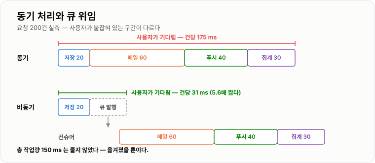
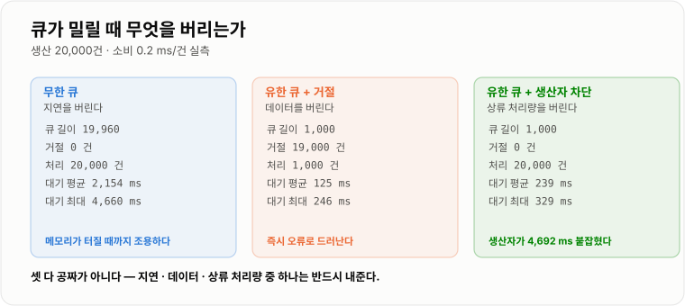
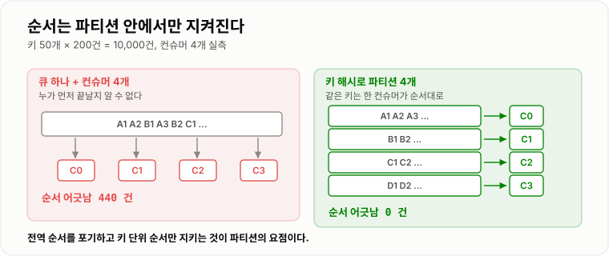

# 동기 · 비동기와 메시지 큐

> **비동기는 "빨리 하는 것"이 아니라 "지금 안 하는 것"이다. 실측에서 응답 시간이 175 ms → 31 ms로 5.6배 줄었지만 일은 하나도 안 줄었다. 줄어든 것은 응답까지의 시간이고, 대신 큐가 밀릴 때 무엇을 버릴지 정하는 문제가 새로 생겼다.**

---

## 1. 핵심 요약

**요청 하나가 해야 할 일 중 "지금 답을 주는 데 꼭 필요한 것"만 남기고 나머지를 큐로 넘기는 것이 비동기 처리다. 총 작업량은 그대로이고, 응답 시간과 장애 격리를 얻는 대신 순서·중복·큐 포화라는 문제를 떠안는다.**

### 한눈에 보기

* **동기(synchronous)** 는 "부른 일이 끝나야 다음 줄로 간다", **비동기(asynchronous)** 는 "부르고 나서 결과를 안 기다리고 다음 줄로 간다"이다. **블로킹/논블로킹은 다른 축**이다 — 스레드가 그동안 붙잡혀 있느냐를 말한다.
* 실측했다. 주문 저장 20 ms + 알림 3종(60 · 40 · 30 ms)을 **전부 동기로 하면 건당 175 ms**, **알림 3건을 큐로 넘기면 건당 31 ms**로 **5.6배**였다.
* **일이 줄어든 것이 아니다.** 알림 3건은 컨슈머가 그대로 다 처리한다. 줄어든 것은 **사용자가 기다리는 시간**뿐이다.
* **응답 시간보다 장애 격리가 더 큰 이득인 경우가 많다.** 알림 서버가 죽었을 때 동기 호출이면 주문 API도 같이 실패하지만, 큐에 넣고 끝내면 주문은 성공하고 알림만 큐에 쌓인다.
* **큐는 무한하지 않다.** 소비보다 생산이 빠르면 셋 중 하나를 반드시 버려야 한다 — 실측에서 **무한 큐는 지연**(평균 대기 2,154 ms · 최대 4,660 ms), **거절은 데이터**(20,000건 중 19,000건 버림), **생산자 차단은 상류 처리량**(생산자가 4,692 ms 붙잡힘)을 버렸다.
* **배치로 묶으면 처리량과 지연이 정반대로 움직인다.** 건당 처리에서 배치 500건으로 바꾸자 처리량은 **480 → 110,497 건/s (230배)**, 대신 **배치 한 번의 지연은 2,005 → 4,500 µs (2.2배)** 로 늘었다.
* **큐 하나에 컨슈머를 여러 개 붙이면 순서가 깨진다.** 실측에서 컨슈머 4개로 10,000건을 처리하자 **순서 어긋남 440건**이 났다. **키로 파티션을 갈라 파티션당 컨슈머 1개**로 두자 **0건**이었다.
* **"응답을 봐야 다음 화면이 결정되는 일"은 비동기로 못 뺀다.** 결제 승인, 재고 확인, 로그인 검증이 그렇다. 큐는 만능이 아니라 **"나중에 해도 되는 일"을 위한 도구**다.

> 이 노트의 수치는 **JDK 21.0.12.1 (Temurin) · Windows 11 · 6코어**에서 직접 측정했다. 외부 호출은 `Thread.sleep()`으로, 건당 처리 비용은 나노초 스핀으로 흉내 냈다. **Windows의 타이머 해상도 때문에 `sleep(150)`의 실측이 175 ms로 나온다** — 절대값보다 배수를 보는 것이 맞다.

### 무엇을 해결하는가

#### 해결하려는 문제

주문 API 하나를 보자. 주문을 저장하고, 메일을 보내고, 푸시를 쏘고, 집계를 올린다.

```java
@PostMapping("/orders")
public OrderResponse create(@RequestBody OrderRequest req) {
    Order order = orderRepository.save(req.toOrder());   //  20 ms
    mailClient.sendOrderMail(order);                     //  60 ms
    pushClient.sendPush(order);                          //  40 ms
    statsClient.increaseOrderCount(order);               //  30 ms
    return OrderResponse.of(order);                      // → 사용자는 150 ms 를 기다린다
}
```

여기에는 문제가 둘 있다.

**첫째, 사용자가 필요 없는 것까지 기다린다.** 주문이 저장된 순간 사용자에게 보여 줄 답은 이미 정해졌다. 메일이 나갔는지는 화면에 필요 없다.

**둘째, 알림 서버가 죽으면 주문도 같이 죽는다.** `mailClient`가 예외를 던지면 그 아래 코드는 실행되지 않고, 컨트롤러는 500을 반환한다. **주문 저장은 성공했는데 사용자는 실패로 안다.**

```text
메일 서버 장애 발생

  주문 저장  ✅ 성공  ← DB 에 주문이 들어갔다
  메일 발송  ❌ 예외
  푸시 발송  ⬜ 실행 안 됨
  집계 증가  ⬜ 실행 안 됨
  응답       500 Internal Server Error

  → 사용자는 "주문 실패"로 보고 다시 누른다. 주문이 두 건 생긴다.
```

#### 이 개념이 없을 때

"그럼 스레드를 하나 더 띄우면 되지 않나?" 가장 먼저 떠오르는 대안이다.

```java
Order order = orderRepository.save(req.toOrder());
new Thread(new Runnable() {
    public void run() {
        mailClient.sendOrderMail(order);   // 응답과 따로 논다
    }
}).start();
return OrderResponse.of(order);
```

응답 시간은 실제로 줄어든다. 하지만 **이 방식은 세 가지를 못 한다.**

| 못 하는 것 | 무슨 일이 일어나는가 |
| --- | --- |
| **재시도** | 메일 발송이 실패하면 그 스레드와 함께 사라진다. 아무도 모른다. |
| **재시작 후 복구** | 서버를 배포로 내리면 처리 중이던 작업이 **메모리와 함께 증발**한다. |
| **속도 제어** | 요청이 몰리면 스레드가 그만큼 생긴다. 1만 요청 = 1만 스레드다. |

**메시지 큐는 이 세 가지를 "작업을 메모리 밖에 적어 두는 것"으로 해결한다.** 작업을 별도 저장소(큐)에 기록하면 실패해도 남아 있고, 서버가 죽어도 남아 있고, 컨슈머 수로 처리 속도를 정할 수 있다.

```java
Order order = orderRepository.save(req.toOrder());
messageQueue.publish(new OrderCreated(order.getId()));   // 적어만 둔다
return OrderResponse.of(order);
```

---

## 2. 동작 원리

### 핵심 구성 요소

| 용어 | 뜻 | 이 노트에서의 예 |
| --- | --- | --- |
| **프로듀서**(producer) | 메시지를 큐에 넣는 쪽 | 주문 API |
| **큐 / 브로커**(broker) | 메시지를 보관하고 전달하는 중간 저장소 | Kafka · RabbitMQ · SQS |
| **컨슈머**(consumer) | 메시지를 꺼내 처리하는 쪽 | 메일 발송 워커 |
| **파티션 / 샤드**(partition) | 큐를 갈라 놓은 단위. **순서는 이 안에서만 보장**된다 | 사용자 ID 해시로 4갈래 |
| **백프레셔**(backpressure) | 소비가 못 따라갈 때 생산 쪽으로 되미는 압력 | 큐가 꽉 차면 거절하거나 막는다 |
| **컨슈머 랙**(consumer lag) | 쌓인 양. **가장 먼저 봐야 할 지표**다 | 큐 길이 19,960 |

### 동기 · 비동기와 블로킹 · 논블로킹

둘은 자주 섞여 쓰이지만 **묻는 것이 다르다.**

* **동기 / 비동기** — **결과를 누가 언제 확인하는가.** 부른 쪽이 그 자리에서 결과를 받으면 동기, 나중에 콜백·큐·폴링으로 받으면 비동기다.
* **블로킹 / 논블로킹** — **그동안 스레드가 붙잡혀 있는가.** 스레드가 멈춰 서서 기다리면 블로킹, 바로 돌려주면 논블로킹이다.

```text
                  결과를 그 자리에서 받는가?
                  동기                    비동기
스레드가    블로킹  ┌────────────────────┬────────────────────┐
붙잡히나?          │ 보통의 메서드 호출     │ Future.get()        │
                  │ JDBC 쿼리           │ (결과는 나중이지만    │
                  │                    │  받으러 가서 멈춘다)   │
           논블로킹 ├────────────────────┼────────────────────┤
                  │ 폴링 루프            │ 메시지 큐 발행        │
                  │ (계속 물어본다)       │ 콜백 · 이벤트 루프    │
                  └────────────────────┴────────────────────┘
```

**메시지 큐는 오른쪽 아래 칸이다.** 넣고 나서 스레드를 놓아 주고, 결과는 나중에 별도 경로로 확인한다.

### 내부 동작 과정

```text
[동기]  요청 ──▶ 주문 저장 ──▶ 메일 ──▶ 푸시 ──▶ 집계 ──▶ 응답
        │◀──────────────  175 ms  ──────────────────▶│

[비동기] 요청 ──▶ 주문 저장 ──▶ 큐에 3건 넣기 ──▶ 응답
        │◀──── 31 ms ────▶│
                          └──▶ 큐 ──▶ 컨슈머 ──▶ 메일 · 푸시 · 집계
                                      (사용자와 무관하게 진행)
```



*같은 일을 하지만, 사용자가 붙잡혀 있는 구간이 다르다 — 실측 175 ms 대 31 ms.*

실측 코드와 결과다.

```text
요청 200건 (주문 저장 20 ms + 알림 60 · 40 · 30 ms)

  동기 전부 처리 : 35,058 ms  (건당 175 ms)
  큐로 위임      :  6,256 ms  (건당  31 ms)
  배수           : 5.6배
```

**건당 31 ms는 주문 저장 20 ms에 `sleep` 오차가 붙은 값**이다. 즉 **비동기의 응답 시간은 "동기로 남긴 일"이 결정한다.** 큐에 넣는 비용은 거의 0이다.

#### 왜 총 작업량은 안 줄어드는가

이 지점을 놓치면 비동기를 만능으로 오해한다.

```text
동기   : [저장 20][메일 60][푸시 40][집계 30]  = 150 ms 의 CPU·IO 를 요청 스레드가 다 씀
비동기 : [저장 20]                             = 요청 스레드는 20 ms 만 씀
         [메일 60][푸시 40][집계 30]           = 나머지 130 ms 는 컨슈머 스레드가 씀
```

**총량 150 ms는 그대로다.** 옮겼을 뿐이다. 그래서 **컨슈머가 못 따라가면 결국 어딘가는 밀린다** — 이것이 다음 절의 백프레셔 문제다.

### 큐가 밀릴 때 — 백프레셔

생산 20,000건, 소비는 건당 0.2 ms(= 초당 5,000건)로 두고 세 가지 전략을 실측했다.

```text
[A] 무한 큐 (LinkedBlockingQueue)
    최대 큐 길이     : 19,960
    거절             : 0 건
    처리한 건수      : 20,000 건
    생산이 끝난 시각 : 10 ms         ← 생산자는 전혀 안 막혔다
    전부 소비까지    : 4,671 ms
    큐 대기 평균     : 2,154 ms   최대 : 4,660 ms

[B] 유한 큐 1,000 + offer() 즉시 거절
    최대 큐 길이     : 1,000
    거절             : 19,000 건    ← 95% 를 버렸다
    처리한 건수      : 1,000 건
    생산이 끝난 시각 : 2 ms
    전부 소비까지    : 246 ms
    큐 대기 평균     : 125 ms     최대 : 246 ms

[C] 유한 큐 1,000 + put() 생산자 차단
    최대 큐 길이     : 1,000
    거절             : 0 건
    처리한 건수      : 20,000 건
    생산이 끝난 시각 : 4,692 ms     ← 생산자가 4.7초 붙잡혔다
    전부 소비까지    : 4,910 ms
    큐 대기 평균     : 239 ms     최대 : 329 ms
```



*공짜인 선택지는 없다 — 지연을 버리거나, 데이터를 버리거나, 상류를 붙잡거나 셋 중 하나다.*

세 줄로 요약하면 이렇다.

| 전략 | 지키는 것 | 버리는 것 | 실측 근거 |
| --- | --- | --- | --- |
| **무한 큐** | 데이터 · 상류 속도 | **지연** (그리고 메모리) | 대기 최대 4,660 ms, 큐 19,960건 |
| **거절 (offer)** | 지연 · 상류 속도 | **데이터** | 19,000건 유실, 대기 최대 246 ms |
| **차단 (put)** | 데이터 · 지연 | **상류 처리량** | 생산자 4,692 ms 정지, 대기 최대 329 ms |

**무한 큐가 가장 위험한 이유**는 "아무도 안 죽어서" 문제를 늦게 발견하기 때문이다. 거절은 즉시 오류가 보이고 차단은 즉시 느려지지만, 무한 큐는 **조용히 지연이 커지다가 메모리가 터진다.** 실측에서도 무한 큐만 큐 길이가 19,960까지 갔다.

### 배치 — 처리량과 지연의 교환

컨슈머가 건당 왕복하지 않고 여러 건을 묶어 한 번에 처리하면 고정 비용이 나눠진다. 건당 5 µs, 배치 1회 고정 비용 2 ms로 20,000건을 처리한 실측이다.

```text
배치   1 건 → 전체 41,690 ms, 처리량       480 건/s, 배치 1회 지연 2,005 µs
배치  10 건 → 전체  4,221 ms, 처리량     4,738 건/s, 배치 1회 지연 2,050 µs
배치 100 건 → 전체    506 ms, 처리량    39,526 건/s, 배치 1회 지연 2,500 µs
배치 500 건 → 전체    181 ms, 처리량   110,497 건/s, 배치 1회 지연 4,500 µs
```

**처리량 230배를 얻는 대가로 배치 한 번의 지연은 2.2배가 됐다.** 그리고 지연은 여기서 끝이 아니다 — 배치가 500건이면 **첫 번째 메시지는 500번째가 도착할 때까지 기다린다.** 트래픽이 적은 시간대에는 이 대기가 처리 시간보다 길어진다. 그래서 실제 시스템은 **"배치 크기 또는 최대 대기 시간 중 먼저 오는 쪽"** 으로 끊는다 (Kafka의 `batch.size`와 `linger.ms`가 정확히 이 한 쌍이다).

### 순서 보장 — 파티션

메시지 큐에 컨슈머를 여러 개 붙이면 처리량은 늘지만 **순서가 깨진다.** 키 50개 × 200건 = 10,000건을 컨슈머 4개로 처리한 실측이다.

```text
큐 하나 + 컨슈머 4개      : 순서 어긋남 440 건
파티션 4개(키 해시) 배분   : 순서 어긋남   0 건
```



*순서는 "큐 전체"가 아니라 "한 파티션 안"에서만 지켜진다 — 그래서 같은 키를 같은 파티션에 보낸다.*

원리는 단순하다.

```text
[큐 하나 + 컨슈머 4개]              [키 해시로 파티션 4개]

  큐: A1 A2 B1 A3 B2 ...             P0: A1 A2 A3 ...   → 컨슈머 0
       │  │  │  │                    P1: B1 B2 ...      → 컨슈머 1
       ▼  ▼  ▼  ▼                    P2: C1 C2 ...      → 컨슈머 2
      C0 C1 C2 C3                    P3: D1 D2 ...      → 컨슈머 3
   A2 가 A1 보다 먼저 끝날 수 있다      같은 키는 한 컨슈머가 순서대로
```

**핵심은 "전체 순서"를 포기하고 "키 단위 순서"만 지키는 것**이다. 주문 이벤트라면 `주문 ID`가, 사용자 알림이라면 `사용자 ID`가 키다. 서로 다른 주문끼리는 순서가 섞여도 아무 문제가 없다.

---

## 3. 특징과 비교

| 구분 | 내용 |
| ----------- | -- |
| **장점** | 응답 시간이 "동기로 남긴 일"만큼으로 줄어든다(실측 175 → 31 ms, 5.6배). 소비자 장애가 생산자로 번지지 않고, 작업이 메모리 밖에 남아 재시도·재시작 복구가 가능하다. |
| **단점** | 총 작업량은 안 줄고 옮겨질 뿐이라 컨슈머가 밀리면 어딘가는 반드시 밀린다. 순서·중복·실패 처리를 직접 설계해야 하고, 디버깅 경로가 요청 하나에서 둘로 나뉜다. |
| **적합한 상황** | 결과가 응답 화면에 필요 없는 일(알림·집계·색인·정산), 처리 속도를 요청 속도와 분리하고 싶은 일, 여러 시스템이 같은 사건을 받아야 하는 일. |
| **주의할 상황** | 사용자가 결과를 보고 다음 행동을 정하는 일(결제 승인·재고 확인·로그인). 큐 지연이 곧 사용자 체감 지연이 되는 일. 순서가 전역으로 지켜져야 하는 일. |

### 성능 특성

| 항목 | 동기 | 큐 위임 | 근거 |
| --- | --- | --- | --- |
| 건당 응답 시간 | 175 ms | **31 ms** | 요청 200건 실측, 5.6배 |
| 총 작업량 | 150 ms/건 | **150 ms/건 (동일)** | 옮겨졌을 뿐이다 |
| 알림 서버 장애 시 주문 | 실패 | **성공** (알림만 큐에 대기) | 예외 전파 경로가 끊긴다 |
| 처리량 (배치 500) | — | **110,497 건/s** | 건당 처리 대비 230배 |
| 배치 1회 지연 (배치 500) | — | **4,500 µs** | 건당 처리 대비 2.2배 |

### 장점과 단점

**장점 — 응답 시간보다 장애 격리가 크다.**
응답 5.6배는 눈에 띄지만, 실무에서 더 크게 작용하는 것은 **의존 서비스의 장애가 내 API의 장애가 되지 않는다**는 점이다. 동기 호출은 상대의 가용성이 내 가용성의 곱으로 들어온다. 알림·집계·검색 색인이 각각 99.9%면 셋을 동기로 부르는 API는 99.7%가 된다. 큐로 끊으면 주문 API의 가용성은 **DB와 큐에만** 의존한다.

**단점 — 문제가 늦게 보인다.**
동기 호출이 느려지면 응답 시간이 즉시 나빠져서 바로 안다. 큐는 밀려도 **API 응답 시간이 그대로**다. 실측 [A]에서 생산자는 10 ms 만에 끝났지만 마지막 메시지는 4,660 ms 뒤에 처리됐다. **그래서 큐를 쓰면 컨슈머 랙을 반드시 지표로 걸어야 한다.** 응답 시간만 보고 있으면 아무 이상이 없어 보인다.

**단점 — 실패가 조용하다.**
동기 호출은 실패하면 사용자가 안다. 비동기는 컨슈머에서 실패해도 사용자는 성공으로 알고 떠난다. **"메일이 안 왔다"는 문의로 며칠 뒤에 발견된다.** DLQ와 알람이 선택이 아니라 필수인 이유다 → **[메시지 중복 · 재시도 · Outbox](../메시지-중복-재시도-Outbox/메시지-중복-재시도-Outbox.md)**

### 어떤 상황에서 고르는가

```text
이 일의 결과가 지금 응답에 필요한가?
├─ 예 → 동기로 한다. (결제 승인, 재고 확인, 로그인)
│        큐를 쓰고 싶다면 "요청-응답 큐"가 아니라
│        설계를 바꿔 사용자에게 "접수됨"을 먼저 주는 쪽을 검토한다.
└─ 아니오
   └─ 실패하면 재시도해야 하는가? 서버가 죽어도 남아야 하는가?
      ├─ 아니오 → 스레드풀·@Async 로 충분하다. (캐시 갱신, 접속 로그)
      └─ 예 → 메시지 큐
         └─ 순서가 필요한가?
            ├─ 아니오 → 컨슈머를 자유롭게 늘린다
            └─ 예 → 키로 파티션을 가르고 파티션당 컨슈머 1개
                    (전역 순서가 필요하면 파티션 1개 = 처리량 포기)
```

**"@Async면 되지 않나"에 대한 답이 위 흐름도의 세 번째 갈래다.** 스레드풀은 큐보다 훨씬 싸다. 브로커를 운영할 필요도, 직렬화도, 중복 처리도 없다. **재시도와 재시작 복구가 필요 없다면 스레드풀이 정답이다.**

### 비슷한 기술과 비교

| 기준 | 스레드풀 (`@Async`) | 메시지 큐 (Kafka · RabbitMQ) | 스케줄러 (배치) |
| --------- | ---- | ---- | ---- |
| **동작 방식** | 같은 프로세스의 다른 스레드 | 별도 브로커에 기록 후 컨슈머가 가져감 | 정해진 시각에 테이블을 훑음 |
| **서버 재시작** | 작업 유실 | **살아남음** | 살아남음 |
| **재시도** | 직접 구현 | 브로커·컨슈머가 지원 (DLQ 포함) | 다음 회차에 다시 집힘 |
| **지연** | 즉시 (µs) | 짧음 (ms) | 주기만큼 (분~시간) |
| **운영 비용** | 없음 | **브로커 운영·모니터링 필요** | 낮음 |
| **선택 기준** | 유실돼도 되는 부수 작업 | 유실되면 안 되는 후속 작업 | 실시간성이 필요 없는 정산·집계 |

**Kafka와 RabbitMQ의 차이**는 한 줄로는 "로그냐 큐냐"다. RabbitMQ는 **소비하면 메시지가 사라지는** 전통적 큐(작업 분배에 강함)이고, Kafka는 **읽어도 로그에 남는** 저장소에 가깝다(여러 소비자가 같은 데이터를 각자 읽고, 과거로 되감을 수 있다). 구조 차이와 그 결과는 다음 노트에서 자세히 본다 → **[Kafka 구조와 동작](../Kafka-구조와-동작/Kafka-구조와-동작.md)**

---

## 4. 실무 주의사항

### 백엔드 실무 적용

#### Spring · Java

**트랜잭션 커밋 전에 발행하면 안 된다.** 가장 흔한 실수다.

```java
@Transactional
public void createOrder(OrderRequest req) {
    Order order = orderRepository.save(req.toOrder());
    eventPublisher.publish(new OrderCreated(order.getId()));   // ❌ 아직 커밋 전이다
    validate(order);                                            // 여기서 터지면 롤백
}
```

컨슈머가 빠르면 **DB에 아직 없는 주문 ID로 조회해서 `NotFound`가 난다.** 롤백되면 **DB에 없는 주문의 알림이 나간다.** Spring이라면 커밋 이후로 미루는 장치가 있다.

```java
@TransactionalEventListener(phase = TransactionPhase.AFTER_COMMIT)
public void on(OrderCreated event) {
    messageQueue.publish(event);
}
```

다만 이것도 **커밋과 발행 사이에 죽으면 유실**된다. 완전한 해법은 Outbox다 → **[메시지 중복 · 재시도 · Outbox](../메시지-중복-재시도-Outbox/메시지-중복-재시도-Outbox.md)**

**메시지에 객체를 통째로 싣지 않는다.** 엔티티를 그대로 직렬화해 보내면 필드가 바뀔 때마다 컨슈머가 깨진다. **ID와 사건 이름만 보내고 컨슈머가 다시 조회**하거나, 바뀌지 않는 최소 필드만 담은 전용 DTO를 쓴다.

#### 데이터베이스 · 캐시

**컨슈머를 늘리면 DB 커넥션도 같이 늘어난다.** 컨슈머 20개가 각자 커넥션을 잡으면 커넥션 풀이 먼저 마른다. **컨슈머 수는 DB가 감당하는 동시 쓰기 수를 넘지 않게** 잡는다.

**큐 뒤에서 DB에 쓰는 작업은 배치로 묶는다.** 위 실측에서 봤듯 건당 왕복은 480 건/s, 500건 배치는 110,497 건/s다. JDBC `batchUpdate`나 Kafka의 `max.poll.records` 단위로 묶어 한 번에 쓴다.

#### 동시성 · 분산 환경

**컨슈머는 언제나 중복 실행된다고 가정한다.** 리밸런싱, 재시도, 재배포 때 같은 메시지가 두 번 온다. **처리 자체를 멱등하게** 만들어야 한다 (`UPDATE ... WHERE status = 'PENDING'`, 유니크 제약, 처리 이력 테이블).

**컨슈머 랙을 지표로 건다.** 응답 시간·에러율만 보면 큐가 밀려도 대시보드는 초록색이다. 걸어야 할 것은 **랙(밀린 건수)과 가장 오래된 메시지의 나이** 둘이다.

**큐 용량은 유한하게 잡는다.** 무한 큐는 장애를 "메모리 부족"으로 바꿔서 뒤늦게 터뜨린다. 유한 큐로 잡고, 꽉 찼을 때 거절할지 막을지를 **미리 정한다.**

### 자주 하는 오해

| 잘못된 이해 | 올바른 이해 |
| ------ | ------ |
| 비동기로 바꾸면 시스템이 빨라진다 | **총 작업량은 그대로**다. 실측에서 알림 3건은 컨슈머가 똑같이 다 처리했다. 줄어든 것은 응답 시간뿐이다. |
| 큐를 쓰면 트래픽 폭주를 견딘다 | 견디는 게 아니라 **미룬다.** 소비 속도가 그대로면 지연이 쌓일 뿐이다(실측 대기 최대 4,660 ms). 견디려면 컨슈머를 늘려야 한다. |
| 큐는 순서를 보장한다 | **파티션 안에서만** 보장한다. 큐 하나에 컨슈머 4개를 붙인 실측에서 순서 어긋남이 440건 났다. |
| 큐에 넣었으니 안 없어진다 | 브로커 설정에 달렸다. 복제·`acks`·디스크 플러시를 안 맞추면 유실된다. 인메모리 큐는 재시작하면 그냥 사라진다. |
| 비동기 = 논블로킹 | 다른 축이다. `Future.get()`은 비동기 API지만 그 줄에서 스레드가 블로킹된다. |
| 배치를 키울수록 좋다 | 처리량은 늘지만 **지연도 같이 는다**(실측 2,005 → 4,500 µs). 트래픽이 적으면 배치가 안 차서 더 느려진다. |

---

## 5. 예제

### 유한 큐와 백프레셔

```java
// 무한 큐는 장애를 늦게 터뜨린다. 용량을 정하고, 꽉 찼을 때 할 일을 정한다.
private final BlockingQueue<Notification> queue = new LinkedBlockingQueue<>(1_000);

public void enqueue(Notification n) {
    // offer(): 즉시 거절 — 지연을 지키고 데이터를 버린다
    if (!queue.offer(n)) {
        rejectedCounter.increment();       // 버린 것을 반드시 센다
        log.warn("알림 큐 포화, 버림: {}", n.getId());
    }
}

public void enqueueBlocking(Notification n) throws InterruptedException {
    // put(): 생산자 차단 — 데이터를 지키고 상류 처리량을 버린다
    queue.put(n);                          // 실측에서 생산자가 4,692 ms 붙잡혔다
}
```

### 커밋 이후로 발행 미루기

```java
@Service
public class OrderService {

    @Transactional
    public Order create(OrderRequest req) {
        Order order = orderRepository.save(req.toOrder());
        // 커밋 후에만 나가도록 애플리케이션 이벤트로 던진다
        eventPublisher.publishEvent(new OrderCreated(order.getId()));
        return order;
    }
}

@Component
public class OrderCreatedHandler {

    @TransactionalEventListener(phase = TransactionPhase.AFTER_COMMIT)
    public void handle(OrderCreated event) {
        messageQueue.publish("order.created", event);
    }
}
```

### 키로 순서를 지키는 발행

```java
// 같은 주문의 이벤트는 같은 파티션으로 — 파티션 안에서만 순서가 보장된다
public void publish(OrderEvent event) {
    String key = String.valueOf(event.getOrderId());   // 키가 곧 순서의 단위다
    kafkaTemplate.send("order.events", key, event);
}
```

### 멱등한 컨슈머

```java
@KafkaListener(topics = "order.events", groupId = "notification")
public void consume(OrderEvent event) {
    // 같은 메시지가 두 번 와도 결과가 같아야 한다
    int updated = notificationRepository.markSentIfPending(event.getOrderId());
    if (updated == 0) {
        return;        // 이미 처리했다. 조용히 끝낸다
    }
    mailClient.send(event.getOrderId());
}
```

```sql
-- markSentIfPending — 조건부 갱신 하나로 멱등해진다
UPDATE notification
   SET status = 'SENT', sent_at = NOW()
 WHERE order_id = ?
   AND status = 'PENDING';
```

---

## 6. 면접 정리

### 자주 나오는 질문

#### 기본 질문

1. **동기와 비동기의 차이는 무엇인가? 블로킹·논블로킹과는 어떻게 다른가?**

    * 핵심 키워드: 결과를 그 자리에서 받는가(동기/비동기) · 스레드가 붙잡히는가(블로킹/논블로킹) · `Future.get()`은 비동기지만 블로킹

2. **어떤 작업을 비동기로 빼야 하는가?**

    * 핵심 키워드: 응답 화면에 결과가 필요 없는 일 · 실패해도 사용자 흐름이 안 끊기는 일 · 결제 승인·재고 확인은 못 뺀다

3. **메시지 큐를 쓰면 무엇이 좋아지는가?**

    * 핵심 키워드: 응답 시간 175 → 31 ms · 장애 격리(알림 서버가 죽어도 주문은 성공) · 재시도와 재시작 복구 · 소비 속도 분리

4. **`@Async` 스레드풀 대신 메시지 큐를 쓰는 이유는?**

    * 핵심 키워드: 스레드풀은 재시작하면 유실 · 재시도 못 함 · 속도 제어 어려움 · 유실돼도 되는 작업이면 스레드풀이 정답

5. **메시지 큐는 순서를 보장하는가?**

    * 핵심 키워드: 파티션 안에서만 · 컨슈머 4개 실측 순서 어긋남 440건 · 키 해시 분배 시 0건 · 전역 순서는 파티션 1개(처리량 포기)

#### 꼬리 질문

1. **큐가 밀리기 시작하면 무엇을 하는가?**

    * 핵심 키워드: 컨슈머 랙 확인 · 컨슈머 증설(파티션 수가 상한) · 배치 크기 조정 · 셋 중 무엇을 버릴지 결정(지연·데이터·상류 처리량)

2. **무한 큐가 위험한 이유는?**

    * 핵심 키워드: 아무도 안 죽어서 늦게 발견 · 실측 큐 19,960건, 대기 최대 4,660 ms · 결국 OOM · 유한 큐로 빨리 터뜨리는 편이 안전

3. **배치 크기를 키우면 항상 좋은가?**

    * 핵심 키워드: 처리량 480 → 110,497 건/s(230배) · 배치 1회 지연 2,005 → 4,500 µs · 트래픽이 적으면 배치가 안 차서 더 느림 · `batch.size`와 `linger.ms`를 함께

4. **트랜잭션 안에서 메시지를 발행하면 무슨 일이 생기는가?**

    * 핵심 키워드: 컨슈머가 커밋 전 데이터를 조회 · 롤백 시 유령 메시지 · `AFTER_COMMIT` · 완전한 해법은 Outbox

5. **비동기로 바꿨는데 사용자가 "느리다"고 하면?**

    * 핵심 키워드: API 응답은 그대로라 지표가 초록색 · 컨슈머 랙과 가장 오래된 메시지 나이를 봐야 함 · 사용자 체감은 큐 지연까지 포함

### 30초 답변

> 동기는 부른 일이 끝나야 다음 줄로 가는 것이고, 비동기는 결과를 나중에 받는 것입니다. 메시지 큐는 "지금 답에 필요 없는 일"을 큐에 적어 두고 응답을 먼저 주는 방식인데, 실측에서 주문 API 응답이 175 ms에서 31 ms로 5.6배 줄었습니다. 다만 **총 작업량이 준 게 아니라 컨슈머로 옮겨진 것**이라, 컨슈머가 못 따라가면 지연·데이터·상류 처리량 중 하나는 반드시 버려야 합니다. 더 큰 이득은 응답 시간보다 장애 격리라고 보고, 대신 순서는 파티션 안에서만 보장되므로 순서가 필요하면 키로 파티션을 가릅니다.

### 핵심 키워드

`동기` · `비동기` · `블로킹` · `논블로킹` · `메시지 큐` · `프로듀서` · `컨슈머` · `백프레셔` · `컨슈머 랙` · `파티션` · `배치와 지연 트레이드오프` · `장애 격리`

### 이어서 볼 주제

* **[Kafka 구조와 동작](../Kafka-구조와-동작/Kafka-구조와-동작.md)** — 이 노트의 "파티션"과 "배치"가 실제 제품에서 어떤 설정으로 나타나는지. `batch.size`·`linger.ms`·`acks`가 여기서 말한 트레이드오프 그 자체다.
* **[메시지 중복 · 재시도 · Outbox](../메시지-중복-재시도-Outbox/메시지-중복-재시도-Outbox.md)** — 큐로 넘긴 뒤 생기는 중복·유실·실패 처리. 이 노트가 열어 둔 문제를 닫는 노트다.
* **[분산 락과 멱등성](../../08-캐시-Redis/분산락-멱등성/분산락-멱등성.md)** — 컨슈머를 멱등하게 만드는 구체적인 방법.
* **[ThreadPool과 Deadlock](../../04-동시성/ThreadPool-Deadlock/ThreadPool-Deadlock.md)** — 큐를 안 쓰고 스레드풀로 갈 때의 한계와 튜닝 지점.
