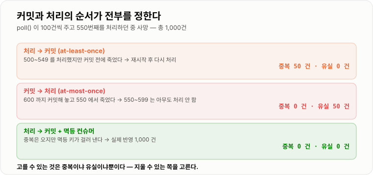
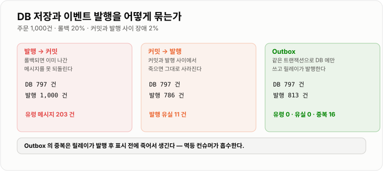
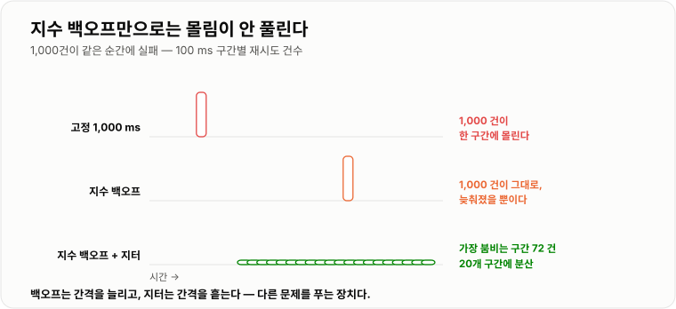

# 메시지 중복 · 재시도 · Outbox

> **분산 시스템에서 "정확히 한 번"은 살 수 없는 물건이다. 커밋을 처리보다 먼저 하면 실측 50건이 유실됐고, 나중에 하면 50건이 중복됐다. 선택지는 둘뿐이라 실무는 중복 쪽을 고르고 멱등성으로 지운다 — 그러면 중복 0건, 유실 0건이 된다.**

---

## 1. 핵심 요약

**메시지 시스템의 배달 보장은 at-most-once(유실 가능)와 at-least-once(중복 가능) 둘뿐이다. 실무의 정답은 at-least-once로 받고 처리를 멱등하게 만드는 것이며, 그 앞단에서 DB 커밋과 메시지 발행을 원자적으로 묶는 장치가 Outbox 패턴이다.**

### 한눈에 보기

* 배달 보장은 **커밋(오프셋 이동)과 처리의 순서**가 정한다. 실측했다 — `poll()`이 100건씩 주고 550번째를 처리하다 죽는 상황에서 **처리 → 커밋은 중복 50건 · 유실 0건**, **커밋 → 처리는 중복 0건 · 유실 50건**이었다.
* **exactly-once는 "중복이 안 생긴다"가 아니라 "중복이 결과에 반영되지 않는다"** 로만 실현된다. 같은 실측에 **멱등 컨슈머**를 붙이자 **중복 0건 · 유실 0건 · 실제 반영 1,000건**으로 정확해졌다.
* **DB 저장과 메시지 발행은 원자적이지 않다.** 이것이 이중 쓰기(dual write) 문제다. 롤백 20% · 커밋-발행 사이 장애 2%로 실측하니 **발행을 먼저 하면 DB에 없는 유령 메시지 203건**, **커밋을 먼저 하면 발행 유실 11건**이 났다.
* **Outbox는 발행을 DB 쓰기로 바꿔서 이 문제를 없앤다.** 같은 실측에서 **유령 0건 · 유실 0건**이 됐고, 대신 **중복 16건**이 남았다 — 이 중복은 멱등 컨슈머가 흡수한다.
* **재시도는 오류를 가려서 해야 한다.** 타임아웃·커넥션 거부는 다시 하면 되지만, 형식 오류·검증 실패는 백만 번 해도 실패한다. 실측에서 영구 오류 5%를 섞자 **재시도 상한이 없으면 그 50건이 큐를 영원히 막는다.**
* **같은 순간에 실패한 요청들은 같은 순간에 재시도된다.** 1,000건이 동시에 실패했을 때 고정 간격도 지수 백오프도 **한 100 ms 구간에 1,000건 전부**가 몰렸다. **지터를 넣자 가장 붐비는 구간이 72건**으로 떨어지고 20개 구간에 흩어졌다.
* **재시도 상한은 회복 가능한 것도 일부 버린다.** 상한 3회 실측에서 **DLQ 101건** 중 영구 오류는 50건이고 나머지 51건은 "3번 안에 못 고쳐진 일시 오류"였다. **그래서 DLQ는 버리는 곳이 아니라 다시 처리할 곳**이다.
* Kafka에서 트랜잭션을 써도 **컨슈머의 `isolation.level` 기본값이 `read_uncommitted`** 라서, 컨슈머를 안 고치면 **커밋 안 된 메시지까지 읽는다.**

> 이 노트의 수치는 **JDK 21.0.12.1 (Temurin) · Windows 11**에서 실행한 결과다. **장애 시점(550번째 처리 중 사망)과 실패율(롤백 20% · 커밋-발행 사이 2% · 영구 오류 5%)을 고정한 최소 모델**로 재현했다 — 브로커를 띄워 잰 값이 아니라, **커밋 순서와 실패 시점이 결과를 어떻게 바꾸는지**를 결정적으로 보이기 위한 실행 가능한 모델이다. 재시도 몰림 분포는 난수 시드를 고정해 계산했다.

### 무엇을 해결하는가

#### 해결하려는 문제

주문을 저장하고 이벤트를 발행하는 코드다. 아주 흔하다.

```java
@Transactional
public void createOrder(OrderRequest req) {
    Order order = orderRepository.save(req.toOrder());     // ① DB 에 쓴다
    kafkaTemplate.send("order.created", order.getId());    // ② 메시지를 보낸다
}
```

**①과 ②는 서로 다른 시스템이다.** DB 트랜잭션은 Kafka를 롤백하지 못하고, Kafka는 DB를 롤백하지 못한다. 그래서 둘 사이에서 죽으면 상태가 갈린다.

```text
② 를 먼저 하면            ① 을 먼저 하면
──────────────────       ──────────────────
메시지 발행 ✅            DB 커밋 ✅
DB 롤백    ❌     ⇒       ─ 여기서 프로세스 사망 ─
                          메시지 발행 ⬜
DB 에 없는 주문의
알림 메일이 나간다         주문은 있는데 알림이 영원히 안 온다
```

1,000건으로 실측한 결과다.

```text
주문 1,000건, 트랜잭션 롤백 20%, 커밋과 발행 사이 장애 2%

  (a) 발행 → 커밋 : DB 797건 / 발행 1,000건 → DB에 없는 유령 메시지 203 건
  (b) 커밋 → 발행 : DB 797건 / 발행   786건 → 발행 유실 11 건
```

**어느 쪽으로 순서를 바꿔도 틀린다.** 이것이 이중 쓰기 문제이고, 순서를 고민해서 풀 수 있는 문제가 아니다.

#### 이 개념이 없을 때

"2단계 커밋(2PC)을 쓰면 되지 않나?" 이론적으로는 맞다. 하지만 실무에서 거의 안 쓴다.

| 2PC가 안 쓰이는 이유 | 내용 |
| --- | --- |
| **지원하지 않는다** | Kafka는 XA 트랜잭션을 지원하지 않는다. 외부 결제 API는 더더욱. |
| **느리다** | 준비-커밋 두 왕복이 모든 참여자에게 필요하다. |
| **막힌다** | 코디네이터가 준비 단계 후 죽으면 참여자들이 락을 쥔 채 멈춘다. |

**그래서 실무는 원자성을 포기하고 "결국 같아진다"(eventual consistency)로 간다.** 그 대신 **중복이 와도 결과가 안 망가지게** 만든다. 이 노트의 나머지는 그 방법이다.

---

## 2. 동작 원리

### 핵심 구성 요소

| 용어 | 뜻 |
| --- | --- |
| **at-most-once** | 최대 한 번. 중복이 없는 대신 유실될 수 있다 |
| **at-least-once** | 최소 한 번. 유실이 없는 대신 중복될 수 있다 |
| **exactly-once** | 정확히 한 번. 브로커 안에서는 가능하지만 외부 시스템까지는 못 미친다 |
| **멱등성**(idempotency) | 같은 요청을 여러 번 적용해도 결과가 한 번 적용한 것과 같은 성질 |
| **멱등 키**(idempotency key) | 중복을 판별하는 값. 메시지 ID 또는 비즈니스 키(주문 번호 등) |
| **DLQ**(Dead Letter Queue) | 재시도 상한을 넘긴 메시지를 격리하는 별도 큐 |
| **Outbox** | 발행할 메시지를 업무 데이터와 **같은 트랜잭션으로** DB에 적어 두는 테이블 |
| **릴레이**(relay) | Outbox 테이블을 읽어 실제로 브로커에 발행하는 별도 프로세스 |

### 내부 동작 과정

#### 1) 커밋 순서가 배달 보장을 정한다

컨슈머는 두 가지 일을 한다 — **메시지를 처리하고, 어디까지 읽었는지 커밋한다.** 이 순서가 전부다.

```text
[at-least-once]  처리 → 커밋
  poll(500~599) → 550 까지 처리 → 💥 사망 (커밋 못 함)
  재시작 → 마지막 커밋(500)부터 다시 → 500~549 를 두 번 처리

[at-most-once]   커밋 → 처리
  poll(500~599) → 즉시 커밋(600) → 550 까지 처리 → 💥 사망
  재시작 → 600 부터 → 550~599 는 아무도 처리 안 함
```

실측 결과가 정확히 대칭이다.

```text
poll() 이 100건씩 주고, 550번째를 처리하던 중 프로세스가 죽는다 (총 1,000건)

  (a) at-least-once (처리 → 커밋) : 중복 50 건, 유실  0 건
  (b) at-most-once  (커밋 → 처리) : 중복  0 건, 유실 50 건
  (c) at-least-once + 멱등 컨슈머  : 중복  0 건, 유실  0 건, 실제 반영 1,000 건
```



*고를 수 있는 것은 "중복이냐 유실이냐"뿐이고, (c)는 세 번째 보장이 아니라 중복을 지워 낸 결과다.*

**왜 유실보다 중복을 고르는가.** 유실은 **복구할 방법이 없다.** 무엇이 사라졌는지 알 수가 없기 때문이다. 중복은 **판별해서 버릴 수 있다.** 그래서 기본은 언제나 at-least-once다.

#### 2) exactly-once의 현실

Kafka에는 트랜잭션 API가 있다. **"읽고 → 처리하고 → 쓰고 → 오프셋 커밋"을 하나의 원자 단위로** 묶는다.

```text
Kafka 안에서만 성립한다
  order.events (읽기) → 처리 → order.settled (쓰기) + 오프셋 커밋
  ╰────────────── 하나의 트랜잭션 ──────────────╯
```

**두 가지 한계가 있다.**

첫째, **Kafka 밖으로 나가면 깨진다.** 처리 중에 DB에 쓰거나 결제 API를 부르면 그건 트랜잭션에 안 들어간다. 실무 컨슈머는 대부분 밖으로 나간다.

둘째, **컨슈머 설정이 기본값이면 트랜잭션의 의미가 없다.**

```text
isolation.level = read_uncommitted    ← 컨슈머 기본값
```

**`read_committed`로 바꾸지 않으면 커밋되지 않은(나중에 취소될) 메시지까지 읽는다.** 프로듀서만 트랜잭션을 켜고 컨슈머를 안 고치는 실수가 흔하다.

**결론** — exactly-once는 "브로커 안에서 닫히는 파이프라인"에만 쓰고, 그 밖에서는 **at-least-once + 멱등성**이 유일한 실전 해법이다.

#### 3) 멱등 컨슈머 — 중복을 결과에서 지운다

방법은 셋이다. **위에서부터 우선 검토한다.**

**(가) 연산 자체가 멱등한 경우 — 아무것도 안 해도 된다**

```sql
UPDATE orders SET status = 'PAID' WHERE id = ?;      -- 몇 번 해도 PAID
UPDATE members SET grade = 'GOLD' WHERE id = ?;      -- 몇 번 해도 GOLD
```

**절대 상태를 쓰는 연산**은 그 자체로 멱등하다. 반대로 **상대 변화**는 아니다.

```sql
UPDATE accounts SET balance = balance - 1000 WHERE id = ?;   -- ❌ 두 번이면 2,000원
```

**(나) 조건부 갱신 — 상태 전이를 한 번만 허용한다**

```sql
UPDATE orders
   SET status = 'PAID', paid_at = NOW()
 WHERE id = ? AND status = 'PENDING';
```

두 번째 실행은 `WHERE`에 안 걸려 **갱신 행 수 0**을 돌려준다. 그 값으로 중복을 판별한다. **추가 테이블이 필요 없어서 가장 가볍다.**

**(다) 처리 이력 테이블 + 유니크 제약 — 가장 일반적**

```sql
CREATE TABLE processed_message (
    message_id   VARCHAR(64) PRIMARY KEY,   -- 유니크 제약이 곧 중복 차단 장치다
    consumer     VARCHAR(64) NOT NULL,
    processed_at TIMESTAMP   NOT NULL
);
```

**중요한 것은 "이력 저장"과 "업무 처리"가 같은 트랜잭션에 있어야 한다는 점**이다. 따로 하면 그 사이에서 죽었을 때 다시 중복이 생긴다.

**어떤 값을 멱등 키로 쓰는가.** 브로커가 주는 메시지 ID보다 **비즈니스 키가 낫다.** 프로듀서가 재발행하면 메시지 ID는 바뀌지만 주문 번호는 그대로이기 때문이다.

#### 4) Outbox 패턴 — 발행을 DB 쓰기로 바꾼다

이중 쓰기가 문제인 이유는 **두 시스템에 쓰기 때문**이다. **그러면 하나에만 쓰면 된다.**

```text
[1단계] 애플리케이션 — 한 트랜잭션 안에서 DB 에만 쓴다
   BEGIN
     INSERT INTO orders  (...)          -- 업무 데이터
     INSERT INTO outbox  (...)          -- "발행해야 할 메시지"도 그냥 DB 행이다
   COMMIT                               -- 둘 다 커밋되거나 둘 다 롤백된다

[2단계] 릴레이 — outbox 를 읽어 실제로 발행한다
   SELECT * FROM outbox WHERE published_at IS NULL ORDER BY id LIMIT 100
   → 브로커에 발행
   → UPDATE outbox SET published_at = NOW() WHERE id IN (...)
```



*Outbox는 원자성을 "DB 트랜잭션 하나"로 되돌리고, 남는 중복만 컨슈머가 지운다.*

같은 실측 조건에서의 결과다.

```text
주문 1,000건, 롤백 20%, 커밋-발행 사이 장애 2%

  (a) 발행 → 커밋 : DB   797건 / 발행 1,000건 → 유령 메시지 203 건
  (b) 커밋 → 발행 : DB   797건 / 발행   786건 → 발행 유실   11 건
  (c) Outbox      : DB   797건 / 발행   813건 → 유령 0 건, 유실 0 건, 중복 16 건
```

**Outbox의 중복은 어디서 오는가.** 릴레이가 **발행에 성공한 뒤 `published_at`을 찍기 전에** 죽으면, 다시 살아나서 같은 행을 또 발행한다. 이건 없앨 수 없다 — 발행과 표시 역시 두 시스템에 쓰는 일이기 때문이다.

**그래서 Outbox는 항상 멱등 컨슈머와 한 쌍이다.** Outbox 혼자서는 유실과 유령만 없애고 중복은 남긴다.

**릴레이를 만드는 두 방식**

| 방식 | 동작 | 장점 | 단점 |
| --- | --- | --- | --- |
| **폴링** | 스케줄러가 주기적으로 `SELECT` | 구현이 단순, 의존성 없음 | 주기만큼 지연, DB 부하, 다중 인스턴스면 잠금 필요 |
| **CDC** (Debezium 등) | DB 트랜잭션 로그를 읽어 발행 | 지연 짧음, DB에 조회 부하 없음 | 운영 구성 요소가 하나 늘어남 |

폴링으로 시작해 규모가 커지면 CDC로 옮기는 것이 보통이다. 폴링을 여러 인스턴스가 돌린다면 **`SELECT ... FOR UPDATE SKIP LOCKED`** 로 같은 행을 두 인스턴스가 집지 않게 한다.

#### 5) 재시도 — 무엇을 다시 할 것인가

**모든 오류를 재시도하면 안 된다.** 기준은 하나다 — **"똑같이 다시 해서 결과가 달라질 수 있는가."**

| 재시도해야 하는 오류 | 재시도하면 안 되는 오류 |
| --- | --- |
| 커넥션 타임아웃 · 커넥션 거부 | 잘못된 형식 (역직렬화 실패) |
| HTTP 5xx · 503 | HTTP 4xx (400 · 401 · 404 · 422) |
| DB 데드락 · 락 타임아웃 | 유니크 제약 위반 (이미 처리됨) |
| 일시적 리더 선출 중 | 검증 실패 (필수 값 없음) |

**영구 오류를 재시도하면 큐가 막힌다.** 실측에서 영구 오류를 5% 섞자, 상한이 없으면 **그 50건이 파티션 앞을 영원히 막는다.** Kafka는 파티션 안에서 순서대로 읽으므로 **한 건이 막히면 그 뒤가 전부 못 나간다.**

#### 6) 백오프와 지터 — 재시도가 몰리는 문제

장애는 보통 **한꺼번에** 일어난다. DB가 잠깐 죽으면 그 순간의 1,000건이 **동시에** 실패한다. 그리고 같은 규칙으로 재시도하면 **또 동시에** 몰려간다.

```text
1,000건이 같은 순간에 실패했을 때, 가장 붐비는 100 ms 구간에 몇 건이 몰리는가

  고정 1,000 ms        : 1,000 건 (t=1,000 ms), 구간 1개    ← 전부 한꺼번에
  지수 백오프           : 1,000 건 (t=4,000 ms), 구간 1개    ← 늦춰졌을 뿐 여전히 한꺼번에
  지수 백오프 + 지터     :    72 건 (t=3,500 ms), 구간 20개  ← 흩어졌다
```



*지수 백오프만으로는 몰림이 안 풀린다 — 모두가 같은 시각에 실패해 같은 시각에 다시 오기 때문이다.*

**지수 백오프의 목적은 "간격을 늘리는 것"이고, 지터의 목적은 "간격을 흩는 것"이다.** 둘은 다른 문제를 푼다. 지수 백오프만 쓰면 **간신히 살아난 서버가 재시도 폭풍에 다시 죽는다.**

```java
// 지수 백오프 + 지터 — 대기 시간을 [base/2, base] 사이에서 무작위로 고른다
long base = Math.min(initialMs * (1L << attempt), maxMs);
long delay = base / 2 + ThreadLocalRandom.current().nextLong(base / 2 + 1);
```

#### 7) DLQ — 상한을 넘긴 것을 격리한다

재시도 상한 3회, 영구 오류 5%, 일시 오류의 회당 회복률 60%로 실측했다.

```text
성공 899 건, DLQ 101 건, 총 시도 1,623 회 (건당 평균 1.62 회)
```

**DLQ 101건 중 영구 오류는 50건이다.** 나머지 51건은 **3번 안에 회복되지 않았을 뿐, 다시 하면 될 수도 있는 것**이다. 이 사실이 DLQ 운영의 핵심이다.

* **DLQ는 쓰레기통이 아니라 대기실이다.** 원인을 고친 뒤 되돌려 넣는 경로가 반드시 있어야 한다.
* **DLQ에 쌓이면 알람을 울린다.** 조용히 쌓이면 아무도 모른다.
* **원본 메시지와 함께 실패 사유·시도 횟수·마지막 예외를 같이 넣는다.** 메시지만 있으면 왜 실패했는지 알 수 없다.

---

## 3. 특징과 비교

| 구분 | 내용 |
| ----------- | -- |
| **장점** | at-least-once + 멱등성으로 유실 0건 · 중복 0건을 실제로 달성한다(실측). Outbox는 이중 쓰기 문제를 DB 트랜잭션 하나로 되돌려 유령 메시지 203건과 발행 유실 11건을 모두 0으로 만든다. 재시도·DLQ가 있으면 일시 장애가 사람 손을 안 거치고 복구된다. |
| **단점** | 멱등 키 저장소가 새로 필요하고(테이블 · 정리 배치 · 조회 비용), Outbox는 발행 지연이 릴레이 주기만큼 늘며 테이블이 계속 자란다. 모든 컨슈머가 멱등해야 해서 규칙을 팀 전체가 지켜야 한다. |
| **적합한 상황** | 금액·재고·발송처럼 두 번 실행되면 안 되는 처리, DB 변경과 이벤트 발행이 함께 일어나는 도메인, 외부 API를 호출해 타임아웃이 잦은 연동. |
| **주의할 상황** | 중복돼도 무해한 데이터(접속 로그·조회수 집계)에 전부 적용하면 비용만 든다. 처리량이 극히 높은데 멱등 키 조회를 DB로 하면 그 자체가 병목이 된다. 순서가 중요한 처리에서 DLQ로 한 건을 빼면 그 뒤 순서가 어긋난다. |

### 성능 특성

| 상황 | 중복 | 유실 | 근거 |
| --- | --- | --- | --- |
| 처리 → 커밋 (at-least-once) | **50건** | 0건 | 550번째에서 사망, 배치 100 |
| 커밋 → 처리 (at-most-once) | 0건 | **50건** | 같은 조건 |
| 처리 → 커밋 + 멱등 컨슈머 | **0건** | **0건** | 실제 반영 1,000건 |
| 발행 → 커밋 | 유령 **203건** | 0건 | 롤백 20% |
| 커밋 → 발행 | 0건 | **11건** | 커밋-발행 사이 장애 2% |
| Outbox + 멱등 컨슈머 | **0건** (16건 흡수) | **0건** | 릴레이 재발행 포함 |

### 장점과 단점

**장점 — 유실을 "설계로" 없앨 수 있다.**
중복은 판별해 지울 수 있지만 유실은 흔적이 없다. at-least-once + 멱등성은 **없앨 수 있는 쪽만 남기는** 조합이라 실무의 기본값이 됐다. 실측에서 반영 건수가 정확히 1,000건이 된 것이 그 결과다.

**장점 — Outbox는 새 인프라가 필요 없다.**
2PC도, 특수 브로커 기능도 아니고 **테이블 하나와 배치 하나**다. 이미 쓰는 DB의 트랜잭션을 그대로 이용한다. 진입 비용이 낮은 것이 이 패턴이 널리 쓰이는 이유다.

**단점 — 멱등 키 저장소가 계속 자란다.**
`processed_message`는 처리한 만큼 쌓인다. **보관 기간을 정하고 지우는 배치가 반드시 있어야 한다.** 기간은 "중복이 올 수 있는 최대 시간"보다 넉넉히 잡는다 — 리텐션이 7일이면 되감기로 7일 전 메시지가 다시 올 수 있다.

**단점 — Outbox는 지연을 더한다.**
폴링 주기가 1초면 발행이 최대 1초 늦다. 실시간성이 중요하면 주기를 줄이거나(DB 부하 증가) CDC로 간다.

**단점 — 순서와 DLQ는 서로 부딪힌다.**
Kafka 파티션은 순서대로 읽는다. 3번째 메시지를 DLQ로 빼고 4번째를 처리하면 **그 키의 순서가 깨진다.** 순서가 중요하면 DLQ 대신 **그 파티션을 멈추고 사람을 부르는 편**이 맞을 때가 있다.

### 어떤 상황에서 고르는가

```text
이 처리가 두 번 실행되면 문제가 되는가?
├─ 아니오 → 그냥 at-least-once 로 둔다 (로그 적재, 캐시 갱신)
└─ 예
   └─ 연산 자체를 멱등하게 바꿀 수 있는가?  (절대 상태 UPDATE, SET 연산)
      ├─ 예 → 그것으로 끝. 추가 장치 불필요
      └─ 아니오
         └─ 상태 전이인가?  (PENDING → PAID)
            ├─ 예 → 조건부 UPDATE 로 한 번만 허용 (가장 가볍다)
            └─ 아니오 → 처리 이력 테이블 + 유니크 제약
                       (업무 처리와 같은 트랜잭션에 넣는다)

DB 변경과 이벤트 발행이 함께 일어나는가?
└─ 예 → Outbox
   └─ 발행 지연을 얼마나 허용하는가?
      ├─ 초 단위 허용 → 폴링 릴레이 (SELECT ... FOR UPDATE SKIP LOCKED)
      └─ 밀리초가 중요 → CDC (Debezium)
```

### 비슷한 기술과 비교

| 기준 | 조건부 UPDATE | 처리 이력 테이블 | 분산 락 | Kafka 트랜잭션 |
| --------- | ---- | ---- | ---- | ---- |
| **막는 것** | 같은 상태 전이의 재실행 | 같은 메시지의 재처리 | 동시 실행 | 브로커 안의 원자성 |
| **저장 비용** | 없음 | 행 하나씩 누적 | 락 키 | 트랜잭션 로그 |
| **적용 범위** | 상태가 있는 엔티티 | 모든 메시지 | 임계 구역 | Kafka ↔ Kafka |
| **외부 시스템까지** | 해당 없음 | 해당 없음 | 부분적 | **불가** |
| **선택 기준** | 상태 머신이 있는 도메인 | 일반적인 컨슈머 | 순서·동시성 제어 | Kafka 내부 스트림 처리 |

**분산 락은 멱등성의 대체재가 아니다.** 락은 "동시에 둘이 들어오는 것"을 막고, 멱등성은 "시간을 두고 두 번 오는 것"을 막는다. 재시도 중복은 후자라서 락으로는 안 막힌다 → **[분산 락과 멱등성](../../08-캐시-Redis/분산락-멱등성/분산락-멱등성.md)**

---

## 4. 실무 주의사항

### 백엔드 실무 적용

#### Spring · Java

**멱등 키 저장과 업무 처리를 같은 트랜잭션에 넣는다.** 나누면 그 사이에서 죽었을 때 다시 중복이 생긴다.

```java
@Transactional
public void handle(OrderPaid event) {
    try {
        processedRepository.save(new ProcessedMessage(event.getEventId()));
    } catch (DataIntegrityViolationException e) {
        return;                     // 유니크 제약 위반 = 이미 처리한 메시지
    }
    orderService.markPaid(event.getOrderId());   // 같은 트랜잭션 안이다
}
```

**`@Retryable`을 예외 종류로 좁힌다.** 전부 재시도하면 영구 오류가 큐를 막는다.

```java
@Retryable(
    retryFor = { SocketTimeoutException.class, TransientDataAccessException.class },
    noRetryFor = { IllegalArgumentException.class, HttpClientErrorException.class },
    maxAttempts = 3,
    backoff = @Backoff(delay = 1000, multiplier = 2, random = true)   // random=true 가 지터다
)
public void callExternal(String orderId) { ... }
```

**`@Backoff(random = true)`를 빼먹지 않는다.** 실측에서 지터 없이는 1,000건이 한 구간에 전부 몰렸다.

#### 데이터베이스 · 캐시

**`processed_message`는 기본 키에 멱등 키를 둔다.** 인덱스 조회 한 번으로 판별되고, 유니크 제약이 동시 삽입까지 막는다.

**정리 배치를 만든다.** 예를 들어 30일이 지난 행을 지운다. 없으면 테이블이 무한히 자라 조회가 느려진다.

**Outbox 폴링은 인덱스를 탄다.** `WHERE published_at IS NULL ORDER BY id`가 풀 스캔이 되지 않게 부분 인덱스나 상태 컬럼 인덱스를 건다.

```sql
CREATE INDEX idx_outbox_unpublished ON outbox (id) WHERE published_at IS NULL;
```

**멱등 키 판별을 Redis로 옮길 때는 유실을 감안한다.** `SET key NX EX 86400`은 빠르지만 Redis가 재시작하면 사라져 중복이 통과한다. **금액이 걸린 처리는 DB 유니크 제약이 최종 방어선이어야 한다.**

#### 동시성 · 분산 환경

**Outbox 릴레이를 여러 대로 띄우면 `SKIP LOCKED`가 필요하다.**

```sql
SELECT * FROM outbox
 WHERE published_at IS NULL
 ORDER BY id
 LIMIT 100
   FOR UPDATE SKIP LOCKED;      -- 다른 인스턴스가 잡은 행은 건너뛴다
```

**컨슈머 재배포·리밸런싱은 정상 동작이지 장애가 아니다.** 그때마다 중복이 생기므로, **"중복은 예외 상황"이 아니라 "매일 일어나는 일"** 로 놓고 설계한다.

**Kafka 트랜잭션을 쓴다면 컨슈머의 `isolation.level`을 반드시 `read_committed`로 바꾼다.** 기본값 `read_uncommitted`면 프로듀서만 트랜잭션을 켠 것이 되어 아무 효과가 없다.

### 자주 하는 오해

| 잘못된 이해 | 올바른 이해 |
| ------ | ------ |
| exactly-once를 지원하는 브로커를 쓰면 된다 | 브로커 **내부**에서만 성립한다. 컨슈머가 DB나 외부 API를 건드리는 순간 깨진다. 실전 해법은 at-least-once + 멱등성이다. |
| at-least-once면 중복이 생기니 나쁘다 | 중복은 지울 수 있고 유실은 못 지운다. 실측에서 멱등 컨슈머를 붙이자 중복 0 · 유실 0이 됐다. |
| Outbox를 쓰면 중복이 없어진다 | 유령과 유실만 없앤다. 릴레이가 발행 후 표시 전에 죽으면 중복이 난다(실측 16건). **멱등 컨슈머와 한 쌍**이다. |
| `@Transactional` 안에서 발행하면 안전하다 | 트랜잭션은 브로커를 롤백하지 못한다. 롤백되면 유령 메시지가 나간다(실측 203건). |
| 지수 백오프를 쓰면 몰림이 해결된다 | 늦출 뿐 여전히 한꺼번에 온다(실측: 한 구간에 1,000건). **지터**가 있어야 흩어진다(72건). |
| 실패하면 계속 재시도하면 된다 | 영구 오류는 백만 번 해도 실패하고, 파티션 앞을 막아 **뒤의 정상 메시지까지 멈춘다.** |
| DLQ에 들어간 건 버려도 된다 | 실측 DLQ 101건 중 51건은 상한에 걸렸을 뿐인 일시 오류였다. **되돌려 넣는 경로가 필요하다.** |
| 멱등 키는 브로커의 메시지 ID를 쓰면 된다 | 프로듀서가 재발행하면 메시지 ID가 바뀐다. **비즈니스 키**(주문 번호 등)가 더 안전하다. |

---

## 5. 예제

### Outbox 테이블과 발행

```sql
CREATE TABLE outbox (
    id             BIGINT AUTO_INCREMENT PRIMARY KEY,
    aggregate_type VARCHAR(64)  NOT NULL,     -- 'Order'
    aggregate_id   VARCHAR(64)  NOT NULL,     -- 주문 번호 (파티션 키로 쓴다)
    event_type     VARCHAR(64)  NOT NULL,     -- 'OrderCreated'
    payload        JSON         NOT NULL,
    created_at     TIMESTAMP    NOT NULL,
    published_at   TIMESTAMP    NULL          -- NULL 이면 아직 안 보냈다
);
```

```java
@Service
public class OrderService {

    @Transactional
    public Order create(OrderRequest req) {
        Order order = orderRepository.save(req.toOrder());
        // 같은 트랜잭션에 함께 쓴다 — 롤백되면 이 행도 같이 사라진다
        outboxRepository.save(OutboxMessage.of("Order", order.getId(),
                "OrderCreated", toJson(order)));
        return order;
    }
}
```

### 폴링 릴레이

```java
@Component
public class OutboxRelay {

    @Scheduled(fixedDelay = 500)
    @Transactional
    public void publish() {
        List<OutboxMessage> batch = outboxRepository.findUnpublishedForUpdate(100);
        for (OutboxMessage m : batch) {
            // aggregateId 를 키로 써서 같은 주문의 이벤트 순서를 지킨다
            kafkaTemplate.send(m.getEventType(), m.getAggregateId(), m.getPayload());
            m.markPublished();      // 여기 직전에 죽으면 다음 회차에 재발행된다 (중복)
        }
    }
}
```

```java
public interface OutboxRepository extends JpaRepository<OutboxMessage, Long> {

    @Query(value = """
            SELECT * FROM outbox
             WHERE published_at IS NULL
             ORDER BY id
             LIMIT :limit
               FOR UPDATE SKIP LOCKED
            """, nativeQuery = true)
    List<OutboxMessage> findUnpublishedForUpdate(@Param("limit") int limit);
}
```

### 멱등 컨슈머

```java
@KafkaListener(topics = "OrderCreated", groupId = "notification")
@Transactional
public void consume(ConsumerRecord<String, String> record) {
    String idempotencyKey = record.key();      // 비즈니스 키 (주문 번호)

    if (!markProcessed(idempotencyKey)) {
        duplicateCounter.increment();          // 중복은 세어 둔다. 갑자기 늘면 신호다
        return;
    }
    notificationService.sendOrderMail(idempotencyKey);
}

private boolean markProcessed(String key) {
    try {
        processedRepository.save(new ProcessedMessage(key, "notification", Instant.now()));
        return true;
    } catch (DataIntegrityViolationException e) {
        return false;                          // 유니크 제약 위반 = 이미 처리했다
    }
}
```

### 오류를 가려서 재시도하고, 넘치면 DLQ로

```java
public void handle(OrderEvent event) {
    int attempt = 0;
    while (true) {
        try {
            externalClient.notify(event);
            return;
        } catch (RuntimeException e) {
            if (!isRetryable(e)) {              // 영구 오류는 즉시 격리한다
                deadLetterPublisher.send(event, e, attempt);
                return;
            }
            if (++attempt >= MAX_ATTEMPTS) {    // 상한을 넘겨도 격리한다
                deadLetterPublisher.send(event, e, attempt);
                return;
            }
            sleepWithJitter(attempt);
        }
    }
}

private boolean isRetryable(RuntimeException e) {
    if (e instanceof HttpClientErrorException) return false;   // 4xx — 다시 해도 같다
    if (e instanceof IllegalArgumentException) return false;   // 형식 오류
    return true;                                               // 타임아웃 · 5xx · 데드락
}

private void sleepWithJitter(int attempt) {
    long base = Math.min(1000L * (1L << attempt), 30_000L);
    long delay = base / 2 + ThreadLocalRandom.current().nextLong(base / 2 + 1);
    try {
        Thread.sleep(delay);
    } catch (InterruptedException ie) {
        Thread.currentThread().interrupt();
    }
}
```

---

## 6. 면접 정리

### 자주 나오는 질문

#### 기본 질문

1. **at-most-once, at-least-once, exactly-once의 차이는?**

    * 핵심 키워드: 커밋과 처리의 순서가 결정 · 실측 중복 50 vs 유실 50 · exactly-once는 브로커 내부에서만 · 실전은 at-least-once + 멱등성

2. **DB 커밋과 메시지 발행을 어떻게 원자적으로 묶는가?**

    * 핵심 키워드: 이중 쓰기 문제 · 2PC는 Kafka 미지원·느림·블로킹 · Outbox로 DB 한 곳에만 쓰기 · 릴레이가 나중에 발행

3. **멱등성이란 무엇이고 어떻게 구현하는가?**

    * 핵심 키워드: 여러 번 적용해도 결과 동일 · 절대 상태 UPDATE · 조건부 UPDATE(`WHERE status='PENDING'`) · 처리 이력 테이블 + 유니크 제약 · 같은 트랜잭션

4. **재시도해도 되는 오류와 안 되는 오류를 어떻게 구분하는가?**

    * 핵심 키워드: 다시 해서 결과가 달라질 수 있는가 · 타임아웃·5xx·데드락은 재시도 · 4xx·형식 오류·검증 실패는 즉시 DLQ

5. **DLQ는 왜 필요한가?**

    * 핵심 키워드: 영구 오류가 파티션 앞을 막음 · 상한 초과분 격리 · 실측 DLQ 101건 중 51건은 회복 가능 · 되돌려 넣는 경로 필수

#### 꼬리 질문

1. **왜 유실보다 중복을 고르는가?**

    * 핵심 키워드: 유실은 무엇이 사라졌는지 알 수 없음 · 중복은 키로 판별해 제거 가능 · 멱등 컨슈머로 반영 1,000건 정확

2. **Outbox를 쓰면 중복도 없어지는가?**

    * 핵심 키워드: 아니다 · 릴레이가 발행 후 표시 전 사망 시 재발행(실측 16건) · Outbox는 유령·유실만 제거 · 멱등 컨슈머와 한 쌍

3. **지수 백오프만으로 충분하지 않은 이유는?**

    * 핵심 키워드: 동시에 실패 → 동시에 재시도 · 실측 한 구간에 1,000건 · 지터로 72건, 20개 구간 분산 · 간신히 산 서버를 다시 죽임

4. **멱등 키로 무엇을 쓰겠는가?**

    * 핵심 키워드: 브로커 메시지 ID는 재발행 시 바뀜 · 비즈니스 키(주문 번호) 권장 · 기본 키로 두어 유니크 제약 활용 · 보관 기간과 정리 배치

5. **Kafka 트랜잭션을 켰는데 왜 효과가 없는가?**

    * 핵심 키워드: 컨슈머 `isolation.level` 기본값 `read_uncommitted` · `read_committed`로 변경 필요 · 외부 시스템까지는 어차피 못 감

6. **순서가 중요한 토픽에서 DLQ를 쓰면 어떤 문제가 있는가?**

    * 핵심 키워드: 한 건을 빼면 그 키의 순서가 깨짐 · 파티션을 멈추고 알람 · 순서와 가용성의 트레이드오프

### 30초 답변

> 분산 시스템에서 배달 보장은 유실이 있는 at-most-once와 중복이 있는 at-least-once 둘뿐입니다. 실측해 보면 커밋을 처리보다 먼저 하면 50건이 유실되고, 나중에 하면 50건이 중복됐습니다. 유실은 복구할 방법이 없고 중복은 키로 판별해 지울 수 있으니 **at-least-once로 받고 컨슈머를 멱등하게** 만드는 것이 실무의 정답이고, 그렇게 하니 중복 0건·유실 0건이 됐습니다. 그 앞단에서 DB 커밋과 발행이 갈리는 문제는 발행할 메시지를 같은 트랜잭션으로 DB에 적어 두는 **Outbox**로 막습니다. 재시도는 오류를 가려서 하고, 반드시 지터를 넣고, 상한을 넘기면 DLQ로 격리합니다.

### 핵심 키워드

`at-least-once` · `at-most-once` · `exactly-once` · `멱등성` · `멱등 키` · `처리 이력 테이블` · `조건부 UPDATE` · `이중 쓰기` · `Outbox` · `릴레이` · `SKIP LOCKED` · `CDC` · `지수 백오프` · `지터` · `DLQ`

### 이어서 볼 주제

* **[Kafka 구조와 동작](../Kafka-구조와-동작/Kafka-구조와-동작.md)** — 오프셋 커밋이 실제로 어떤 설정으로 제어되는지(`enable.auto.commit` · `isolation.level`)와 파티션 순서 보장.
* **[동기 · 비동기와 메시지 큐](../동기-비동기와-메시지큐/동기-비동기와-메시지큐.md)** — 애초에 왜 큐로 넘겼는지, 그 대가로 무엇을 떠안았는지.
* **[분산 락과 멱등성](../../08-캐시-Redis/분산락-멱등성/분산락-멱등성.md)** — 락과 멱등성이 층이 다른 장치인 이유와 Redis 기반 멱등 키의 실측.
* **[ACID와 격리 수준](../../07-트랜잭션-데이터접근/ACID-격리수준/ACID-격리수준.md)** — Outbox가 기대는 "같은 트랜잭션"이 정확히 무엇을 보장하는지.
