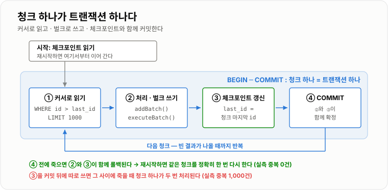
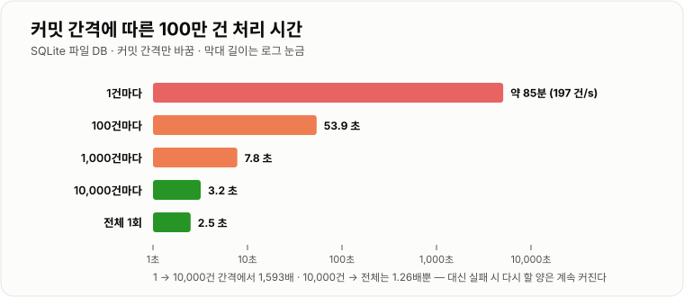
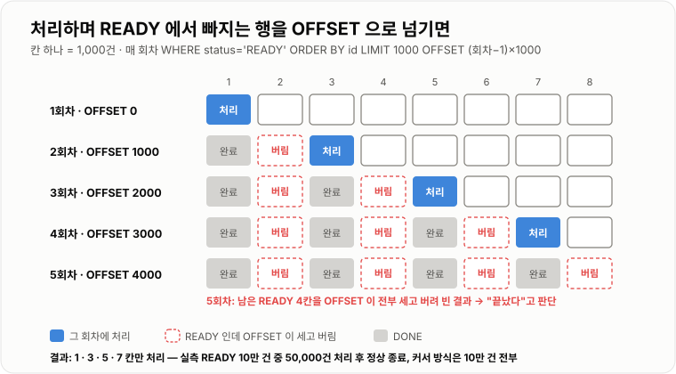

# 대용량 처리 시스템

> **쿠폰·결제가 "한 건의 정확성" 문제라면 대용량 처리는 "총량" 문제다. 한 건은 값싼데 건수가 많아서 무너진다. 100만 건을 한 건씩 커밋하면 약 85분, 1만 건씩 묶어 커밋하면 3.2초였다. 청크를 OFFSET으로 넘기면 전체 순회가 29.1배 느려졌고, 처리하면서 조건에서 빠지는 행을 OFFSET으로 돌자 10만 건 중 정확히 절반을 건너뛰었다.**

---

## 1. 핵심 요약

**대용량 처리의 원칙은 "한 번에 다 하지 않되, 한 건씩 하지도 않는다"이다. 적당한 크기의 청크로 나눠 커밋하고, 청크는 마지막 키로 넘기고(OFFSET 금지), 어디까지 했는지를 같은 트랜잭션에 기록해 중단 지점부터 다시 돌 수 있게 하고, 메모리에는 청크만 올리며, 병렬도는 가장 좁은 공유 자원까지만 올린다.**

### 한눈에 보기

* **커밋 간격이 처리 시간을 1,593배 가른다.** SQLite 파일 DB에 행을 넣으며 커밋 간격만 바꿨다. **1건마다 커밋은 초당 197건**(100만 건 추정 5,084초 ≈ 85분), **1만 건마다 커밋은 초당 313,790건**(3.2초)이었다. 커밋마다 디스크에 확정 쓰기(fsync)를 하기 때문이다.
* **그렇다고 전부를 한 트랜잭션에 넣으면 다른 것이 터진다.** 100만 행을 한 번에 UPDATE하자 커밋 전 되돌리기 저널이 **32.6 MB**(DB 50.8 MB의 64%)까지 불었다. 1만 건씩 나누면 최대 **0.35 MB**였다. 실패하면 전부 롤백되고, 그동안 잠금을 쥐고, 복제본은 커밋 뒤에야 따라온다.
* **청크를 OFFSET으로 넘기면 뒤로 갈수록 느려진다.** 100만 행을 1,000건씩 끝까지 읽는 데 **OFFSET은 21.60초, 커서(마지막 키 기준)는 0.74초 — 29.1배**였다. 마지막 청크 한 번이 41.63 ms vs 0.80 ms였다.
* **처리하면서 대상에서 빠지는 행을 OFFSET으로 돌면 절반을 건너뛴다.** `status = 'READY'`인 10만 건을 1,000건씩 읽어 `DONE`으로 바꾸는 루프가 **50,000건만 처리하고 끝났다.** 커서 방식은 10만 건을 모두 처리했다. 에러도 경고도 없다.
* **인덱스는 적재 속도를 13배 늦춘다.** 100만 행 적재가 보조 인덱스 **0개면 2.00초, 3개면 26.61초**였다. **적재한 뒤에 인덱스를 만들면 1.99 + 2.17 = 4.16초**로 6.4배 빨랐다.
* **중단 지점을 같은 트랜잭션에 기록해야 재실행이 안전하다.** 64번째 청크 뒤에 죽이고 다시 돌렸다. 체크포인트를 **청크 커밋과 따로** 쓰면 **1,000건(청크 하나)이 중복 처리**됐고, **같은 트랜잭션에** 쓰면 **0건**이었다.
* **1억 건은 힙에 올라가지 않는다.** 6개 컬럼 행을 JDBC 결과처럼 `Object[]`로 100만 개 올리면 **226 MB** — 1억 건이면 **22.6 GB**다. `Map`으로 받으면 **57.0 GB**다. 그래서 읽기도 청크(스트리밍)로 한다.
* **병렬도는 코어 수와 공유 자원에서 멈춘다.** CPU 작업은 6코어에서 **6스레드 5.91배**가 최고였고 8스레드는 오히려 4.95배로 떨어졌다. 동시 2개만 받는 쓰기 자원이 끼자 **4스레드 3.86배에서 멈췄고** 16스레드도 3.95배였다.

> 이 노트의 DB 수치는 **SQLite 3.50.4 파일 DB(Python `sqlite3`, 기본 저널 모드)** 에 100만 행 `orders`를 넣고 **Windows 11**에서 측정했다. 메모리와 병렬 처리는 **JDK 21.0.12.1 · 6코어**에서 쟀다. **SQLite는 쓰기가 한 번에 하나뿐이고 MySQL과 절대 시간이 다르므로**, 커밋 비용 · OFFSET 누적 스캔 · 인덱스 유지 비용처럼 **엔진이 달라도 성립하는 경향**만 읽는다. MySQL에만 해당하는 내용은 본문에 따로 표시했다.

### 무엇을 해결하는가

#### 해결하려는 문제

"매일 새벽, 전날 주문 전체를 정산한다." 가장 먼저 떠오르는 코드다.

```java
@Transactional
public void settleYesterday() {
    List<Order> orders = orderRepository.findAllByDate(yesterday());   // ① 전부 읽는다
    for (Order order : orders) {
        order.settle();                                                 // ② 한 건씩 처리
        settlementRepository.save(new Settlement(order));              // ③ 한 건씩 저장
    }
}                                                                       // ④ 마지막에 한 번 커밋
```

**하루 1만 건일 때는 잘 돈다.** 서비스가 커져 1억 건이 되면 네 줄이 각각 다른 방식으로 무너진다.

```text
① 전부 읽기       Object[] 1억 개 = 22.6 GB          → OutOfMemoryError
③ 한 건씩 저장     (영속성 컨텍스트에 1억 개가 쌓인다)   → 점점 느려지다 멈춤
④ 한 트랜잭션      되돌리기 로그 · 잠금 · 복제 지연     → 4시간 돌다 99%에서 실패하면 전부 롤백
                                                   → 다시 처음부터 4시간
```

**"1억 건을 한 트랜잭션에서 처리하면 무엇이 먼저 터지는가?"라는 질문의 답은 순서가 있다.** 애플리케이션에 다 올리면 **메모리가 가장 먼저** 터진다. 메모리를 피해도 DB 쪽에서 **되돌리기 로그가 커지고, 잠금이 길어지고, 실패 시 복구가 처음부터**라는 문제가 남는다.

#### 이 개념이 없을 때

반대로 "한 건씩 커밋하면 되겠다"고 가면 이번에는 느려서 끝나지 않는다.

| 방식 | 100만 건 소요 (실측) | 실패하면 |
| --- | --- | --- |
| 1건마다 커밋 | 약 5,084초 (85분) | 그 1건만 다시 |
| 1만 건마다 커밋 | **3.2초** | 최대 1만 건 다시 |
| 전부 한 트랜잭션 | 2.5초 | **100만 건 전부 다시** |

**답은 양 끝이 아니라 그 사이에 있고, 그 사이를 안전하게 만드는 장치들이 이 노트의 내용이다** — 청크를 넘기는 법(커서), 중단 지점 기록(체크포인트), 메모리 상한(스트리밍), 속도를 올리는 법(벌크 · 인덱스 · 병렬)이다.

---

## 2. 동작 원리

### 핵심 구성 요소

| 용어 | 뜻 |
| --- | --- |
| **배치**(batch) | 요청이 올 때마다가 아니라 **모아서 한꺼번에** 처리하는 작업. 정산 · 집계 · 이관 · 대량 발송 |
| **청크**(chunk) | 전체를 나눈 **한 덩어리**. 읽기 · 처리 · 쓰기 · 커밋을 청크 단위로 반복한다 |
| **커밋 간격** | 몇 건마다 커밋하는가. 청크 크기와 같게 두는 것이 보통이다 |
| **OFFSET 페이징** | `LIMIT n OFFSET m` — 앞의 m건을 **읽고 버린 뒤** n건을 준다 |
| **커서(키셋) 페이징** | `WHERE id > 마지막 id ORDER BY id LIMIT n` — **마지막으로 본 키에서 바로** 이어 읽는다 |
| **벌크 연산** | 여러 건을 **한 번의 왕복**으로 보내는 INSERT · UPDATE (JDBC 배치, 다중 VALUES) |
| **체크포인트** | 배치가 **어디까지 처리했는지** 저장한 값. 재시작하면 여기서부터 |
| **재실행 가능성** | 중간에 죽어도 **다시 돌리면 결과가 같아지는** 성질. 체크포인트 또는 멱등한 쓰기로 얻는다 |
| **스트리밍 조회** | 결과를 한 번에 다 받지 않고 **조금씩 받아 처리**하는 방식 (JDBC `fetchSize`) |
| **범위 분할** | 키 범위(`id 1~25만`, `25만~50만` …)로 나눠 **여러 작업자가 겹치지 않게** 처리하는 방식 |
| **사전 집계** | 매번 원본을 세지 않도록 **집계 결과를 테이블로 미리 만들어 두는** 방식 |

### 내부 동작 과정



*청크 하나가 트랜잭션 하나다. 체크포인트가 같은 커밋에 들어가야 "처리했는데 기록 못 한" 틈이 없다.*

#### 1) 커밋 간격 — 커밋은 비싸다

**커밋은 "이 변경은 전원이 나가도 남는다"를 보장하는 순간이라, DB는 커밋마다 디스크에 확정 쓰기(fsync)를 한다.** 행 하나를 쓰는 비용보다 이 확정 쓰기가 훨씬 비싸다. 그래서 커밋 횟수가 곧 처리 시간이다.

```text
100만 행 INSERT, 커밋 간격만 바꿈 (SQLite 파일 DB)

커밋 간격        초당 처리        100만 건 소요
      1           197 건/s      5,083.8 초 (추정, 약 85분)
    100        18,569 건/s         53.9 초
  1,000       127,408 건/s          7.8 초
 10,000       313,790 건/s          3.2 초
 전체 1회      394,729 건/s          2.5 초
```



*1 → 100 → 1,000까지는 커밋 횟수가 줄어드는 만큼 빨라지고, 1만 건을 넘으면 더 묶어도 1.3배밖에 안 준다.*

**이득은 점점 줄어든다.** 1,000 → 10,000은 2.5배, 10,000 → 전체는 1.26배다. 반면 **청크가 클수록 실패 시 다시 할 양, 잠금 시간, 되돌리기 로그는 청크 크기에 비례해 커진다.** 그래서 청크 크기는 "이득이 거의 멈추는 지점"과 "실패 시 다시 해도 괜찮은 양" 사이에서 고른다.

#### 2) 한 트랜잭션의 비용 — 되돌리기 로그와 잠금

**트랜잭션은 롤백할 수 있어야 하므로, 커밋 전까지 원래 값을 어딘가에 들고 있다.** SQLite는 되돌리기 저널 파일에, MySQL InnoDB는 언두 로그(undo log)에 둔다. 한 트랜잭션이 크면 이것이 그만큼 커진다.

```text
100만 행 UPDATE (DB 파일 50.8 MB)

  한 트랜잭션         커밋 직전 되돌리기 저널   32.6 MB   (DB의 64%)
  1만 건씩 100 트랜잭션  저널 최대            0.35 MB   (93분의 1)
```

**MySQL에서는 여기에 두 가지가 더 붙는다.**

* **긴 트랜잭션은 다른 트랜잭션의 옛 버전 정리를 막는다.** 언두 로그는 그것을 볼 수 있는 가장 오래된 트랜잭션이 끝나야 지워진다. 4시간짜리 배치가 열려 있으면 그동안 쌓인 모든 옛 버전이 남아 **서비스 조회까지 느려진다** → **[MVCC](../../07-트랜잭션-데이터접근/MVCC/MVCC.md)**
* **복제본은 커밋 뒤에야 시작한다.** 바이너리 로그는 트랜잭션이 커밋될 때 기록되므로, 4시간짜리 트랜잭션은 **커밋 순간 복제본에서 다시 4시간** 동안 재생된다. 그동안 복제본을 읽는 서비스는 옛 데이터를 본다.

#### 3) 청크를 넘기는 법 — OFFSET 대신 마지막 키

**OFFSET m은 "m번째로 점프"가 아니라 "m건을 읽고 버리기"다.** 청크 k번째를 읽을 때 앞의 k × 1,000건을 다시 훑으므로, 전체 순회 비용이 청크 수의 제곱으로 늘어난다.

```sql
-- OFFSET: 뒤로 갈수록 버리는 양이 늘어난다
SELECT id, amount FROM orders ORDER BY id LIMIT 1000 OFFSET 999000;

-- 커서: 마지막으로 본 id 에서 인덱스를 타고 바로 이어 읽는다
SELECT id, amount FROM orders WHERE id > 999000 ORDER BY id LIMIT 1000;
```

```text
100만 행을 1,000건씩 끝까지 순회

            전체 소요    첫 청크      마지막 청크
OFFSET     21.60 초    0.74 ms     41.63 ms
커서        0.74 초    0.70 ms      0.80 ms     → 29.1배
```

**조회 화면의 페이지네이션에서는 "뒤 페이지가 느리다" 정도의 문제지만, 배치는 반드시 끝 페이지까지 가므로 누적 비용을 전부 낸다.** 페이지 한 번의 비용은 → **[조인과 페이지네이션](../../06-데이터베이스/조인-페이지네이션/조인-페이지네이션.md)**

#### 4) 처리하면서 대상이 바뀌면 OFFSET은 건너뛴다

**배치는 보통 처리한 행의 상태를 바꾼다.** `READY`를 읽어 `DONE`으로 바꾸는 식이다. 그러면 조회 조건에 맞는 행 집합이 **읽는 도중에 줄어든다.**

```text
READY 인 행: 1 2 3 4 5 6 7 8 ... (1,000건씩 한 칸으로 표시)

1회차  OFFSET 0     [1] 2  3  4  5  6 ...    → 1 을 처리해 DONE
                    READY 목록이 한 칸 당겨진다:  2  3  4  5  6 ...
2회차  OFFSET 1000   2 [3] 4  5  6 ...       → 2 를 건너뛰고 3 을 처리
                    READY 목록:  2  4  5  6 ...
3회차  OFFSET 2000   2  4 [5] 6 ...          → 4 를 건너뛰고 5 를 처리
...
결과: 홀수 칸만 처리하고, READY 목록이 OFFSET 보다 짧아지는 순간 "끝났다"고 판단한다
```

```text
READY 10만 건, 1,000건씩 처리하며 DONE 으로 변경

  OFFSET 루프 : 50 청크 · 처리 50,000 건 · 여전히 READY 50,000 건
  커서 루프   : 100 청크 · 처리 100,000 건 · 여전히 READY 0 건
```



*OFFSET은 "몇 번째"를 기준으로 삼는데, 처리할 때마다 번호가 당겨지므로 한 청크씩 건너뛴다.*

**이 버그는 에러가 나지 않는다.** 배치는 정상 종료하고, 다음 날 "왜 절반만 정산됐냐"는 문의로 발견된다. **커서는 "몇 번째"가 아니라 "어떤 키 다음"을 기준으로 삼으므로** 행 집합이 바뀌어도 영향을 받지 않는다.

**Spring Batch를 쓸 때도 해당된다.** `JpaPagingItemReader`는 소스에서 `setFirstResult(page * pageSize)`로 페이지를 잡는 **OFFSET 방식**이다. 반면 `JdbcPagingItemReader`는 정렬 키(sortKey)를 기준으로 다음 페이지를 읽고, 문서는 **정렬 키에 유니크 제약이 있어야 실행 사이에 데이터가 빠지지 않는다**고 적고 있다.

#### 5) 벌크 쓰기와 인덱스 비용

**한 건마다 DB와 왕복하지 않고 여러 건을 한 번에 보낸다.** 같은 트랜잭션 안에서도 한 건씩 `execute`하면 초당 394,729건, 묶어서 보내면(`executemany`) **초당 476,491건**이었다(SQLite는 같은 프로세스 안이라 차이가 작다. 네트워크를 건너는 DB는 왕복 비용만큼 차이가 커진다).

**MySQL Connector/J는 JDBC 배치를 켜도 기본값으로는 다중 VALUES로 합치지 않는다.** `rewriteBatchedStatements`의 기본값이 **`false`** 이므로(Connector/J 문서), 켜야 `addBatch()`로 모은 INSERT가 한 문장으로 합쳐진다.

**쓰기 비용의 큰 몫은 인덱스다.** 행 하나를 넣을 때 보조 인덱스마다 B-트리 삽입이 한 번씩 더 일어난다.

```text
100만 행 적재 (한 트랜잭션)

  보조 인덱스 0개            2.00 초
  보조 인덱스 1개           11.93 초    (6.0배)
  보조 인덱스 3개           26.61 초   (13.3배)
  적재 후 인덱스 3개 생성    1.99 + 2.17 = 4.16 초   (적재 중 유지보다 6.4배 빠름)
```

**적재 후 인덱스 생성이 빠른 이유는 정렬을 한 번에 하기 때문이다.** 행마다 B-트리 제자리에 끼워 넣는 대신, 다 모은 뒤 정렬해서 한 번에 쌓는다. **단 서비스가 읽고 있는 테이블의 인덱스는 지울 수 없다.** 그때는 새 테이블에 적재 → 인덱스 생성 → 이름 교체 순으로 간다.

#### 6) 재실행 가능성 — 체크포인트는 같은 커밋에

**배치는 중간에 죽는다.** 배포, OOM, DB 장애 조치. 다시 돌렸을 때 **처음부터 하지도, 중복으로 하지도 않으려면** 어디까지 했는지를 기록해야 한다.

```text
[체크포인트를 따로 쓰면]
  청크 64 처리 → COMMIT → 💥 사망 (체크포인트 갱신 전)
  재시작 → 체크포인트는 청크 63 끝 → 청크 64 를 다시 처리 → 중복

[같은 트랜잭션에 쓰면]
  BEGIN → 청크 64 처리 + 체크포인트 = 64 끝 → COMMIT   (둘 다 되거나 둘 다 안 된다)
```

```text
10만 건 · 1,000건씩 · 64번째 청크 커밋 직후 사망 → 재시작

  체크포인트 따로   : 결과 101,000 행 · 서로 다른 주문 100,000 · 중복 1,000 건
  같은 트랜잭션     : 결과 100,000 행 · 서로 다른 주문 100,000 · 중복     0 건
```

**체크포인트를 같은 트랜잭션에 넣을 수 없는 경우**(결과를 외부 API · 파일 · 다른 DB에 쓸 때)에는 **쓰기 자체를 멱등하게** 만든다. 결과 테이블에 `UNIQUE(order_id)`를 걸고 `INSERT ... ON DUPLICATE KEY UPDATE`(MySQL)로 쓰면 청크 하나를 다시 해도 결과가 같다.

#### 7) 메모리 상한 — 읽기도 청크로

**쓰기만 나누고 읽기를 한 번에 하면 여전히 메모리가 터진다.** 행 100만 개를 힙에 올려 실측했다.

```text
행 100만 개 (id · user_id · amount · status · created_at · order_no)

                                  100만 행      행당       1억 행이면
  record (long·long·int·공유 문자열)   44.8 MB      45 B      4.5 GB
  Object[] (JDBC 결과처럼 박싱)       226.3 MB     226 B     22.6 GB
  LinkedHashMap (Map 으로 받기)       570.4 MB     570 B     57.0 GB
```

**같은 데이터를 어떻게 받느냐로 12.7배가 차이 난다.** 그러나 가장 가벼운 형태도 1억 건이면 4.5 GB라, 결론은 같다 — **청크만큼만 메모리에 둔다.**

**JDBC 드라이버가 결과를 몰래 다 받아 오는 경우를 조심한다.** MySQL Connector/J는 기본적으로 **ResultSet 전체를 받아 메모리에 저장한다**(Connector/J 문서). 한 행씩 받으려면 forward-only · read-only 문장에 `setFetchSize(Integer.MIN_VALUE)`를 주거나, `useCursorFetch=true`와 양수 `fetchSize`를 함께 쓴다. **커서 페이징으로 청크를 나눴다면 한 번에 1,000건만 오므로 이 설정이 필요 없다** — 그래서 대부분은 커서 페이징으로 해결한다.

#### 8) 병렬도의 한계 — 가장 좁은 곳에서 멈춘다

**느리면 나눠서 동시에 돌린다.** id 범위로 나누면 작업자끼리 겹치지 않는다(`작업자 k: id % 4 = k` 또는 `id BETWEEN`). 문제는 **몇 개까지 늘릴 것인가**다.

```text
[CPU 작업] 청크 240개, 코어 6개

  스레드   1    2     4     6     8     12    24
  배수   1.00 2.08  4.11  5.91  4.95  5.83  5.40     ← 6(코어 수)에서 최고, 넘기면 오히려 손해

[I/O 대기 10 ms + 공유 쓰기 자원 10 ms (동시 2개)]

  스레드   1    2     4     8     16
  배수   1.00 2.00  3.86  3.96  3.95                  ← 쓰기 자원이 받을 수 있는 만큼에서 멈춤
```

**병렬도의 상한을 정하는 것은 작업자 수가 아니라 작업자들이 공유하는 가장 좁은 자원이다.** CPU 작업이면 코어 수, DB 쓰기면 커넥션 수와 DB의 쓰기 한계, 외부 API면 상대의 요청 제한이다. 두 번째 실험의 상한 4배는 **동시 2개 × (대기 10 + 쓰기 10) ÷ 쓰기 10**으로 미리 계산할 수 있다 → **[시스템 설계 답변법](../시스템설계-답변법/시스템설계-답변법.md)** 의 병목 산수와 같다.

**배치의 병렬도는 서비스 트래픽과 같은 DB를 나눠 쓴다는 점도 계산에 넣는다.** 새벽 배치가 커넥션을 다 가져가면 새벽에 접속한 사용자가 멈춘다.

#### 9) 사전 집계 — 매번 원본을 세지 않는다

**"사용자별 누적 결제액" 같은 값을 화면마다 원본에서 계산하면 조회가 배치만큼 무거워진다.**

```text
100만 행 orders, 사용자 10만 명

  한 사용자 합계, 인덱스 없음            66.36 ms
  한 사용자 합계, user_id 인덱스          0.048 ms
  전체 사용자 합계 (GROUP BY)           590.5 ms     ← 대시보드가 열릴 때마다
  집계 테이블에서 전체 사용자 읽기         64.0 ms     (9.2배)
  집계 테이블 만들기 (한 번)            5,997 ms
```

**한 사용자 조회는 인덱스로 충분하지만, 전체를 훑는 집계는 인덱스로 안 줄어든다.** 이런 값은 배치로 집계 테이블을 만들어 두고, 새로 들어온 분만 더하는 **증분 집계**로 갱신한다. 대가는 **집계 테이블이 배치 주기만큼 늦다**는 것이다. 늦으면 안 되는 값이라면 → **[실시간 처리 시스템](../실시간-처리-시스템/실시간-처리-시스템.md)**

---

## 3. 특징과 비교

| 구분 | 내용 |
| ----------- | -- |
| **장점** | 청크 커밋으로 1건씩 커밋보다 1,593배 빠르면서도(197 → 313,790 건/s) 실패 시 다시 할 양은 청크 하나로 제한된다. 커서 페이징은 전체 순회를 29.1배 줄이고 처리 중 상태 변경에도 한 건도 건너뛰지 않는다. 체크포인트를 같은 트랜잭션에 두면 중간 사망 후 재시작해도 중복 0건이다. |
| **단점** | 청크 사이에는 트랜잭션이 끊겨 있어 배치 도중의 데이터는 일부만 반영된 상태로 보인다. 체크포인트 · 멱등한 쓰기 · 범위 분할 같은 코드가 늘어난다. 병렬도를 올리면 서비스 트래픽과 DB 자원을 다투게 된다. |
| **적합한 상황** | 정산 · 집계 · 데이터 이관 · 대량 발송처럼 **늦어도 되지만 전부 처리해야** 하는 작업. 결과를 즉시 보여 줄 필요가 없고, 한 번에 처리할 건수가 수십만 건을 넘는 경우. |
| **주의할 상황** | 청크 사이에 다른 트랜잭션이 같은 행을 바꾸는 경우(처리 중 주문 취소 등)에는 상태 조건을 다시 확인해야 한다. 순서가 중요한 처리(잔액 누적)는 범위 분할 병렬화가 순서를 깨뜨린다. 서비스와 같은 DB를 쓰면 트래픽 시간대의 대량 쓰기가 서비스 지연으로 번진다. |

### 성능 특성

**커밋 간격** (100만 행 INSERT)

| 커밋 간격 | 초당 처리 | 100만 건 |
| --- | --- | --- |
| 1 | 197 건/s | 약 85분 (추정) |
| 100 | 18,569 건/s | 53.9 초 |
| 1,000 | 127,408 건/s | 7.8 초 |
| 10,000 | 313,790 건/s | 3.2 초 |
| 전체 1회 | 394,729 건/s | 2.5 초 |

**페이징 방식** (100만 행, 청크 1,000)

| 방식 | 전체 순회 | 마지막 청크 | 처리 중 상태 변경 시 |
| --- | --- | --- | --- |
| OFFSET | 21.60 초 | 41.63 ms | **10만 건 중 5만 건만 처리** |
| 커서 | **0.74 초** | **0.80 ms** | 10만 건 전부 처리 |

**트랜잭션 크기** (100만 행 UPDATE)

| 방식 | 되돌리기 저널 최대 | 재시작 시 중복 (체크포인트 같은 트랜잭션) |
| --- | --- | --- |
| 한 트랜잭션 | 32.6 MB | 실패 시 전부 다시 |
| 1만 건 청크 | **0.35 MB** | **0건** (따로 쓰면 1,000건) |

### 장점과 단점

**장점 — 실패의 비용이 청크 하나로 줄어든다.**
한 트랜잭션은 99%에서 실패하면 100%를 잃는다. 청크 커밋 + 체크포인트는 **마지막 청크 하나만** 잃는다. 대용량 배치에서 실패는 예외가 아니라 일정에 넣어야 하는 사건이므로, 이 성질이 속도보다 중요할 때가 많다.

**장점 — 자원 사용이 일정해진다.**
청크 크기가 메모리 · 잠금 · 되돌리기 로그의 상한이 된다. 1억 건이든 100만 건이든 **한 번에 쓰는 자원은 같고 시간만 길어진다.** 예측할 수 있는 배치가 운영하기 쉬운 배치다.

**단점 — 중간 상태가 보인다.**
정산 배치가 50%쯤 돌았을 때 누군가 정산 결과를 조회하면 절반만 반영된 합계를 본다. 이것이 문제라면 결과를 임시 테이블에 쌓고 **마지막에 한 번에 교체**하거나, "정산 진행 중" 상태를 둔다.

**단점 — 병렬화가 순서와 부딪힌다.**
범위로 나누면 빨라지지만 id 50만 번이 id 10번보다 먼저 처리될 수 있다. 계좌 잔액처럼 **이전 결과가 다음 계산의 입력**인 처리는 같은 계좌를 같은 작업자에게 보내는(계좌 번호 해시로 분할) 식으로 순서를 지켜야 한다.

### 어떤 상황에서 고르는가

```text
1억 건을 처리해야 한다
│
├─ 읽기
│   ├─ 청크를 어떻게 넘기나 → 커서 (WHERE id > ? ORDER BY id LIMIT n)
│   │                        OFFSET 은 쓰지 않는다 (처리 중 상태가 바뀌면 절반을 건너뛴다)
│   └─ 한 청크를 어떻게 받나 → 청크 크기만큼만. 드라이버가 전체를 받아 오는지 확인
│
├─ 쓰기
│   ├─ 커밋 간격 → 이득이 멈추는 지점(실측 1만 건 부근) × 실패 시 다시 해도 되는 양
│   ├─ 한 번에 보내기 → JDBC 배치 (MySQL 은 rewriteBatchedStatements=true)
│   └─ 새 테이블 적재인가? → 적재 후 인덱스 생성 (6.4배)
│
├─ 재실행
│   ├─ 결과를 같은 DB 에 쓰나? → 체크포인트를 청크와 같은 트랜잭션에
│   └─ 외부로 쓰나?            → 멱등한 쓰기 (유니크 키 + UPSERT)
│
└─ 속도가 부족하다
    ├─ 병목이 CPU 인가?     → 코어 수까지 병렬 (6코어에서 6스레드 5.91배)
    ├─ 병목이 DB 쓰기인가?  → DB 가 받는 만큼까지만. 서비스 트래픽 몫을 남긴다
    └─ 매번 전체를 세는가?  → 사전 집계 테이블 + 증분 갱신
```

### 비슷한 기술과 비교

**청크를 넘기는 방법**

| 기준 | OFFSET | 커서 (키셋) | 범위 분할 (`id BETWEEN`) |
| --------- | ---- | ---- | ---- |
| **동작 방식** | 앞의 m건을 읽고 버린다 | 마지막 키 다음부터 읽는다 | 키 범위를 미리 잘라 각자 읽는다 |
| **뒤로 갈수록** | 선형으로 느려진다 (0.74 → 41.63 ms) | 일정하다 (0.70 → 0.80 ms) | 일정하다 |
| **처리 중 행 집합이 바뀌면** | **건너뛰거나 중복** | 영향 없음 | 영향 없음 |
| **병렬화** | 어렵다 | 한 흐름 | **쉽다** — 범위마다 작업자 |
| **단점** | 대용량 배치에 부적합 | 정렬 키가 유니크해야 한다 | 키가 듬성하면 범위마다 건수가 다르다 |
| **선택 기준** | 쓰지 않는다 | 기본값 | 병렬로 돌려야 할 때 |

**배치와 스트림 처리**

| 기준 | 배치 | 스트림 처리 |
| --------- | ---- | ---- |
| **목표** | 늦어도 **전부 정확히** | 다 못 봐도 **지금** |
| **처리 단위** | 청크 (수천 건) | 이벤트 한 건 · 짧은 시간 창 |
| **결과 지연** | 배치 주기 (시간 · 일) | 초 이하 |
| **재처리** | 쉽다 — 원본을 다시 돌린다 | 어렵다 — 이미 지나간 이벤트 |
| **선택 기준** | 정산 · 이관 · 리포트 | 랭킹 · 알림 · 이상 탐지 |

**둘은 경쟁이 아니라 역할 분담이다.** 실시간 대시보드는 스트림으로 근사값을 보여 주고, 새벽 배치가 원본으로 정확한 값을 다시 계산해 덮어쓰는 구성이 흔하다.

---

## 4. 실무 주의사항

### 백엔드 실무 적용

#### Spring · Java

**Spring Batch의 청크 지향 처리가 이 노트의 구조 그대로다.** `ItemReader`가 청크만큼 읽고, `ItemProcessor`가 처리하고, `ItemWriter`가 한 번에 쓰고, 청크마다 커밋한다. 실행 상태(어디까지 읽었는지)를 `JobRepository`에 저장해 **실패한 Job을 같은 파라미터로 다시 실행하면 중단 지점부터** 이어 간다.

**리더를 고를 때 페이징 방식을 확인한다.** `JpaPagingItemReader`는 OFFSET 방식이라 **처리 중 조회 조건에서 빠지는 행이 있으면 건너뛴다.** 상태를 바꾸는 배치에는 정렬 키 기반의 `JdbcPagingItemReader`(정렬 키에 유니크 제약)나 커서 방식 리더를 쓴다.

**JPA로 직접 돌린다면 청크마다 영속성 컨텍스트를 비운다.** 비우지 않으면 읽은 엔티티가 전부 1차 캐시에 남아, 메모리가 청크가 아니라 **전체** 크기로 자란다.

```java
for (int i = 0; i < items.size(); i++) {
    entityManager.persist(items.get(i));
    if ((i + 1) % CHUNK == 0) {
        entityManager.flush();     // 모인 INSERT 를 보낸다
        entityManager.clear();     // 1차 캐시를 비운다 — 메모리 상한이 청크가 된다
    }
}
```

#### 데이터베이스 · 캐시

**배치 조회 조건에 맞는 인덱스를 확인한다.** `WHERE status = 'READY' AND id > ? ORDER BY id LIMIT 1000`은 `(status, id)` 인덱스가 있어야 청크마다 풀 스캔을 하지 않는다.

**청크 사이에 쉬는 시간을 넣어 복제 지연을 조절한다.** 대량 UPDATE는 복제본이 따라오지 못하게 만든다. 복제 지연 지표를 보면서 청크마다 짧게 쉬거나, 지연이 기준을 넘으면 일시 중지한다.

**MySQL로 대량 적재할 때는 드라이버 설정을 확인한다.** `rewriteBatchedStatements` 기본값 `false` — 켜지 않으면 `addBatch()`로 모아도 문장이 따로 간다. 결과를 스트리밍으로 받을 때는 `fetchSize` 설정 없이는 **ResultSet 전체가 메모리에 올라온다.**

#### 동시성 · 분산 환경

**같은 배치가 두 번 동시에 돌지 않게 한다.** 서버 2대에 같은 스케줄이 걸리거나, 앞 실행이 안 끝났는데 다음 실행이 시작된다. Spring Batch는 **같은 Job 이름과 파라미터의 실행이 이미 진행 중이면 새 실행을 거부**하는 `JobInstance` 규칙이 있다. 직접 구현하면 DB 락이나 실행 이력 테이블의 유니크 제약으로 막는다.

**배치 도중 서비스가 같은 행을 바꾸는 경우를 설계한다.** 정산 배치가 읽은 뒤 사용자가 주문을 취소하면, 배치의 쓰기가 취소를 덮어쓸 수 있다. 쓰기에 **읽을 때의 상태를 조건으로 넣는다** (`UPDATE ... WHERE id = ? AND status = 'READY'`) — 쿠폰 · 결제의 조건부 UPDATE와 같은 원리다.

**병렬 작업자는 범위를 겹치지 않게 나누고, 한 범위의 실패가 다른 범위를 멈추지 않게 한다.** 범위마다 체크포인트를 따로 둔다.

### 자주 하는 오해

| 잘못된 이해 | 올바른 이해 |
| ------ | ------ |
| 한 트랜잭션에 넣어야 안전하다 | 되돌리기 로그가 커지고(실측 32.6 MB), 잠금이 길어지고, 99%에서 실패하면 전부 다시 한다. **청크 + 체크포인트**가 더 안전하다. |
| 한 건씩 커밋하면 실패에 강하다 | 커밋마다 디스크 확정 쓰기라 초당 197건 — 100만 건에 85분이다. 1만 건 청크는 3.2초였다. |
| 커밋 간격은 클수록 좋다 | 1만 건 → 전체는 1.26배밖에 안 빨라지고, 실패 시 다시 할 양과 잠금 시간은 계속 커진다. |
| OFFSET은 느릴 뿐 결과는 맞다 | 처리하며 조건에서 빠지는 행이 있으면 **10만 건 중 5만 건만 처리**하고 정상 종료한다. |
| Spring Batch 페이징 리더는 다 안전하다 | `JpaPagingItemReader`는 OFFSET 방식이다. 상태를 바꾸는 배치에는 정렬 키 기반 리더를 쓴다. |
| 체크포인트는 처리 후에 저장하면 된다 | 커밋과 저장 사이에 죽으면 청크 하나가 중복된다(실측 1,000건). **같은 트랜잭션**에 넣는다. |
| 스레드를 늘리면 비례해서 빨라진다 | CPU는 코어 수(6스레드 5.91배)에서, 공유 자원이 있으면 그 한계(3.86배)에서 멈춘다. 넘기면 오히려 느려진다. |
| 인덱스가 있으면 적재도 문제없다 | 보조 인덱스 3개면 적재가 13.3배 느리다. 새 테이블이면 적재 후 인덱스를 만든다(6.4배 빠름). |

---

## 5. 예제

### 커서 기반 청크 루프 + 같은 트랜잭션의 체크포인트

```java
public class SettlementJob {

    private static final int CHUNK = 1000;
    private final DataSource dataSource;

    public SettlementJob(DataSource dataSource) {
        this.dataSource = dataSource;
    }

    public void run() throws SQLException {
        long lastId = loadCheckpoint();                       // 재시작하면 여기서부터
        while (true) {
            try (Connection conn = dataSource.getConnection()) {
                conn.setAutoCommit(false);

                List<long[]> chunk = readChunk(conn, lastId);  // WHERE id > ? ORDER BY id LIMIT 1000
                if (chunk.isEmpty()) {
                    conn.commit();
                    return;
                }
                writeSettlements(conn, chunk);                 // JDBC 배치로 한 번에
                lastId = chunk.get(chunk.size() - 1)[0];
                saveCheckpoint(conn, lastId);                  // ★ 같은 트랜잭션

                conn.commit();                                 // 처리와 체크포인트가 함께 확정된다
            }
        }
    }

    private List<long[]> readChunk(Connection conn, long lastId) throws SQLException {
        String sql = "SELECT id, amount FROM orders "
                   + "WHERE status = 'READY' AND id > ? ORDER BY id LIMIT " + CHUNK;
        List<long[]> rows = new ArrayList<>();
        try (PreparedStatement ps = conn.prepareStatement(sql)) {
            ps.setLong(1, lastId);
            try (ResultSet rs = ps.executeQuery()) {
                while (rs.next()) {
                    rows.add(new long[]{rs.getLong(1), rs.getLong(2)});
                }
            }
        }
        return rows;
    }

    private void writeSettlements(Connection conn, List<long[]> chunk) throws SQLException {
        String insert = "INSERT INTO settlement (order_id, amount) VALUES (?, ?)";
        String update = "UPDATE orders SET status = 'DONE' WHERE id = ? AND status = 'READY'";
        try (PreparedStatement ins = conn.prepareStatement(insert);
             PreparedStatement upd = conn.prepareStatement(update)) {
            for (long[] row : chunk) {
                ins.setLong(1, row[0]);
                ins.setLong(2, row[1]);
                ins.addBatch();
                upd.setLong(1, row[0]);
                upd.addBatch();
            }
            ins.executeBatch();
            upd.executeBatch();
        }
    }

    private void saveCheckpoint(Connection conn, long lastId) throws SQLException {
        try (PreparedStatement ps = conn.prepareStatement(
                "UPDATE job_checkpoint SET last_id = ? WHERE job = 'settlement'")) {
            ps.setLong(1, lastId);
            ps.executeUpdate();
        }
    }

    private long loadCheckpoint() throws SQLException {
        try (Connection conn = dataSource.getConnection();
             PreparedStatement ps = conn.prepareStatement(
                     "SELECT last_id FROM job_checkpoint WHERE job = 'settlement'");
             ResultSet rs = ps.executeQuery()) {
            return rs.next() ? rs.getLong(1) : 0L;
        }
    }
}
```

### MySQL 적재 · 스트리밍 설정

```properties
# addBatch() 로 모은 INSERT 를 다중 VALUES 한 문장으로 합친다 (기본값 false)
spring.datasource.url=jdbc:mysql://db:3306/shop?rewriteBatchedStatements=true
```

```java
// 결과를 한 행씩 받는다 — 기본값은 ResultSet 전체를 메모리에 올린다
PreparedStatement ps = conn.prepareStatement(sql,
        ResultSet.TYPE_FORWARD_ONLY, ResultSet.CONCUR_READ_ONLY);
ps.setFetchSize(Integer.MIN_VALUE);
```

### 범위 분할 병렬 처리

```java
// id 범위를 작업자 수만큼 자르고, 범위마다 체크포인트를 따로 둔다
long minId = 1, maxId = 100_000_000L;
int workers = 4;                                       // 코어 수 · DB 쓰기 한계 중 작은 쪽
long step = (maxId - minId + 1) / workers;

ExecutorService pool = Executors.newFixedThreadPool(workers);
for (int w = 0; w < workers; w++) {
    long from = minId + step * w;
    long to = (w == workers - 1) ? maxId : from + step - 1;
    pool.submit(new RangeSettlementTask(dataSource, "settlement-" + w, from, to));
}
pool.shutdown();
```

---

## 6. 면접 정리

### 자주 나오는 질문

#### 기본 질문

1. **1억 건을 한 트랜잭션에서 처리하면 무엇이 먼저 터지는가?**

    * 핵심 키워드: 애플리케이션 메모리(1억 행 `Object[]` 22.6 GB) · 되돌리기 로그 증가 · 잠금 장기 보유 · 옛 버전 정리 지연 · 복제 지연 · 실패 시 전부 다시

2. **대량 데이터를 처리할 때 커밋 간격은 어떻게 정하는가?**

    * 핵심 키워드: 커밋 = 디스크 확정 쓰기 · 1건 197/s vs 1만 건 313,790/s · 이득이 멈추는 지점 · 실패 시 다시 할 양 · 잠금 시간

3. **`OFFSET 10000000`이 느린 이유와 대안은?**

    * 핵심 키워드: 앞의 행을 읽고 버림 · 전체 순회 O(n²) · 실측 21.60초 vs 0.74초 · 커서(키셋) `WHERE id > ?`

4. **배치가 중간에 실패하면 어디부터 다시 도는가?**

    * 핵심 키워드: 체크포인트 · 청크와 같은 트랜잭션 · 따로 쓰면 청크 하나 중복(1,000건) · 외부 쓰기는 멱등한 UPSERT

5. **처리 시간을 줄이려고 병렬도를 올릴 때 한계를 정하는 것은?**

    * 핵심 키워드: 가장 좁은 공유 자원 · CPU는 코어 수(6스레드 5.91배, 8스레드 4.95배) · DB 쓰기 한계 · 서비스 트래픽 몫 · 범위 분할

#### 꼬리 질문

1. **OFFSET 페이징이 결과까지 틀리게 만드는 경우는?**

    * 핵심 키워드: 처리 중 조회 조건에서 빠지는 행 · 한 청크씩 건너뜀 · 실측 10만 중 5만 · 에러 없이 정상 종료 · `JpaPagingItemReader`

2. **대량 적재가 느리다. 무엇부터 보는가?**

    * 핵심 키워드: 커밋 간격 · JDBC 배치(`rewriteBatchedStatements`) · 보조 인덱스(3개면 13.3배) · 적재 후 인덱스 생성(6.4배)

3. **배치가 메모리 부족으로 죽는다면?**

    * 핵심 키워드: 전부 읽기 · 드라이버가 ResultSet 전체를 받음 · `fetchSize` · 커서 페이징 · JPA `flush` + `clear`

4. **배치 도중 서비스가 같은 데이터를 바꾸면?**

    * 핵심 키워드: 조건부 UPDATE(`AND status = 'READY'`) · 덮어쓰기 방지 · 청크 사이 중간 상태 노출

5. **대시보드 집계가 느리다면?**

    * 핵심 키워드: 전체 GROUP BY 590.5 ms · 인덱스로 안 줄어듦 · 집계 테이블 64.0 ms · 증분 갱신 · 배치 주기만큼 지연

### 30초 답변

> 대용량 처리는 한 번에 다 하지도, 한 건씩 하지도 않는 것이 핵심입니다. 100만 건을 한 건씩 커밋하면 85분이지만 1만 건씩 청크로 커밋하면 3.2초였고, 반대로 전부를 한 트랜잭션에 넣으면 되돌리기 로그와 잠금이 커지고 실패하면 처음부터 다시 해야 합니다. 청크는 OFFSET이 아니라 마지막 키로 넘기는데, OFFSET은 느릴 뿐 아니라 처리하며 조건에서 빠지는 행이 있으면 절반을 건너뜁니다. 어디까지 했는지는 청크와 같은 트랜잭션에 기록해 재시작 시 중복이 없게 하고, 병렬도는 코어나 DB 같은 가장 좁은 공유 자원까지만 올립니다.

### 핵심 키워드

`청크` · `커밋 간격` · `커서 페이징` · `OFFSET 누락` · `벌크 연산` · `인덱스 유지 비용` · `체크포인트` · `재실행 가능성` · `스트리밍 조회` · `범위 분할` · `병렬도 상한` · `사전 집계`

### 이어서 볼 주제

* **[실시간 처리 시스템](../실시간-처리-시스템/실시간-처리-시스템.md)** — "늦어도 다 처리"의 반대편, "다 못 봐도 지금 보여야" 하는 쪽의 저장 구조.
* **[조인과 페이지네이션](../../06-데이터베이스/조인-페이지네이션/조인-페이지네이션.md)** — OFFSET이 페이지 한 번에서 느려지는 원리와 실행 계획.
* **[대용량 데이터 분할](../../06-데이터베이스/대용량-데이터-분할/대용량-데이터-분할.md)** — 처리가 아니라 저장 자체를 나눠야 할 때(파티셔닝 · 샤딩).
* **[MVCC](../../07-트랜잭션-데이터접근/MVCC/MVCC.md)** — 긴 트랜잭션이 옛 버전 정리를 막아 서비스 조회까지 느려지는 이유.
