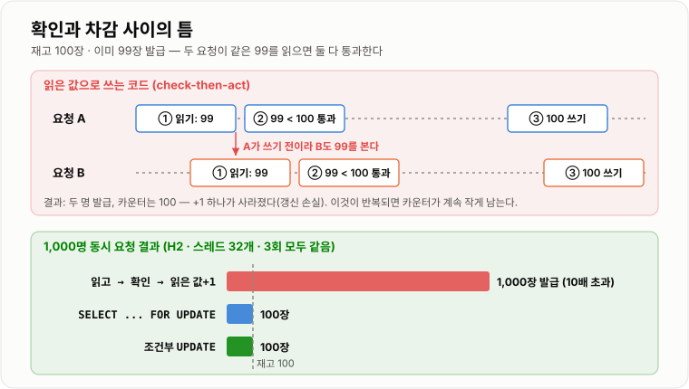
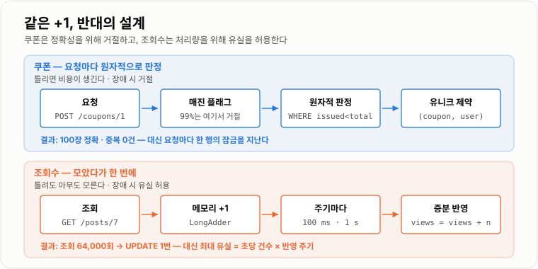

# 선착순 쿠폰 시스템

> **쿠폰과 조회수는 둘 다 "숫자 +1"인데 정반대로 설계한다. 쿠폰은 1장도 틀리면 안 돼서 확인과 차감을 한 번에 해야 하고 — 락 없이 읽고 쓰자 100장짜리 쿠폰이 1,000장 발급됐다 — 조회수는 조금 틀려도 되니 모아서 한 번에 쓴다. 64,000번의 UPDATE가 1번이 됐다.**

---

## 1. 핵심 요약

**선착순 쿠폰은 "정확한 수량 · 1인 1매 · 순간 폭주" 세 문제다. 수량은 확인과 차감을 원자적으로 묶어서(조건부 UPDATE · Redis 원자 연산), 1인 1매는 유니크 제약으로, 폭주는 DB에 닿기 전에 걸러서 푼다. 같은 +1이라도 오차를 허용하는 조회수는 정확성 대신 처리량을 고른다.**

### 한눈에 보기

* **수량이 넘치는 원인은 "확인하고 나서 행동하기"(check-then-act)다.** 재고 100장에 1,000명이 동시에 요청하는 실험에서, "발급 수를 읽고 → 100 미만이면 → 읽은 값 + 1로 UPDATE"하는 코드는 **3회 모두 1,000장 전부 발급**했다. 서로의 갱신을 덮어써 **카운터는 17~60에 머물렀기** 때문에 모두가 "아직 남았다"고 봤다.
* **조건부 UPDATE 한 줄로 끝난다.** `UPDATE ... SET issued = issued + 1 WHERE issued < total`은 3회 모두 **정확히 100장**, 36~40 ms였다. `SELECT ... FOR UPDATE`도 정확히 100장이었다.
* **둘의 차이는 락 안에서 무엇을 하느냐에서 벌어진다.** 확인과 차감 사이에 1 ms짜리 작업이 끼자 **`FOR UPDATE`는 250~259 ms**, **조건부 UPDATE는 66~72 ms**(약 3.6배)였다. 락을 쥔 채 일하면 모두가 그 뒤에 줄을 선다.
* **1인 1매는 조회로 막을 수 없다.** 200명이 5번씩 동시에 누르자 "받았는지 조회 → 없으면 삽입"은 **중복 207~684건**, `UNIQUE(coupon_id, user_id)`는 **0건**이었다.
* **조회수는 반대로 푼다.** 매번 `UPDATE views = views + 1`을 64,000번 하는 대신 메모리에 모아 100 ms마다 한 번 반영하자 **64,000번 → UPDATE 1번**이 됐다. 대가는 **반영 주기만큼의 유실**이다 — 초당 5,000건을 1초 주기로 모으면 장애 시 최대 5,000건이 사라진다.
* **Redis로 옮겨도 원칙은 같다 — 원자 연산을 쓴다.** 08 섹션의 실측에서 재고 차감을 분산 락으로 하면 1,750 ms, `DECR`로 하면 **96 ms**였다. 대신 Redis는 **AOF를 켜도 기본 fsync 정책(`everysec`)에서 장애 시 최대 1초치**를 잃을 수 있어(Redis 공식 문서), **발급 확정 기록은 DB에 남긴다.**
* **폭주의 대부분은 실패할 요청이다.** 1만 장에 100만 명이 몰리면 99만 명(99%)은 어차피 "매진"을 받는다. **그 99%를 DB에 닿기 전에 돌려보내는 것**이 트래픽 설계의 핵심이다.

> 이 노트의 DB 수치는 **H2 1.4.200 인메모리(기본 격리 수준 READ COMMITTED) · JDK 21.0.12.1 · 스레드 32개**에서 전략마다 3회 측정했다. 인메모리라 절대 시간은 실제 DB보다 짧으므로 **발급 수 · 중복 건수처럼 결정적인 지표를 중심으로** 읽는다. Redis는 이 환경에 없어 직접 재지 않았고, Redis 원자 연산의 수치는 **실제 Redis 7.4로 잰 [분산 락과 멱등성](../../08-캐시-Redis/분산락-멱등성/분산락-멱등성.md)** 의 값을 인용했다.

### 무엇을 해결하는가

#### 해결하려는 문제

가장 먼저 떠오르는 쿠폰 발급 코드다. `@Transactional`도 붙어 있다.

```java
@Transactional
public void issue(long couponId, long userId) {
    Coupon coupon = couponRepository.findById(couponId).orElseThrow();   // ① 읽는다
    if (coupon.getIssued() >= coupon.getTotal()) {                        // ② 확인한다
        throw new SoldOutException();
    }
    coupon.setIssued(coupon.getIssued() + 1);                            // ③ 읽은 값 + 1 로 쓴다
    issueRepository.save(new CouponIssue(couponId, userId));
}
```

**한 명씩 오면 완벽하게 동작한다.** 문제는 동시에 올 때다.

```text
재고 100, 이미 99장 발급

요청 A: ① issued=99 읽음 → ② 99 < 100 통과 ─────────────→ ③ issued=100 쓰기
요청 B:        ① issued=99 읽음 → ② 99 < 100 통과 ────────→ ③ issued=100 쓰기
                                                              ↑
                               두 명 모두 발급됐는데 카운터는 100 (한 번의 +1이 사라짐)
```

**`@Transactional`은 이것을 막지 않는다.** 트랜잭션은 "A의 작업이 전부 되거나 전부 안 되게" 할 뿐, **B가 A와 같은 옛 값을 읽는 것**은 기본 격리 수준에서 허용된다. MySQL 기본값인 REPEATABLE READ에서도 일반 `SELECT`는 스냅숏을 읽으므로 똑같다 → **[ACID와 격리 수준](../../07-트랜잭션-데이터접근/ACID-격리수준/ACID-격리수준.md)**

실측하면 상상보다 훨씬 나쁘다.

```text
재고 100장, 1,000명이 동시 요청, 스레드 32개

  읽고 → 확인 → 읽은 값+1 로 UPDATE   발급 1,000장 / 카운터 17    (1회차)
                                    발급 1,000장 / 카운터 60    (2회차)
                                    발급 1,000장 / 카운터 56    (3회차)
```

**카운터가 서로의 갱신을 덮어써 계속 작게 남으니, 1,000명 전원이 "아직 남았다"는 확인을 통과했다.** 초과 발급이 몇 장이 아니라 **10배**다.

#### 이 개념이 없을 때

"그럼 조회수도 같은 방식으로 정확하게 세면 되지 않나?" 여기서 요구사항이 갈린다.

| 시스템 | 핵심 문제 | 틀리면 | 그래서 고르는 것 |
| --- | --- | --- | --- |
| **조회수** | 쓰기량이 매우 많다 | 1,234,567회가 1,234,501회로 보인다 — 아무도 모른다 | **처리량**, 일부 지연·오차 허용 |
| **쿠폰** | 수량이 정확해야 한다 | 100장 한정이 101장 — 비용이 나가고 공지가 거짓이 된다 | **정확성**, 일부 요청 거절 허용 |

**같은 Redis, 같은 `+1`이라도 이 표의 오른쪽 칸이 설계를 정한다.** 조회수를 쿠폰처럼 만들면 인기 글 하나의 행 락에 모든 조회가 줄을 서고, 쿠폰을 조회수처럼 만들면 초과 발급이 난다. **이 노트는 두 설계를 나란히 놓고 그 차이가 어디서 오는지 본다.**

---

## 2. 동작 원리

### 핵심 구성 요소

| 용어 | 뜻 |
| --- | --- |
| **check-then-act** | 상태를 **확인한 뒤** 그 결과를 믿고 **행동**하는 패턴. 둘 사이에 남이 끼면 확인 결과가 거짓이 된다 |
| **갱신 손실**(lost update) | 두 요청이 같은 옛 값을 읽고 각자 +1을 써서 **한 번의 갱신이 사라지는** 현상 |
| **원자적 연산** | 확인과 변경이 **나눌 수 없는 한 단계**로 실행되는 연산. 중간에 아무도 끼어들 수 없다 |
| **조건부 UPDATE** | `WHERE`에 조건을 넣어, **DB가 행을 잠근 상태에서 조건을 다시 검사하고** 맞을 때만 바꾸는 UPDATE |
| **비관적 락** | `SELECT ... FOR UPDATE`로 읽는 순간 행을 잠가, 커밋할 때까지 다른 트랜잭션이 못 건드리게 하는 방식 |
| **유니크 제약** | 같은 값의 행이 두 번 들어가는 것을 **DB가 거부**하는 제약. 동시 삽입까지 막는다 |
| **Lua 스크립트** | Redis 안에서 여러 명령을 **한 번에 원자적으로** 실행하는 방법. 실행 중에는 다른 명령이 끼지 못한다 |
| **Write-Behind** | 쓰기를 메모리에 먼저 모아 두고 **나중에 한꺼번에** 저장소에 반영하는 방식 |
| **Hot Key** | 요청이 **한 키에 몰리는** 상태. 인기 글 하나 · 인기 쿠폰 하나 |
| **매진 플래그** | 재고가 0이 됐다는 사실을 앞단(메모리 · Redis)에 기록해, **뒤 요청을 DB까지 보내지 않고** 거절하는 표시 |

### 내부 동작 과정

#### 1) 수량이 넘치는 이유 — 확인과 차감 사이의 틈

check-then-act의 틈은 **"읽은 순간"과 "쓰는 순간" 사이**다. 그 틈에 들어온 요청은 모두 같은 옛 값을 본다.



*읽은 값으로 쓰면 1,000장이 나가고, 조건을 DB가 잠근 채 다시 검사하게 하면 정확히 100장이다.*

**서버 한 대의 메모리에서도 같다.** `int` 카운터로 확인 후 +1을 하면 스레드 200개, 요청 1만 건에서 **101장 · 100장 · 104장**(3회 중 2회 초과)이 나갔다. `AtomicInteger`의 CAS(Compare-And-Set, 기대값이 맞을 때만 바꾸는 원자 연산)로 바꾸면 3회 모두 100장이다.

**하지만 서버가 2대가 되는 순간 `AtomicInteger`는 쓸모가 없다.** 각 JVM이 자기 카운터를 따로 세기 때문이다. **공유 상태는 공유 저장소의 원자 연산으로** 옮겨야 한다. 선택지는 셋이다.

#### 2) 방법 A — 조건부 UPDATE (DB)

**확인을 애플리케이션이 아니라 DB에게 시킨다.**

```sql
UPDATE coupon
   SET issued = issued + 1
 WHERE id = ? AND issued < total;      -- 갱신된 행이 1이면 발급 성공, 0이면 매진
```

왜 이것이 안전한가.

```text
요청 A: UPDATE 시작 → 행 잠금 획득 → issued(99) < total(100) 참 → 100으로 변경 → 커밋 → 잠금 해제
요청 B: UPDATE 시작 → 행 잠금 대기 ········································→ 획득
                                                        → 최신 커밋 값 issued(100) < 100 거짓 → 0행
```

**UPDATE는 행을 잠근 뒤 최신 커밋 값으로 조건을 다시 평가한다.** "읽기"와 "쓰기" 사이에 틈이 없다. 애플리케이션은 **갱신 행 수(0 또는 1)** 만 보면 된다.

```text
재고 100장, 1,000명, 스레드 32개

  조건부 UPDATE   발급 100장 · 카운터 100   40 ms / 37 ms / 36 ms
```

#### 3) 방법 B — 비관적 락 (`SELECT ... FOR UPDATE`)

**확인 로직이 SQL 한 줄로 안 끝날 때** 쓴다. 예를 들어 "회원 등급 조회 → 등급별 한도 계산 → 발급"처럼 여러 단계를 거쳐야 하는 경우다.

```sql
BEGIN;
SELECT issued, total FROM coupon WHERE id = ? FOR UPDATE;    -- 여기서 잠근다
-- 애플리케이션에서 복잡한 확인
UPDATE coupon SET issued = ? WHERE id = ?;
INSERT INTO coupon_issue (...) VALUES (...);
COMMIT;                                                       -- 여기서 푼다
```

**정확성은 조건부 UPDATE와 같다.** 차이는 **잠금을 쥐고 있는 시간**이다. 잠금이 `SELECT`부터 `COMMIT`까지 이어지므로, 그 사이의 모든 작업이 **다른 모든 요청의 대기 시간**이 된다.

```text
                          틈에 끼는 작업 없음     틈에 1 ms 작업
  SELECT ... FOR UPDATE    53 / 45 / 28 ms       259 / 250 / 250 ms
  조건부 UPDATE             40 / 37 / 36 ms        72 /  71 /  66 ms    (1 ms 작업은 잠금 밖에서)
```

**1 ms짜리 작업 하나에 `FOR UPDATE`는 약 6배 느려지고 조건부 UPDATE는 2배에 그쳤다.** 조건부 UPDATE는 검증을 잠금 밖에서 끝내고 **잠금은 UPDATE 한 문장 동안만** 쥐기 때문이다. 락 방식 전반의 비교는 → **[낙관적 락 · 비관적 락](../../07-트랜잭션-데이터접근/낙관적-비관적-락/낙관적-비관적-락.md)**

#### 4) 방법 C — Redis 원자 연산

**DB가 초당 받을 수 있는 쓰기보다 요청이 훨씬 많을 때** 확인과 차감을 Redis로 옮긴다. Redis는 명령을 싱글 스레드로 하나씩 실행하므로 `INCR` · `DECR` · `SADD` 한 명령은 그 자체로 원자적이다.

**그런데 쿠폰은 명령 하나로 안 끝난다.** "이미 받았나?" + "남았나?" + "발급 기록"이 한 덩어리여야 한다. 명령을 따로 보내면 그 사이에 또 틈이 생긴다. **그래서 Lua 스크립트로 묶는다.**

```lua
-- KEYS[1] = coupon:{id}:users (발급받은 사용자 Set), ARGV[1] = userId, ARGV[2] = 총 수량
if redis.call('SISMEMBER', KEYS[1], ARGV[1]) == 1 then
    return -1                                         -- 이미 받았다
end
if redis.call('SCARD', KEYS[1]) >= tonumber(ARGV[2]) then
    return 0                                          -- 매진
end
redis.call('SADD', KEYS[1], ARGV[1])
return 1                                              -- 발급
```

**스크립트가 실행되는 동안 Redis는 다른 명령을 처리하지 않는다.** 그래서 세 명령 사이에 틈이 없고, Set 하나로 **수량과 1인 1매를 동시에** 판정한다.

**Redis로 옮기면 새 문제가 두 개 생긴다.**

* **Redis의 결과를 DB에 옮겨야 한다.** 사용자는 Redis에서 "발급 성공"을 받았지만 실제 쿠폰 행은 DB에 있어야 결제에서 쓸 수 있다. 보통 큐로 넘겨 비동기로 저장한다 → **[메시지 중복 · 재시도 · Outbox](../../11-메시징/메시지-중복-재시도-Outbox/메시지-중복-재시도-Outbox.md)**
* **Redis가 죽으면 발급 기록이 사라질 수 있다.** RDB 스냅숏만 쓰면 보통 수 분치를, AOF를 켜도 기본 `everysec`에서는 최대 1초치를 잃을 수 있다(Redis 공식 문서). 복제도 비동기라 장애 조치 순간 방금 쓴 값이 없는 복제본이 승격될 수 있다. **그래서 최종 방어선은 DB의 유니크 제약**이고, Redis 발급 수와 DB 발급 행 수를 주기적으로 **대사(對査, 두 기록을 맞춰 보기)** 한다.

#### 5) 1인 1매 — 조회가 아니라 제약으로

"이미 받았는지 조회하고, 없으면 삽입"도 check-then-act다.

```text
200명이 각자 5번씩 동시에 클릭 (요청 1,000건)

                               저장된 행    중복         유니크 제약이 거부한 삽입
  조회 → 없으면 삽입            884 / 407 / 458   684 / 207 / 258   -
  UNIQUE(coupon_id, user_id)   200 / 200 / 200     0 /   0 /   0   171 / 113 / 287
```

**조회는 "지금 없다"를 알려 줄 뿐 "삽입할 때도 없다"를 보장하지 않는다.** 유니크 제약은 **DB가 삽입 순간에** 검사하므로 동시에 들어와도 한 행만 남는다. 거부된 삽입은 예외로 받아 "이미 발급됨"으로 응답한다.

#### 6) 폭주 — DB에 닿기 전에 걸러 낸다

**선착순 이벤트의 트래픽은 대부분 실패할 요청이다.**

```text
쿠폰 10,000장, 오픈 순간 1,000,000명

  성공할 요청    10,000  (1%)
  실패할 요청   990,000  (99%)   ← 이 요청들이 DB 행 락 앞에 줄을 서면 성공할 1%도 늦어진다
```

**걸러 내는 층을 앞에 둔다.** 뒤로 갈수록 비싸다.

```text
요청 ─▶ ① 매진 플래그 확인 ─▶ ② 요청 제한 ─▶ ③ Redis 원자 연산 ─▶ ④ DB 기록 (비동기)
         (앱 메모리 · Redis)    (사용자 · IP당)   (수량 + 1인 1매)      (유니크 제약)
           │                     │                 │
           └─ 매진이면 즉시 거절   └─ 매크로 거절      └─ 0 · -1 이면 거절
```

* **① 매진 플래그** — 재고가 0이 되는 순간 한 번 기록한다. 그 뒤 99만 건은 Redis 조회 한 번 또는 앱 메모리 확인만으로 끝난다.
* **② 요청 제한** — 같은 사용자의 초당 수십 번 클릭(매크로)을 막는다.
* **대기열(Queue)을 쓸 수도 있다.** 요청을 큐에 넣고 컨슈머가 순서대로 발급하면 DB 부하가 컨슈머 속도로 고정된다. **대신 사용자는 결과를 바로 못 받는다.** 컨슈머가 초당 2,000건을 처리한다고 가정하면 1만 장은 5초면 끝나지만, **매진 뒤에도 큐에 남은 99만 건을 같은 속도로 꺼내면 495초**가 걸린다. 큐를 쓰더라도 매진 플래그로 **뒤 요청을 즉시 거절**해야 한다.

#### 7) 조회수는 반대로 — 모아서 한 번에

조회수에는 "틀리면 안 된다"는 요구가 없다. 대신 **쓰기량이 쿠폰보다 훨씬 많고 끝이 없다.** 그래서 정확성을 조금 내주고 처리량을 산다.

```text
[쿠폰처럼 하면]   조회 1회 = UPDATE 1회   → 인기 글 한 행의 락에 모든 조회가 줄을 선다
[조회수 방식]     조회 1회 = 메모리 +1    → 주기마다 합계를 UPDATE 1회
```

```text
조회 64,000회, 스레드 32개 (H2 인메모리)

  매번 UPDATE             110,100 회/s    237,804 회/s     UPDATE 64,000번
  메모리 누적 + 100 ms 반영  3,026,105 회/s  4,118,510 회/s   UPDATE 1번
```

**인메모리 H2라서 매번 UPDATE도 빠르게 나왔다는 점에 주의한다.** 디스크에 커밋하는 DB에서는 차이가 훨씬 크다 — 같은 섹션의 [대용량 처리 시스템](../대용량-처리-시스템/대용량-처리-시스템.md) 실측에서 **건마다 커밋하면 초당 197건**이었다.



*같은 +1이지만 쿠폰은 정확성을 위해 요청을 거절하고, 조회수는 처리량을 위해 유실을 허용한다.*

**대가는 유실이다.** 서버가 반영 전에 죽으면 모아 둔 값이 사라진다. **최대 유실량 = 초당 조회 수 × 반영 주기**다.

```text
초당 5,000회 조회일 때 장애 시 최대 유실
  반영 주기 0.1초 →    500 회
  반영 주기 1초   →  5,000 회
  반영 주기 5초   → 25,000 회
```

**면접에서 "조회수는 어느 정도 오차를 허용하는가?"라고 물으면 이 식으로 답한다.** "하루 1억 조회 중 장애 한 번에 수천 건이면 0.01% 미만이라 허용한다. 대신 광고 과금에 쓰는 노출 수라면 허용할 수 없으므로 쿠폰 쪽 설계로 간다."

**조회수에 남는 과제 둘.**

* **중복 조회** — 새로고침 연타를 1회로 셀지는 요구사항이다. 센다면 `SET view:{글}:{사용자} 1 NX EX 600`이 성공할 때만 +1 한다(10분 안의 재조회는 무시).
* **Hot Key** — 인기 글 하나에 조회가 몰리면 Redis 키 하나도 병목이 된다. `views:{글}:{0~9}`처럼 키를 여러 개로 쪼개 무작위로 +1 하고 읽을 때 합친다.

---

## 3. 특징과 비교

| 구분 | 내용 |
| ----------- | -- |
| **장점** | 조건부 UPDATE 한 줄과 유니크 제약 하나로 수량 초과와 중복 발급이 모두 0이 된다(실측 100장 정확, 중복 0건). 잠금을 UPDATE 한 문장 동안만 쥐어 `FOR UPDATE`보다 대기 시간이 짧다(1 ms 작업이 끼면 약 70 ms vs 250 ms). 앞단의 매진 플래그로 99%의 실패 요청을 DB에 닿기 전에 돌려보낸다. |
| **단점** | DB 방식은 모든 발급이 한 행의 잠금을 거치므로 초당 처리량이 그 행 하나에 묶인다. Redis로 옮기면 빨라지지만 DB와 두 곳에 기록하게 되어 비동기 반영·유실 대비·대사가 필요하다. 조회수 방식은 반영 주기만큼 유실을 감수한다. |
| **적합한 상황** | 수량이 정해진 자원(쿠폰 · 한정 판매 재고 · 좌석 · 응모권)을 짧은 시간에 여러 사람이 다투는 경우. 조회수 방식은 좋아요 · 조회수 · 노출 통계처럼 오차가 비즈니스에 영향을 주지 않는 카운터. |
| **주의할 상황** | 확인 로직이 SQL 한 줄로 표현되지 않으면 조건부 UPDATE를 쓸 수 없다. 조회수라도 과금·정산에 쓰이면 유실을 허용할 수 없다. 서버 한 대의 `synchronized` · `AtomicInteger`로 해결했다고 착각하기 쉽다 — 서버가 2대가 되면 무너진다. |

### 성능 특성

**재고 차감 전략** (재고 100장 · 1,000명 · 스레드 32개 · 3회)

| 전략 | 발급 수 | 카운터 | 소요 시간 | 틈에 1 ms 작업 시 |
| --- | --- | --- | --- | --- |
| 읽고 → 확인 → 읽은 값+1 | **1,000장** (10배 초과) | 17 · 60 · 56 | 88~335 ms | 1,000장, 87~91 ms |
| `SELECT ... FOR UPDATE` | **100장** | 100 | 28~53 ms | 100장, **250~259 ms** |
| 조건부 UPDATE | **100장** | 100 | 36~40 ms | 100장, **66~72 ms** |

**1인 1매** (200명 × 5회 동시 클릭)

| 방식 | 중복 발급 |
| --- | --- |
| 조회 후 없으면 삽입 | 684 · 207 · 258건 |
| `UNIQUE(coupon_id, user_id)` | **0 · 0 · 0건** |

**Redis 실측 인용** ([분산 락과 멱등성](../../08-캐시-Redis/분산락-멱등성/분산락-멱등성.md), Redis 7.4)

| 방식 | 결과 |
| --- | --- |
| 재고 차감 — 분산 락 | 1,750 ms (재시도 31,221회) |
| 재고 차감 — `DECR` 원자 연산 | **96 ms** |
| 카운터 2,000회 — 분산 락 vs `INCR` | 186 req/s vs **16,479 req/s (89배)** |

### 장점과 단점

**장점 — 정확성을 가장 싼 방법으로 얻는다.**
조건부 UPDATE는 새 인프라도, 락 라이브러리도 필요 없다. DB가 이미 가진 행 잠금을 **UPDATE 한 문장 동안만** 빌려 쓴다. 실측에서 1,000장 초과가 정확히 100장이 됐고, 틈에 작업이 끼어도 `FOR UPDATE`의 약 4분의 1 시간이었다.

**장점 — 실패를 빨리 돌려준다.**
선착순 이벤트에서 좋은 시스템은 성공을 빨리 주는 시스템이 아니라 **실패를 빨리 주는 시스템**이다. 99%가 실패할 요청이므로, 매진 플래그로 그들을 즉시 돌려보내면 성공할 1%의 경로가 비워진다.

**단점 — 한 행이 처리량의 천장이다.**
모든 발급이 `coupon` 행 하나의 잠금을 지나간다. 요청이 DB 한 대의 초당 쓰기를 넘으면 조건부 UPDATE도 줄을 선다. 그때 Redis로 옮기는데, **기록이 두 곳이 되는 순간 둘을 맞추는 일**이 새로 생긴다.

**단점 — 조회수 방식은 유실을 산식으로 받아들여야 한다.**
"조금 잃어도 된다"는 말은 모호하다. **초당 조회 수 × 반영 주기**로 최대 유실량을 숫자로 말하고, 그 숫자를 요구사항 담당자가 수용해야 한다.

### 어떤 상황에서 고르는가

```text
틀리면 비용이 생기는가? (수량 · 금액 · 권한)
├─ 아니오 → 조회수 방식
│   ├─ 메모리 · Redis 에 +1 → 주기마다 합계를 DB 반영
│   ├─ 최대 유실 = 초당 건수 × 반영 주기 → 수용 가능한가 확인
│   └─ 한 키에 몰리면 키를 쪼갠다 (views:{글}:{0~9})
└─ 예 → 쿠폰 방식
    ├─ 확인이 SQL 한 줄로 되는가?
    │   ├─ 예 → 조건부 UPDATE (1순위)
    │   └─ 아니오 → SELECT ... FOR UPDATE, 잠금 안의 작업을 최소로
    ├─ 요청이 DB 한 대의 쓰기 한계를 넘는가?
    │   └─ 예 → Redis Lua 로 판정 + DB 비동기 기록 + 유니크 제약 + 대사
    ├─ 1인 1매인가? → UNIQUE(coupon_id, user_id) — 어느 방식이든 필수
    └─ 요청 대부분이 실패할 요청인가? → 매진 플래그 · 요청 제한을 앞단에
```

### 비슷한 기술과 비교

**수량 제어 방식**

| 기준 | 조건부 UPDATE | `SELECT FOR UPDATE` | Redis Lua | 분산 락 | 대기열(Queue) |
| --------- | ---- | ---- | ---- | ---- | ---- |
| **동작 방식** | DB가 잠근 채 조건 재검사 | 읽을 때 잠가 커밋까지 유지 | Redis 안에서 여러 명령을 한 번에 | 임계 구역 전체를 외부 락으로 감쌈 | 요청을 줄 세워 하나씩 처리 |
| **정확성** | 정확 | 정확 | 정확 (Redis 유실 시 DB 제약이 방어) | 락 만료 시 깨질 수 있음 | 컨슈머가 하나면 정확 |
| **잠금 시간** | UPDATE 한 문장 | SELECT ~ COMMIT | 스크립트 실행 동안 | 락 획득 ~ 해제 | 없음 (순차) |
| **처리량** | DB 한 행이 한계 | 가장 낮음 | 가장 높음 | 낮음 (실측 `INCR`의 89분의 1) | 컨슈머 속도로 고정 |
| **선택 기준** | 확인이 SQL 한 줄로 될 때 | 확인 로직이 복잡할 때 | DB 쓰기 한계를 넘을 때 | 원자 연산으로 표현이 안 될 때만 | 즉시 응답이 필요 없을 때 |

**쿠폰과 조회수**

| 기준 | 선착순 쿠폰 | 조회수 |
| --------- | ---- | ---- |
| **데이터 성격** | 수량이 정해진 자원 | 끝이 없는 누적 카운터 |
| **틀렸을 때** | 비용 · 신뢰 손실 | 아무도 모름 |
| **쓰기 경로** | 요청마다 원자적 확인 + 차감 | 메모리 누적 → 주기적 일괄 반영 |
| **장애 시 선택** | 거절 (틀린 발급보다 낫다) | 유실 허용 (멈추는 것보다 낫다) |
| **병목** | 한 행 · 한 키의 잠금 | 한 키에 몰리는 쓰기 (Hot Key) |
| **Redis 의 역할** | 원자적 판정기 | 버퍼 |

---

## 4. 실무 주의사항

### 백엔드 실무 적용

#### Spring · Java

**조건부 UPDATE는 JPA에서 `@Modifying` 쿼리로 쓴다.** 엔티티를 읽어 `setIssued(+1)`하는 순간 check-then-act로 돌아간다.

```java
@Modifying(clearAutomatically = true)
@Query("UPDATE Coupon c SET c.issued = c.issued + 1 " +
       "WHERE c.id = :id AND c.issued < c.total")
int increaseIssued(@Param("id") Long id);     // 1 = 성공, 0 = 매진
```

`clearAutomatically = true`를 빼면 영속성 컨텍스트에 남은 옛 `Coupon` 객체가 이후 로직에서 잘못된 `issued` 값을 보여 준다.

**`@Transactional` 메서드 안의 `synchronized`는 초과 발급을 막지 못한다.** 트랜잭션 커밋은 메서드가 끝난 **뒤** 프록시가 하므로, 락이 풀린 순간과 커밋 사이에 다음 스레드가 들어와 **커밋 전의 옛 값**을 읽는다. 게다가 서버가 2대면 락 자체가 각자 따로다 → **[AOP · Proxy와 Transactional](../../05-Spring/AOP-Proxy-Transactional/AOP-Proxy-Transactional.md)**

**유니크 제약 위반은 예외로 받아 정상 응답으로 바꾼다.**

```java
try {
    issueRepository.saveAndFlush(new CouponIssue(couponId, userId));
} catch (DataIntegrityViolationException e) {
    throw new AlreadyIssuedException();          // 500 이 아니라 "이미 발급됨"
}
```

`save()`만 하면 INSERT가 커밋 시점까지 미뤄져 예외가 메서드 밖에서 터진다. **`saveAndFlush()`로 그 자리에서 제약을 검사**한다.

#### 데이터베이스 · 캐시

**발급 수 컬럼과 발급 행 수를 둘 다 두면 둘이 어긋날 수 있다.** 조건부 UPDATE와 INSERT를 **같은 트랜잭션**에 넣는다. 조건부 UPDATE는 성공했는데 INSERT가 유니크 위반으로 실패하면 트랜잭션을 롤백해 카운터도 되돌린다.

**Redis로 판정한다면 DB 유니크 제약을 절대 빼지 않는다.** Redis 장애·장애 조치로 발급 Set이 일부 사라지면 같은 사용자가 다시 통과한다. 그때 막아 주는 것은 DB뿐이다.

**Redis 발급 수와 DB 발급 행 수를 대사한다.** 이벤트 종료 후 한 번, 진행 중에는 주기적으로 `SCARD coupon:{id}:users`와 `SELECT COUNT(*) FROM coupon_issue WHERE coupon_id = ?`를 비교해 차이를 알람으로 보낸다.

**조회수 반영 배치는 증분(`views = views + ?`)으로 쓴다.** 절대값(`views = ?`)으로 쓰면 서버 여러 대가 각자의 합계로 서로를 덮어쓴다.

#### 동시성 · 분산 환경

**재시도는 중복을 만든다.** 클라이언트 타임아웃 후 재요청, 게이트웨이 재시도, 사용자 연타는 모두 같은 발급 요청을 두 번 보낸다. 유니크 제약이 있으면 두 번째가 "이미 발급됨"이 되어 안전하다 → **[분산 락과 멱등성](../../08-캐시-Redis/분산락-멱등성/분산락-멱등성.md)**

**"선착순"의 순서는 도착 순서가 아니라 처리 순서다.** 서버 여러 대 · 네트워크 지연 때문에 먼저 누른 사람이 먼저 처리된다는 보장이 없다. 공정성이 요구사항이면 대기열에 번호표를 발급하는 방식으로 가고, 그 대가(즉시 응답 불가)를 기획과 합의한다.

**매진 플래그는 "매진 → 판매 가능"으로 되돌아가는 경우를 설계한다.** 발급 취소로 재고가 다시 생기면 플래그를 지워야 하고, 로컬 메모리 플래그는 서버마다 지워야 한다. 되돌릴 일이 없다면 단방향으로 두는 편이 안전하다.

### 자주 하는 오해

| 잘못된 이해 | 올바른 이해 |
| ------ | ------ |
| `@Transactional`을 붙이면 초과 발급이 안 난다 | 트랜잭션은 옛 값을 같이 읽는 것을 막지 않는다. 실측 100장이 **1,000장** 발급됐다. |
| 초과 발급은 몇 장 정도다 | 갱신 손실로 카운터가 계속 작게 남아 **전원이 통과**할 수 있다(카운터 17~60). |
| `synchronized`나 `AtomicInteger`로 막으면 된다 | 한 JVM 안에서만 유효하다. 서버 2대면 각자 센다. `@Transactional`과 겹치면 커밋 전에 락이 풀린다. |
| 받았는지 먼저 조회하면 중복 발급을 막는다 | 조회도 check-then-act다. 실측 중복 207~684건. **유니크 제약**이어야 0건. |
| `FOR UPDATE`와 조건부 UPDATE는 같다 | 정확성은 같지만 잠금 시간이 다르다. 1 ms 작업이 끼면 250 ms vs 70 ms. |
| Redis로 옮기면 DB 제약은 필요 없다 | Redis는 기본 설정에서 장애 시 최대 1초치(AOF `everysec`)를 잃을 수 있고 복제가 비동기다. **DB 유니크 제약이 최종 방어선**이다. |
| 조회수도 정확하게 세야 한다 | 요구사항이 정한다. 대부분 반영 주기만큼의 유실(초당 5,000 × 1초 = 5,000건)을 허용하고 처리량을 산다. |
| 대기열을 쓰면 폭주가 해결된다 | 부하는 고정되지만 매진 뒤에 남은 요청도 같은 속도로 꺼낸다. **매진 플래그로 즉시 거절**해야 한다. |

---

## 5. 예제

### 테이블

```sql
CREATE TABLE coupon (
    id      BIGINT PRIMARY KEY,
    total   INT    NOT NULL,
    issued  INT    NOT NULL DEFAULT 0,
    CHECK (issued <= total)                      -- 마지막 안전장치
);

CREATE TABLE coupon_issue (
    id         BIGINT AUTO_INCREMENT PRIMARY KEY,
    coupon_id  BIGINT    NOT NULL,
    user_id    BIGINT    NOT NULL,
    issued_at  TIMESTAMP NOT NULL,
    UNIQUE (coupon_id, user_id)                  -- 1인 1매는 여기서 보장한다
);
```

### DB 방식 — 조건부 UPDATE + 유니크 제약

```java
@Service
public class CouponService {

    private final CouponRepository couponRepository;
    private final CouponIssueRepository issueRepository;
    private final SoldOutFlag soldOutFlag;

    public CouponService(CouponRepository couponRepository,
                         CouponIssueRepository issueRepository,
                         SoldOutFlag soldOutFlag) {
        this.couponRepository = couponRepository;
        this.issueRepository = issueRepository;
        this.soldOutFlag = soldOutFlag;
    }

    @Transactional
    public void issue(long couponId, long userId) {
        if (soldOutFlag.isSoldOut(couponId)) {           // ① DB 에 가기 전에 거절
            throw new SoldOutException();
        }
        if (couponRepository.increaseIssued(couponId) == 0) {   // ② 확인과 차감을 한 문장으로
            soldOutFlag.mark(couponId);
            throw new SoldOutException();
        }
        try {
            issueRepository.saveAndFlush(new CouponIssue(couponId, userId, Instant.now()));
        } catch (DataIntegrityViolationException e) {    // ③ 중복이면 ② 도 롤백된다
            throw new AlreadyIssuedException();
        }
    }
}
```

### Redis 방식 — Lua 스크립트로 판정

```java
@Component
public class RedisCouponIssuer {

    private static final DefaultRedisScript<Long> SCRIPT = new DefaultRedisScript<>(
            "if redis.call('SISMEMBER', KEYS[1], ARGV[1]) == 1 then return -1 end " +
            "if redis.call('SCARD', KEYS[1]) >= tonumber(ARGV[2]) then return 0 end " +
            "redis.call('SADD', KEYS[1], ARGV[1]) " +
            "return 1",
            Long.class);

    private final StringRedisTemplate redis;
    private final CouponIssueProducer producer;

    public RedisCouponIssuer(StringRedisTemplate redis, CouponIssueProducer producer) {
        this.redis = redis;
        this.producer = producer;
    }

    public IssueResult issue(long couponId, long userId, int total) {
        String key = "coupon:" + couponId + ":users";
        Long result = redis.execute(SCRIPT, Collections.singletonList(key),
                String.valueOf(userId), String.valueOf(total));

        if (result == -1L) {
            return IssueResult.ALREADY_ISSUED;
        }
        if (result == 0L) {
            return IssueResult.SOLD_OUT;
        }
        producer.send(couponId, userId);   // DB 기록은 컨슈머가 한다 (유니크 제약으로 중복 흡수)
        return IssueResult.ISSUED;
    }
}
```

### 조회수 — 메모리에 모아서 주기적으로 반영

```java
@Component
public class ViewCounter {

    private final ConcurrentHashMap<Long, LongAdder> pending = new ConcurrentHashMap<>();
    private final PostRepository postRepository;

    public ViewCounter(PostRepository postRepository) {
        this.postRepository = postRepository;
    }

    public void increase(long postId) {
        LongAdder adder = pending.get(postId);
        if (adder == null) {
            LongAdder created = new LongAdder();
            adder = pending.putIfAbsent(postId, created);
            if (adder == null) {
                adder = created;
            }
        }
        adder.increment();                                 // DB 에 가지 않는다
    }

    @Scheduled(fixedDelay = 1000)                          // 최대 유실 = 초당 조회 수 × 1초
    public void flush() {
        for (Map.Entry<Long, LongAdder> e : pending.entrySet()) {
            long n = e.getValue().sumThenReset();
            if (n > 0) {
                postRepository.addViews(e.getKey(), n);    // UPDATE post SET views = views + ? WHERE id = ?
            }
        }
    }
}
```

**서버 메모리에 모으면 서버마다 따로 모인다.** 그래도 문제가 없는 이유는 반영이 **증분**(`views + ?`)이기 때문이다. 각 서버가 자기 몫을 더하면 합이 맞는다.

---

## 6. 면접 정리

### 자주 나오는 질문

#### 기본 질문

1. **선착순 쿠폰에서 수량 초과 발급은 왜 생기는가?**

    * 핵심 키워드: check-then-act · 확인과 차감 사이의 틈 · 갱신 손실 · `@Transactional`로 안 막힘 · 실측 100장 → 1,000장

2. **수량을 정확히 지키려면 어떻게 하는가?**

    * 핵심 키워드: 조건부 UPDATE(`WHERE issued < total`) · 갱신 행 수로 판정 · 복잡하면 `FOR UPDATE` · 트래픽이 크면 Redis Lua

3. **한 사용자가 여러 번 받는 것은 어떻게 막는가?**

    * 핵심 키워드: 조회 후 삽입도 check-then-act · `UNIQUE(coupon_id, user_id)` · 실측 중복 207~684건 → 0건 · `saveAndFlush`로 즉시 검사

4. **조회수와 쿠폰은 같은 Redis를 써도 왜 설계가 다른가?**

    * 핵심 키워드: 오차 허용 여부 · 쿠폰은 원자적 판정기 · 조회수는 버퍼 · 장애 시 거절 vs 유실 허용

5. **조회수는 어느 정도 오차를 허용할 수 있는가?**

    * 핵심 키워드: 최대 유실 = 초당 건수 × 반영 주기 · 5,000/s × 1초 = 5,000건 · 비율로 환산해 합의 · 과금용이면 불허

#### 꼬리 질문

1. **`SELECT FOR UPDATE`와 조건부 UPDATE 중 무엇을 고르는가?**

    * 핵심 키워드: 정확성은 같음 · 잠금 시간 차이 · 1 ms 작업 시 250 ms vs 70 ms · 확인이 SQL 한 줄이면 조건부 UPDATE

2. **트래픽을 순차 처리하려고 Queue를 쓸 수 있는가?**

    * 핵심 키워드: 가능 · DB 부하가 컨슈머 속도로 고정 · 즉시 응답 불가 · 매진 뒤 남은 요청도 꺼내야 함 → 매진 플래그 필수

3. **Redis 장애 시 어떻게 복구하는가?**

    * 핵심 키워드: AOF `everysec` 최대 1초 유실 · 비동기 복제 · DB 유니크 제약이 최종 방어선 · Redis Set 수와 DB 행 수 대사 · DB 기준으로 Set 재구성

4. **서버 한 대에서 `synchronized`로 테스트했더니 정확했다. 운영에 써도 되는가?**

    * 핵심 키워드: JVM 안에서만 유효 · 서버 2대면 각자 셈 · `@Transactional`과 함께면 커밋 전에 락 해제 · 공유 저장소의 원자 연산으로

5. **요청의 99%가 실패할 요청이라면 무엇을 하는가?**

    * 핵심 키워드: 실패를 빨리 돌려주기 · 매진 플래그 · 사용자·IP당 요청 제한 · 성공할 1%의 경로를 비움

6. **인기 글 하나에 조회가 몰리면?**

    * 핵심 키워드: Hot Key · 한 행 락 · 키 쪼개기(`views:{글}:{0~9}`) · 읽을 때 합산 · 로컬 누적 후 증분 반영

### 30초 답변

> 선착순 쿠폰의 핵심은 수량을 읽고 확인한 뒤 쓰는 사이의 틈입니다. 실측해 보니 락 없이 읽은 값에 1을 더해 쓰면 100장이 1,000장 발급됐습니다. 그래서 `WHERE issued < total` 조건부 UPDATE로 확인과 차감을 한 문장에 묶고, 1인 1매는 조회가 아니라 유니크 제약으로 막습니다. 트래픽이 DB 한계를 넘으면 Redis Lua로 판정하되 DB 제약을 최종 방어선으로 남기고, 실패할 99%는 매진 플래그로 앞단에서 돌려보냅니다. 반대로 조회수는 오차를 허용하므로 메모리에 모아 주기적으로 반영하고, 반영 주기만큼의 유실을 받아들입니다.

### 핵심 키워드

`check-then-act` · `갱신 손실` · `원자적 연산` · `조건부 UPDATE` · `SELECT FOR UPDATE` · `유니크 제약` · `Redis Lua` · `매진 플래그` · `대사` · `Write-Behind` · `Hot Key` · `유실 허용 범위`

### 이어서 볼 주제

* **[주문 · 결제 시스템](../주문-결제-시스템/주문-결제-시스템.md)** — 쿠폰이 "한 DB 안의 정확성"이라면 결제는 **외부 시스템과의 정확성**이다. 조건부 UPDATE가 상태 전이로 확장된다.
* **[분산 락과 멱등성](../../08-캐시-Redis/분산락-멱등성/분산락-멱등성.md)** — Redis 원자 연산과 분산 락의 실측 비용, 락 만료로 상호 배제가 깨지는 과정.
* **[낙관적 락 · 비관적 락](../../07-트랜잭션-데이터접근/낙관적-비관적-락/낙관적-비관적-락.md)** — 경합률에 따라 락 방식의 우열이 뒤집히는 이유.
* **[실시간 처리 시스템](../실시간-처리-시스템/실시간-처리-시스템.md)** — 조회수 방식을 한 단계 더 밀면 랭킹 · 윈도우 집계 · 근사 집계가 된다.
