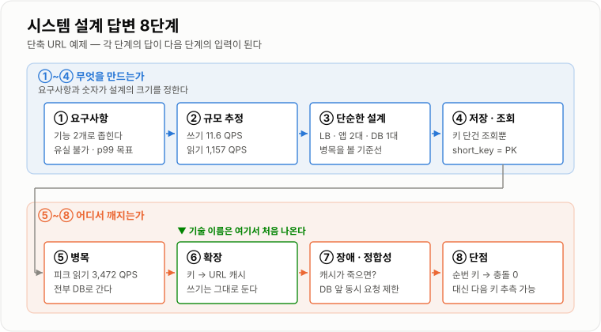
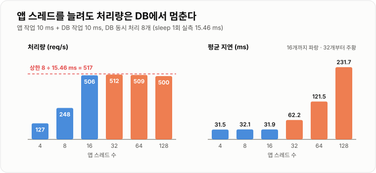
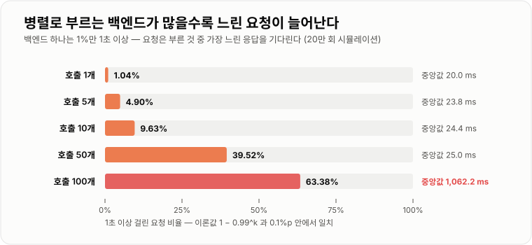

# 시스템 설계 답변법

> **시스템 설계 면접은 정답을 맞히는 시험이 아니라 선택의 근거를 순서대로 말하는 시험이다. 요구사항을 묻고 숫자를 먼저 잡으면 설계가 따라 나온다 — 하루 100만 건 쓰기는 평균 11.6 QPS라 DB 한 대로 충분하고, 그 100배인 읽기 1,157 QPS가 캐시를 부른다.**

---

## 1. 핵심 요약

**시스템 설계 답변은 "요구사항 → 규모 추정 → 가장 단순한 설계 → 저장·조회 구조 → 병목 → 확장 → 장애와 정합성 → 단점" 순서로 쌓는다. 앞 단계의 답이 뒤 단계의 선택을 정하므로, 순서를 건너뛰면 근거 없는 기술 나열이 된다.**

### 한눈에 보기

* **답변은 8단계다** — ① 요구사항 확인 ② 규모와 트래픽 ③ 가장 단순한 설계 ④ 저장·조회 구조 ⑤ 병목 ⑥ 확장 ⑦ 장애와 정합성 ⑧ 단점. **기술 이름은 ⑥에서야 처음 나온다.**
* **하루는 86,400초다.** 이 숫자 하나로 대부분의 추정이 끝난다. 하루 100만 건이면 평균 **11.6 QPS**(QPS = Queries Per Second, 초당 요청 수), 1억 건이면 **1,157 QPS**다.
* **평균 지연은 아무도 겪지 않는 숫자다.** 99%가 15~25 ms, 1%가 1초 이상인 요청 100만 건을 재 보면 **평균 30.7 ms · 중앙값 20.1 ms인데 p99.9는 1,178.8 ms**였다. 느린 1%는 평균에 묻힌다.
* **호출하는 곳이 많을수록 꼬리 지연이 증폭된다.** 1%가 느린 백엔드를 한 요청이 **10개** 병렬 호출하면 **9.63%**, **100개**면 **63.38%** 의 요청이 1초 이상 걸렸다. 100개일 때는 **중앙값조차 1,062 ms**였다.
* **처리량은 가장 느린 공유 자원이 정한다.** DB 동시 처리가 8개로 막힌 상태에서 앱 스레드를 16개 → 128개로 **8배** 늘려도 처리량은 **506 → 500 req/s**로 그대로였고, 평균 지연만 **31.9 → 231.7 ms(7.3배)** 로 늘었다.
* **가용성은 직렬로 곱해진다.** 99.9%짜리 구성 요소 3개를 직렬로 거치면 **99.70%**(연 26.25시간 중단)가 된다. 반대로 같은 것 2대를 **독립적으로** 이중화하면 **99.9999%**(연 0.53분)다.
* **모든 선택에는 대가가 있고, 그것을 먼저 말하는 쪽이 신뢰를 얻는다.** "캐시를 넣었다"로 끝내지 말고 "대신 최대 TTL만큼 옛 데이터를 보여 준다"까지 말한다.

> 이 노트의 수치는 **JDK 21.0.12.1 (Temurin) · Windows 11 · 6코어**에서 실행한 결과다. 추정 계산은 식을 그대로 코드로 돌린 값이고, 지연 분포는 시드를 고정한 난수로 100만 건을 만들어 계산했다. 병목 실험은 앱 작업과 DB 작업을 각각 `Thread.sleep(10)`으로 흉내 냈는데, **Windows 타이머 해상도 때문에 실제 한 번이 15.46 ms**였다 — 절대값보다 **처리량이 평평해지는 지점**을 본다.

### 무엇을 해결하는가

#### 해결하려는 문제

"단축 URL 서비스를 설계해 보세요"라는 질문에 흔히 나오는 답이다.

```text
✗ "Spring Boot 서버를 MSA로 나누고, Kafka로 이벤트를 주고받고,
   Redis 클러스터에 캐시하고, MySQL은 샤딩하겠습니다."
```

**틀린 기술은 하나도 없는데 설계로서는 0점에 가깝다.** 면접관이 바로 묻는다.

```text
면접관: 하루에 URL이 몇 개 만들어지나요?        → 모른다
면접관: 그럼 샤딩이 왜 필요하죠?                → 근거가 없다
면접관: Kafka로 무엇을 넘기나요?               → 넘길 것이 없다
면접관: 캐시가 틀린 URL을 돌려주면 어떻게 되나요? → 생각해 본 적 없다
```

**규모를 모르고 고른 기술은 과하거나 부족하다.** 하루 100만 건 쓰기는 **평균 11.6 QPS**로 MySQL 한 대가 여유 있게 받는 양이다. 여기에 샤딩을 넣으면 조인·트랜잭션·재분배라는 비용만 떠안는다.

#### 이 개념이 없을 때

순서 없이 답하면 같은 실수가 반복된다.

| 순서를 건너뛰면 | 생기는 일 |
| --- | --- |
| 요구사항을 안 묻는다 | "조회수"와 "쿠폰"을 같은 방식으로 설계한다 — 하나는 오차를 허용하고 하나는 1장도 틀리면 안 된다 |
| 숫자를 안 잡는다 | 11.6 QPS에 샤딩, 10만 QPS에 단일 DB — 둘 다 근거가 없다 |
| 단순한 설계를 건너뛴다 | 병목을 말할 기준선이 없어서 "어디가 느려서 캐시를 넣었는지"를 설명하지 못한다 |
| 단점을 안 말한다 | 면접관이 단점을 찾아내면 "그건 생각 못 했다"로 끝난다 |

**이 노트의 나머지는 그 8단계를 한 예제(단축 URL)로 끝까지 밟아 보는 것**이다. 같은 시험지를 다른 제약에 적용한 사례가 이 섹션의 나머지 노트 넷이다.

---

## 2. 동작 원리

### 핵심 구성 요소

| 용어 | 뜻 |
| --- | --- |
| **기능 요구사항** | 시스템이 **무엇을** 하는가. "URL을 넣으면 짧은 키를 준다", "키로 접속하면 원래 URL로 보낸다" |
| **비기능 요구사항** | **얼마나 잘** 하는가. 응답 시간 · 처리량 · 가용성 · 정합성 · 데이터 유실 허용 |
| **QPS** | 초당 요청 수. **평균 QPS = 하루 요청 수 ÷ 86,400** |
| **피크 계수** | 가장 붐비는 시간의 QPS가 평균의 몇 배인가. 서비스마다 다르므로 **묻거나 가정을 말로 밝힌다** |
| **p99**(99번째 백분위) | 요청을 지연 순으로 줄 세웠을 때 99% 지점의 값. "100명 중 가장 느린 1명이 겪는 지연" |
| **가용성** | 전체 시간 중 서비스가 정상인 비율. 99.9%는 연 8.76시간 중단을 허용한다 |
| **강한 정합성** | 쓰고 나면 **모든 읽기가 즉시** 새 값을 본다 |
| **최종 정합성** | 잠시 옛 값을 볼 수 있지만 **결국** 새 값으로 맞춰진다 |
| **RPO**(Recovery Point Objective) | 장애 시 **얼마만큼의 데이터**를 잃어도 되는가. "최근 1초치까지 유실 허용" |
| **RTO**(Recovery Time Objective) | 장애 후 **얼마 안에** 복구해야 하는가 |
| **병목** | 전체 처리량의 상한을 정하는 가장 좁은 구간 |
| **수직 확장 / 수평 확장** | 한 대를 더 좋게(scale-up) / 여러 대로 나눠서(scale-out) |

### 내부 동작 과정



*각 단계의 답이 다음 단계의 입력이다. 기술 이름은 병목을 확인한 ⑥에서야 처음 등장한다.*

#### ① 요구사항 확인 — 무엇을, 얼마나 잘

**기능 요구사항은 좁히고, 비기능 요구사항은 숫자로 받는다.** 면접은 45분 안팎이라 기능을 다 다룰 수 없다. 핵심 기능 두세 개로 범위를 합의하고 시작한다.

```text
기능 (범위를 좁힌다)
  ✓ 긴 URL → 짧은 키 발급
  ✓ 짧은 키 → 원래 URL로 리다이렉트
  ✗ 사용자 계정, 통계 대시보드, 커스텀 키   ← "이번엔 제외하겠습니다"라고 말한다

비기능 (숫자와 우선순위로 받는다)
  하루 신규 URL 몇 건?  읽기와 쓰기 비율은?  리다이렉트 응답 목표는?
  한 번 만든 URL이 사라져도 되는가?  잠시 옛 결과를 보여도 되는가?
```

**질문마다 그 답이 설계의 어느 선택을 바꾸는지 알고 물어야 한다.** 이유 없는 질문은 시간만 쓴다.

| 질문 | "예"라면 | "아니오"라면 |
| --- | --- | --- |
| 정확성이 가용성보다 중요한가? | 락 · 트랜잭션 · 강한 정합성, 장애 시 **거절** | 캐시 · 복제본 · 최종 정합성, 장애 시 **옛 값이라도 응답** |
| 데이터 유실을 허용하는가? | 메모리 누적 후 일괄 반영(Write-Behind) 가능 | 커밋 후 응답, 복제 확인 |
| 읽기가 쓰기보다 훨씬 많은가? | 캐시 · 읽기 복제본이 효과가 크다 | 쓰기 경로(배치 · 큐 · 파티셔닝)가 먼저다 |
| 결과를 응답에 바로 줘야 하는가? | 동기 처리 | 큐로 넘기고 나중에 처리 |
| 서버가 여러 대인가? | 공유 상태를 DB·Redis로 뺀다 | 로컬 메모리로 충분할 수 있다 |
| 일부가 죽어도 핵심 기능은 살아야 하는가? | 타임아웃 · 격리 · 폴백 설계 | 단순하게 둔다 |

#### ② 규모와 트래픽 — 숫자가 설계를 정한다

**단축 URL을 예로 끝까지 계산해 본다.** 가정은 면접관과 합의한 값이다.

```text
가정: 신규 URL 하루 100만 건, 읽기:쓰기 = 100:1, 행 1개 500 B, 5년 보관, 피크 = 평균의 3배

쓰기 평균    1,000,000 ÷ 86,400          =      11.6 QPS     (피크 34.7)
읽기 평균    100,000,000 ÷ 86,400        =   1,157.4 QPS     (피크 3,472.2)
5년 행 수    1,000,000 × 365 × 5         = 1,825,000,000 행
5년 저장량   1,825,000,000 × 500 B       =     912.5 GB
```

**이 숫자를 계산한 순간 결론 몇 개가 자동으로 나온다.**

* **쓰기 11.6 QPS(피크 34.7)는 DB 한 대로 충분하다.** 쓰기 때문에 DB를 나눌 이유가 없다.
* **읽기가 쓰기의 100배이고 피크 3,472 QPS다.** 같은 키를 반복해서 읽으므로 **캐시가 첫 번째 확장 수단**이 된다.
* **5년 912.5 GB는 한 대에 들어가지만 여유는 적다.** 샤딩은 "지금"이 아니라 "몇 년 뒤 검토"로 말하는 게 정확하다.

**키 길이도 숫자로 정한다.** 영문 대소문자 + 숫자(Base62)로 만든 키의 경우의 수다.

```text
6자리  62^6 =        56,800,235,584  (약 568억)
7자리  62^7 =     3,521,614,606,208  (약 3.5조)   ← 5년치 18.25억 개의 1,930배
```

**7자리로도 키를 무작위로 뽑으면 충돌이 난다.** n개를 N가지 중에서 무작위로 고를 때 기대 충돌 쌍의 수는 n² ÷ 2N이다(생일 문제).

```text
하루치 (100만 개)   : 1,000,000² ÷ (2 × 62^7)     =       0.1 쌍
5년치 (18.25억 개)  : 1,825,000,000² ÷ (2 × 62^7) =   472,883 쌍
```

**하루만 보면 "충돌은 거의 없다"고 답하게 되지만 5년 누적으로는 47만 쌍이다.** 그래서 무작위 키라면 삽입 시 유니크 제약으로 충돌을 잡고 다시 뽑아야 하고, 아예 **순번(DB 시퀀스)을 Base62로 인코딩**하면 충돌이 원천적으로 없다 — 대신 다음 키를 추측할 수 있다는 단점이 생긴다. **이것이 "숫자가 설계를 정한다"의 실제 모습이다.**

#### ③ 가장 단순한 설계 — 병목을 말할 기준선

**처음부터 완성형을 그리지 않는다.** 단순한 설계가 있어야 "어디가 먼저 터지는가"를 말할 수 있다.

```text
                    ┌──────────┐
 Client ──HTTP──▶   │   LB     │
                    └────┬─────┘
                ┌────────┴────────┐
          ┌─────▼─────┐     ┌─────▼─────┐
          │  App #1   │     │  App #2   │     ← 무상태(stateless). 아무 서버가 받아도 된다
          └─────┬─────┘     └─────┬─────┘
                └────────┬────────┘
                   ┌─────▼─────┐
                   │  MySQL    │               ← 쓰기 11.6 QPS 는 이것으로 충분하다
                   └───────────┘
```

**앱 서버를 처음부터 2대로 두는 이유는 성능이 아니라 가용성이다.** 1대면 배포할 때마다 서비스가 멈춘다. 앱 서버에 상태(세션, 로컬 카운터)를 두지 않아야 LB가 아무 서버로나 보낼 수 있다.

#### ④ 저장 구조와 조회 구조 — 접근 패턴에서 출발한다

**"어떤 DB를 쓸까"보다 "어떤 질의가 몇 번 오는가"를 먼저 쓴다.**

```text
접근 패턴                               빈도        필요한 것
─────────────────────────────────────────────────────────────────
short_key 로 원래 URL 찾기               1,157 QPS   키 단건 조회 → PK 조회 한 번
긴 URL 저장                              11.6 QPS    단건 INSERT, 키 유니크 보장
같은 긴 URL 을 다시 넣으면 같은 키?        (요구사항)  "예"라면 long_url 에도 유니크 인덱스
```

```sql
CREATE TABLE short_url (
    short_key  VARCHAR(7)    PRIMARY KEY,     -- 조회 경로의 유일한 키
    long_url   VARCHAR(2048) NOT NULL,
    created_at TIMESTAMP     NOT NULL,
    expires_at TIMESTAMP     NULL
);
```

**조회가 전부 키 단건 조회이고 조인이 없다.** 그래서 RDB든 키-값 저장소든 둘 다 가능하고, **선택 기준은 팀이 운영할 수 있는가**다. RDB로 시작해도 이 접근 패턴은 나중에 키 기준 샤딩으로 옮기기 쉽다.

#### ⑤ 병목 — 가장 느린 공유 자원을 찾는다

**병목은 추측하지 않고 "요청 하나가 줄을 서는 곳"을 따라가며 찾는다.** 전형적인 줄은 DB 커넥션, 한 행의 락, 외부 API, 인기 키 하나다.

**줄이 한 곳이면 다른 곳을 늘려도 소용이 없다.** 요청마다 앱 작업 한 번 + DB 작업 한 번을 하는데, DB는 동시에 8개만 받게 해 두고 앱 스레드 수만 늘려 봤다.

```text
앱 작업 sleep(10) + DB 작업 sleep(10), DB 동시 처리 8개 (sleep 1회 실측 15.46 ms)

앱 스레드     처리량        평균 지연     DB 대기 평균
    4       127 req/s      31.5 ms        0.0 ms
    8       248 req/s      32.1 ms        0.0 ms
   16       506 req/s      31.9 ms        0.1 ms
   32       512 req/s      62.2 ms       30.9 ms     ← 여기서부터 늘려도 처리량이 안 는다
   64       509 req/s     121.5 ms       90.2 ms
  128       500 req/s     231.7 ms      199.9 ms     ← 지연만 7.3배
```



*상한은 계산으로 먼저 나온다 — 8개 ÷ 15.46 ms = 517 req/s. 그 위로는 줄만 길어진다.*

**상한은 실험 전에 계산할 수 있었다.** DB가 동시에 8개를 받고 한 건에 15.46 ms 걸리면 초당 8 ÷ 0.01546 = **517건**이 끝이다. 실측 최대 512 req/s와 맞는다. **면접에서 "앱 서버를 늘리겠다"고 답하기 전에 이 계산을 한 줄 하면, 늘려야 할 곳이 앱이 아니라는 게 드러난다.**

#### ⑥ 확장 — 병목에 맞는 수단을 싼 것부터

**확장 수단은 비용이 싼 순서로 꺼낸다.** 뒤로 갈수록 효과가 크지만 되돌리기 어렵다.

```text
싸다 ────────────────────────────────────────────────────────▶ 비싸다
① 인덱스 · 쿼리 수정  ② 수직 확장  ③ 캐시  ④ 읽기 복제본  ⑤ 비동기 큐  ⑥ 샤딩
                                   │         │              │          │
                         옛 값 노출  복제 지연       순서·중복     조인·재분배 불가
```

단축 URL에 적용하면 이렇다.

* **읽기 1,157 QPS → 캐시.** 키 → URL은 한 번 만들면 거의 안 바뀌어서 캐시 적중률이 높고 옛 값 문제가 작다. 1년치 키의 20%(7,300만 개 × 500 B)만 올려도 **36.5 GB**라, 전부가 아니라 **자주 읽히는 키만** 둔다.
* **캐시가 비는 순간의 DB 읽기 → 읽기 복제본.** 대신 방금 만든 URL을 복제본에서 못 찾는 **복제 지연**이 생기므로, 생성 직후 조회는 원본으로 보낸다.
* **쓰기는 확장하지 않는다.** 11.6 QPS에 큐나 샤딩을 넣을 근거가 없다. **"필요 없어서 안 넣었다"도 설계의 일부**다.

#### ⑦ 장애와 정합성 — 무엇이 죽으면 무엇이 되는가

**구성 요소마다 "이게 죽으면?"을 한 번씩 묻는다.** 두 가지 산수를 알고 있으면 답이 구체적이 된다.

**첫째, 가용성은 직렬로 곱해지고 병렬로 보완된다.** (장애가 서로 독립이라는 가정)

```text
단일      99.9%                                      → 연  8.76 시간 중단
직렬 3개   99.9% × 99.9% × 99.9%        = 99.70%     → 연 26.25 시간
직렬 10개  0.999^10                     = 99.00%     → 연 87.21 시간
병렬 2대   1 − (0.001 × 0.001)          = 99.9999%   → 연  0.53 분
```

**요청 경로에 끼는 구성 요소 하나하나가 전체 가용성을 깎는다.** "Redis도 넣고 Kafka도 넣고"는 확장이 아니라 **실패 지점 추가**일 수 있다. 그리고 병렬 이중화의 효과는 **장애가 독립일 때만** 나온다 — 같은 랙, 같은 설정 실수, 같은 배포로 같이 죽으면 곱셈이 성립하지 않는다.

**둘째, 여러 곳을 부르면 가장 느린 곳을 기다린다.** 1%가 1초 이상 걸리는 백엔드를 한 요청이 여러 개 병렬로 부를 때다.

```text
호출 수      1초 이상 걸린 요청    이론값 1 − 0.99^k    중앙값
   1            1.04%              1.00%              20.0 ms
   5            4.90%              4.90%              23.8 ms
  10            9.63%              9.56%              24.4 ms
  50           39.52%             39.50%              25.0 ms
 100           63.38%             63.40%           1,062.2 ms   ← 중앙값까지 1초
```



*백엔드 하나의 p99는 "100번 중 1번"이지만, 100개를 부르는 요청에게는 "대부분의 경우"가 된다.*

**그래서 평균이 아니라 백분위로 말한다.** 같은 100만 건에서 평균은 30.7 ms였지만 p99.9는 1,178.8 ms였다. 목표도 "평균 50 ms"가 아니라 **"p99 200 ms"** 처럼 잡는다.

**단축 URL에 적용하면** — 캐시가 죽으면 DB로 직접 가는데, 1,157 QPS(피크 3,472)를 DB가 받을 수 있는지가 관건이다. 못 받는다면 **캐시 장애가 DB 장애로 번진다.** 대책은 DB 앞의 동시 요청 수 제한과, 캐시를 한 대가 아니라 복제 구성으로 두는 것이다.

#### ⑧ 단점 — 먼저 말한다

**선택마다 "무엇을 얻고 무엇을 잃었는가"를 한 문장으로 말한다.** 형식을 정해 두면 빠뜨리지 않는다.

```text
[선택] 을 해서 [얻은 것] 을 얻었고, 대신 [잃은 것] 을 감수했습니다.
[잃은 것] 이 문제가 되는 조건은 [조건] 이고, 그때는 [대안] 으로 바꿉니다.

예) 순번을 Base62 로 인코딩해서 키 충돌을 없앴고, 대신 다음 키를 추측할 수 있게 됐습니다.
    비공개 링크를 지원해야 하면 문제가 되므로, 그때는 무작위 키 + 유니크 제약 재시도로 바꿉니다.
```

---

## 3. 특징과 비교

| 구분 | 내용 |
| ----------- | -- |
| **장점** | 요구사항과 숫자에서 출발하므로 모든 선택에 근거가 붙는다. 하루 100만 건 → 11.6 QPS처럼 계산 한 줄이 "샤딩이 필요 없다"는 결론을 대신 말해 준다. 순서가 고정돼 있어 긴장해도 빠뜨리는 단계가 줄어든다. |
| **단점** | 요구사항 확인과 추정에 5~10분을 쓰면 본론 시간이 줄어든다. 가정한 숫자가 틀리면 뒤 설계가 전부 흔들린다. 틀에 맞추다 보면 면접관이 파고들고 싶은 지점을 놓칠 수 있다. |
| **적합한 상황** | "~시스템을 설계해 보세요"처럼 범위가 열린 질문, 규모에 따라 답이 갈리는 질문(캐시·샤딩·큐 도입 여부), 실제 업무에서 설계 문서를 쓸 때. |
| **주의할 상황** | 면접관이 특정 부분(동시성 제어, 결제 정합성)만 깊게 묻는 경우에는 8단계를 전부 밟지 말고 그 부분으로 바로 들어간다. 숫자를 주지 않는 면접관에게 수치를 계속 요구하면 대화가 막히므로, 그때는 가정을 말로 밝히고 진행한다. |

### 성능 특성

**추정 계산에 쓰는 기준 숫자**

| 식 | 값 | 쓰는 곳 |
| --- | --- | --- |
| 하루 | 86,400 초 | 모든 QPS 환산 |
| 하루 100만 건 | 평균 11.6 QPS | 쓰기 규모 판단 |
| 하루 1억 건 | 평균 1,157 QPS | 읽기 규모 판단 |
| 18.25억 행 × 500 B | 912.5 GB | 5년 저장량 |
| 62^7 | 약 3.5조 | 7자리 Base62 키 공간 |
| n² ÷ 2N | 5년치 무작위 키 47만 쌍 충돌 | 키 생성 방식 결정 |

**꼬리 지연 — 평균은 분포를 숨긴다** (99%는 15~25 ms, 1%는 1,000~1,200 ms, 100만 건)

| 지표 | 값 |
| --- | --- |
| 평균 | 30.7 ms |
| p50 | 20.1 ms |
| p90 | 24.1 ms |
| p99 | 25.0 ms (느린 1%가 경계에 걸려 아직 안 보인다) |
| **p99.9** | **1,178.8 ms** |

**가용성 — 허용 중단 시간**

| 가용성 | 연간 중단 | 30일 중단 |
| --- | --- | --- |
| 99% | 87.60 시간 | 432.0 분 |
| 99.9% | 8.76 시간 | 43.2 분 |
| 99.99% | 0.88 시간 (52.6 분) | 4.3 분 |

### 장점과 단점

**장점 — 숫자가 과설계를 막는다.**
쓰기 11.6 QPS라는 계산 한 줄이 "쓰기 확장은 필요 없다"를 증명한다. 반대로 읽기 3,472 QPS(피크)가 캐시 도입의 근거가 된다. 기술을 **넣는 이유**와 **안 넣는 이유**가 같은 계산에서 나온다.

**장점 — 단순한 설계가 병목 설명을 가능하게 한다.**
실측에서 앱 스레드를 8배 늘려도 처리량은 506 → 500 req/s였다. 단순한 그림이 있어야 "요청이 줄을 서는 곳은 DB 커넥션"이라고 짚을 수 있고, 그래야 확장 수단이 과녁을 맞힌다.

**단점 — 가정이 틀리면 전부 틀린다.**
피크 계수를 3배로 가정했는데 실제 이벤트 오픈 순간은 수십 배일 수 있다. 그래서 **가정은 반드시 말로 밝히고**, "피크가 10배라면 이 부분이 먼저 바뀐다"까지 덧붙인다. 가정을 숨기면 틀렸을 때 방어할 수 없다.

**단점 — 틀에 갇히면 대화가 끊긴다.**
면접은 문서 발표가 아니라 대화다. 면접관이 ④에서 "락은 어떻게 잡죠?"라고 물으면 ⑤~⑧을 미루고 거기로 간다. 순서는 **빠뜨리지 않기 위한 체크리스트**이지 대본이 아니다.

### 어떤 상황에서 고르는가

요구사항의 답이 설계의 큰 갈래를 정한다.

```text
틀리면 안 되는가? (금액 · 수량 · 권한)
├─ 예 → 강한 정합성
│       원자적 연산 · 조건부 UPDATE · 유니크 제약 · 트랜잭션
│       장애 시 "틀린 응답"보다 "거절"을 고른다
│       → 선착순 쿠폰 · 주문 결제
└─ 아니오 → 최종 정합성 허용
        캐시 · 복제본 · 메모리 누적 후 일괄 반영
        장애 시 "옛 값이라도 응답"을 고른다
        → 조회수 · 랭킹 · 피드

한 건이 비싼가, 건수가 많은가?
├─ 한 건의 정확성이 문제 → 락 · 멱등성 · 상태 전이      (쿠폰 · 결제)
└─ 총량이 문제            → 청크 · 커서 · 병렬 · 벌크     (대용량 처리)

지금 보여야 하는가?
├─ 예, 다 못 봐도 된다    → 근사 · 윈도우 · 푸시           (실시간 처리)
└─ 늦어도 다 처리해야 한다 → 배치 · 재실행 가능성           (대용량 처리)
```

### 비슷한 기술과 비교

**확장 수단 비교** — ⑥에서 무엇을 꺼낼지 고를 때

| 기준 | 수직 확장 | 캐시 | 읽기 복제본 | 비동기 큐 | 샤딩 |
| --------- | ---- | ---- | ---- | ---- | ---- |
| **동작 방식** | 한 대의 CPU·메모리를 키운다 | 자주 읽는 결과를 메모리에 둔다 | 원본의 복사본이 읽기를 나눠 받는다 | 지금 안 해도 되는 일을 뒤로 미룬다 | 데이터를 키 기준으로 여러 DB에 나눈다 |
| **푸는 병목** | 전부 (한계까지) | 반복 읽기 | 읽기 | 응답 경로의 느린 쓰기·외부 호출 | 쓰기 · 저장 용량 |
| **장점** | 코드 변경 없음 | 효과가 가장 크고 빠르다 | 애플리케이션 변경이 작다 | 응답 시간과 장애를 분리 | 쓰기와 용량의 사실상 무한 확장 |
| **단점** | 상한이 있고 한 대가 곧 실패 지점 | 옛 값 · 캐시 장애가 DB로 번짐 | 복제 지연으로 방금 쓴 값이 안 보임 | 순서 · 중복 · 유실 처리 필요 | 조인 · 트랜잭션 · 재분배가 어려움 |
| **선택 기준** | 가장 먼저, 한계가 보일 때까지 | 읽기 비율이 높고 옛 값을 허용 | 캐시 적중 밖의 읽기가 많을 때 | 결과가 응답에 필요 없을 때 | 한 대의 쓰기·용량을 넘을 때만 |

**강한 정합성과 최종 정합성**

| 기준 | 강한 정합성 | 최종 정합성 |
| --------- | ---- | ---- |
| **동작 방식** | 쓰기가 확정된 뒤에 응답, 모든 읽기가 새 값 | 먼저 응답하고 복제·반영은 나중에 |
| **장점** | 틀린 값을 보여 주지 않는다 | 빠르고, 일부가 죽어도 응답한다 |
| **단점** | 느리고, 장애 시 거절해야 한다 | 잠시 옛 값 · 순서 역전 |
| **선택 기준** | 금액 · 재고 · 권한 | 조회수 · 좋아요 · 피드 · 추천 |

네트워크가 끊겨 노드끼리 연락이 안 되는 순간(네트워크 분할)에는 **둘 중 하나를 골라야 한다.** 틀린 값을 주느니 거절하거나(정합성), 옛 값이라도 응답하거나(가용성)다. **이것이 CAP 정리가 실제로 말하는 선택이고, 분할이 없는 평상시에는 지연과 정합성 사이의 선택이 남는다.**

---

## 4. 실무 주의사항

### 백엔드 실무 적용

#### Spring · Java

**앱 서버는 무상태로 둔다.** 세션을 서버 메모리에 두면 LB가 같은 서버로만 보내야 하고(sticky session), 그 서버가 죽으면 로그인이 풀린다. 세션은 Redis 같은 공유 저장소로 뺀다 → **[쿠키 · 세션 · JWT](../../09-웹-보안/쿠키-세션-JWT/쿠키-세션-JWT.md)**

**외부 호출에는 반드시 타임아웃을 건다.** JDK `HttpURLConnection`의 연결·읽기 타임아웃 기본값은 **0, 즉 무한 대기**다. 상대가 응답하지 않으면 스레드가 영원히 붙잡히고, 스레드 풀이 마르면 **상대의 장애가 내 장애가 된다.**

```java
HttpURLConnection conn = (HttpURLConnection) new URL(url).openConnection();
conn.setConnectTimeout(1_000);   // 기본값 0 = 무한
conn.setReadTimeout(2_000);      // 기본값 0 = 무한
```

**스케줄러를 서버 대수만큼 중복 실행하지 않는다.** `@Scheduled`는 서버마다 돈다. 2대로 늘리는 순간 정산 배치가 두 번 실행된다. 한 대에서만 돌게 하거나(분산 락 · 전용 배치 서버) 작업 자체를 멱등하게 만든다.

#### 데이터베이스 · 캐시

**커넥션 풀 크기는 병목의 상한이다.** 실측처럼 DB 동시 처리가 8이면 앱 스레드를 아무리 늘려도 처리량은 그대로이고 대기열만 길어진다. 풀을 무작정 키우면 이번에는 DB가 동시 쿼리에 밀려 느려진다 → **[Connection Pool과 쿼리 튜닝](../../06-데이터베이스/ConnectionPool과-쿼리튜닝/ConnectionPool과-쿼리튜닝.md)**

**읽기 복제본을 도입하면 "방금 쓴 값"을 원본에서 읽는다.** 생성 직후 조회 화면이 복제본을 보면 "방금 만든 게 없다"는 문의가 들어온다.

**캐시 장애 시의 DB 부하를 계산해 둔다.** 평소 적중률 95%인 캐시가 죽으면 DB 부하는 **20배**가 된다(미스 5% → 100%). DB가 그것을 못 받으면 캐시 장애가 전체 장애가 된다 → **[캐시 전략과 정합성](../../08-캐시-Redis/캐시-전략-정합성/캐시-전략-정합성.md)**

#### 동시성 · 분산 환경

**서버가 2대가 되는 순간 로컬 메모리는 공유 상태가 아니다.** `synchronized`, `AtomicInteger`, 로컬 캐시는 전부 **그 JVM 안에서만** 유효하다. 재고·쿠폰 수량 같은 공유 상태는 DB나 Redis의 원자적 연산으로 옮긴다 → **[선착순 쿠폰 시스템](../선착순-쿠폰-시스템/선착순-쿠폰-시스템.md)**

**타임아웃은 호출 사슬 전체로 설계한다.** 사용자 요청 타임아웃이 3초인데 내부 호출 타임아웃이 5초면, 사용자는 이미 떠났는데 서버는 계속 일한다. **바깥 타임아웃 > 안쪽 타임아웃 합**이 되도록 잡는다.

### 자주 하는 오해

| 잘못된 이해 | 올바른 이해 |
| ------ | ------ |
| 좋은 기술을 많이 넣을수록 좋은 설계다 | 요청 경로의 구성 요소는 가용성을 곱으로 깎는다. 99.9% 3개 직렬이면 99.70%다. **필요 없어서 안 넣은 것도 설계다.** |
| 평균 응답 시간이 좋으면 괜찮다 | 평균 30.7 ms인 분포의 p99.9가 1,178.8 ms였다. **목표는 백분위로 잡는다.** |
| 서버를 늘리면 처리량이 는다 | 병목이 DB면 앱 스레드 8배에 처리량 506 → 500 req/s, 지연만 7.3배였다. |
| 백엔드 각각의 p99가 좋으면 전체도 좋다 | 10개를 병렬로 부르면 9.63%, 100개면 63.38%가 느리다. 호출 수만큼 꼬리가 증폭된다. |
| 이중화하면 가용성이 곱으로 오른다 | 장애가 **독립일 때만**이다. 같은 설정 실수·같은 배포로 같이 죽으면 효과가 없다. |
| 요구사항 확인은 시간 낭비다 | 조회수와 쿠폰은 둘 다 "숫자 +1"이지만 하나는 오차를 허용하고 하나는 1장도 틀리면 안 된다. 그 답 하나로 설계가 갈린다. |
| 추정은 정확해야 한다 | 자릿수만 맞으면 된다. 11.6 QPS와 12 QPS는 같은 결론이다. 대신 **가정은 말로 밝힌다.** |
| 단점은 숨기는 게 낫다 | 면접관이 먼저 찾으면 "생각 못 했다"가 되고, 내가 먼저 말하면 "트레이드오프를 안다"가 된다. |

---

## 5. 예제

### 추정 계산을 코드로 확인하기

```java
public class Estimate {

    public static void main(String[] args) {
        long writesPerDay = 1_000_000L;
        long readsPerDay = writesPerDay * 100;          // 읽기:쓰기 = 100:1
        double peak = 3.0;                              // 가정 — 말로 밝힌다

        System.out.printf("쓰기 %.1f QPS (피크 %.1f)%n",
                writesPerDay / 86_400.0, writesPerDay / 86_400.0 * peak);
        System.out.printf("읽기 %.1f QPS (피크 %.1f)%n",
                readsPerDay / 86_400.0, readsPerDay / 86_400.0 * peak);

        long rows = writesPerDay * 365 * 5;
        System.out.printf("5년 %,d 행, %.1f GB%n", rows, rows * 500 / 1e9);

        double keySpace = Math.pow(62, 7);
        System.out.printf("무작위 7자리 키 5년 기대 충돌 %,.0f 쌍%n",
                (double) rows * rows / (2 * keySpace));
    }
}
```

```text
쓰기 11.6 QPS (피크 34.7)
읽기 1157.4 QPS (피크 3472.2)
5년 1,825,000,000 행, 912.5 GB
무작위 7자리 키 5년 기대 충돌 472,883 쌍
```

### 병목 상한을 먼저 계산하기

```java
// 공유 자원의 동시 처리 수 ÷ 한 건 처리 시간 = 처리량 상한
int dbConcurrency = 8;
double dbMillis = 15.46;
double ceiling = dbConcurrency / (dbMillis / 1000.0);   // 517 req/s — 실측 최대 512 req/s
```

### 면접에서 말하는 순서 (단축 URL, 약 5분 분량)

```text
① "핵심 기능은 발급과 리다이렉트 두 개로 잡고, 통계는 제외하겠습니다.
    한 번 만든 URL은 사라지면 안 되고, 리다이렉트는 p99 100 ms 안이 목표라고 가정하겠습니다."
② "하루 100만 건이면 쓰기는 평균 11.6 QPS, 읽기는 100배라 1,157 QPS입니다.
    5년이면 18억 행, 약 900 GB입니다."
③ "앱 서버 2대와 MySQL 한 대로 시작합니다. 쓰기 11.6 QPS는 한 대로 충분합니다."
④ "조회는 전부 키 단건 조회라 short_key 를 PK로 둡니다."
⑤ "먼저 막히는 곳은 읽기입니다. 피크 3,472 QPS가 전부 DB로 갑니다."
⑥ "그래서 키→URL을 캐시에 둡니다. 거의 안 바뀌는 데이터라 옛 값 문제가 작습니다.
    쓰기는 확장하지 않습니다. 근거가 없습니다."
⑦ "캐시가 죽으면 DB가 피크를 그대로 받으므로, DB 앞에서 동시 요청 수를 제한합니다."
⑧ "키는 순번을 Base62로 인코딩해 충돌을 없앴고, 대신 다음 키를 추측할 수 있습니다.
    비공개 링크가 필요해지면 무작위 키 + 유니크 제약 재시도로 바꿉니다."
```

---

## 6. 면접 정리

### 자주 나오는 질문

#### 기본 질문

1. **시스템 설계 질문을 받으면 어떤 순서로 답하는가?**

    * 핵심 키워드: 요구사항 → 규모 추정 → 단순한 설계 → 저장·조회 구조 → 병목 → 확장 → 장애·정합성 → 단점 · 앞 단계 답이 뒤 선택을 정한다

2. **요구사항을 확인할 때 무엇을 묻는가?**

    * 핵심 키워드: 기능은 좁히고 비기능은 숫자로 · 정확성 vs 가용성 · 유실 허용 · 읽기·쓰기 비율 · 동기 필요 여부 · 부분 장애 시 동작

3. **트래픽 추정은 어떻게 하는가?**

    * 핵심 키워드: 하루 86,400초 · 100만 건/일 = 11.6 QPS · 피크 계수는 가정으로 밝힘 · 저장량 = 행 수 × 행 크기 · 자릿수만 맞으면 된다

4. **병목은 어떻게 찾는가?**

    * 핵심 키워드: 요청이 줄 서는 곳 · 가장 느린 공유 자원 · 상한 = 동시 처리 수 ÷ 처리 시간 · 실측 앱 8배에 처리량 그대로

5. **확장 방법은 어떤 순서로 고려하는가?**

    * 핵심 키워드: 인덱스·쿼리 → 수직 확장 → 캐시 → 읽기 복제본 → 비동기 큐 → 샤딩 · 뒤로 갈수록 되돌리기 어렵다 · 병목에 맞는 수단

#### 꼬리 질문

1. **평균 응답 시간 대신 p99를 보는 이유는?**

    * 핵심 키워드: 평균 30.7 ms · p99.9 1,178.8 ms · 느린 1%가 평균에 묻힘 · 호출 수만큼 꼬리 증폭(10개면 9.63%)

2. **구성 요소를 추가하면 가용성은 어떻게 되는가?**

    * 핵심 키워드: 직렬은 곱 · 99.9% 3개 = 99.70% · 병렬 이중화 99.9999% · 장애 독립 가정 · 같은 원인으로 같이 죽으면 무효

3. **정확성과 가용성 중 무엇을 고르는가?**

    * 핵심 키워드: 도메인이 정한다 · 금액·재고는 거절 · 조회수·피드는 옛 값 응답 · 네트워크 분할 시의 선택(CAP)

4. **서버를 여러 대로 늘리면 무엇이 깨지는가?**

    * 핵심 키워드: 로컬 메모리·`synchronized`는 JVM 안에서만 · 세션 · `@Scheduled` 중복 실행 · 공유 상태를 DB·Redis로

5. **가정한 숫자가 틀리면 어떻게 하는가?**

    * 핵심 키워드: 가정을 말로 밝힘 · "피크가 10배라면 여기가 먼저 바뀐다" · 자릿수가 바뀌는 지점에서 설계가 갈림

### 30초 답변

> 시스템 설계는 먼저 요구사항을 기능과 비기능으로 나눠 확인하고, 트래픽과 데이터 규모를 숫자로 잡습니다. 하루 100만 건이면 평균 11.6 QPS라서 DB 한 대로 충분하다는 식으로, 숫자가 어떤 기술이 필요하고 필요 없는지를 정해 줍니다. 그다음 가장 단순한 구조를 제시하고, 요청이 줄을 서는 병목을 찾아 그 병목에 맞는 확장 수단을 싼 것부터 적용합니다. 마지막으로 구성 요소가 죽었을 때 어떻게 동작하는지와, 제 선택이 무엇을 포기했는지를 먼저 말합니다.

### 핵심 키워드

`기능 요구사항` · `비기능 요구사항` · `QPS` · `피크 계수` · `p99` · `꼬리 지연` · `병목` · `수평 확장` · `가용성` · `강한 정합성` · `최종 정합성` · `RPO · RTO` · `트레이드오프`

### 이어서 볼 주제

* **[선착순 쿠폰 시스템](../선착순-쿠폰-시스템/선착순-쿠폰-시스템.md)** — "틀리면 안 되는가"에 **예**라고 답한 첫 사례. 같은 +1이 조회수와 어떻게 갈리는지.
* **[주문 · 결제 시스템](../주문-결제-시스템/주문-결제-시스템.md)** — 외부 시스템이 끼면 "결과를 모른다"는 세 번째 상태가 생긴다.
* **[장애 분석과 성능 개선](../../10-테스트-운영/장애분석-성능개선/장애분석-성능개선.md)** — 병목을 추측이 아니라 지표로 좁히는 순서와 이용률에 따른 대기 시간.
* **[캐시 전략과 정합성](../../08-캐시-Redis/캐시-전략-정합성/캐시-전략-정합성.md)** — ⑥에서 가장 먼저 꺼내는 확장 수단의 실제 비용.
