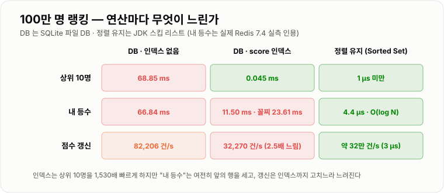
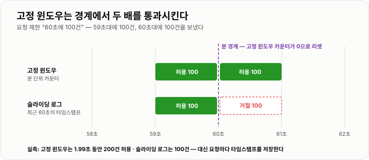
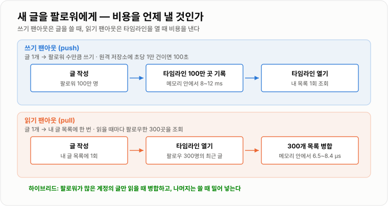

# 실시간 처리 시스템

> **대용량 배치가 "늦어도 되지만 다 처리해야" 하는 쪽이라면, 실시간은 "다 못 봐도 되지만 지금 보여야" 하는 쪽이다. 100만 명 랭킹에서 DB는 인덱스로 상위 10명을 0.045 ms에 줬지만 "내 등수"는 23.61 ms 동안 앞사람을 세야 했고, 정렬 상태를 유지하는 구조는 3 µs 갱신으로 둘 다 즉시 답했다. 순 방문자 100만 명은 HashSet 66.5 MB 대신 HyperLogLog 12 KB로, 오차 1% 안팎에 셀 수 있었다.**

---

## 1. 핵심 요약

**실시간 처리는 정확성이나 완전성을 조금 내주고 "지금"을 사는 설계다. 도구는 넷이다 — 정렬을 읽을 때가 아니라 쓸 때 유지하기(Sorted Set), 시간을 창으로 잘라 세기(윈도우), 전부 기억하지 않고 근사하기(HyperLogLog), 클라이언트가 묻기 전에 서버가 보내기(SSE · WebSocket). 그리고 그 비용을 쓸 때 낼지 읽을 때 낼지(팬아웃)를 정한다.**

### 한눈에 보기

* **실시간 랭킹을 DB로 하면 "상위 10명"보다 "내 등수"와 "점수 갱신"이 문제다.** 100만 행에 `score` 인덱스를 걸면 상위 10명은 **68.85 → 0.045 ms**로 빨라진다. 그러나 내 등수(`COUNT(*) WHERE score > 내 점수`)는 **평균 11.50 ms, 꼴찌는 23.61 ms**로 여전히 앞사람을 세야 했고, 점수 갱신은 인덱스까지 고치느라 **82,206 → 32,270 건/s(2.5배 느림)** 가 됐다.
* **정렬 상태를 유지하는 구조는 세 연산이 모두 빠르다.** 스킵 리스트에 100만 명을 넣자 점수 갱신이 **약 3 µs(단일 스레드 초당 약 32만 건)**, 상위 10명이 **1 µs 미만**이었다. 조회할 때마다 전체를 정렬하면 **78.1 ms**다. Redis Sorted Set의 `ZADD`는 O(log N)(Redis 문서)이고, 실제 Redis에서 내 등수(`ZRANK`)는 **4.4 µs**였다(08 섹션 실측).
* **고정 윈도우는 경계에서 두 배를 통과시킨다.** "60초에 100건" 제한에 59초대 100건 + 60초대 100건을 보내자 **1.99초 동안 200건이 허용**됐다. 최근 60초의 타임스탬프를 전부 들고 있는 슬라이딩 로그는 **100건만** 허용했다.
* **근사 윈도우는 트래픽이 고르지 않을 때 크게 틀린다.** 앞 창과 현재 창의 합을 경과 비율로 섞는 슬라이딩 윈도우 카운터를, 초당 2~5건에 가끔 30건씩 튀는 트래픽 1시간에 대봤다. 정확한 값 대비 **평균 오차 6.30%, 튄 직후 최대 56.00%** 였다.
* **늦게 오는 이벤트를 얼마나 기다리느냐가 지연과 정확도를 맞바꾼다.** 1분 창을 창이 끝나는 즉시 닫으면 이벤트의 **1.88%를 버렸고**, 30초 기다리면 0.97%, 5분 기다리면 **0%** 였다. 대신 결과가 그만큼 늦게 나온다.
* **HyperLogLog는 개수만 세고 원소를 기억하지 않는다.** 레지스터 16,384개 × 6비트 = **12,288바이트**로 고정이다. 직접 구현해 100만 개를 20번 세자 **평균 오차 0.79%, 최대 1.81%** 였다(Redis 문서의 표준 오차 0.81%). 같은 100만 개를 `HashSet<Long>`에 넣으면 **66.5 MB**다.
* **팔로워 100만 명에게 새 글을 보이는 비용은 쓸 때 내거나 읽을 때 낸다.** 타임라인 100만 곳에 쓰는 것은 메모리 안에서도 **8.2~12.2 ms**이고 원격 저장소에 초당 1만 건으로 쓰면 **100초**다. 반대로 읽을 때마다 팔로우 300명의 글을 병합하면 한 번에 300곳을 조회한다.
* **폴링은 대부분 빈 응답이다.** 클라이언트 1만 명이 2초마다 묻고 새 소식이 1분에 1건이면 **초당 5,000 요청 중 96.7%가 "새것 없음"** 이고 평균 **1.0초** 늦게 받는다. SSE는 연결 하나로 서버가 보내지만, **HTTP/2가 아니면 브라우저 · 도메인당 연결 6개**라는 제한이 있다(MDN).

> 이 노트의 수치는 **JDK 21.0.12.1 (Temurin) · Windows 11 · 6코어**와 **SQLite 3.50.4 파일 DB(100만 행)** 에서 측정했다. 스킵 리스트는 `ConcurrentSkipListSet`, HyperLogLog는 **Redis와 같은 레지스터 수(2^14)로 직접 구현**했고 Redis의 보정 방식과는 다르다. 윈도우 · 늦은 이벤트 · 폴링은 **시드 고정 난수로 만든 트래픽 모델**이다. Redis는 이 환경에 없어 직접 재지 않았고, Redis 수치는 **공식 문서와 [Redis 자료구조와 활용](../../08-캐시-Redis/Redis-자료구조/Redis-자료구조.md)의 실측(Redis 7.4)** 을 인용했다.

### 무엇을 해결하는가

#### 해결하려는 문제

게임 랭킹 화면이다. 점수가 바뀔 때마다 DB를 갱신하고, 화면은 3초마다 새로 불러온다.

```java
// 점수가 오를 때마다
jdbc.update("UPDATE score SET score = score + ? WHERE user_id = ?", delta, userId);

// 랭킹 화면 — 클라이언트가 3초마다 호출
List<Rank> top10 = jdbc.query("SELECT user_id, score FROM score ORDER BY score DESC LIMIT 10", ...);
long myRank = jdbc.queryForObject(
        "SELECT COUNT(*) + 1 FROM score WHERE score > (SELECT score FROM score WHERE user_id = ?)", ...);
```

**동시 접속 1만 명이 되면 세 곳이 동시에 막힌다.**

```text
① 상위 10명   인덱스 없으면 요청마다 100만 행 정렬 → 68.85 ms
② 내 등수     인덱스가 있어도 앞사람을 센다        → 평균 11.50 ms, 꼴찌 23.61 ms
               × 1만 명 ÷ 3초 = 초당 3,333번
③ 점수 갱신   인덱스를 걸면 갱신이 2.5배 느려진다   → ①을 고치면 ③이 나빠진다
④ 3초 폴링    화면을 연 1만 명이 초당 3,333번 묻는다 — 대부분 "변화 없음"
```

**"인덱스를 걸면 된다"는 ①만 푼다.** ②는 B-트리 인덱스가 "몇 번째인가"를 저장하지 않기 때문에 풀리지 않고, ③은 인덱스 때문에 오히려 나빠진다.

#### 이 개념이 없을 때

같은 데이터라도 목표가 "정확히 다"인지 "지금"인지에 따라 저장 구조가 달라진다.

| 기준 | 대용량 배치 | 실시간 처리 |
| --- | --- | --- |
| **목표** | 늦어도 **전부 정확히** | 다 못 봐도 **지금** |
| **읽는 시점에 하는 일** | 원본을 청크로 훑는다 | 이미 계산된 결과를 꺼낸다 |
| **정렬 · 집계는 언제** | 읽을 때 (배치가 돌 때) | **쓸 때** 미리 유지 |
| **틀려도 되는가** | 안 된다 | 근사 · 늦은 이벤트 누락을 허용한다 |
| **예** | 정산 · 월간 리포트 | 실시간 랭킹 · 최근 5분 인기글 · 동시 접속자 수 |

**실시간 시스템의 공통 원리는 "비용을 읽기에서 쓰기로 옮긴다"** 이다. 이 노트의 도구는 전부 그 변형이다.

---

## 2. 동작 원리

### 핵심 구성 요소

| 용어 | 뜻 |
| --- | --- |
| **Sorted Set** | Redis의 점수 순 정렬 집합. 원소마다 점수를 두고 **넣는 순간 정렬 위치를 유지**한다 |
| **스킵 리스트** | 정렬된 연결 리스트에 여러 층의 "건너뛰기 링크"를 둬서 탐색 · 삽입을 O(log N)에 하는 구조. Sorted Set의 내부 구조다 |
| **텀블링 윈도우** | 겹치지 않는 고정 구간. 0~1분, 1~2분 … |
| **슬라이딩 윈도우** | "지금부터 과거 N분"처럼 **시간과 함께 움직이는** 구간 |
| **버킷** | 시간을 잘게 나눈 칸(예: 1분). 윈도우 = 버킷 여러 개의 합 |
| **이벤트 시간 / 처리 시간** | 사건이 **실제로 일어난** 시각 / 서버에 **도착해 처리된** 시각. 모바일은 둘이 수 분 차이 날 수 있다 |
| **허용 지연**(allowed lateness) | 창이 끝난 뒤 늦은 이벤트를 **얼마나 더 기다렸다가** 창을 닫을지 |
| **HyperLogLog** | 원소를 저장하지 않고 **서로 다른 원소의 개수만** 고정 메모리로 근사하는 구조 |
| **쓰기 팬아웃 / 읽기 팬아웃** | 새 데이터를 **쓸 때** 받는 사람 모두에게 퍼뜨림 / **읽을 때** 보낸 사람 모두에게서 모음 |
| **폴링 · 롱 폴링** | 클라이언트가 주기적으로 물음 / 물은 뒤 새 소식이 생길 때까지 서버가 응답을 붙잡음 |
| **SSE**(Server-Sent Events) | HTTP 연결 하나를 열어 두고 **서버 → 클라이언트 한 방향**으로 이벤트를 흘려보내는 표준 |
| **WebSocket** | 연결 하나로 **양방향** 메시지를 주고받는 프로토콜 |

### 내부 동작 과정

#### 1) 실시간 랭킹 — 정렬을 읽을 때가 아니라 쓸 때 한다

**DB `ORDER BY`로 랭킹을 만들면 세 연산이 서로 발목을 잡는다.** 100만 행으로 쟀다.

```text
SQLite 100만 행 (user_id PK, score)

                          인덱스 없음                  score 인덱스
상위 10명                  68.85 ms  (전체 정렬)         0.045 ms  (인덱스 앞에서 10개)
내 등수 (무작위 사용자)     66.84 ms                    11.50 ms  (인덱스를 따라 앞사람 세기)
내 등수 (100등 사용자)          -                       0.043 ms
내 등수 (꼴찌)                  -                      23.61 ms
점수 갱신 (한 트랜잭션)     82,206 건/s                 32,270 건/s  (2.5배 느려짐)
점수 갱신 (건마다 커밋)          -                         193 건/s
```



*인덱스는 상위 10명만 해결한다. 내 등수는 앞사람 수에 비례하고, 갱신은 인덱스 때문에 느려진다.*

**"내 등수"가 인덱스로 안 풀리는 이유**는 B-트리 인덱스가 "이 값보다 큰 행이 몇 개인가"를 저장하지 않기 때문이다. 그래서 내 점수 위치까지 인덱스를 **세면서 걸어가야** 하고, 등수가 낮을수록 오래 걸린다(100등 0.043 ms vs 꼴찌 23.61 ms).

**Sorted Set은 이 문제를 구조로 푼다.** 내부 스킵 리스트의 각 링크가 **"이 링크가 건너뛰는 원소 수"(span)** 를 함께 저장하므로, 원소를 찾아 내려가는 동안 건너뛴 수를 더하면 곧 등수다. 그래서 `ZRANK`도 O(log N)이다.

```text
스킵 리스트 (점수 내림차순) — 링크 옆 숫자가 건너뛰는 원소 수(span)

L2:  HEAD ───────── 4 ─────────▶ [700] ───────── 4 ──────────▶ [300]
L1:  HEAD ── 2 ──▶ [900] ── 2 ──▶ [700] ── 2 ──▶ [500] ── 2 ──▶ [300]
L0:  HEAD ▶ [950] ▶ [900] ▶ [800] ▶ [700] ▶ [600] ▶ [500] ▶ [400] ▶ [300]

[500]의 등수: L2 로 700까지(4) → L1 로 500까지(2) → 4 + 2 = 6등
            앞의 원소를 하나씩 세지 않고 링크 두 개만 탔다
```

**점수를 바꾸는 것도 O(log N)** 이다(`ZADD` · `ZINCRBY`, Redis 문서). JDK의 스킵 리스트로 100만 명에 대해 재면 이렇다.

```text
ConcurrentSkipListSet, 100만 명 (단일 스레드)

  점수 갱신 (제거 + 삽입)     3.01 ~ 3.14 µs     초당 약 32만 건
  상위 10명 순회              0.02 ~ 0.40 µs
  비교: 조회마다 전체 정렬      78.1 ms
```

JDK의 스킵 리스트에는 span이 없어 등수 계산을 재지 않았다. 실제 Redis에서 `ZRANK`는 **4.4 µs**였다 → **[Redis 자료구조와 활용](../../08-캐시-Redis/Redis-자료구조/Redis-자료구조.md)**

**"실시간 랭킹을 DB `ORDER BY`로 하면 왜 안 되는가?"의 정확한 답은 이것이다.** 상위 10명은 인덱스로 되지만, **내 등수는 앞사람 수에 비례하고, 인덱스는 초당 수천 건의 점수 갱신을 느리게 한다.** 정렬을 쓰기 시점에 유지하는 Sorted Set으로 옮기고, DB는 최종 점수의 원본 보관소로 둔다.

#### 2) 시간 윈도우 — "최근 5분"은 버킷의 합이다

**"최근 5분 인기글"을 이벤트 로그에서 매번 세면** 5분치 이벤트를 전부 훑는다. 그래서 시간을 버킷으로 잘라 **버킷마다 미리 세어 둔다.**

```text
1분 버킷 카운터 (Redis 키 하나가 버킷 하나, TTL 로 자동 삭제)

  cnt:post:7:202609141001   INCR → 120
  cnt:post:7:202609141002   INCR →  95
  cnt:post:7:202609141003   INCR → 140
  cnt:post:7:202609141004   INCR →  80
  cnt:post:7:202609141005   INCR →  61   ← 지금 채워지는 중

  "최근 5분" = 5개 키 합 = 496
```

**윈도우는 두 종류다.**

* **텀블링 윈도우** — 10:00~10:05, 10:05~10:10처럼 **겹치지 않게** 자른다. "5분마다 집계해 저장"에 쓴다.
* **슬라이딩 윈도우** — 10:03에는 09:58~10:03, 10:04에는 09:59~10:04처럼 **지금을 따라 움직인다.** "최근 5분"은 이쪽이고, 버킷 합산으로 만들면 **버킷 크기(1분)만큼 계단식으로** 움직인다.

**"윈도우가 넘어가는 순간"이 문제가 되는 곳은 요청 제한이다.** 버킷 하나를 창으로 쓰는 고정 윈도우는 경계에서 카운터가 0이 된다.

```text
"60초에 100건" 제한, 59.00~59.99초에 100건 + 60.00~60.99초에 100건

  고정 윈도우 (분 단위 카운터)   허용 200건 / 1.99초    ← 경계에서 리셋되어 두 배 통과
  슬라이딩 로그 (최근 60초 기록)  허용 100건
```



*고정 윈도우가 막는 것은 "달력상 1분에 100건"이지 "아무 60초 동안 100건"이 아니다.*

**정확하게 하려면 비용이 든다.**

| 방식 | 정확도 | 메모리 (키 하나당) |
| --- | --- | --- |
| 고정 윈도우 | 경계에서 최대 2배 통과 | 카운터 1개 |
| 슬라이딩 로그 (Sorted Set에 타임스탬프) | 정확 | **요청마다 타임스탬프 1개** (제한 100이면 최대 100개) |
| 슬라이딩 윈도우 카운터 (앞 창 × 남은 비율 + 현재 창) | **근사** — 실측 평균 오차 6.30%, 튄 직후 최대 56.00% | 카운터 2개 |

**근사 방식은 "앞 창의 요청이 고르게 퍼져 있었다"고 가정한다.** 실측 트래픽처럼 몇 초에 요청이 몰리면 가정이 깨져 오차가 커진다. 정확해야 하는 과금성 제한은 슬라이딩 로그, 대략 막으면 되는 남용 방지는 근사 카운터를 쓴다.

#### 3) 늦게 오는 이벤트 — 창을 언제 닫는가

**스트림 집계에서 "10:00~10:01 창"은 이벤트 시간 기준이다.** 그런데 지하철에서 누른 좋아요는 10:00:30에 발생해 10:03에 도착한다. 창을 10:01에 닫았다면 이 이벤트는 들어갈 곳이 없다.

```text
1분 텀블링 윈도우, 이벤트 100만 건
지연 모델: 95% 평균 0.3초 · 4% 1~수 초 (재전송) · 1% 1~5분 (오프라인 후 전송)

허용 지연        버린 이벤트    결과가 나오는 시점
   0 초           1.88 %       창 끝 즉시
   5 초           1.15 %       창 끝 + 5초
  30 초           0.97 %       창 끝 + 30초
 120 초           0.63 %       창 끝 + 2분
 300 초           0.00 %       창 끝 + 5분
```

**허용 지연을 늘리면 정확해지고 늦어진다.** 0초 → 5초에서 누락이 0.73%p 줄었지만, 그다음 1%(오프라인 이벤트)를 잡으려면 5분을 기다려야 했다. "실시간"의 목표가 몇 초 안의 반영이라면 **그 1%는 스트림에서 포기하는 편이 맞다.**

**포기한 1%는 배치가 되찾는다.** 스트림은 몇 초 안에 근사값을 보여 주고, 새벽 배치가 원본 로그로 전날 집계를 다시 계산해 덮어쓴다. **이것이 스트림 처리와 배치 처리의 경계다** — 스트림은 지연을 줄이는 쪽, 배치는 정확도를 채우는 쪽 → **[대용량 처리 시스템](../대용량-처리-시스템/대용량-처리-시스템.md)**

#### 4) 근사 집계 — HyperLogLog

**"오늘 순 방문자 수"를 정확히 세려면 본 사람을 모두 기억해야 한다.** 방문자 100만 명의 ID를 `HashSet<Long>`에 넣으면 **66.5 MB**다. 페이지 1,000개 × 일 단위라면 감당이 안 된다.

**HyperLogLog는 "동전을 던져 앞면이 연속으로 k번 나왔다면 대략 2^k번 던졌을 것"이라는 원리를 쓴다.**

```text
① 원소를 64비트 해시로 바꾼다                     해시는 무작위 비트처럼 보인다
② 앞 14비트로 레지스터 번호를 고른다               2^14 = 16,384개 중 하나
③ 나머지 비트에서 처음 1이 나오기까지의 0의 개수 +1   "앞면 연속 횟수"
④ 그 레지스터에 지금까지 본 최대값만 남긴다          레지스터 하나 = 6비트 (최대 63)

개수 추정 = 16,384개 레지스터 값의 조화 평균으로 계산
같은 원소는 같은 해시 → 같은 레지스터 · 같은 값 → 여러 번 넣어도 결과가 같다 (중복 자동 제거)
```

```text
직접 구현 (레지스터 2^14 · 6비트 = 12,288 바이트 고정)

실제 개수         시행   평균 |오차|   최대 |오차|
     1,000         20      0.34 %       0.73 %
   100,000         20      0.68 %       1.66 %
 1,000,000         20      0.79 %       1.81 %
10,000,000          5      0.47 %       0.79 %
이론 표준 오차 1.04 ÷ √16,384 = 0.81 %   (Redis 문서도 0.81%, 최대 12 KB)
```

**메모리가 개수와 무관하게 12 KB로 고정이고, 100만 개에서 HashSet보다 약 5,400배 작다.** 대가는 둘이다.

* **오차가 있다.** 표준 오차가 0.81%라는 것은 "대체로 1% 안팎, 가끔 2% 가까이"라는 뜻이다. 실측 최대 1.81%.
* **원소를 꺼낼 수 없다.** "이 사용자가 오늘 왔는가?"에는 답하지 못한다. 개수만 안다.

**그래서 쓸 곳이 분명하다.** 대시보드의 일일 순 방문자 · 검색어별 고유 사용자 수처럼 **대략의 크기가 필요한 지표**에 쓴다. 이벤트 중복 참여 방지 · 과금 기준 사용자 수처럼 **개별 확인이나 정확한 값이 필요한 곳**에는 쓰지 않는다. 여러 날의 HyperLogLog를 합치면(`PFMERGE`) 주간 순 방문자도 같은 12 KB로 구한다.

#### 5) 피드 팬아웃 — 팔로워 100만 명에게 새 글을

**"팔로우한 사람들의 최신 글"을 보여 주는 방법은 비용을 낼 시점만 다른 두 가지다.**

```text
[쓰기 팬아웃 (push)]  글을 쓸 때 팔로워 전원의 타임라인에 글 ID 를 넣는다
  쓰기 비용 = 팔로워 수      읽기 비용 = 내 타임라인 한 번

[읽기 팬아웃 (pull)]  타임라인을 열 때 팔로우한 사람들의 글을 모아 병합한다
  쓰기 비용 = 1              읽기 비용 = 팔로우 수만큼 조회 + 병합
```



*대부분의 사용자는 쓰기 팬아웃이 싸고, 팔로워가 수십만 명인 계정 하나가 그 방식을 무너뜨린다.*

```text
타임라인 100만 곳에 글 ID 하나씩 넣기 (메모리, 네트워크 없음)   8.2 ~ 12.2 ms
같은 100만 건을 원격 저장소에 초당 1만 건으로 쓰면              100 초
팔로우 300명의 최근 글 20개씩을 병합해 상위 20개 (메모리)        6.5 ~ 8.4 µs / 회
```

**보통 사용자(팔로워 수백 명)에게는 쓰기 팬아웃이 압도적으로 좋다.** 읽기가 쓰기보다 훨씬 많고, 쓸 때 수백 건은 금방 끝나기 때문이다. **문제는 팔로워 100만 명인 계정**이다. 글 하나에 100만 건을 쓰는 동안 뒤의 글들이 줄을 서고, 팔로워들은 수십 초 늦게 본다.

**그래서 하이브리드로 간다.** 팔로워가 기준(예: 1만 명)을 넘는 계정의 글은 팬아웃하지 않고, 타임라인을 열 때 **"내 타임라인(쓰기 팬아웃 결과) + 내가 팔로우한 대형 계정 몇 개의 최근 글"** 을 병합한다. 대형 계정은 수가 적어 읽기 병합 비용이 작다.

#### 6) 서버에서 클라이언트로 — 누가 먼저 말하는가

**데이터가 서버에서 바로 갱신돼도 클라이언트가 모르면 실시간이 아니다.**

```text
클라이언트 1만 명, 새 소식은 클라이언트당 1분에 1건

폴링 주기     요청 수        빈 응답 비율    평균 지연 (최대)
   1 초     10,000 /s        98.3 %        0.5 초 (1초)
   2 초      5,000 /s        96.7 %        1.0 초 (2초)    ← 시뮬레이션 1.001초
   5 초      2,000 /s        91.7 %        2.5 초 (5초)
```

**폴링은 지연을 줄이려면 요청이 늘고, 요청을 줄이려면 지연이 는다.** 새 소식이 드물수록 대부분의 요청은 "변화 없음"을 받으러 온 것이다.

| 방식 | 동작 | 적합한 곳 |
| --- | --- | --- |
| **폴링** | 주기마다 묻는다 | 몇 초 늦어도 되고 구현을 가장 단순하게 할 때 |
| **롱 폴링** | 묻고, 새 소식이 생길 때까지 서버가 응답을 미룬다 | SSE · WebSocket을 못 쓰는 환경 |
| **SSE** | HTTP 연결 하나로 서버가 계속 보낸다. 끊기면 브라우저가 다시 연결한다 | 알림 · 랭킹 · 주가처럼 **서버 → 클라이언트 한 방향** |
| **WebSocket** | 연결 하나로 양쪽이 아무 때나 보낸다 | 채팅 · 협업 편집 · 게임처럼 **양방향이 잦을 때** |

**SSE는 HTTP/2 여부를 확인한다.** HTTP/2가 아니면 브라우저가 **도메인당 연결을 6개로 제한**해, 탭을 여러 개 연 사용자가 7번째 탭부터 연결을 못 연다. HTTP/2에서는 동시 스트림 수를 서버와 협상하며 기본 100개다(MDN).

**서버가 여러 대면 "그 사용자의 연결이 어느 서버에 붙어 있는가"가 새 문제가 된다.** 랭킹이 바뀐 이벤트는 서버 A에서 생겼는데 사용자의 SSE 연결은 서버 B에 있을 수 있다. 그래서 이벤트를 **모든 서버에 브로드캐스트**(Redis Pub/Sub · 메시지 브로커)하고 각 서버가 자기 연결에만 보낸다 → **[동기 · 비동기와 메시지 큐](../../11-메시징/동기-비동기와-메시지큐/동기-비동기와-메시지큐.md)**

#### 7) Hot Key — 한 키에 몰릴 때

**실시간 시스템은 관심이 한곳에 쏠린다.** 라이브 방송 하나의 시청자 수, 속보 기사 하나의 조회수, 전체 랭킹 키 하나. Redis는 명령을 싱글 스레드로 처리하므로 **한 키에 초당 수십만 번이 몰리면 그 키가 서버 전체를 붙잡는다.**

* **읽기가 몰리면** — 애플리케이션 로컬 메모리에 1초짜리 짧은 캐시를 둔다. 서버 20대가 각자 1초에 한 번만 Redis를 읽으면 초당 20번이다.
* **쓰기가 몰리면** — 키를 쪼갠다. `viewers:live:9:{0~9}`에 무작위로 +1 하고 읽을 때 10개를 합친다.
* **큰 Sorted Set 하나가 무거우면** — 기간으로 나눈다. `rank:2026-09-14`처럼 일 단위 키를 만들고 TTL로 지운다. 주간 랭킹은 `ZUNIONSTORE`로 합친다.

---

## 3. 특징과 비교

| 구분 | 내용 |
| ----------- | -- |
| **장점** | 정렬 · 집계를 쓸 때 유지해 읽기가 즉시 끝난다(갱신 3 µs · 상위 10명 1 µs 미만 vs 조회마다 정렬 78.1 ms). HyperLogLog는 100만 명을 12 KB 고정 메모리로 오차 1% 안팎에 센다(HashSet 66.5 MB). 서버 푸시는 폴링의 빈 응답(96.7%)을 없앤다. |
| **단점** | 정확성을 내준다 — 늦은 이벤트 누락(0초 대기 시 1.88%), 근사 윈도우 오차(평균 6.30%), HyperLogLog 오차(최대 1.81%). 결과가 Redis 같은 메모리 저장소에 있어 장애 시 원본에서 다시 만들어야 한다. 서버 여러 대의 연결 관리 · 브로드캐스트라는 운영 부담이 생긴다. |
| **적합한 상황** | 실시간 랭킹 · 최근 N분 인기 목록 · 동시 접속자 · 순 방문자 대시보드 · 알림 · 피드처럼 **지금 보이는 것이 정확한 것보다 중요한** 기능. |
| **주의할 상황** | 과금 · 정산 · 보상 지급처럼 정확해야 하는 값을 실시간 근사값으로 확정하면 안 된다 — 배치로 원본에서 다시 계산한다. 고정 윈도우 요청 제한은 경계에서 2배를 통과시키므로 엄격한 제한에 쓰지 않는다. |

### 성능 특성

**랭킹** (100만 명)

| 연산 | DB · 인덱스 없음 | DB · score 인덱스 | 정렬 유지 |
| --- | --- | --- | --- |
| 상위 10명 | 68.85 ms | **0.045 ms** | 0.02~0.40 µs |
| 내 등수 | 66.84 ms | 11.50 ms (꼴찌 23.61 ms) | Redis `ZRANK` **4.4 µs** |
| 점수 갱신 | 82,206 건/s | 32,270 건/s | 약 32만 건/s |

**근사 집계**

| 방식 | 메모리 (100만 개) | 오차 |
| --- | --- | --- |
| `HashSet<Long>` | 66.5 MB | 0 |
| HyperLogLog (2^14 레지스터) | **12,288 B** | 평균 0.79% · 최대 1.81% |

**늦은 이벤트** (1분 윈도우)

| 허용 지연 | 0초 | 5초 | 30초 | 120초 | 300초 |
| --- | --- | --- | --- | --- | --- |
| 버린 이벤트 | 1.88% | 1.15% | 0.97% | 0.63% | 0.00% |

### 장점과 단점

**장점 — 읽기가 데이터 크기와 무관해진다.**
조회마다 정렬하면 사용자가 늘수록 모든 조회가 느려진다. Sorted Set은 갱신마다 O(log N)을 내고, 대신 상위 N명 · 내 등수를 거의 상수 시간에 준다. 실시간 서비스는 읽기가 쓰기보다 많으므로 이 교환이 이득이다.

**장점 — 메모리를 개수와 분리한다.**
HyperLogLog 12 KB는 방문자가 1,000명이든 1,000만 명이든 같다. 페이지 · 기간마다 하나씩 만들어도 부담이 없다.

**단점 — 원본이 아니라 파생 데이터다.**
Redis의 랭킹과 카운터는 DB 원본에서 파생된 값이다. Redis가 장애로 데이터를 잃으면 **원본에서 다시 만들어야** 하고, 그동안 랭킹이 비어 보인다. 재구축 절차를 미리 만들어 둔다.

**단점 — "얼마나 틀려도 되는가"를 수치로 합의해야 한다.**
허용 지연 5초면 1.15%를 버리고, HyperLogLog는 최대 2% 가까이 틀린다. 이 숫자를 기획과 합의하지 않으면 "대시보드 숫자가 정산과 다르다"는 문의로 돌아온다.

### 어떤 상황에서 고르는가

```text
무엇을 실시간으로 보여 주는가?
│
├─ 순위 (상위 N · 내 등수)
│   └─ Sorted Set (ZINCRBY · ZREVRANGE · ZREVRANK) — 기간별 키 + TTL, DB 는 원본 보관
│
├─ 최근 N분의 개수 · 인기 목록
│   ├─ 대략이면 됨      → 분 버킷 카운터 합산 (계단식 슬라이딩)
│   ├─ 요청 제한 · 엄격  → 슬라이딩 로그 (Sorted Set 타임스탬프)
│   └─ 늦은 이벤트가 많다 → 허용 지연을 정하고, 놓친 것은 배치로 보정
│
├─ 고유한 사람 수
│   ├─ 대략의 크기면 됨   → HyperLogLog (12 KB, 오차 ~1%)
│   └─ 개별 확인 · 과금   → Set 또는 DB (정확, 메모리 비례)
│
├─ 피드
│   └─ 팔로워 수 < 기준 → 쓰기 팬아웃 / 기준 이상 → 읽기 때 병합 (하이브리드)
│
└─ 클라이언트에 전달
    ├─ 몇 초 늦어도 됨 · 단순하게  → 폴링
    ├─ 서버 → 클라이언트 한 방향   → SSE (HTTP/2 확인)
    └─ 양방향이 잦음               → WebSocket
```

### 비슷한 기술과 비교

**서버 → 클라이언트 전달 방식**

| 기준 | 폴링 | 롱 폴링 | SSE | WebSocket |
| --------- | ---- | ---- | ---- | ---- |
| **방향** | 클라이언트가 묻는다 | 클라이언트가 묻고 서버가 미룬다 | 서버 → 클라이언트 | 양방향 |
| **지연** | 평균 주기의 절반 (2초 주기 1.0초) | 거의 즉시 | 즉시 | 즉시 |
| **서버 부하** | 빈 응답이 대부분 (96.7%) | 대기 중인 요청을 붙잡음 | 연결 유지 | 연결 유지 |
| **프로토콜** | HTTP | HTTP | HTTP (텍스트 이벤트) | 별도 프로토콜 (HTTP로 시작해 전환) |
| **단점** | 지연과 요청 수의 교환 | 응답마다 다시 연결 | HTTP/1.1에서 도메인당 6개 | 연결 상태 관리 · 프록시 설정 |
| **선택 기준** | 드물게 확인 | SSE를 못 쓸 때 | 알림 · 랭킹 · 시세 | 채팅 · 협업 · 게임 |

**팬아웃 전략**

| 기준 | 쓰기 팬아웃 | 읽기 팬아웃 | 하이브리드 |
| --------- | ---- | ---- | ---- |
| **쓰기 비용** | 팔로워 수 | 1 | 보통 계정만 팔로워 수 |
| **읽기 비용** | 1 | 팔로우 수 | 1 + 팔로우한 대형 계정 수 |
| **약점** | 팔로워 100만 명 계정 (원격 1만/s면 100초) | 읽기가 많으면 모든 조회가 무거움 | 기준값과 두 경로의 병합 로직 |
| **선택 기준** | 팔로워 분포가 고를 때 | 쓰기가 읽기보다 많을 때 | 소수의 대형 계정이 있을 때 |

---

## 4. 실무 주의사항

### 백엔드 실무 적용

#### Spring · Java

**`SseEmitter`는 타임아웃을 명시하고 끊김 콜백에서 반드시 정리한다.** 연결이 끊긴 emitter를 목록에 남기면 보낼 때마다 예외가 나고 메모리가 샌다.

**서버가 여러 대면 연결 목록은 서버마다 따로다.** 이벤트는 브로커(Redis Pub/Sub · Kafka)로 모든 서버에 뿌리고, 각 서버가 자기 emitter에만 보낸다. Spring WebSocket의 STOMP 단순 브로커(simple broker)는 **서버 메모리 안에서만** 동작하므로, 여러 대면 외부 브로커 릴레이를 쓴다.

**배포하면 모든 연결이 한꺼번에 끊기고 한꺼번에 다시 붙는다.** 재연결에 지터를 넣지 않으면 새 서버가 시작하자마자 연결 폭주를 받는다 → **[메시지 중복 · 재시도 · Outbox](../../11-메시징/메시지-중복-재시도-Outbox/메시지-중복-재시도-Outbox.md)** 의 지터 실측

#### 데이터베이스 · 캐시

**Redis 랭킹은 원본이 아니다.** 점수의 원본은 DB에 두고, Redis는 **DB에서 다시 만들 수 있는 파생 데이터**로 취급한다. Redis가 비었을 때 DB에서 Sorted Set을 재구축하는 배치를 준비한다.

**기간별 키에 TTL을 건다.** `rank:daily:2026-09-14`에 TTL을 안 걸면 날마다 100만 원소짜리 Sorted Set이 쌓여 메모리가 찬다.

**큰 키를 한 번에 지우지 않는다.** 원소 100만 개짜리 Sorted Set을 `DEL`하면 싱글 스레드가 그 해제 작업에 붙잡힌다. `UNLINK`로 백그라운드에서 지운다.

**버킷 카운터의 TTL은 윈도우보다 길게 잡는다.** "최근 5분"을 1분 버킷으로 만들면 버킷 TTL은 최소 6분이다. 딱 5분이면 합산 순간 가장 오래된 버킷이 이미 사라져 있을 수 있다.

#### 동시성 · 분산 환경

**랭킹 동점 규칙을 정한다.** Sorted Set은 점수가 같으면 **멤버 문자열의 사전순**으로 정렬한다(Redis 문서). "먼저 달성한 사람이 위"가 요구사항이면 점수에 시간을 섞는다(예: `점수 × 10^10 + (최대 시각 − 달성 시각)`). 점수는 double이라 **2^53까지만 정수가 정확**하므로 섞은 값이 이를 넘지 않게 한다.

**이벤트 시간과 처리 시간을 섞지 않는다.** 서버 도착 시각으로 창을 자르면 네트워크 지연이 집계를 바꾼다. 클라이언트 발생 시각을 이벤트에 넣고, 그 시각으로 창을 자르되 **말이 안 되는 미래 시각은 거부**한다.

### 자주 하는 오해

| 잘못된 이해 | 올바른 이해 |
| ------ | ------ |
| 랭킹은 `ORDER BY` + 인덱스면 된다 | 상위 10명만 해결된다(0.045 ms). 내 등수는 앞사람을 세고(꼴찌 23.61 ms), 갱신은 2.5배 느려진다. |
| Sorted Set도 결국 정렬이라 느리다 | 정렬 상태를 유지하므로 갱신이 O(log N)(실측 3 µs)이고, 조회마다 정렬(78.1 ms)하지 않는다. |
| 고정 윈도우로 "분당 100건"을 막을 수 있다 | 경계에서 리셋되어 1.99초에 200건이 통과했다. 엄격하면 슬라이딩 로그를 쓴다. |
| 슬라이딩 윈도우 카운터는 거의 정확하다 | 트래픽이 고르다고 가정한다. 몰리는 트래픽에서 평균 6.30%, 최대 56.00% 틀렸다. |
| 실시간 집계는 모든 이벤트를 반영한다 | 창을 닫는 순간 늦은 이벤트는 버려진다(0초 대기 1.88%). 놓친 것은 배치가 보정한다. |
| HyperLogLog로 "이 사용자가 방문했는가"도 알 수 있다 | 원소를 저장하지 않아 개수만 안다. 개별 확인은 Set · DB로 한다. |
| 쓰기 팬아웃이 항상 빠르다 | 보통 계정은 그렇지만 팔로워 100만 명 계정은 원격 초당 1만 건 기준 글 하나에 100초다. |
| SSE는 연결 수 제한이 없다 | HTTP/2가 아니면 브라우저 · 도메인당 6개다. |

---

## 5. 예제

### Redis Sorted Set 랭킹

```java
@Service
public class RankingService {

    private final StringRedisTemplate redis;

    public RankingService(StringRedisTemplate redis) {
        this.redis = redis;
    }

    private String todayKey() {
        return "rank:daily:" + LocalDate.now();
    }

    public void addScore(long userId, double delta) {
        String key = todayKey();
        redis.opsForZSet().incrementScore(key, String.valueOf(userId), delta);   // ZINCRBY — O(log N)
        redis.expire(key, Duration.ofDays(2));                                   // 기간 키는 반드시 TTL
    }

    public Set<ZSetOperations.TypedTuple<String>> top(int n) {
        return redis.opsForZSet().reverseRangeWithScores(todayKey(), 0, n - 1);  // 상위 N명
    }

    public Long myRank(long userId) {
        Long zeroBased = redis.opsForZSet().reverseRank(todayKey(), String.valueOf(userId));
        return zeroBased == null ? null : zeroBased + 1;                         // 앞사람을 세지 않는다
    }
}
```

### 1분 버킷으로 "최근 5분" 세기

```java
@Component
public class RecentCounter {

    private static final DateTimeFormatter MINUTE = DateTimeFormatter.ofPattern("yyyyMMddHHmm");
    private final StringRedisTemplate redis;

    public RecentCounter(StringRedisTemplate redis) {
        this.redis = redis;
    }

    public void hit(long postId) {
        String key = "cnt:post:" + postId + ":" + LocalDateTime.now().format(MINUTE);
        redis.opsForValue().increment(key);
        redis.expire(key, Duration.ofMinutes(6));          // 윈도우(5분)보다 길게
    }

    public long lastFiveMinutes(long postId) {
        LocalDateTime now = LocalDateTime.now();
        List<String> keys = new ArrayList<>();
        for (int i = 0; i < 5; i++) {
            keys.add("cnt:post:" + postId + ":" + now.minusMinutes(i).format(MINUTE));
        }
        long sum = 0;
        for (String v : redis.opsForValue().multiGet(keys)) {   // MGET 한 번
            if (v != null) {
                sum += Long.parseLong(v);
            }
        }
        return sum;
    }
}
```

### HyperLogLog로 순 방문자

```java
public void visit(long pageId, long userId) {
    redis.opsForHyperLogLog().add("uv:" + pageId + ":" + LocalDate.now(), String.valueOf(userId));
}

public long uniqueVisitors(long pageId) {
    return redis.opsForHyperLogLog().size("uv:" + pageId + ":" + LocalDate.now());   // 최대 12 KB, 오차 ~0.81%
}
```

### SSE로 랭킹 변경 보내기

```java
@RestController
public class RankingStreamController {

    private final List<SseEmitter> emitters = new CopyOnWriteArrayList<>();

    @GetMapping(value = "/ranking/stream", produces = MediaType.TEXT_EVENT_STREAM_VALUE)
    public SseEmitter subscribe() {
        final SseEmitter emitter = new SseEmitter(30 * 60 * 1000L);      // 타임아웃 명시 (30분)
        emitters.add(emitter);
        Runnable remove = new Runnable() {
            @Override
            public void run() {
                emitters.remove(emitter);                               // 끊기면 반드시 정리
            }
        };
        emitter.onCompletion(remove);
        emitter.onTimeout(remove);
        return emitter;
    }

    // 브로커(Redis Pub/Sub 등)에서 "랭킹 변경" 이벤트를 받으면 이 서버의 연결에만 보낸다
    public void broadcast(Object top10) {
        for (SseEmitter emitter : emitters) {
            try {
                emitter.send(SseEmitter.event().name("ranking").data(top10));
            } catch (IOException e) {
                emitters.remove(emitter);
            }
        }
    }
}
```

---

## 6. 면접 정리

### 자주 나오는 질문

#### 기본 질문

1. **실시간 랭킹을 DB `ORDER BY`로 하면 왜 안 되는가?**

    * 핵심 키워드: 상위 10명은 인덱스로 됨(0.045 ms) · 내 등수는 앞사람 세기(꼴찌 23.61 ms) · 인덱스가 갱신을 2.5배 늦춤 · Sorted Set은 쓸 때 정렬 유지 · span으로 `ZRANK` O(log N)

2. **"최근 5분"을 어떻게 계산하는가? 윈도우가 넘어가는 순간은?**

    * 핵심 키워드: 1분 버킷 카운터 + 합산 · 텀블링 vs 슬라이딩 · 고정 윈도우 경계에서 2배 통과(1.99초 200건) · 슬라이딩 로그는 정확하지만 요청마다 저장

3. **팔로워 100만 명에게 새 글을 어떻게 보이게 하는가?**

    * 핵심 키워드: 쓰기 팬아웃(쓸 때 100만 건) · 읽기 팬아웃(읽을 때 병합) · 대형 계정만 읽기 병합하는 하이브리드

4. **정확한 값 대신 근사값을 써도 되는 지표는?**

    * 핵심 키워드: 순 방문자 · 고유 검색 사용자 · HyperLogLog 12 KB · 오차 평균 0.79% · 개별 확인·과금에는 불가

5. **서버에서 클라이언트로 실시간 전달은 어떻게 하는가?**

    * 핵심 키워드: 폴링 빈 응답 96.7% · 롱 폴링 · SSE 단방향 · WebSocket 양방향 · HTTP/1.1 SSE 도메인당 6개

#### 꼬리 질문

1. **스트림 처리와 배치 처리의 경계는 어디인가?**

    * 핵심 키워드: 이벤트 시간 vs 처리 시간 · 허용 지연(0초 1.88% 누락, 5분 0%) · 스트림은 지연을, 배치는 정확도를 담당 · 배치가 덮어써 보정

2. **슬라이딩 윈도우 카운터의 오차는 어디서 오는가?**

    * 핵심 키워드: 앞 창이 고르게 퍼졌다는 가정 · 몰리는 트래픽에서 평균 6.30% · 최대 56.00% · 엄격하면 슬라이딩 로그

3. **Redis 랭킹 데이터가 사라지면?**

    * 핵심 키워드: 파생 데이터 · DB가 원본 · 재구축 배치 · 기간별 키와 TTL

4. **서버가 여러 대일 때 SSE 알림은 어떻게 보내는가?**

    * 핵심 키워드: 연결은 서버마다 따로 · 브로커로 전 서버에 브로드캐스트 · 각 서버가 자기 연결에만 전송 · STOMP 단순 브로커는 메모리 안에서만

5. **한 키에 요청이 몰리면(Hot Key)?**

    * 핵심 키워드: 로컬 짧은 캐시 · 키 쪼개기 후 합산 · 기간별 키 분할 · 큰 키는 `UNLINK`

6. **랭킹 동점은 어떻게 처리하는가?**

    * 핵심 키워드: Sorted Set은 동점 시 멤버 사전순 · 점수에 시각을 섞음 · double 정수 정밀도 2^53

### 30초 답변

> 실시간 처리는 정확성을 조금 내주고 지금 보이게 하는 설계로, 핵심은 비용을 읽기에서 쓰기로 옮기는 것입니다. 랭킹을 DB로 하면 인덱스로 상위 10명은 빨라도 내 등수는 앞사람을 세야 해서, 쓸 때 정렬을 유지하는 Redis Sorted Set으로 옮기고 DB는 원본으로 둡니다. 최근 N분 집계는 시간 버킷을 합산하되 늦게 오는 이벤트를 얼마나 기다릴지 정하고 놓친 것은 배치로 보정하며, 순 방문자처럼 대략이면 되는 값은 HyperLogLog로 12 KB에 셉니다. 전달은 폴링 대신 SSE나 WebSocket으로 서버가 먼저 보내고, 피드는 팔로워가 많은 계정만 읽을 때 병합합니다.

### 핵심 키워드

`Sorted Set` · `스킵 리스트` · `ZRANK` · `텀블링 윈도우` · `슬라이딩 윈도우` · `버킷 카운터` · `허용 지연` · `이벤트 시간` · `HyperLogLog` · `쓰기 팬아웃` · `읽기 팬아웃` · `SSE` · `WebSocket` · `Hot Key`

### 이어서 볼 주제

* **[Redis 자료구조와 활용](../../08-캐시-Redis/Redis-자료구조/Redis-자료구조.md)** — Sorted Set · HyperLogLog의 내부 인코딩과 실제 Redis 실측(`ZRANK` 4.4 µs, HyperLogLog 12 KB).
* **[대용량 처리 시스템](../대용량-처리-시스템/대용량-처리-시스템.md)** — 스트림이 놓친 늦은 이벤트를 정확한 값으로 되찾는 배치 쪽 설계.
* **[선착순 쿠폰 시스템](../선착순-쿠폰-시스템/선착순-쿠폰-시스템.md)** — 같은 카운터라도 정확해야 하는 쪽(쿠폰)과 모아서 반영하는 쪽(조회수)의 차이.
* **[HTTP · TCP 네트워크](../../09-웹-보안/HTTP-TCP-네트워크/HTTP-TCP-네트워크.md)** — SSE · WebSocket이 기대는 연결 유지와 HTTP/2 스트림 다중화.
