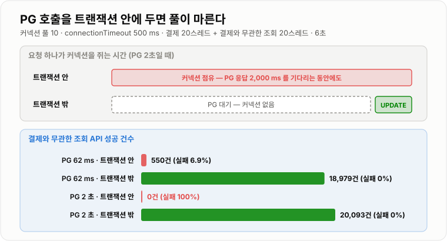
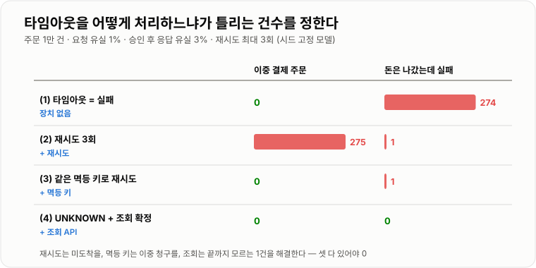

# 주문 · 결제 시스템

> **결제 연동에서 가장 다루기 어려운 결과는 성공도 실패도 아닌 "모름"이다. 타임아웃을 실패로 처리하자 1만 건 중 274건이 돈은 나갔는데 주문은 실패로 남았고, 멱등 키 없이 재시도하자 275건이 이중 결제됐다. "모름"을 하나의 상태로 두고 조회로 확정하자 둘 다 0건이 됐다.**

---

## 1. 핵심 요약

**주문 · 결제 시스템은 네 문제를 푼다 — 상태를 정해진 순서로만 바꾸기(상태 전이), 외부 결제 대행사(PG)의 응답을 못 받았을 때의 처리(타임아웃 = 모름), 같은 결제를 두 번 청구하지 않기(멱등성), 어긋난 상태를 되돌리기(조회 · 보상 · 대사). 하나의 DB 트랜잭션으로 묶을 수 없는 외부 시스템이 끼기 때문에 생기는 문제들이다.**

### 한눈에 보기

* **타임아웃은 실패가 아니라 "결과를 모른다"는 뜻이다.** PG(Payment Gateway, 카드사와 가맹점 사이의 결제 대행사) 요청의 1%는 도착 전에 사라지고 3%는 승인된 뒤 응답만 사라지는 모델로 1만 건을 돌렸다. **타임아웃을 실패로 처리하자 실패 373건 중 274건은 실제로 돈이 나간 결제**였다.
* **멱등 키 없이 재시도하면 이중 결제가 난다.** 같은 모델에서 최대 3회 재시도하자 결제 완료는 9,999건이 됐지만 **275건이 두 번 이상 청구(초과 청구 280회)** 됐다. **같은 멱등 키로 재시도하자 이중 결제 0건**이었다.
* **재시도만으로는 끝나지 않는다.** 멱등 키 재시도에서도 3번 모두 응답을 못 받은 **1건이 "돈은 나갔는데 실패"** 로 남았다. **타임아웃을 `UNKNOWN` 상태로 두고 PG 조회 API로 확정**하자 1만 건이 모두 정확했다(조회로 확정 274건).
* **외부 호출을 DB 트랜잭션 안에 넣으면 PG의 장애가 내 서비스 전체의 장애가 된다.** 커넥션 풀 10개에 결제 20스레드 · 조회 20스레드를 붙였다. **PG가 2초로 느려지자 트랜잭션 안에서 부른 쪽은 결제와 무관한 조회 API가 100% 실패**했고, 트랜잭션 밖에서 부른 쪽은 조회 20,093건이 **모두 성공**했다.
* **상태 전이는 조건부 UPDATE로 한 번만 허용한다.** 결제 승인 콜백과 결제 시간 초과 취소 배치가 같은 주문 1,000건을 동시에 건드리게 했다. **조건 없이 바꾸면 416~472건이 "돈은 받았는데 최종 상태는 취소"** 였고, `WHERE status = 'PENDING'`을 붙이자 **0건**이었다.
* **조건부 UPDATE는 불일치를 없애는 게 아니라 보상할 대상을 정확히 가려낸다.** 진 쪽이 무엇을 해야 하는지(취소가 이겼으면 승인된 결제를 환불)가 명확해진다. 이것이 **보상 트랜잭션**이다.
* **마지막 방어선은 대사(對査)다.** 매일 PG의 정산 데이터와 내부 결제 기록을 한 줄씩 맞춰 본다. 앞의 모든 장치를 뚫고 어긋난 건이 여기서 잡힌다.
* **결제 상태 변경은 덮어쓰지 않고 이력으로 쌓는다.** "언제 누가 어떤 상태에서 어떤 상태로" 바꿨는지가 남아야 분쟁·감사에 답할 수 있다.

> 이 노트의 수치는 **JDK 21.0.12.1 (Temurin) · Windows 11**에서 실행했다. **타임아웃 실험은 실제 PG가 아니라** 요청 유실 1% · 승인 후 응답 유실 3%를 시드 고정 난수로 재현하고, 멱등 키와 조회 API를 흉내 낸 **최소 모델**이다. 상태 경합은 **H2 1.4.200 인메모리(READ COMMITTED) · 스레드 16개**로 3회, 커넥션 풀 실험은 **HikariCP 4.0.3 + H2**로 조건마다 6초씩 돌렸다. PG 지연은 `Thread.sleep(50)`으로 지시했고 **실제로는 62.2 ms**였다.

### 무엇을 해결하는가

#### 해결하려는 문제

흔한 첫 구현이다. 한 트랜잭션 안에서 주문을 만들고, PG를 부르고, 결과를 반영한다.

```java
@Transactional
public void placeOrder(OrderRequest req) {
    Order order = orderRepository.save(Order.create(req));       // ① 주문 저장
    PgResponse res = pgClient.approve(order.getId(), req.getAmount());  // ② PG 호출 (1~3초)
    order.markPaid(res.getPaymentKey());                          // ③ 결제 완료 반영
}
```

**정상일 때는 문제가 없다.** 문제는 ②에서 일어나는 세 가지다.

```text
(가) ②가 타임아웃  → 예외 → 트랜잭션 롤백 → 주문이 없다
                   그런데 PG 는 승인했을 수 있다 → 고객 카드에서 돈이 빠졌는데 주문 내역이 없다

(나) 사용자가 "결제 실패"를 보고 다시 누른다 → ①②③ 을 처음부터
                   첫 번째가 사실 승인됐었다면 → 같은 주문에 두 번 청구

(다) ②가 3초씩 걸린다 → 그동안 ①이 연 DB 커넥션을 쥐고 있다
                   커넥션 풀 10개가 PG 를 기다리는 요청으로 가득 찬다 → 주문 조회 · 로그인까지 멈춘다
```

**세 문제의 뿌리는 하나다 — PG는 내 DB 트랜잭션에 들어오지 않는다.** 내가 롤백해도 PG의 승인은 취소되지 않고, PG가 느려도 내 트랜잭션은 그 시간을 기다린다.

#### 이 개념이 없을 때

"그럼 PG 승인까지 한 트랜잭션으로 묶으면(2단계 커밋) 되지 않나?" 외부 결제사는 가맹점의 분산 트랜잭션에 참여하지 않는다. **남은 방법은 원자성을 포기하고, 어긋날 수 있다는 전제에서 어긋남을 찾아 고치는 것**이다.

| 이 노트의 장치 | 막는 것 |
| --- | --- |
| **트랜잭션 경계 분리** | PG 지연이 커넥션 풀을 말리는 것 |
| **`UNKNOWN` 상태 + 조회 API** | 타임아웃을 실패로 오판하는 것 |
| **멱등 키** | 재시도가 이중 결제가 되는 것 |
| **조건부 상태 전이** | 동시에 들어온 콜백·배치가 상태를 덮어쓰는 것 |
| **보상 트랜잭션** | 이미 일어난 결제를 논리적으로 되돌리는 것 |
| **대사 · 감사 이력** | 앞의 장치를 모두 뚫고 어긋난 것을 찾는 것 |

---

## 2. 동작 원리

### 핵심 구성 요소

| 용어 | 뜻 |
| --- | --- |
| **PG**(Payment Gateway) | 가맹점 대신 카드사·은행과 결제를 처리하는 결제 대행사. 승인 · 취소 · 조회 API를 제공한다 |
| **주문 상태** | 주문의 업무 흐름. `CREATED → PAYMENT_PENDING → PAID → SHIPPED ...` |
| **결제 상태** | **결제 시도 한 건**의 결과. `REQUESTED → APPROVED / FAILED / UNKNOWN` |
| **상태 전이** | 허용된 방향으로만 상태를 바꾸는 것. `PAID → PENDING`은 허용하지 않는다 |
| **`UNKNOWN`** | PG에 요청했지만 **결과를 확인하지 못한** 상태. 실패가 아니다 |
| **조회 API** | 주문 번호(또는 멱등 키)로 **PG에서 실제 결과를 다시 물어보는** API |
| **멱등 키**(idempotency key) | 같은 결제 시도를 식별하는 값. 같은 키로 여러 번 요청해도 **한 번만 청구**된다 |
| **웹훅**(webhook) | PG가 결과를 **가맹점 서버로 호출해 알려 주는** 방식. 중복 · 순서 역전 · 지연이 있다 |
| **보상 트랜잭션** | 되돌릴 수 없는 작업을 **반대 작업으로 논리적으로 취소**하는 것. 승인 → 환불 |
| **대사**(reconciliation) | 두 시스템의 기록(내부 결제 내역 ↔ PG 정산 데이터)을 **건별로 맞춰 보는** 작업 |
| **감사 이력** | 상태 변경을 **덮어쓰지 않고 추가만 하는** 기록. 누가 · 언제 · 무엇을 · 왜 |

### 내부 동작 과정

#### 1) 주문과 결제를 다른 상태로 둔다

**주문 하나에 결제 시도는 여러 번일 수 있다.** 카드 한도 초과로 실패하고 다른 카드로 다시 결제하면 주문은 하나, 결제 시도는 둘이다. 그래서 둘을 한 컬럼에 섞지 않는다.

```text
주문 (orders)                              결제 시도 (payment)  — 주문 1 : 결제 N

 CREATED                                    REQUESTED ──(응답: 승인)──▶ APPROVED ──▶ REFUNDED
    │                                           │
    ▼                                           ├──(응답: 거절)──▶ FAILED
 PAYMENT_PENDING ◀── 결제 실패 시 머문다          │
    │                                           └──(타임아웃)───▶ UNKNOWN
    ├── 결제 승인 ──▶ PAID                                           │
    │                                                    조회 API ──┴──▶ APPROVED 또는 FAILED
    └── 시간 초과 ──▶ CANCELED
```

**허용하는 전이만 코드에 적는다.** 적지 않은 전이는 전부 거부한다.

| 현재 상태 | 허용하는 다음 상태 |
| --- | --- |
| `PAYMENT_PENDING` | `PAID`, `CANCELED` |
| `PAID` | `SHIPPED`, `REFUND_REQUESTED` |
| `CANCELED` | (없음 — 끝 상태) |

#### 2) 트랜잭션 경계 — 외부 호출은 트랜잭션 밖에서

**한 트랜잭션을 셋으로 쪼갠다.** PG를 기다리는 동안에는 DB 커넥션을 쥐지 않는다.

```text
[Tx 1]  주문 생성 (PAYMENT_PENDING) + 결제 시도 생성 (REQUESTED, 멱등 키 발급)  → 커밋
          ↓  커넥션 반납
[PG]    승인 요청 (멱등 키 포함)  ── 1~3초, DB 커넥션 없음 ──
          ↓
[Tx 2]  결과 반영 — 조건부 UPDATE (REQUESTED → APPROVED, PENDING → PAID)  → 커밋
```

**트랜잭션 안에 두면 무슨 일이 생기는지 실측했다.** 커넥션 풀 10개, `connectionTimeout` 500 ms, 결제 요청 20스레드와 **결제와 무관한 주문 조회** 20스레드를 6초 동안 함께 돌렸다.

```text
                         결제 완료   결제 풀 타임아웃   조회 성공   조회 실패          조회 평균 지연
PG 62 ms  트랜잭션 안에서   1,063        19             550       41 (6.9%)          175.49 ms
PG 62 ms  트랜잭션 밖에서   2,314         0          18,979        0 (0.0%)            0.01 ms

PG 2 초   트랜잭션 안에서      40       102               0      240 (100.0%)            -
PG 2 초   트랜잭션 밖에서      60         0          20,093        0 (0.0%)            0.02 ms
```



*커넥션은 PG를 기다리는 동안 아무 일도 하지 않지만, 풀에서는 "사용 중"이다. 느린 외부 시스템이 풀을 통째로 붙잡는다.*

**PG가 정상(62 ms)일 때도 조회가 34분의 1로 줄었다.** 커넥션 10개가 PG 응답을 기다리느라 비어 있지 않기 때문이다. **PG가 2초로 느려지면 조회는 단 한 건도 커넥션을 받지 못했다.** 결제 기능의 외부 장애가 **주문 조회 · 로그인 · 상품 목록**까지 멈추게 한 것이다. 같은 부하에서 PG 호출만 트랜잭션 밖으로 옮기자 조회는 2만 건이 모두 성공했다.

#### 3) 타임아웃은 "모름"이다

PG 호출이 타임아웃 났을 때 실제로 일어난 일은 셋 중 하나다.

```text
(a) 요청이 PG 에 도착하지 못했다             → 청구 안 됨      → 다시 보내야 한다
(b) PG 가 승인했는데 응답이 돌아오다 사라졌다  → 청구됨          → 다시 보내면 안 된다
(c) PG 가 아직 처리 중이다                    → 곧 청구될 수 있음 → 기다렸다 확인해야 한다
```

**가맹점 쪽에서는 셋이 똑같이 "타임아웃"으로 보인다.** 그래서 네 가지 처리 방식을 같은 조건(요청 유실 1% · 승인 후 응답 유실 3%, 주문 1만 건)에서 비교했다.

```text
                                  결제 완료   실패 처리   이중 결제 주문   "돈은 나갔는데 실패"
(1) 타임아웃 = 실패                   9,627       373            0            274
(2) 재시도 3회 (멱등 키 없음)          9,999         1          275              1
(3) 재시도 3회 (같은 멱등 키)          9,999         1            0              1
(4) UNKNOWN 으로 두고 조회로 확정     10,000         0            0              0
```



*재시도는 (a)를 구하고, 멱등 키는 (b)의 이중 청구를 막고, 조회는 끝까지 모르는 것을 확정한다. 셋 다 있어야 0이 된다.*

**한 방식씩 무엇이 틀리는지 보면 각 장치의 역할이 보인다.**

* **(1)은 (b)를 실패로 오판한다.** 실패 373건 중 274건은 돈이 나갔다. 고객센터 문의가 이것이다.
* **(2)는 (a)를 구하지만 (b)를 두 번 청구한다.** 275건의 이중 결제는 (1)의 274건보다 나쁘다 — 고객 돈을 두 번 가져갔다.
* **(3)은 이중 청구를 막는다.** PG가 같은 멱등 키의 두 번째 요청을 새 청구로 처리하지 않기 때문이다. 그래도 **3번 연속 응답을 못 받은 1건**은 여전히 모른다.
* **(4)는 모르는 것을 모른다고 기록하고, 조회로 확정한다.** 타임아웃 난 결제는 `UNKNOWN`으로 두고 조회 API로 물어본다. 조회 결과 **승인됐으면 반영(274건)**, **기록이 없으면 같은 멱등 키로 재전송(100회)** 한다.

**그래서 "결제는 성공했는데 응답을 못 받았다면?"의 답은 "실패로 처리하지 않는다"이다.** `UNKNOWN`으로 두고 → 조회로 확정하고 → 확정 전까지는 사용자에게 "결제 확인 중"을 보여 준다.

#### 4) 멱등 키 — 같은 결제를 두 번 청구하지 않는다

**멱등 키는 "결제 시도"를 만들 때 한 번 발급하고, 그 시도의 모든 재전송에 같은 값을 쓴다.** 재시도할 때마다 새로 만들면 멱등 키가 아니다.

```text
결제 시도 생성    payment(id=91, order_id=7, idempotency_key='ord7-pay1', status=REQUESTED)
PG 요청 1회차     key='ord7-pay1' → 타임아웃
PG 요청 2회차     key='ord7-pay1' → PG: "이 키는 이미 승인됨" → 기존 승인 결과를 돌려준다 (새 청구 없음)
```

**멱등 키는 두 곳에서 쓴다.**

* **PG를 부를 때** — 내 서버의 재시도가 이중 청구가 되지 않게 한다. PG마다 이름이 다르다(전용 헤더를 받는 곳도, 가맹점 주문 번호를 사실상의 멱등 키로 쓰는 곳도 있다). **연동 문서에서 반드시 확인한다.**
* **내 API가 받을 때** — 사용자의 연타, 앱의 자동 재시도, 게이트웨이 재시도가 주문을 두 개 만들지 않게 한다. 클라이언트가 보낸 키를 `UNIQUE` 컬럼에 넣는다 → **[분산 락과 멱등성](../../08-캐시-Redis/분산락-멱등성/분산락-멱등성.md)**

#### 5) 상태 전이의 경합 — 콜백과 배치가 동시에 온다

**결제 상태를 바꾸는 주체는 여러 곳이다.** 사용자 요청, PG 웹훅, 결제 시간 초과 취소 배치, 관리자 화면. 이것들이 같은 주문을 동시에 건드린다.

```text
t=0     결제 시간 초과 배치:   SELECT status → PENDING  "30분 지났다, 취소하자"
t=0     PG 승인 웹훅:          SELECT status → PENDING  "승인됐다, PAID 로 바꾸자"
t=1ms   웹훅:  UPDATE status = 'PAID'      → 성공
t=1ms   배치:  UPDATE status = 'CANCELED'  → 성공   ← PAID 를 덮어썼다
                                              고객은 돈을 냈는데 주문은 취소
```

1,000개 주문에 두 작업을 동시에 붙여 3회 실측했다.

```text
                                  둘 다 "성공"   최종 PAID   최종 CANCELED   돈은 받았는데 CANCELED
조회 후 UPDATE (조건 없음)          992~999      527~578      422~473           416~472
UPDATE ... WHERE status='PENDING'      0         121~321      679~879              0
```

**조건부 UPDATE는 먼저 도착한 한쪽만 성공시키고, 늦은 쪽은 갱신 행 수 0을 받는다.** 선착순 쿠폰의 `WHERE issued < total`과 같은 원리다 → **[선착순 쿠폰 시스템](../선착순-쿠폰-시스템/선착순-쿠폰-시스템.md)**

**중요한 것은 진 쪽이 무엇을 하느냐**다. "불일치 0건"은 끝이 아니라 **처리해야 할 대상이 정확히 가려졌다**는 뜻이다.

| 이긴 쪽 | 진 쪽 | 진 쪽이 할 일 |
| --- | --- | --- |
| 승인 웹훅 (`PAID`) | 취소 배치 | 아무것도 안 한다. 이미 결제된 주문이다 |
| 취소 배치 (`CANCELED`) | 승인 웹훅 | **승인된 결제를 환불한다** (보상 트랜잭션) |

실측에서 취소가 이긴 679~879건이 바로 **환불해야 할 목록**이다. 조건 없이 덮어쓰면 이 목록을 만들 수가 없다 — 누가 이겼는지 기록이 안 남기 때문이다.

#### 6) 보상 — 되돌릴 수 없는 것을 반대 작업으로

**PG 승인은 롤백할 수 없다. 대신 취소(환불)를 요청할 수 있다.** 분산 트랜잭션 대신 "각 단계를 커밋하고, 뒤에서 실패하면 앞 단계를 반대 작업으로 되돌리는" 흐름을 사가(Saga) 패턴이라고 부른다.

```text
정상 흐름     주문 생성 ──▶ 결제 승인 ──▶ 재고 차감 ──▶ 주문 확정
                               │              │
재고 차감 실패                   │              ✗ 재고 부족
                               │              │
보상 흐름                  결제 취소 ◀──────────┘         (역순으로 되돌린다)
              주문 취소 ◀──────┘
```

**보상 작업도 실패한다.** 환불 API가 타임아웃 나면 또 "모름"이다. 그래서 보상 작업에도 **같은 원칙(멱등 키 · `UNKNOWN` · 조회)** 을 적용하고, 끝내 실패한 건은 사람이 처리하는 대기열로 보낸다.

**재시도할지 말지는 오류 종류로 가른다.**

| 오류 | 다시 하면 결과가 달라지는가 | 처리 |
| --- | --- | --- |
| 타임아웃 · 연결 끊김 | 알 수 없다 | `UNKNOWN` → **조회 먼저**, 기록 없으면 같은 키로 재전송 |
| PG 5xx · 점검 중 | 달라질 수 있다 | 백오프 + 지터 재시도, 같은 멱등 키 |
| 잔액 부족 · 한도 초과 · 도난 카드 | 안 달라진다 | 즉시 `FAILED`, 사용자에게 사유 안내 |
| 금액 불일치 · 서명 오류 · 4xx | 안 달라진다 | 즉시 `FAILED` + 알람 (코드 결함 가능성) |

재시도 간격과 지터의 실측은 → **[메시지 중복 · 재시도 · Outbox](../../11-메시징/메시지-중복-재시도-Outbox/메시지-중복-재시도-Outbox.md)**

#### 7) 복구의 마지막 층 — 조회 배치와 대사

**앞의 장치를 모두 뚫는 경우가 있다.** 서버가 `REQUESTED`를 기록한 직후 죽어서 PG를 불렀는지조차 모르는 경우, 웹훅이 끝내 오지 않는 경우다. 그래서 두 개의 배치를 둔다.

```text
[조회 배치]  5분마다
  SELECT * FROM payment
   WHERE status IN ('REQUESTED', 'UNKNOWN') AND requested_at < NOW() - INTERVAL 5 MINUTE
  → 건마다 PG 조회 API → APPROVED / FAILED 로 확정 (조건부 UPDATE)

[대사 배치]  하루 1회
  PG 정산 데이터 (승인 · 취소 전 건)  ↔  내부 payment 테이블
  ├─ PG 에만 있음    → 내부 누락 (돈은 받았는데 모름) → 반영 또는 환불
  ├─ 내부에만 있음   → PG 미처리를 APPROVED 로 잘못 기록 → 조사
  └─ 금액이 다름     → 즉시 알람
```

**대사는 "우리 기록이 맞다"를 가정하지 않는 유일한 장치다.** 금융권 면접에서 "주문과 결제 상태가 다르면 어떻게 복구하는가?"의 끝은 언제나 대사다.

#### 8) 감사 이력 — 덮어쓰지 않고 쌓는다

**`UPDATE payment SET status = ?`만 하면 과거가 사라진다.** 고객이 "결제한 적 없다"고 할 때 답할 근거가 없다. 상태 변경마다 이력 행을 **추가**한다.

```sql
CREATE TABLE payment_history (
    id           BIGINT AUTO_INCREMENT PRIMARY KEY,
    payment_id   BIGINT       NOT NULL,
    from_status  VARCHAR(20)  NOT NULL,
    to_status    VARCHAR(20)  NOT NULL,
    reason       VARCHAR(200) NOT NULL,     -- 'PG_WEBHOOK', 'TIMEOUT_INQUIRY', 'EXPIRE_BATCH'
    actor        VARCHAR(50)  NOT NULL,     -- 'system:expire-batch', 'admin:kim'
    raw_response TEXT         NULL,         -- PG 원문 응답 (민감 정보는 마스킹)
    created_at   TIMESTAMP    NOT NULL
);
```

**상태 UPDATE와 이력 INSERT는 같은 트랜잭션에 넣는다.** 상태만 바뀌고 이력이 없으면 감사가 뚫리고, 이력만 있고 상태가 안 바뀌면 거짓 기록이다.

---

## 3. 특징과 비교

| 구분 | 내용 |
| ----------- | -- |
| **장점** | 타임아웃을 `UNKNOWN` + 조회로 확정하면 "돈은 나갔는데 실패" 274건과 이중 결제 275건이 모두 0이 된다(모델 실측). 외부 호출을 트랜잭션 밖으로 빼면 PG가 2초로 느려져도 다른 API는 영향이 없다(조회 성공률 0% → 100%). 조건부 상태 전이와 이력 테이블로 누가 이겼고 무엇을 보상할지가 기록된다. |
| **단점** | 한 트랜잭션이 셋으로 쪼개져 중간 상태(`REQUESTED` · `UNKNOWN`)를 화면·배치·고객센터가 모두 이해해야 한다. 조회 배치 · 대사 배치 · 보상 흐름 · 이력 테이블이라는 코드와 운영 부담이 늘어난다. 사용자는 "결제 확인 중"이라는 애매한 화면을 볼 수 있다. |
| **적합한 상황** | 외부 결제사 · 은행 · 포인트 시스템처럼 내 트랜잭션에 참여하지 않는 시스템과 돈이 오가는 흐름. 금액 정합성과 감사 가능성이 요구되는 금융·커머스 도메인. |
| **주의할 상황** | 내부 DB 하나에서 끝나는 포인트 차감처럼 외부 호출이 없다면 한 트랜잭션이 더 단순하고 정확하다. PG가 멱등 키나 조회 API를 제공하지 않으면 이 설계의 전제가 무너지므로 연동 전에 확인해야 한다. |

### 성능 특성

**타임아웃 처리 방식** (주문 1만 건 · 요청 유실 1% · 승인 후 응답 유실 3% · 재시도 최대 3회)

| 방식 | 결제 완료 | 이중 결제 주문 | 돈은 나갔는데 실패 | 총 청구 |
| --- | --- | --- | --- | --- |
| 타임아웃 = 실패 | 9,627 | 0 | **274** | 9,901 |
| 재시도 (멱등 키 없음) | 9,999 | **275** (초과 280회) | 1 | 10,280 |
| 재시도 (같은 멱등 키) | 9,999 | 0 | **1** | 10,000 |
| `UNKNOWN` + 조회 확정 | **10,000** | **0** | **0** | 10,000 |

**트랜잭션 경계와 커넥션 풀** (풀 10 · `connectionTimeout` 500 ms · 결제 20 + 조회 20 스레드 · 6초)

| PG 지연 | PG 호출 위치 | 조회 성공 | 조회 실패율 |
| --- | --- | --- | --- |
| 62 ms | 트랜잭션 안 | 550 | 6.9% |
| 62 ms | 트랜잭션 밖 | **18,979** | 0.0% |
| 2 초 | 트랜잭션 안 | **0** | **100.0%** |
| 2 초 | 트랜잭션 밖 | **20,093** | 0.0% |

**상태 전이 경합** (주문 1,000건 × 승인 웹훅 + 취소 배치 동시 · 3회)

| 방식 | 둘 다 성공 | 돈은 받았는데 CANCELED |
| --- | --- | --- |
| 조회 후 UPDATE | 992~999건 | **416~472건** |
| `WHERE status = 'PENDING'` | **0건** | **0건** (취소가 이긴 679~879건은 환불 대상으로 식별) |

### 장점과 단점

**장점 — "모름"을 숨기지 않아서 고칠 수 있다.**
타임아웃을 실패로 뭉개면 274건은 흔적 없이 틀린 상태가 된다. `UNKNOWN`으로 기록하면 **조회 배치가 찾아갈 목록**이 된다. 모르는 것을 모른다고 적는 것이 복구의 출발점이다.

**장점 — 외부 장애가 격리된다.**
PG가 2초로 느려졌을 때 트랜잭션 밖에서 부른 쪽은 결제만 느려졌고 조회는 2만 건이 모두 성공했다. 결제는 서비스의 한 기능이지 전체가 아니어야 한다.

**단점 — 중간 상태가 사용자에게 보인다.**
"결제 확인 중"은 사용자 경험으로는 나쁘다. 그래도 **틀린 "실패"보다 정직한 "확인 중"이 낫다** — 실패를 보고 다시 결제한 고객이 이중 청구를 당하는 것이 더 나쁘기 때문이다. 조회 배치 주기를 짧게 해 중간 상태에 머무는 시간을 줄인다.

**단점 — 한 흐름이 여러 곳에 흩어진다.**
결제 하나의 결과가 동기 응답 · 웹훅 · 조회 배치 · 대사 배치 네 경로로 들어온다. 모든 경로가 **같은 조건부 전이 메서드**를 거치게 해야 규칙이 한곳에 남는다.

### 어떤 상황에서 고르는가

```text
PG 호출 결과가
├─ 승인 응답   → 조건부 UPDATE (REQUESTED → APPROVED, PENDING → PAID) + 이력
├─ 거절 응답   → 거절 사유가 일시적인가?
│               ├─ 아니오 (잔액 · 한도 · 4xx) → FAILED, 사용자 안내
│               └─ 예 (5xx · 점검)            → 같은 멱등 키로 백오프 재시도
└─ 타임아웃    → UNKNOWN 기록 → 조회 API
                ├─ 승인됨     → 승인 응답과 같은 처리
                ├─ 기록 없음  → 같은 멱등 키로 재전송
                └─ 조회도 실패 → UNKNOWN 유지 → 조회 배치가 이어받음

조건부 UPDATE 가 0행을 돌려주면 (다른 쪽이 먼저 바꿈)
├─ 현재 상태가 내가 원한 상태 → 이미 처리됨, 아무것도 안 함 (웹훅 중복)
└─ 현재 상태가 반대 상태      → 보상 (CANCELED 인데 승인 도착 → 환불 요청)
```

### 비슷한 기술과 비교

**여러 시스템에 걸친 정합성을 맞추는 방법**

| 기준 | 2단계 커밋 (2PC) | 사가 (보상 트랜잭션) | Outbox + 멱등 컨슈머 |
| --------- | ---- | ---- | ---- |
| **동작 방식** | 코디네이터가 모든 참여자에게 준비 → 커밋 | 단계마다 커밋, 실패 시 앞 단계를 반대 작업으로 취소 | DB 트랜잭션에 이벤트를 함께 저장하고 나중에 발행 |
| **정합성** | 원자적 (참여자가 모두 지원할 때) | 최종 정합성 — 중간 상태가 보인다 | 최종 정합성 — 발행이 늦을 수 있다 |
| **외부 PG 적용** | **불가** (PG가 참여하지 않는다) | 가능 (승인 ↔ 취소 API) | 내부 후속 처리(재고 · 알림)에 적합 |
| **단점** | 느리고, 코디네이터 장애 시 참여자가 잠금을 쥔 채 멈춘다 | 보상 로직을 단계마다 직접 짜야 하고 보상도 실패한다 | 중복 발행이 남아 컨슈머가 멱등해야 한다 |
| **선택 기준** | 한 조직 안의 XA 지원 DB끼리 | 외부 시스템이 끼는 업무 흐름 | 결제 완료 후 내부 서비스에 알릴 때 |

**결제 결과를 받는 경로**

| 기준 | 동기 응답 | 웹훅 | 조회 API |
| --------- | ---- | ---- | ---- |
| **속도** | 즉시 | 수 초 ~ 수 분 | 내가 부를 때 |
| **신뢰도** | 타임아웃이면 없음 | 중복 · 순서 역전 · 누락 가능 | 가장 정확 (PG의 현재 상태) |
| **위험** | 응답 유실 | 위조 요청 | 호출량 제한 |
| **역할** | 정상 경로 | 비동기 결과 통지 | **최종 확인 수단** |

**세 경로를 모두 쓰되, 모두 같은 조건부 전이로 합류시킨다.** 웹훅은 서명을 검증하거나 받은 뒤 조회 API로 다시 확인해 위조를 막는다.

---

## 4. 실무 주의사항

### 백엔드 실무 적용

#### Spring · Java

**트랜잭션을 쪼갤 때 같은 클래스 안에서 호출하지 않는다.** `@Transactional` 메서드를 같은 객체의 다른 메서드가 부르면 프록시를 거치지 않아 트랜잭션이 적용되지 않는다. 트랜잭션 단계는 **별도 빈**으로 뺀다 → **[AOP · Proxy와 Transactional](../../05-Spring/AOP-Proxy-Transactional/AOP-Proxy-Transactional.md)**

```java
@Service
public class CheckoutFacade {                    // 트랜잭션 없음 — 흐름만 조율한다

    private final PaymentTxService tx;           // @Transactional 메서드는 여기에
    private final PgClient pgClient;

    public CheckoutFacade(PaymentTxService tx, PgClient pgClient) {
        this.tx = tx;
        this.pgClient = pgClient;
    }

    public PaymentResult checkout(long orderId, long amount) {
        Payment payment = tx.createAttempt(orderId, amount);          // Tx 1 — 커밋 후 커넥션 반납
        PgResult result = pgClient.approve(payment.getIdempotencyKey(), amount);  // 트랜잭션 밖
        return tx.applyResult(payment.getId(), result);               // Tx 2
    }
}
```

**PG 클라이언트에 연결·읽기 타임아웃을 반드시 건다.** JDK `HttpURLConnection`의 기본값은 둘 다 **0(무한)** 이다. 무한 대기는 스레드를 영원히 붙잡는다.

**금액은 `double`로 다루지 않는다.** 원 단위 정수(`long`)나 `BigDecimal`을 쓴다. 그리고 **웹훅·조회로 받은 금액이 주문 금액과 같은지 반드시 비교**한다 — 요청 금액을 조작하는 공격이 여기서 잡힌다.

#### 데이터베이스 · 캐시

**멱등 키에 유니크 제약을 건다.** `payment.idempotency_key UNIQUE`. 같은 결제 시도가 두 행이 되는 것을 DB가 막는다.

**모든 상태 변경은 조건부 UPDATE 하나를 거친다.** 동기 응답, 웹훅, 조회 배치, 관리자 화면이 각자 `UPDATE`를 쓰면 규칙이 네 군데로 흩어진다.

```sql
UPDATE payment
   SET status = 'APPROVED', approved_at = ?, pg_tid = ?
 WHERE id = ? AND status IN ('REQUESTED', 'UNKNOWN');
```

**조회 배치 쿼리에 인덱스를 건다.** `(status, requested_at)` 인덱스가 없으면 결제 테이블 전체를 5분마다 훑는다.

**결제 완료 후속 처리(재고 · 포인트 · 알림)는 Outbox로 넘긴다.** `PAID` 전이와 같은 트랜잭션에 이벤트를 저장해야 "결제는 됐는데 재고가 안 빠진" 상태가 생기지 않는다.

#### 동시성 · 분산 환경

**웹훅은 같은 이벤트가 여러 번 온다.** PG는 가맹점이 2xx를 늦게 주면 다시 보낸다. 조건부 UPDATE가 0행이고 현재 상태가 이미 목표 상태면 **200을 돌려주고 끝낸다.** 오류로 응답하면 PG가 계속 재전송한다.

**웹훅의 순서는 보장되지 않는다.** "취소 완료"가 "승인 완료"보다 먼저 도착할 수 있다. 상태 전이 표에 없는 전이는 거부하고, 조회 API로 현재 상태를 다시 확인한다.

**타임아웃 사슬을 맞춘다.** 사용자 요청 타임아웃(예: 10초) 안에 PG 타임아웃과 한 번의 조회가 들어가야 한다. PG 타임아웃이 사용자 타임아웃보다 길면 사용자는 떠났는데 결제는 계속 진행된다.

### 자주 하는 오해

| 잘못된 이해 | 올바른 이해 |
| ------ | ------ |
| 타임아웃이면 결제 실패다 | "모름"이다. 모델 실측에서 실패 처리한 373건 중 **274건은 돈이 나갔다.** |
| 실패하면 재시도하면 된다 | 멱등 키 없이 재시도하면 **275건 이중 결제**. 같은 멱등 키로 재시도해야 한다. |
| 멱등 키로 재시도하면 끝이다 | 끝까지 응답을 못 받은 건(실측 1건)이 남는다. **`UNKNOWN` + 조회 API**로 확정해야 0이 된다. |
| PG 호출을 `@Transactional` 안에 두면 롤백으로 안전하다 | 롤백은 PG 승인을 취소하지 못한다. 그리고 PG가 2초로 느려지면 **무관한 조회 API까지 100% 실패**했다. |
| 상태 UPDATE는 한 줄이라 경합이 없다 | 조회 후 UPDATE면 **416~472건이 "결제됐는데 취소"** 로 덮어써졌다. `WHERE status = ?` 조건이 필요하다. |
| 조건부 UPDATE로 불일치를 없앴으니 끝이다 | 진 쪽의 처리가 남는다. 취소가 이겼는데 승인이 도착하면 **환불(보상)** 해야 한다. |
| 웹훅이 오면 그 내용을 믿으면 된다 | 중복 · 순서 역전 · 위조가 있다. 서명 검증 또는 조회 API로 재확인하고, 금액을 대조한다. |
| 우리 DB가 맞으니 대사는 필요 없다 | 대사는 "우리 기록이 맞다"를 가정하지 않는 유일한 장치다. 앞의 장치를 모두 뚫은 건이 여기서 잡힌다. |

---

## 5. 예제

### 테이블

```sql
CREATE TABLE orders (
    id          BIGINT PRIMARY KEY,
    user_id     BIGINT      NOT NULL,
    amount      BIGINT      NOT NULL,            -- 원 단위 정수
    status      VARCHAR(20) NOT NULL,            -- PAYMENT_PENDING, PAID, CANCELED ...
    created_at  TIMESTAMP   NOT NULL
);

CREATE TABLE payment (
    id               BIGINT AUTO_INCREMENT PRIMARY KEY,
    order_id         BIGINT      NOT NULL,
    idempotency_key  VARCHAR(64) NOT NULL UNIQUE, -- 시도 생성 시 한 번 발급
    amount           BIGINT      NOT NULL,
    status           VARCHAR(20) NOT NULL,        -- REQUESTED, APPROVED, FAILED, UNKNOWN, REFUNDED
    pg_tid           VARCHAR(64) NULL,            -- PG 거래 번호
    requested_at     TIMESTAMP   NOT NULL,
    approved_at      TIMESTAMP   NULL,
    INDEX idx_payment_recover (status, requested_at)
);
```

### 결과 반영 — 모든 경로가 이 메서드를 지난다

```java
@Service
public class PaymentTxService {

    private final PaymentRepository paymentRepository;
    private final OrderRepository orderRepository;
    private final PaymentHistoryRepository historyRepository;

    public PaymentTxService(PaymentRepository paymentRepository,
                            OrderRepository orderRepository,
                            PaymentHistoryRepository historyRepository) {
        this.paymentRepository = paymentRepository;
        this.orderRepository = orderRepository;
        this.historyRepository = historyRepository;
    }

    @Transactional
    public Payment createAttempt(long orderId, long amount) {
        String key = "ord" + orderId + "-" + UUID.randomUUID();
        return paymentRepository.save(Payment.requested(orderId, key, amount));
    }

    @Transactional
    public PaymentResult applyResult(long paymentId, PgResult result) {
        Payment payment = paymentRepository.findById(paymentId).orElseThrow();

        if (result.isTimeout()) {
            paymentRepository.transition(paymentId, "REQUESTED", "UNKNOWN");
            historyRepository.save(PaymentHistory.of(paymentId, "REQUESTED", "UNKNOWN", "PG_TIMEOUT"));
            return PaymentResult.CHECKING;                   // "결제 확인 중"
        }
        if (result.isApproved()) {
            if (result.getAmount() != payment.getAmount()) { // 금액 대조
                throw new AmountMismatchException(paymentId);
            }
            int changed = paymentRepository.approve(paymentId, result.getTid());   // REQUESTED·UNKNOWN → APPROVED
            if (changed == 0) {
                return PaymentResult.ALREADY_APPLIED;        // 웹훅 · 조회 배치가 먼저 처리
            }
            historyRepository.save(PaymentHistory.of(paymentId, "REQUESTED", "APPROVED", "PG_RESPONSE"));

            int orderChanged = orderRepository.transition(payment.getOrderId(), "PAYMENT_PENDING", "PAID");
            if (orderChanged == 0) {
                return PaymentResult.NEEDS_REFUND;           // 주문이 이미 취소됨 → 보상 대상
            }
            return PaymentResult.PAID;
        }
        paymentRepository.transition(paymentId, "REQUESTED", "FAILED");
        historyRepository.save(PaymentHistory.of(paymentId, "REQUESTED", "FAILED", result.getReason()));
        return PaymentResult.FAILED;
    }
}
```

```java
public interface OrderRepository extends JpaRepository<Order, Long> {

    @Modifying(clearAutomatically = true)
    @Query("UPDATE Order o SET o.status = :to WHERE o.id = :id AND o.status = :from")
    int transition(@Param("id") long id, @Param("from") String from, @Param("to") String to);
}
```

### `UNKNOWN` 복구 배치

```java
@Component
public class PaymentRecoveryJob {

    private final PaymentRepository paymentRepository;
    private final PgClient pgClient;
    private final PaymentTxService tx;

    public PaymentRecoveryJob(PaymentRepository paymentRepository, PgClient pgClient, PaymentTxService tx) {
        this.paymentRepository = paymentRepository;
        this.pgClient = pgClient;
        this.tx = tx;
    }

    @Scheduled(fixedDelay = 60_000)
    public void recover() {
        Instant threshold = Instant.now().minus(Duration.ofMinutes(5));
        List<Payment> pending = paymentRepository.findRecoverable(threshold, 100);  // REQUESTED · UNKNOWN
        for (Payment p : pending) {
            PgResult inquiry = pgClient.inquire(p.getIdempotencyKey());   // PG 의 실제 상태를 묻는다
            if (inquiry.isNotFound()) {
                PgResult retry = pgClient.approve(p.getIdempotencyKey(), p.getAmount());  // 같은 키로 재전송
                tx.applyResult(p.getId(), retry);
            } else {
                tx.applyResult(p.getId(), inquiry);
            }
        }
    }
}
```

---

## 6. 면접 정리

### 자주 나오는 질문

#### 기본 질문

1. **결제는 성공했지만 응답을 받지 못했다면 어떻게 하는가?**

    * 핵심 키워드: 타임아웃 = 모름 · 실패로 처리하지 않음(실측 274건 오판) · `UNKNOWN` 상태 · 조회 API로 확정 · 사용자에게 "확인 중"

2. **외부 API 호출을 DB 트랜잭션 안에 넣어도 되는가?**

    * 핵심 키워드: 롤백이 PG를 취소 못 함 · 커넥션 점유 · PG 2초 지연 시 무관한 조회 100% 실패 · Tx1 → PG → Tx2로 분리

3. **중복 결제를 어떻게 방지하는가?**

    * 핵심 키워드: 멱등 키 · 시도 생성 시 한 번 발급 · 재전송에 같은 키 · 실측 이중 결제 275건 → 0건 · `UNIQUE` 제약 · 내 API도 멱등 키 수신

4. **주문과 결제 상태가 다르면 어떻게 복구하는가?**

    * 핵심 키워드: 조회 배치(`REQUESTED`·`UNKNOWN`) · 보상 트랜잭션(환불) · 일 단위 대사 · 감사 이력

5. **재시도 가능한 오류와 재시도하면 안 되는 오류를 어떻게 구분하는가?**

    * 핵심 키워드: 다시 하면 결과가 달라지는가 · 타임아웃은 조회 먼저 · 5xx는 백오프 재시도 · 잔액 부족·4xx·금액 불일치는 즉시 실패

#### 꼬리 질문

1. **멱등 키로 재시도하면 충분하지 않은가?**

    * 핵심 키워드: 끝까지 응답을 못 받은 건이 남음(실측 1건) · 재시도 상한 · 조회로 확정해야 0

2. **결제 승인 웹훅과 만료 취소 배치가 동시에 오면?**

    * 핵심 키워드: 조건부 UPDATE(`WHERE status='PENDING'`) · 실측 불일치 416~472건 → 0건 · 진 쪽 처리 · 취소가 이기면 환불

3. **메시지가 중복 소비되면 어떻게 처리하는가?**

    * 핵심 키워드: 조건부 전이가 곧 멱등성 · 0행이면 현재 상태 확인 · 이미 목표 상태면 성공 응답 · 처리 이력 테이블

4. **왜 2단계 커밋을 쓰지 않는가?**

    * 핵심 키워드: PG가 참여하지 않음 · 코디네이터 장애 시 블로킹 · 사가(보상)와 최종 정합성

5. **웹훅을 그대로 믿어도 되는가?**

    * 핵심 키워드: 중복 · 순서 역전 · 위조 · 서명 검증 · 조회 API 재확인 · 금액 대조

6. **감사 가능성은 어떻게 확보하는가?**

    * 핵심 키워드: 상태 덮어쓰기 금지 · 이력 INSERT(추가 전용) · 누가·언제·무엇을·왜 · 상태 변경과 같은 트랜잭션 · PG 원문 보관

### 30초 답변

> 주문·결제의 핵심은 PG가 제 DB 트랜잭션에 들어오지 않는다는 점입니다. 그래서 PG 호출은 트랜잭션 밖에서 하는데, 안에 두면 PG가 느려질 때 커넥션 풀이 말라 무관한 API까지 멈추기 때문입니다. 타임아웃은 실패가 아니라 결과를 모르는 상태라, 실패로 처리하면 돈이 나간 결제를 놓치고 멱등 키 없이 재시도하면 이중 결제가 납니다. 그래서 같은 멱등 키로 재전송하고, 끝까지 모르는 건은 UNKNOWN으로 두고 조회 API로 확정합니다. 상태는 조건부 UPDATE로 한 번만 바꾸고, 어긋난 건은 환불 같은 보상과 일 단위 대사로 바로잡습니다.

### 핵심 키워드

`PG` · `상태 전이` · `UNKNOWN` · `조회 API` · `멱등 키` · `트랜잭션 경계` · `커넥션 풀 고갈` · `조건부 UPDATE` · `웹훅` · `보상 트랜잭션` · `사가` · `대사` · `감사 이력`

### 이어서 볼 주제

* **[메시지 중복 · 재시도 · Outbox](../../11-메시징/메시지-중복-재시도-Outbox/메시지-중복-재시도-Outbox.md)** — 결제 완료 이벤트를 유실 없이 넘기는 방법과 백오프·지터·DLQ의 실측.
* **[분산 락과 멱등성](../../08-캐시-Redis/분산락-멱등성/분산락-멱등성.md)** — 멱등성 키를 Redis와 DB 유니크 제약으로 구현할 때의 차이.
* **[장애 분석과 성능 개선](../../10-테스트-운영/장애분석-성능개선/장애분석-성능개선.md)** — 커넥션 풀 고갈을 스레드 덤프와 풀 지표로 찾아내는 순서.
* **[대용량 처리 시스템](../대용량-처리-시스템/대용량-처리-시스템.md)** — 대사 배치처럼 수백만 건을 청크로 나눠 재실행 가능하게 도는 방법.
