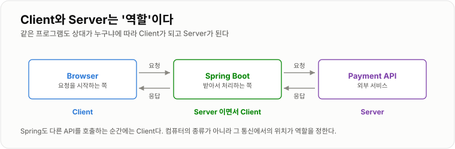
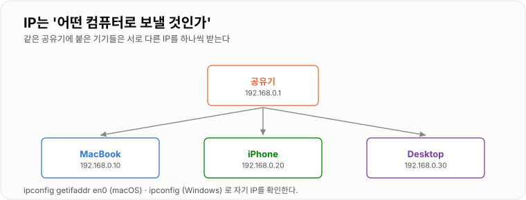
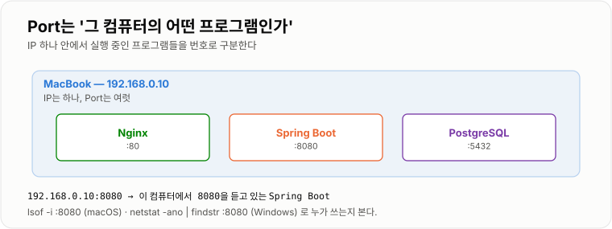
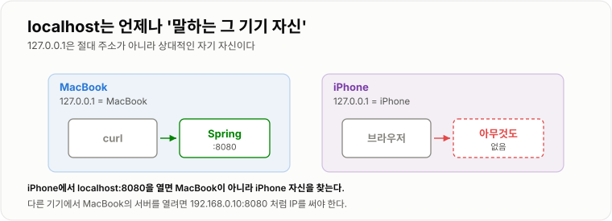
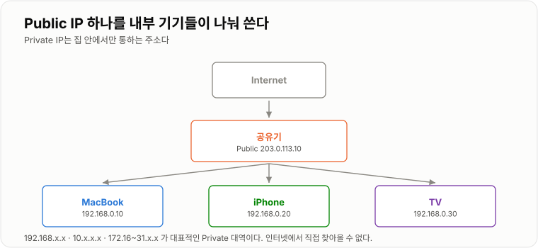
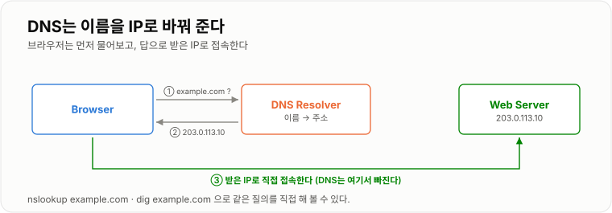
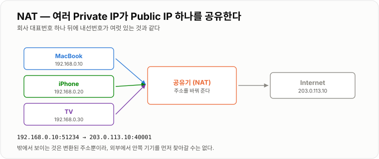

# 1. 네트워크

> **요청 하나가 어디로 가는지는 IP(어떤 컴퓨터) · Port(그 안의 어떤 프로그램) · 이름(DNS) 세 가지가 정한다.**

인프라의 나머지 전부 — Docker의 Port Mapping, Nginx의 `proxy_pass`, Kubernetes의 Service —
가 결국 이 세 가지를 다시 쓰는 것이라 여기부터 시작한다.

---

## Client / Server

### Client

서버에게 무언가를 요청하는 쪽이다. 브라우저, React 앱, 모바일 앱, 다른 서버, `curl` 이 모두 Client가 된다.

브라우저에서 아래 주소에 접속하면 그 순간 브라우저가 Client다.

```text
https://example.com/users
```

### Server

Client의 요청을 받고 결과를 반환하는 프로그램이다.
Spring Boot 애플리케이션을 실행하면 Spring Boot가 HTTP 요청을 받을 수 있는 Server가 된다.

```text
Browser
   ↓ 요청
Spring Boot
   ↓ 응답
Browser
```

### 핵심 — Client / Server는 컴퓨터가 아니라 역할이다

Spring 서버도 다른 API를 호출하면 그 순간에는 Client가 된다.

```text
Browser  →  Spring API  →  Payment API
```

* Browser → Client
* Spring → Browser 입장에서는 Server
* Spring → Payment API 입장에서는 Client
* Payment API → Server

코드로 보면 더 분명하다. 같은 클래스 안에 Server 역할(`@GetMapping`)과
Client 역할(`RestClient` 호출)이 같이 있다.

```java
@RestController
public class OrderController {

    private final RestClient paymentClient;   // 여기서는 내가 Client

    @GetMapping("/orders/{id}")               // 여기서는 내가 Server
    public Order find(@PathVariable Long id) {
        return paymentClient.get()
                .uri("/payments/{id}", id)
                .retrieve()
                .body(Order.class);
    }
}
```

이 구분이 중요한 이유는 **장애를 나눌 때 기준이 되기 때문**이다.
"주문 API가 느리다"는 Spring이 느린 것일 수도, Spring이 Client로서 호출한 Payment API가 느린 것일 수도 있다.
역할을 나눠 보면 둘은 서로 다른 문제다.



*같은 Spring Boot가 앞을 볼 때는 Server, 뒤를 볼 때는 Client다.*

---

## IP

IP는 네트워크에서 컴퓨터를 구분하기 위한 주소다. 집 주소와 비슷하게 생각하면 된다.

같은 Wi-Fi에 붙은 기기들은 이렇게 주소를 하나씩 받는다.

```text
MacBook     192.168.0.10
iPhone      192.168.0.20
Desktop     192.168.0.30
```

주소를 나눠 주는 것은 공유기의 **DHCP** 기능이다.
그래서 재부팅하거나 한동안 꺼 두면 값이 바뀔 수 있다.
**바뀌면 곤란한 기기(서버로 쓸 PC)는 공유기에서 고정 IP로 지정해 둔다.**
뒤에 나올 Port Forwarding이 "192.168.0.10으로 보내라"는 규칙인데, 그 IP가 바뀌면 규칙이 헛돌기 때문이다.

### 확인

```bash
ipconfig getifaddr en0     # macOS — Wi-Fi 인터페이스의 IP 하나만
ip addr show               # Linux — 전체 인터페이스
```

```powershell
ipconfig                   # Windows — IPv4 주소 항목을 본다
```

내부 IP와 외부 IP는 다른 값이다. 둘을 헷갈리면 접속이 안 되는 이유를 못 찾는다.

```bash
ipconfig getifaddr en0     # 192.168.0.10  ← 집 안에서 쓰는 주소
curl ifconfig.me           # 203.0.113.10  ← 인터넷에서 보이는 주소
```

### 핵심

IP는 **"어떤 컴퓨터로 요청을 보낼 것인가?"** 를 결정한다.



*같은 네트워크 안에서는 IP가 겹치지 않는다.*

---

## Port

IP가 컴퓨터를 찾는 주소라면 Port는 **그 컴퓨터 안에서 실행 중인 프로그램을 찾는 번호**다.

MacBook 하나에서 이렇게 여러 프로그램이 동시에 돌 수 있다.

```text
3000 → React
8080 → Spring
5432 → PostgreSQL
```

따라서 `192.168.0.10:8080` 은
`192.168.0.10이라는 컴퓨터의 8080번 Port를 사용하는 프로그램`을 의미한다.

Port 번호는 0~65535 범위다. 1024 미만은 보통 관리자 권한이 있어야 열 수 있어서,
개발할 때는 8080·3000처럼 높은 번호를 쓴다.

| Port | 쓰임 |
| -- | -- |
| 22 | SSH |
| 80 | HTTP |
| 443 | HTTPS |
| 3000 | React 개발 서버 |
| 5432 | PostgreSQL |
| 6379 | Redis |
| 8080 | Spring Boot 기본값 |

### 사용 중인 Port 확인

```bash
lsof -nP -iTCP:8080 -sTCP:LISTEN     # macOS · Linux
```

```powershell
netstat -ano | findstr :8080         # Windows — 맨 끝 숫자가 PID
tasklist /FI "PID eq 12345"          # 그 PID가 어떤 프로그램인지
```

### bind — 같은 8080이라도 '누구에게' 열렸는지가 다르다

`lsof` 결과의 NAME 칸을 반드시 본다. 여기서 접속 가능 범위가 갈린다.

```text
NAME
*:8080            ← 모든 인터페이스. 다른 기기에서도 접속 가능
127.0.0.1:8080    ← Loopback 전용. 이 컴퓨터에서만 접속 가능
```

Spring은 기본적으로 모든 인터페이스에 bind 하지만, 아래처럼 지정하면 자기 자신만 받게 된다.

```yaml
server:
  port: 8080
  address: 127.0.0.1    # 이 줄이 있으면 다른 기기에서 절대 못 붙는다
```

**"내 PC에서는 되는데 폰에서는 안 된다"의 1순위 원인이 이 한 줄이다.**
외부에서 붙게 하려면 이 설정을 지우거나 `0.0.0.0` 으로 둔다.
Docker 컨테이너 안에서도 마찬가지라, `127.0.0.1` 에 bind 하면 Port Mapping을 해도 접속되지 않는다.

### 핵심

```text
IP   = 어떤 컴퓨터?
Port = 그 컴퓨터의 어떤 프로그램?
bind = 그 Port를 누구에게 열어 뒀나?
```



*IP는 하나지만 Port는 여럿이다.*

---

## localhost / 127.0.0.1

`localhost`는 **현재 내가 사용하고 있는 컴퓨터 자신**을 의미하고, 보통 `127.0.0.1`을 가리킨다.
이 주소를 Loopback 주소라고 하며, 이 통신은 랜선이나 Wi-Fi를 타지 않고 OS 안에서 끝난다.

```bash
curl http://localhost:8080
```

```text
MacBook → MacBook 자신의 8080 → Spring
```

### 중요한 점

다른 컴퓨터에서 내 Mac의 `localhost`로 접근할 수 없다.
iPhone에서 `localhost:8080`이라고 하면 MacBook이 아니라 **iPhone 자신**을 의미한다.

따라서 MacBook 서버에 접근하려면 `192.168.0.10:8080` 처럼 MacBook의 IP를 사용해야 한다.

### `localhost` 와 `127.0.0.1` 은 완전히 같은 말이 아니다

`localhost` 는 이름이고, 그 이름을 IP로 바꾸는 것은 `hosts` 파일이다.

```text
# macOS · Linux: /etc/hosts
# Windows: C:\Windows\System32\drivers\etc\hosts
127.0.0.1       localhost
::1             localhost      ← IPv6 항목도 같이 들어 있다
```

두 줄이 다 있으면 `curl http://localhost:8080` 이 **IPv6 `::1` 을 먼저 시도**할 수 있다.
서버가 IPv4에만 bind 되어 있으면 `localhost` 는 실패하고 `127.0.0.1` 은 성공하는 상황이 생긴다.

```bash
curl -v http://localhost:8080
# *   Trying [::1]:8080...        ← 여기서 걸리면 이 문제다
```

**연결 문제를 좁힐 때는 `localhost` 대신 `127.0.0.1` 을 쓰는 편이 변수가 하나 적다.**

!!! warning "이 규칙은 Docker와 Kubernetes에서 그대로 반복된다"

    컨테이너 안의 `localhost`는 그 컨테이너 자신이고, Pod 안의 `localhost`는 그 Pod 자신이다.
    "왜 DB에 못 붙지?" 의 상당수가 이 한 줄에서 나온다.



*localhost는 절대 주소가 아니라 '말하는 쪽 자신'이다.*

---

## Private IP / Public IP

### Private IP

집이나 회사 내부 네트워크에서 사용하는 주소다. 대표적인 대역은 셋이다.

```text
10.0.0.0     ~ 10.255.255.255
172.16.0.0   ~ 172.31.255.255
192.168.0.0  ~ 192.168.255.255
```

이 주소는 인터넷 전체에서 직접 접근할 수 있는 주소가 아니다.
**인터넷 라우터는 이 대역으로 가는 패킷을 그냥 버린다.** 그래서 "사설"이라고 부른다.
(`172.` 로 시작한다고 전부 Private은 아니다. `172.32.0.0` 은 Public이다.)

Docker가 만드는 컨테이너 네트워크도 보통 `172.17~172.20.x.x` 를 쓴다. 같은 사설 대역이다.

### Public IP

인터넷에서 우리 네트워크를 식별하는 주소다.

```text
Internet
   ↓
Public IP (공유기)
   ↓
192.168.0.10 (MacBook)
```

집에 기기가 여러 개 있어도 외부에서는 공유기의 Public IP 하나를 통해 인터넷과 통신한다.

가정용 회선의 Public IP는 대체로 **고정이 아니다.** 재부팅하거나 며칠 지나면 바뀔 수 있어서,
도메인의 A 레코드에 그 값을 박아 두면 언젠가 끊긴다.
그래서 [6장의 DDNS](../06-DNS-HTTPS/06-DNS-HTTPS.md)나 [5장의 Tunnel](../05-외부-접속/05-외부-접속.md)을 쓴다.



*밖에서 보이는 주소는 공유기의 것 하나뿐이다.*

---

## DNS

`142.250.xxx.xxx` 같은 IP를 사람이 외우기는 어렵다. 그래서 `google.com` 같은 Domain을 사용한다.
DNS의 기본 역할은 **Domain을 IP 주소로 찾아주는 것**이다.

### 조회 순서

브라우저가 무조건 DNS 서버부터 물어보는 것은 아니다. 가까운 곳부터 훑는다.

```text
① 브라우저 캐시
② OS 캐시
③ hosts 파일          ← 여기에 있으면 DNS를 아예 안 간다
④ DNS Resolver        ← ISP · 8.8.8.8 · 1.1.1.1 등
```

`hosts` 에 한 줄 넣으면 도메인을 사지 않고도 로컬에서 도메인 테스트를 할 수 있다.
Nginx의 `server_name` 을 시험할 때 유용하다.

```text
127.0.0.1   app.local
```

### 확인

```bash
nslookup google.com
dig google.com +short          # IP만 간단히
dig google.com A               # TTL 포함 상세
dig @1.1.1.1 google.com        # 특정 Resolver에게 직접
```

`dig` 결과의 `ANSWER SECTION` 에 나오는 값이 실제로 접속할 IP다.

### 캐시와 TTL

한 번 받은 답은 TTL(초) 동안 캐시된다. 그래서 **DNS를 바꿔도 즉시 반영되지 않는다.**
바꿀 예정이 있으면 하루 전에 TTL을 60초 정도로 낮춰 두고 작업한다.

```bash
sudo dscacheutil -flushcache; sudo killall -HUP mDNSResponder   # macOS
ipconfig /flushdns                                              # Windows
```

### 요청 흐름

```text
Browser "google.com 어디야?" → DNS → "142.x.x.x" → Browser → 그 IP로 접속
```



*DNS는 주소를 알려줄 뿐, 실제 통신 경로에는 끼지 않는다.*

---

## NAT

집에는 Mac, iPhone, TV, Tablet처럼 여러 기기가 있지만 각 기기가 모두 Public IP를 하나씩 가지고 있지는 않다.
공유기가 NAT를 사용해 여러 Private IP 장치가 하나의 Public IP를 공유하도록 한다.

```text
Mac    192.168.0.10 ─┐
iPhone 192.168.0.20 ─┼→ 공유기 → Public IP → Internet
TV     192.168.0.30 ─┘
```

### 어떻게 되돌아오나

공유기는 나가는 요청마다 변환 기록을 표로 남긴다.

```text
192.168.0.10:51234  ↔  203.0.113.10:40001
192.168.0.20:49876  ↔  203.0.113.10:40002
```

응답이 `203.0.113.10:40001` 로 돌아오면 그 표를 보고 `192.168.0.10` 에게 넘긴다.
회사 대표번호 하나 뒤에 내선번호가 여럿 있는 것과 같다.

### 여기서 나오는 결론이 5장 전체다

이 표는 **안에서 밖으로 나갈 때 생긴다.** 밖에서 먼저 들어온 요청은 표에 없으니 넘길 곳이 없다.

```text
안 → 밖   자연스럽다
밖 → 안   기본적으로 막힌다
```

그래서 외부 접속을 열려면 표를 미리 심어 두거나(Port Forwarding),
안에서 먼저 연결을 만들어 두고 그 길을 되쓴다(Tunnel).
자세한 것은 [5. 외부 접속](../05-외부-접속/05-외부-접속.md)에서 다룬다.



*밖에서 보이는 것은 변환된 주소뿐이다.*

---

## HTTP / HTTPS

HTTP는 Client와 Server가 데이터를 주고받기 위한 규칙이다. 메시지는 세 덩어리로 되어 있다.

```http
GET /users?page=1 HTTP/1.1        ← ① 시작 줄: 메서드 · 경로 · 버전
Host: example.com                 ← ② 헤더
Authorization: Bearer eyJhbGc...
Accept: application/json
                                  ← ③ 빈 줄 다음이 본문 (GET은 보통 없음)
```

응답도 같은 모양이다.

```http
HTTP/1.1 200 OK
Content-Type: application/json
Content-Length: 23

{"id":1,"name":"insoo"}
```

Spring에서는 이 조각들이 애노테이션으로 매핑된다.

```java
@GetMapping("/users")                                  // 메서드 + 경로
public List<User> users(@RequestParam int page,        // 쿼리스트링
                        @RequestHeader("Authorization") String token) {
    return userService.findAll(page);                  // 반환값이 본문(JSON)
}
```

`Host` 헤더는 특히 눈여겨 둘 만하다. IP 하나에 여러 도메인이 올라가 있을 때
Nginx가 **어느 사이트인지 판단하는 근거**가 이 헤더이기 때문이다([4장 `server_name`](../04-Nginx/04-Nginx.md)).

### 직접 눈으로 보기

`curl -v` 를 쓰면 위 메시지가 그대로 찍힌다. `>` 가 보낸 것, `<` 가 받은 것이다.

```bash
curl -v http://localhost:8080/users
```

```text
> GET /users HTTP/1.1
> Host: localhost:8080
>
< HTTP/1.1 200 OK
< Content-Type: application/json
```

### HTTPS

HTTPS는 `HTTP + TLS` 라고 생각하면 된다. HTTP 통신 내용을 암호화해서 중간에서 내용을 볼 수 없게 한다.

```text
HTTP           HTTPS
Client         Client
  ↓ 평문         ↓ 암호화
Server         Server
```

기본 Port도 다르다. HTTP는 80, HTTPS는 443이다.
자세한 것은 [6. DNS / HTTPS](../06-DNS-HTTPS/06-DNS-HTTPS.md)에서 다룬다.

---

## 직접 확인해 보기

여기까지의 개념은 명령 몇 줄로 전부 눈으로 볼 수 있다.
Spring Boot 하나를 8080에 띄워 놓고 순서대로 따라가면 된다.

**① 자기 자신으로 접속 — Loopback**

```bash
curl -i http://127.0.0.1:8080/actuator/health
# HTTP/1.1 200   ← 프로세스는 살아 있다
```

**② 어디에 bind 되어 있는지 확인**

```bash
lsof -nP -iTCP:8080 -sTCP:LISTEN
# NAME 칸이 *:8080 이어야 외부에서 붙을 수 있다
```

**③ 내 IP로 접속 — 여기까지 되면 네트워크 스택은 정상**

```bash
IP=$(ipconfig getifaddr en0)
curl -i http://$IP:8080/actuator/health
```

**④ 다른 기기(폰)에서 접속**

폰 브라우저에서 `http://192.168.0.10:8080/actuator/health` 를 연다. 안 되면 순서대로 의심한다.

| 증상 | 의심할 곳 |
| -- | -- |
| ②의 NAME이 `127.0.0.1:8080` 으로 보인다 | `server.address` 설정 |
| ③은 되는데 ④가 안 된다 | 방화벽, 또는 폰이 다른 Wi-Fi에 붙어 있음 |
| 즉시 거절된다 | 프로세스·포트 문제 ([9장 Connection Refused](../09-장애-대응/09-장애-대응.md)) |
| 한참 기다리다 실패한다 | 방화벽이 조용히 버리는 중 ([9장 Timeout](../09-장애-대응/09-장애-대응.md)) |

**⑤ 이름으로 접속 — DNS 대신 hosts로 흉내 내기**

```text
# /etc/hosts 에 추가
192.168.0.10   app.local
```

```bash
curl -i http://app.local:8080/actuator/health
```

이름 → IP → Port → 프로세스로 이어지는 길을 한 번 직접 밟아 보면,
뒤 장에서 Docker와 Kubernetes가 이 중 어느 칸을 바꾸는지가 눈에 들어온다.
