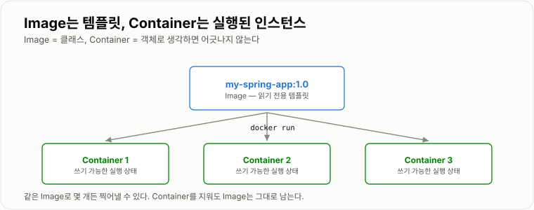
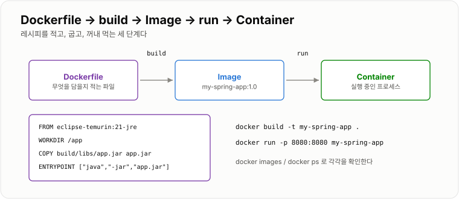
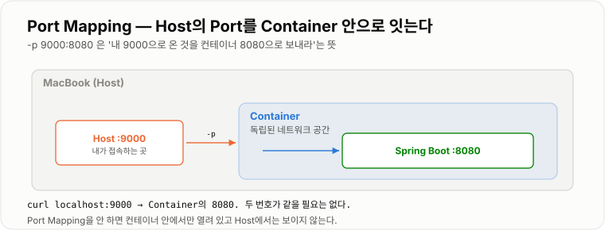
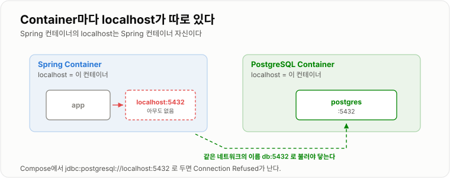

# 2. Docker

> **Docker는 "실행에 필요한 환경 전부"를 한 덩어리로 묶어 어디서든 같은 모습으로 띄운다.**

앞 장의 IP·Port 이야기가 여기서 한 겹 더 접힌다. 컨테이너는 자기만의 네트워크 공간을 갖기 때문에
**Host의 Port와 Container의 Port가 따로 논다.** 이 장의 절반은 그 이야기다.

---

## Docker가 필요한 이유

서버를 실행하려면 여러 환경이 필요하다.

```text
Java 21
환경변수
설정파일
라이브러리
애플리케이션
```

그런데 개발 PC와 운영 서버 환경이 다르면 문제가 발생한다.

```text
개발자: "제 컴퓨터에서는 되는데요?"
```

전설의 주문이다.

Docker는 애플리케이션 실행 환경을 하나로 묶어 실행할 수 있게 한다.

```text
Docker Image
├ Java
├ Spring
├ 설정
└ 애플리케이션
```

덕분에 개발 PC와 서버에서 동일한 환경으로 실행할 수 있다.

!!! note "VM과 뭐가 다른가"

    VM은 OS(커널)를 통째로 하나 더 띄운다. Container는 Host의 커널을 함께 쓰고
    프로세스·파일시스템·네트워크만 격리한다. 그래서 훨씬 가볍고 몇 초 만에 뜬다.
    대신 커널을 공유하므로 Linux 컨테이너는 결국 Linux 커널 위에서 돈다.
    (Mac·Windows의 Docker Desktop은 뒤에서 조용히 리눅스 VM을 하나 돌리고 있다.)

---

## Image

Image는 Container를 만들기 위한 **실행 환경 템플릿**이다. 읽기 전용이다.

```text
Image     = 클래스
Container = 객체
```

하나의 Image에서 여러 Container를 만들 수 있다.

```bash
docker images                  # 가지고 있는 Image 목록
docker pull nginx:1.27         # 받아만 두기
docker rmi nginx:1.27          # 지우기
```

### Layer — 빌드가 빨라지는 이유

Image는 여러 겹(Layer)이 쌓인 구조다. Dockerfile의 명령 한 줄이 대체로 한 Layer가 되고,
**바뀌지 않은 Layer는 다시 만들지 않고 캐시를 쓴다.**

```text
Layer 4   COPY app.jar          ← 코드를 고치면 여기부터 다시
Layer 3   COPY 의존성
Layer 2   WORKDIR /app          ← 여기까지는 캐시 재사용
Layer 1   FROM eclipse-temurin:21-jre
```

그래서 **자주 바뀌는 것을 아래에 둔다.** 소스는 매번 바뀌고 JDK는 거의 안 바뀌므로,
`COPY app.jar` 가 맨 아래에 있으면 빌드가 수십 초에서 몇 초로 줄어든다.

이름표(Tag)는 `이름:태그` 형식이고 태그를 생략하면 `latest` 가 붙는다.

```text
my-spring-app:1.0.2
ghcr.io/insoo/my-spring-app:1.0.2      ← Registry 주소가 앞에 붙은 형태
```



*Image는 그대로 두고 Container만 몇 개든 찍어낸다.*

---

## Container

Container는 Image를 실제로 실행한 상태다.

```bash
docker run nginx
```

를 실행하면 nginx Image를 이용해 Container가 실행된다.

| 명령 | 하는 일 |
| -- | -- |
| `docker ps` | 실행 중인 것 |
| `docker ps -a` | 종료된 것까지 전부 |
| `docker logs -f backend` | 로그 실시간으로 보기 |
| `docker exec -it backend sh` | 컨테이너 안으로 들어가기 |
| `docker stop backend` | 중지 |
| `docker rm backend` | 삭제 |
| `docker stats` | CPU·메모리 실시간 |

실제로 쓰는 `docker run` 은 옵션이 붙는다.

```bash
docker run -d \                 # 백그라운드로 (안 붙이면 터미널이 붙잡힌다)
  --name backend \              # 이름. 이후 id 대신 이름으로 다룬다
  -p 8080:8080 \                # Port Mapping
  -e SPRING_PROFILES_ACTIVE=prod \
  --restart unless-stopped \    # 죽으면 자동 재시작
  my-spring-app:1.0.2
```

### 컨테이너는 프로세스 하나짜리 상자다

`ENTRYPOINT` 로 지정한 **프로세스가 끝나면 컨테이너도 끝난다.**
`docker ps` 에 안 보이고 `docker ps -a` 에만 `Exited (1)` 로 보인다면, 앱이 뜨다가 죽은 것이다.
이때 원인은 로그에 있다.

```bash
docker ps -a                    # STATUS 칸 확인
docker logs backend             # 왜 죽었는지
```

### 핵심

```text
Image  ──docker run──▶  Container
```

---

## Dockerfile

Dockerfile은 **"내 Image를 어떻게 만들 것인가?"** 를 작성하는 파일이다.

```dockerfile
FROM eclipse-temurin:21-jre

WORKDIR /app

COPY build/libs/app.jar app.jar

ENTRYPOINT ["java", "-jar", "app.jar"]
```

| 명령 | 의미 |
| -- | -- |
| `FROM` | 어떤 기반 이미지 위에 쌓을지. `-jre` 는 실행 전용이라 `-jdk` 보다 가볍다 |
| `WORKDIR` | 컨테이너 안 작업 디렉터리. 이후 명령의 기준 경로가 된다 |
| `COPY` | Host의 파일을 이미지 안으로. **빌드 시점에** 들어간다 |
| `ENTRYPOINT` | 컨테이너가 실행할 명령. 이 프로세스가 곧 컨테이너의 수명이다 |
| `EXPOSE` | "이 포트를 쓴다"는 문서용 표시. 실제로 열어 주지는 않는다 |

### 빌드와 실행

```bash
./gradlew clean bootJar                 # 먼저 jar를 만든다
docker build -t my-spring-app:1.0.2 .   # -t 이름, 마지막 . 은 빌드 컨텍스트
docker run -d -p 8080:8080 --name backend my-spring-app:1.0.2
curl -i localhost:8080/actuator/health
```

### `.dockerignore` — 없으면 빌드가 느리고 위험하다

마지막 `.` 은 "이 디렉터리 전체를 Docker에 넘긴다"는 뜻이다.
`.git`, `build`, `.env` 까지 통째로 넘어가면 느릴 뿐 아니라 비밀값이 이미지에 섞일 수 있다.

```text
.git
.gradle
build
!build/libs/*.jar
*.env
```

### Multi-stage — jar 빌드까지 Docker 안에서

위 방식은 "내 PC에 Gradle과 JDK가 있어야" 한다. 빌드까지 컨테이너 안에서 하면
어느 머신에서든 같은 결과가 나오고, CI에서도 그대로 쓸 수 있다.

```dockerfile
# ── ① 빌드 단계 ──
FROM eclipse-temurin:21-jdk AS build
WORKDIR /src

COPY gradlew settings.gradle build.gradle ./
COPY gradle gradle
RUN ./gradlew dependencies --no-daemon      # 의존성만 먼저 → 캐시가 살아 있다

COPY src src
RUN ./gradlew bootJar --no-daemon

# ── ② 실행 단계 ──
FROM eclipse-temurin:21-jre
WORKDIR /app

COPY --from=build /src/build/libs/*.jar app.jar

EXPOSE 8080
ENTRYPOINT ["java", "-jar", "app.jar"]
```

`--from=build` 로 **결과물만** 가져오기 때문에 최종 이미지에 JDK와 Gradle이 남지 않는다.
보통 500MB 넘던 이미지가 200MB대로 줄어든다.



*레시피(Dockerfile) → 완제품(Image) → 실행 중(Container) 세 단계다.*

---

## Port Mapping

Container는 독립적인 네트워크 공간을 가진다.
Spring이 Container 내부에서 `8080`으로 실행된다고 해도 Host에서 바로 접근할 수 있는 것은 아니다.

```bash
docker run -p 8080:8080 my-spring-app
```

형식은 `-p HostPort:ContainerPort` 다. **왼쪽이 내가 접속할 번호**다.

```text
MacBook :8080  →  Container :8080  →  Spring
```

두 번호가 같을 필요는 없다. 8080이 이미 쓰이고 있으면 이렇게 피한다.

```bash
docker run -p 9000:8080 my-spring-app     # localhost:9000 으로 접속
docker port backend                        # 지금 걸린 매핑 확인
```

### 안 될 때 보는 세 가지

| 증상 | 원인 |
| -- | -- |
| `curl localhost:9000` 이 거절됨 | `-p` 를 안 붙였다. 컨테이너 안에서만 열려 있다 |
| 매핑은 했는데 여전히 거절 | 앱이 컨테이너 안에서 `127.0.0.1` 에 bind 됐다. `0.0.0.0` 이어야 한다 |
| `port is already allocated` | Host의 그 번호를 다른 컨테이너가 쓰고 있다. `docker ps` 로 확인 |

두 번째가 1장의 bind 이야기와 정확히 같은 문제다.
컨테이너 안에서의 `127.0.0.1` 은 그 컨테이너 자신이므로, Host에서 아무리 매핑해도 닿지 않는다.



*앞의 번호가 Host, 뒤의 번호가 Container다.*

---

## Volume

Container 내부 데이터는 Container가 삭제되면 같이 사라진다. DB에서는 치명적이다.
그래서 데이터를 Container 밖에 저장한다.

```bash
docker volume create postgres-data

docker run -d --name db \
  -e POSTGRES_PASSWORD=secret \
  -v postgres-data:/var/lib/postgresql/data \
  postgres:16
```

`-v 이름:컨테이너경로` 형식이다. 컨테이너 경로는 **그 프로그램이 데이터를 쓰는 위치**다.

| 이미지 | 데이터 경로 |
| -- | -- |
| postgres | `/var/lib/postgresql/data` |
| mysql | `/var/lib/mysql` |
| redis | `/data` |

### 두 가지 방식

```bash
-v postgres-data:/var/lib/postgresql/data      # ① named volume — Docker가 관리
-v ./nginx.conf:/etc/nginx/nginx.conf:ro       # ② bind mount — Host 경로를 직접
```

①은 데이터용이다. 위치를 신경 쓸 필요가 없고 성능도 낫다.
②는 **설정 파일처럼 밖에서 고치고 싶은 것**에 쓴다. `:ro` 는 읽기 전용이라는 뜻이다.

```bash
docker volume ls
docker volume inspect postgres-data     # 실제 저장 위치
docker volume rm postgres-data          # 지우면 데이터도 사라진다
```

### 확인해 보기

```bash
docker exec -it db psql -U postgres -c "create table t(id int);"
docker rm -f db                          # 컨테이너를 지우고
docker run -d --name db -e POSTGRES_PASSWORD=secret \
  -v postgres-data:/var/lib/postgresql/data postgres:16
docker exec -it db psql -U postgres -c "\dt"    # 테이블이 그대로 있다
```

### 핵심

Container는 없어져도 Volume은 남는다.

---

## Environment Variable

서버마다 설정이 달라진다. DB 주소, Password, API Key, Profile 같은 것들이다.
이걸 코드나 이미지에 박아 두면 **환경마다 이미지를 새로 만들어야 한다.**

```bash
docker run \
  -e SPRING_PROFILES_ACTIVE=prod \
  -e SPRING_DATASOURCE_PASSWORD=secret \
  my-spring-app
```

Spring 쪽은 이렇게 받는다. `${이름:기본값}` 이라 환경 변수가 없으면 `local` 이 쓰인다.

```yaml
spring:
  profiles:
    active: ${SPRING_PROFILES_ACTIVE:local}
  datasource:
    url: ${SPRING_DATASOURCE_URL:jdbc:postgresql://localhost:5432/app}
    password: ${SPRING_DATASOURCE_PASSWORD:}
```

### Relaxed Binding — 사실 위 코드도 필요 없다

Spring Boot는 `SPRING_DATASOURCE_PASSWORD` 같은 대문자·언더스코어 이름을
`spring.datasource.password` 로 알아서 바꿔 읽는다.
그래서 `application.yml` 을 건드리지 않고 **환경 변수만으로 어떤 설정이든 덮어쓸 수 있다.**

```text
SPRING_DATASOURCE_URL       →  spring.datasource.url
SERVER_PORT                 →  server.port
LOGGING_LEVEL_ROOT          →  logging.level.root
```

값이 많아지면 파일로 뺀다.

```bash
docker run --env-file ./prod.env my-spring-app
```

```text
# prod.env  ← .gitignore 에 반드시 넣는다
SPRING_PROFILES_ACTIVE=prod
SPRING_DATASOURCE_PASSWORD=secret
```

### 핵심

```text
같은 이미지  +  다른 환경 변수  =  다른 환경
```

이미지는 하나로 두고 dev·prod를 환경 변수로만 가르는 것이 목표다.
그래야 "테스트한 그 이미지"를 그대로 운영에 올릴 수 있다.

---

## Container Network

Container 각각은 자기만의 네트워크 환경을 가진다.
따라서 Container A의 `localhost`는 A 자신이고, Container B의 `localhost`는 B 자신이다.

Spring Container에서 `localhost:5432`로 DB에 접근하면
PostgreSQL Container가 아니라 **Spring Container 자신**에게 접근하게 되고, Connection Refused가 난다.

### 해결 — 같은 네트워크에 올리고 이름으로 부른다

```bash
docker network create app-net

docker run -d --name db --network app-net \
  -e POSTGRES_PASSWORD=secret postgres:16

docker run -d --name api --network app-net -p 8080:8080 \
  -e SPRING_DATASOURCE_URL=jdbc:postgresql://db:5432/postgres \
  -e SPRING_DATASOURCE_PASSWORD=secret \
  my-spring-app
```

`app-net` 안에서는 Docker의 내부 DNS가 **컨테이너 이름을 IP로 바꿔 준다.**
그래서 `db:5432` 가 통한다. 여기 쓰는 5432는 컨테이너 안쪽 포트라, `-p` 매핑과는 무관하다.

```bash
docker exec -it api sh
# getent hosts db      →  172.18.0.3   db
```

이걸 매번 손으로 하기 번거로워서 나온 것이 다음 장의
[Docker Compose](../03-Docker-Compose/03-Docker-Compose.md)다.



*컨테이너 사이에서는 localhost가 아니라 이름으로 부른다.*

!!! note "컨테이너에서 Host의 프로그램을 부르고 싶다면"

    반대 방향도 있다. 컨테이너 안에서 Host(내 PC)에 떠 있는 DB에 붙어야 할 때가 있다.
    이때는 `host.docker.internal` 이라는 이름을 쓴다.
    (Linux에서는 `--add-host=host.docker.internal:host-gateway` 를 붙여야 생긴다.)

---

## 정리와 청소

이미지와 볼륨은 조용히 쌓인다. 디스크가 찼다면 여기부터 본다.

```bash
docker system df                # 무엇이 얼마나 차지하는지
docker image prune              # 태그 없는(dangling) 이미지 정리
docker container prune          # 종료된 컨테이너 정리
docker system prune -a          # 안 쓰는 것 전부 (주의: 이미지도 지운다)
```

`docker system prune` 에 `--volumes` 를 붙이면 **데이터까지 사라진다.** 습관적으로 붙이지 않는다.
