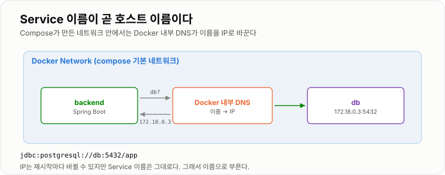

# 3. Docker Compose

> **여러 Container를 하나의 애플리케이션 단위로 묶어 파일 하나로 관리한다.**

앞 장에서 `docker network create` 와 `docker run` 을 여러 번 친 그 일을,
YAML 하나와 `docker compose up` 한 줄로 대신한다.
이 장을 끝까지 따라가면 **Nginx + Spring + PostgreSQL 3단 구성이 실제로 뜬다.**

---

## Docker Compose 역할

서비스가 커지면 여러 Container가 필요하다.

```text
Frontend
Backend
PostgreSQL
Redis
Nginx
```

각각 `docker run`을 실행하기 번거롭다. Docker Compose를 사용하면 하나의 YAML로 관리할 수 있다.

파일 이름은 `compose.yaml`(또는 `docker-compose.yml`)이고, 그 파일이 있는 디렉터리에서 실행한다.

| 명령 | 하는 일 |
| -- | -- |
| `docker compose up -d` | 전부 띄운다 (`-d` 는 백그라운드) |
| `docker compose up -d --build` | 이미지를 다시 빌드하고 띄운다 |
| `docker compose ps` | 상태 확인 |
| `docker compose logs -f backend` | 특정 서비스 로그 |
| `docker compose exec backend sh` | 컨테이너 안으로 |
| `docker compose restart backend` | 하나만 재시작 |
| `docker compose down` | 컨테이너·네트워크 삭제 (**Volume은 남는다**) |
| `docker compose down -v` | Volume까지 삭제 (**데이터가 사라진다**) |

### 핵심

Docker Compose는 여러 Container를 하나의 애플리케이션 단위로 관리한다.
`up` 한 번에 네트워크 생성 → 이미지 빌드 → 의존 순서대로 기동까지 이어진다.

---

## Service

Compose에서는 Container 구성을 Service라는 단위로 정의한다.

```yaml
services:

  backend:
    image: my-backend

  db:
    image: postgres
```

여기서 `backend` 와 `db` 가 Service 이름이다.
`docker run` 의 옵션들이 그대로 키가 된다고 보면 대응이 쉽다.

| `docker run` | Compose |
| -- | -- |
| `-p 8080:8080` | `ports: ["8080:8080"]` |
| `-e KEY=value` | `environment:` |
| `-v data:/path` | `volumes:` |
| `--name backend` | Service 이름이 곧 이름 |
| `--network app-net` | 기본 네트워크에 자동 연결 |
| `--restart unless-stopped` | `restart: unless-stopped` |

---

## Container 간 통신

Compose로 실행한 Service들은 **자동으로 같은 Docker Network에 연결된다.**
`<프로젝트명>_default` 라는 이름으로 만들어지고, 프로젝트명은 기본적으로 디렉터리 이름이다.

```bash
docker network ls
# myapp_default   bridge   local
```

그래서 `docker network create` 를 따로 칠 일이 없다.

---

## Service Name 기반 통신

Spring에서 PostgreSQL에 접근할 때 `localhost:5432` 가 아니라 `db:5432` 로 접근한다.

```yaml
spring:
  datasource:
    url: jdbc:postgresql://db:5432/app
```

Docker의 내부 DNS가 `db` 라는 이름을 PostgreSQL Container의 IP로 찾아준다.

여기서 쓰는 포트는 **컨테이너 안쪽 포트**다. `ports:` 로 Host에 노출한 번호와는 상관없다.
`ports: ["5433:5432"]` 로 매핑해 두었어도 backend는 여전히 `db:5432` 로 붙는다.

```text
Host에서 DB툴로 접속할 때   →  localhost:5433   (ports 왼쪽)
backend에서 붙을 때         →  db:5432          (컨테이너 안쪽)
```

이 두 줄을 헷갈리는 것이 Compose에서 가장 흔한 실수다.

```bash
docker compose exec backend sh
# getent hosts db     →  172.18.0.3   db
```



*IP는 바뀌어도 Service 이름은 그대로라, 이름으로 부르는 것이 안전하다.*

---

## Volume 영속성

Compose에서도 Volume을 정의한다. 파일 맨 아래 `volumes:` 블록에 이름을 선언해 두고,
Service 안에서 그 이름을 쓴다.

```yaml
services:
  db:
    image: postgres:16
    volumes:
      - postgres-data:/var/lib/postgresql/data

volumes:
  postgres-data:
```

Container를 삭제해도 Volume을 유지하면 DB 데이터가 남는다.

```bash
docker compose down            # 데이터는 남는다
docker compose down -v         # 초기화. 되돌릴 수 없다
```

---

## depends_on 과 healthcheck

`depends_on` 은 **'먼저 시작'일 뿐 '준비 완료'가 아니다.**
컨테이너가 떴다고 PostgreSQL이 접속을 받을 준비가 된 것은 아니라서,
첫 기동에서 backend가 연결 실패로 죽는 일이 흔하다.

`healthcheck` 로 "정말 준비됐는지"를 정의하고, `condition: service_healthy` 로 그걸 기다린다.

```yaml
  db:
    image: postgres:16
    healthcheck:
      test: ["CMD-SHELL", "pg_isready -U app -d app"]
      interval: 5s
      timeout: 3s
      retries: 10

  backend:
    depends_on:
      db:
        condition: service_healthy      # db 가 healthy 가 될 때까지 기다린다
```

```bash
docker compose ps
# NAME   STATUS
# db     Up 30 seconds (healthy)      ← 이 괄호가 healthcheck 결과다
```

---

## 전체 예제 — Nginx + Spring + PostgreSQL

여기까지를 하나로 합치면 이 파일이 된다. 이대로 두고 `docker compose up -d` 하면 뜬다.

```yaml
services:

  nginx:
    image: nginx:1.27
    ports:
      - "80:80"                                  # 밖에 열리는 유일한 문
    volumes:
      - ./nginx.conf:/etc/nginx/conf.d/default.conf:ro
    depends_on:
      - backend
    restart: unless-stopped

  backend:
    build: .                                     # 이 디렉터리의 Dockerfile
    environment:
      SPRING_PROFILES_ACTIVE: prod
      SPRING_DATASOURCE_URL: jdbc:postgresql://db:5432/app
      SPRING_DATASOURCE_USERNAME: app
      SPRING_DATASOURCE_PASSWORD: ${DB_PASSWORD}   # .env 에서 읽는다
    depends_on:
      db:
        condition: service_healthy
    restart: unless-stopped
    # ports 를 두지 않는다 — 밖에서는 Nginx를 통해서만 들어온다

  db:
    image: postgres:16
    environment:
      POSTGRES_DB: app
      POSTGRES_USER: app
      POSTGRES_PASSWORD: ${DB_PASSWORD}
    volumes:
      - postgres-data:/var/lib/postgresql/data
    healthcheck:
      test: ["CMD-SHELL", "pg_isready -U app -d app"]
      interval: 5s
      timeout: 3s
      retries: 10
    restart: unless-stopped

volumes:
  postgres-data:
```

같은 디렉터리에 `nginx.conf` 를 둔다. (설정의 의미는 [4장](../04-Nginx/04-Nginx.md)에서 다룬다.)

```nginx
server {
    listen 80;

    location / {
        proxy_pass http://backend:8080;
        proxy_set_header Host              $host;
        proxy_set_header X-Real-IP         $remote_addr;
        proxy_set_header X-Forwarded-For   $proxy_add_x_forwarded_for;
        proxy_set_header X-Forwarded-Proto $scheme;
    }
}
```

비밀값은 `.env` 로 뺀다. Compose는 같은 디렉터리의 `.env` 를 자동으로 읽어
`${DB_PASSWORD}` 를 치환한다. **이 파일은 `.gitignore` 에 넣는다.**

```text
DB_PASSWORD=change-me
```

### 띄우고 확인하기

```bash
docker compose up -d --build
docker compose ps                       # 셋 다 Up 인지
curl -i localhost/actuator/health       # 80 → nginx → backend:8080
docker compose logs -f backend
```

### 이 구성이 말해 주는 것

`ports` 가 nginx에만 있다는 점이 핵심이다.
backend와 db는 **Host에 아예 노출되지 않고** 컨테이너 네트워크 안에서만 서로를 부른다.
5장의 방화벽 이야기를 컨테이너 수준에서 미리 해 두는 셈이다.
개발 중에 DB툴로 붙어야 한다면 그때만 `ports: ["5432:5432"]` 를 잠깐 추가한다.

---

## 자주 막히는 곳

| 증상 | 원인과 해결 |
| -- | -- |
| `Connection refused` to db | URL이 `localhost:5432` 다. `db:5432` 로 바꾼다 |
| 첫 기동만 실패, 재시작하면 성공 | `healthcheck` + `condition: service_healthy` 를 안 걸었다 |
| 코드를 고쳤는데 반영이 안 됨 | `up -d` 는 이미지를 다시 안 만든다. `--build` 를 붙인다 |
| 환경 변수가 비어 있음 | `.env` 가 compose 파일과 다른 디렉터리에 있다 |
| `port is already allocated` | Host의 그 포트를 다른 것이 쓰고 있다. `lsof -i :80` |
| `down` 했더니 데이터가 날아감 | `-v` 를 붙였다. Volume 삭제는 되돌릴 수 없다 |

```bash
docker compose config      # 변수 치환까지 끝난 최종 설정을 출력한다 — 디버깅에 유용
```
