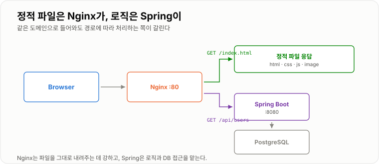
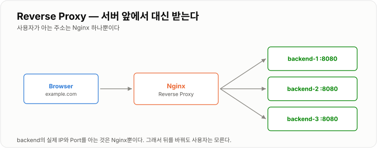
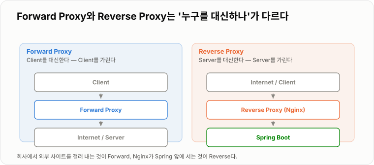

# 4. Nginx

> **Nginx는 사용자와 애플리케이션 사이에 서서 정적 파일·라우팅·HTTPS·분산을 대신 맡는다.**

Spring을 그대로 노출해도 서비스는 된다. 앞에 Nginx를 두는 이유는
Spring이 하지 않아도 되는 일을 떼어내고, 뒤를 바꿔도 사용자가 모르게 하기 위해서다.

---

## Nginx 역할

Spring을 직접 사용자에게 노출할 수도 있다.

```text
Browser  →  Spring :8080
```

하지만 앞에 Nginx를 둘 수 있다.

```text
Browser  →  Nginx :80  →  Spring :8080
```

Nginx가 대신 맡아 주는 일은 이런 것들이다.

| 역할 | 왜 Nginx가 하나 |
| -- | -- |
| 정적 파일 제공 | 파일을 그대로 내려보내는 데 최적화되어 있다 |
| Reverse Proxy | 뒤의 주소를 감추고, 경로별로 나눠 보낸다 |
| HTTPS 종료 | 인증서를 한 곳에서만 관리하면 된다 |
| Load Balancing | 여러 대로 나눠 보낸다 |
| 압축·캐시·업로드 제한 | 애플리케이션 코드를 안 건드리고 처리한다 |

### 설정 파일 구조

```text
/etc/nginx/nginx.conf              ← 전역 설정
/etc/nginx/conf.d/*.conf           ← 여기에 사이트별 server 블록을 둔다
```

```nginx
server {
    listen 80;
    server_name example.com;        # Host 헤더가 이것과 맞는 요청만 이 블록이 처리

    location / {
        root /usr/share/nginx/html;
    }

    location /api/ {
        proxy_pass http://backend:8080;
    }
}
```

`server_name` 은 1장에서 본 **`Host` 헤더**와 맞춰 본다.
IP 하나에 여러 도메인을 올릴 수 있는 것이 이 덕분이다.

### 반영은 항상 두 단계

설정을 고치면 **검사 → 재적용** 순서로 한다. 검사를 건너뛰면 문법 오류 하나로 서비스가 내려간다.

```bash
nginx -t              # 문법 검사. "syntax is ok" 가 나와야 한다
nginx -s reload       # 무중단 재적용 (기존 연결은 끊기지 않는다)
```

Compose 환경이라면 이렇게 한다.

```bash
docker compose exec nginx nginx -t
docker compose exec nginx nginx -s reload
```

---

## Web Server

Web Server는 HTTP 요청을 받아 처리하는 서버다.
특히 HTML, CSS, JS, 이미지 같은 정적 파일을 제공하는 데 적합하다.

```text
Browser  GET /index.html  →  Nginx  →  index.html
```

Spring Boot 같은 Application Server는 비즈니스 로직을 처리한다.

```text
GET /api/users  →  Spring  →  DB 조회  →  JSON
```

정적 파일을 Spring까지 보내면 톰캣 스레드를 하나 붙잡는다.
이미지 20개짜리 페이지 하나가 스레드 20개를 잠깐씩 먹는 셈이다.
Nginx는 그 일을 스레드를 잡지 않는 방식으로 처리하도록 만들어져 있어서, 앞에서 끊는 편이 낫다.

```nginx
location / {
    root  /usr/share/nginx/html;
    index index.html;
    try_files $uri $uri/ /index.html;    # SPA — 없는 경로는 index.html 로
}

location ~* \.(js|css|png|jpg|svg|woff2)$ {
    root       /usr/share/nginx/html;
    expires    30d;                      # 브라우저 캐시
    access_log off;
}
```



*같은 도메인으로 들어와도 경로에 따라 처리하는 쪽이 갈린다.*

---

## Reverse Proxy

Reverse Proxy는 Client 대신 Backend Server 앞에서 요청을 받는다.
사용자는 `https://example.com/api/users` 만 호출하고, Nginx가 내부적으로 `backend:8080` 으로 전달한다.

```nginx
location /api/ {
    proxy_pass http://backend:8080;
}
```

### 헤더를 넘기지 않으면 Spring이 눈을 감는다

기본 상태로 두면 Spring이 보는 Client IP가 **전부 Nginx의 IP**가 되고,
HTTPS로 들어왔는지도 알 수 없다. 그래서 원래 요청 정보를 헤더로 넘겨 준다.

```nginx
location /api/ {
    proxy_pass http://backend:8080;

    proxy_set_header Host              $host;               # 원래 도메인
    proxy_set_header X-Real-IP         $remote_addr;        # 진짜 Client IP
    proxy_set_header X-Forwarded-For   $proxy_add_x_forwarded_for;
    proxy_set_header X-Forwarded-Proto $scheme;             # http / https

    proxy_connect_timeout 5s;
    proxy_read_timeout    60s;      # 뒤가 느릴 때 504까지 기다리는 시간
}
```

```yaml
server:
  forward-headers-strategy: framework   # Spring이 위 헤더를 신뢰하도록
```

이 설정이 없으면 로그의 IP가 전부 같아지고,
HTTPS 사이트인데 Spring이 만든 리다이렉트가 `http://` 로 나가는 문제가 생긴다.

### WebSocket을 쓴다면 두 줄이 더 필요하다

```nginx
location /ws/ {
    proxy_pass http://backend:8080;
    proxy_http_version 1.1;
    proxy_set_header Upgrade    $http_upgrade;
    proxy_set_header Connection "upgrade";
}
```



*backend의 실제 주소를 아는 것은 Nginx뿐이다.*

---

## Forward Proxy

Forward Proxy는 Client 앞에 존재한다.

```text
Client  →  Proxy  →  Internet
```

Reverse Proxy는 Server 앞에 존재한다.

```text
Internet  →  Reverse Proxy  →  Server
```

### 쉽게 구분

```text
Forward Proxy → Client를 대신함 (Client를 가린다)
Reverse Proxy → Server를 대신함 (Server를 가린다)
```

회사에서 외부 사이트 접속을 걸러 내는 장치가 Forward Proxy,
Nginx가 Spring 앞에 서는 것이 Reverse Proxy다.
**누가 그 Proxy의 존재를 아느냐**로도 갈린다. Forward는 Client가 알고 설정해야 하고,
Reverse는 Client가 존재조차 모른다.



*Proxy가 Client 쪽에 붙느냐 Server 쪽에 붙느냐의 차이다.*

---

## Load Balancing

Backend 서버가 여러 개라면 요청을 나눠 보낼 수 있다.
목적은 트래픽 분산, 서버 한 대의 부하 감소, 장애 대응이다.

```nginx
upstream backend {
    server backend-1:8080 max_fails=3 fail_timeout=10s;
    server backend-2:8080 max_fails=3 fail_timeout=10s;
}

server {
    location /api/ {
        proxy_pass http://backend;      # upstream 이름을 쓴다
    }
}
```

`max_fails` · `fail_timeout` 은 "3번 실패하면 10초간 그 서버를 빼 둔다"는 뜻이다.
한 대가 죽어도 그쪽으로 계속 보내지 않는다.

분배 방식은 세 가지만 알면 된다.

| 방식 | 설정 | 언제 |
| -- | -- | -- |
| Round Robin | 기본값 | 대부분 |
| Least Connections | `least_conn;` | 요청 처리 시간 편차가 클 때 |
| IP Hash | `ip_hash;` | 같은 Client를 같은 서버로 붙여야 할 때 |

!!! warning "세션을 서버 메모리에 두면 여기서 깨진다"

    요청마다 다른 서버로 가기 때문에 로그인이 풀린다.
    `ip_hash` 로 임시로 붙일 수는 있지만, 그 서버가 죽으면 세션도 같이 죽는다.
    제대로 된 해법은 세션을 Redis 같은 공용 저장소로 빼거나, JWT처럼 상태를 두지 않는 것이다.

---

## proxy_pass

Nginx에서 요청을 다른 서버로 전달할 때 사용한다.

```text
Browser /api/users  →  Nginx  →  backend:8080  →  Spring
```

### 끝의 `/` 하나로 경로가 달라진다

가장 자주 걸리는 함정이다.

```nginx
location /api/ { proxy_pass http://backend:8080;  }   # → backend:8080/api/users
location /api/ { proxy_pass http://backend:8080/; }   # → backend:8080/users
```

`/` 가 **있으면** `location` 에 매칭된 부분(`/api/`)을 떼고 뒤만 붙인다.
**없으면** 원래 경로를 그대로 전달한다.

```text
Spring의 컨트롤러가 @GetMapping("/api/users")  →  / 없이
Spring의 컨트롤러가 @GetMapping("/users")      →  / 붙여서
```

"Nginx는 200인데 Spring이 404"라면 십중팔구 여기다.

### location 매칭 우선순위

같은 요청에 여러 `location` 이 걸릴 수 있다. 순서가 아니라 규칙으로 정해진다.

```nginx
location = /health      { ... }   # ① 정확히 일치 — 가장 먼저
location ^~ /static/    { ... }   # ② 접두사 우선
location ~* \.(png|js)$ { ... }   # ③ 정규식 (대소문자 무시)
location /api/          { ... }   # ④ 일반 접두사
location /              { ... }   # ⑤ 나머지 전부
```

---

## 502 Bad Gateway

Nginx는 정상적으로 요청을 받았는데 뒤의 Backend에서 정상적인 응답을 받을 수 없을 때 502가 발생한다.

```text
Browser → Nginx 정상 → Spring DOWN
```

**502가 뜬 순간 확실해지는 것이 하나 있다. Nginx까지는 요청이 도달했다.**
그러니 DNS·방화벽·Nginx 기동은 의심 목록에서 지우고, 그 뒤만 본다.

### 원인 세 가지

```text
① Backend가 죽었다           → docker compose ps
② 주소나 Port가 틀렸다        → proxy_pass 를 확인
③ Backend가 뜨는 중이다       → 기동 직후라면 잠깐 기다린다
```

### 확인 순서

```bash
docker compose ps                       # backend 가 Up 인가
docker compose logs --tail 50 backend   # 떠 있는데 예외로 죽고 있나
docker compose exec nginx \
  curl -I http://backend:8080/actuator/health    # Nginx에서 backend 가 보이나
docker compose exec nginx cat /var/log/nginx/error.log | tail -20
```

`error.log` 의 이 한 줄이 결정적이다. Nginx가 **실제로 어느 주소로 붙으려 했는지**가 찍힌다.

```text
connect() failed (111: Connection refused) while connecting to upstream,
upstream: "http://172.18.0.4:8080/api/users"
```

### 직접 재현해 보기

```bash
docker compose stop backend
curl -i localhost/api/users     # 502 Bad Gateway
docker compose start backend
curl -i localhost/api/users     # 200
```

### 곁가지로 자주 만나는 코드

| 코드 | 뜻 | 볼 곳 |
| -- | -- | -- |
| 502 | 뒤가 죽었거나 주소가 틀렸다 | `docker compose ps`, `proxy_pass` |
| 504 | 뒤가 살아 있는데 제한 시간 안에 응답 못 함 | 느린 쿼리·외부 API, `proxy_read_timeout` |
| 413 | 업로드가 너무 크다 | `client_max_body_size 20m;` |
| 499 | Client가 기다리다 먼저 끊었다 | 사실상 504와 같은 원인 |
