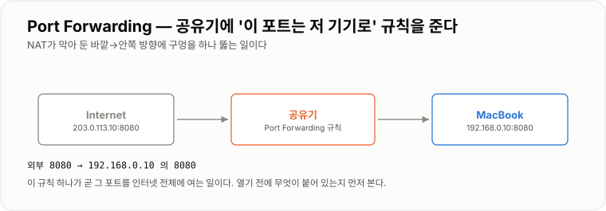
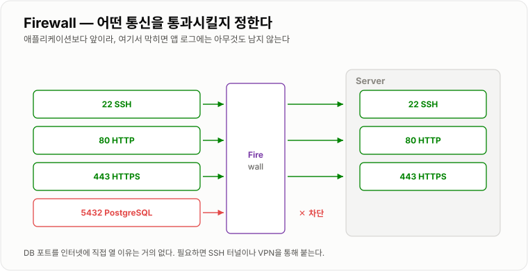
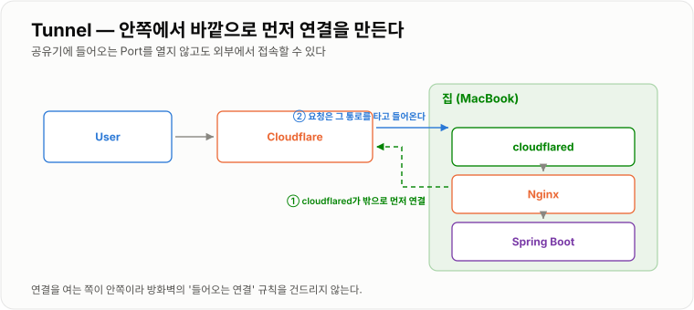

# 5. 외부 접속

> **NAT는 밖에서 안으로 들어오는 길을 기본적으로 막는다. 그 길을 여는 방법이 Port Forwarding과 Tunnel이다.**

같은 Wi-Fi에서는 IP만 알면 붙을 수 있었다. 인터넷에서 내 서버로 들어오게 하려면
공유기·방화벽을 한 겹씩 통과시켜야 하고, 그때마다 보안 판단이 따라붙는다.

---

## 공유기 역할

집에서 Wi-Fi를 제공하는 장치가 단순히 Wi-Fi만 제공하는 것은 아니다.

* 내부 Network 구성
* Private IP 할당 (DHCP)
* NAT
* Internet 연결
* 기본 방화벽

```text
Mac ─────┐
iPhone ──┼→ 공유기 → Internet
TV ──────┘
```

---

## NAT

앞에서 배운 것처럼 Private IP와 Public IP 사이를 변환한다.
핵심은 방향이다.

```text
안 → 밖   자연스럽다   (나갈 때 변환 기록이 남으니 응답이 돌아올 수 있다)
밖 → 안   막힌다       (기록이 없으니 어느 기기에 넘길지 모른다)
```

그래서 외부 접속을 열려면 둘 중 하나를 택한다.

| 방법 | 방향 | 공유기 설정 | 성격 |
| -- | -- | -- | -- |
| Port Forwarding | 밖 → 안 | 필요 | 규칙을 직접 심는다 |
| Tunnel | 안 → 밖 | 불필요 | 안에서 연결을 먼저 만든다 |

---

## Port Forwarding

외부에서 공유기 Public IP로 들어온 요청을 특정 내부 서버로 전달하는 설정이다.

```text
Public IP:8080  →  공유기  →  192.168.0.10:8080  →  Spring
```

공유기 관리 페이지(보통 `192.168.0.1`)의 **포트포워딩 / NAT 설정** 메뉴에서
이런 규칙 한 줄을 넣는 일이다.

```text
규칙 이름   spring
프로토콜    TCP
외부 Port   8080
내부 IP     192.168.0.10
내부 Port   8080
```

내부 IP는 DHCP로 바뀔 수 있으니, **포워딩할 기기는 먼저 고정 IP로 잡아 둔다.**
안 그러면 며칠 뒤 규칙이 엉뚱한 기기를 가리킨다.

### 열었는지 확인하는 법

같은 Wi-Fi 안에서 `curl` 해 보는 것은 **확인이 되지 않는다.** 그 요청은 공유기를 안 거친다.
반드시 바깥 네트워크에서 확인한다.

```bash
curl ifconfig.me                              # 내 Public IP
```

```bash
# 폰의 Wi-Fi를 끄고 LTE 상태에서
curl -i http://203.0.113.10:8080/actuator/health
```

### 주의 — 여는 순간 스캔이 붙는다

Port를 인터넷에 직접 공개한다는 뜻이다. 열어 둔 Port에는 몇 분 안에 자동화된 스캔이 들어온다.
열기 전에 세 가지를 확인한다.

```text
① 그 뒤에 뭐가 있나        — 관리 페이지·DB가 그대로 붙어 있지 않은가
② 인증이 걸려 있나          — 인증 없는 API가 노출되지 않는가
③ 꼭 그 Port여야 하나       — 22, 3306, 5432 를 여는 것은 거의 항상 나쁜 선택
```

가능하면 8080을 그대로 열지 말고, **80/443만 열고 그 뒤를 Nginx가 받게** 한다.
그러면 공개 지점이 하나로 줄고, 인증서·로그·차단을 한 곳에서 관리할 수 있다.



*규칙 한 줄이 곧 그 Port를 인터넷 전체에 여는 일이다.*

---

## Firewall

Firewall은 Network 요청을 허용하거나 차단하는 역할을 한다.

```text
22   SSH        허용
80   HTTP       허용
443  HTTPS      허용
5432 PostgreSQL 차단
```

DB Port인 5432를 인터넷에 직접 공개할 이유는 일반적으로 없다.
필요하면 SSH 터널이나 VPN을 통해 붙는다.

```bash
ssh -L 5432:localhost:5432 user@서버        # 내 PC의 5432를 서버의 5432로 잇는다
# 이후 localhost:5432 로 DB툴 접속
```

### 설정 순서 — SSH를 먼저 허용한다

원격 서버에서 방화벽을 켤 때 순서를 틀리면 **자기 자신이 접속을 잃는다.**

```bash
sudo ufw allow 22/tcp          # ① 반드시 먼저
sudo ufw allow 80/tcp
sudo ufw allow 443/tcp
sudo ufw enable                # ② 그다음에 켠다
sudo ufw status numbered       # 확인
```

```bash
sudo ufw delete 3              # 번호로 규칙 삭제
sudo ufw allow from 203.0.113.5 to any port 5432    # 특정 IP에만 열기
```

### 두 종류의 차단이 있다

증상이 다르기 때문에 9장의 진단에서 그대로 쓰인다.

```text
REJECT  →  즉시 거절 응답을 준다   →  Connection refused (빠르게 실패)
DROP    →  아무 응답도 안 준다     →  Timeout (한참 기다리다 실패)
```

`ufw` 의 기본은 DROP이다. **한참 기다리다 실패한다면 방화벽을 먼저 의심**하는 이유가 이것이다.

### 핵심

Firewall은 **어떤 Network 통신을 허용할 것인가?** 를 결정하고,
**애플리케이션보다 앞에서 동작한다.** 여기서 막히면 Spring 로그에는 아무것도 남지 않는다.
"요청이 안 들어온다"와 "요청이 들어와서 실패한다"를 가르는 첫 갈림길이다.



*앱 로그가 조용하다면 이 앞에서 잘렸을 수 있다.*

!!! warning "Docker는 ufw 규칙을 우회할 수 있다"

    `-p 5432:5432` 로 포트를 매핑하면 Docker가 방화벽보다 아래 계층에 규칙을 직접 넣는다.
    `ufw deny 5432` 를 해 두었어도 밖에서 붙어지는 일이 생긴다.
    **밖에 안 열 포트는 `ports` 를 아예 쓰지 않는 것**이 가장 확실하다
    ([3장의 전체 예제](../03-Docker-Compose/03-Docker-Compose.md)가 그렇게 되어 있다).
    꼭 Host에서 써야 하면 `"127.0.0.1:5432:5432"` 처럼 앞에 IP를 붙여 Loopback에만 연다.

---

## Tunnel

Port Forwarding처럼 외부에서 집으로 직접 들어오게 하지 않고, 서버가 외부 서비스와 먼저 연결을 만든다.

```text
MacBook  →  외부 Tunnel Server와 연결  ←  Internet User
```

사용자의 요청은 이미 열려 있는 그 연결을 타고 MacBook으로 전달된다.
NAT 입장에서는 그냥 "안에서 밖으로 나간 평범한 연결"이라 규칙을 건드릴 일이 없다.

### 어느 쪽을 고를까

| | Port Forwarding | Tunnel |
| -- | -- | -- |
| 공유기 설정 | 필요 | 불필요 |
| 고정 IP 필요 | 내부 IP 고정 필요 | 불필요 |
| Public IP 노출 | 노출된다 | 가려진다 |
| 인증서 | 직접 발급·갱신 | 서비스가 처리해 주기도 함 |
| 의존 | 없음 | 외부 서비스에 의존 |
| 회선 제약 | 통신사가 막으면 불가 | 대체로 가능 |

집 회선이 공유기 위에 통신사 장비가 한 겹 더 있는 구조(이중 NAT)면
Port Forwarding이 아예 안 되는 경우도 있다. 그때는 Tunnel이 사실상 유일한 선택이다.

---

## Cloudflare Tunnel

Cloudflare Tunnel도 Tunnel 방식 중 하나다.

```text
User → Cloudflare → 암호화된 Tunnel → MacBook → Nginx → Spring
```

MacBook에서 `cloudflared` 가 Cloudflare 쪽으로 먼저 연결을 만든다.
따라서 `Internet → 집 공유기로 직접 접속` 하는 구조와 다르다.

### 붙이는 순서

도메인이 Cloudflare에 등록되어 있어야 한다.

```bash
# ① 설치 후 계정 연결 — 브라우저가 열린다
cloudflared tunnel login

# ② 터널 생성 (자격증명 파일이 ~/.cloudflared/<UUID>.json 으로 생긴다)
cloudflared tunnel create my-home

# ③ 도메인을 이 터널로 연결 — CNAME 레코드가 자동으로 생긴다
cloudflared tunnel route dns my-home app.example.com

# ④ 실행
cloudflared tunnel run my-home
```

`~/.cloudflared/config.yml` 에 어느 로컬 주소로 넘길지 적는다.

```yaml
tunnel: my-home
credentials-file: /Users/insoo/.cloudflared/<UUID>.json

ingress:
  - hostname: app.example.com
    service: http://localhost:80      # 여기서 localhost는 MacBook 자신 = Nginx
  - service: http_status:404          # 마지막 줄은 반드시 있어야 한다
```

상시로 돌리려면 서비스로 등록한다.

```bash
sudo cloudflared service install
cloudflared tunnel list               # 상태 확인
```

### 확인

```bash
curl -I https://app.example.com       # HTTPS가 이미 붙어 있다
```

Public IP를 노출하지 않고 인증서도 Cloudflare 쪽에서 처리된다.
대신 **트래픽이 외부 서비스를 거친다**는 점은 알고 쓰는 편이 좋다.



*연결을 여는 쪽이 안쪽이라 들어오는 Port를 열지 않아도 된다.*

---

## 외부에서 안 될 때 좁히는 순서

안쪽부터 한 칸씩 밖으로 넓히면서 어디서 끊기는지 본다.

```bash
# ① 서버 자신에서
curl -i http://127.0.0.1:8080/actuator/health

# ② 같은 네트워크의 다른 기기에서
curl -i http://192.168.0.10:8080/actuator/health

# ③ 바깥 네트워크(LTE)에서
curl -i http://203.0.113.10:8080/actuator/health
```

| 어디서 끊기나 | 볼 곳 |
| -- | -- |
| ①이 안 됨 | 앱이 안 떠 있다 ([9장](../09-장애-대응/09-장애-대응.md)) |
| ①은 되고 ②가 안 됨 | bind 주소(`server.address`) 또는 OS 방화벽 |
| ②는 되고 ③이 안 됨 | 공유기 Port Forwarding, Public IP가 바뀌었는지 |
| ③이 한참 걸리다 실패 | 방화벽 DROP, 또는 통신사가 그 Port를 막았다 |
