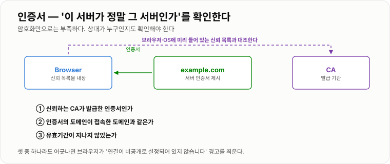
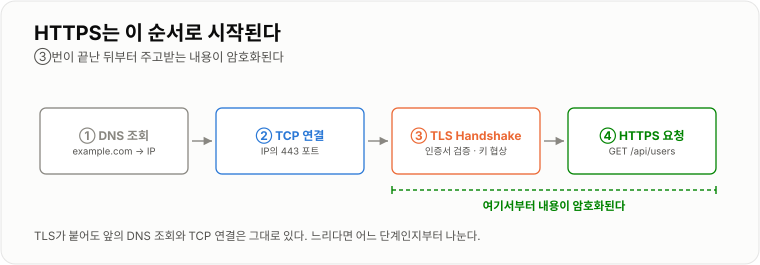

# 6. DNS / HTTPS

> **DNS가 '어디로 갈지'를 정하고, TLS가 '그 상대가 맞는지'와 '중간에서 못 보게'를 담당한다.**

주소창에 도메인을 치고 자물쇠가 잠기기까지 네 단계가 순서대로 지나간다.
느리거나 안 될 때 어느 단계인지 나눠 볼 수 있으면 절반은 해결된다.
이 장을 끝까지 따라가면 **도메인 하나에 HTTPS를 붙이는 일**이 끝난다.

---

## Domain

Domain은 사람이 읽기 쉬운 Server 주소다. 이름은 오른쪽부터 큰 단위다.

```text
api . example . com
 │      │        └ TLD (최상위 도메인)
 │      └ 등록한 도메인 — 돈을 내고 사는 단위
 └ 서브도메인 — 내가 마음대로 얼마든지 더 만든다
```

`example.com` 하나를 사면 `api.`, `admin.`, `dev.` 같은 서브도메인은 무료로 무한히 만들 수 있다.
그래서 서비스를 나눌 때 도메인을 더 사지 않고 서브도메인으로 나눈다.

---

## DNS Resolver

Browser가 세상의 모든 Domain 정보를 가지고 있는 것은 아니다. DNS Resolver에게 물어본다.

```text
Browser  "example.com 어디야?"  →  DNS Resolver  →  "203.0.113.10"  →  Browser
```

Resolver는 한 번 받은 답을 TTL(Time To Live)만큼 캐시한다.
그래서 **레코드를 바꿔도 즉시 반영되지 않는다.**

```bash
dig example.com +short          # IP만
dig example.com A               # TTL 포함 상세
dig @1.1.1.1 example.com        # 특정 Resolver에게 직접 — 캐시 우회에 유용
```

```text
;; ANSWER SECTION:
example.com.    300    IN    A    203.0.113.10
                 └ 이 값이 TTL(초). 300이면 5분간 캐시된다
```

**바꿀 예정이 있으면 하루 전에 TTL을 60초로 낮춰 두고 작업한다.**
바꾼 뒤에 낮춰 봐야 이미 퍼진 옛 캐시에는 소용이 없다.

---

## A Record

Domain을 IPv4 주소에 연결하는 DNS Record다.

```text
example.com   A   203.0.113.10
```

즉 `Domain → IPv4` 다. IPv6용은 `AAAA` 레코드다.

가정용 회선처럼 Public IP가 바뀌는 환경에서는 A 레코드에 IP를 박아 두면 언젠가 끊긴다.
이때는 **DDNS**(IP가 바뀔 때마다 레코드를 자동으로 갱신해 주는 서비스)를 쓰거나,
[5장의 Tunnel](../05-외부-접속/05-외부-접속.md)로 IP 자체를 안 쓰는 쪽을 택한다.

---

## CNAME

Domain을 다른 Domain 이름에 연결한다.

```text
api.example.com   CNAME   service.example.net
```

```text
A       Domain → IP
CNAME   Domain → 다른 Domain
```

CNAME은 **대상 쪽 IP가 바뀌어도 내 설정을 고칠 필요가 없다**는 게 장점이다.
그래서 CDN이나 관리형 서비스, Cloudflare Tunnel을 붙일 때 주로 쓴다.

다만 루트 도메인(`example.com` 자체)에는 원칙적으로 CNAME을 쓸 수 없다.
서비스에 따라 `ALIAS` · `ANAME` · `CNAME flattening` 같은 이름으로 우회 기능을 제공한다.

자주 같이 보게 되는 레코드도 이 정도만 알아 두면 된다.

| 레코드 | 쓰임 |
| -- | -- |
| A / AAAA | 도메인 → IP |
| CNAME | 도메인 → 다른 도메인 |
| MX | 메일 서버 |
| TXT | 소유권 증명, SPF 등 문자열 |
| NS | 이 도메인을 어느 네임서버가 관리하는지 |

---

## TLS

TLS는 인터넷 통신 내용을 암호화하기 위한 프로토콜이다. HTTPS는 `HTTP + TLS` 다.

TLS가 해 주는 일은 셋이다.

| | 뜻 | 없으면 |
| -- | -- | -- |
| 기밀성 | 중간에서 내용을 볼 수 없다 | 같은 Wi-Fi의 누군가가 토큰을 본다 |
| 무결성 | 중간에서 내용을 바꿀 수 없다 | 응답에 광고·스크립트가 끼어든다 |
| 인증 | 상대가 그 도메인의 주인이 맞다 | 가짜 사이트에 접속해도 모른다 |

세 번째가 다음 절의 인증서 이야기다. **암호화만으로는 부족하다** —
가짜 서버와 암호화해서 통신해 봐야 소용이 없기 때문이다.

---

## 인증서

인증서는 서버의 신원을 확인하는 데 사용된다. 브라우저는 세 가지를 본다.

```text
① 신뢰하는 CA가 발급했는가     (CA 목록은 브라우저·OS에 미리 들어 있다)
② 인증서의 도메인이 접속한 도메인과 같은가
③ 유효기간이 남아 있는가
```

셋 중 하나라도 어긋나면 경고가 뜬다. 그래서 아무 인증서나 만들어 붙이면(자체 서명) 막힌다.



*셋 중 하나라도 어긋나면 브라우저가 경고를 띄운다.*

### 발급받기 — Let's Encrypt

무료로 발급받는 방법이 표준처럼 쓰인다. **80 포트가 열려 있고 도메인이 이 서버를 가리켜야** 한다.
(CA가 그 도메인으로 실제 접속해서 소유권을 확인하기 때문이다.)

```bash
sudo apt install certbot python3-certbot-nginx
sudo certbot --nginx -d example.com -d www.example.com
```

성공하면 certbot이 인증서를 받아 두고 **Nginx 설정까지 알아서 고쳐 준다.**

```text
/etc/letsencrypt/live/example.com/fullchain.pem    ← 인증서
/etc/letsencrypt/live/example.com/privkey.pem      ← 개인키 (절대 유출 금지)
```

### 갱신 — 90일짜리라 자동화가 전제다

"어제까지 됐는데 오늘 갑자기 경고가 뜬다"의 대표 원인이 갱신 실패다.
certbot은 설치할 때 타이머를 같이 등록하지만, **한 번은 직접 확인해 둔다.**

```bash
sudo certbot renew --dry-run       # 실제로 갱신되는지 예행연습
systemctl list-timers | grep certbot
```

```bash
# 남은 기간 확인 — 모니터링에 넣어 둘 만하다
openssl s_client -connect example.com:443 -servername example.com </dev/null 2>/dev/null \
  | openssl x509 -noout -dates
```

### Nginx에 직접 쓰기

certbot이 만들어 주는 설정은 대략 이 모양이다. 직접 쓸 때도 같다.

```nginx
# ① HTTP로 온 것은 전부 HTTPS로 넘긴다
server {
    listen 80;
    server_name example.com;
    return 301 https://$host$request_uri;
}

# ② 실제 서비스
server {
    listen 443 ssl;
    http2 on;
    server_name example.com;

    ssl_certificate     /etc/letsencrypt/live/example.com/fullchain.pem;
    ssl_certificate_key /etc/letsencrypt/live/example.com/privkey.pem;

    ssl_protocols       TLSv1.2 TLSv1.3;
    ssl_session_cache   shared:SSL:10m;

    location / {
        proxy_pass http://backend:8080;
        proxy_set_header Host              $host;
        proxy_set_header X-Real-IP         $remote_addr;
        proxy_set_header X-Forwarded-For   $proxy_add_x_forwarded_for;
        proxy_set_header X-Forwarded-Proto $scheme;
    }
}
```

```bash
nginx -t && nginx -s reload
```

---

## HTTPS 동작 흐름

큰 흐름만 이해하면 된다.

```text
① DNS 조회       example.com → 203.0.113.10
② TCP 연결       203.0.113.10:443 에 붙는다
③ TLS Handshake  서버가 인증서 제시 → 브라우저가 검증 → 키 협상
④ HTTPS 요청     여기서부터 내용이 암호화된다
```

`GET /api/users` 같은 HTTP 메시지는 ④에서 TLS를 통해 암호화되어 전달된다.
**③까지는 암호화되지 않는다.** 그래서 "어느 도메인에 접속했는지"는 중간에서 보일 수 있고,
"무엇을 요청했는지"는 보이지 않는다.



*TLS가 붙어도 앞의 DNS와 TCP는 그대로 있다.*

### 느릴 때 어느 단계인지 나누기

```bash
curl -w "dns=%{time_namelookup} connect=%{time_connect} tls=%{time_appconnect} total=%{time_total}\n" \
     -o /dev/null -s https://example.com
```

```text
dns=0.004 connect=0.031 tls=0.098 total=0.412
     └ DNS      └ TCP        └ TLS까지  └ 응답 완료
```

`total` 만 크고 앞이 작으면 애플리케이션이 느린 것이다. TLS 구간이 크면 인증서 체인이나 프로토콜을 본다.

!!! note "TLS는 대개 Nginx에서 끊는다"

    인증서를 Nginx가 들고 있고, Nginx → Spring 구간은 평문 HTTP인 구성이 흔하다.
    이것을 TLS Termination이라고 한다. 인증서를 한 곳에서만 관리하면 되고,
    애플리케이션을 여러 대로 늘려도 손댈 것이 없다.
    대신 Spring은 자기가 HTTPS로 서비스되는지 모르기 때문에
    [4장의 `X-Forwarded-Proto`](../04-Nginx/04-Nginx.md)를 넘겨 줘야 리다이렉트가 깨지지 않는다.

---

## 도메인 붙이기 — 처음부터 끝까지

앞의 조각을 순서대로 이으면 이렇게 된다.

```bash
# ① DNS — 도메인 관리 페이지에서 A 레코드 등록
#    example.com   A   203.0.113.10   TTL 300

# ② 반영 확인 (몇 분 걸릴 수 있다)
dig example.com +short
# 203.0.113.10

# ③ 80/443 이 열려 있는지 — 5장의 방화벽·포트포워딩
sudo ufw allow 80/tcp && sudo ufw allow 443/tcp
curl -I http://example.com          # 여기가 되어야 ④가 가능하다

# ④ 인증서 발급 + Nginx 설정 자동 수정
sudo certbot --nginx -d example.com

# ⑤ 확인
curl -I https://example.com         # HTTP/2 200
curl -I http://example.com          # 301 → https 로 리다이렉트되는지
sudo certbot renew --dry-run        # 자동 갱신이 되는지
```

### 안 될 때

| 증상 | 원인 |
| -- | -- |
| `dig` 에 아무것도 안 나옴 | 레코드 미등록, 또는 아직 전파 중 |
| `dig` 는 되는데 옛 IP | 캐시. TTL만큼 기다리거나 `dig @1.1.1.1` 로 확인 |
| certbot이 "Timeout during connect" | 80 포트가 밖에서 안 열려 있다 |
| certbot이 "Invalid response" | 도메인이 이 서버가 아닌 다른 곳을 가리킨다 |
| 브라우저에 "안전하지 않음" | 인증서 도메인 불일치, 또는 만료 |
| 자물쇠는 있는데 일부 자원 경고 | 페이지 안에 `http://` 리소스가 섞여 있다 |
