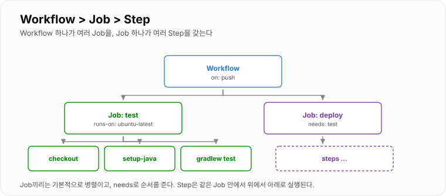
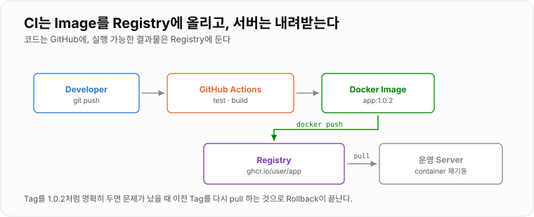

# 7. CI/CD

> **CI는 "이 코드가 망가지지 않았는가"를 자동으로 확인하고, CD는 그 결과물을 서버까지 자동으로 보낸다.**

`git push` 한 번이 테스트 → 빌드 → 이미지 → 배포까지 이어지는 흐름이다.
사용자 요청 흐름과는 완전히 별개로 도는, 두 번째 파이프라인이다.
이 장 끝에 **복붙해서 돌아가는 워크플로 전문**이 있다.

---

## CI

CI는 Continuous Integration이다.
개발자가 코드를 Git에 Push했을 때 자동으로 Build · Test · 검증하는 과정이다.

```text
Developer → git push → GitHub → CI → Test → Build
```

### 목적

문제가 있는 코드가 main branch나 운영 환경까지 가는 것을 빠르게 발견한다.
사람이 "테스트 돌리셨나요?"를 묻지 않아도 되게 만드는 것이 요점이다.

실효를 내려면 한 가지가 더 필요하다. **CI가 실패하면 머지가 막혀야 한다.**
GitHub의 `Settings → Branches → Branch protection rules` 에서
`Require status checks to pass` 를 켜 두지 않으면, 빨간 X를 무시하고 머지할 수 있어서 있으나 마나다.

---

## CD

CD는 CI 이후의 배포 과정까지 자동화하는 개념이다.

```text
git push → Test → Build → Deploy → Server 변경
```

CD는 두 가지로 나눠 부른다.

| | 어디까지 자동 | 마지막 단계 |
| -- | -- | -- |
| Continuous **Delivery** | 언제든 배포 가능한 상태까지 | 사람이 버튼을 누른다 |
| Continuous **Deployment** | 운영 반영까지 | 없음 |

처음에는 Delivery로 두고(`workflow_dispatch` 로 수동 실행),
신뢰가 쌓이면 Deployment로 넘기는 순서가 자연스럽다.

---

## GitHub Actions

GitHub에서 제공하는 자동화 도구다. Repository에 특정 이벤트가 발생하면 Workflow를 실행한다.
파일은 `.github/workflows/` 아래에 두고, 확장자는 `.yml` 이다.

```text
.github/
└ workflows/
   ├ ci.yml         ← PR마다 테스트
   └ deploy.yml     ← main 푸시 때 배포
```

---

## Workflow

GitHub Actions에서 자동화할 작업 전체를 Workflow라고 한다.

```yaml
name: CI

on:
  push:
    branches:
      - main

jobs:
  test:
    runs-on: ubuntu-latest

    steps:
      - uses: actions/checkout@v4

      - name: Test
        run: ./gradlew test
```

구조는 3단이다.

```text
Workflow
 └ Job          ← 서로 다른 머신에서 돈다. 기본 병렬
    ├ Step      ← 같은 머신에서 위에서 아래로
    ├ Step
    └ Step
```

| 키 | 의미 |
| -- | -- |
| `on:` | 언제 돌릴지 — `push`, `pull_request`, `schedule`, 수동 `workflow_dispatch` |
| `jobs:` | 무엇을 할지. Job끼리는 기본 **병렬**, `needs:` 로 순서를 준다 |
| `runs-on:` | 어떤 환경에서 돌릴지 |
| `uses:` | 남이 만들어 둔 Action을 가져다 쓴다 |
| `run:` | 셸 명령을 직접 실행한다 |
| `if:` | 조건부 실행 — `if: github.ref == 'refs/heads/main'` |

**Job이 서로 다른 머신에서 돈다**는 점이 중요하다.
test Job에서 만든 jar는 build Job에 없다. 넘기려면 Artifact로 올렸다 받거나, 한 Job에서 처리해야 한다.



*Job은 병렬, Step은 위에서 아래로 순서대로다.*

---

## Runner

GitHub Actions 명령을 실제로 실행하는 컴퓨터다.

```yaml
runs-on: ubuntu-latest
```

```text
GitHub Actions → Runner → ./gradlew test
```

즉 YAML 자체가 프로그램을 실행하는 게 아니라 **Runner라는 실행 환경이 실제 명령을 실행한다.**

Runner는 매번 깨끗한 상태로 시작하고 끝나면 사라진다.
그래서 의존성 다운로드가 매번 반복되고, 이를 줄이려고 캐시를 쓴다.

```yaml
      - uses: actions/setup-java@v4
        with:
          java-version: '21'
          distribution: 'temurin'
          cache: gradle          # 이 한 줄로 빌드가 몇 분 줄어든다
```

내 서버를 Runner로 등록하는 **Self-hosted Runner** 도 있다.
GitHub가 접근할 수 없는 내부망에 배포해야 할 때 쓴다.

---

## Artifact

CI 과정에서 만들어진 결과물을 Artifact라고 부를 수 있다.
Spring Boot jar, Test Report, Build 결과 같은 것들이다.

```text
Source Code → Build → app.jar → Artifact
```

Runner는 끝나면 사라지므로, 남겨야 하는 파일은 명시적으로 올려 둔다.

```yaml
      - uses: actions/upload-artifact@v4
        if: always()                       # 실패했을 때도 올린다
        with:
          name: test-report
          path: build/reports/tests/test
```

`if: always()` 가 없으면 테스트가 깨졌을 때 리포트가 안 올라간다.
**정작 필요할 때 없는 것**이라 실무에서 꼭 붙인다.

---

## Docker Registry

Docker Image를 저장하는 저장소다.
GitHub가 Source Code 저장소라면 Registry는 Docker Image 저장소다.

```text
Developer → Docker Build → Image → Registry → Server → docker pull
```

| Registry | 특징 |
| -- | -- |
| Docker Hub | 가장 일반적. 무료는 공개 저장소 |
| GitHub Container Registry (`ghcr.io`) | GitHub 계정 그대로. Actions와 궁합이 좋다 |
| AWS ECR · GCP Artifact Registry | 클라우드 안에서 쓸 때 |

`ghcr.io` 는 별도 계정 없이 `GITHUB_TOKEN` 으로 로그인되기 때문에 시작하기 가장 쉽다.

```bash
# 서버 쪽은 받아서 갈아 끼우기만 하면 된다
docker pull ghcr.io/insoo/app:1.0.2
docker compose up -d
```



*코드는 GitHub에, 실행 가능한 결과물은 Registry에 둔다.*

---

## Image Tag

Docker Image의 버전을 구분한다.

```text
my-app:1.0.0
my-app:1.0.1
my-app:20260824
```

`latest` 만 사용하면 현재 정확히 어떤 버전이 실행 중인지 추적할 수 없다.
`latest` 는 **가리키는 대상이 계속 바뀌는 이름**이라, "어제의 latest"로 되돌아갈 방법이 없기 때문이다.

실무에서 흔한 방식은 커밋 해시와 버전을 같이 붙이는 것이다.

```text
ghcr.io/insoo/app:1.0.2       ← 사람이 부르는 이름
ghcr.io/insoo/app:9f3c1ab     ← 이 커밋이 정확히 무엇인지 남는다
ghcr.io/insoo/app:latest      ← 편의용. 판단 근거로는 쓰지 않는다
```

```bash
docker inspect --format '{{index .RepoTags 0}}' <컨테이너>   # 지금 도는 게 어느 태그인지
```

---

## Secret 관리

Password나 API Token을 Repository에 올리면 안 된다.

```yaml
DB_PASSWORD: my-real-password              # 나쁜 예
DB_PASSWORD: ${{ secrets.DB_PASSWORD }}    # 좋은 방향
```

값은 GitHub의 `Settings → Secrets and variables → Actions` 에 넣는다.
한 번 넣으면 **다시 볼 수 없고**, Actions 로그에 값이 찍히면 자동으로 `***` 로 가려진다.

| 이름 | 쓰임 |
| -- | -- |
| `GITHUB_TOKEN` | 자동 제공. ghcr.io 로그인에 그대로 쓴다 |
| `SSH_HOST` · `SSH_USER` · `SSH_KEY` | 배포 대상 서버 접속 |
| `DB_PASSWORD` | 서버의 `.env` 에 쓸 값 |

!!! warning "이미 올렸다면 지우는 것보다 폐기가 먼저다"

    한 번 커밋된 비밀값은 Git 히스토리에 남고, 이미 클론한 사람들에게도 남아 있다.
    커밋을 지워도 안전해지지 않는다. **그 값을 즉시 폐기하고 새로 발급하는 것**이 유일한 대응이다.

---

## Rollback

새 버전을 배포했는데 문제가 발생하면 이전 정상 버전으로 돌아가야 한다.

```text
1.0.0 정상 → 1.1.0 배포 → 장애 발생 → 1.0.0 재배포
```

Rollback을 "코드를 되돌려 다시 빌드하는 일"로 만들면 몇 분이 걸린다.
**"이미 있는 이미지를 다시 띄우는 일"로 만들어 두면 몇 초다.** 그 차이가 태그 관리에서 나온다.

```bash
# 서버에서
export APP_TAG=1.0.0
docker compose pull && docker compose up -d
```

```yaml
# compose.yaml 에서 태그를 변수로 빼 두면 이게 가능하다
  backend:
    image: ghcr.io/insoo/app:${APP_TAG:-latest}
```

---

## 전체 예제 — 테스트 · 빌드 · 배포

`.github/workflows/deploy.yml` 하나에 세 Job을 순서대로 엮는다.

```yaml
name: CI/CD

on:
  push:
    branches: [main]
  pull_request:                    # PR에서는 test Job만 돈다
  workflow_dispatch:               # 수동 실행 버튼

env:
  IMAGE: ghcr.io/${{ github.repository }}

jobs:

  # ── ① 테스트 ──────────────────────────────
  test:
    runs-on: ubuntu-latest
    steps:
      - uses: actions/checkout@v4

      - uses: actions/setup-java@v4
        with:
          java-version: '21'
          distribution: 'temurin'
          cache: gradle

      - name: Test
        run: ./gradlew test --no-daemon

      - uses: actions/upload-artifact@v4
        if: always()
        with:
          name: test-report
          path: build/reports/tests/test

  # ── ② 이미지 빌드 & Registry push ──────────
  build:
    needs: test                                    # test 가 통과해야 시작
    if: github.ref == 'refs/heads/main'            # main 푸시에서만
    runs-on: ubuntu-latest
    permissions:
      contents: read
      packages: write                              # ghcr.io 에 쓰려면 필요
    steps:
      - uses: actions/checkout@v4

      - uses: docker/login-action@v3
        with:
          registry: ghcr.io
          username: ${{ github.actor }}
          password: ${{ secrets.GITHUB_TOKEN }}

      - uses: docker/build-push-action@v6
        with:
          context: .
          push: true
          tags: |
            ${{ env.IMAGE }}:${{ github.sha }}
            ${{ env.IMAGE }}:latest
          cache-from: type=gha                     # Layer 캐시
          cache-to: type=gha,mode=max

  # ── ③ 서버에 배포 ─────────────────────────
  deploy:
    needs: build
    runs-on: ubuntu-latest
    steps:
      - name: SSH deploy
        uses: appleboy/ssh-action@v1
        with:
          host:     ${{ secrets.SSH_HOST }}
          username: ${{ secrets.SSH_USER }}
          key:      ${{ secrets.SSH_KEY }}
          script: |
            cd /srv/app
            echo "APP_TAG=${{ github.sha }}" > .tag
            docker compose --env-file .env --env-file .tag pull
            docker compose --env-file .env --env-file .tag up -d
            docker image prune -f
```

서버 쪽 `/srv/app/compose.yaml` 은 [3장의 예제](../03-Docker-Compose/03-Docker-Compose.md)와 같고,
`image` 만 변수로 바꿔 둔다.

```yaml
  backend:
    image: ghcr.io/insoo/app:${APP_TAG:-latest}
```

### 준비물

```text
GitHub Secrets   SSH_HOST · SSH_USER · SSH_KEY
서버              docker, docker compose, /srv/app/compose.yaml, /srv/app/.env
Registry          ghcr.io — Package settings 에서 저장소에 write 권한 확인
```

### 돌려 보고 확인하기

```bash
git commit --allow-empty -m "ci: trigger" && git push
```

GitHub의 **Actions 탭**에서 세 Job이 순서대로 초록색이 되는지 본다. 그리고 서버에서 확인한다.

```bash
docker compose ps
docker inspect --format '{{index .Config.Image}}' app-backend-1
# ghcr.io/insoo/app:9f3c1ab   ← 방금 푸시한 커밋과 같은지
curl -i https://example.com/actuator/health
```

### 자주 막히는 곳

| 증상 | 원인 |
| -- | -- |
| `denied: permission_denied` (push) | `permissions: packages: write` 누락 |
| deploy Job에서 SSH 실패 | `SSH_KEY` 에 개인키 **전문**(BEGIN/END 줄 포함)을 넣어야 한다 |
| 서버에서 옛 이미지가 계속 돔 | `pull` 을 안 했거나 `latest` 태그만 쓰고 있다 |
| test는 통과했는데 이미지가 깨짐 | 로컬 jar를 COPY하는 Dockerfile이다. Multi-stage로 바꾼다 |
| PR에서 build Job까지 돎 | `if: github.ref == 'refs/heads/main'` 누락 |
