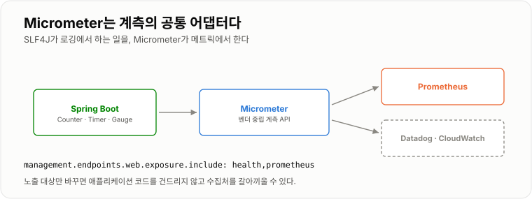
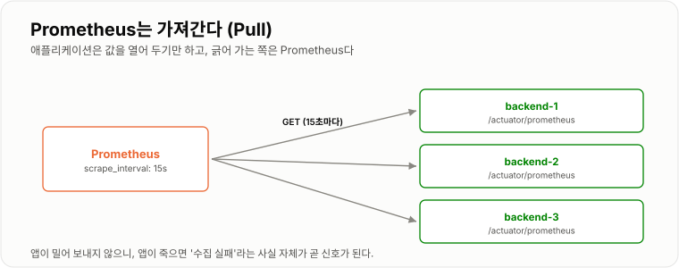
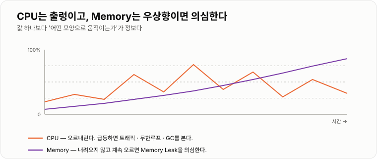
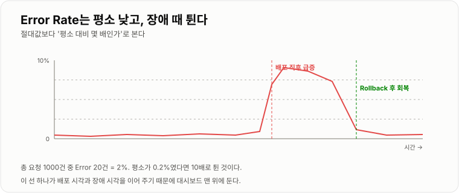

# 8. 모니터링

> **서비스를 실행하는 것과 운영하는 것은 다르다. 운영은 "지금 정상인가"에 답할 수 있어야 한다.**

Log는 무슨 일이 있었는지 자세히, Metric은 전체가 어떤 추세인지 알려 준다.
둘 다 있어야 "장애가 났다"에서 "여기가 문제다"까지 갈 수 있다.
이 장을 따라가면 **Spring + Prometheus + Grafana가 실제로 붙는다.**

---

## Monitoring

서비스가 현재 정상인지 지속적으로 확인하는 것이다.

무엇부터 봐야 할지 애매하면, **사용자가 체감하는 네 가지**부터 잡으면 된다.

| | 질문 | 대표 지표 |
| -- | -- | -- |
| Latency | 얼마나 느린가 | p95 · p99 응답 시간 |
| Traffic | 얼마나 들어오는가 | 초당 요청 수 |
| Errors | 얼마나 실패하는가 | 5xx 비율 |
| Saturation | 자원이 얼마나 찼는가 | CPU · Heap · Connection Pool |

CPU가 90%여도 응답이 빠르고 에러가 없으면 그건 장애가 아니다.
**사용자가 겪는 것부터 보고, 자원은 원인을 찾을 때 본다.**

---

## Log

애플리케이션에서 발생한 사건을 기록한 것이다.

```java
log.info("user login. userId={}", userId);
```

```text
2026-08-24 10:00:01 INFO  user login userId=100
2026-08-24 10:00:10 ERROR database connection failed
```

Log는 주로 **무슨 일이 발생했는가?** 를 자세히 확인할 때 사용한다.

### 레벨

```text
TRACE < DEBUG < INFO < WARN < ERROR
```

운영은 보통 `INFO` 부터 남긴다. 특정 패키지만 잠깐 `DEBUG` 로 내려서 볼 수 있다.

```yaml
logging:
  level:
    root: INFO
    com.example.order: DEBUG
    org.hibernate.SQL: DEBUG        # 실행되는 쿼리 보기
```

### `{}` 를 쓰는 이유

```java
log.debug("userId=" + userId);      // 레벨이 꺼져 있어도 문자열을 만든다
log.debug("userId={}", userId);     // 꺼져 있으면 아무 일도 안 한다
```

DEBUG 로그 수천 줄이 있는 코드에서 이 차이가 성능으로 나타난다.

### 요청 하나를 추적하려면

서버가 여러 대가 되면 로그가 섞여서 "이 사용자의 요청"만 골라내기 어렵다.
요청마다 ID를 붙여 남기면 그 ID로 전체를 훑을 수 있다.

```java
@Component
public class TraceIdFilter extends OncePerRequestFilter {

    @Override
    protected void doFilterInternal(HttpServletRequest req, HttpServletResponse res,
                                    FilterChain chain) throws IOException, ServletException {
        MDC.put("traceId", UUID.randomUUID().toString().substring(0, 8));
        try {
            chain.doFilter(req, res);
        } finally {
            MDC.clear();            // 스레드 재사용 때문에 반드시 지운다
        }
    }
}
```

```yaml
logging:
  pattern:
    console: "%d{HH:mm:ss} %-5level [%X{traceId}] %logger{20} - %msg%n"
```

```text
10:00:01 INFO  [a3f91c2b] OrderController - order requested
10:00:01 ERROR [a3f91c2b] PaymentClient    - timeout
```

---

## Metric

Metric은 시스템 상태를 숫자로 표현한 값이다.

```text
Log     → 어떤 일이 발생했는지 상세 확인   (한 건씩)
Metric  → 전체 상태와 추세 확인            (모아서 숫자로)
```

세 종류만 알면 된다.

| 종류 | 성격 | 예 |
| -- | -- | -- |
| Counter | 늘어나기만 함 | 총 요청 수, 총 에러 수 |
| Gauge | 오르내림 | 메모리 사용량, 커넥션 수 |
| Timer / Histogram | 걸린 시간의 분포 | 응답 시간 p95, p99 |

Counter는 "총 몇 건"이라 그 값 자체는 별 의미가 없다.
**변화율(`rate`)로 봐야** "초당 몇 건"이 나온다. 뒤의 PromQL에서 계속 나오는 이유다.

---

## Spring Actuator

Spring Boot 애플리케이션의 상태를 확인할 수 있는 기능이다.

```gradle
implementation 'org.springframework.boot:spring-boot-starter-actuator'
runtimeOnly    'io.micrometer:micrometer-registry-prometheus'
```

```yaml
management:
  endpoints:
    web:
      exposure:
        include: health,info,prometheus     # 기본은 health 뿐. 명시해야 열린다
  endpoint:
    health:
      show-details: when-authorized
      probes:
        enabled: true                       # liveness / readiness 분리
  metrics:
    tags:
      application: ${spring.application.name}    # 모든 지표에 붙는 라벨
```

```bash
curl localhost:8080/actuator/health
# {"status":"UP"}

curl -s localhost:8080/actuator/prometheus | head
# jvm_memory_used_bytes{area="heap",...} 1.34217728E8
# http_server_requests_seconds_count{status="200",uri="/api/users",...} 42.0
```

!!! warning "`/actuator` 를 인터넷에 열지 않는다"

    `env` · `heapdump` · `configprops` 같은 엔드포인트는 설정값과 메모리를 그대로 노출한다.
    Nginx에서 막거나, 내부 전용 포트로 분리한다.

    ```nginx
    location /actuator/ { deny all; }
    location = /actuator/health { proxy_pass http://backend:8080; }
    ```

---

## Micrometer

Spring 애플리케이션의 Metric을 여러 Monitoring 시스템에 연결하기 위한 추상화 계층이다.

```text
Spring → Micrometer → Prometheus
```

로깅에서 SLF4J가 하는 역할을, 계측에서 Micrometer가 한다.
Prometheus 전용 코드를 직접 쓰지 않아도 되고, **수집처를 바꿔도 애플리케이션 코드가 그대로**다.

Actuator를 넣으면 HTTP 요청 수·응답 시간·JVM 메모리·GC·커넥션 풀은 **자동으로 잡힌다.**
직접 만들 것은 비즈니스 지표뿐이다.

```java
@Service
public class OrderService {

    private final Counter created;
    private final Timer   settleTimer;

    public OrderService(MeterRegistry registry) {
        this.created     = registry.counter("order.created");
        this.settleTimer = registry.timer("order.settle");
    }

    public void create(Order order) {
        created.increment();
    }

    public void settle(Order order) {
        settleTimer.record(() -> paymentClient.settle(order));   // 걸린 시간 자동 기록
    }
}
```

라벨(tag)을 붙이면 나눠 볼 수 있다. 단, **값의 종류가 무한한 것은 라벨로 쓰지 않는다.**
`userId` 를 라벨로 넣으면 지표가 사용자 수만큼 생겨서 Prometheus가 터진다.

```java
registry.counter("order.created", "channel", order.channel()).increment();   // OK
registry.counter("order.created", "userId", userId).increment();             // 금지
```



*수집처가 바뀌어도 애플리케이션 코드는 그대로다.*

---

## Prometheus

Prometheus는 Metric을 수집하고 저장하는 시스템이다.
애플리케이션에 **주기적으로 요청해서 가져온다.** 이를 Pull 방식이라고 한다.

```text
Spring  /actuator/prometheus   ←  Prometheus가 15초마다 조회
```

```yaml
# prometheus.yml
global:
  scrape_interval: 15s

scrape_configs:
  - job_name: backend
    metrics_path: /actuator/prometheus
    static_configs:
      - targets: ['backend:8080']         # Compose 네트워크 안이므로 서비스 이름
        labels:
          env: prod
```

Pull 방식의 부수 효과가 하나 있다. 앱이 죽으면 수집이 실패하고,
**그 실패 자체가 "이 인스턴스가 죽었다"는 신호**가 된다.
`up` 이라는 지표가 자동으로 생겨서, `up == 0` 하나로 죽음을 감지할 수 있다.

```text
http://localhost:9090/targets     ← 어떤 대상이 붙었고 실패했는지 한눈에
```



*앱은 값을 열어 두기만 하고, 긁어 가는 쪽은 Prometheus다.*

---

## Grafana

Grafana는 Metric을 그래프로 보여주는 Visualization 도구다.

```text
Prometheus  → Metric 수집 / 저장
Grafana     → Dashboard / 시각화
```

Grafana 자체는 아무것도 수집하지 않는다. Prometheus에 질의(PromQL)를 보내 결과를 그릴 뿐이다.

### 붙이기 — Compose에 두 줄 추가

```yaml
  prometheus:
    image: prom/prometheus:latest
    volumes:
      - ./prometheus.yml:/etc/prometheus/prometheus.yml:ro
      - prometheus-data:/prometheus
    ports:
      - "127.0.0.1:9090:9090"        # Loopback 에만 — 밖에 열지 않는다

  grafana:
    image: grafana/grafana:latest
    environment:
      GF_SECURITY_ADMIN_PASSWORD: ${GRAFANA_PASSWORD}
    volumes:
      - grafana-data:/var/lib/grafana
    ports:
      - "127.0.0.1:3000:3000"
    depends_on:
      - prometheus

volumes:
  prometheus-data:
  grafana-data:
```

```bash
docker compose up -d prometheus grafana
open http://localhost:9090/targets      # backend 가 UP 인지 먼저 확인
open http://localhost:3000              # admin / ${GRAFANA_PASSWORD}
```

Grafana에서 `Connections → Data sources → Prometheus` 를 추가하고 URL에 `http://prometheus:9090` 을 넣는다.
(같은 Compose 네트워크라 서비스 이름으로 부른다 — 3장과 같은 규칙이다.)

Spring용 대시보드는 처음부터 만들 필요가 없다.
`Dashboards → Import` 에서 공개 대시보드 ID(예: JVM Micrometer는 `4701`)를 넣으면 바로 붙는다.

### 알아 둘 PromQL 다섯 줄

```text
rate(http_server_requests_seconds_count[1m])                      초당 요청 수

sum(rate(http_server_requests_seconds_count{status=~"5.."}[5m]))
  / sum(rate(http_server_requests_seconds_count[5m]))             에러율

histogram_quantile(0.95,
  sum(rate(http_server_requests_seconds_bucket[5m])) by (le))     p95 응답시간

jvm_memory_used_bytes{area="heap"}                                Heap 사용량

up == 0                                                            죽은 인스턴스
```

`[5m]` 은 "최근 5분 구간"이고, `rate()` 는 그 구간의 초당 증가량이다.
Counter를 그냥 그리면 계속 우상향하는 무의미한 선이 나오므로 거의 항상 `rate()` 로 감싼다.

---

## CPU / Memory Metric

### CPU

서버가 얼마나 많은 연산을 하고 있는지 나타낸다. 지속적으로 높다면
트래픽 증가, 무한루프, 무거운 연산, GC 문제를 의심한다.

### Memory

Spring에서는 JVM Heap 사용량이 중요하다.
**JVM은 GC가 돌면서 Heap이 톱니 모양으로 오르내리는 것이 정상**이다.

```text
정상   /|/|/|/|      GC 후 바닥이 같은 높이로 돌아온다
누수   /|/|/|/|      GC 후 바닥이 조금씩 올라간다  ← 이게 신호다
        ↗
```

그래서 순간값이 아니라 **GC 이후의 바닥선이 우상향하는지**를 본다.

```text
jvm_memory_used_bytes{area="heap"}
jvm_gc_pause_seconds_sum
hikaricp_connections_active           ← 커넥션 풀 고갈도 같이 본다
```



*값 하나보다 '어떤 모양으로 움직이는가'가 정보다.*

---

## Latency

Latency는 요청을 처리하는 데 걸린 시간이다.
평균 응답시간만 보는 것보다 `p95`, `p99` 를 함께 본다.

**평균이 위험한 이유는 간단하다.** 100건 중 99건이 50ms고 1건이 5초여도 평균은 100ms다.
그 1건을 겪은 사용자에게는 5초짜리 서비스다.

```text
p95 = 100건 중 95건이 이 시간 안에 끝났다
p99 = 100건 중 99건이 이 시간 안에 끝났다  ← 최악에 가까운 경험
```

`p99` 를 보면 "가끔 이상하게 느리다"는 민원이 지표에 드러난다.

---

## Error Rate

전체 요청 중 Error가 발생한 비율이다.

```text
총 요청 1000, Error 20  →  2%
```

숫자 자체보다 **평소 대비 몇 배인가** 로 본다. 평소가 0.2%였다면 2%는 10배로 튄 것이다.
그래서 알림도 "2% 넘으면"보다 "평소의 N배가 되면"으로 거는 편이 오탐이 적다.

그리고 이 선을 **배포 시각과 겹쳐** 두면 "배포 때문인가"를 즉시 판단할 수 있다.
Grafana의 Annotation 기능으로 배포 시각에 세로선을 그어 두면 대시보드 하나로 끝난다.



*배포 시각과 겹쳐 보면 원인 추정이 빨라진다.*

---

## 무엇부터 놓을까

전부 갖추려 하면 시작을 못 한다. 순서는 이 정도가 현실적이다.

```text
① docker compose logs        — 아무것도 없을 때의 최소선
② /actuator/health           — 살았는지 아닌지
③ Prometheus + Grafana       — 추세가 보이기 시작
④ 알림 (Alertmanager 등)      — 안 보고 있어도 알려 준다
```

③까지 오면 "장애가 났다"를 사용자보다 먼저 아는 상태가 되고,
④까지 오면 대시보드를 안 보고 있어도 된다.
