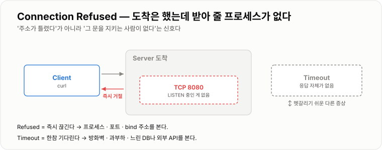
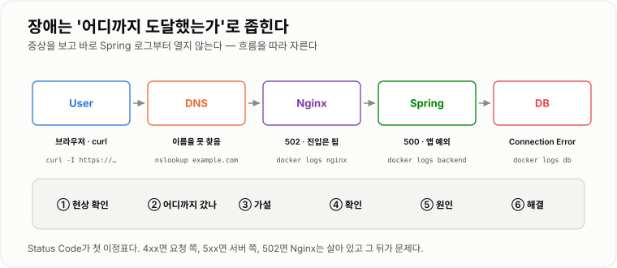

# 9. 장애 대응

> **"안 된다"에서 시작하지 않는다. 요청이 어디까지 도달했는지 잘라 가며 좁힌다.**

Status Code · 로그 · 명령어는 전부 "이 구간까지는 정상이다"를 확인하는 도구다.
그 확인을 순서대로 하는 것이 전부라고 봐도 된다.

---

## HTTP Status Code

HTTP 응답 결과를 숫자로 표현한다.

```text
2xx 성공
4xx Client 측 문제
5xx Server 측 문제
```

Status Code는 **첫 이정표**다. 이것만으로도 어느 구간을 볼지가 절반쯤 정해진다.

| 코드 | 뜻 | 어디를 보나 |
| -- | -- | -- |
| 400 | 요청 형식이 잘못됨 | 클라이언트가 보낸 본문·파라미터 |
| 401 | 누구인지 모름 | 토큰이 없거나 만료 |
| 403 | 누구인지는 알지만 권한 없음 | 인가 로직 |
| 404 | 그 경로가 없음 | 라우팅, Nginx `proxy_pass` 의 `/` |
| 500 | 애플리케이션이 예외로 실패 | Spring 로그 |
| 502 | 진입점은 살아 있고 뒤가 죽음 | backend 프로세스 |
| 503 | 받아 줄 인스턴스가 없음 | 전부 내려갔거나 기동 중 |
| 504 | 뒤가 시간 안에 응답 못 함 | 느린 쿼리·외부 API |

401과 403의 차이(**모른다** vs **알지만 안 된다**), 502와 504의 차이(**죽었다** vs **느리다**)를
구분해 두면 헛다리를 짚지 않는다.

---

## Application Log

Spring 내부에서 발생한 문제를 확인한다.

```bash
docker compose logs backend
docker compose logs -f --tail 100 backend        # 최근 100줄부터 실시간
docker compose logs --since 10m backend          # 최근 10분치만
docker compose logs backend | grep -i error
```

### 스택트레이스는 아래부터 읽는다

```text
org.springframework.dao.DataAccessResourceFailureException: ...
    at ...
Caused by: java.net.ConnectException: Connection refused
    at ...                                       ← 진짜 원인은 여기
```

맨 위는 Spring이 감싼 껍데기인 경우가 많다.
**마지막 `Caused by:`** 가 실제로 무엇이 실패했는지 알려 준다.

### 8장의 traceId가 있으면

요청 하나가 남긴 로그만 뽑을 수 있다. 장애 시간대의 traceId 하나를 잡아서 훑는 것이 가장 빠르다.

```bash
docker compose logs backend | grep a3f91c2b
```

---

## Nginx Log

Nginx에는 Access Log와 Error Log가 있다. 둘의 용도가 다르다.

**Access Log** — 누가 어떤 URL을 호출했고 응답이 무엇이었나

```text
203.0.113.7 - - [24/Aug/2026:10:00:01] "GET /api/users HTTP/1.1" 502 157 "-" "curl/8.7"
                                        └ 요청           └ 코드 └ 바이트
```

**Error Log** — Nginx가 뒤로 못 넘긴 이유

```text
connect() failed (111: Connection refused) while connecting to upstream,
upstream: "http://172.18.0.4:8080/api/users"
```

**`upstream:` 줄이 결정적이다.** Nginx가 실제로 어느 주소로 붙으려 했는지가 그대로 찍힌다.
`proxy_pass` 오타나 포트 실수는 여기서 바로 드러난다.

```bash
docker compose exec nginx tail -f /var/log/nginx/error.log
docker compose exec nginx tail -f /var/log/nginx/access.log
```

응답 시간을 남겨 두면 "누가 느린가"까지 여기서 갈린다.

```nginx
log_format timed '$remote_addr "$request" $status '
                 'rt=$request_time urt=$upstream_response_time';
access_log /var/log/nginx/access.log timed;
```

```text
rt=2.104  urt=2.098    ← 거의 같다 → backend 가 느리다
rt=2.104  urt=0.011    ← 차이가 크다 → Nginx나 네트워크 구간
```

---

## Container Log

Docker Container에서 프로그램의 표준 출력/에러를 확인할 수 있다.
장애 시 가장 자주 쓰는 기본 명령이다.

```bash
docker compose ps                       # STATUS 칸을 먼저 본다
docker compose logs -f backend
```

`STATUS` 가 말해 주는 것이 많다.

| STATUS | 뜻 |
| -- | -- |
| `Up 3 hours` | 정상 |
| `Up 5 seconds` | 방금 재시작됐다. 계속 죽고 있는지 확인 |
| `Restarting (1)` | 뜨자마자 죽는 중. 로그가 짧게 끊기니 `--tail` 로 본다 |
| `Exited (137)` | 메모리 부족으로 강제 종료(OOM Kill)됐을 가능성 |
| `Up (unhealthy)` | 떠 있지만 healthcheck 실패 |

---

## Port 충돌

하나의 IP에서 동일한 Port를 두 프로그램이 동시에 사용할 수 없다.

```text
Web server failed to start. Port 8080 was already in use.
```

```bash
lsof -nP -iTCP:8080 -sTCP:LISTEN       # macOS · Linux
netstat -ano | findstr :8080           # Windows — 맨 끝이 PID
```

해결은 기존 프로세스를 끄거나, 새 프로그램의 Port를 바꾸는 것 둘 중 하나다.

```bash
kill -9 <PID>                          # 무엇인지 확인하고 나서
```

Docker에서는 메시지가 조금 다르게 나온다.

```text
Bind for 0.0.0.0:8080 failed: port is already allocated
```

이건 **Host 쪽 번호가 겹친 것**이다. `-p 9000:8080` 처럼 왼쪽만 바꾸면 된다.

---

## Connection Refused

요청한 IP까지는 갔지만 해당 Port에서 연결을 받아주는 프로그램이 없을 때 발생한다.

```text
Client → Server 도착 → 8080에 아무도 없음 → Connection Refused
```

```bash
curl localhost:8080
# curl: (7) Failed to connect to localhost port 8080: Connection refused
```

**즉시 실패한다**는 것이 특징이다. 서버가 "그런 포트 없다"고 명확히 답을 준 것이기 때문이다.

### 원인 세 가지

```text
① 프로세스가 안 떠 있다        → docker compose ps / lsof
② 다른 Port로 떠 있다          → lsof 로 실제 번호 확인
③ 다른 주소에 bind 되어 있다    → lsof 의 NAME 칸이 127.0.0.1:8080
```

③이 [1장의 bind](../01-네트워크/01-네트워크.md) 이야기다. `*:8080` 이어야 외부에서 붙는다.
컨테이너 안에서 `127.0.0.1` 에 bind 하면 Port Mapping을 해도 이 증상이 난다.



*즉시 끊기면 Refused, 한참 기다리면 Timeout이다.*

---

## Timeout

Timeout은 일정 시간 동안 기다렸는데 응답이 오지 않은 상황이다. Refused와 정반대의 증상이다.

```text
Refused   즉시 실패       → 프로세스 · 포트 · bind
Timeout   한참 기다림      → 방화벽 · 과부하 · 느린 뒷단
```

방화벽이 패킷을 **DROP** 하면 아무 응답도 돌려주지 않기 때문에 Timeout처럼 보인다
([5장](../05-외부-접속/05-외부-접속.md)). 이때는 요청이 도착조차 안 했으니 **앱 로그가 조용한 것이 정상**이다.

### 어디서 기다리는지 나누기

```bash
curl -w "connect=%{time_connect} start=%{time_starttransfer} total=%{time_total}\n" \
     -o /dev/null -s http://example.com/api/users
```

```text
connect 에서 멈춤          → 네트워크 · 방화벽
connect 는 빠른데 start 가 큼 → 서버가 처리를 못 끝내고 있다
```

두 번째라면 애플리케이션 안을 본다. 느린 쿼리, 외부 API 지연, 커넥션 풀 고갈이 흔하다.

```bash
docker compose exec db psql -U app -c \
  "select pid, state, query_start, query from pg_stat_activity where state <> 'idle';"
```

Timeout 값 자체도 확인할 대상이다. **아무 데도 설정 안 되어 있으면 무한정 기다린다.**

```nginx
proxy_connect_timeout 5s;
proxy_read_timeout    60s;      # 넘으면 Nginx가 504를 준다
```

---

## Health Check

서버가 정상적으로 요청을 처리할 수 있는 상태인지 확인하는 방법이다.

```bash
curl localhost:8080/actuator/health
# {"status":"UP"}
```

### liveness와 readiness를 나눈다

```text
liveness   살아 있는가          실패 → 재시작해야 한다
readiness  요청 받을 준비됐는가   실패 → 트래픽을 보내지 말아야 한다
```

기동 중에 DB 연결이 아직 안 됐다면 **살아 있지만 준비는 안 된** 상태다.
이 구분이 없으면 뜨자마자 트래픽을 받아 502가 쏟아지거나, 멀쩡한 인스턴스가 계속 재시작된다.

```yaml
management:
  endpoint:
    health:
      probes:
        enabled: true
```

```bash
curl localhost:8080/actuator/health/liveness
curl localhost:8080/actuator/health/readiness
```

Kubernetes에서 이 둘을 각각 어디에 연결하는지는 [10장 Self Healing](../10-Kubernetes/10-Kubernetes.md)에 있다.

---

## 장애 발생 지점 추적 방법

서비스가 안 된다고 바로 Spring Log부터 볼 필요는 없다. 요청의 흐름을 따라가면 된다.

```text
User → DNS → Network → Nginx → Spring → DB
```

### 기본 사고 방식

```text
1. 현상 확인 — 무엇이, 언제부터, 전부인가 일부인가
2. 요청이 어디까지 도달했는지 확인
3. 가설 세우기
4. Log / Metric / 명령어로 확인
5. 원인 찾기
6. 해결
```

2번이 핵심이다. **한 구간씩 잘라서 "여기까지는 왔다"를 확정**해 나간다.



*증상을 보고 흐름 위의 어느 구간인지부터 정한다.*

### 구간별 확인 명령

```bash
# ① DNS 까지 왔나
dig example.com +short

# ② 진입점이 응답하나 (헤더만)
curl -I https://example.com

# ③ 컨테이너들이 살아 있나
docker compose ps

# ④ Nginx 가 backend 로 못 넘기고 있나
docker compose exec nginx tail -20 /var/log/nginx/error.log
docker compose exec nginx curl -I http://backend:8080/actuator/health

# ⑤ 앱까지 왔나
docker compose logs --tail 100 backend

# ⑥ 앱에서 DB 가 보이나
docker compose exec backend sh -c "getent hosts db"
docker compose logs --tail 50 db
```

### 증상 → 확인 순서 치트시트

| 증상 | 첫 삽 | 그다음 |
| -- | -- | -- |
| 도메인이 아예 안 열림 | `dig` | A 레코드, TTL, Public IP 변경 |
| 브라우저가 계속 로딩 | `curl -w` 로 구간 분리 | 방화벽 DROP, 과부하 |
| Connection refused | `docker compose ps` | 프로세스, 포트, bind |
| 502 | `logs backend` | 앱이 죽었나, `proxy_pass` 오타인가 |
| 504 | `urt` 로그 | 느린 쿼리, 외부 API, timeout 설정 |
| 500 | `logs backend` | 스택트레이스 마지막 `Caused by:` |
| 404인데 앱은 정상 | `proxy_pass` 의 끝 `/` | location 매칭 |
| 특정 사용자만 실패 | traceId로 로그 추출 | 데이터 · 권한 |
| 간헐적으로 느림 | p99 그래프 | GC, 커넥션 풀, N+1 쿼리 |
| 배포 직후부터 | Error Rate + 배포 시각 | 일단 Rollback, 원인은 그다음 |

**마지막 줄이 실무에서 제일 중요하다.**
배포 직후 장애는 원인을 찾기 전에 되돌리는 것이 먼저다
([7장 Rollback](../07-CI-CD/07-CI-CD.md)).

---

## 직접 만들어 보고 증상 익히기

증상을 눈에 익혀 두면 실제 상황에서 판단이 빨라진다.
[3장의 Compose 구성](../03-Docker-Compose/03-Docker-Compose.md)에서 하나씩 재현해 본다.

```bash
# 502 — 뒤가 죽었을 때
docker compose stop backend
curl -i localhost/api/users            # 502 Bad Gateway
docker compose start backend

# Connection refused — 아무도 안 듣는 포트
curl -i localhost:9999                 # (7) Connection refused

# 504 — 뒤가 느릴 때
# nginx.conf 에 proxy_read_timeout 2s; 를 넣고 reload 한 뒤
# 3초 걸리는 API를 호출한다                → 504 Gateway Timeout

# Port 충돌
docker run -d -p 80:80 nginx           # 이미 80을 쓰는 중이면
# Bind for 0.0.0.0:80 failed: port is already allocated
```

네 가지 증상과 그때 봐야 할 곳이 손에 붙으면, 실제 장애에서 헤매는 시간이 크게 줄어든다.
