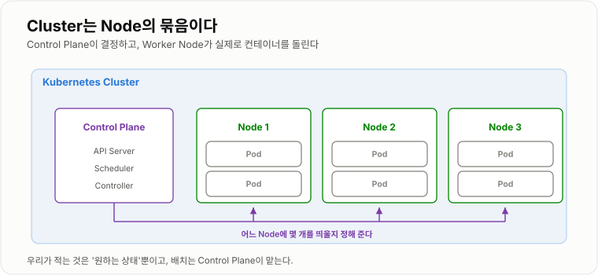
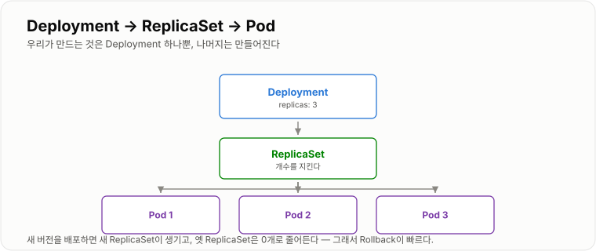
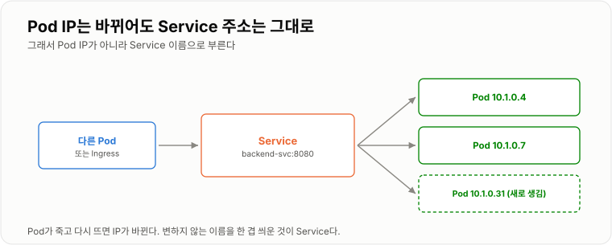
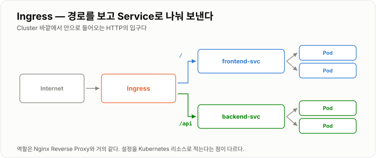
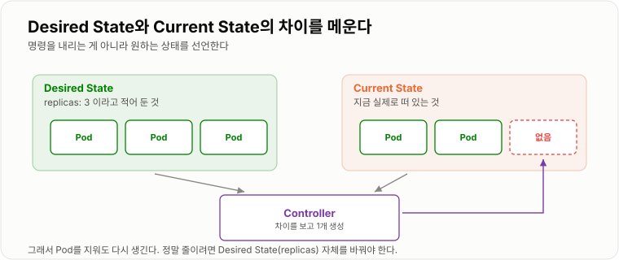

# 10. Kubernetes

> **컨테이너를 "실행"하는 도구가 아니라, 원하는 상태를 계속 유지시키는 도구다.**

Docker가 컨테이너 하나를 띄우는 일이라면 Kubernetes는 수십·수백 개를
누가 죽든 서버가 빠지든 알아서 맞춰 두는 일이다. 그 차이가 Desired State라는 개념 하나에서 나온다.
이 장 끝에 **로컬에서 실제로 돌려 보는 전체 매니페스트**가 있다.

---

## Kubernetes가 필요한 이유

Docker만으로도 Container를 실행할 수 있다.
문제는 Container가 수십, 수백 개가 되면 관리가 어려워진다는 것이다.

| 질문 | Docker Compose | Kubernetes |
| -- | -- | -- |
| Container가 죽으면? | `restart` 로 재시작 | 자동 재생성 + 위치 재배치 |
| 서버 한 대가 죽으면? | 그 서버 것은 다 죽는다 | 다른 Node로 옮겨 띄운다 |
| 10개로 늘리려면? | 수동 | `replicas: 10` |
| 무중단 배포는? | 직접 구성 | 기본 제공 (Rolling Update) |
| 트래픽이 늘면? | 수동 | 자동 확장(HPA) |

**서버가 한 대면 Compose로 충분하다.** 여러 대로 늘어나고 무중단이 필요해질 때
그 일을 사람이 하지 않게 하려고 Kubernetes를 쓴다.

### kubectl — 명령은 대부분 이것 하나

```bash
kubectl get pods                     # 목록
kubectl get all                      # 이 네임스페이스의 전부
kubectl apply -f deployment.yaml     # 원하는 상태를 등록
kubectl logs -f <pod>                # 로그
kubectl describe pod <pod>           # 왜 안 뜨는지 — 맨 아래 Events가 핵심
kubectl exec -it <pod> -- sh         # 안으로 들어가기
kubectl delete -f deployment.yaml    # 치우기
```

**안 뜰 때는 `describe` 의 `Events` 섹션부터 본다.**
`ImagePullBackOff`(이미지를 못 받음), `CrashLoopBackOff`(뜨자마자 죽음),
`Pending`(놓을 Node가 없음) 같은 이유가 여기 찍힌다.

---

## Cluster

Kubernetes 전체 환경을 Cluster라고 한다. 크게 둘로 나뉜다.

| | 하는 일 |
| -- | -- |
| **Control Plane** | 결정한다 — API Server(모든 명령의 창구), Scheduler(어느 Node에 놓을지), Controller(상태를 맞춤) |
| **Worker Node** | 실행한다 — 실제로 컨테이너를 돌린다 |

`kubectl apply` 를 하면 API Server에 **"원하는 상태"가 저장될 뿐**이고,
실제로 맞추는 일은 Controller가 계속 반복한다.

```bash
kubectl get nodes
```



*배치는 Control Plane이 정하고, 실행은 Node가 한다.*

---

## Node

Container가 실제로 실행되는 Machine이다. Physical Server, VM, Local Docker 환경 등이 될 수 있다.

```text
Cluster → Node → Pod → Container
```

로컬에서 연습할 때는 Node 하나짜리 Cluster를 쓴다.

```bash
minikube start                       # 또는 kind create cluster
kubectl get nodes
# NAME       STATUS   ROLES           AGE   VERSION
# minikube   Ready    control-plane   1m    v1.31.0
```

---

## Pod

Kubernetes에서 Container를 실행하는 가장 작은 배포 단위다.
Pod 안에는 하나 이상의 Container가 들어갈 수 있다.

```yaml
apiVersion: v1
kind: Pod

metadata:
  name: backend

spec:
  containers:
    - name: backend
      image: my-backend:1.0
```

같은 Pod 안의 Container들은 **네트워크와 저장 공간을 공유한다.**
즉 서로를 `localhost` 로 부를 수 있다. 앞 장들의 규칙이 여기서도 반복된다 —
`localhost` 는 Pod 자신이지, 옆 Pod가 아니다.

### Pod는 일회용이다

Pod는 고쳐 쓰지 않는다. **문제가 생기면 지우고 새로 만든다.**
그래서 Pod에는 이름도 IP도 고정된 것이 없고, 매번 바뀐다.

```text
backend-7d4f9c8b6d-x2k9p     ← 이름 뒤 해시는 매번 다르다
```

이 성질 때문에 뒤에 나오는 Service(고정 주소)와 Volume(고정 저장소)이 필요해진다.

### 핵심

Kubernetes는 Container를 직접 관리하지 않고 Pod를 관리한다.
그리고 **실무에서는 Pod조차 직접 만들지 않는다.** Deployment를 만든다.

---

## Deployment

Deployment는 **원하는 Pod 상태를 유지하도록 관리한다.**

```text
Deployment → ReplicaSet → Pod × 3
```

```yaml
apiVersion: apps/v1
kind: Deployment

metadata:
  name: backend

spec:
  replicas: 3
  selector:
    matchLabels:
      app: backend               # 이 라벨을 가진 Pod를 내 것으로 본다
  template:                      # 이 아래가 Pod 한 개의 설계도
    metadata:
      labels:
        app: backend             # selector 와 반드시 같아야 한다
    spec:
      containers:
        - name: backend
          image: ghcr.io/insoo/app:1.0.2
          ports:
            - containerPort: 8080
          resources:
            requests:            # 최소한 이만큼은 확보해 달라 (스케줄링 기준)
              cpu: 200m
              memory: 512Mi
            limits:              # 이 이상은 못 쓴다 (넘으면 OOM Kill)
              cpu: 1000m
              memory: 1Gi
```

`resources` 는 빠뜨리기 쉽지만 중요하다. 없으면 한 Pod가 Node의 자원을 다 먹고
옆 Pod까지 죽는다. Scheduler도 "어디에 놓을지"를 이 값으로 판단한다.

### 무중단 배포와 Rollback

새 버전을 배포하면 **새 ReplicaSet이 생기고 옛 것은 0개로 줄어든다.**
옛 ReplicaSet이 정의로 남아 있기 때문에 Rollback이 즉시 된다.

```bash
kubectl set image deployment/backend backend=ghcr.io/insoo/app:1.0.3
kubectl rollout status deployment/backend      # 진행 상황을 지켜본다
kubectl rollout history deployment/backend
kubectl rollout undo deployment/backend        # 직전 버전으로
```

교체 속도는 이렇게 조절한다.

```yaml
spec:
  strategy:
    rollingUpdate:
      maxSurge: 1            # 최대 1개까지 더 띄워도 됨
      maxUnavailable: 0      # 하나도 줄이지 않는다 → 진짜 무중단
```



*우리가 만드는 것은 Deployment 하나뿐이다.*

---

## ReplicaSet

지정된 개수의 Pod가 계속 존재하도록 관리한다.

```text
원하는 Pod = 3, 현재 Pod = 2  →  하나 추가 생성
```

보통 직접 만들지 않는다. Deployment가 버전마다 하나씩 만들어 관리한다.

```bash
kubectl get rs
# NAME                 DESIRED   CURRENT   READY
# backend-7d4f9c8b6d   3         3         3      ← 현재 버전
# backend-5c8b7a4f2e   0         0         0      ← 이전 버전 (rollback용으로 남아 있다)
```

---

## Service

Pod는 생성·삭제되면서 IP가 바뀐다. Client가 Pod IP를 직접 쓰면 곧 깨진다.
그래서 **변하지 않는 이름을 한 겹 씌운 것**이 Service다.

```yaml
apiVersion: v1
kind: Service

metadata:
  name: backend-svc

spec:
  selector:
    app: backend          # 이 라벨을 가진 Pod들에게 나눠 보낸다
  ports:
    - port: 8080          # Service가 받는 포트
      targetPort: 8080    # Pod가 듣고 있는 포트
```

Cluster 안에서는 이름으로 부른다. **3장의 Compose Service Name과 발상이 같다.**

```text
http://backend-svc:8080
http://backend-svc.default.svc.cluster.local:8080     ← 정식 이름
```

### 타입 세 가지

| 타입 | 접근 범위 | 언제 |
| -- | -- | -- |
| `ClusterIP` (기본) | Cluster 안에서만 | 내부 통신 — 대부분 이것 |
| `NodePort` | Node의 30000~32767 포트 | 로컬 테스트 |
| `LoadBalancer` | 클라우드 로드밸런서 | 클라우드에서 외부 노출 |

`selector` 의 라벨이 Pod의 라벨과 다르면 Service에 Pod가 하나도 안 붙는다.
연결이 안 될 때 여기부터 본다.

```bash
kubectl get endpoints backend-svc
# ENDPOINTS
# 10.1.0.4:8080,10.1.0.7:8080     ← 비어 있으면 selector 가 안 맞는 것이다
```



*변하지 않는 이름을 한 겹 씌운 것이 Service다.*

---

## ConfigMap

애플리케이션의 일반적인 설정값을 Kubernetes에서 관리한다.

```yaml
apiVersion: v1
kind: ConfigMap

metadata:
  name: backend-config

data:
  SPRING_PROFILES_ACTIVE: prod
  SPRING_DATASOURCE_URL: jdbc:postgresql://db-svc:5432/app
```

Pod에 환경 변수로 통째로 주입한다.

```yaml
      containers:
        - name: backend
          envFrom:
            - configMapRef:
                name: backend-config
```

목적은 [2장의 환경 변수](../02-Docker/02-Docker.md)와 같다.

```text
같은 이미지  +  다른 ConfigMap  =  다른 환경
```

!!! note "ConfigMap을 바꿔도 Pod는 자동으로 안 바뀐다"

    환경 변수로 주입한 값은 Pod가 뜰 때 읽힌다. 값을 고쳤으면 다시 띄워야 반영된다.

    ```bash
    kubectl rollout restart deployment/backend
    ```

---

## Secret

Password, Token 같은 민감한 설정을 관리한다. 사용법은 ConfigMap과 거의 같다.

```yaml
apiVersion: v1
kind: Secret

metadata:
  name: backend-secret

type: Opaque
stringData:                  # stringData 는 평문으로 쓰면 알아서 인코딩된다
  SPRING_DATASOURCE_PASSWORD: super-secret
```

```yaml
          envFrom:
            - secretRef:
                name: backend-secret
```

!!! warning "Secret은 '암호화'가 아니라 '분리'다"

    기본 Secret은 base64로 인코딩되어 저장될 뿐이라 되돌려 보는 것이 어렵지 않다.

    ```bash
    kubectl get secret backend-secret -o jsonpath='{.data.SPRING_DATASOURCE_PASSWORD}' | base64 -d
    ```

    실제 운영에서는 접근 제어(RBAC), 저장소 암호화,
    외부 Secret 관리 도구(Vault, Sealed Secrets 등)를 함께 쓴다.
    그리고 **Secret이 담긴 YAML은 Git에 올리지 않는다.**

---

## Ingress

외부 HTTP/HTTPS 요청을 Cluster 내부 Service로 전달한다.

```text
Internet → Ingress → Service → Pod
```

```yaml
apiVersion: networking.k8s.io/v1
kind: Ingress

metadata:
  name: app-ingress

spec:
  ingressClassName: nginx
  rules:
    - host: example.com
      http:
        paths:
          - path: /api
            pathType: Prefix
            backend:
              service:
                name: backend-svc
                port:
                  number: 8080
          - path: /
            pathType: Prefix
            backend:
              service:
                name: frontend-svc
                port:
                  number: 80
```

**역할은 [4장의 Nginx Reverse Proxy](../04-Nginx/04-Nginx.md)와 거의 같다.**
실제로 가장 널리 쓰이는 구현체가 ingress-nginx다.
`nginx.conf` 를 직접 쓰는 대신 Kubernetes 리소스로 적으면, Controller가 그걸 읽어 Nginx 설정을 만들어 준다.

!!! note "Ingress 리소스만으로는 아무 일도 안 일어난다"

    그 리소스를 읽고 실제로 트래픽을 처리할 **Ingress Controller가 따로 설치되어 있어야** 한다.

    ```bash
    minikube addons enable ingress
    kubectl get pods -n ingress-nginx
    ```



*경로를 보고 어느 Service로 보낼지 정한다.*

---

## Desired State

Kubernetes의 가장 중요한 개념이다.

사용자가 `Pod 3개를 유지해줘` 라고 **선언**한다. 이게 Desired State다.
현재가 2개가 되면 Kubernetes가 차이를 발견하고 하나를 더 만든다.

```text
Desired State → Controller → Current State를 Desired에 맞춤 → (반복)
```

그래서 `kubectl delete pod` 로 Pod를 지워도 곧 다시 생긴다.
**정말 줄이려면 Desired State 자체를 바꿔야 한다.**

```bash
kubectl delete pod backend-7d4f9c8b6d-x2k9p    # 지워도 3개로 돌아온다
kubectl scale deployment/backend --replicas=1  # 이게 진짜 줄이는 법
```

### 명령형과 선언형의 차이

```text
명령형   "컨테이너를 3개 띄워라"      — 한 번 실행되고 끝. 죽으면 그대로 2개
선언형   "3개인 상태였으면 좋겠다"    — 계속 확인하고 계속 맞춘다
```

`docker run` 은 명령형, `kubectl apply` 는 선언형이다.
**맞추는 일을 사람이 안 해도 된다**는 게 Kubernetes를 쓰는 이유의 절반쯤 된다.



*차이를 발견하고 메우는 루프가 계속 돌고 있다.*

---

## Self Healing

Kubernetes가 장애난 Pod를 자동으로 복구하는 특성이다.

```text
Desired = 3, Pod C 사망 → 현재 2 → Pod D 생성 → 다시 3
```

"죽었는지"를 판단하는 근거는 [9장의 Health Check](../09-장애-대응/09-장애-대응.md)와 같다.
**두 Probe를 반드시 나눠 준다.**

```yaml
          livenessProbe:                     # 실패하면 컨테이너를 재시작한다
            httpGet:
              path: /actuator/health/liveness
              port: 8080
            initialDelaySeconds: 30          # 기동 시간을 넉넉히 준다
            periodSeconds: 10

          readinessProbe:                    # 실패하면 Service에서 빼 트래픽을 안 보낸다
            httpGet:
              path: /actuator/health/readiness
              port: 8080
            initialDelaySeconds: 10
            periodSeconds: 5
```

| 안 나눴을 때 | 무슨 일이 |
| -- | -- |
| readiness 없음 | 기동 중인 Pod에 트래픽이 들어가 502가 쏟아진다 |
| liveness의 `initialDelay` 가 짧음 | 뜨는 중인데 죽은 걸로 보고 계속 재시작(CrashLoopBackOff) |
| liveness에 DB 체크 포함 | DB가 잠깐 흔들리면 멀쩡한 앱이 전부 재시작된다 |

세 번째가 특히 흔한 실수다. **liveness는 "이 프로세스가 살았나"만 봐야 한다.**
외부 의존성 확인은 readiness의 몫이다.

---

## 전체 예제 — 로컬에서 처음부터 끝까지

```bash
minikube start
minikube addons enable ingress
```

`app.yaml` 하나에 전부 담을 수 있다. `---` 로 리소스를 구분한다.

```yaml
apiVersion: v1
kind: ConfigMap
metadata:
  name: backend-config
data:
  SPRING_PROFILES_ACTIVE: prod
---
apiVersion: v1
kind: Secret
metadata:
  name: backend-secret
type: Opaque
stringData:
  SPRING_DATASOURCE_PASSWORD: change-me
---
apiVersion: apps/v1
kind: Deployment
metadata:
  name: backend
spec:
  replicas: 3
  selector:
    matchLabels:
      app: backend
  strategy:
    rollingUpdate:
      maxSurge: 1
      maxUnavailable: 0
  template:
    metadata:
      labels:
        app: backend
    spec:
      containers:
        - name: backend
          image: ghcr.io/insoo/app:1.0.2
          ports:
            - containerPort: 8080
          envFrom:
            - configMapRef:
                name: backend-config
            - secretRef:
                name: backend-secret
          resources:
            requests:
              cpu: 200m
              memory: 512Mi
            limits:
              cpu: 1000m
              memory: 1Gi
          livenessProbe:
            httpGet:
              path: /actuator/health/liveness
              port: 8080
            initialDelaySeconds: 30
          readinessProbe:
            httpGet:
              path: /actuator/health/readiness
              port: 8080
            initialDelaySeconds: 10
---
apiVersion: v1
kind: Service
metadata:
  name: backend-svc
spec:
  selector:
    app: backend
  ports:
    - port: 8080
      targetPort: 8080
---
apiVersion: networking.k8s.io/v1
kind: Ingress
metadata:
  name: app-ingress
spec:
  ingressClassName: nginx
  rules:
    - host: app.local
      http:
        paths:
          - path: /
            pathType: Prefix
            backend:
              service:
                name: backend-svc
                port:
                  number: 8080
```

### 띄우고 확인하기

```bash
kubectl apply -f app.yaml
kubectl get all
kubectl rollout status deployment/backend

# Ingress 로 접속 — hosts 에 minikube IP를 등록한다 (1장의 hosts 이야기)
echo "$(minikube ip)  app.local" | sudo tee -a /etc/hosts
curl -i http://app.local/actuator/health
```

### 자동 복구와 배포를 눈으로 보기

```bash
# ① Pod를 하나 죽여 본다 — 곧 새 Pod가 생긴다
kubectl delete pod $(kubectl get pod -l app=backend -o name | head -1)
kubectl get pods -w

# ② 개수를 늘렸다 줄인다
kubectl scale deployment/backend --replicas=5
kubectl scale deployment/backend --replicas=3

# ③ 무중단 배포 — 옆 창에서 계속 curl 하면서 지켜본다
kubectl set image deployment/backend backend=ghcr.io/insoo/app:1.0.3
kubectl rollout status deployment/backend

# ④ 되돌리기
kubectl rollout undo deployment/backend
```

### 안 될 때

| `kubectl get pods` 의 STATUS | 원인 | 확인 |
| -- | -- | -- |
| `ImagePullBackOff` | 이미지가 없거나 인증 실패 | `describe` 의 Events |
| `CrashLoopBackOff` | 뜨자마자 죽음 | `kubectl logs --previous <pod>` |
| `Pending` | 놓을 Node가 없음 | `resources.requests` 가 과한지 |
| `Running` 인데 0/1 READY | readinessProbe 실패 | probe 경로·포트 |
| Ingress 404 | Controller 미설치, host 불일치 | `kubectl get ingress` |
| Service에 안 붙음 | `selector` 라벨 불일치 | `kubectl get endpoints` |
