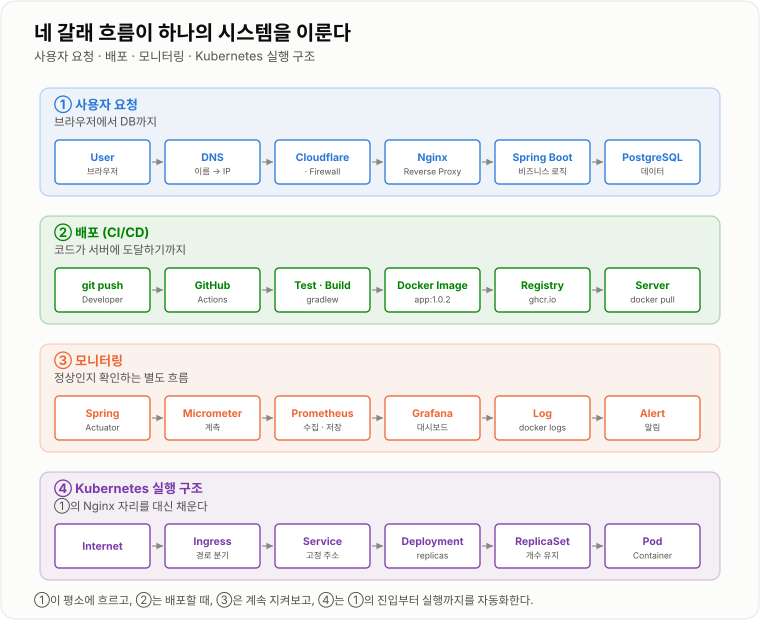

# 11. 전체 연결하기

> **개별 용어를 외우는 것보다, 두 개의 흐름을 머릿속에 그릴 수 있는 것이 목표다.**

1~10장에서 하나씩 본 것들을 한 장에 겹쳐 놓는다.
사용자 요청 흐름 하나, 배포 흐름 하나 — 이 둘이면 인프라 기초의 큰 틀은 잡힌다.

---

## 지금까지 배운 것을 하나로

```text
User Browser
     │ HTTPS
     ▼
   Domain
     ▼
    DNS
     ▼
 Internet
     ▼
Cloudflare / Firewall
     ▼
   Nginx
     ▼
 Spring Boot
     ▼
 PostgreSQL
```

Docker 환경이라면 뒤쪽 세 칸이 컨테이너로 바뀐다.

```text
서버 한 대
└ Docker
   ├ Nginx Container        ← 유일하게 80/443 이 밖에 열려 있다
   ├ Spring Container
   └ PostgreSQL Container
```

CI/CD까지 연결하면 별도의 흐름 하나가 더 붙는다.

```text
Developer → git push → GitHub Actions → Test · Build → Docker Image
                                                            ▼
                                          Registry → Server → Container
```

Monitoring은 그 옆에서 계속 돈다.

```text
Spring → Micrometer → Prometheus → Grafana
```

Kubernetes 환경에서는 진입부터 실행까지가 이렇게 펼쳐진다.

```text
Internet → Ingress → Service → Deployment → ReplicaSet → Pod → Spring Container
```



*①이 평소에 흐르고, ②는 배포할 때, ③은 계속 지켜보고, ④는 ①의 진입부터 실행까지를 자동화한다.*

---

## 같은 문제가 이름만 바꿔 반복된다

이 커리큘럼이 짧게 느껴지는 이유가 여기 있다.
**1장의 세 가지 규칙이 뒤 장에서 이름만 바꿔 계속 다시 나온다.**

| 1장의 규칙 | Docker | Compose | Kubernetes |
| -- | -- | -- | -- |
| 어떤 컴퓨터? (IP) | 컨테이너 IP | Service 이름 | Pod IP → Service |
| 어떤 프로그램? (Port) | `-p 8080:8080` | `ports:` | `containerPort` / `targetPort` |
| localhost는 자기 자신 | 컨테이너 자신 | 컨테이너 자신 | Pod 자신 |
| 어디에 bind? | `0.0.0.0` 이어야 매핑됨 | 같음 | 같음 |
| 앞에서 나눠 보내기 | — | Nginx | Ingress |
| 밖에 뭘 열까 | `-p` 를 붙인 것만 | `ports:` 를 쓴 것만 | Service · Ingress를 만든 것만 |

새 도구를 만나면 이 표의 어느 칸에 해당하는지부터 찾으면 대부분 빠르게 감이 온다.

---

## 최종적으로 설명할 수 있어야 하는 흐름

> 사용자가 브라우저에서 `https://example.com/api/users` 를 입력하면 무슨 일이 발생하는가?

```text
1.  Browser가 example.com의 주소를 DNS에 조회한다.
2.  Browser가 해당 Server의 443 포트로 TCP 연결을 만든다.
3.  TLS Handshake — 인증서를 검증하고 암호화 키를 협상한다.
4.  요청이 Nginx 또는 Ingress 같은 진입 지점으로 들어온다.
5.  Reverse Proxy가 경로를 보고 Backend Spring Server로 전달한다.
6.  Spring이 요청을 처리한다.
7.  필요하면 PostgreSQL 같은 DB에 접근한다.
8.  Spring이 결과를 반환한다.
9.  Nginx를 거쳐 Browser까지 HTTP Response가 돌아간다.
10. 운영자는 Log, Metric, Prometheus, Grafana로 이 과정이 정상인지 확인한다.
```

각 단계가 어느 장에 있었는지, 그리고 **그 단계가 깨졌을 때 어떤 증상이 나는지**까지 이으면
설명이 아니라 진단이 된다.

| 단계 | 어디서 다뤘나 | 깨지면 |
| -- | -- | -- |
| 1 · DNS | [1장](../01-네트워크/01-네트워크.md) · [6장](../06-DNS-HTTPS/06-DNS-HTTPS.md) | 도메인 자체가 안 열림 |
| 2 · TCP | [1장](../01-네트워크/01-네트워크.md) · [5장](../05-외부-접속/05-외부-접속.md) | Refused(즉시) 또는 Timeout(한참) |
| 3 · TLS | [6장](../06-DNS-HTTPS/06-DNS-HTTPS.md) | 인증서 경고, 만료 |
| 4~5 · 진입점 | [4장](../04-Nginx/04-Nginx.md) · [10장](../10-Kubernetes/10-Kubernetes.md) | 502 · 504 · 404 |
| 6~8 · 애플리케이션 | [2장](../02-Docker/02-Docker.md) · [3장](../03-Docker-Compose/03-Docker-Compose.md) | 500, 스택트레이스 |
| 10 · 확인 | [8장](../08-모니터링/08-모니터링.md) · [9장](../09-장애-대응/09-장애-대응.md) | 장애를 사용자가 먼저 안다 |

그리고 개발자가 새로운 코드를 배포하면 **별도 흐름**이 동작한다.

```text
git push → CI Test / Build → Docker Image 생성 → Registry → Server 배포 → 새 Container 실행
```

이 **두 개의 흐름**만 머릿속에서 자연스럽게 그릴 수 있어도 인프라 기초의 큰 틀은 잡힌 것이다.

---

## 직접 만들어 보는 순서

읽는 것과 굴려 보는 것은 다르다. 아래 순서로 하면 앞 단계가 다음 단계의 재료가 된다.

```text
① Spring Boot 하나를 8080에 띄우고 폰에서 접속해 본다        1장
② Dockerfile로 이미지를 만들어 컨테이너로 띄운다             2장
③ Compose로 Nginx + Spring + PostgreSQL 3단을 올린다        3 · 4장
④ 공유기 포트포워딩이나 Cloudflare Tunnel로 밖에서 연다      5장
⑤ 도메인을 붙이고 certbot으로 HTTPS를 건다                   6장
⑥ GitHub Actions로 push → 배포까지 자동화한다                7장
⑦ Actuator + Prometheus + Grafana를 붙인다                   8장
⑧ 일부러 깨뜨려 보고 증상을 눈에 익힌다                       9장
⑨ 같은 앱을 Kubernetes에 올려 본다                           10장
```

③까지만 해도 "서비스 하나를 굴린다"는 말이 되고,
⑥까지 하면 손으로 배포할 일이 없어지고,
⑧까지 하면 문제가 생겼을 때 어디를 볼지 안다.

---

## 각 장을 한 줄로

나중에 다시 훑을 때 쓸 요약이다.

| 장 | 한 줄 |
| -- | -- |
| [1. 네트워크](../01-네트워크/01-네트워크.md) | IP는 컴퓨터, Port는 프로그램, localhost는 말하는 쪽 자신 |
| [2. Docker](../02-Docker/02-Docker.md) | 실행 환경을 이미지로 묶고, 컨테이너는 자기만의 네트워크를 갖는다 |
| [3. Docker Compose](../03-Docker-Compose/03-Docker-Compose.md) | 여러 컨테이너를 YAML 하나로, 서로는 Service 이름으로 부른다 |
| [4. Nginx](../04-Nginx/04-Nginx.md) | 앞에 세워 정적 파일·라우팅·HTTPS를 떼어내고 뒤를 감춘다 |
| [5. 외부 접속](../05-외부-접속/05-외부-접속.md) | NAT가 막은 '밖 → 안'을 포워딩이나 터널로 연다 |
| [6. DNS / HTTPS](../06-DNS-HTTPS/06-DNS-HTTPS.md) | 이름을 IP로 잇고, 인증서로 상대가 맞는지 확인한다 |
| [7. CI/CD](../07-CI-CD/07-CI-CD.md) | push가 테스트·이미지·배포까지 이어지고, 태그가 있어야 되돌릴 수 있다 |
| [8. 모니터링](../08-모니터링/08-모니터링.md) | Log는 한 건씩, Metric은 추세. 사용자가 겪는 것부터 본다 |
| [9. 장애 대응](../09-장애-대응/09-장애-대응.md) | 증상으로 구간을 정하고, 한 칸씩 잘라 "여기까지 왔다"를 확정한다 |
| [10. Kubernetes](../10-Kubernetes/10-Kubernetes.md) | 명령이 아니라 원하는 상태를 선언하면 계속 맞춰 준다 |

---

## 학습 순서

처음부터 모든 내용을 완벽하게 이해할 필요는 없다.

```text
1.  Client / Server        8.  Nginx
2.  IP / Port              9.  외부 접속
3.  localhost              10. HTTPS
4.  Private / Public IP    11. CI/CD
5.  DNS / NAT              12. Log / Monitoring
6.  Docker                 13. 장애 대응
7.  Docker Compose         14. Kubernetes
```

특히 처음에는 아래 다섯 개만 확실히 잡아도 나머지가 훨씬 수월해진다.

```text
IP
Port
Docker
Nginx
DNS
```

Docker의 Port Mapping도, Nginx의 `proxy_pass` 도, Kubernetes의 Service도
결국 **"어떤 주소의 어떤 번호로 보낼 것인가"** 를 다시 쓰는 일이기 때문이다.
