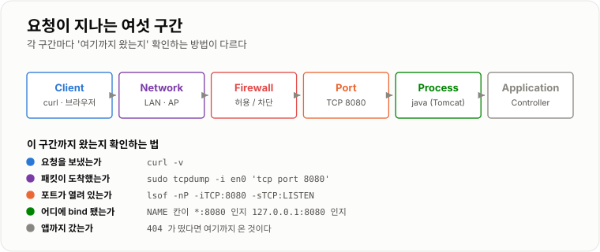
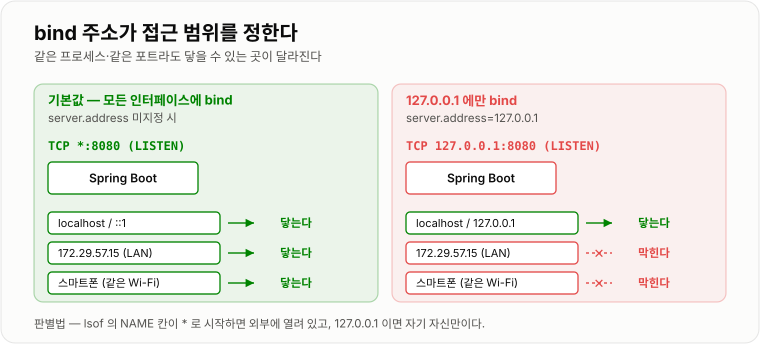
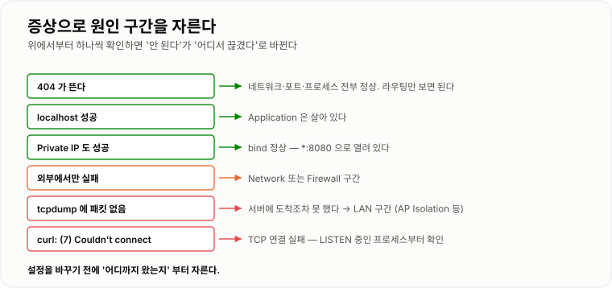

# 서버와 네트워크 기초

> **네트워크 장애는 "안 된다"가 아니라 Client → IP → Network → Port → Process → Application 중 어디까지 정상인지 잘라서 추적한다.**

`macOS 15 (Darwin 25)` · `OpenJDK 17.0.13` · `curl 8.7.1` · Wi-Fi `en0` · Spring Boot 내장 톰캣 8080

**하게 된 계기** — Spring Boot로 띄운 `/hello`를 같은 Wi-Fi에 붙은 스마트폰에서 열어 보려다
연결이 안 됐다. 원인을 찾는 과정에서 IP·Port·bind·방화벽이 각각 어디에 관여하는지 확인했다.

---

## 1. 핵심 개념

### Client / Server

* **Client**: 요청을 보내는 쪽
* **Server**: 요청을 기다리고 처리하는 쪽

Client/Server는 **물리적인 컴퓨터의 종류가 아니라 통신에서의 역할**이다.
같은 MacBook이 curl을 쓸 때는 Client고, Spring Boot를 띄우면 Server다.

```text
curl  →  Spring Boot
curl        = Client
Spring Boot = Server
```

### IP

네트워크에서 장치의 위치를 식별하기 위한 주소다.

```text
IP → 어떤 장치로 갈 것인가?
```

### Port

하나의 장치 안에서 **어떤 네트워크 서비스를 이용할지 구분하기 위한 번호**다.

```text
IP   → 장치
Port → 서비스
```

```text
172.29.57.15:8080
├─ 172.29.57.15 : MacBook
└─ 8080         : Spring Boot가 사용하는 Port
```

### localhost / 127.0.0.1

현재 장치 자기 자신을 의미하는 **Loopback 주소**다.

```text
MacBook의 127.0.0.1 → MacBook
iPhone의  127.0.0.1 → iPhone
```

Loopback 통신은 외부 네트워크로 나가지 않는다.

!!! warning "`localhost`는 `127.0.0.1`과 완전히 같은 말이 아니다"

    macOS의 `/etc/hosts`에는 **두 줄**이 들어 있다.

    ```text
    127.0.0.1       localhost
    ::1             localhost
    ```

    그래서 `curl http://localhost:8080`은 **IPv6 `::1`을 먼저 시도한다.** 실측 결과다.

    ```text
    *   Trying [::1]:18080...
    * Connected to localhost (::1) port 18080
    ```

    보통은 문제가 안 된다. JVM이 만드는 소켓은 IPv4와 IPv6를 동시에 받는
    dual-stack이라 `::1`로 들어와도 그대로 처리된다.
    하지만 서버를 **IPv4에만 bind**하면(`server.address=127.0.0.1` 등)
    `localhost`는 실패하고 `127.0.0.1`은 성공하는, 헷갈리는 상황이 생긴다.
    **연결 문제를 좁힐 때는 `localhost` 대신 `127.0.0.1`을 쓰는 편이 변수가 하나 적다.**

### Private IP

내부 네트워크에서 사용하는 IP다. 대표 범위는 셋이다.

```text
10.0.0.0     ~ 10.255.255.255
172.16.0.0   ~ 172.31.255.255
192.168.0.0  ~ 192.168.255.255
```

실습 MacBook의 Private IP는 `172.29.57.15`였다.
`172.16 ~ 172.31` 범위 안이므로 Private IP가 맞다.
(`172.` 로 시작한다고 전부 Private은 아니다. `172.32.0.0`은 Public이다.)

### Public IP

인터넷에서 네트워크를 식별하기 위한 주소다.
Private IP는 인터넷에서 직접 라우팅되지 않기 때문에 외부 통신 시 NAT 등이 필요하다.

### LAN

Local Area Network. 집, 회사 등 제한된 범위 안에서 구성된 로컬 네트워크다.

### NAT

Private Network와 Public Network 사이에서 IP 주소 및 필요에 따라 Port 정보를 변환한다.
내부 장치들이 **하나의 Public IP를 공유**하여 인터넷과 통신할 수 있도록 한다.

### Port Forwarding

외부의 특정 Port로 들어온 요청을 **내부의 특정 IP:Port로 전달하는 규칙**이다.

```text
PublicIP:8080
      ↓
    Router
      ↓
192.168.0.10:8080
```

### Firewall

네트워크 연결을 허용하거나 차단하는 필터 역할을 한다.
**Spring Security보다 앞단에서 동작한다.** 방화벽에서 막히면 애플리케이션 로그에는 아무것도 안 남는다.

---

## 2. 동작 구조

### localhost 요청

```text
curl
 ↓
localhost
 ↓
127.0.0.1  (또는 ::1)
 ↓
TCP 8080
 ↓
Spring Boot
 ↓
Controller
```

### LAN 요청

```text
Smartphone
 ↓
Wi-Fi
 ↓
LAN
 ↓
MacBook Private IP
 ↓
Firewall
 ↓
TCP 8080
 ↓
Spring Boot
 ↓
Controller
```

### 전체 Spring 요청 흐름

```text
Client → IP → Network → TCP → Port
  → Tomcat → DispatcherServlet → Controller → Service → Repository
```



*요청은 여섯 구간을 지난다. 장애가 나면 이 순서대로 어디까지 도달했는지 자른다.*

### bind — 누가 접근할 수 있는지는 여기서 갈린다

**이번 실습에서 가장 중요한 부분이다.** 서버가 켜져 있어도, **어떤 주소에 bind했느냐**에 따라
LAN의 다른 장치가 접근할 수 있는지가 결정된다.

Spring Boot는 `server.address`를 지정하지 않으면 **모든 인터페이스(`0.0.0.0`)에 bind**한다.
그래서 별도 설정 없이도 localhost와 Private IP 양쪽에서 접근된다.

`lsof`의 마지막 `NAME` 칸이 이걸 그대로 보여준다. 두 경우를 직접 띄워 비교한 결과다.

| bind 대상 | `lsof` NAME | localhost | Private IP | LAN의 다른 장치 |
| -- | -- | :--: | :--: | :--: |
| 기본값 (모든 인터페이스) | `TCP *:8080 (LISTEN)` | ✅ | ✅ | ✅ |
| `127.0.0.1` 만 | `TCP 127.0.0.1:8080 (LISTEN)` | ✅ | ❌ | ❌ |

```text
$ lsof -nP -iTCP:8080 -sTCP:LISTEN
COMMAND  PID  USER    FD  TYPE  ...  NAME
java     ...  <user>  4u  IPv6  ...  TCP *:8080 (LISTEN)
                                         ↑
                               여기가 * 면 모든 인터페이스,
                               127.0.0.1 이면 자기 자신만
```

**`*`인지 `127.0.0.1`인지만 보면 "외부에서 접근 가능한 상태인지"를 즉시 판별할 수 있다.**
`127.0.0.1`에만 bind한 서버에 Private IP로 접근하면 이렇게 끊긴다.

```text
$ curl http://172.29.57.15:8080/hello
curl: (7) Failed to connect to 172.29.57.15 port 8080 after 1 ms: Couldn't connect to server
```



*같은 프로세스, 같은 포트라도 bind 주소가 다르면 닿을 수 있는 곳이 달라진다.*

---

## 3. 주요 명령어

### Private IP 확인

```bash
ipconfig getifaddr en0
```

* `getifaddr`: 인터페이스에 할당된 IP 조회
* `en0`: **이 MacBook에서는** Wi-Fi 인터페이스

```text
172.29.57.15
```

!!! note "`en0`이 항상 Wi-Fi인 것은 아니다"

    기종·구성에 따라 `en0`이 이더넷일 수 있다. 이름을 외우지 말고 확인하는 습관이 낫다.

    ```bash
    networksetup -listallhardwareports    # Hardware Port: Wi-Fi → Device: en0
    tcpdump -D                            # en0 [Up, Running, Wireless, Associated]
    ```

    두 명령 모두 이 머신에서 `en0` = Wi-Fi임을 확인해 줬다. `tcpdump -D`는 sudo 없이도 된다.

### HTTP 요청

```bash
curl http://localhost:8080/hello
```

curl을 HTTP Client로 사용하여 Spring Boot 서버에 요청한다.

### Port LISTEN 확인

```bash
lsof -nP -iTCP:8080 -sTCP:LISTEN
```

* `-n`: 네트워크 번호를 호스트 이름으로 변환하지 않음
* `-P`: Port 번호를 서비스 이름으로 변환하지 않음 (`8080`을 `http-alt`로 바꾸지 않음)
* `-iTCP:8080`: TCP 8080 조회
* `-sTCP:LISTEN`: LISTEN 상태만 조회

```text
java  ...  TCP *:8080 (LISTEN)
```

Spring Boot Java 프로세스가 TCP 8080에서 연결을 기다리고 있음을 확인했다.
**`NAME` 칸을 반드시 같이 본다** — 위 [bind](#bind) 절 참고.

### 패킷 확인

```bash
sudo tcpdump -i en0 -n 'tcp port 8080'
```

* `-i en0`: Wi-Fi 인터페이스 감시
* `-n`: 주소를 숫자로 표시
* `tcp port 8080`: TCP 8080 관련 패킷만 확인

`sudo`가 필요한 이유는 캡처 장치가 root 전용이기 때문이다.

```text
$ ls -l /dev/bpf0
crw-------  1 root  wheel  ...  /dev/bpf0
```

---

## 4. 실습 내용

Spring Boot `/hello` API를 8080에서 실행했다.

```text
GET /hello
→ Hello World
```

### localhost 접근

```bash
curl http://localhost:8080/hello
```

```text
Hello World
```

### Private IP 접근

```bash
curl http://172.29.57.15:8080/hello
```

```text
Hello World
```

따라서 Spring Boot가 localhost뿐 아니라 **MacBook의 LAN 주소를 통한 요청도 받을 수 있음**을 확인했다.
`server.address`를 지정하지 않아 모든 인터페이스에 bind된 결과다.

### LISTEN 확인

```text
java  ...  TCP *:8080 (LISTEN)
```

Java 프로세스가 8080에서 연결을 기다리고 있음을, 그리고 `*`이므로
**LAN 쪽으로도 열려 있음**을 확인했다.

---

## 5. 발생한 문제와 해결

### 스마트폰에서 MacBook 접근 실패

스마트폰에서 `http://172.29.57.15:8080/hello`로 접근했지만 연결되지 않았다.
MacBook 자체에서는 동일한 주소로 정상 접근 가능했다.

확인한 것을 정리하면 이렇다.

| 확인 항목 | 결과 |
| -- | -- |
| `localhost` 접근 | 성공 |
| `172.29.57.15` 접근 (MacBook에서) | 성공 |
| 8080 LISTEN 상태 | 정상 (`*:8080`) |
| 스마트폰에서 접근 | **실패** |

`tcpdump`로 8080 패킷을 확인했으나 **스마트폰 요청이 전혀 잡히지 않았다.**

```text
Smartphone
 ↓
Cafe Wi-Fi
 ✗  ← 여기서 끊김
MacBook
```

따라서 Spring Boot나 8080보다 앞단에서 요청이 차단되고 있다고 판단했다.

!!! tip "패킷이 안 잡혔다는 것이 왜 방화벽을 지목하지 않는 근거인가"

    `tcpdump`는 BPF로 **인터페이스 단에서** 패킷을 캡처한다. 방화벽 필터링보다 앞이다.
    즉 **방화벽이 막았더라도 패킷 자체는 tcpdump에 보인다.**

    그런데 아무것도 안 잡혔다 → 패킷이 MacBook의 네트워크 인터페이스에 **도착조차 못 했다**
    → 원인은 MacBook 안이 아니라 **LAN 구간**에 있다.

    이래서 방화벽·bind·Spring Boot 설정을 건드리지 않고 네트워크 쪽을 의심하게 된 것이다.

카페 Wi-Fi의 **AP/Client Isolation**(같은 AP에 붙은 단말끼리의 통신을 차단하는 정책) 가능성이
높다고 추론했다. 공용 Wi-Fi에서는 보안상 기본으로 켜 두는 경우가 많다.

> **(미검증)** 카페 공유기 설정을 볼 수 없어 Isolation 자체를 직접 확인하지는 못했다.
> 집·개인 핫스팟처럼 Isolation이 없는 네트워크에서 같은 실험을 하면 갈린다.
> 거기서도 실패한다면 그때는 macOS 방화벽과 bind 주소를 의심할 차례다.

### Spring Boot 종료 후 요청

서버를 종료하고 요청했다.

```bash
curl http://localhost:8080/hello
```

```text
curl: (7) Failed to connect to localhost port 8080 after 0 ms: Couldn't connect to server
```

8080을 LISTEN 중인 프로세스가 없어 **TCP 연결 단계에서** 실패했다.
`(7)`은 curl의 종료 코드로, "연결 실패"를 의미한다.

### 잘못된 Port 접근

```bash
curl http://localhost:9999/hello
```

```text
curl: (7) Failed to connect to localhost port 9999 after 0 ms: Couldn't connect to server
```

역시 연결 실패했다. 9999를 LISTEN 중인 프로세스가 없기 때문이다.
**서버가 죽었을 때와 포트를 잘못 썼을 때의 메시지가 똑같다** — 메시지만으로는 구분되지 않으므로
`lsof`로 실제 LISTEN 상태를 봐야 한다.

---

## 6. 실무에서 왜 사용하는가

웹 요청 장애는 여러 계층에서 발생할 수 있다.

```text
Client → Network → Firewall → Port → Process → Application
```

따라서 장애 발생 시 설정을 무작정 변경하기보다 **요청이 어디까지 도착했는지를 단계별로 확인**해야 한다.

| 확인 결과 | 좁혀지는 범위 |
| -- | -- |
| `localhost` 성공 | Application 정상 가능성 |
| Private IP 성공 | bind 정상 가능성 (`*`로 열려 있음) |
| 외부 접근 실패 | Network / Firewall 조사 |
| `tcpdump` 패킷 없음 | 서버 도착 전 구간 조사 |



*위에서부터 하나씩 자르면 "안 된다"가 "어디서 끊겼다"로 바뀐다.*

---

## 7. 헷갈리기 쉬운 부분

### IP와 Port

```text
IP   ≠ 프로그램
Port ≠ 프로그램 자체

IP   → 네트워크 장치를 식별
Port → OS가 관리하는 네트워크 통신 지점
       → 이를 특정 프로세스가 사용
```

### localhost

localhost는 특정 서버를 의미하지 않는다. **항상 현재 실행 중인 장치 자신**을 의미한다.
그리고 macOS에서는 `127.0.0.1`뿐 아니라 `::1`로도 해석된다.

### NAT와 Port Forwarding

| | 하는 일 |
| -- | -- |
| **NAT** | Private Network ↔ Public Network 주소 변환 |
| **Port Forwarding** | 외부 Port → 내부 IP:Port. 외부 요청을 특정 내부 서버로 전달 |

### Connection Failed와 404

**이 둘을 구분하는 것이 장애 추적의 출발점이다.** 실측으로 확인했다.

| | 의미 | curl 종료 코드 |
| -- | -- | :--: |
| **Connection Failed** | TCP 연결 단계에서 실패. 서버에 닿지도 못했다 | `7` |
| **404** | 서버 도착 성공 → HTTP 처리 성공 → 요청 Path가 없음 | `0` |

404가 떴다는 것은 **네트워크·방화벽·포트·프로세스가 전부 정상**이라는 뜻이다.
남은 것은 애플리케이션의 라우팅 문제뿐이다.

---

## 8. 면접 질문

**localhost는 왜 다른 컴퓨터에서 접근할 수 없는가?**

localhost는 현재 장치를 가리키는 Loopback 주소이기 때문에 요청이 외부 네트워크로 전달되지 않는다.

**IP와 Port의 차이는 무엇인가?**

IP는 네트워크에서 장치를 식별하고, Port는 해당 장치 내부에서 통신할 서비스를 구분한다.

**Spring Boot가 8080에서 실행된다는 것은 무엇인가?**

Spring Boot의 내장 웹 서버가 OS의 TCP 8080 Port에 bind하여 LISTEN 상태로 클라이언트 연결을
기다리고 있다는 의미다. `server.address`를 지정하지 않으면 모든 인터페이스에 bind되어
`lsof`에 `*:8080`으로 나타나고, 이 경우 LAN의 다른 장치도 접근할 수 있다.

**127.0.0.1과 Private IP의 차이는?**

127.0.0.1은 현재 장치 자신만을 가리키는 Loopback 주소이고,
Private IP는 LAN 내 다른 장치와 통신하기 위해 사용하는 주소다.

**같은 Wi-Fi의 스마트폰은 어떻게 MacBook 서버를 찾아오는가?**

스마트폰이 MacBook의 Private IP로 요청하고, 요청이 LAN을 거쳐 MacBook에 도달한 뒤
지정된 TCP Port를 LISTEN 중인 Spring Boot 서버로 전달된다.
단, 서버가 `0.0.0.0`에 bind되어 있어야 하고 AP가 단말 간 통신을 막지 않아야 한다.

**404와 Connection Failed의 차이는?**

404는 서버까지 정상적으로 요청이 도달했지만 해당 HTTP 리소스가 없는 것이고,
Connection Failed는 HTTP 요청 이전의 TCP 연결 단계에서 실패한 것이다.

**서버는 켜져 있는데 다른 PC에서만 접속이 안 된다면 무엇부터 보겠는가?**

`lsof -nP -iTCP:<port> -sTCP:LISTEN`으로 bind 주소를 먼저 본다.
`127.0.0.1:<port>`면 애초에 외부로 열려 있지 않은 것이고, `*:<port>`인데도 안 되면
`tcpdump`로 패킷이 도착하는지 본다. 패킷이 잡히면 방화벽, 안 잡히면 네트워크 구간 문제다.

---

## 9. 오늘의 한 줄 요약

네트워크 장애는 "안 된다"가 아니라
**Client → IP → Network → Port → Process → Application 중 어디까지 정상인지 잘라서 추적한다.**

---

## 참고

- [`lsof(8)` man page](https://ss64.com/mac/lsof.html) — `-n` · `-P` · `-i` · `-s` 옵션
- [Spring Boot — `server.address`](https://docs.spring.io/spring-boot/appendix/application-properties/index.html#application-properties.server.server.address)
- [RFC 1918 — Private IP 대역](https://datatracker.ietf.org/doc/html/rfc1918)
- [curl 종료 코드](https://curl.se/libcurl/c/libcurl-errors.html) — `7 = CURLE_COULDNT_CONNECT`
