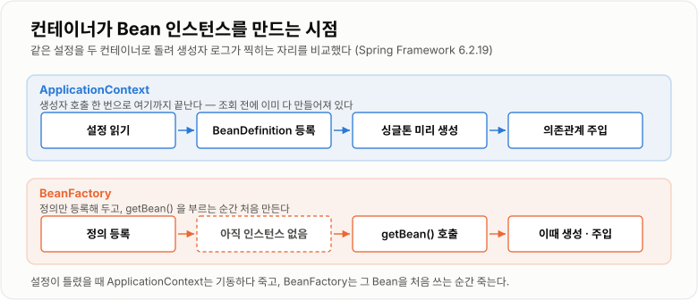

# 1. Spring IoC · DI · Bean

> **Spring은 객체를 대신 만들고(IoC) 연결하고(DI) 보관하는(Bean) 컨테이너다. 이 셋을 놓치면 `@Transactional`도 `@Autowired`도 안 먹는다.**

`Spring Framework 6.2.19` · Java 17 — 이 노트의 실측값은 전부 이 조합에서 컨테이너를 직접 띄워 확인했다.

## 개념 설명

> 개념 일반론은 커리큘럼 노트 [IoC · DI와 Bean](../../05-Spring/IoC-DI와-Bean/IoC-DI와-Bean.md)에 있다.
> 여기서는 **직접 컨테이너를 띄워 눈으로 확인한 것**과, 확인해 보니 알던 것과 달랐던 것만 본다.

### 왜 팠는가

"Spring이 왜 필요한가"를 객체 관리 관점에서 이해하는 것이 이번 주 목표였다.
순수 자바로 짜다 보면 이런 코드가 나온다.

```java
MemberRepository memberRepository = new MemoryMemberRepository();
MemberService memberService = new MemberService(memberRepository);
```

간단하지만 프로젝트가 커지면 무너진다.

- 누가 객체를 생성하는지 코드 곳곳에 흩어진다
- 구현체를 바꾸려면 생성 코드를 전부 고쳐야 한다
- 테스트에서 가짜 객체로 바꾸기 어렵다
- 객체 사이 의존관계가 사람이 못 따라갈 만큼 복잡해진다

Spring은 이 문제를 풀려고 객체 관리의 주도권을 가져간다.

### IoC — 제어권이 컨테이너로 넘어간다

IoC(Inversion of Control)는 원래 개발자가 하던 **객체 생성·연결의 제어를 프레임워크가 가져가는 것**이다.
`내가 객체를 만들고 쓰는 구조` → `Spring이 만들고 나는 받아서 쓰는 구조`로 바뀐다.

IoC가 없는 코드는 구현체를 자기가 결정한다.

```java
public class OrderService {
    // OrderService가 MemoryMemberRepository를 직접 고른다 = 제어권이 여기 있다
    private final MemberRepository memberRepository = new MemoryMemberRepository();
}
```

IoC가 적용되면 자기가 쓸 구현체를 모른다.

```java
@Service
public class OrderService {
    private final MemberRepository memberRepository;

    public OrderService(MemberRepository memberRepository) {   // 누가 넣어주는지는 Spring이 안다
        this.memberRepository = memberRepository;
    }
}
```

가장 흔한 실수는 **`@Service`를 붙여 놓고 내부에서 다시 `new` 하는 것**이다.
이러면 Bean으로 등록은 되지만 의존관계는 Spring이 관리하지 못해서, 구현체 교체도 테스트 대역 주입도 막힌다.

### DI — 의존 객체를 외부에서 넣는다

DI(Dependency Injection)는 **IoC를 실현하는 대표적인 방법**이다.
객체가 의존 객체를 직접 만들면 그 구현체에 강하게 묶이지만, 주입받으면 인터페이스만 알면 된다.

```java
public interface MemberRepository {
    void save(String name);
}

@Repository
public class MemoryMemberRepository implements MemberRepository {
    @Override public void save(String name) { }
}

@Service
public class MemberService {
    private final MemberRepository memberRepository;

    public MemberService(MemberRepository memberRepository) {
        this.memberRepository = memberRepository;
    }
}
```

컨테이너를 띄워 보면 `MemberService`에 `MemoryMemberRepository`가 실제로 꽂힌다.

```text
[ctor] MemoryMemberRepository
[ctor] MemberService
injected repo impl: MemoryMemberRepository
```

### 같은 타입 Bean이 둘일 때 — 실제로는 파라미터 이름으로도 풀린다

여기가 알던 것과 가장 크게 달랐던 부분이다.
같은 타입 Bean이 둘이면 무조건 실패한다고 알고 있었는데, **파라미터 이름이 Bean 이름과 같으면 그냥 주입된다.**

`memoryRepo`·`jpaRepo` 두 Bean을 두고 주입 파라미터 이름만 바꿔 가며 돌린 결과다.

```text
3a) 파라미터 이름이 어느 Bean 이름과도 다름 (memberRepository)
    NoUniqueBeanDefinitionException:
    No qualifying bean of type '...MemberRepository' available:
    expected single matching bean but found 2: memoryRepo,jpaRepo

3b) 파라미터 이름 == Bean 이름 (jpaRepo)       → OK, injected: JpaRepo
3c) 한쪽에 @Primary                            → OK, injected: MemoryRepo
```

**다만 이 이름 매칭은 `-parameters` 컴파일 옵션에 딸려 있다.** 같은 코드를 그 옵션 없이 컴파일하면
3b도 `NoUniqueBeanDefinitionException`으로 죽는다. Spring Framework 6부터는 바이트코드에서 파라미터
이름을 되찾아 오던 방법이 빠져서, 이름이 없으면 매칭 자체를 못 한다.

```text
-parameters 없이 컴파일한 3b:
    NoUniqueBeanDefinitionException: ... found 2: memoryRepo,jpaRepo
```

Spring Boot는 양쪽 빌드 도구에서 이 옵션을 기본으로 켜 준다. Gradle 플러그인 문서는
"Configures any `JavaCompile` tasks to use the `-parameters` compiler argument"라고 적어 두었고,
`spring-boot-starter-parent` POM에도 `maven-compiler-plugin`의 `<parameters>true</parameters>`가 박혀 있다.
그래도 **이름에 기대는 해결책은 컴파일 설정에 의존한다는 뜻**이라 `@Qualifier`나 `@Primary`가 더 안전하다.

### Bean — 컨테이너가 만들고 관리하는 객체

Bean은 **Spring 컨테이너가 생성하고 관리하는 객체**다. 이름과 함께 컨테이너에 등록된다.

```text
beanName=memberService          scope='singleton'
beanName=memoryMemberRepository scope='singleton'
beanName=URLService             scope='singleton'
```

**기본 이름은 클래스명의 첫 글자를 소문자로 바꾼 것**인데, `URLService`가 `uRLService`가 아니라
`URLService` 그대로 남았다. 앞 두 글자가 모두 대문자면 그대로 둔다. 약어로 시작하는 클래스를
이름으로 조회하다 못 찾는 일이 여기서 나온다.

`new`로 만든 객체는 그냥 자바 객체다. 컨테이너 밖이라 주입·생명주기·AOP·트랜잭션이 전부 안 걸린다.

```java
// 이 객체는 Bean이 아니다 — @Transactional 을 붙여 놔도 동작하지 않는다
MemberService memberService = new MemberService(new MemoryMemberRepository());
```

### BeanFactory와 ApplicationContext — 만드는 시점이 다르다

둘의 차이를 "기능이 많다/적다"로만 알고 있었는데, **싱글톤을 언제 만드느냐**가 눈에 보이는 차이였다.

`BeanFactory`는 정의만 등록해 두고 `getBean()`을 부를 때 만든다.

```text
definition registered. instance created yet? -> see below
-- calling getBean() now --
[ctor] Widget          ← 여기서 처음 만들어진다
same instance? true
```

`ApplicationContext`는 생성자(내부 `refresh()`) 안에서 싱글톤을 **미리 다 만든다.**

```text
-- calling new AnnotationConfigApplicationContext(Cfg.class) --
[ctor] MemoryMemberRepository
[ctor] MemberService
[ctor] Widget
-- constructor returned; nothing looked up yet --   ← 아직 아무것도 조회하지 않았다
```

그래서 설정이 틀렸으면 **애플리케이션이 뜨는 시점에** 터진다. 첫 요청까지 숨어 있지 않는 것이
`ApplicationContext`를 쓰는 실질적인 이득이다. 여기에 메시지·이벤트·환경 변수·리소스 조회가 더 붙는다.



*조회 전에 다 만들어 두느냐, 조회할 때 만드느냐 — 오류가 드러나는 시점이 여기서 갈린다.*

### BeanDefinition — 등록 방식이 달라도 설계도는 하나

`@Component`로 스캔한 것도, `@Bean`으로 등록한 것도 결국 `BeanDefinition`이라는 메타정보로 통합된다.
클래스만 다를 뿐 컨테이너가 다루는 방식은 같다.

```text
memberService  -> ScannedGenericBeanDefinition
  beanClassName=demo.scan.MemberService
  factoryMethod=null / lazy=false / scope=singleton

widget         -> ConfigurationClassBeanDefinition
  beanClassName=null                ← 클래스가 아니라
  factoryMethod=widget              ← 팩토리 메서드로 만든다
```

`@Bean` 쪽은 `beanClassName`이 비어 있고 `factoryMethod`가 채워져 있다.
**"클래스를 스캔했나, 메서드가 만들어 줬나"의 차이일 뿐** 이후 생성·주입·생명주기 처리는 동일하다.

### 컴포넌트 스캔과 등록 애노테이션

`@Bean`을 하나씩 쓰기 번거로우니, 지정한 패키지 아래를 훑어 `@Component`(그리고 그 특수화인
`@Service`·`@Repository`·`@Controller`·`@Configuration`)가 붙은 클래스를 자동 등록한다.
Spring Boot는 `@SpringBootApplication`이 붙은 클래스의 패키지를 기준으로 하위를 스캔한다.

- `@Service` — 비즈니스 로직
- `@Repository` — 데이터 접근. **여기만 부가 의미가 있다.** 데이터 접근 예외를 Spring의 공통
  예외 계층(`DataAccessException`)으로 바꿔 준다. 공식 문서에 따르면 이 변환은
  `PersistenceExceptionTranslationPostProcessor`가 하고, 이 후처리기는
  "advises all beans marked with the `@Repository` annotation" — 즉 **`@Repository`가 붙은 Bean만** 감싼다
- `@Controller` — 웹 요청 처리

등록 기능만 보면 넷이 같다. 나누는 이유는 **계층 역할을 코드에 드러내려는 것**이다.

### @Configuration — 프록시가 싱글톤을 지킨다

`@Configuration` 안에서 `@Bean` 메서드를 직접 호출하면 새 객체가 생길 것 같지만 그렇지 않다.
Spring이 설정 클래스를 CGLIB으로 감싸서, 이미 만든 Bean이 있으면 그것을 돌려준다.

```java
@Configuration                     // proxyBeanMethods 기본값 true
public class AppConfig {
    @Bean public Repo repo() { return new Repo(); }
    @Bean public Svc  svc()  { return new Svc(repo()); }   // 직접 호출한다
}
```

실제 설정 클래스의 정체와 결과다.

```text
ProxyOn  config class : demo.Verify$ProxyOn$$SpringCGLIB$$0
ProxyOn  svc.repo == container repo ? true      ← 같은 객체

ProxyOff config class : demo.Verify$ProxyOff    ← 프록시 없음
ProxyOff svc.repo == container repo ? false     ← 다른 객체가 하나 더 생겼다
```

`proxyBeanMethods = false`로 끄면 프록시가 사라지고 **`svc`가 컨테이너의 `repo`와 다른 객체를 들고 있다.**
`@Bean` 메서드끼리 호출하는 구조라면 이 값을 끄면 안 된다.

### 생성자 주입과 순환참조

생성자 주입을 권장하는 이유는 스타일 문제가 아니다. `final`을 쓸 수 있어 불변이 보장되고,
Spring 없이도 `new`로 조립해 테스트할 수 있고, **순환참조가 시작 시점에 바로 드러난다.**

마지막 항목을 실제로 확인했다. `AService ↔ BService`를 생성자로 서로 물리면 뜨지 못한다.

```text
4) 생성자 순환참조
   thrown : UnsatisfiedDependencyException
   root   : BeanCurrentlyInCreationException
   message: Error creating bean with name 'aService':
            Requested bean is currently in creation:
            Is there an unresolvable circular reference ...?
```

반면 **필드 주입으로 물린 순환참조는 순수 Spring Framework에서 그냥 통과한다.**

```text
5) 필드 주입 순환참조
   OK -> CService.d = DService
```

생성자는 객체를 만들려면 상대가 먼저 완성돼야 해서 불가능하지만, 필드 주입은 빈 껍데기를 먼저
만들고 나중에 꽂기 때문에 성립한다. 문제가 숨는다는 뜻이다.
Spring Boot는 2.6부터 이 구멍을 막았다. 릴리스 노트에 "Circular references between beans are now
prohibited by default"라고 적혀 있고, 정 못 끊겠으면 `spring.main.allow-circular-references=true`로
2.5 동작을 되살릴 수 있다. 되살리는 것이 해결이 아니라는 뜻으로 읽는 편이 맞다.

생성자 파라미터가 7~8개를 넘어가면 순환참조와 별개로 **그 클래스의 책임이 너무 많다는 신호**다.

### 싱글톤 Bean과 스레드 안전

Bean의 기본 스코프는 `singleton`이고, 위 출력에서도 전부 `scope='singleton'`이었다.
두 번 조회해도 같은 객체다.

```text
same instance on two lookups? true
```

컨테이너당 하나를 여러 스레드가 공유한다는 뜻이라, **"싱글톤이라 안전하다"는 정반대다.**
하나뿐이라서 오히려 상태를 공유한다.

```java
@Service
public class PriceService {
    private int price;                       // 요청마다 덮어써진다
    public void setPrice(int price) { this.price = price; }
    public int getPrice() { return price; }
}
```

원칙은 하나다. **싱글톤 Bean은 무상태로 설계한다.** 요청별 데이터는 지역변수·파라미터·반환값으로
넘기고, 정말 필요하면 request 스코프나 `ThreadLocal`을 검토한다.

### 전체 흐름 한 줄로

Spring은 시작할 때 `ApplicationContext`를 만들고 → 컴포넌트 스캔과 `@Bean` 설정으로 Bean 후보를 모아
→ 각각을 `BeanDefinition`으로 관리하고 → 싱글톤을 미리 생성한 뒤 → 의존관계를 주입한다.
이 흐름이 곧 IoC/DI이고, 그 결과 개발자는 객체 조립이 아니라 비즈니스 로직에 집중한다.

### 헷갈렸던 것

| 이렇게 알고 있었다 | 실제 |
| -- | -- |
| 같은 타입 Bean이 둘이면 무조건 주입 실패 | 파라미터 이름이 Bean 이름과 같으면 통과한다. 단 `-parameters` 없이 컴파일하면 실패 |
| Bean 이름은 항상 첫 글자를 소문자로 바꾼 것 | 앞 두 글자가 대문자면 그대로다 (`URLService` → `URLService`) |
| ApplicationContext도 필요할 때 객체를 만든다 | 생성자 안에서 싱글톤을 전부 미리 만든다. 늦게 만드는 쪽은 `BeanFactory` |
| `@Configuration` 없이 `@Bean`만 써도 결과는 같다 | `proxyBeanMethods=false`면 `@Bean` 메서드 직접 호출이 새 객체를 만든다 |
| 순환참조는 어떤 주입 방식이든 실패한다 | 순수 Framework에서 필드 주입 순환참조는 통과한다. 생성자만 즉시 실패 |
| 싱글톤이니까 스레드에 안전하다 | 하나를 공유하는 것이라 오히려 상태를 두면 위험하다 |

## 면접 질문

### Q1. IoC와 DI의 차이를 설명해주세요.
**IoC는 제어권이 컨테이너로 넘어간다는 원칙이고, DI는 그 원칙을 구현하는 대표적인 방법입니다.**

IoC는 객체를 언제 만들고 어떻게 연결할지를 개발자 코드가 아니라 Spring이 결정한다는 큰 이야기입니다.
DI는 그중에서 "필요한 의존 객체를 직접 만들지 않고 밖에서 넣어 준다"는 구체적인 수단입니다.
그래서 DI는 IoC의 부분집합이고, Spring은 DI로 IoC를 실현합니다.

### Q2. Spring Bean이란 무엇인가요?
**Spring 컨테이너가 생성하고 이름을 붙여 관리하는 객체입니다.**

컨테이너 안에 `memberService` 같은 이름과 타입, 실제 인스턴스가 함께 등록됩니다.
Bean이 되면 의존성 주입, 생명주기 콜백, 싱글톤 재사용, AOP와 트랜잭션 프록시를 적용받습니다.
`new`로 만든 객체는 컨테이너 밖이라 이 기능들이 하나도 걸리지 않습니다.

### Q3. BeanFactory와 ApplicationContext의 차이는 무엇인가요?
**BeanFactory는 Bean 생성과 조회만 하는 최소 컨테이너이고, ApplicationContext는 거기에 실무 기능을 얹은 확장입니다.**

기능 차이 말고 눈에 띄는 차이는 인스턴스를 만드는 시점입니다. 직접 확인해 보니 BeanFactory는
`getBean()`을 부를 때 처음 만들고, ApplicationContext는 생성자 안에서 싱글톤을 전부 미리 만듭니다.
그래서 설정 오류가 첫 요청이 아니라 애플리케이션 기동 시점에 드러납니다.
여기에 메시지 소스, 이벤트, 환경 변수와 프로파일, 리소스 로딩이 더해져서 실무에서는 이쪽을 씁니다.

### Q4. BeanDefinition은 왜 필요한가요?
**등록 방식이 달라도 컨테이너가 하나의 설계도로 다루기 위해서입니다.**

`@Component` 스캔, `@Bean` 메서드, XML 설정은 겉모습이 전혀 다르지만 전부 BeanDefinition으로 변환됩니다.
실제로 정의를 꺼내 보면 스캔한 쪽은 `beanClassName`이 채워져 있고, `@Bean` 쪽은 그 자리가 비고
`factoryMethod`가 대신 채워져 있습니다. 이후의 생성·주입·스코프·생명주기 처리는 완전히 같은 경로를 탑니다.

### Q5. Component Scan은 어떤 방식으로 동작하나요?
**지정한 패키지 아래를 훑어 스테레오타입 애노테이션이 붙은 클래스를 찾아 Bean으로 등록합니다.**

`@Component`와 그 특수화인 `@Service`·`@Repository`·`@Controller`·`@Configuration`이 대상입니다.
Spring Boot에서는 `@SpringBootApplication`에 `@ComponentScan`이 들어 있어서, 그 클래스가 있는 패키지가
스캔 기준점이 됩니다. 그래서 메인 클래스를 너무 깊은 패키지에 두면 등록이 통째로 누락됩니다.

### Q6. @Component와 @Bean의 차이는 무엇인가요?
**@Component는 클래스를 스캔해 자동 등록하고, @Bean은 설정 클래스 메서드의 반환값을 수동 등록합니다.**

내가 소스를 고칠 수 있는 클래스는 `@Component`가 간단하지만, `ObjectMapper` 같은 외부 라이브러리
클래스에는 애노테이션을 붙일 수 없으니 `@Bean`으로 등록합니다. 생성 과정에 조건이나 설정값이
끼어드는 객체도 `@Bean`이 맞습니다. 등록 방식만 다르고 컨테이너 안에서는 둘 다 BeanDefinition으로 같습니다.

### Q7. @Service, @Repository, @Controller를 구분해서 쓰는 이유는?
**등록 기능은 같지만 계층 역할을 코드에 드러내기 위해서입니다.**

셋 다 `@Component`를 메타 애노테이션으로 달고 있어서 스캔 대상이 되는 것은 동일합니다.
다만 이름으로 이 클래스가 비즈니스 로직인지 데이터 접근인지 웹 진입점인지가 드러나고,
AOP 포인트컷이나 아키텍처 검증 도구에서 계층을 지정하는 기준으로도 쓰입니다.
`@Repository`만 예외 변환이라는 실제 부가 기능이 하나 더 있습니다.

### Q8. @Repository가 가지는 특별한 의미는 무엇인가요?
**데이터 접근 기술마다 다른 예외를 Spring의 공통 예외 계층으로 바꿔 줍니다.**

JDBC, JPA, MyBatis는 각자 다른 예외를 던지는데, 이것을 그대로 받으면 서비스 계층이 특정 기술에 묶입니다.
`@Repository`가 붙은 Bean은 예외 변환기가 감싸서 `DataAccessException` 계열로 바꿔 주기 때문에
서비스 계층이 기술 중립적으로 남습니다. 다만 이 변환은 변환기 Bean이 등록돼 있어야 동작합니다.

### Q9. 생성자 주입을 권장하는 이유는 무엇인가요?
**객체가 만들어지는 순간 필수 의존성이 모두 채워지는 것이 보장되기 때문입니다.**

필드를 `final`로 둘 수 있어 불변이 지켜지고, 절반만 초기화된 객체가 돌아다니지 않습니다.
테스트에서는 Spring을 띄우지 않고 `new`로 대역을 넣어 조립할 수 있습니다.
순환참조도 기동 시점에 바로 드러나서, 문제를 배포 후가 아니라 빌드 단계에서 만나게 됩니다.

### Q10. 필드 주입의 단점은 무엇인가요?
**의존관계가 숨고, 불변을 보장할 수 없고, 문제를 늦게 발견합니다.**

`@Autowired` 필드는 생성자에 드러나지 않아서 이 클래스가 무엇을 필요로 하는지 밖에서 알 수 없습니다.
`final`을 쓸 수 없으니 나중에 바뀔 수 있고, 테스트에서 대역을 넣으려면 리플렉션이나 컨테이너가 필요합니다.
확인해 보니 필드 주입은 순환참조가 있어도 순수 Spring Framework에서는 그냥 뜨기 때문에,
설계 문제가 드러나지 않고 묻히는 것이 가장 큰 단점입니다.

### Q11. Spring이 객체를 직접 관리하는 이유는 무엇인가요?
**의존관계·생명주기·공통 기능을 한곳에서 일관되게 통제하기 위해서입니다.**

컨테이너가 객체를 쥐고 있어야 같은 인스턴스를 재사용하고, 초기화와 종료 시점을 제어하고,
프록시를 씌워 트랜잭션이나 로깅 같은 공통 기능을 끼워 넣을 수 있습니다.
환경별로 다른 구현체를 갈아 끼우는 것도 컨테이너가 조립을 담당하기 때문에 가능합니다.
편의의 문제가 아니라, 객체가 수백 개로 늘었을 때 사람이 못 하는 일을 대신하는 것입니다.

### Q12. Spring Bean의 기본 scope는 무엇인가요?
**singleton입니다. 컨테이너당 인스턴스 하나를 만들어 모두가 공유합니다.**

실제로 등록된 Bean들의 스코프를 찍어 보면 전부 `singleton`이고, 같은 타입을 두 번 조회해도
동일한 객체가 나옵니다. 웹 서버처럼 동시에 많은 요청을 처리하는 환경에서 요청마다 객체를 새로
만들면 생성 비용과 메모리가 낭비되기 때문에 이 기본값이 합리적입니다.
요청마다 새 인스턴스가 필요하면 prototype이나 request 스코프를 따로 지정합니다.

### Q13. 싱글톤 Bean에서 thread safety 문제가 생기는 이유는?
**인스턴스가 하나뿐이라 여러 스레드가 같은 필드를 동시에 건드리기 때문입니다.**

싱글톤은 "하나만 존재한다"는 뜻이지 "동시 접근에 안전하다"는 뜻이 아닙니다.
Bean 필드에 현재 사용자나 계산 중인 값 같은 상태를 담아 두면, 두 요청이 서로의 값을 덮어씁니다.
그래서 싱글톤 Bean은 무상태로 두고, 요청별 데이터는 지역변수와 파라미터로만 흐르게 설계합니다.

### Q14. 순환참조는 왜 문제인가요?
**A를 만들려면 B가 완성돼야 하고 B를 만들려면 A가 완성돼야 해서, 생성 순서를 정할 수 없기 때문입니다.**

생성자 주입으로 서로를 물리면 컨테이너가 기동하다가 `BeanCurrentlyInCreationException`으로 멈춥니다.
필드 주입이면 빈 껍데기를 먼저 만들고 나중에 꽂기 때문에 순수 Spring Framework에서는 통과하는데,
이건 해결이 아니라 은폐라서 Spring Boot는 2.6부터 이쪽도 기본으로 막았습니다.
애초에 두 클래스의 책임 경계가 잘못 그어졌다는 신호이므로,
공통 로직을 제3의 Bean으로 빼거나 이벤트로 방향을 한쪽으로 정리하는 것이 정답입니다.

### Q15. new로 만든 객체와 Spring Bean의 차이는 무엇인가요?
**컨테이너의 관리 대상인지 아닌지의 차이이고, 그 결과 Spring 기능이 걸리는지가 갈립니다.**

`new`로 만든 객체는 그냥 자바 객체라서 `@Autowired`도 `@Transactional`도 AOP도 동작하지 않습니다.
트랜잭션이 프록시로 걸리는 구조라, 컨테이너가 감싸 주지 않으면 애노테이션이 주석과 다를 바 없습니다.
`@Service`를 붙인 클래스라도 그 안에서 다시 `new`로 협력 객체를 만들면 그 객체는 Bean이 아니라는
점도 같이 걸립니다.

## 참고
- [Spring Framework 6.2 — The IoC Container](https://docs.spring.io/spring-framework/reference/6.2/core/beans.html)
- [Spring Framework 6.2 — Dependency Injection](https://docs.spring.io/spring-framework/reference/6.2/core/beans/dependencies/factory-collaborators.html)
- [Spring Framework 6.2 — Bean Scopes](https://docs.spring.io/spring-framework/reference/6.2/core/beans/factory-scopes.html)
- [Spring Framework 6.2 — 예외 변환과 `@Repository`](https://docs.spring.io/spring-framework/reference/6.2/data-access/orm/general.html)
- [Spring Boot 2.6 릴리스 노트 — 순환참조 기본 금지](https://github.com/spring-projects/spring-boot/wiki/Spring-Boot-2.6-Release-Notes)
- [Spring Boot Gradle 플러그인 — `-parameters` 자동 설정](https://docs.spring.io/spring-boot/gradle-plugin/reacting.html)
- 커리큘럼 노트 [IoC · DI와 Bean](../../05-Spring/IoC-DI와-Bean/IoC-DI와-Bean.md)
