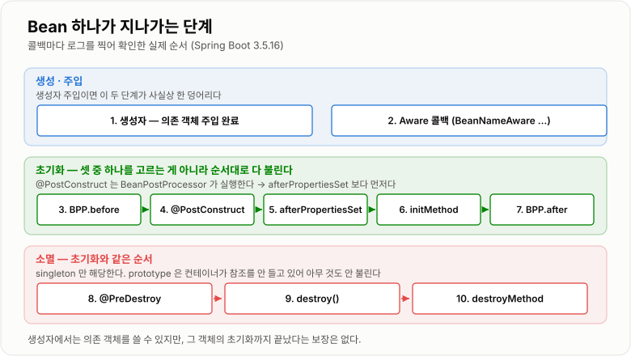
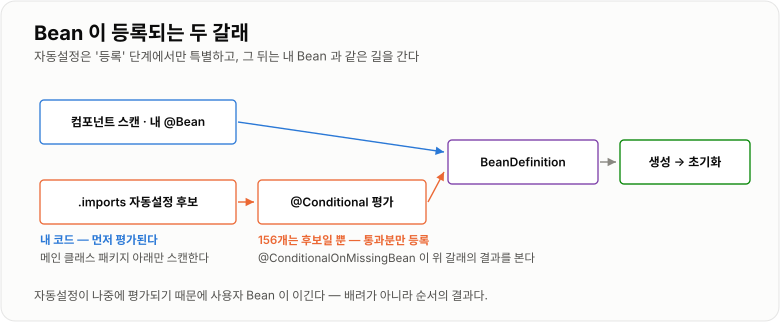

# 2. Bean 생명주기와 Spring Boot 자동설정

> **Bean은 등록 → 생성 → 주입 → 초기화 → 사용 → 소멸을 탄다. 자동설정은 그중 "등록" 단계를 조건부로 대신해 주는 것일 뿐, 그 뒤는 내가 만든 Bean과 완전히 같은 길을 간다.**

`Spring Boot 3.5.16` · `Spring Framework 6.2.19` · Java 17 — 아래 로그는 전부 이 조합으로 직접 띄워 찍은 것이다.

## 개념 설명

> 개념 일반론은 커리큘럼 노트 [IoC · DI와 Bean](../../05-Spring/IoC-DI와-Bean/IoC-DI와-Bean.md)과
> [Spring Boot와 예외 처리](../../05-Spring/Spring-Boot와-예외처리/Spring-Boot와-예외처리.md)에 있다.
> 여기서는 **실제로 돌려서 순서를 확인한 것**과, 확인해 보니 알던 것과 달랐던 것만 본다.
> 1주차 내용([Spring IoC · DI · Bean](../01-Spring-IoC-DI-Bean/01-Spring-IoC-DI-Bean.md))에서 이어진다.

### 왜 팠는가

`@Configuration`도 starter도 쓰고는 있는데, **Spring Boot가 시작될 때 무엇을 읽고 어떤 순서로 Bean을
만드는지**를 흐름으로 말할 수 없었다. 특히 "왜 내가 만든 Bean이 자동설정을 이기는가"를 설명하지 못했다.

### Bean 하나가 완성되기까지 — 직접 찍어 본 순서

`BeanNameAware` · `BeanPostProcessor` · `@PostConstruct` · `InitializingBean` · `initMethod`를 한 Bean에
전부 달고 컨테이너를 띄웠다. 출력이 곧 순서다.

```text
>> 1. constructor (의존 객체 주입 완료: true)
>> 2. BeanNameAware.setBeanName
>> 3. BPP.postProcessBeforeInitialization
>> 4. @PostConstruct
>> 5. InitializingBean.afterPropertiesSet
>> 6. @Bean(initMethod) custom init
>> 7. BPP.postProcessAfterInitialization
   ... 사용 ...
>> 8. @PreDestroy
>> 9. DisposableBean.destroy
>> 10. @Bean(destroyMethod) custom destroy
```

읽을 때 중요한 지점은 셋이다.

- **생성자에서 이미 의존 객체가 들어와 있다.** 생성자 주입은 "생성"과 "주입"이 한 번에 일어난다.
  그래서 생성자 안에서는 다른 Bean을 쓸 수 있지만, 그 Bean이 *초기화까지 끝났는지*는 보장되지 않는다.
- **초기화 콜백은 셋이 순서대로 다 불린다.** 하나를 고르는 것이 아니라 `@PostConstruct` →
  `afterPropertiesSet()` → `initMethod` 순으로 전부 실행된다. 소멸도 같은 순서다.
  공식 문서의 "Combining Lifecycle Mechanisms"가 이 순서를 그대로 규정하고 있다.
- **`@PostConstruct`는 BeanPostProcessor가 실행한다.** 별개의 기능이 아니라
  "초기화 전 후처리" 단계 안에서 불리는 것이라, `afterPropertiesSet()`보다 먼저 온다.



*생성과 주입은 한 덩어리, 초기화 콜백은 셋이 순서대로, 소멸도 같은 순서 — 실제 로그가 이 순서였다.*

### BeanPostProcessor — 확장 포인트

`BeanPostProcessor`는 **모든 Bean의 초기화 전후에 끼어들 수 있는 컨테이너 차원의 확장 포인트**다.
`@PostConstruct` 처리도, AOP 프록시로 바꿔치기하는 것도 전부 이 자리에서 일어난다.

```java
public class TraceBeanPostProcessor implements BeanPostProcessor {
    @Override
    public Object postProcessBeforeInitialization(Object bean, String name) {
        return bean;                       // 다른 객체를 반환하면 그것이 Bean이 된다
    }

    @Override
    public Object postProcessAfterInitialization(Object bean, String name) {
        return bean;                       // AOP 프록시가 끼어드는 자리가 여기다
    }
}
```

반환값이 곧 컨테이너에 들어갈 객체라서, **여기서 잘못된 객체를 돌려주면 그 Bean이 통째로 망가진다.**
`@PostConstruct`가 "이 Bean 하나의 초기화 메서드"라면 `BeanPostProcessor`는 "모든 Bean을 지나가는
파이프라인"이다. 면접에서 둘을 같은 층위로 말하면 안 되는 이유가 이것이다.

### prototype 스코프는 소멸을 관리하지 않는다

같은 `@PreDestroy`를 prototype Bean에 달고 컨테이너를 닫아 봤다. **초기화는 불리는데 소멸은 안 불린다.**

```text
[prototype] @PostConstruct            ← getBean() 할 때 찍힘
... 컨테이너 close() ...
(아무 것도 안 찍힘)                    ← @PreDestroy 는 끝내 불리지 않았다
```

컨테이너는 prototype Bean을 만들어 건네주고 나면 참조를 들고 있지 않기 때문에 소멸시킬 방법이 없다.
**커넥션·스레드풀처럼 정리가 필요한 자원을 prototype Bean에 두면 그대로 샌다.** 직접 닫아야 한다.

### @Configuration과 @Import — 설정을 조립한다

`@Configuration`은 설정 클래스를 표시하고, 그 안의 `@Bean` 메서드를 BeanDefinition으로 등록한다.
프록시로 싱글톤을 지키는 동작은 1주차에서 실측해 뒀다.

`@Import`는 설정 클래스를 다른 설정에서 끌어오는 장치다.

```java
@Configuration
@Import(DatabaseConfig.class)
public class AppConfig { }
```

**Spring Boot 자동설정도 결국 이 "설정 클래스 가져오기"의 확장판**이다.
차이는 가져올 목록을 코드에 적지 않고 파일에서 읽는다는 것, 그리고 조건을 붙여 걸러낸다는 것뿐이다.

### @Conditional — 자동설정이 조건 기반이어야 하는 이유

자동설정은 모든 프로젝트에 똑같이 적용될 수 없다. 웹을 안 쓰는데 톰캣을 띄우면 안 되고,
내가 `DataSource`를 직접 만들었으면 Boot가 또 만들면 안 된다. 그래서 **조건을 통과한 것만 등록**한다.

| 애노테이션 | 무엇을 보는가 |
| -- | -- |
| `@ConditionalOnClass` | 그 클래스가 classpath에 있는가 |
| `@ConditionalOnMissingBean` | 같은 타입 Bean이 아직 없는가 |
| `@ConditionalOnProperty` | 그 설정값이 켜져 있는가 |
| `@ConditionalOnWebApplication` | 지금 웹 애플리케이션인가 |

조건 평가 결과는 `ConditionEvaluationReport`로 남는다. 실제로 찍어 보면 이렇게 나온다.

```text
[적용]   MyAutoConfiguration#greeter
  @ConditionalOnMissingBean (types: bootdemo.Greeter; SearchStrategy: all) did not find any beans
[물러남] UserConfig
  @ConditionalOnProperty (demo.user-greeter=on) did not find property 'demo.user-greeter'
```

**"왜 이 Bean이 안 생겼지?"의 답이 전부 이 리포트에 있다.** 애플리케이션을 `--debug`로 띄우면 볼 수 있다.

### 사용자 Bean이 자동설정을 이기는 이유 — 직접 확인

가짜 starter를 하나 만들어 확인했다. `@AutoConfiguration` 클래스가 `@ConditionalOnMissingBean`으로
`Greeter`를 등록하게 해 두고, 사용자 설정에서 같은 타입 Bean을 만들었을 때와 아닐 때를 비교했다.

```java
@AutoConfiguration
public class MyAutoConfiguration {

    @Bean
    @ConditionalOnMissingBean          // 사용자가 만든 Greeter 가 있으면 물러난다
    public Greeter greeter() {
        return new Greeter("자동설정");
    }
}
```

사용자 Bean이 없을 때 — 자동설정이 만든다.

```text
greeter.origin() = 자동설정
[적용] MyAutoConfiguration#greeter
  @ConditionalOnMissingBean (types: bootdemo.Greeter; SearchStrategy: all) did not find any beans
```

사용자 Bean을 켰을 때 — 자동설정이 물러난다.

```text
greeter.origin() = 사용자 정의
[물러남] MyAutoConfiguration#greeter
  @ConditionalOnMissingBean (types: bootdemo.Greeter; SearchStrategy: all)
  found beans of type 'bootdemo.Greeter' greeter
```

여기서 알 수 있는 것이 핵심이다. **`@ConditionalOnMissingBean`이 사용자 Bean을 볼 수 있다는 건
자동설정이 사용자 설정보다 나중에 평가된다는 뜻이다.** "사용자 우선"은 정중한 관례가 아니라
평가 순서와 조건이 만들어 내는 결과다.

### 자동설정 후보는 .imports 파일에서 온다

예전 자료가 말하는 `spring.factories`가 아니다. `spring-boot-autoconfigure-3.5.16.jar`를 직접 열어 봤다.

```text
META-INF/spring/org.springframework.boot.autoconfigure.AutoConfiguration.imports   (13,033 bytes)
META-INF/spring/org.springframework.boot.autoconfigure.AutoConfiguration.replacements
META-INF/spring.factories                                                          (3,384 bytes)
```

`.imports`에는 자동설정 클래스 이름이 **156줄** 들어 있다.

```text
org.springframework.boot.autoconfigure.admin.SpringApplicationAdminJmxAutoConfiguration
org.springframework.boot.autoconfigure.amqp.RabbitAutoConfiguration
org.springframework.boot.autoconfigure.aop.AopAutoConfiguration
...
```

그리고 **`spring.factories`에는 `EnableAutoConfiguration` 키가 하나도 남아 있지 않다** (grep 결과 0건).
파일 자체는 다른 용도로 남아 있지만 자동설정 목록은 완전히 `.imports`로 옮겨 갔다.

중요한 건 **156개가 다 등록되는 게 아니라는 것**이다. `.imports`는 후보 목록이고,
각 클래스의 `@Conditional`을 평가해 통과한 것만 BeanDefinition이 된다.
내 가짜 starter도 `bout/META-INF/spring/...imports`에 한 줄 적어 두는 것만으로 후보에 올랐다.

### @SpringBootApplication이 실제로 켜는 것

리플렉션으로 직접 읽었다.

```text
@SpringBootApplication 이 달고 있는 애노테이션
  org.springframework.boot.SpringBootConfiguration
  org.springframework.boot.autoconfigure.EnableAutoConfiguration
  org.springframework.context.annotation.ComponentScan
```

세 줄이 각각 "여기가 설정 시작점" · "자동설정 켜기" · "이 패키지부터 스캔"이다.
그래서 **메인 클래스의 패키지 위치가 곧 스캔 범위**이고, 너무 깊은 패키지에 두면 Bean 등록이 통째로 누락된다.

그 `@ComponentScan`에는 제외 필터가 둘 박혀 있다.

```text
@ComponentScan excludeFilters:
  org.springframework.boot.context.TypeExcludeFilter
  org.springframework.boot.autoconfigure.AutoConfigurationExcludeFilter
```

`AutoConfigurationExcludeFilter` 덕분에 **자동설정 클래스가 스캔 범위 안에 있어도 일반 `@Configuration`으로
두 번 등록되지 않는다.** 이게 없으면 자동설정이 사용자 설정과 같은 시점에 처리돼서 위의 back-off가 깨진다.

### starter와 자동설정의 관계

starter는 Bean을 등록하지 않는다. **의존성을 classpath에 올려놓을 뿐**이다.
그 classpath 상태를 보고 `@ConditionalOnClass`가 참이 되면서 자동설정이 켜진다.

- `spring-boot-starter-web`을 추가 → Spring MVC · 내장 톰캣 · Jackson이 classpath에 올라옴
- 웹 자동설정들의 `@ConditionalOnClass`가 통과 → `DispatcherServlet` 같은 Bean이 등록됨

**"라이브러리 하나 추가했을 뿐인데 동작이 달라졌다"의 정체가 이것이다.** classpath가 바뀌면
조건 평가 결과가 바뀌고, 그 결과 등록되는 Bean이 바뀐다.

### 전체 흐름

```text
main()
  → @SpringBootApplication 해석 (설정 시작점 · 컴포넌트 스캔 · 자동설정 켜기)
  → 컴포넌트 스캔으로 내 클래스 발견 → BeanDefinition
  → 내 @Configuration 의 @Bean 해석      → BeanDefinition
  → .imports 에서 자동설정 후보 156개 수집
  → 각 후보의 @Conditional 평가 (내 Bean 이 이미 있으면 물러남)
  → 통과한 자동설정의 @Bean 해석         → BeanDefinition
  → 여기까지가 "등록". 이후는 전부 같은 생명주기
  → 인스턴스 생성 → 주입 → BPP.before → @PostConstruct → afterPropertiesSet → initMethod → BPP.after
  → 실행
  → 종료 시 @PreDestroy → destroy() → destroyMethod
```



*자동설정은 "등록" 단계에서만 특별하고, 그 뒤로는 내가 만든 Bean과 같은 길을 간다.*

### 헷갈렸던 것

| 이렇게 알고 있었다 | 실제 |
| -- | -- |
| 초기화 콜백은 셋 중 하나를 골라 쓰는 것 | 셋 다 불린다. `@PostConstruct` → `afterPropertiesSet()` → `initMethod` 순 |
| `@PostConstruct`와 `BeanPostProcessor`는 별개 기능 | `@PostConstruct`를 실행하는 주체가 BeanPostProcessor다. 그래서 `afterPropertiesSet()`보다 먼저 온다 |
| `@PreDestroy`는 모든 Bean에서 불린다 | prototype Bean은 안 불린다. 컨테이너가 참조를 안 들고 있어서 못 부른다 |
| 자동설정 목록은 `spring.factories`에 있다 | Boot 3.5.16의 `spring.factories`에는 `EnableAutoConfiguration` 키가 0건이다. `.imports`로 옮겨 갔다 |
| `.imports`에 적힌 것은 다 등록된다 | 156개는 후보일 뿐이고, 조건을 통과한 것만 등록된다 |
| "사용자 Bean 우선"은 Boot의 배려 | 자동설정이 나중에 평가되기 때문에 `@ConditionalOnMissingBean`이 사용자 Bean을 볼 수 있는 것이다 |
| starter가 Bean을 등록한다 | starter는 classpath에 의존성만 올린다. 등록은 자동설정 클래스가 한다 |

## 면접 질문

### Q1. Spring Bean Lifecycle을 설명해주세요.
**BeanDefinition 등록 → 인스턴스 생성 → 의존성 주입 → 초기화 콜백 → 사용 → 소멸 콜백 순으로 진행됩니다.**

먼저 컨테이너가 "무엇을 어떻게 만들지"를 BeanDefinition으로 모으고, 그다음 실제 객체를 만들어 의존성을 주입합니다.
이어서 BeanPostProcessor가 초기화 전후로 끼어들고 그 사이에 초기화 콜백이 실행되며, 컨테이너가 닫힐 때 소멸 콜백이 불립니다.
직접 로그를 찍어 보면 생성자 → BeanNameAware → 초기화 전 후처리 → `@PostConstruct` →
`afterPropertiesSet` → `initMethod` → 초기화 후 후처리 순서로 나옵니다.

### Q2. Bean 생성과 의존성 주입은 어떤 순서로 일어나나요?
**생성자 주입이면 생성과 주입이 사실상 동시에 일어나고, 필드·세터 주입이면 객체를 먼저 만든 뒤 주입합니다.**

컨테이너가 생성자 파라미터 타입을 보고 필요한 Bean을 먼저 준비한 다음 그것을 넣어 객체를 만들기 때문입니다.
그래서 생성자 안에서는 의존 객체를 이미 쓸 수 있지만, 그 객체의 초기화까지 끝났다는 보장은 없습니다.
필드 주입은 껍데기를 먼저 만들고 나중에 꽂기 때문에 이 시점 차이가 더 벌어집니다.

### Q3. @PostConstruct는 언제 호출되나요?
**객체 생성과 의존성 주입이 모두 끝난 뒤, 초기화 단계의 가장 앞에서 호출됩니다.**

정확히는 BeanPostProcessor의 초기화 전 후처리 안에서 실행되기 때문에 `InitializingBean.afterPropertiesSet()`보다 먼저 옵니다.
생성자와 다른 점은 주입된 의존 객체를 안전하게 쓸 수 있다는 것이라, 캐시 예열이나 설정값 검증처럼
"의존성이 다 있어야 가능한 준비 작업"을 여기에 둡니다. 다만 여기서 예외가 나면 그 Bean 생성이 실패하고
애플리케이션이 뜨지 못하므로, 무거운 외부 호출은 피하는 편이 좋습니다.

### Q4. @PreDestroy는 언제 호출되나요?
**컨테이너가 종료될 때 Bean 소멸 직전에 호출되며, 모든 Bean에 보장되지는 않습니다.**

싱글톤 Bean은 컨테이너가 참조를 들고 있으므로 `@PreDestroy` → `DisposableBean.destroy()` → `destroyMethod` 순으로 불립니다.
반면 prototype Bean은 만들어 넘겨준 뒤 컨테이너가 참조를 버리기 때문에 소멸 콜백이 아예 불리지 않습니다.
실제로 확인해 보니 prototype에서는 `@PostConstruct`만 찍히고 `@PreDestroy`는 끝내 찍히지 않았습니다.
그래서 정리가 필요한 자원을 prototype Bean에 두면 그대로 샙니다.

### Q5. BeanPostProcessor는 어떤 역할을 하나요?
**모든 Bean의 초기화 전후에 끼어들어 Bean을 검사하거나 다른 객체로 바꿔치기할 수 있는 확장 포인트입니다.**

`postProcessBeforeInitialization`과 `postProcessAfterInitialization`의 반환값이 곧 컨테이너에 들어갈 객체가 됩니다.
Spring AOP가 원본 Bean을 프록시로 감싸 넣는 것도, `@PostConstruct`를 찾아 실행하는 것도 이 자리에서 일어납니다.
`@PostConstruct`가 Bean 하나의 초기화 메서드라면 BeanPostProcessor는 모든 Bean이 지나가는 파이프라인이라는 점이 다릅니다.

### Q6. @Configuration은 왜 필요한가요?
**설정 클래스임을 표시하고, 그 안의 @Bean 메서드끼리 호출해도 싱글톤이 지켜지도록 보장하기 위해서입니다.**

Spring이 설정 클래스를 CGLIB 프록시로 감싸기 때문에, `@Bean` 메서드를 코드에서 직접 호출해도
이미 만든 Bean이 있으면 그것을 돌려줍니다. `proxyBeanMethods = false`로 끄면 이 보장이 사라져서
호출할 때마다 새 객체가 생깁니다. `@Bean` 메서드끼리 의존하는 설정이라면 이 값을 건드리면 안 됩니다.

### Q7. @Import는 어떤 상황에서 사용하나요?
**설정을 여러 클래스로 쪼갠 뒤 필요한 것만 끌어와 조합할 때 씁니다.**

컴포넌트 스캔이 "패키지를 훑어 알아서 찾는" 방식이라면 `@Import`는 "이것을 쓰겠다"고 명시하는 방식입니다.
그래서 스캔 범위 밖에 있는 설정이나 라이브러리가 제공하는 설정을 가져올 때 적합합니다.
Spring Boot 자동설정도 큰 틀에서는 설정 클래스를 조건부로 import하는 메커니즘입니다.

### Q8. @Conditional이 자동설정에서 중요한 이유는?
**자동설정은 모든 프로젝트에 똑같이 적용될 수 없어서, 조건을 통과한 것만 골라 넣어야 하기 때문입니다.**

웹을 안 쓰는 애플리케이션에 톰캣을 띄우거나, 내가 만든 `DataSource`가 있는데 Boot가 또 만들면 안 됩니다.
그래서 클래스 존재 여부, 프로퍼티 값, 기존 Bean 존재 여부, 웹 환경 여부를 조건으로 평가합니다.
평가 결과는 `ConditionEvaluationReport`에 남아서, `--debug`로 띄우면 어떤 설정이 왜 물러났는지 그대로 볼 수 있습니다.

### Q9. @ConfigurationProperties와 @Value 차이는?
**@Value는 값 하나를 꽂는 것이고, @ConfigurationProperties는 관련 설정을 객체 하나에 통째로 바인딩하는 것입니다.**

`@Value("${app.mail.host}")`처럼 쓰면 설정이 코드 곳곳에 흩어지고 타입 검증도 약합니다.
`@ConfigurationProperties(prefix = "app.mail")`는 `host`, `port` 같은 필드를 한 객체로 묶어 주기 때문에
설정을 객체처럼 주고받을 수 있고 타입 변환과 검증도 붙습니다.
Boot 자동설정 자체가 이 방식으로 외부 설정을 읽어 Bean을 만듭니다.

### Q10. Spring Boot 자동설정은 무엇인가요?
**classpath와 설정값, 기존 Bean 존재 여부를 조건으로 필요한 설정 클래스만 골라 적용해 Bean을 등록해 주는 기능입니다.**

Boot는 기동할 때 자동설정 클래스 후보 목록을 읽고, 각 클래스의 조건을 평가해 통과한 것만 BeanDefinition으로 올립니다.
덕분에 컨트롤러 하나만 만들어도 `DispatcherServlet`, 메시지 컨버터, 내장 톰캣까지 갖춰진 상태로 뜹니다.
중요한 건 "무조건 등록"이 아니라 "조건 통과분만 등록"이라는 점입니다.

### Q11. @SpringBootApplication은 내부적으로 무엇을 포함하나요?
**@SpringBootConfiguration, @EnableAutoConfiguration, @ComponentScan 세 가지입니다.**

각각 이 클래스가 설정 시작점이라는 표시, 자동설정 활성화, 현재 패키지 기준 컴포넌트 스캔을 담당합니다.
그래서 메인 클래스의 패키지 위치가 곧 스캔 범위가 되고, 위치를 잘못 잡으면 Bean이 통째로 누락됩니다.
안쪽 `@ComponentScan`에는 `AutoConfigurationExcludeFilter`가 걸려 있어서, 자동설정 클래스가 스캔 범위에
있더라도 일반 설정 클래스로 중복 등록되지 않습니다.

### Q12. starter와 자동설정은 어떤 관계인가요?
**starter는 의존성을 classpath에 올려 주고, 자동설정은 그 classpath를 조건으로 읽어 Bean을 등록합니다.**

`spring-boot-starter-web`을 넣으면 Spring MVC와 내장 톰캣, Jackson이 함께 들어옵니다.
그러면 웹 관련 자동설정들의 `@ConditionalOnClass`가 참이 되면서 관련 Bean이 등록됩니다.
starter 자체는 Bean을 만들지 않기 때문에, "라이브러리만 추가했는데 동작이 달라졌다"는 현상은
starter가 아니라 조건 평가 결과가 바뀐 것으로 이해해야 합니다.

### Q13. .imports 기반 AutoConfiguration은 무엇인가요?
**자동설정 클래스 후보 목록을 `META-INF/spring/org.springframework.boot.autoconfigure.AutoConfiguration.imports` 파일에서 읽는 방식입니다.**

예전에는 `spring.factories`의 `EnableAutoConfiguration` 키를 썼지만 지금은 전용 파일로 분리됐습니다.
실제로 Boot 3.5.16의 autoconfigure jar를 열어 보니 `.imports`에 156줄이 들어 있고,
`spring.factories`에는 `EnableAutoConfiguration` 키가 하나도 없었습니다.
직접 만든 라이브러리도 이 파일에 클래스 이름 한 줄을 넣으면 자동설정 후보가 됩니다.

### Q14. Spring Boot는 Bean들을 어떤 흐름으로 발견하고 등록하나요?
**컴포넌트 스캔으로 내 클래스를 먼저 모으고, 그다음 `.imports`의 자동설정 후보를 조건 평가해 통과분만 등록합니다.**

`main()`에서 `@SpringBootApplication`이 해석되면 스캔과 자동설정이 함께 켜집니다.
스캔으로 찾은 클래스와 내 `@Configuration`의 `@Bean`이 먼저 BeanDefinition이 되고,
그 뒤에 자동설정 후보들이 `@ConditionalOnClass`나 `@ConditionalOnMissingBean` 같은 조건을 평가받습니다.
여기까지가 등록이고, 이후에는 자동설정이 만든 Bean이든 내가 만든 Bean이든 완전히 같은 생명주기를 탑니다.

### Q15. 사용자 정의 Bean과 자동설정 Bean이 충돌하면 어떻게 되나요?
**대부분 사용자 Bean이 이깁니다. 자동설정 쪽에 `@ConditionalOnMissingBean`이 붙어 있어서 물러나기 때문입니다.**

직접 가짜 자동설정을 만들어 확인해 보니, 사용자 Bean이 없을 때는 자동설정이 만든 Bean이 들어오고
사용자 Bean을 등록하자 조건 리포트에 "found beans of type ... " 이 찍히면서 자동설정이 빠졌습니다.
이게 가능한 이유는 **자동설정이 사용자 설정보다 나중에 평가되기 때문**입니다.
즉 사용자 우선은 규칙이 아니라 평가 순서와 조건이 만들어 내는 결과입니다.

## 참고
- [Spring Framework 6.2 — Lifecycle Callbacks (Combining Lifecycle Mechanisms)](https://docs.spring.io/spring-framework/reference/6.2/core/beans/factory-nature.html)
- [Spring Boot 3.5 — Creating Your Own Auto-configuration](https://docs.spring.io/spring-boot/reference/features/developing-auto-configuration.html)
- [Spring Boot 3.5 — Condition Annotations](https://docs.spring.io/spring-boot/reference/features/developing-auto-configuration.html#features.developing-auto-configuration.condition-annotations)
- [Spring Boot 3.5 — Type-safe Configuration Properties](https://docs.spring.io/spring-boot/reference/features/external-config.html#features.external-config.typesafe-configuration-properties)
- 1주차 노트 [Spring IoC · DI · Bean](../01-Spring-IoC-DI-Bean/01-Spring-IoC-DI-Bean.md)
