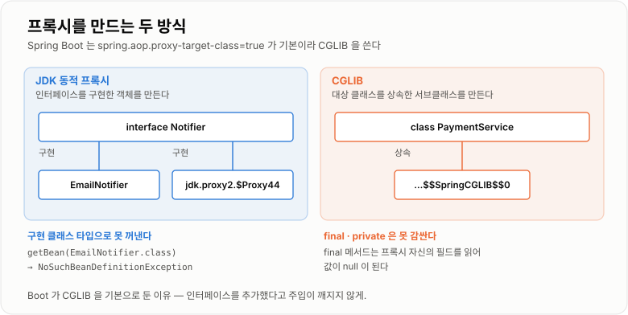
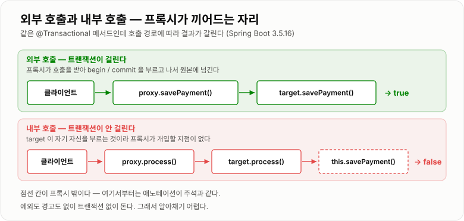

# 3. Spring AOP와 Proxy

> **`@Transactional`이 마법을 부리는 게 아니라, 그 Bean을 감싼 프록시가 부린다. 그래서 프록시를 안 거치는 호출(내부 호출 · private · final)에서는 조용히 아무 일도 일어나지 않는다.**

`Spring Boot 3.5.16` · `Spring Framework 6.2.19` · `AspectJ 1.9.25` · Java 17 — 아래 로그는 전부 직접 띄워 찍은 것이다.

## 개념 설명

> 개념 일반론은 커리큘럼 노트 [AOP · Proxy와 Transactional](../../05-Spring/AOP-Proxy-Transactional/AOP-Proxy-Transactional.md)에 있다.
> 여기서는 **실제로 돌려서 확인한 것**만 본다.
> 프록시가 언제 끼어드는지는 2주차 [Bean 생명주기와 자동설정](../02-Bean-생명주기와-자동설정/02-Bean-생명주기와-자동설정.md)의
> `BeanPostProcessor` 절에서 이어진다.

### 왜 팠는가

`@Transactional`을 붙였는데 롤백이 안 되는 코드를 만난 적이 있는데, 그때는 왜인지 설명하지 못했다.
"프록시 때문"이라는 말은 알고 있었지만 **프록시가 정확히 무엇을 못 하는지**는 몰랐다.

### AOP가 푸는 문제 — 횡단 관심사

트랜잭션·로깅·권한 검사·캐시는 특정 서비스 하나가 아니라 **여러 서비스를 가로질러** 반복된다.
이런 것을 횡단 관심사(cross cutting concern)라 하고, 핵심 관심사(주문·결제 같은 도메인 로직)와 섞이면
같은 정책이 클래스마다 다르게 구현되고 정책을 바꿀 때 수정 범위가 통제되지 않는다.

```java
// 이 코드가 서비스마다 복사되면 정책 변경이 불가능해진다
public void order() {
    long start = System.currentTimeMillis();
    try {
        // business logic
    } finally {
        System.out.println("time = " + (System.currentTimeMillis() - start));
    }
}
```

AOP는 이 부가 기능을 밖으로 빼서 **특정 시점에 끼워 넣는다.**

```java
@Aspect
@Component
public class LoggingAspect {

    @Around("execution(* com.example.service..*(..))")
    public Object log(ProceedingJoinPoint joinPoint) throws Throwable {
        long start = System.currentTimeMillis();
        try {
            return joinPoint.proceed();
        } finally {
            System.out.println("time = " + (System.currentTimeMillis() - start));
        }
    }
}
```

### 끼워 넣는 방법이 프록시다

핵심 로직을 건드리지 않고 호출 전후에 뭔가를 하려면 **호출을 누군가 가로채야** 한다.
그 가로채는 대리 객체가 프록시다.

- **Target** — 실제 비즈니스 로직이 든 원본 객체
- **Proxy** — Target 앞에 서서 호출을 받고, 부가 기능을 한 뒤 Target에게 위임하는 객체

직접 손으로 쓰면 이런 모양이고, Spring은 이것을 런타임에 만들어 준다.

```java
public class ServiceProxy implements ServiceInterface {
    private final ServiceInterface target;

    public ServiceProxy(ServiceInterface target) { this.target = target; }

    @Override
    public void call() {
        System.out.println("before");
        target.call();
        System.out.println("after");
    }
}
```

### 컨테이너에 들어 있는 건 원본이 아니라 프록시다 — 확인

컨테이너에서 Bean을 꺼내 클래스 이름을 찍어 봤다.

```text
인터페이스가 있는 Bean    aopdemo.AopApp$EmailNotifier$$SpringCGLIB$$0
                       AOP 프록시? true / JDK 프록시? false / CGLIB? true / 원본 타입=EmailNotifier

인터페이스가 없는 Bean    aopdemo.AopApp$PaymentService$$SpringCGLIB$$0
                       AOP 프록시? true / JDK 프록시? false / CGLIB? true / 원본 타입=PaymentService
```

**주입받아 쓰는 객체는 이미 프록시다.** 그래서 `new`로 직접 만든 객체에는 `@Transactional`도 AOP도
걸리지 않는다 — 프록시를 우회했기 때문이다.

한 가지 더 확인한 것이 있다. **부가 기능이 붙을 게 없으면 프록시를 아예 만들지 않는다.**
처음에 `@Transactional`도 Aspect 대상도 아닌 Bean으로 실험했더니 원본 클래스 그대로 나왔다.
필요할 때만 감싼다.

### JDK 동적 프록시 vs CGLIB — Boot 기본은 CGLIB

프록시를 만드는 방법이 둘이다.

| | JDK 동적 프록시 | CGLIB |
| -- | -- | -- |
| 방식 | 인터페이스를 구현한 객체를 만든다 | 대상 클래스를 **상속**한 서브클래스를 만든다 |
| 조건 | 인터페이스가 있어야 한다 | 인터페이스가 없어도 된다 |
| 가로채는 지점 | `InvocationHandler.invoke()` | 메서드 오버라이딩 |
| 제약 | 인터페이스에 없는 메서드는 못 부른다 | `final` 클래스·메서드, `private` 메서드는 못 감싼다 |

**Spring Boot는 인터페이스가 있어도 기본적으로 CGLIB을 쓴다.** 위 출력에서 인터페이스가 있는
`EmailNotifier`도 `$$SpringCGLIB$$0`으로 나온 이유다. Boot의 설정 메타데이터에도 기본값이 박혀 있다.

```text
spring.aop.proxy-target-class = true
  Whether subclass-based (CGLIB) proxies are to be created (true), as opposed to standard Java...
```

`spring.aop.proxy-target-class=false`로 강제하면 JDK 프록시로 바뀐다.

```text
인터페이스가 있는 Bean    jdk.proxy2.$Proxy44
                       AOP 프록시? true / JDK 프록시? true / CGLIB? false / 원본 타입=EmailNotifier
```

**이때 구현 클래스 타입으로는 Bean을 꺼낼 수 없다.** JDK 프록시는 인터페이스만 구현하고
구현 클래스를 상속하지 않기 때문이다.

```text
기본값(CGLIB):  getBean(EmailNotifier.class) -> OK, EmailNotifier$$SpringCGLIB$$0
JDK 프록시:     getBean(EmailNotifier.class) -> NoSuchBeanDefinitionException
                No qualifying bean of type 'aopdemo.AopApp$EmailNotifier' available
```

Boot가 기본을 CGLIB으로 잡은 이유가 이것이다. 인터페이스를 하나 추가했다는 이유로 주입이 깨지는
사고를 막으려는 것이다.



*JDK는 인터페이스 옆에 서고, CGLIB은 클래스 아래에 선다. 그래서 제약이 서로 다르다.*

### Spring AOP가 프록시를 만드는 시점

Bean이 만들어진 뒤 초기화 후처리(`BeanPostProcessor.postProcessAfterInitialization`) 단계에서
"이 Bean이 Advice 대상인가"를 판단하고, 대상이면 **원본 대신 프록시를 컨테이너에 등록한다.**
2주차에서 본 "후처리기가 반환한 객체가 곧 Bean이 된다"가 그대로 쓰이는 자리다.

즉 순서는 이렇다.

1. 원본 객체 생성 · 의존성 주입 · 초기화
2. AOP 대상 판단
3. 대상이면 프록시 생성 → **프록시가 컨테이너에 등록됨**
4. 다른 Bean은 이 프록시를 주입받음
5. 메서드 호출 → 프록시가 Advice 실행 → Target에 위임

### MethodInterceptor와 proceed()

가로챈 뒤 무엇을 할지는 인터셉터 체인으로 표현된다. 핵심은 `proceed()` 한 줄이다.

```java
public class SimpleInterceptor implements MethodInterceptor {
    @Override
    public Object invoke(MethodInvocation invocation) throws Throwable {
        // before
        Object result = invocation.proceed();   // 이걸 안 부르면 실제 메서드가 안 돈다
        // after
        return result;
    }
}
```

`proceed()`를 호출해야 **다음 인터셉터 또는 진짜 Target 메서드**가 실행된다.
`@Around` Advice의 `joinPoint.proceed()`와 같은 자리다.

### @Transactional은 프록시가 건다 — 확인

트랜잭션 시작·커밋을 로그로 찍는 트랜잭션 매니저를 붙이고, 메서드 안에서
`TransactionSynchronizationManager.isActualTransactionActive()`를 찍어 봤다.

외부에서 트랜잭션 메서드를 직접 호출하면 정상이다.

```text
[A] 외부에서 savePayment() 를 직접 호출
    >> 트랜잭션 시작
    savePayment()    트랜잭션 활성? true
    >> 커밋
```

`@Transactional`이 하는 일은 **메서드에 트랜잭션 기능을 심는 게 아니라, 그 메서드를 감싼 프록시가
앞뒤에서 begin/commit을 부르는 것**이다. 개념적으로 이런 코드가 자동 생성된 셈이다.

```java
public void savePayment() {
    txManager.begin();
    try {
        target.savePayment();
        txManager.commit();
    } catch (RuntimeException e) {
        txManager.rollback();
        throw e;
    }
}
```

### Self Invocation — 같은 클래스 안에서 부르면 안 걸린다

이번 주의 결론이다. **프록시는 밖에서 들어오는 호출만 가로챌 수 있다.**

```java
public class PaymentService {

    public void process() {
        savePayment();          // ← this.savePayment() — 프록시를 안 거친다
    }

    @Transactional
    public void savePayment() { }
}
```

`process()`를 외부에서 호출했을 때의 결과다.

```text
[B] 외부에서 process() 를 호출 → 그 안에서 savePayment() 내부 호출
    process() 안      트랜잭션 활성? false
    savePayment()    트랜잭션 활성? false      ← @Transactional 이 붙어 있는데도 false
    (트랜잭션 시작 로그가 아예 안 찍힌다)
```

호출 경로를 풀어 보면 이렇다.

```text
클라이언트 → proxy.process()      ← 여기는 프록시를 거친다 (하지만 process 에는 애노테이션이 없다)
             → target.process()
                 → this.savePayment()   ← target 자기 자신. 프록시가 끼어들 틈이 없다
```

**예외도 안 나고 경고도 없이 그냥 트랜잭션이 없는 채로 돈다.** 이게 이 문제가 무서운 이유다.

해결은 **트랜잭션 메서드를 다른 Bean으로 분리**하는 것이다. 그러면 Bean 사이 호출이라
프록시를 거친다.

```text
[D] 트랜잭션 메서드를 다른 Bean 으로 분리한 경우
    facade process() 트랜잭션 활성? false
    >> 트랜잭션 시작
    TxService        트랜잭션 활성? true       ← 걸린다
    >> 커밋
```



*내부 호출은 target이 자기 자신을 부르는 것이라, 프록시가 개입할 지점 자체가 없다.*

### private 메서드 — 같은 이유로 안 걸린다

```text
[C] private 메서드에 @Transactional 을 붙이고 호출
    privateSave()    트랜잭션 활성? false
```

`private` 메서드는 오버라이딩 대상이 아니라 CGLIB이 감쌀 수 없고, 밖에서 직접 호출할 수도 없어
프록시를 거칠 경로 자체가 없다. **애노테이션은 붙지만 아무 일도 안 한다.**

### final 메서드 — 안 걸리는 정도가 아니라 필드가 비어 버린다

여기가 가장 놀랐던 부분이다. `final` 메서드는 CGLIB이 오버라이드할 수 없으니 Advice가 안 걸리는
것까지는 예상대로인데, **필드 값까지 사라진다.**

```java
public class PlainService {
    private String state = "생성자에서 채운 값";
    public void work()            { System.out.println(state); }
    public final void finalWork() { System.out.println(state); }
}
```

```text
보통 메서드 work() 호출:
  [Aspect] 가로챔 → work
    state = 생성자에서 채운 값

final 메서드 finalWork() 호출:
    state = null              ← Aspect 도 안 걸리고, 필드도 null 이다
```

CGLIB 프록시는 **대상 클래스를 상속한 별개의 인스턴스**다. 보통 메서드는 오버라이드해서 원본
객체에 위임하므로 원본의 필드를 쓰지만, `final` 메서드는 오버라이드가 안 되니 **프록시 인스턴스
자신의 필드**를 읽는다. 그 필드는 아무도 채워 준 적이 없어서 `null`이다.

**AOP가 조용히 빠지는 것보다 나쁘다.** 조용히 잘못된 값으로 동작한다.

### @Async · @Cacheable · 메서드 보안도 같은 구조

이 기능들은 전부 "메서드 호출 앞뒤에 뭔가를 끼워 넣는" 프록시 구조 위에 있다.

- `@Async` — 프록시가 호출을 받아 `TaskExecutor`에 넘긴다. 그래서 다른 스레드에서 실행된다
- `@Cacheable` — 프록시가 먼저 캐시를 보고, 있으면 **Target을 호출하지 않고** 반환한다
- `@PreAuthorize` 같은 메서드 보안 — 프록시/인터셉터가 권한을 먼저 확인한다

**그래서 self invocation 문제를 똑같이 공유한다.** 같은 클래스 안에서 `@Async` 메서드를 부르면
비동기로 안 돌고, `@Cacheable` 메서드를 부르면 캐시를 안 탄다.

### 그래서 무엇을 조심하나

- **부가 기능이 필요한 메서드는 `public`으로, 그리고 다른 Bean에서 부르게 만든다.**
- 같은 클래스 안에서 트랜잭션 경계를 나누고 싶으면 **Bean을 쪼갠다.** 자기 자신의 프록시를
  주입받는 방법도 있지만 구조가 지저분해진다.
- **`final` 클래스·`final` 메서드에는 부가 기능을 걸지 않는다.** 안 걸리는 데다 필드가 비는
  함정까지 있다.
- `@Transactional`이 안 먹는 것 같으면 **애노테이션이 아니라 호출 경로를 먼저 본다.**

### 헷갈렸던 것

| 이렇게 알고 있었다 | 실제 |
| -- | -- |
| 인터페이스가 있으면 JDK 동적 프록시가 쓰인다 | Boot는 `spring.aop.proxy-target-class=true`가 기본이라 **인터페이스가 있어도 CGLIB**을 쓴다 |
| JDK/CGLIB은 구현 세부라 몰라도 된다 | JDK 프록시면 구현 클래스 타입으로 주입·조회가 안 된다 (`NoSuchBeanDefinitionException`) |
| 모든 Bean이 프록시로 감싸진다 | 붙일 부가 기능이 없으면 프록시를 만들지 않는다. 원본 그대로 들어간다 |
| 내부 호출이면 "트랜잭션이 제대로 안 걸릴 수 있다" | 애매하게 걸리는 게 아니라 **아예 안 걸린다.** 시작 로그조차 안 찍힌다 |
| `final` 메서드는 AOP만 안 걸린다 | 필드도 `null`이 된다. 프록시 인스턴스 자신의 필드를 읽기 때문이다 |
| `@Transactional`은 트랜잭션을 여는 어노테이션 | 여는 주체는 프록시다. 프록시를 안 거치면 애노테이션은 주석과 같다 |

## 면접 질문

### Q1. AOP는 왜 필요한가요?
**트랜잭션·로깅·보안처럼 여러 클래스를 가로지르는 공통 기능을 비즈니스 로직에서 떼어내기 위해서입니다.**

이런 코드를 서비스마다 직접 넣으면 중복이 쌓이고, 정책 하나 바꾸는 데 수정 범위가 통제되지 않습니다.
상속이나 유틸 메서드로는 "모든 서비스 메서드의 앞뒤"라는 지점을 잡을 수 없어서 한계가 있습니다.
AOP는 그 공통 기능을 별도 모듈로 두고 지정한 지점에 끼워 넣어, 핵심 로직은 도메인만 남게 합니다.

### Q2. Cross Cutting Concern이란 무엇인가요?
**여러 모듈을 가로질러 공통으로 필요한 부가 관심사를 말합니다.**

주문 생성이나 결제 처리는 그 도메인에만 있는 핵심 관심사인 반면, 그 앞뒤의 트랜잭션 경계나
실행 시간 로깅, 권한 확인은 어느 서비스에나 똑같이 필요합니다.
후자를 핵심 로직에 섞어 두면 같은 정책이 클래스마다 조금씩 다르게 구현되는 문제가 생깁니다.

### Q3. Proxy Pattern이란 무엇인가요?
**클라이언트가 실제 객체 대신 대리 객체를 통해 접근하게 해서, 호출 전후에 부가 기능을 넣거나 접근을 제어하는 패턴입니다.**

대리 객체가 원본과 같은 타입이기 때문에 클라이언트 코드는 바뀌지 않습니다.
접근 제어, 지연 로딩, 로깅, 캐싱처럼 "원본을 건드리지 않고 뭔가를 더하고 싶을 때" 쓰입니다.
Spring AOP는 이 패턴을 런타임에 자동으로 만들어 적용하는 구조입니다.

### Q4. Target과 Proxy의 차이는 무엇인가요?
**Target은 실제 비즈니스 로직이 든 원본 객체이고, Proxy는 그 앞에서 호출을 받아 부가 기능을 수행한 뒤 Target에 위임하는 객체입니다.**

중요한 건 컨테이너에 등록되는 쪽이 Proxy라는 점입니다. 실제로 Bean을 꺼내 클래스 이름을 찍어 보면
`PaymentService$$SpringCGLIB$$0`처럼 나옵니다.
그래서 `new`로 직접 만든 객체는 Target일 뿐이라 `@Transactional`이나 AOP가 전혀 걸리지 않습니다.

### Q5. JDK Dynamic Proxy는 어떤 원리로 동작하나요?
**인터페이스를 구현한 프록시 객체를 런타임에 만들고, 모든 호출을 InvocationHandler로 모아 처리합니다.**

`Proxy.newProxyInstance()`에 인터페이스와 핸들러를 넘기면 그 인터페이스 타입의 객체가 생성됩니다.
어떤 메서드를 부르든 `invoke()`가 받아서 공통 로직을 수행하고 리플렉션으로 원본에 위임합니다.
인터페이스가 반드시 있어야 하고, 만들어진 프록시는 구현 클래스를 상속하지 않는다는 제약이 있습니다.

### Q6. CGLIB은 언제 사용되나요?
**인터페이스가 없을 때, 그리고 Spring Boot에서는 인터페이스가 있어도 기본으로 사용됩니다.**

CGLIB은 대상 클래스를 상속한 서브클래스를 만들어 메서드를 오버라이드하는 방식이라 인터페이스가 필요 없습니다.
Boot는 `spring.aop.proxy-target-class`의 기본값이 `true`라, 확인해 보니 인터페이스가 있는 Bean도
CGLIB 프록시로 감싸졌습니다. 인터페이스를 하나 추가했다는 이유로 구현 타입 주입이 깨지는 것을
막으려는 선택입니다.

### Q7. Spring AOP는 내부적으로 어떻게 동작하나요?
**Bean 초기화 후처리 단계에서 Advice 대상인지 판단하고, 대상이면 원본 대신 프록시를 컨테이너에 등록합니다.**

`BeanPostProcessor`의 초기화 후처리가 반환한 객체가 곧 Bean이 되는데, AOP는 이 자리에서 프록시를 돌려줍니다.
그래서 다른 Bean들은 처음부터 프록시를 주입받고, 메서드를 부르면 프록시가 Advice를 실행한 뒤 Target에 위임합니다.
붙일 부가 기능이 없는 Bean은 프록시를 만들지 않고 원본 그대로 등록됩니다.

### Q8. MethodInterceptor는 어떤 역할을 하나요?
**메서드 호출을 가로채 전후 로직을 수행하는 인터셉터이고, 핵심은 `proceed()`입니다.**

`invoke()`가 호출을 받아 앞부분을 처리하고, `invocation.proceed()`를 불러야 다음 인터셉터나 실제 대상 메서드가 실행됩니다.
`proceed()`를 빠뜨리면 원본 메서드가 아예 실행되지 않고, 예외 처리를 어디에 두느냐에 따라
롤백이나 재시도 정책이 달라집니다. `@Around` Advice가 이것을 애노테이션으로 감싼 형태입니다.

### Q9. @Transactional은 왜 프록시와 연결되나요?
**트랜잭션을 시작하고 커밋·롤백하는 주체가 메서드 자신이 아니라 그 메서드를 감싼 프록시이기 때문입니다.**

프록시가 호출을 받아 트랜잭션을 열고, Target 메서드를 실행한 뒤 정상이면 커밋, 예외면 롤백합니다.
직접 확인해 보니 외부에서 호출했을 때만 "트랜잭션 시작 → 커밋" 로그가 찍혔습니다.
그래서 중요한 건 애노테이션이 붙어 있느냐가 아니라 **프록시를 거쳐 호출되느냐**입니다.

### Q10. 왜 같은 클래스 내부 호출에서는 @Transactional이 적용되지 않을 수 있나요?
**내부 호출은 프록시가 아니라 `this`를 통한 직접 호출이라, 프록시가 끼어들 지점이 없기 때문입니다.**

외부 호출은 프록시가 받지만, 프록시가 Target 메서드로 넘긴 뒤부터는 그 안의 호출이 전부 Target 자기 자신에게 갑니다.
실제로 찍어 보니 애노테이션이 붙은 메서드인데도 트랜잭션 활성 여부가 `false`였고, 트랜잭션 시작 로그조차 없었습니다.
예외도 경고도 없이 그냥 트랜잭션 없이 도는 것이 이 문제의 위험한 점입니다.

### Q11. Self Invocation 문제는 어떻게 해결하나요?
**부가 기능이 필요한 메서드를 별도 Bean으로 분리해서, Bean 사이 호출이 되게 만듭니다.**

다른 Bean을 주입받아 호출하면 그 호출은 프록시를 거치므로 정상적으로 Advice가 적용됩니다.
직접 분리해서 확인해 보니 같은 로직인데 트랜잭션 시작·커밋 로그가 정상적으로 찍혔습니다.
자기 자신의 프록시를 주입받는 방법도 있지만 순환 구조가 생겨 코드가 지저분해지므로 잘 쓰지 않습니다.

### Q12. private 메서드에 @Transactional을 붙이면 왜 문제가 될 수 있나요?
**프록시가 감쌀 수도 없고 외부에서 호출될 수도 없어서, 애노테이션이 아무 일도 하지 않기 때문입니다.**

CGLIB은 메서드를 오버라이드해서 부가 기능을 넣는데 `private` 메서드는 오버라이딩 대상이 아닙니다.
게다가 private이라 반드시 같은 클래스 안에서 호출되므로 self invocation 문제도 함께 걸립니다.
확인해 보니 트랜잭션 활성 여부가 `false`로 나왔고, 컴파일 에러도 경고도 없어서 알아채기 어렵습니다.

### Q13. @Async와 @Cacheable도 프록시 기반인가요?
**네, 모두 같은 프록시 구조 위에서 동작합니다.**

`@Async`는 프록시가 호출을 받아 `TaskExecutor`에 넘겨 다른 스레드에서 실행하게 하고,
`@Cacheable`은 프록시가 캐시를 먼저 조회해서 값이 있으면 Target을 아예 호출하지 않습니다.
같은 구조이기 때문에 self invocation 문제도 그대로 공유합니다 — 내부 호출로는 비동기도 캐시도 동작하지 않습니다.

### Q14. Spring Security와 프록시 개념은 어떻게 연결되나요?
**메서드 보안은 호출 전에 권한 검사를 끼워 넣는 방식이라, 프록시·인터셉터 구조와 같은 자리에 있습니다.**

`@PreAuthorize`가 붙은 메서드를 부르면 보안 인터셉터가 먼저 권한을 확인하고, 통과하면 실제 메서드를 실행하고
아니면 예외를 던집니다. 부가 기능을 호출 앞에 배치한다는 점에서 트랜잭션 처리와 구조가 동일합니다.
따라서 내부 호출에서는 메서드 보안도 기대대로 동작하지 않을 수 있습니다.

### Q15. JDK Dynamic Proxy와 CGLIB의 장단점을 설명해주세요.
**JDK는 인터페이스만 있으면 가볍게 만들 수 있지만 구현 타입을 잃고, CGLIB은 인터페이스 없이도 되지만 상속 제약을 받습니다.**

JDK 프록시는 인터페이스를 구현할 뿐 구현 클래스를 상속하지 않아서, 구현 클래스 타입으로 주입하거나
조회하면 `NoSuchBeanDefinitionException`이 납니다. 직접 `proxy-target-class=false`로 바꿔 확인했습니다.
CGLIB은 상속 기반이라 그 문제는 없지만 `final` 클래스나 `final`·`private` 메서드는 감싸지 못합니다.
특히 `final` 메서드는 Advice가 빠지는 데 그치지 않고 프록시 인스턴스 자신의 필드를 읽어 값이 `null`이 되기까지 했습니다.

## 참고
- [Spring Framework 6.2 — Aspect Oriented Programming with Spring](https://docs.spring.io/spring-framework/reference/6.2/core/aop.html)
- [Spring Framework 6.2 — Proxying Mechanisms (JDK vs CGLIB)](https://docs.spring.io/spring-framework/reference/6.2/core/aop/proxying.html)
- [Spring Framework 6.2 — Understanding the Spring Framework AOP Proxies (self invocation)](https://docs.spring.io/spring-framework/reference/6.2/core/aop/proxying.html#aop-understanding-aop-proxies)
- [Spring Framework 6.2 — Declarative Transaction Management](https://docs.spring.io/spring-framework/reference/6.2/data-access/transaction/declarative.html)
- 2주차 노트 [Bean 생명주기와 Spring Boot 자동설정](../02-Bean-생명주기와-자동설정/02-Bean-생명주기와-자동설정.md)
