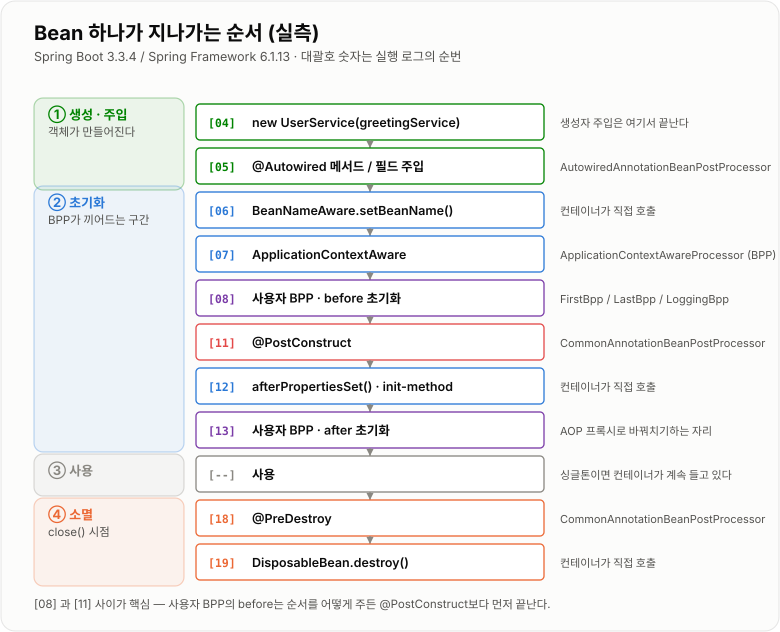
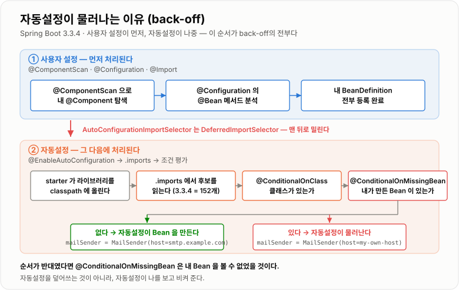

# Bean 생명주기와 자동설정

> **Spring Boot는 "무엇을 등록할지"를 조건부로 먼저 정하고,
> Spring Container는 정해진 설계도를 따라 "어떻게 만들지"를 순서대로 실행한다.**

`Spring Boot 3.3.4` · `Spring Framework 6.1.13` · Java 17

**계기** — 2주차 학습 주제. 1주차에 `@Component`가 BeanDefinition을 거쳐 Bean이 되는 것까지는
확인했는데, 그 다음이 흐릿했다. **주입은 정확히 언제 끝나는지**, `@PostConstruct`가 생성자와
무엇이 다른지, 그리고 **starter 하나 추가했을 뿐인데 왜 Bean이 저절로 생기는지**가
"그런가 보다" 수준이라 직접 돌려 보기로 했다.

!!! note "면접용 일반론은 커리큘럼 노트에 있다"
    같은 주제를 6개 섹션 형식으로 정리한
    [IoC · DI와 Bean](../../05-Spring/IoC-DI와-Bean/IoC-DI와-Bean.md)과
    [Spring Boot와 예외 처리](../../05-Spring/Spring-Boot와-예외처리/Spring-Boot와-예외처리.md)가 따로 있다.
    이 노트는 **2주차에 내가 실제로 헷갈렸던 것과 직접 돌려서 확인한 결과**를 남기는 쪽이다.
    1주차 기록은 [Spring IoC · DI · Bean](../Spring-IoC-DI-Bean/Spring-IoC-DI-Bean.md)에 있다.

!!! success "이 노트의 순서·로그·예외 메시지는 전부 실측이다"
    아래 나오는 실행 순번(`[04]` 같은 것), BeanPostProcessor 목록, 조건 평가 결과,
    예외 메시지는 모두 **Spring Boot 3.3.4를 실제로 띄워서** 얻은 것이다.
    직접 만든 가짜 starter까지 포함한 검증 방법은 **4. 실측으로 확인한 것**에 있다.

---

## 0. 이번 주 한눈에 보기

### 이번 주 핵심 질문

* Spring Boot가 실행되면 Bean들은 어떤 순서로 발견되고 등록되는가?
* 의존성 주입은 Bean 생명주기에서 정확히 언제 일어나는가?
* `BeanPostProcessor`, `@PostConstruct`, `@PreDestroy`는 각각 어떤 역할을 하는가?
* starter를 추가하면 왜 자동설정이 동작하는가? 그리고 왜 **내가 만든 Bean이 이기는가?**

### 핵심 흐름

```text
main()
    ↓
SpringApplication.run()
    ↓
ApplicationContext 생성
    ↓
@SpringBootApplication 해석
    ↓
@ComponentScan + @Configuration + @Import              ← 내 설정이 먼저
    ↓
@EnableAutoConfiguration → AutoConfiguration.imports    ← 자동설정은 나중
    ↓
@Conditional 조건 평가
    ↓
BeanDefinition 확정                    ← 여기까지가 "등록"
    ↓
Bean 생성 → 의존성 주입 → 초기화 → 사용 → 소멸    ← 여기부터가 "생성"
```

**등록과 생성은 다른 단계다.** 이번 주 내용의 절반은 이 경계에 있다.
`@Conditional`은 등록 단계에서 평가되고, `@PostConstruct`는 생성 단계에서 호출된다.

### 실제로 관찰한 순서



*주입은 BeanPostProcessor가 개입하기 전에 이미 끝나 있고, `@PostConstruct`조차 BeanPostProcessor가 호출한다.*

---

## 1. 핵심 개념

### 1-1. Bean 생성 과정

#### 한 줄 정의

**Spring은 먼저 Bean의 설계도인 `BeanDefinition`을 등록하고, 이후 실제 객체를 생성한다.**

#### 왜 필요한가?

객체를 코드에서 직접 만들면 생성 순서, 의존관계, 초기화/종료 처리를 일관되게 관리하기 어렵다.
설계도를 먼저 모아 두면 **"만들기 전에" 조건을 따지고 순서를 정할 수 있다.**
자동설정의 back-off가 가능한 것도 이 분리 덕분이다.

#### 어떻게 동작하는가?

```text
설정 정보 수집
    ↓
BeanDefinition 등록      ← 이 시점에는 객체가 하나도 없다
    ↓
인스턴스 생성
    ↓
의존성 주입
    ↓
초기화 콜백
    ↓
컨테이너 관리
```

#### 핵심 코드

```java
@Configuration
class AppConfig {

    @Bean
    GreetingService greetingService() {
        return new GreetingService();
    }
}
```

#### 주의할 점

Bean **등록**과 Bean **생성**은 같은 단계가 아니다. 먼저 등록되고, 그 뒤 생성된다.
조건이 맞지 않아 등록되지 않은 Bean은 **생성자조차 호출되지 않는다** (실측 3).

---

### 1-2. 의존성 주입

#### 한 줄 정의

**Bean이 필요한 협력 객체를 직접 생성하지 않고 Spring Container가 넣어 주는 방식이다.**

#### 왜 필요한가?

객체가 직접 의존 객체를 만들면 결합도가 높아지고 테스트와 교체가 어려워진다.

#### 어떻게 동작하는가?

```text
Bean 생성 대상 결정
    ↓
생성자 / 필드 / 세터에서 필요한 타입 확인
    ↓
컨테이너에서 후보 Bean 조회
    ↓
주입
    ↓
초기화 단계로 이동
```

#### 핵심 코드

```java
@Component
class UserService {

    private final GreetingService greetingService;

    UserService(GreetingService greetingService) {
        this.greetingService = greetingService;
    }
}
```

#### 주입이 끝나는 시점 (실측)

생성자 주입은 **생성자가 끝나는 순간** 이미 완료되어 있고, 필드·메서드 주입은 그 직후다.
둘 다 `BeanPostProcessor`가 개입하기 **전**이다.

```text
[04] UserService  constructor  (ctor injection done: greetingService=true)
[05] UserService  @Autowired method injection
[06] UserService  BeanNameAware.setBeanName("userService")
...
[08] FirstBpp(HIGHEST)      BEFORE  init : userService
```

#### 주의할 점

주입은 `@PostConstruct`보다 **먼저** 일어난다. 그래서 "주입된 값을 가지고 준비 작업을 한다"는
로직은 생성자가 아니라 `@PostConstruct`에 두는 게 맞다 — 다만 **생성자 주입만 쓴다면
생성자 안에서도 이미 값이 들어와 있다.** 생성자에서 NPE가 나는 경우는 대개 필드 주입일 때다.

---

### 1-3. BeanPostProcessor

#### 한 줄 정의

**Bean 초기화 전후에 개입해 추가 처리를 수행하는 Spring의 확장 포인트다.**

#### 왜 필요한가?

애노테이션 기반 기능과 프레임워크 확장을 **Bean 클래스 내부 코드를 고치지 않고** 적용하기 위해서다.
`@PostConstruct` 처리도, AOP 프록시로 바꿔치기하는 것도 전부 이 자리에서 일어난다.

#### 어떻게 동작하는가?

```text
Bean 인스턴스 생성
    ↓
의존성 주입                          ← BPP 개입 전에 이미 끝남
    ↓
postProcessBeforeInitialization()    ← 등록된 BPP를 순서대로 전부
    ↓
@PostConstruct                       ← 이것도 BPP 중 하나가 호출한다
    ↓
afterPropertiesSet() / init-method
    ↓
postProcessAfterInitialization()     ← AOP 프록시가 여기서 만들어진다
```

#### 핵심 코드

```java
@Component
class LoggingBpp implements BeanPostProcessor {

    @Override
    public Object postProcessBeforeInitialization(Object bean, String name) {
        return bean;   // 여기서 다른 객체를 반환하면 Bean이 통째로 바뀐다
    }
}
```

#### 실제로 등록되어 있는 BeanPostProcessor (실측)

내가 만든 BPP 3개를 섞어 넣고 실행 순서를 그대로 뽑았다.

```text
 1. ApplicationContextAwareProcessor
 2. ConfigurationClassPostProcessor$ImportAwareBeanPostProcessor
 3. PostProcessorRegistrationDelegate$BeanPostProcessorChecker
 4. com.example.demo.FirstBpp                    ← PriorityOrdered.HIGHEST_PRECEDENCE
 5. ConfigurationPropertiesBindingPostProcessor
 6. InfrastructureAdvisorAutoProxyCreator
 7. com.example.demo.LastBpp                     ← Ordered.LOWEST_PRECEDENCE
 8. com.example.demo.LoggingBpp                  ← 순서 지정 안 함
 9. CommonAnnotationBeanPostProcessor            ← @PostConstruct / @PreDestroy 담당
10. AutowiredAnnotationBeanPostProcessor         ← @Autowired 담당
11. ApplicationListenerDetector
```

#### 주의할 점

* `@Autowired`, `@PostConstruct`, `@PreDestroy` 같은 기능이 **BPP 위에서 동작한다**는 게 핵심이다.
* 다만 **둘의 개입 시점은 다르다.** `AutowiredAnnotationBeanPostProcessor`는
  `postProcessBeforeInitialization`이 아니라 그보다 앞선 **주입 단계**에서 일한다.
* `LastBpp`에 가장 낮은 우선순위를 줘도 `CommonAnnotationBeanPostProcessor`보다 앞이다.
  **사용자가 만든 BPP의 `before`는 `@PostConstruct`보다 먼저 끝난다** (실측 2).

---

### 1-4. `@PostConstruct` / `@PreDestroy`

#### 한 줄 정의

**Bean의 초기화 시점과 종료 직전에 호출되는 생명주기 콜백이다.**

#### 왜 필요한가?

주입이 끝난 뒤 실행해야 하는 초기화 로직과, 종료 시 정리 로직을 명확히 분리하기 위해서다.

#### 어떻게 동작하는가?

```text
의존성 주입 완료
    ↓
BeanPostProcessor.before (전부)
    ↓
@PostConstruct              ← CommonAnnotationBeanPostProcessor 가 호출
    ↓
Bean 사용
    ↓
컨테이너 종료 (ctx.close())
    ↓
@PreDestroy → DisposableBean.destroy()
```

#### 핵심 코드

```java
@PostConstruct
void init() { }

@PreDestroy
void destroy() { }
```

#### 주의할 점

* `@PostConstruct`는 생성자 직후가 아니라 **주입이 끝나고 초기화 단계에서** 실행된다.
* Spring Boot 3.x는 `jakarta.annotation` 패키지다. `javax.annotation`은 동작하지 않는다.
    `spring-boot-starter`가 `jakarta.annotation-api`를 끌어오므로 보통은 신경 쓸 일이 없다.
* **`@PreDestroy`는 싱글톤에만 기대할 수 있다.** prototype Bean은 컨테이너가 생성 이후를
    관리하지 않아 `ctx.close()`에도 호출되지 않는다 (실측 7).

---

### 1-5. Bean Lifecycle

#### 한 줄 정의

**Bean이 등록되고 · 생성되고 · 주입되고 · 초기화되고 · 소멸되는 전체 수명 주기다.**

#### 왜 필요한가?

Bean의 상태를 예측 가능하게 만들고, 프레임워크가 공통 규칙으로 관리할 수 있게 하기 위해서다.

#### 어떻게 동작하는가? (실측 기준)

```text
BeanDefinition 등록
    ↓
생성자 호출 · 생성자 주입              [04]
    ↓
필드 · 메서드 주입                     [05]
    ↓
Aware 콜백                            [06] [07]
    ↓
BeanPostProcessor.before              [08]
    ↓
@PostConstruct                        [11]
    ↓
afterPropertiesSet() / init-method    [12]
    ↓
BeanPostProcessor.after               [13]   ← AOP 프록시 생성
    ↓
사용
    ↓
@PreDestroy                           [18]
    ↓
DisposableBean.destroy()              [19]
```

#### 주의할 점

면접에서는 **"등록 단계"와 "생성/초기화 단계"를 분리해서** 설명하면 훨씬 명확하다.
`@Conditional`은 앞쪽 이야기, `@PostConstruct`는 뒤쪽 이야기다.

---

### 1-6. `@Configuration` / `@Import`

#### 한 줄 정의

**`@Configuration`은 Bean 정의를 담는 설정 클래스이고, `@Import`는 다른 설정을 끌어오는 장치다.**

#### 왜 필요한가?

설정을 코드로 모듈화하고, 여러 설정을 조합해 큰 애플리케이션을 구성하기 위해서다.

#### 어떻게 동작하는가?

```text
@Configuration 클래스 발견
    ↓
@Bean 메서드 분석
    ↓
BeanDefinition 등록
    ↓
@Import 대상 설정도 함께 처리
```

#### 핵심 코드

```java
@Configuration
class AppConfig {
    @Bean GreetingService greetingService() { return new GreetingService(); }
}

@SpringBootApplication
@Import(AppConfig.class)
class DemoApplication { }
```

#### 주의할 점

자동설정도 결국 **`@Import`다.** `@EnableAutoConfiguration`을 뜯어 보면
`@Import(AutoConfigurationImportSelector.class)`가 전부다 (실측 8).
"자동설정"이라는 별도 메커니즘이 있는 게 아니라, **import 대상을 파일에서 읽어 오는 import**다.

---

### 1-7. `@Conditional`

#### 한 줄 정의

**조건이 맞을 때만 설정 클래스나 Bean을 등록하게 하는 장치다.**

#### 왜 필요한가?

같은 라이브러리가 있어도 모든 앱에 같은 Bean이 필요하지는 않다. 상황에 따라 선택적으로 등록해야 한다.

#### 어떻게 동작하는가?

```text
설정 클래스 · 컴포넌트 후보 발견
    ↓
클래스패스 / 프로퍼티 / 기존 Bean 존재 여부 평가
    ↓
조건 통과한 것만 BeanDefinition 등록
```

#### 핵심 코드

```java
@Component
@ConditionalOnProperty(prefix = "demo", name = "feature-enabled", havingValue = "true")
class OptionalFeatureService { }
```

#### 자주 쓰는 조건 애노테이션

| 애노테이션 | 무엇을 보는가 |
| -- | -- |
| `@ConditionalOnClass` | 클래스패스에 그 클래스가 있는가 |
| `@ConditionalOnMissingClass` | 특정 클래스가 **없을 때만** |
| `@ConditionalOnBean` / `@ConditionalOnMissingBean` | 컨테이너에 그 Bean이 이미 있는가 |
| `@ConditionalOnProperty` | 프로퍼티 값이 조건과 맞는가 |
| `@ConditionalOnSingleCandidate` | 후보 Bean이 정확히 하나인가 |

#### 주의할 점

* **평가 시점은 등록 단계다.** 조건이 틀리면 BeanDefinition 자체가 만들어지지 않고,
    따라서 그 클래스의 생성자는 영원히 호출되지 않는다 (실측 3).
* `@ConditionalOnProperty`의 `matchIfMissing` **기본값은 `false`** 다.
    프로퍼티를 아예 안 적으면 등록되지 않는다 (실측 3에서 확인).
* Spring Boot 자동설정은 "자동 등록"이 아니라 **"조건부 자동 등록"** 이다.

---

### 1-8. `@ConfigurationProperties`

#### 한 줄 정의

**외부 설정값을 구조화된 객체에 묶어서 바인딩하는 방식이다.**

#### 왜 필요한가?

설정값이 많아질수록 `@Value`로 하나씩 주입하면 관리가 어렵고 타입 안정성이 떨어진다.

#### 어떻게 동작하는가?

```text
application.yml / properties 읽기
    ↓
prefix 기준 값 매핑
    ↓
객체 필드에 바인딩          ← ConfigurationPropertiesBindingPostProcessor 가 담당
    ↓
Bean 으로 사용
```

#### 핵심 코드

```java
@ConfigurationProperties(prefix = "demo")
class DemoProperties {
    private String message;
    private boolean featureEnabled;
    // getter / setter
}
```

`@ConfigurationProperties`만 붙인다고 Bean이 되지는 않는다. 셋 중 하나가 필요하다.

```java
@EnableConfigurationProperties(DemoProperties.class)   // 설정 클래스에서 지정
// 또는 클래스에 @Component 를 같이 붙이거나
// 또는 @ConfigurationPropertiesScan 을 켠다
```

#### 주의할 점

* 프로퍼티 이름은 **relaxed binding**이라 `demo.feature-enabled` ↔ `featureEnabled`가 연결된다.
* 단순 값 주입이 아니라 **"설정 묶음"을 객체화**한다는 점이 요지다.
    자동설정과 짝을 이뤄 "프로퍼티로 동작을 바꾸는" 구조의 절반을 담당한다.

---

### 1-9. Spring Boot Auto Configuration

#### 한 줄 정의

**classpath · 설정값 · 기존 Bean 상태를 보고 필요한 기본 Bean들을 자동으로 구성하는 기능이다.**

#### 왜 필요한가?

매번 같은 인프라 설정(DataSource, MVC, Jackson …)을 손으로 쓰면 반복이 많고 생산성이 떨어진다.

#### 어떻게 동작하는가?

```text
@EnableAutoConfiguration
    ↓
@Import(AutoConfigurationImportSelector.class)
    ↓
DeferredImportSelector 라서 사용자 설정이 전부 등록된 뒤에 실행된다
    ↓
META-INF/spring/org.springframework.boot.autoconfigure.AutoConfiguration.imports  후보 조회
    ↓
@Conditional 평가
    ↓
통과한 자동설정 클래스만 import
    ↓
@Bean 등록
```

#### 주의할 점

사용자가 직접 Bean을 정의하면 자동설정이 물러나는 **back-off**가 핵심이다.
그리고 그게 가능한 이유는 위 흐름의 세 번째 줄, **"사용자 설정이 먼저"** 라는 순서에 있다.

---

### 1-10. `@SpringBootApplication` · starter · `.imports`

#### 한 줄 정의

**`@SpringBootApplication`은 시작점, starter는 의존성 묶음, `.imports`는 자동설정 후보 목록이다.**

#### 어떻게 동작하는가?

```text
@SpringBootApplication
    ↓
@EnableAutoConfiguration 활성화
    ↓
starter 가 라이브러리를 classpath 에 올려 둠
    ↓
@ConditionalOnClass 충족
    ↓
AutoConfiguration.imports 후보 로드
    ↓
조건 통과한 설정만 적용
```

#### `@SpringBootApplication`을 뜯어 보면 (실측)

```text
@SpringBootConfiguration(proxyBeanMethods=true)
@EnableAutoConfiguration
@ComponentScan(excludeFilters = { TypeExcludeFilter, AutoConfigurationExcludeFilter })
```

`AutoConfigurationExcludeFilter`가 눈에 띈다. **컴포넌트 스캔은 자동설정 클래스를 일부러 제외한다.**
자동설정 클래스도 `@Configuration`이라서, 제외하지 않으면 내 패키지 안에 있을 때
스캔으로 한 번 + import로 한 번, 두 경로로 들어올 수 있기 때문이다.

#### 주의할 점

starter와 자동설정은 연결되어 있지만 **같은 것이 아니다.**

* **starter** — 의존성만 제공한다. `spring-boot-starter-3.3.4.jar`를 열어 보면
    **클래스 파일이 0개**다 (실측 9). pom의 `<dependencies>`가 내용의 전부다.
* **auto-configuration** — Bean 구성 로직을 제공한다. `spring-boot-autoconfigure` 안에 있다.

---

## 2. 개념 간 연결

```text
@SpringBootApplication
 ├─ @SpringBootConfiguration
 ├─ @ComponentScan  ────────────┐
 └─ @EnableAutoConfiguration ─┐ │
                              │ │
                              │ └─→ 내 @Component / @Configuration / @Bean
                              │           ↓
                              │      BeanDefinition 등록  ← 먼저
                              │           ↓
                              └─→ @Import(AutoConfigurationImportSelector)
                                          ↓ (DeferredImportSelector = 맨 뒤)
                                    .imports 후보 152개
                                          ↓
                                    @Conditional 평가 ← 이미 등록된 내 Bean을 볼 수 있다
                                          ↓
                                    통과분만 BeanDefinition 등록
                                          ↓
                                 ─────── 여기까지 "등록" ───────
                                          ↓
                                    Bean 생성 · 의존성 주입
                                          ↓
                                    BeanPostProcessor
                                          ↓
                                    @PostConstruct / @PreDestroy
```

이 개념들이 늘 같이 등장하는 이유는, Spring Boot가 단순히 객체를 만드는 게 아니라
**무엇을 등록할지 먼저 결정하고, 그 다음에 어떻게 생성·주입·초기화·종료할지 관리**하기 때문이다.

---

## 3. 내부 동작 Deep Dive

### 3-1. Spring Boot가 실행되면 Bean이 어떻게 발견되고 등록되는가

```text
SpringApplication.run()
    ↓
ApplicationContext 생성
    ↓
@SpringBootApplication 해석
    ↓
@ComponentScan 으로 내 컴포넌트 탐색       ← 자동설정 클래스는 제외 필터로 걸러짐
    ↓
@Configuration 의 @Bean 메서드 분석
    ↓
(여기까지 끝난 뒤) AutoConfigurationImportSelector 실행
    ↓
AutoConfiguration.imports 로드 (3.3.4 기준 152줄)
    ↓
@Conditional 조건 평가
    ↓
통과한 설정 클래스 import → @Bean BeanDefinition 등록
    ↓
Bean 생성 및 초기화
```

각 단계가 필요한 이유:

* **`@ComponentScan`** — 내 코드의 `@Component`, `@Service`를 찾기 위해
* **`@EnableAutoConfiguration`** — 라이브러리 기반 기본 설정을 붙이기 위해
* **`.imports`** — 후보 클래스를 **로드하지 않고** 이름만 빠르게 읽기 위해
* **`@Conditional`** — 모든 앱에 같은 설정을 강제로 넣지 않기 위해
* **Bean 생성/초기화** — 등록된 설계도를 실제 객체로 바꾸기 위해

### 3-2. 왜 내가 만든 Bean이 이기는가 (back-off의 정체)

여기가 이번 주에 제일 납득이 안 됐던 부분이다.
"사용자가 Bean을 정의하면 자동설정이 물러난다"는 건 알겠는데, **자동설정이 어떻게 내 Bean을 알지?**

답은 **순서**다. `AutoConfigurationImportSelector`는 평범한 `ImportSelector`가 아니라
**`DeferredImportSelector`** 다. 이 인터페이스를 구현한 selector는
`ConfigurationClassParser`가 **다른 모든 설정 클래스를 처리한 뒤 맨 마지막에** 실행한다.

```text
DeferredImportSelector.class.isAssignableFrom(AutoConfigurationImportSelector.class) = true
```

그래서 `@ConditionalOnMissingBean`이 조건을 평가할 시점에는 **내 BeanDefinition이 이미 등록되어 있다.**
자동설정이 내 것을 덮어쓰지 않는 게 아니라, **자동설정이 나를 보고 비켜 주는 것**이다.



*순서가 반대였다면 back-off는 성립하지 않는다.*

### 3-3. `@PostConstruct`는 누가 호출하는가

`@PostConstruct`는 Spring이 특별히 아는 문법이 아니라,
**`CommonAnnotationBeanPostProcessor`라는 BeanPostProcessor 하나가 처리하는 애노테이션**이다.
`postProcessBeforeInitialization` 안에서 `@PostConstruct` 메서드를 리플렉션으로 호출한다.

그래서 "BPP before → `@PostConstruct` → BPP after"라는 도식은 **결과적으로는 맞지만
구조적으로는 정확하지 않다.** `@PostConstruct`는 before 단계 *다음*이 아니라
before 단계 *안*에서, 그 단계의 거의 끝에 실행된다.

거의 끝인 이유는 `PostProcessorRegistrationDelegate`가 BPP를 등록하는 순서에 있다.

```text
PriorityOrdered BPP  →  Ordered BPP  →  순서 없는 BPP  →  내부(Merged…) BPP
```

`CommonAnnotationBeanPostProcessor`와 `AutowiredAnnotationBeanPostProcessor`는
`MergedBeanDefinitionPostProcessor`라서 **항상 마지막 묶음**으로 다시 등록된다.
그래서 내가 만든 BPP에 `Ordered.LOWEST_PRECEDENCE`를 줘도 여전히 `@PostConstruct`보다 앞이다 (실측 2).

---

## 4. 실측으로 확인한 것

### 검증 환경

빌드 도구 없이 **jar를 직접 클래스패스에 놓고** `javac` / `java`로 돌렸다.
web이 필요 없는 주제라 `WebApplicationType.NONE`으로 띄웠다.

```text
Spring Boot 3.3.4 (spring-boot, spring-boot-autoconfigure)
Spring Framework 6.1.13 (core · beans · context · aop · expression · jcl)
jakarta.annotation-api 2.1.1 · snakeyaml 2.2
Java 17.0.12
```

```java
SpringApplication app = new SpringApplication(DemoApplication.class);
app.setWebApplicationType(WebApplicationType.NONE);
ConfigurableApplicationContext ctx = app.run(args);
```

로그 앞의 `[nn]`은 직접 만든 `Trace.log()`가 붙인 전역 순번이다.

---

### 실측 1. 생성 → 주입 → 초기화 → 소멸의 실제 순서

#### 확인하려던 것

주입이 `@PostConstruct`보다 먼저인가. BeanPostProcessor는 정확히 어디에 끼어드는가.

#### 코드

```java
@Component
class UserService implements BeanNameAware, ApplicationContextAware,
                             InitializingBean, DisposableBean {

    UserService(GreetingService greetingService) { Trace.log("constructor ..."); }

    @Autowired void setterInjection(GreetingService g) { Trace.log("@Autowired ..."); }

    @PostConstruct void init()      { Trace.log("@PostConstruct"); }
    @PreDestroy   void preDestroy() { Trace.log("@PreDestroy"); }
}
```

#### 예상

의존성 주입이 먼저 일어나고, 그 뒤 BeanPostProcessor와 `@PostConstruct`가 실행될 것.

#### 결과

```text
[01] GreetingService  constructor
[02] LoggingBpp(no order)   BEFORE  init : greetingService
[03] LoggingBpp(no order)   AFTER   init : greetingService
[04] UserService  constructor  (ctor injection done: greetingService=true)
[05] UserService  @Autowired method injection
[06] UserService  BeanNameAware.setBeanName("userService")
[07] UserService  ApplicationContextAware.setApplicationContext()
[08] FirstBpp(HIGHEST)      BEFORE  init : userService
[09] LastBpp(LOWEST)        BEFORE  init : userService
[10] LoggingBpp(no order)   BEFORE  init : userService
[11] UserService  @PostConstruct
[12] UserService  InitializingBean.afterPropertiesSet()
[13] FirstBpp(HIGHEST)      AFTER   init : userService
[14] LastBpp(LOWEST)        AFTER   init : userService
[15] LoggingBpp(no order)   AFTER   init : userService
[16] ---- context READY ----
[17] ---- ctx.close() ----
[18] UserService  @PreDestroy
[19] UserService  DisposableBean.destroy()
```

#### 해석

* 예상은 맞았다. 다만 **생각보다 단계가 많았다.** Aware 콜백(`[06]` `[07]`)이 주입과 초기화 사이에 있고,
    `afterPropertiesSet()`(`[12]`)은 `@PostConstruct` **뒤**다.
* `[04]`에서 이미 `greetingService=true`다. 생성자 주입은 생성자가 끝나는 순간 완료되어 있다.
* `[01]`~`[03]`을 보면 의존 대상인 `GreetingService`가 **먼저 완전히 초기화된 뒤**
    `UserService` 생성자가 호출된다.

---

### 실측 2. 사용자 BPP는 `@PostConstruct`보다 뒤로 갈 수 있는가

#### 확인하려던 것

"BPP before → `@PostConstruct` → BPP after"라는 도식이 항상 성립하는가.
순서를 최대한 뒤로 밀면 `@PostConstruct` 다음에 오게 만들 수 있는가.

#### 코드

```java
@Component
class LastBpp implements BeanPostProcessor, Ordered {
    @Override public int getOrder() { return Ordered.LOWEST_PRECEDENCE; }
    // ...
}
```

#### 결과

`LOWEST_PRECEDENCE`를 줬는데도 `[09]`, 즉 `@PostConstruct`(`[11]`)보다 앞이었다.
등록된 BPP 순서를 뽑아 보니 이유가 보였다.

```text
 4. com.example.demo.FirstBpp                 (PriorityOrdered.HIGHEST)
 7. com.example.demo.LastBpp                  (Ordered.LOWEST)
 8. com.example.demo.LoggingBpp               (순서 지정 없음)
 9. CommonAnnotationBeanPostProcessor         ← @PostConstruct
10. AutowiredAnnotationBeanPostProcessor      ← @Autowired
```

#### 해석

`CommonAnnotationBeanPostProcessor`는 `MergedBeanDefinitionPostProcessor`라서
등록 마지막 묶음으로 밀려난다. **사용자 BPP의 `before`가 `@PostConstruct`보다 뒤에 오게 만들 방법은
사실상 없다.** 그래서 원래 도식이 결과적으로 맞았던 것이다.

---

### 실측 3. `@ConditionalOnProperty`는 언제 평가되는가

#### 확인하려던 것

조건이 안 맞으면 Bean이 "안 만들어지는" 건지, "만들어졌다가 버려지는" 건지.
그리고 프로퍼티를 아예 안 쓰면 어떻게 되는지.

#### 코드

```java
@Component
@ConditionalOnProperty(prefix = "demo", name = "feature-enabled", havingValue = "true")
class OptionalFeatureService {
    OptionalFeatureService() { Trace.log("OptionalFeatureService  constructor"); }
}
```

#### 결과

| `demo.feature-enabled` | 생성자 로그 | 등록된 Bean 개수 |
| -- | -- | -- |
| `true` | `[01] OptionalFeatureService constructor` | 1 |
| `false` | 없음 | 0 |
| 프로퍼티 자체가 없음 | 없음 | 0 |

#### 해석

* **생성자 로그가 아예 안 찍힌다.** 만들었다 버리는 게 아니라 처음부터 등록되지 않는다.
    조건 평가는 **등록 단계**에서 일어난다는 뜻이다.
* 프로퍼티가 없을 때도 등록되지 않았다 — `matchIfMissing`의 기본값이 `false`임을 확인.
* `@ConditionalOnProperty`는 자동설정 전용이 아니다. **평범한 `@Component`에도 그대로 먹는다.**

---

### 실측 4. 조건에 걸린 Bean을 주입받으면

#### 확인하려던 것

등록되지 않은 Bean을 다른 Bean이 생성자로 요구하면 어떤 에러가 나는가.

#### 코드

```java
UserService(GreetingService greetingService, OptionalFeatureService optionalFeatureService) { }
```

#### 결과 (`demo.feature-enabled=false`)

```text
org.springframework.beans.factory.UnsatisfiedDependencyException:
Error creating bean with name 'userService' ...
Unsatisfied dependency expressed through constructor parameter 1:
No qualifying bean of type 'com.example.demo.OptionalFeatureService' available:
expected at least 1 bean which qualifies as autowire candidate.

***************************
APPLICATION FAILED TO START
***************************

Description:
Parameter 1 of constructor in com.example.demo.UserService required a bean of type
'com.example.demo.OptionalFeatureService' that could not be found.

Action:
Consider defining a bean of type 'com.example.demo.OptionalFeatureService' in your configuration.
```

#### 해석

기동 자체가 실패한다. 조건부 Bean을 주입받을 때는 `Optional<T>`나 `ObjectProvider<T>`를 쓰거나,
주입받는 쪽에도 같은 조건을 걸어야 한다. `Action:` 문구만 보고 "Bean을 정의하라"는 안내를
그대로 따르면 **조건부로 만든 의도가 사라진다.**

---

### 실측 5. 가짜 starter를 직접 만들어 back-off 확인

#### 확인하려던 것

starter → classpath → `.imports` → 조건 평가 → back-off가 정말 그 순서로 도는가.
남의 starter를 뜯는 대신 **직접 하나 만들어 보는** 쪽이 확실할 것 같았다.

#### 만든 것

클래스패스 항목을 셋으로 나눴다. 실제 starter의 구조를 그대로 흉내 낸 것이다.

```text
mailer-lib/         MailSender.class                     ← "라이브러리"
mailer-autoconfig/  MailSenderAutoConfiguration.class
                    META-INF/spring/org.springframework.boot.autoconfigure.AutoConfiguration.imports
app/                App.class (@SpringBootApplication)
```

```java
@AutoConfiguration
@ConditionalOnClass(MailSender.class)
@EnableConfigurationProperties(MailProperties.class)
public class MailSenderAutoConfiguration {

    @Bean
    @ConditionalOnMissingBean
    MailSender mailSender(MailProperties props) {
        return new MailSender(props.getHost());
    }
}
```

```text
# META-INF/spring/org.springframework.boot.autoconfigure.AutoConfiguration.imports
com.example.mailer.autoconfigure.MailSenderAutoConfiguration
```

#### 결과

| 경우 | 결과 |
| -- | -- |
| A. 라이브러리 + 자동설정 모두 classpath에 | 자동설정이 만든다 · `MailSender(host=smtp.example.com)` |
| B. 자동설정만 있고 라이브러리 클래스 없음 | `@ConditionalOnClass` 불충족 → Bean 0개, **에러 없음** |
| C. 내가 직접 `@Bean MailSender` 정의 | **자동설정이 물러난다** · `MailSender(host=my-own-host)` |
| D. `.imports` 파일만 지움 | 자동설정 클래스가 있어도 Bean 0개 |

#### 해석

* **B가 중요하다.** 자동설정 클래스는 `MailSender`를 직접 참조하는데도
    그 클래스가 없을 때 `NoClassDefFoundError`가 나지 않는다.
    조건 평가를 **ASM으로 바이트코드 메타데이터만 읽어서** 하기 때문이다.
    클래스를 로드하지 않고 판단하니, 없는 라이브러리를 참조하는 자동설정이 152개나 들어 있어도 안전하다.
* **D가 답을 준다.** "`.imports`는 왜 필요한가"의 답은 **"없으면 아무 일도 안 일어나기 때문"** 이다.
    `@AutoConfiguration`을 붙여 두는 것만으로는 아무도 그 클래스를 찾아 주지 않는다.
    자동설정 클래스는 컴포넌트 스캔 대상에서 일부러 제외되어 있으므로(`AutoConfigurationExcludeFilter`),
    **`.imports`에 이름이 적혀 있는 것이 유일한 발견 경로다.**
* C가 back-off다. 자동설정 쪽 `@Bean` 메서드는 **호출조차 되지 않았다.**

---

### 실측 6. 조건 평가 결과를 눈으로 보기 (`--debug`)

#### 확인하려던 것

"왜 이 Bean이 안 생겼는지"를 추측이 아니라 근거로 확인할 방법.

#### 코드

```bash
java -cp ... com.example.demo.App --user.bean=on --debug
```

#### 결과

```text
CONDITIONS EVALUATION REPORT

Positive matches:
   com.example.mailer.autoconfigure.MailSenderAutoConfiguration matched:
      - @ConditionalOnClass found required class 'com.example.mailer.MailSender' (OnClassCondition)

Negative matches:
   MailSenderAutoConfiguration#mailSender:
      - @ConditionalOnMissingBean (types: com.example.mailer.MailSender; SearchStrategy: all)
        found beans of type 'com.example.mailer.MailSender' mailSender (OnBeanCondition)
```

#### 해석

**설정 클래스는 통과했는데 그 안의 `@Bean` 메서드만 물러난 것**이 그대로 보인다.
조건은 클래스 단위와 메서드 단위 두 층에서 각각 평가된다.
실무에서 "왜 자동설정이 안 붙었지"를 볼 때 이 리포트가 1차 도구다.

---

### 실측 7. `@PreDestroy`가 호출되지 않는 경우 · BPP를 `@Component`로 등록할 때의 함정

#### 확인하려던 것

prototype Bean도 `@PreDestroy`를 기대할 수 있는가.
BeanPostProcessor가 다른 Bean을 주입받으면 무슨 일이 생기는가.

#### 코드

```java
@Component @Scope("prototype")
static class PrototypeBean {
    @PostConstruct void init() { }
    @PreDestroy   void bye()  { }
}

@Component
static class GreedyBpp implements BeanPostProcessor {
    GreedyBpp(EarlyBean earlyBean) { }   // BPP가 일반 Bean을 주입받는다
}
```

#### 결과

```text
  EarlyBean 생성
  EarlyBean @PostConstruct
WARNING  PostProcessorRegistrationDelegate$BeanPostProcessorChecker:
  Bean 'app.EarlyBean' of type [com.example.demo.App$EarlyBean] is not eligible for getting
  processed by all BeanPostProcessors (for example: not eligible for auto-proxying).
  Is this bean getting eagerly injected into a currently created BeanPostProcessor [app.GreedyBpp]?

--- prototype Bean 2번 요청 ---
  PrototypeBean 생성
  PrototypeBean @PostConstruct
  PrototypeBean 생성
  PrototypeBean @PostConstruct

--- ctx.close() ---
  SingletonBean @PreDestroy
--- close 끝 ---
```

#### 해석

* **prototype Bean의 `@PreDestroy`는 끝까지 호출되지 않았다.** `@PostConstruct`는 매번 호출되는데도.
    컨테이너가 prototype은 만들어서 넘겨준 뒤 관리하지 않기 때문이다.
    prototype에 리소스 정리 로직을 넣어 두면 조용히 새어 나간다.
* BPP가 일반 Bean을 주입받으면 그 Bean이 **BPP들이 다 등록되기 전에** 먼저 만들어진다.
    `@PostConstruct`는 살아남았지만(그 BPP는 `PriorityOrdered`라 이미 등록된 상태),
    **AOP 프록시 같은 후처리는 못 받는다.** `@Transactional`을 붙여도 안 걸리는 상태가 된다.
* 그래서 BPP는 의존성을 최대한 갖지 않는 게 안전하다. 꼭 필요하면 `ObjectProvider`로 지연 조회한다.

---

### 실측 8. `@SpringBootApplication` · `@AutoConfiguration` 뜯어보기

리플렉션으로 메타 애노테이션을 그대로 출력했다.

```text
@SpringBootApplication
    @SpringBootConfiguration(proxyBeanMethods=true)
    @EnableAutoConfiguration
    @ComponentScan(excludeFilters={TypeExcludeFilter, AutoConfigurationExcludeFilter})

@EnableAutoConfiguration
    @AutoConfigurationPackage
    @Import({AutoConfigurationImportSelector.class})

@AutoConfiguration
    @Configuration(proxyBeanMethods=false)
    @AutoConfigureBefore
    @AutoConfigureAfter
```

#### 해석

* `@EnableAutoConfiguration`의 실체는 **`@Import` 한 줄**이다.
* `@AutoConfiguration`은 `proxyBeanMethods = false`다. 1주차에 확인했듯 이 모드에서는
    `@Bean` 메서드끼리 호출해도 프록시를 타지 않는다. 자동설정 클래스는 수가 많고 대부분
    메서드 간 호출이 없어서 CGLIB 프록시 생성 비용을 아끼는 쪽을 기본값으로 잡은 것으로 보인다.
    (**성능 의도는 추정 — 문서에서 근거를 확인하지 못했다.**)
* `@AutoConfigurationPackage`는 `@SpringBootApplication`이 붙은 패키지를 기억해 둔다.
    JPA 엔티티 스캔 같은 기능이 이 값을 쓴다.

---

### 실측 9. starter 안에는 무엇이 들어 있는가

```text
$ unzip -l spring-boot-starter-3.3.4.jar
  META-INF/MANIFEST.MF
  META-INF/NOTICE.txt
  META-INF/LICENSE.txt
     → .class 파일 0개
```

pom의 `<dependencies>`가 내용의 전부다.

```text
spring-boot · spring-boot-autoconfigure · spring-boot-starter-logging
jakarta.annotation-api · spring-core · snakeyaml
```

그리고 자동설정 후보 목록은 starter가 아니라 `spring-boot-autoconfigure` 안에 있다.

```text
spring-boot-autoconfigure-3.3.4.jar
  └─ META-INF/spring/org.springframework.boot.autoconfigure.AutoConfiguration.imports   (152줄)
```

`META-INF/spring.factories`도 아직 들어 있지만, 열어 보면 `EnableAutoConfiguration` 키는 없다.
`ApplicationContextInitializer`, `FailureAnalyzer` 같은 **다른 확장점 목록만** 남아 있다.
자동설정 후보 목록은 Boot 2.7에서 `.imports`로 옮겨졌고, 3.0에서 `spring.factories` 경로 지원이 끊겼다.

---

## 5. 내가 헷갈렸던 부분 / 틀린 부분

### 착각 1. starter를 추가하면 자동설정이 그 starter 안에서 실행된다

#### 실제로는

starter는 **의존성 묶음**이다. jar 안에 클래스가 하나도 없다 (실측 9).
자동설정은 starter가 classpath에 올려 준 라이브러리를 보고 **별도 모듈(`spring-boot-autoconfigure`)이** 동작한다.

```text
starter
  └─ 라이브러리와 관련 의존성 제공        (재료)
auto-configuration
  └─ 그 라이브러리를 보고 Bean 등록       (조리)
```

#### 왜 헷갈렸는가

`spring-boot-starter-data-jpa` 하나 넣으면 다 되니까 그 안에 전부 들어 있다고 생각했다.
직접 starter를 만들어 보니 (실측 5) 라이브러리 · 자동설정 · `.imports`가 각각 다른 역할이라는 게 분명해졌다.

---

### 착각 2. `@PostConstruct`는 생성자 직후 바로 실행된다

#### 실제로는

생성자 직후가 아니라 **주입 → Aware → BPP before**를 다 지난 뒤다 (실측 1의 `[04]` → `[11]`).
사이에 여섯 단계가 더 있다.

#### 왜 헷갈렸는가

생성자와 초기화 콜백이 둘 다 "초기 단계"라 구분이 흐려졌다.
`@PostConstruct`라는 이름이 "생성 직후"로 읽히는 것도 한몫했다 — 실제로는
**"주입까지 다 끝난 뒤"** 로 읽어야 맞다.

---

### 착각 3. 자동설정은 Bean을 무조건 많이 등록하는 기능이다

#### 실제로는

**조건부 등록**이다. 3.3.4 기준 후보가 152개나 되지만, 실제로 통과하는 건 극히 일부다.
`--debug`로 리포트를 뽑아 보면 Negative matches가 훨씬 길다 (실측 6).

#### 왜 헷갈렸는가

"자동"이라는 말을 "무조건"으로 받아들였다. 정확히는 **"조건이 맞으면 알아서"** 다.

---

### 착각 4. BeanPostProcessor는 초기화 전후에만 개입한다 — 그래서 `@Autowired`도 그때 처리된다

이건 이번 주 노트를 쓰다가 실측하면서 발견한 것이다.

#### 실제로는

`@Autowired`를 처리하는 `AutowiredAnnotationBeanPostProcessor`는
`postProcessBeforeInitialization`이 아니라 **그보다 앞선 주입 단계**(`postProcessProperties`,
생성자 선택은 그보다 더 앞)에서 일한다.
실측 1에서 주입이 `[05]`, BPP before가 `[08]`인 게 그 증거다.

#### 왜 헷갈렸는가

`BeanPostProcessor` 인터페이스에 메서드가 두 개(`before` / `after`)뿐이라
"BPP = 초기화 전후"로 외웠다. 실제로는 하위 인터페이스
(`InstantiationAwareBeanPostProcessor`, `MergedBeanDefinitionPostProcessor`)가
**인스턴스화 직전 · 주입 시점**까지 훨씬 넓게 걸쳐 있다.

---

### 착각 5. `@PreDestroy`는 "컨테이너가 정상 종료되면" 호출된다

#### 실제로는

**싱글톤에 한해서** 그렇다. prototype Bean은 `ctx.close()`에도 호출되지 않는다 (실측 7).
그리고 정상 종료라는 것도 JVM이 shutdown hook을 실행할 수 있을 때 이야기다.
`kill -9`나 컨테이너 강제 종료에는 돌지 않는다.
(**미검증 — `kill -9` 케이스는 이 환경에서 직접 확인하지 못했다. shutdown hook의 성질에서 나온 추론이다.**)

#### 왜 헷갈렸는가

`@PostConstruct`와 짝이라고 생각해서 "같이 도는 것"으로 묶어 버렸다.
실제로는 **`@PostConstruct`는 모든 Bean에, `@PreDestroy`는 컨테이너가 계속 들고 있는 Bean에만** 해당한다.

---

## 6. 비교 정리

### 등록 단계 vs 생성 단계

| | 등록 단계 | 생성 단계 |
| -- | -- | -- |
| 만드는 것 | BeanDefinition (설계도) | 실제 객체 |
| 주요 등장인물 | `@ComponentScan` · `@Configuration` · `@Import` · `@Conditional` | 생성자 · DI · BPP · `@PostConstruct` |
| 확장점 | `BeanFactoryPostProcessor` | `BeanPostProcessor` |
| 이 단계에서 틀리면 | Bean이 아예 없다 (`NoSuchBeanDefinition`) | Bean은 있는데 상태가 이상하다 (NPE, 프록시 없음) |

### Bean을 등록하는 네 가지 경로

| 구분 | 역할 | 언제 쓰는가 | 이번 주 핵심 포인트 |
| -- | -- | -- | -- |
| `@ComponentScan` | 내 코드의 컴포넌트 탐색 | 내 애플리케이션 Bean 등록 | 자동설정 클래스는 제외 필터로 걸러진다 |
| `@Configuration` | 명시적 Bean 정의 | 직접 설정을 제어할 때 | `@Bean` 메서드 단위 등록 |
| `@Import` | 설정 조합 | 설정 모듈 분리 시 | 자동설정도 결국 이것이다 |
| Auto Configuration | 라이브러리 기반 기본 설정 | 반복 인프라 설정 생략 | 조건부 · 맨 마지막에 처리 |

### `BeanFactoryPostProcessor` vs `BeanPostProcessor`

| | `BeanFactoryPostProcessor` | `BeanPostProcessor` |
| -- | -- | -- |
| 다루는 대상 | BeanDefinition (설계도) | Bean 인스턴스 (객체) |
| 시점 | 객체가 만들어지기 전 | 각 객체가 초기화될 때마다 |
| 대표 구현 | `ConfigurationClassPostProcessor` | `AutowiredAnnotation…` · `CommonAnnotation…` |
| 할 수 있는 일 | 설계도 수정 · 추가 등록 | 객체를 프록시로 바꿔치기 |

### starter vs auto-configuration

| | starter | auto-configuration |
| -- | -- | -- |
| 들어 있는 것 | pom의 의존성 목록 (클래스 0개) | `@AutoConfiguration` 클래스 + `.imports` |
| 하는 일 | 라이브러리를 classpath에 올린다 | classpath를 보고 Bean을 등록한다 |
| 없으면 | 의존성을 하나씩 손으로 적으면 된다 | Bean을 직접 등록하면 된다 |

---

## 7. 실무에서는 어떻게 사용되는가?

```text
Bean Lifecycle
    ↓
초기 연결 · 캐시 예열 · 종료 시 정리
    ↓
@PostConstruct / @PreDestroy 로 관리
    (단, 종료 정리는 싱글톤에서만 기대할 것)

@ConfigurationProperties
    ↓
외부 설정 구조화
    ↓
환경별 설정과 기능 on/off 제어

Auto Configuration
    ↓
DataSource · MVC · Jackson 같은 반복 설정 자동화
    ↓
필요한 것만 직접 Bean 등록 → 나머지는 그대로 두는 부분 커스터마이징
```

이번 세션에서 구체적인 업무 사례를 다루지는 않았지만, Spring 백엔드 실무에서 이 흐름은
**"인프라 설정을 자동설정으로 빠르게 올리고, 마음에 안 드는 부분만 내 Bean으로 덮어쓴다"** 는
형태로 가장 자주 만난다. 그 "덮어쓴다"가 실제로는 back-off라는 걸 알고 나면,
왜 `@Bean` 하나 추가했을 뿐인데 자동설정 전체가 아니라 그 Bean만 바뀌는지가 설명된다.

---

## 8. 장애 / 문제 상황으로 이해하기

### Case 1. 조건부 Bean을 주입받아 애플리케이션이 뜨지 않는다

#### 상황

`OptionalFeatureService`를 주입받는 곳에서 `APPLICATION FAILED TO START`.

#### 원인

`@ConditionalOnProperty` 조건이 맞지 않아 BeanDefinition 자체가 만들어지지 않았다 (실측 3, 4).

#### 해결

프로퍼티 값을 맞추거나, 조건부 Bean임을 전제로 주입 방식을 바꾼다.

```java
UserService(GreetingService g, Optional<OptionalFeatureService> optional) { }
// 또는 ObjectProvider<OptionalFeatureService>
```

#### 핵심 개념

`@Conditional` · 등록 단계와 생성 단계의 분리

---

### Case 2. 초기화 로직에서 NullPointerException

#### 상황

생성자 안에서 주입받은 필드를 쓰는데 `null`이다.

#### 원인

**필드 주입**이면 생성자 시점에는 아직 값이 없다. 생성자 → 필드 주입 순서이기 때문이다.
(생성자 주입이라면 이 문제는 애초에 생기지 않는다 — 실측 1의 `[04]`.)

#### 해결

생성자 주입으로 바꾸거나, 주입 이후에 실행되어야 하는 로직은 `@PostConstruct`로 옮긴다.

#### 핵심 개념

의존성 주입 시점 · `@PostConstruct` · Bean Lifecycle

---

### Case 3. `@Transactional`을 붙였는데 트랜잭션이 안 걸린다

#### 상황

애노테이션은 분명히 붙어 있는데 롤백이 안 된다. 기동 로그에 이런 게 있었다.

```text
Bean 'xxx' of type [...] is not eligible for getting processed by all BeanPostProcessors
(for example: not eligible for auto-proxying).
```

#### 원인

그 Bean이 **BeanPostProcessor보다 먼저 만들어졌다.** AOP 프록시를 만드는 것도 BPP인데,
그게 등록되기 전에 객체가 생겨 버리면 프록시를 못 씌운다 (실측 7).
BPP나 `BeanFactoryPostProcessor`가 그 Bean을 주입받고 있을 때 잘 생긴다.

#### 해결

BPP류가 일반 Bean을 직접 주입받지 않게 하고, 필요하면 `ObjectProvider`로 지연 조회한다.

#### 핵심 개념

BeanPostProcessor 등록 순서 · `postProcessAfterInitialization`에서의 프록시 생성

---

### Case 4. 자동설정이 붙지 않는다 / 내 설정이 무시된다

#### 상황

의존성을 추가했는데 기대한 Bean이 없다. 또는 반대로 내가 만든 Bean이 안 쓰인다.

#### 원인

조건 평가에서 떨어졌거나, `.imports`에 후보가 없거나, 반대로 내 Bean 때문에 자동설정이 back-off했다.

#### 해결

`--debug`로 `CONDITIONS EVALUATION REPORT`를 먼저 본다 (실측 6).
Positive / Negative matches에 **어떤 조건 때문에** 떨어졌는지 문장으로 나온다.

#### 핵심 개념

`@Conditional` · `.imports` · back-off

---

## 9. 기술면접 핵심 질문

### Q1. Spring Boot가 실행되면 Bean은 어떻게 발견되고 등록되나요?

#### 답변 핵심 키워드

`SpringApplication.run` → `@SpringBootApplication` → ComponentScan → EnableAutoConfiguration →
`.imports` → Conditional → BeanDefinition

#### 좋은 답변

Spring Boot는 `SpringApplication.run()`으로 ApplicationContext를 만든 뒤,
`@SpringBootApplication`을 시작점으로 컴포넌트 스캔과 자동설정을 함께 수행합니다.
사용자 Bean은 `@ComponentScan`과 `@Configuration`으로 **먼저** 등록되고,
자동설정은 `@EnableAutoConfiguration`이 `@Import`한 `AutoConfigurationImportSelector`가
`.imports` 파일에서 후보를 읽어 조건 평가를 통과한 것만 등록합니다.
이 selector가 `DeferredImportSelector`라서 항상 마지막에 실행되고,
그 덕분에 `@ConditionalOnMissingBean`이 사용자 Bean을 볼 수 있습니다.
여기까지가 BeanDefinition을 확정하는 단계이고, 그 다음에 실제 생성과 초기화가 진행됩니다.

#### 꼬리질문

* `.imports` 파일은 왜 필요한가요?
    → 자동설정 클래스는 컴포넌트 스캔에서 제외되므로, 이 파일이 **유일한 발견 경로**입니다.
        클래스를 로드하지 않고 이름만 읽어 조건을 먼저 거르기 위한 목적도 있습니다.
* 자동설정이 적용되지 않게 하려면?
    → `@SpringBootApplication(exclude = XxxAutoConfiguration.class)` 또는
        `spring.autoconfigure.exclude` 프로퍼티를 씁니다.

---

### Q2. Bean Lifecycle을 설명해 주세요.

#### 답변 핵심 키워드

BeanDefinition → 생성 → DI → Aware → BPP before → `@PostConstruct` → init-method →
BPP after → 사용 → `@PreDestroy`

#### 좋은 답변

먼저 BeanDefinition이 등록되고, 그 설계도로 객체가 만들어집니다.
생성자 주입은 생성자가 끝나는 시점에 이미 완료되고, 필드·세터 주입이 그 뒤에 이어집니다.
그 다음 Aware 콜백과 BeanPostProcessor의 `before`가 실행되고,
`@PostConstruct` → `afterPropertiesSet()` 순으로 초기화가 끝난 뒤
BeanPostProcessor의 `after`에서 필요하면 AOP 프록시로 교체됩니다.
종료 시에는 `@PreDestroy` → `DisposableBean.destroy()`가 호출되는데,
이건 컨테이너가 계속 들고 있는 싱글톤에만 해당합니다.

#### 꼬리질문

* `@PostConstruct`와 생성자의 차이는?
    → 생성자는 필드 주입이 끝나기 전이고, `@PostConstruct`는 모든 주입이 끝난 뒤입니다.
* AOP 프록시는 언제 개입하나요?
    → `postProcessAfterInitialization`입니다. 그래서 프록시 대상 객체의 `@PostConstruct`는
        원본 객체 기준으로 실행됩니다.

---

### Q3. BeanPostProcessor는 왜 중요한가요?

#### 답변 핵심 키워드

확장 포인트 → 초기화 전후 개입 → 애노테이션 처리 → 프록시 생성

#### 좋은 답변

BeanPostProcessor는 Bean 초기화 전후에 공통 로직을 끼워 넣는 확장 포인트입니다.
Spring 자신이 이 메커니즘 위에서 동작한다는 게 중요한데,
`@Autowired`는 `AutowiredAnnotationBeanPostProcessor`가, `@PostConstruct`는
`CommonAnnotationBeanPostProcessor`가 처리하고, AOP 프록시도
`postProcessAfterInitialization`에서 만들어집니다.
즉 애노테이션 기반 기능 대부분이 이 위에 올라가 있습니다.

#### 꼬리질문

* `BeanPostProcessor`와 `BeanFactoryPostProcessor`의 차이는?
    → 전자는 **객체**를, 후자는 **BeanDefinition**을 다룹니다. 후자가 먼저 실행됩니다.
* 어느 단계에서 Bean 인스턴스를 바꿔치기할 수 있나요?
    → `before` / `after` 어느 쪽에서든 다른 객체를 반환하면 됩니다. AOP는 `after`를 씁니다.

---

### Q4. `@Configuration`과 `@Component`는 어떻게 다른가요?

#### 답변 핵심 키워드

설정 클래스 → `@Bean` 정의 → `proxyBeanMethods`

#### 좋은 답변

`@Component`는 스캔 대상이 되는 일반 Bean이고, `@Configuration`은 `@Bean` 메서드로
**다른 Bean의 정의를 제공하는** 설정 클래스입니다.
`@Configuration`은 기본적으로 CGLIB 프록시로 감싸져서 `@Bean` 메서드를 여러 번 호출해도
같은 싱글톤이 돌아옵니다. `proxyBeanMethods = false`면 그 보장이 없어지고,
Spring Boot의 `@AutoConfiguration`이 실제로 이 설정을 씁니다.

#### 꼬리질문

* `@Import`는 왜 쓰나요? → 설정을 모듈로 나눠 조합하기 위해서입니다. 자동설정도 이 메커니즘입니다.
* 자동설정 클래스도 `@Configuration`인가요?
    → 네. `@AutoConfiguration`이 `@Configuration(proxyBeanMethods = false)`를 포함합니다.

---

### Q5. `@ConfigurationProperties`는 왜 쓰나요?

#### 답변 핵심 키워드

외부 설정 바인딩 → 타입 안정성 → 설정 묶음

#### 좋은 답변

외부 설정을 구조화된 객체로 묶어 바인딩하기 위해 씁니다.
`@Value`로 하나씩 주입하는 것보다 설정의 의미가 보존되고, 타입 변환과 검증을 붙이기 쉽습니다.
자동설정과 결합하면 프로퍼티 값으로 동작을 바꾸는 구조를 만들 수 있습니다.

#### 꼬리질문

* `@Value`와 차이는? → `@Value`는 값 하나, `@ConfigurationProperties`는 묶음입니다.
    후자는 relaxed binding과 검증을 지원합니다.
* 어떤 상황에서 자동설정과 같이 쓰이나요?
    → `@ConditionalOnProperty`로 켜고 끄고, `@ConfigurationProperties`로 세부 값을 받는 조합입니다.

---

### Q6. starter와 자동설정의 관계를 설명해 주세요.

#### 답변 핵심 키워드

starter = 의존성 묶음, auto-configuration = Bean 구성 로직

#### 좋은 답변

starter는 필요한 라이브러리를 한 번에 가져오는 의존성 묶음입니다.
실제로 `spring-boot-starter` jar를 열어 보면 클래스 파일이 하나도 없고 pom만 있습니다.
자동설정은 그 라이브러리가 classpath에 있을 때 어떤 Bean을 만들지 결정하는 로직으로,
`spring-boot-autoconfigure` 쪽에 들어 있습니다.
starter가 재료를 올리고, 자동설정이 그 재료를 보고 동작합니다.

#### 꼬리질문

* starter 없이도 자동설정이 동작하나요?
    → 됩니다. 의존성을 직접 적어 classpath에 올리면 조건은 똑같이 충족됩니다.
* 사용자가 직접 Bean을 등록하면? → `@ConditionalOnMissingBean` 때문에 자동설정이 물러납니다.

---

### Q7. `@Conditional`은 왜 필요한가요?

#### 답변 핵심 키워드

조건부 등록 → 유연성 → back-off

#### 좋은 답변

모든 애플리케이션에 같은 설정을 강제로 넣으면 충돌과 낭비가 생깁니다.
Spring Boot는 클래스 존재 여부, 프로퍼티 값, 기존 Bean 존재 여부를 보고
필요할 때만 설정을 적용합니다. 3.3.4 기준 자동설정 후보가 152개인데
대부분은 조건에서 걸러집니다.

#### 꼬리질문

* 대표적인 조건 애노테이션은?
    → `@ConditionalOnClass`, `@ConditionalOnMissingBean`, `@ConditionalOnProperty`,
        `@ConditionalOnSingleCandidate`.
* 조건은 Bean 생성 시점에 평가되나요, 등록 시점에 평가되나요?
    → **등록 시점**입니다. 조건에 걸리면 BeanDefinition 자체가 만들어지지 않아
        생성자도 호출되지 않습니다.

---

### Q8. `@PreDestroy`는 언제 유용한가요?

#### 답변 핵심 키워드

종료 정리 → 컨테이너 종료 → 싱글톤 한정

#### 좋은 답변

커넥션이나 스레드풀처럼 명시적으로 닫아야 하는 리소스를 정리할 때 씁니다.
초기화뿐 아니라 종료도 컨테이너가 책임진다는 것을 보여주는 콜백입니다.

#### 꼬리질문

* 모든 종료 상황에서 항상 호출되나요?
    → 아닙니다. shutdown hook이 실행될 수 있어야 하고, 강제 종료에는 돌지 않습니다.
* prototype Bean에도 기대해도 되나요?
    → 안 됩니다. 컨테이너가 생성 이후를 관리하지 않아 호출되지 않습니다.
        `@PostConstruct`는 매번 호출되는데도 그렇습니다.

---

## 10. 이번 주 최고의 면접 질문 3개

### ⭐ Q1. Spring Boot가 실행되면 Bean들이 어떻게 발견되고 등록되나요?

#### 반드시 들어가야 하는 키워드

* `@SpringBootApplication`
* `@ComponentScan`
* `.imports`
* `@Conditional`
* BeanDefinition

### ⭐ Q2. Bean Lifecycle과 의존성 주입, `@PostConstruct`의 순서를 설명해 주세요.

#### 반드시 들어가야 하는 키워드

* Bean 생성
* 의존성 주입 (BPP 개입 **전**에 끝난다)
* BeanPostProcessor
* `@PostConstruct` (BPP가 호출한다)
* `@PreDestroy` (싱글톤 한정)

### ⭐ Q3. starter와 자동설정은 어떻게 다른가요?

#### 반드시 들어가야 하는 키워드

* 의존성 묶음 (클래스 0개)
* classpath
* 자동설정 후보 (`.imports`)
* 조건부 등록
* back-off

---

## 11. 1분 설명 연습

Spring Boot의 Bean 생명주기와 자동설정을 이해하려면 **등록 단계와 생성 단계를 나눠서** 봐야 합니다.
Boot는 `@SpringBootApplication`을 시작점으로, 먼저 `@ComponentScan`과 `@Configuration`으로
제 코드의 Bean을 등록합니다. 그 다음 `@EnableAutoConfiguration`이 `@Import`한
`AutoConfigurationImportSelector`가 실행되는데, 이게 `DeferredImportSelector`라서 항상 마지막입니다.
그래서 자동설정이 조건을 평가할 때는 제가 만든 Bean이 이미 등록되어 있고,
`@ConditionalOnMissingBean`이 그걸 보고 물러납니다. 이게 back-off입니다.
등록이 끝나면 실제 객체를 만드는데, 생성자 주입은 생성자에서 이미 끝나 있고
그 뒤에 BeanPostProcessor가 개입합니다. `@PostConstruct`도 사실
`CommonAnnotationBeanPostProcessor`라는 BPP가 호출하는 것이고,
AOP 프록시는 그보다 뒤인 `after` 단계에서 만들어집니다.
종료 시에는 `@PreDestroy`가 호출되지만 싱글톤에만 해당합니다.
이 흐름을 알면 자동설정이 왜 붙었는지, 왜 안 붙었는지, 왜 내 Bean이 우선하는지를
`--debug` 리포트를 근거로 설명할 수 있습니다.

---

## 12. 이번 주 최종 요약

### 꼭 기억할 것

* Spring은 먼저 BeanDefinition을 등록하고 나중에 실제 Bean을 생성한다.
    **`@Conditional`은 앞쪽, `@PostConstruct`는 뒤쪽 이야기다.**
* 의존성 주입은 `@PostConstruct`보다 먼저다. 생성자 주입은 **생성자가 끝나는 순간** 이미 끝나 있다.
* `@PostConstruct`는 Spring의 특별한 문법이 아니라
    **`CommonAnnotationBeanPostProcessor`가 처리하는 애노테이션**이다.
* 사용자 BPP의 `before`는 순서를 어떻게 줘도 `@PostConstruct`보다 먼저 끝난다.
* AOP 프록시는 `postProcessAfterInitialization`에서 만들어진다. 그전에 만들어진 Bean은 프록시를 못 받는다.
* `@PreDestroy`는 싱글톤 한정이다. prototype은 `@PostConstruct`만 호출되고 `@PreDestroy`는 호출되지 않는다.
* 자동설정의 실체는 `@Import(AutoConfigurationImportSelector.class)` 한 줄이다.
* back-off가 성립하는 이유는 그 selector가 **`DeferredImportSelector`라서 맨 마지막에 실행**되기 때문이다.
* `.imports`가 없으면 `@AutoConfiguration`을 붙여도 아무 일도 일어나지 않는다.
* starter는 클래스가 0개인 의존성 묶음이고, Bean 구성 로직은 `spring-boot-autoconfigure`에 있다.

### 한 줄 결론

**Spring Boot는 내 설정을 먼저 등록한 뒤 자동설정을 조건부로 얹고,
Spring Container는 그렇게 확정된 설계도를 따라 Bean을 생성 · 주입 · 초기화 · 종료한다.**

---

## (더 볼 것)

* `@AutoConfiguration`이 `proxyBeanMethods = false`인 이유 — 성능 때문일 것 같은데 문서에서 근거를 못 찾았다.
* `@AutoConfigureBefore` / `@AutoConfigureAfter`로 자동설정끼리 순서를 정하는 방식 — 이번엔 안 건드렸다.
* `kill -9`나 컨테이너 강제 종료에서 `@PreDestroy`가 어떻게 되는지 직접 확인 (미검증)
* `SmartInitializingSingleton`, `ApplicationRunner` 등 "모든 Bean이 준비된 뒤" 훅과 `@PostConstruct`의 차이
* AOP 프록시가 걸린 Bean에서 `@PostConstruct`가 원본/프록시 중 어느 쪽 기준으로 도는지 실측
